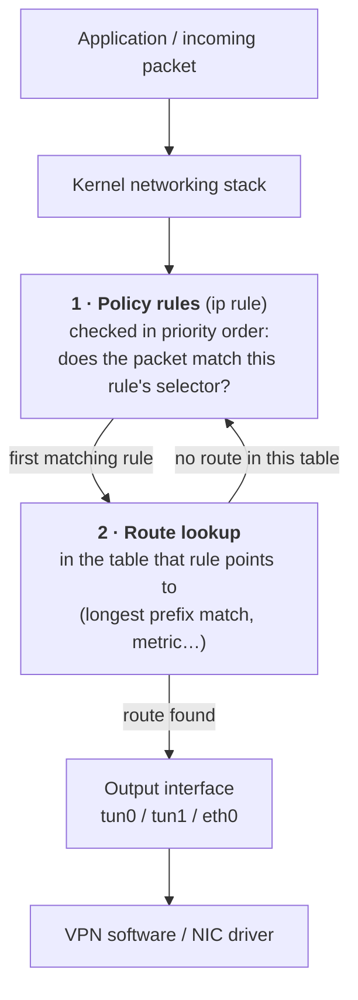
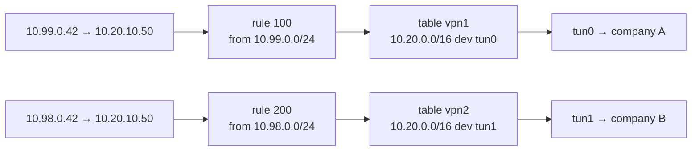
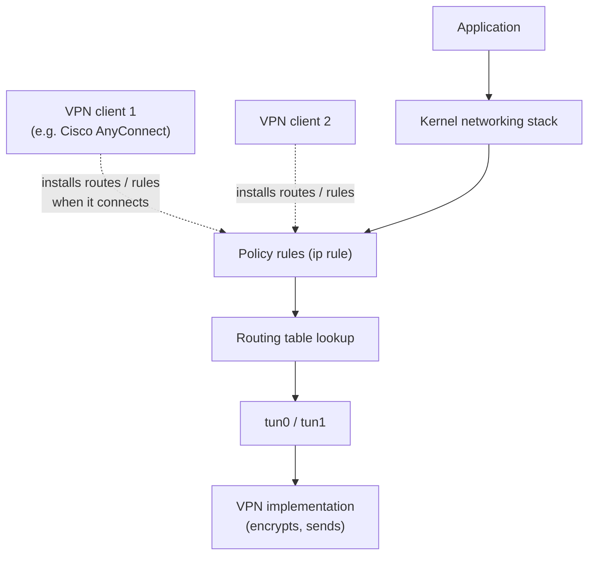

# Policy-based routing

> [!abstract] In one sentence
> Normal routing only looks at the **destination**. Policy-based routing (PBR) first looks at **other things about the packet** (source address, incoming interface, a mark, the user who sent it…) to pick **which routing table** to use, then does the normal lookup in that table.

## Why a single routing table isn't enough

A [[Routing tables|routing table]] answers "where does traffic **to X** go?". Some questions it simply can't express:

- "Traffic **from** the guest Wi-Fi goes out through the cheap ISP, traffic from the office LAN through the fiber"
- "Only my **torrent client** goes through the VPN, everything else goes direct"
- "Company A's `10.20.10.50` and company B's `10.20.10.50` are **two different machines**" (see [[Overlapping address spaces]])

The last one is the clearest example. Say two VPNs both push the same route:

```
10.20.0.0/16 dev tun0  metric 100   ← VPN1 (company A)
10.20.0.0/16 dev tun1  metric 200   ← VPN2 (company B)
```

A packet to `10.20.10.50` matches both. Same prefix length, so the metric decides: **everything goes to VPN1**. The packet is never sent to both, and there's no way to reach company B's `10.20.10.50`. The destination alone doesn't carry the information "which company I meant". Some **other** property of the packet has to.

## How it works on Linux

Routing is really **two steps**:



If the chosen table has **no matching route**, the kernel goes back and continues with the **next rule**. That's why the `main` table still works as a fallback.

The default rules on every Linux machine:

```
$ ip rule
0:      from all lookup local
32766:  from all lookup main
32767:  from all lookup default
```

So by default, everything ends up in `main`: that's "normal" routing.

### The two-VPN example, solved

Give each VPN its **own table** and a **rule** that sends the right traffic to it:

```bash
# one table per VPN (names are optional, numbers work too)
echo "100 vpn1" >> /etc/iproute2/rt_tables
echo "200 vpn2" >> /etc/iproute2/rt_tables

# the same prefix, in two different tables: no conflict
ip route add 10.20.0.0/16 dev tun0 table vpn1
ip route add 10.20.0.0/16 dev tun1 table vpn2

# which traffic uses which table
ip rule add from 10.99.0.0/24 lookup vpn1 priority 100
ip rule add from 10.98.0.0/24 lookup vpn2 priority 200
```

```
$ ip rule
0:      from all lookup local
100:    from 10.99.0.0/24 lookup vpn1
200:    from 10.98.0.0/24 lookup vpn2
32766:  from all lookup main
32767:  from all lookup default
```



Same destination, two different machines, no conflict: the **source** picked the routing domain.

> [!warning] `from` rules and local apps
> A `from` rule matches the packet's **source IP**. That works for **forwarded** traffic (other machines behind this router) and for apps that **bind** to a specific source IP. A normal app on the same machine doesn't choose a source before routing, so it won't match `from 10.99.0.0/24`. For local apps, use a **mark**, a **user ID** or an **interface** selector instead (below).

## What a rule can match on

| Selector | Example | Typical use |
|---|---|---|
| `from` (source prefix) | `from 10.99.0.0/24` | Different LANs → different uplinks/VPNs |
| `to` (destination prefix) | `to 8.8.8.8` | Rarely needed, normal routing already does it |
| `iif` (incoming interface) | `iif eth1` | Traffic arriving from the guest network |
| `oif` (outgoing interface) | `oif tun1` | Apps bound to an interface (`SO_BINDTODEVICE`, `curl --interface tun1`) |
| `fwmark` (firewall mark) | `fwmark 0x1` | Anything the firewall can match: ports, protocols, processes, cgroups |
| `uidrange` | `uidrange 1001-1001` | "Everything this Linux user runs goes through the VPN" |
| `ipproto`, `sport`, `dport` | `ipproto tcp dport 443` | Per protocol/port (newer kernels) |
| `tos` / `dsfield` | `tos 0x10` | QoS-based routing |

And what a rule can do: `lookup <table>` (the usual), `blackhole` / `unreachable` / `prohibit` (drop), `goto <priority>` (jump to another rule), and the modifier `suppress_prefixlength N` (ignore routes that are too broad, see the WireGuard example).

### Marks: the most flexible selector

The firewall (nftables / iptables `mangle` table) stamps an invisible number on the packet, then a rule routes by that number. Anything the firewall can see becomes a routing criterion:

```bash
# mark traffic to port 6881 (BitTorrent) ...
nft add rule inet mangle output tcp dport 6881 meta mark set 0x1
# ... and route marked packets through the VPN's table
ip rule add fwmark 0x1 lookup vpn1 priority 100
```

The mark only exists inside this machine. It's never sent on the wire.

## Real-world examples

### WireGuard full tunnel (`wg-quick`)

With `AllowedIPs = 0.0.0.0/0`, `wg-quick` does this instead of touching the main table:

```bash
wg set wg0 fwmark 51820                                # WireGuard marks its own encrypted packets
ip route add 0.0.0.0/0 dev wg0 table 51820             # table 51820: everything → tunnel
ip rule add not fwmark 51820 table 51820               # unmarked (normal) traffic → tunnel table
ip rule add table main suppress_prefixlength 0         # but use main's specific routes (LAN etc.), ignoring main's default route
```

- Normal traffic has no mark → goes to table 51820 → into the tunnel
- WireGuard's own encrypted packets **are** marked → skip that rule → use `main` → go out through the real internet. **No routing loop**, and no need for a host route to the server
- `suppress_prefixlength 0` means "look in main, but ignore routes with prefix length 0" (the default route). So my local LAN (`192.168.1.0/24` in main) still works directly

### Tailscale, Docker, Kubernetes

- **Tailscale** puts its routes in **table 52** and adds its own `ip rule`s, so it doesn't fight with other VPNs in `main`
- **Docker / Kubernetes CNIs** use marks and extra tables to steer pod and service traffic

### Two internet uplinks (multi-homing)

A server with two ISPs must answer each connection **through the ISP it came in on**, or the reply leaves with the wrong source IP and gets dropped:

```bash
ip route add default via 203.0.113.1 dev eth0 table isp1
ip route add default via 198.51.100.1 dev eth1 table isp2
ip rule add from 203.0.113.50 lookup isp1     # replies from my ISP1 address go out ISP1
ip rule add from 198.51.100.50 lookup isp2    # replies from my ISP2 address go out ISP2
```

## Stronger isolation: VRFs and network namespaces

(A hands-on namespace + veth lab is in [[Network interfaces]].)


Policy rules choose a table per packet. Two heavier tools separate routing domains **completely**:

| | **Policy rules + tables** | **VRF** (Virtual Routing and Forwarding) | **Network namespace** |
|---|---|---|---|
| What's separated | Only the route lookup | Interfaces are **assigned** to a VRF, each VRF has its own table | **Everything**: interfaces, routes, firewall, sockets, ARP |
| Choosing the domain | Per packet, by rules | By the interface the packet is on | By which namespace the process runs in |
| Typical use | Per-source / per-app routing | Routers carrying several customers' networks (MPLS VPNs), management networks | Containers, running an app "inside" a VPN |
| Linux | `ip rule`, `ip route ... table` | `ip link add vrf-a type vrf table 10` | `ip netns add vpn1`, `ip netns exec vpn1 curl …` |

VRFs are how carriers and big networks keep overlapping customer ranges apart on the same router. Cisco/Juniper routers call it a VRF too (`ip vrf`, `routing-instance`). On Cisco, "PBR" itself usually means a **route-map** applied to an interface (`match ip address …` / `set ip next-hop …`).

## Who is "in charge"?



VPN clients only **configure** the routes and rules (when they connect, and they remove them when they disconnect). The **kernel** makes the routing decision for every packet. Two VPN clients that both install the same route in `main` simply overwrite or shadow each other, and the kernel has no idea which one "should" win.

Two different questions, often mixed up:

| | Question | Answered by |
|---|---|---|
| **Routing** | "Given this packet, which interface/path?" | The routing table lookup |
| **VPN policy** | "Which traffic belongs to this VPN?" | Simple: just routes (`10.20.0.0/16 → tun0`). Advanced: rules/marks/namespaces that choose a table, which then points at the VPN interface |

## Things that break with PBR

- **Reverse path filtering (`rp_filter`)**: in strict mode (1), Linux drops an incoming packet if the route **back** to its source wouldn't use the interface it arrived on. PBR makes that check wrong easily. Fix: loose mode, `sysctl net.ipv4.conf.all.rp_filter=2`
- **Rules aren't saved**: `ip rule` and `ip route ... table` are lost on reboot. Persist them with NetworkManager, systemd-networkd, netplan, or a script
- **Order**: rules are checked from the lowest priority number up. A broad rule with a low number hides everything after it
- **DNS**: routing a destination through the VPN doesn't send the *DNS lookup* for it through the VPN. Split DNS is a separate setting (see [[VPN]])
- **Debugging**: `ip route get` accepts the policy selectors: `ip route get 10.20.10.50 from 10.98.0.42 iif eth1`, `ip route get 1.1.1.1 mark 0x1`

## In AWS
- No `ip rule` for me to write in a VPC. The route table is picked by **which subnet** the traffic comes from, so "per-subnet route tables" are AWS's version of source-based routing
- **Transit gateway route tables** are like VRFs: each attachment is associated with one TGW route table, so I can isolate VPCs from each other (prod can't reach dev) on the same TGW (see [[Connecting VPCs]])
- **Gateway route tables** (attached to an internet gateway) and **middlebox routing** send traffic through a firewall appliance before it reaches a subnet

## Related
- Depends on:: [[Routing tables]]
- Solves (partly):: [[Overlapping address spaces]]
- Used by:: [[VPN]] clients (WireGuard, Tailscale, split tunnels)
- Differs from:: [[ACL]] (decides allow/deny, not the path)

## Flashcards
#flashcards

What does policy-based routing add to normal routing? :: A step before the route lookup that picks which routing table to use, based on things other than the destination
Two VPNs both push 10.20.0.0/16 into the main table. What happens? :: Only one route is used (lowest metric). All traffic goes to one VPN, the other company's hosts are unreachable
Linux command to list policy rules? :: `ip rule`
Linux default rules and their priorities? :: 0 local, 32766 main, 32767 default
What happens if the table chosen by a rule has no matching route? :: The kernel continues with the next rule
Why doesn't `from 10.99.0.0/24` match traffic from a local app? :: The app hasn't chosen a source IP yet at routing time, unless it binds one. Use fwmark, uidrange or oif instead
What is an fwmark? :: A number the firewall attaches to a packet inside the machine, which ip rules can route on
How does wg-quick avoid a routing loop in full-tunnel mode? :: WireGuard marks its own packets. `not fwmark` sends only unmarked traffic to the tunnel table
What does `suppress_prefixlength 0` do? :: Uses the table but ignores its default route (prefix length 0), so specific routes like the LAN still apply
VRF vs network namespace? :: VRF separates routing per interface. A namespace separates the whole network stack (interfaces, routes, firewall, sockets)
Why set rp_filter to 2 with PBR? :: Strict reverse-path filtering drops packets that legitimately arrive on a different interface than the route back uses
Who actually makes the routing decision, the VPN client or the kernel? :: The kernel. VPN clients only install routes and rules
AWS equivalent of VRFs on a transit gateway? :: Multiple TGW route tables, each attachment associated with one
