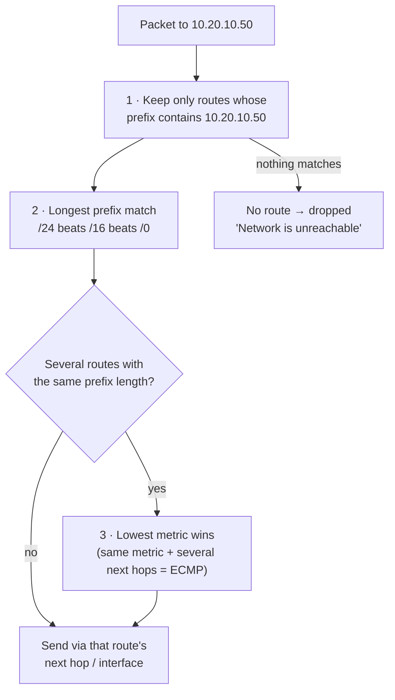

# Routing tables

> [!abstract] In one sentence
> A routing table is the list a machine checks for **every packet** to answer one question: "for this **destination**, which **interface** and which **next hop** do I send it to?". The most specific matching route wins.

## What a route is

A route is a line like this:

```
10.20.0.0/16  via 192.168.1.1  dev eth0  proto static  metric 100  src 192.168.1.50
└─ prefix ──┘ └─ next hop ───┘ └─ out ─┘ └─ who added ┘ └ priority ┘ └ source IP hint ┘
```

| Part | Meaning |
|---|---|
| **Destination prefix** | Which destinations this route covers (`10.20.0.0/16` = `10.20.0.0` to `10.20.255.255`) |
| **Next hop** (`via`) | The router to hand the packet to. No `via` = the destination is **directly connected** on that link |
| **Interface** (`dev`) | The network card (or virtual interface, like a VPN's `tun0`) the packet leaves through |
| **Metric** | Priority between routes for the **same prefix**. Lower wins |
| **Protocol** (`proto`) | Who put it there: `kernel` (connected), `static`, `dhcp`, `bgp`, `ospf`… |
| **Source hint** (`src`) | The source IP to use if the app didn't choose one |

The special route `0.0.0.0/0` (**default route**) matches everything. It's the "if nothing else matches, send it here" route, usually pointing at the internet router.

## How a route is chosen

For each packet, in this order:



**1. Longest prefix match (LPM).** The most specific route always wins, whatever the metric:

| Route | Matches `10.20.10.50`? | Prefix length |
|---|---|---|
| `0.0.0.0/0 via 192.168.1.1` | ✅ | 0 |
| `10.0.0.0/8 dev tun0` | ✅ | 8 |
| `10.20.0.0/16 dev tun1` | ✅ | 16 |
| `10.20.10.0/24 dev tun2` | ✅ | **24 ← wins** |
| `10.30.0.0/16 dev tun3` | ❌ | |

**2. Metric (tie-breaker).** Only between routes with the **exact same prefix** in the same table. Typical use: a laptop with Ethernet (metric 100) and Wi-Fi (metric 600) both giving a default route. Ethernet wins, Wi-Fi is the backup.

**3. ECMP (Equal-Cost Multi-Path).** Same prefix, same metric, several next hops: traffic is spread across them, usually **per flow** (a hash of the IPs/ports) so one TCP connection stays on one path.

> [!important] The routing table never sends a packet to two places
> If two routes match equally, the kernel still picks **one**. Routing answers "which single path?", never "all of them".

## Administrative distance (between routing sources)

On a router running several routing protocols, two protocols might both offer a route to `10.20.0.0/16`. Their metrics can't be compared (OSPF cost vs BGP attributes), so routers (Cisco's term) first rank the **source**:

| Source | Admin distance (Cisco) |
|---|---|
| Directly connected | 0 |
| Static route | 1 |
| eBGP | 20 |
| OSPF | 110 |
| RIP | 120 |
| iBGP | 200 |

Lower = more trusted. The winner goes into the table, **then** the metric only compares routes from the same protocol. Linux has no admin distance. Each routing daemon (FRR, BIRD…) decides what to install, and the kernel just uses prefix length + metric.

## What a route can point at

A route is fundamentally **destination prefix → forwarding action**. The action is often "send to next-hop IP X", but it doesn't have to be: a next hop is just whatever lets the forwarding plane decide where the packet goes next.

| The route points at | Example | How the packet actually leaves |
|---|---|---|
| A **next-hop IP** on a shared link | `10.20.0.0/16 via 192.168.1.1 dev eth0` | The router resolves `192.168.1.1` to a MAC with [[ARP]], then sends a frame to that MAC |
| An **interface only** (point-to-point, tunnel) | `10.20.0.0/16 dev wg0`, `dev tun0`, a GRE or PPP link | There's only one possible receiver on the other end, so no next-hop IP and **no ARP**: the packet is simply handed to the interface (which may encrypt and encapsulate it) |
| A **next-hop object** | Linux `ip nexthop add id 10 via 192.168.1.1 dev eth0`, then `ip route add 10.20.0.0/16 nhid 10` | Many routes share one object; change the object, every route follows. Routers do the same internally |
| **Another table / VRF** | Route leaking into VRF `blue`, `ip rule … lookup 100` | The lookup continues somewhere else |
| A **drop action** | `blackhole`, `unreachable`, `null0` | Discarded (with or without an ICMP error) |
| A **label** | MPLS: push label 200 and send to the next router | Routers along the path switch on labels, not on IP addresses |

How a router turns a route into a frame: the **FIB** (below) gives the next hop, and a separate **adjacency** table holds the ready-made Layer 2 information for it (destination MAC, outgoing interface), built from ARP. Only links that need Layer 2 addressing (Ethernet) need an adjacency with a MAC; tunnels and point-to-point links don't.

So "a route points at something with no IP and no MAC" isn't exotic. Tunnels do it, MPLS does it, and cloud routers do it everywhere: a cloud route table points at **objects** (a gateway ID, an attachment ID) and the provider's network resolves the object to a path (see "In AWS" below, and [[Transit gateway attachments#Is an attachment a network interface?]]).

## RIB vs FIB

- **RIB** (Routing Information Base): every route the router knows, from every source, including backups
- **FIB** (Forwarding Information Base): only the winners, in a fast lookup structure that forwarding actually uses

On Linux, `ip route` shows roughly the FIB. On a router, `show ip route` shows the winners and routing protocols keep their own candidate lists.

## Linux in practice

Linux has **several routing tables**, not one:

| Table | ID | What's in it |
|---|---|---|
| `local` | 255 | My own addresses and broadcast addresses (filled automatically, don't touch) |
| `main` | 254 | The normal table. What `ip route` shows |
| `default` | 253 | Empty by default, the last resort |
| Custom tables | 1–252 or any number | Created for [[Policy-based routing]] (VPNs, multiple uplinks) |

Which table gets consulted is decided by the **routing policy rules** (`ip rule`). By default: `local`, then `main`, then `default`. See [[Policy-based routing]], which is where it gets interesting.

```bash
ip route                         # main table
ip route show table all          # every table
ip route get 10.20.10.50         # "what would the kernel do with this packet?" ← the best debugging tool
ip route add 10.20.0.0/16 via 192.168.1.1 dev eth0 metric 100
ip route add blackhole 10.66.0.0/16     # silently drop
ip route add unreachable 10.67.0.0/16   # drop + ICMP "unreachable" to the sender
```

Route **types** besides normal (unicast): `local`, `broadcast`, `blackhole` (drop silently), `unreachable` / `prohibit` (drop and answer with an [[ICMP]] error), `throw` (stop looking in this table, go back to the rules).

### Routing for my own traffic vs forwarded traffic

- **Locally generated** (an app on this machine): routing happens when the app sends. It also chooses the **source IP** if the app didn't bind one (from the route's `src` or the interface's address)
- **Forwarded** (a router, a VPN gateway, a Docker host): the packet arrives on one interface and is routed out another. Only happens if forwarding is on: `sysctl net.ipv4.ip_forward=1`

### How a VPN changes the table

When a VPN client connects, it **adds routes** pointing at its virtual interface. Nothing magic, just routes:

```
# split tunnel: only company ranges go through the VPN
10.20.0.0/16 dev tun0
172.16.0.0/12 dev tun0

# full tunnel: everything goes through the VPN
0.0.0.0/1     dev tun0     # these two /1s are more specific than 0.0.0.0/0,
128.0.0.0/1   dev tun0     # so they win without deleting the normal default route
203.0.113.10 via 192.168.1.1 dev eth0   # but the VPN server itself must still go via the real internet
```

That last line is essential: without it, the encrypted packets to the VPN server would be routed **into the tunnel itself** (a routing loop). More in [[VPN]].

## In AWS

A [[VPC]] route table is the same idea, attached to **subnets**:
- Longest prefix match applies (`10.0.0.0/16 → local` vs `0.0.0.0/0 → igw-…`)
- Targets are AWS objects instead of IPs: internet gateway, NAT gateway, peering connection, transit gateway, virtual private gateway (VPN), a network interface, a firewall endpoint. A VPC route table **never** takes a next-hop IP: the VPC network resolves the object to a path itself ([[Transit gateway attachments#Is an attachment a network interface?]])
- Every table has the **`local`** route for the VPC CIDR
- Routes can come from me (**static**) or be learned from a VPN / Direct Connect through BGP (**propagated**). For the same prefix, **static beats propagated**
- A **transit gateway** has its own route tables, and several of them act like separate routing domains (see [[Connecting VPCs]])

## Easy to get wrong
- **Metric doesn't beat prefix length.** A `/24` with metric 1000 wins over a `/16` with metric 1
- **Routes are one-way.** A reaching B needs a route on A's side **and** a route back on B's side. Missing the return route = the request arrives but the reply is lost ("works in tcpdump, times out in the app")
- **Asymmetric routing**: requests go one way and replies come back another way. Stateful firewalls (and Linux's reverse path filter) drop the replies because they never saw the request
- A route to a next hop that isn't reachable on a directly connected network gets rejected ("Nexthop has invalid gateway")

## Related
- Similar to:: a postal sorting table: the most precise address match decides the bin
- Differs from:: [[ACL]] (decides *whether* a packet may pass, not *where* it goes)
- Depends on:: IP prefixes / CIDR (see [[VPC]])
- Next:: [[Policy-based routing]] → [[Overlapping address spaces]]
- Protocols that fill routing tables automatically: [[AS and BGP|BGP]], OSPF
- In AWS:: [[Transit gateway routing]] (a VPC table and a TGW table per hop, static vs propagated routes)

## Flashcards
#flashcards

What is a route, fundamentally? :: Destination prefix → forwarding action. The action can be a next-hop IP, an interface, a next-hop object, another table, a drop, or a label
Why does `10.20.0.0/16 dev wg0` need no next-hop IP and no ARP? :: A point-to-point/tunnel interface has only one possible receiver; the packet is handed to the interface
What is an adjacency table? :: Ready-made Layer 2 info (MAC, interface) for each next hop, built from ARP, used with the FIB to build frames

What does a routing table decide? :: For each packet's destination: the outgoing interface and next hop
What is longest prefix match? :: Among all matching routes, the most specific prefix (largest /n) wins
Does a lower metric beat a longer prefix? :: No. Prefix length first, metric only breaks ties between identical prefixes
What is the default route? :: `0.0.0.0/0`, matches everything, used when nothing more specific matches
What is ECMP? :: Several equal routes (same prefix and metric) sharing traffic, usually per flow
What is administrative distance? :: A router's trust ranking of route sources (connected 0, static 1, eBGP 20, OSPF 110, iBGP 200), used before metrics
RIB vs FIB? :: RIB = all known routes. FIB = the chosen ones used for forwarding
Linux's three built-in routing tables? :: local (255), main (254), default (253)
Best command to see how Linux will route a packet? :: `ip route get <destination>`
Why does a full-tunnel VPN add `0.0.0.0/1` and `128.0.0.0/1`? :: They're more specific than the default route so they win, without deleting it
Why does a VPN add a host route to its own server via the real gateway? :: Otherwise the encrypted packets would be routed into the tunnel itself (loop)
blackhole vs unreachable route? :: blackhole drops silently. unreachable drops and sends an ICMP error
What must be enabled for Linux to forward packets between interfaces? :: `net.ipv4.ip_forward=1`
In an AWS route table, static vs propagated route for the same prefix? :: Static wins
