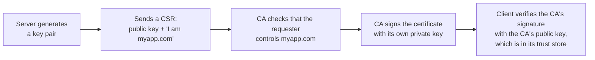
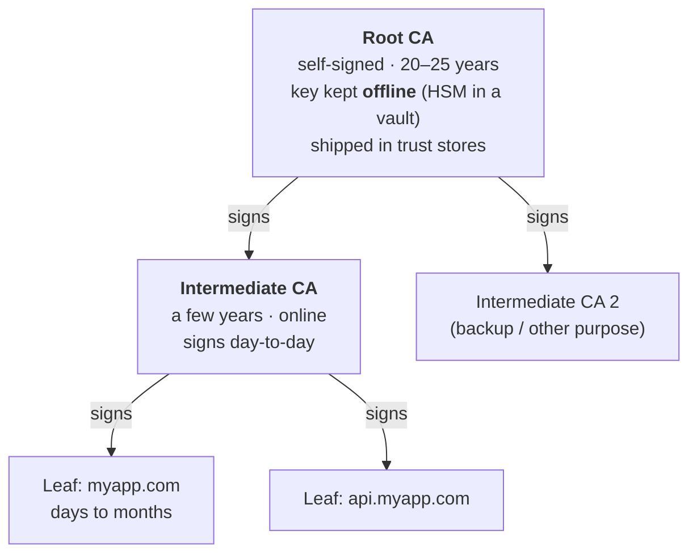
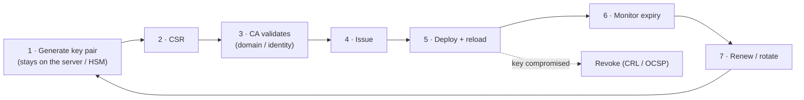

# Certificates and PKI

> [!abstract] In one sentence
> A **certificate** is a signed statement "this **public key** belongs to **this name**", and **PKI** (Public Key Infrastructure) is everything around it: the **CAs** that sign, the **trust stores** that decide which CAs to believe, and the processes to issue, validate, rotate and revoke certificates.

## Why certificates exist

Public-key crypto lets a server prove "I hold the private key matching this public key" (see [[Encryption basics]]). But that proves nothing about **who** it is: an attacker has key pairs too. The missing piece is a trusted third party binding the key to a name:



Trust is **transferred**: I trust the CA → the CA vouches for `myapp.com` → I trust that this key is `myapp.com`'s.

## What's inside an X.509 certificate

```bash
openssl x509 -in cert.pem -noout -text
```

| Field | Example | Meaning |
|---|---|---|
| **Version** | 3 | X.509 v3 (the one with extensions) |
| **Serial number** | `04:a1:…` | Unique per CA. Used for revocation |
| **Signature algorithm** | `ecdsa-with-SHA256` | How the CA signed it |
| **Issuer** | `C=US, O=Let's Encrypt, CN=E6` | The CA that signed it |
| **Validity** | Not Before / **Not After** | The dates it's valid between |
| **Subject** | `CN=myapp.com` | Who it's for (the CN is legacy for hostnames) |
| **Subject Public Key Info** | EC P-256 / RSA 2048 | The public key being certified |
| **Extensions** | (below) | Where the real rules are |
| **CA's signature** | | Over all of the above |

The extensions that matter:

| Extension                              | What it says                                                                                                                          |
| -------------------------------------- | ------------------------------------------------------------------------------------------------------------------------------------- |
| **Subject Alternative Name (SAN)**     | The names it's valid for: `DNS:myapp.com, DNS:*.myapp.com`, IPs, emails, **URIs** (SPIFFE IDs). **Clients check the SAN**, not the CN |
| **Key Usage**                          | What the key may do: `digitalSignature`, `keyEncipherment`, `keyCertSign` (CAs only)                                                  |
| **Extended Key Usage (EKU)**           | `serverAuth`, `clientAuth` (see [[mTLS]]), `codeSigning`, `emailProtection`                                                           |
| **Basic Constraints**                  | `CA:TRUE` / `CA:FALSE`, and `pathlen` (how many CAs may sit below it)                                                                 |
| **Authority / Subject Key Identifier** | Links a certificate to the key of its issuer (helps chain building)                                                                   |
| **CRL Distribution Points**            | Where to download the revocation list                                                                                                 |
| **Authority Information Access**       | Where to get the issuer's certificate (and OCSP, if any)                                                                              |
| **SCTs**                               | Proof the certificate was logged in Certificate Transparency                                                                          |
| **Name Constraints**                   | On a CA: "may only sign names under `*.corp.example.com`"                                                                             |

## The chain of trust



- **Root**: signs itself. Trusted only because it's **preinstalled** in a trust store. Its key is so valuable it's kept offline and used only to sign intermediates
- **Intermediates**: do the daily signing. If one is compromised, it can be revoked without replacing the root in every device on earth
- **Leaf** (end-entity): the server or client certificate
- The **server sends leaf + intermediates** (not the root). The client builds the path up to a root it already has

Verifying a chain means, for each link: the signature is valid, the dates are valid, the issuer is allowed to be a CA (`CA:TRUE`, path length), name constraints are respected, nothing is revoked, and at the top there's a **trusted root**. Then the leaf's SAN must match the name I connected to.

## Trust stores: who decides which CAs to believe

| Trust store | Used by |
|---|---|
| **Mozilla NSS / Chrome Root Store / Apple / Microsoft** | Browsers and operating systems. Each runs its own program for admitting (and removing) CAs |
| **Linux system bundle** (`/etc/ssl/certs/ca-certificates.crt`, `/etc/pki/tls/certs/ca-bundle.crt`) | curl, most CLI tools, many languages. Add a private CA with `update-ca-certificates` (Debian/Ubuntu) or `update-ca-trust` (RHEL/Amazon Linux) |
| **Java `cacerts`** | Java apps. Managed with `keytool`, **separate** from the OS store |
| **Python `certifi`, Node.js** | Often bundle **their own** CA list |
| **App-specific** | A bundle passed explicitly: `--cacert`, `sslrootcert=`, an ALB/API Gateway trust store |

→ "Works in the browser, fails in Java/Python/curl" almost always means **different trust stores** (a private CA added to one but not the other) or a **missing intermediate** (browsers can fetch it, most libraries don't).

## Public CA vs private CA

| | **Public CA** (Let's Encrypt, DigiCert, Sectigo, Amazon via ACM) | **Private CA** (AWS Private CA, Vault, step-ca, AD CS, the Kubernetes cluster CA) |
|---|---|---|
| Trusted by | Every browser and OS | Only machines where I install its root |
| Names allowed | Public domains I can prove I control | Anything: `payments.internal`, `spiffe://…`, device IDs |
| Rules | CA/Browser Forum rules: max lifetime (47 days by 2029), validation, **Certificate Transparency** logging | My own rules: any lifetime, any EKU |
| Use for | Public websites and APIs | Internal services, [[mTLS]] clients, devices, VPNs, service meshes |

Don't use public certificates for internal names: every public certificate is published in **CT logs**, which leaks internal hostnames, and public CAs can't issue for `.internal` names anyway.

### Validation levels (public certificates)

| Level | CA checks | Today |
|---|---|---|
| **DV** (Domain Validated) | Control of the domain (DNS record, HTTP file, email) | The vast majority (Let's Encrypt, ACM) |
| **OV** (Organization Validated) | + the organization exists | Details visible only inside the certificate |
| **EV** (Extended Validation) | + extensive legal checks | Browsers **no longer show** it specially, so little benefit |

### Controls on public CAs

- **Certificate Transparency (CT)**: every public certificate is written to public append-only logs. Browsers require proof (SCTs). I can search all certificates for my domain on `crt.sh`, and monitor for certificates I didn't request
- **CAA DNS record**: lists which CAs may issue for my domain: `myapp.com. CAA 0 issue "amazon.com"`. Other CAs must refuse
- **Root program removals**: browsers can **distrust** a CA that misbehaves (Symantec 2018, Entrust 2024), forcing everyone using it to change

## The certificate lifecycle



Step 7 in detail, and how AWS automates it: [[Certificate rotation]].

A **CSR** (Certificate Signing Request) contains the public key and the requested names, **signed with the private key** (proving I hold it). The private key itself never goes to the CA:

```bash
openssl req -new -newkey ec -pkeyopt ec_paramgen_curve:P-256 -nodes \
  -keyout myapp.key -out myapp.csr -subj "/CN=myapp.com" \
  -addext "subjectAltName=DNS:myapp.com,DNS:www.myapp.com"
openssl req -in myapp.csr -noout -text      # check it before sending
```

### Revocation

For certificates that must die **before** they expire (key leaked, mis-issued):
- **CRL** (Certificate Revocation List): the CA publishes a signed list of revoked serial numbers. Simple, cacheable, can get big
- **OCSP**: a live "is serial X revoked?" query. Privacy and availability problems. **OCSP stapling** has the server attach a fresh response. Let's Encrypt dropped OCSP in 2025 and uses CRLs
- In practice clients check revocation inconsistently, which is why the industry is moving to **short lifetimes**

## Key types

| Key | Notes |
|---|---|
| **RSA 2048 / 3072 / 4096** | Supported everywhere. Bigger and slower than EC |
| **ECDSA P-256 / P-384** | Smaller, faster handshakes. The modern default for TLS certificates |
| **Ed25519** | Great for SSH and WireGuard keys, but poorly supported in public web PKI |

## File formats (the endless confusion)

| Format | Extension | Contains | Looks like |
|---|---|---|---|
| **PEM** | `.pem`, `.crt`, `.cer`, `.key` | Certificate(s) and/or key, Base64 | `-----BEGIN CERTIFICATE-----` |
| **DER** | `.der`, `.cer` | One certificate, binary | Unreadable bytes |
| **PKCS#7** | `.p7b`, `.p7c` | Certificates / chain, **no key** | `-----BEGIN PKCS7-----` |
| **PKCS#12** | `.pfx`, `.p12` | Certificate + chain + **private key**, password-protected | Binary. Windows, browsers, Java |
| **JKS** | `.jks` | Java keystore | Java only (PKCS#12 is now Java's default too) |

Private keys in PEM: `BEGIN PRIVATE KEY` (PKCS#8, generic), `BEGIN RSA PRIVATE KEY` (PKCS#1, old RSA-only), `BEGIN EC PRIVATE KEY`.

```bash
openssl x509 -in cert.der -inform der -out cert.pem                       # DER → PEM
openssl pkcs12 -export -in cert.pem -inkey key.pem -certfile chain.pem -out bundle.pfx   # PEM → PFX
openssl pkcs12 -in bundle.pfx -nodes -out all.pem                         # PFX → PEM
# does this key match this certificate? (the two outputs must be identical)
openssl x509 -in cert.pem -noout -pubkey | openssl sha256
openssl pkey -in key.pem -pubout | openssl sha256
```

**Chain files**: order matters, **leaf first, then intermediates**. `fullchain.pem` (certbot) = leaf + intermediates. ACM import takes the certificate and the chain separately.

## In AWS

| Service | Role in PKI |
|---|---|
| [[Certificate Manager (ACM)\|ACM]] | Public certificates (Amazon's CA, DV), managed renewal, private certificates via Private CA, import of external ones |
| **AWS Private CA** | My own private CA hierarchy (root + subordinates), keys in HSMs, CRL/OCSP, short-lived mode, used by EKS/ECS/IoT/Roles Anywhere |
| **IoT Core** | Device certificate registry, can use my CA |
| **IAM Roles Anywhere** | Trusts my CA to hand AWS credentials to certificate holders (see [[Workload identity (SPIFFE)]]) |
| **CloudHSM / KMS** | Protect CA and signing keys (KMS supports asymmetric keys and signing, but it doesn't issue certificates) |
| **IAM server certificates** | Legacy upload of certificates for where ACM isn't available |

## Easy to get wrong
- Checking the **CN** instead of the **SAN** (clients ignore the CN for hostnames)
- Sending the leaf **without the intermediate**
- Chain file in the **wrong order**
- A private CA added to the OS store but not to **Java's** or Python's
- `*.myapp.com` doesn't cover `myapp.com` or `a.b.myapp.com`
- Using **public** certificates for internal hostnames (leaked via CT)
- Losing the root CA key, or keeping it online
- Mixing up **certificate** (public, can be shared) and **private key** (never leaves its owner)

## Related
- Depends on:: [[Encryption basics]]
- Used by:: [[TLS]], [[mTLS]], [[IPsec and IKE]], [[VPN]], [[Service mesh]], [[Workload identity (SPIFFE)]]
- Lifecycle:: [[Certificate rotation]]
- AWS:: [[Certificate Manager (ACM)]]

## Flashcards
#flashcards

What does a certificate bind together? :: A public key and a name (identity), signed by a CA
What is PKI? :: The CAs, trust stores, certificates and processes to issue, validate, rotate and revoke them
Which field do clients check for the hostname? :: The Subject Alternative Name (SAN), not the CN
What does Basic Constraints CA:TRUE mean? :: The certificate may sign other certificates
What does Extended Key Usage say? :: What the certificate is for: serverAuth, clientAuth, codeSigning…
Why do intermediates exist? :: The root key stays offline. A compromised intermediate can be revoked without replacing the root everywhere
What does a server send in the handshake? :: Its leaf certificate + intermediates (not the root)
What is a trust store? :: The set of root CAs a client trusts
"Works in the browser, fails in Java" usually means? :: Different trust stores, or a missing intermediate that the browser fetched on its own
Public vs private CA? :: Public: trusted everywhere, only for public domains, CT-logged. Private: trusted only where installed, any names and rules
What is Certificate Transparency? :: Public logs of every issued public certificate, used to detect mis-issuance
What is a CAA record? :: A DNS record listing which CAs may issue for a domain
What is a CSR? :: The public key + requested names, signed with the private key, sent to the CA
CRL vs OCSP? :: CRL: a downloadable list of revoked serials. OCSP: a live per-certificate query
PEM vs DER vs PFX? :: PEM: Base64 text. DER: binary. PFX/PKCS#12: certificate + chain + private key, password-protected
How to check that a key matches a certificate? :: Compare the hash of their public keys (openssl x509 -pubkey vs openssl pkey -pubout)
Chain file order? :: Leaf first, then intermediates
DV vs OV vs EV? :: DV checks domain control. OV adds the organization. EV adds legal checks (no longer shown by browsers)
