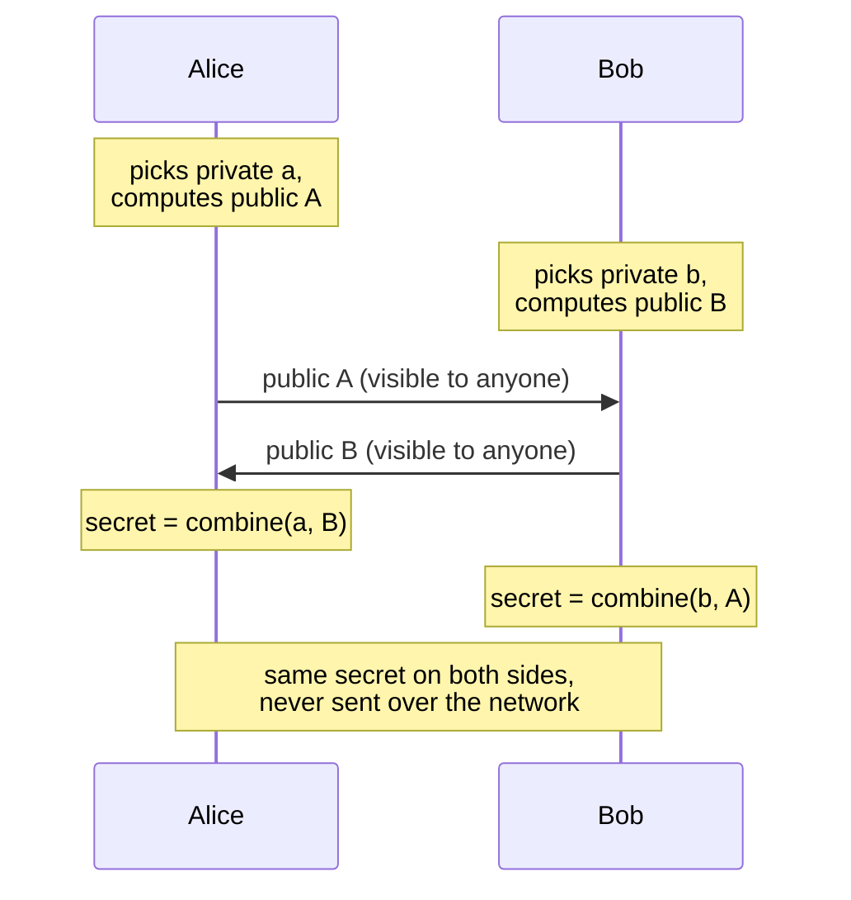
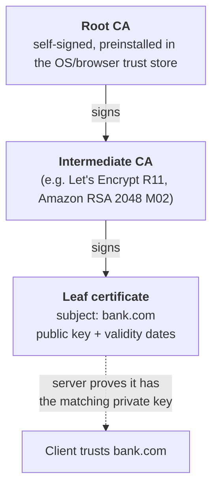
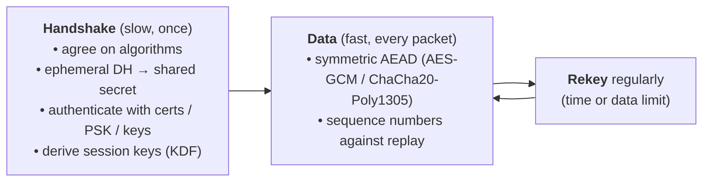

# Encryption basics

> [!abstract] In one sentence
> Every secure protocol ([[TLS]], [[IPsec and IKE|IPsec/IKE]], WireGuard, SSH) uses the same recipe: **asymmetric crypto** to prove who's who and agree on a secret over an open network, then fast **symmetric crypto** with that secret to encrypt and protect the actual data.

## What "secure" means (four different guarantees)

| Guarantee | Question it answers | Provided by |
|---|---|---|
| **Confidentiality** | Can someone in the middle read it? | Encryption (AES, ChaCha20) |
| **Integrity** | Was it modified on the way? | MAC / AEAD tag |
| **Authentication** | Am I really talking to *them*? | Signatures + certificates, pre-shared keys, known public keys |
| **Forward secrecy** | If their key is stolen **next year**, can recordings of **today's** traffic be decrypted? | Ephemeral Diffie-Hellman |

Encryption alone gives only the first. A protocol without authentication is encrypted **to the attacker** in a man-in-the-middle attack.

## The building blocks

### Symmetric encryption: one shared key

The same key encrypts and decrypts. Very fast (hardware-accelerated), used for **all bulk data**.

- **AES** (128 or 256-bit keys): the standard. CPUs have AES instructions (AES-NI)
- **ChaCha20**: fast in software, great on phones and in WireGuard
- Problem: **how do both sides get the same key** without sending it in the clear? → key exchange

### Asymmetric (public-key) crypto: a key pair

A **public key** (shared with everyone) and a **private key** (never leaves its owner). Slow, so used only for small operations:

| Use | How |
|---|---|
| **Signatures** (prove identity) | Sign with the private key, anyone verifies with the public key. RSA, ECDSA, Ed25519 |
| **Key exchange** (agree on a secret) | Diffie-Hellman (below). RSA encryption of a secret was used in old TLS, now removed |

### Hashes, MACs and AEAD

- **Hash** (SHA-256, SHA-384, BLAKE2): a fixed-size fingerprint of any data. One-way, and any change gives a completely different result
- **MAC / HMAC**: a hash mixed with a secret key. Proves the data wasn't changed **and** came from someone with the key
- **AEAD** (Authenticated Encryption with Associated Data): encryption + integrity in one step. **AES-GCM** and **ChaCha20-Poly1305**. The modern default in TLS 1.3, WireGuard and IKEv2/ESP. Older setups combine them separately (AES-CBC + HMAC-SHA256)
- **KDF** (key derivation function, e.g. HKDF): turns one shared secret into several independent keys (one per direction, one for encryption, one for integrity…)

## Diffie-Hellman: agreeing on a secret in public

The trick that makes the internet work. Both sides exchange **public values**, and each combines the other's public value with its own private value. Both end up with the **same secret**, and someone who saw only the public values can't compute it.

- Modern versions use elliptic curves: **ECDH**, **X25519** (Curve25519)
- In IPsec/IKE, the "**DH group**" is which math/size to use: group 14 (2048-bit MODP), 19/20/21 (elliptic curves), 31 (Curve25519)
- ⚠️ DH on its own **doesn't authenticate**. An attacker in the middle can do one DH with Alice and another with Bob. That's why the DH values are **signed** (certificate), or mixed with a pre-shared key or known static keys

## Forward secrecy (PFS)

If DH keys are **ephemeral** (new random ones for every session, deleted afterwards), then stealing a server's long-term private key later only lets an attacker **impersonate** it in the future. It **can't decrypt** traffic recorded in the past, because those session keys are gone.

- TLS 1.3: always (ECDHE only)
- TLS 1.2: only with `ECDHE`/`DHE` cipher suites (old `RSA` key exchange has none)
- IPsec: the IKE SA always uses DH. For **Child SAs** (the data tunnels), a new DH on each rekey is the "**PFS**" option in the phase 2 settings
- WireGuard: new ephemeral keys every handshake (at least every 2 minutes)

## Certificates and PKI

> Short version here. Full note (X.509 fields, trust stores, formats, public vs private CAs) → [[Certificates and PKI]]

How do I trust that a public key really belongs to `bank.com`? Someone I already trust vouches for it:

A **certificate** = a public key + an identity (domain names in the **SAN** field) + validity dates + the CA's **signature**. Checking one:
1. The **chain** goes up to a root in my trust store
2. The **name** I connected to is in the SAN
3. It's within its **dates**, and not **revoked**
4. The server proves it holds the **private key** (by signing something in the handshake)

Also used for: **client certificates** (mTLS), IPsec peers (instead of a PSK), code signing. A company can run its own **private CA** (AWS Private CA) for internal names.

## Authentication methods compared

| Method | How it works | Used in |
|---|---|---|
| **Certificates** (X.509) | A CA vouches for the key | TLS, IKE, OpenVPN, mTLS |
| **Pre-shared key (PSK)** | Same secret configured on both sides | IPsec site-to-site (AWS default), Wi-Fi WPA2-Personal |
| **Known public keys** | Each side is configured with the other's public key, no CA | WireGuard, SSH (`known_hosts`, `authorized_keys`) |
| **Username/password, MFA, EAP** | On top of a server-authenticated channel | Remote-access VPNs, web logins |

## The universal pattern

| Protocol | Handshake | Data protection |
|---|---|---|
| [[TLS]] 1.3 | ClientHello/ServerHello with ECDHE + certificate | AES-GCM / ChaCha20-Poly1305 records |
| [[IPsec and IKE\|IPsec]] | IKEv2: IKE_SA_INIT (DH) + IKE_AUTH (PSK/certs) | ESP packets (AES-GCM…) |
| WireGuard | Noise IK: Curve25519 static + ephemeral keys | ChaCha20-Poly1305 |
| SSH | Key exchange (curve25519-sha256) + host key signature | AES-GCM / ChaCha20-Poly1305 |

## Current recommendations (2026)

- **Use**: AES-GCM or ChaCha20-Poly1305, SHA-256/384, ECDHE/X25519 (DH group 19, 20 or 31), Ed25519 or ECDSA P-256 / RSA ≥ 2048 for signatures, TLS 1.2+ (prefer 1.3), IKEv2
- **Avoid**: DES/3DES, RC4, MD5, SHA-1, DH groups 1, 2, 5, TLS ≤ 1.1, IKEv1 aggressive mode with PSK
- **Post-quantum**: a future quantum computer could break today's DH and RSA, so "record now, decrypt later" is a real concern. Browsers and big sites already use **hybrid** key exchange (**X25519MLKEM768** in TLS 1.3: classic X25519 + the post-quantum ML-KEM together). IKEv2 has an extension for extra key exchanges (RFC 9370) for the same purpose

## Easy to get wrong
- **Encrypted ≠ authenticated**: without checking the certificate (e.g. `curl -k`, "accept any certificate"), a man in the middle gets everything
- **Hash ≠ encryption**: a hash can't be "decrypted". Passwords should be stored with slow, salted password hashes (bcrypt, scrypt, Argon2), not SHA-256
- **Base64 is not encryption**, just encoding
- **Private keys** must never leave their owner. A leaked private key = anyone can impersonate that server until the certificate is revoked

## Related
- Used by:: [[TLS]], [[IPsec and IKE]], [[VPN]]
- Compared:: [[IPsec vs TLS vs WireGuard vs SSH]]
- In AWS:: [[Certificate Manager (ACM)]] (public/private certificates), KMS (managed keys)

## Flashcards
#flashcards

The four guarantees of a secure channel? :: Confidentiality, integrity, authentication, forward secrecy
Symmetric vs asymmetric crypto? :: Symmetric: one shared key, fast, for data. Asymmetric: public/private key pair, slow, for signatures and key exchange
What does Diffie-Hellman do? :: Lets two sides agree on a shared secret by exchanging only public values
Why is DH alone not enough? :: It doesn't authenticate, so a man in the middle can run DH with each side. The DH values must be signed or tied to a PSK/known key
What is forward secrecy? :: Stealing a long-term private key later doesn't decrypt past traffic, because session keys came from ephemeral DH and were deleted
What is AEAD? :: Encryption and integrity in one operation (AES-GCM, ChaCha20-Poly1305)
MAC vs hash? :: A MAC uses a secret key, so it proves integrity and origin. A plain hash anyone can compute
What is in a certificate? :: A public key, identity (SAN names), validity dates, and the CA's signature
Four checks on a server certificate? :: Chain to a trusted root, name in SAN, dates valid and not revoked, server proves it holds the private key
PSK vs certificates vs known public keys? :: PSK: same secret on both sides (IPsec). Certificates: a CA vouches (TLS). Known keys: configured directly (WireGuard, SSH)
In IKE, what is the "DH group"? :: Which Diffie-Hellman variant/size to use (14 = 2048-bit, 19/20/21 = elliptic curves, 31 = Curve25519)
What does "PFS" mean in IPsec phase 2 settings? :: Doing a fresh DH exchange for each Child SA / rekey
What is X25519MLKEM768? :: A hybrid classic + post-quantum key exchange used in TLS 1.3
