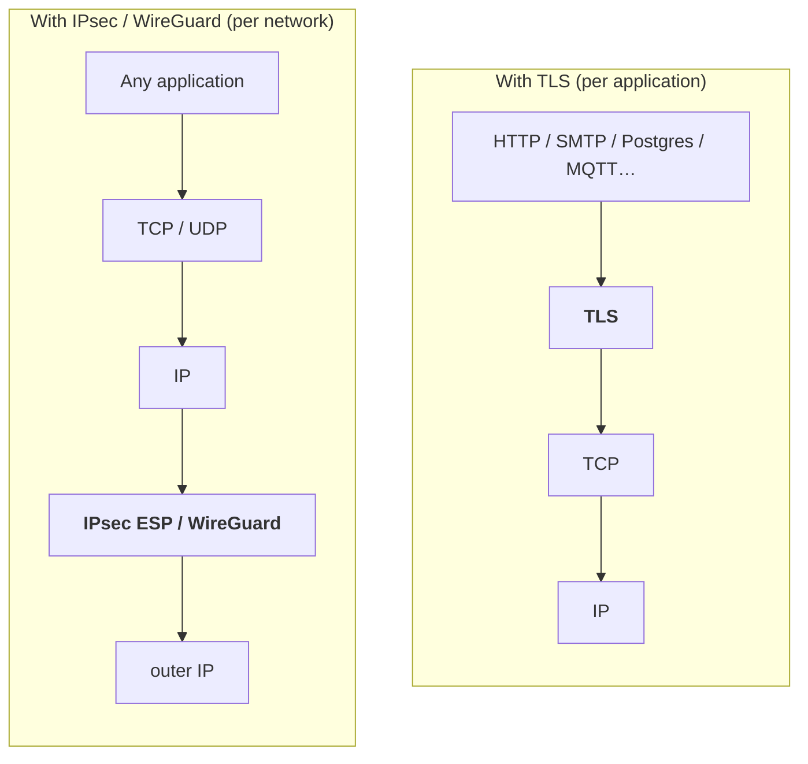
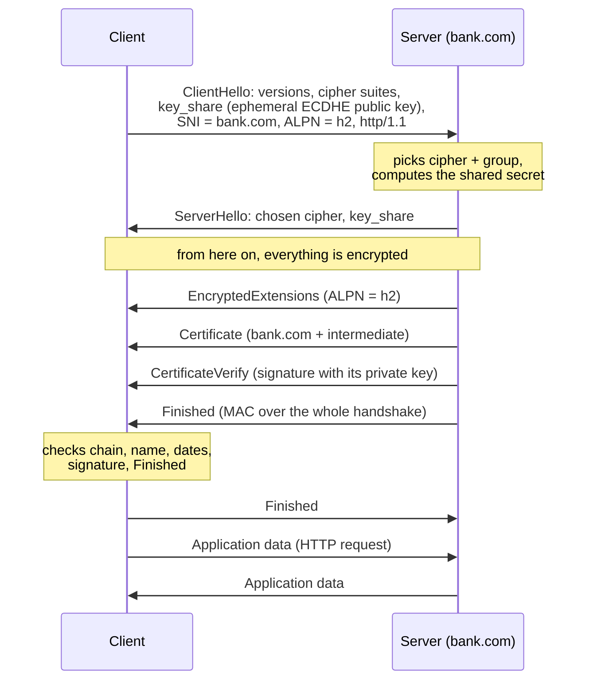
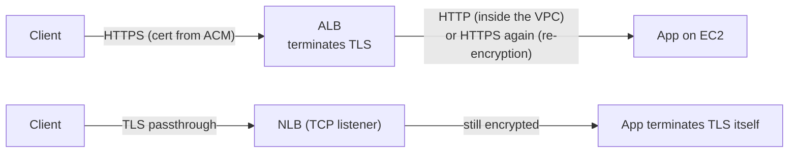

# TLS

> [!abstract] In one sentence
> TLS (Transport Layer Security, the successor of SSL) encrypts and authenticates **one application's connection** (the "S" in HTTPS). It sits between TCP and the application, so each app protects its own traffic, unlike a [[VPN]], which protects all traffic between networks.

## Where it sits



- **TLS**: over TCP. The app (or its library: OpenSSL, BoringSSL, rustls, Go's crypto/tls) does the encryption. The network sees IPs, ports and the TLS handshake, but not the content
- **DTLS**: TLS adapted to UDP (used by some VPNs like AnyConnect's data channel, and by WebRTC)
- **QUIC** (HTTP/3): runs over UDP and has TLS 1.3 built into its own handshake

"SSL" is the old name (SSL 2.0/3.0 are broken). People still say "SSL certificate", but it's always TLS now.

## The TLS 1.3 handshake

One round trip (1-RTT) before sending data:



What each part achieves (see [[Encryption basics]]):
- **key_share** on both sides = ephemeral **ECDHE** → shared secret with **forward secrecy**
- **Certificate + CertificateVerify** = the server proves it's `bank.com` and owns the private key → **authentication**
- **Finished** = a MAC over every handshake message → nobody tampered with the negotiation (no downgrade)
- Keys are derived with **HKDF**, one per direction

**Resumption**: a returning client can reuse a previous session (PSK ticket) and even send data in the first message (**0-RTT**). 0-RTT data can be **replayed** by an attacker, so it's only safe for idempotent requests (GET, not "transfer money").

### TLS 1.2 vs 1.3

| | TLS 1.2 | TLS 1.3 |
|---|---|---|
| Round trips before data | 2 | **1** (0 with resumption) |
| Key exchange | RSA (no PFS) or ECDHE/DHE | **ECDHE/DHE only** (always PFS) |
| Certificate sent | In clear | **Encrypted** |
| Cipher suites | Hundreds, many weak (CBC, RC4, 3DES) | 5, all AEAD: `TLS_AES_128_GCM_SHA256`, `TLS_AES_256_GCM_SHA384`, `TLS_CHACHA20_POLY1305_SHA256`… |
| Status | Still acceptable with good ciphers | The default to aim for |

TLS 1.0 and 1.1 are deprecated: browsers refuse them, and AWS APIs require TLS 1.2+.

## Important extensions and features

| Feature | What it is | Why it matters |
|---|---|---|
| **SNI** (Server Name Indication) | The hostname the client wants, sent in ClientHello | Lets one IP host many HTTPS sites (the server picks the right certificate). ALB/CloudFront use it for multiple certificates. Sent in **clear**: firewalls can see (and block by) domain |
| **ECH** (Encrypted Client Hello) | Encrypts the ClientHello, including SNI | Hides which site I'm visiting. Still being rolled out |
| **ALPN** | Negotiates the app protocol inside TLS (`h2`, `http/1.1`) | How HTTP/2 is chosen without an extra round trip |
| **OCSP stapling** | The server attaches a fresh "not revoked" proof | Faster, more private revocation check |
| **mTLS** (mutual TLS) | The **client** also sends a certificate | The server knows exactly which machine/service is calling. Used for service-to-service, IoT, zero trust, B2B APIs |

## Where TLS is terminated (in AWS and elsewhere)

"Terminating" TLS = the place where it's decrypted.



| Pattern | How | Trade-off |
|---|---|---|
| **Terminate at the load balancer** | [[Load balancers\|ALB]] or CloudFront with a free [[Certificate Manager (ACM)\|ACM]] certificate | Simplest. ALB can read HTTP (routing rules, [[AWS WAF]]). Traffic after the ALB is plain unless re-encrypted |
| **Re-encrypt** | ALB → target on HTTPS | Encrypted end to end. Needs certs on the instances (ALB doesn't validate them) |
| **Passthrough** | NLB with a TCP listener | The app holds the certificate and private key. The NLB can't inspect anything |
| **TLS at the NLB** | NLB with a TLS listener + ACM cert | Offloads TLS for non-HTTP protocols |
| **mTLS at the ALB** | ALB **trust store** with my CA | ALB verifies client certificates before the app sees the request |

## Where TLS is used

- **HTTPS** (443), and HTTP/3 over QUIC (UDP 443)
- **Email**: SMTP with STARTTLS (587), SMTPS (465), IMAPS (993)
- **Databases**: PostgreSQL (`sslmode=verify-full`), MySQL, MongoDB, Redis. RDS provides CA bundles
- **DNS over TLS** (853) / **DNS over HTTPS**
- **LDAPS** (636), MQTT over TLS (8883), gRPC, Kafka
- **VPNs**: OpenVPN's control channel, "SSL VPNs" (Cisco AnyConnect, Fortinet, Palo Alto GlobalProtect), AWS Client VPN → see [[VPN]]

**STARTTLS** = start in plain text, then upgrade the same connection to TLS. Weaker, because an attacker can strip the "let's upgrade" message (unless TLS is enforced).

## Debugging

```bash
openssl s_client -connect bank.com:443 -servername bank.com   # handshake, chain, cipher, version
openssl s_client -connect bank.com:443 -tls1_3                 # force a version
openssl x509 -in cert.pem -noout -text                         # read a certificate (SAN, dates, issuer)
curl -v https://bank.com                                       # shows the handshake summary
```

Common errors:

| Error | Usual cause |
|---|---|
| `certificate has expired` | Renewal failed (ACM renews automatically only if DNS validation still works) |
| `hostname mismatch` / `SAN` | Connecting by IP or by a name not in the certificate |
| `unable to get local issuer certificate` | Server doesn't send the **intermediate**, or a private CA isn't in the trust store |
| `handshake failure` / `no shared cipher` | Old client vs modern server (or the reverse), or wrong SNI |
| `wrong version number` | Speaking TLS to a plain-HTTP port (or the reverse) |

## Easy to get wrong
- **TLS protects the connection, not the data at rest**, and only **between the two ends that terminate it**. With TLS ending at the ALB, the ALB → app hop is plain unless re-encrypted
- **Skipping verification** (`curl -k`, `verify=False`, `sslmode=require` instead of `verify-full`) removes authentication → man-in-the-middle possible
- **SNI is visible**: TLS hides the URL path and content, but not the domain (until ECH)
- A standard (free) **ACM certificate can't be exported** to an EC2 instance. Put an ALB/CloudFront in front, pay for an exportable one, or use another certificate on the instance (see [[Certificate Manager (ACM)]])
- Forgetting the **intermediate** certificate in the chain

## Related
- Depends on:: [[Encryption basics]]
- Compared:: [[IPsec vs TLS vs WireGuard vs SSH]]
- Used in:: [[VPN]] (SSL VPNs, OpenVPN, AWS Client VPN), [[Load balancers]], [[Certificate Manager (ACM)]]
- Lifecycle:: [[Certificate rotation]]

## Flashcards
#flashcards

What layer does TLS protect? :: One application's connection, on top of TCP (DTLS for UDP, built into QUIC)
TLS 1.3 handshake round trips? :: 1 (0 with resumption / 0-RTT)
Which messages authenticate the server in TLS 1.3? :: Certificate + CertificateVerify (signature with its private key)
What gives TLS 1.3 forward secrecy? :: Mandatory ephemeral ECDHE key shares
What is SNI and is it encrypted? :: The requested hostname in ClientHello, used to pick the certificate. Sent in clear (unless ECH)
What is ALPN? :: Negotiating the application protocol (h2, http/1.1) inside the TLS handshake
What is mTLS? :: Mutual TLS: the client also presents a certificate, so the server authenticates the client
Why is 0-RTT data risky? :: It can be replayed, so it's only safe for idempotent requests
Where is TLS terminated with an ALB + ACM? :: At the ALB. Traffic to targets is plain HTTP unless the target group uses HTTPS
TLS passthrough in AWS? :: NLB with a TCP listener. The app terminates TLS itself
What does STARTTLS do and its weakness? :: Upgrades a plain connection to TLS. The upgrade can be stripped unless TLS is enforced
`unable to get local issuer certificate` usually means? :: The server didn't send the intermediate certificate, or the CA isn't trusted
Which TLS versions should be disabled? :: SSL 2/3, TLS 1.0, TLS 1.1
