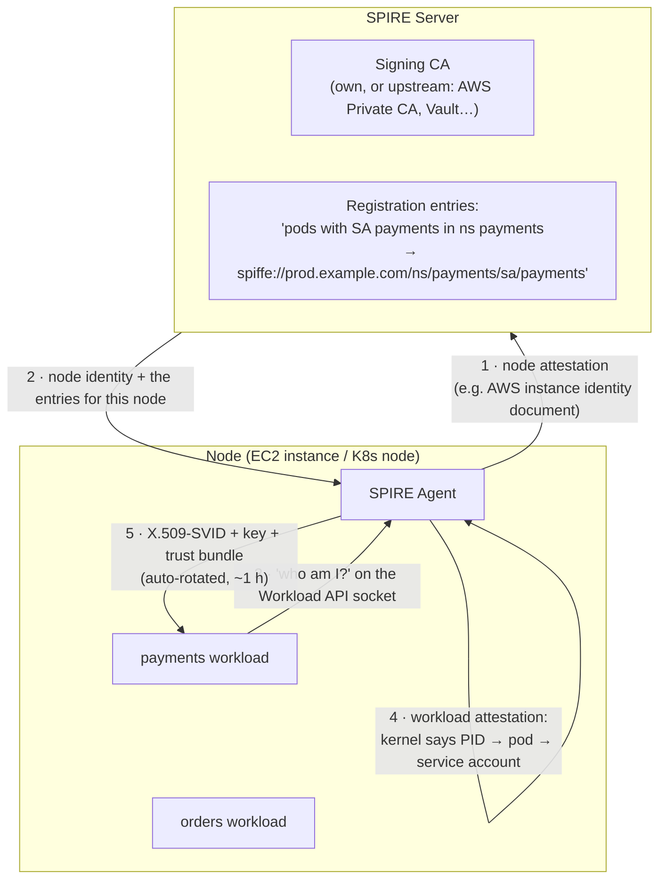
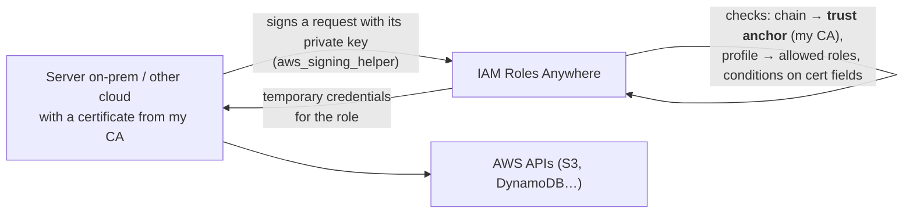

# Workload identity (SPIFFE)

> [!abstract] In one sentence
> Workload identity gives each **service** (not person) a verifiable identity it receives **automatically from the platform**, without any stored password or key. **SPIFFE** is the open standard for it: a name like `spiffe://prod.example.com/payments`, delivered as a short-lived **certificate** (or JWT) that services use for [[mTLS]].

## The problem: "secret zero"

For `orders` to call `payments` securely, `orders` must prove who it is. The classic answers all involve a **stored secret**: an API key in an environment variable, a password in a config file, a certificate copied onto the server.

- Where does that first secret come from, and how does it get onto the machine safely? (the **secret zero** problem)
- Secrets leak (Git, logs, images), are shared between services, and are rarely rotated

**Workload identity** flips it: the workload proves who it is by **what it is and where it runs** (this Kubernetes service account, this EC2 instance, this Linux process), vouched for by the platform. It then gets a **short-lived** credential automatically, and nothing long-lived is ever stored.

The same idea exists in AWS already: an [[EC2]] instance gets credentials from its **IAM role** through the instance metadata service, with no keys on disk (see [[IAM]]). SPIFFE makes this **portable** across clouds, Kubernetes and VMs, and based on certificates.

## SPIFFE: the standard

**SPIFFE** = Secure Production Identity Framework For Everyone (a CNCF project). It defines four things:

| Piece | What it is | Example |
|---|---|---|
| **SPIFFE ID** | A URI naming a workload | `spiffe://prod.example.com/ns/payments/sa/payments` |
| **Trust domain** | The part after `spiffe://`: one identity authority (a company, an environment) | `prod.example.com` |
| **SVID** (SPIFFE Verifiable Identity Document) | The credential proving the ID | **X.509-SVID**: a certificate with the ID in its **URI SAN**. **JWT-SVID**: a signed token (when TLS end to end isn't possible) |
| **Workload API** | A local **Unix socket** where a workload asks "who am I?" and gets its SVID + the trust bundle, with **no credentials** | `/run/spire/sockets/agent.sock` |
| **Trust bundle** | The CA certificates of a trust domain, used to verify other workloads' SVIDs | |

An X.509-SVID is a normal certificate (see [[Certificates and PKI]]), just with the identity in the SAN as a URI:

```
Subject Alternative Name:
    URI:spiffe://prod.example.com/ns/payments/sa/payments
```

Any TLS library can use it for [[mTLS]]. The receiving side authorizes on the SPIFFE ID.

## SPIRE: the reference implementation



1. **Node attestation**: the agent proves which **machine** it runs on, using something the platform signs: an AWS instance identity document, a GCP/Azure token, a Kubernetes projected service account token, a TPM
2. The server knows which workloads may run on that node (**registration entries**)
3. A workload connects to the local socket. It presents **nothing**
4. **Workload attestation**: the agent asks the **kernel** which process is on the other end of the socket (PID, UID), then the container runtime / kubelet which pod and service account that is
5. If it matches an entry, the agent hands out the SVID and **rotates it automatically** before expiry (short-lived, typically about an hour)

No secret was ever stored: the identity comes from facts the platform guarantees.

**Federation**: two trust domains (two companies, two clusters) exchange **trust bundles**, so their workloads can authenticate each other.

## Who uses SPIFFE

| Where | How |
|---|---|
| **Istio, Linkerd, Consul** | Workload identities are SPIFFE IDs (`spiffe://cluster.local/ns/<ns>/sa/<sa>`), issued by the mesh's own CA (see [[Service mesh]]) |
| **SPIRE** | Standalone, across Kubernetes, VMs, bare metal, several clouds |
| **Envoy** | Fetches SVIDs through its SDS API |
| **Cilium** | Mutual authentication using SPIRE |
| **Kubernetes** | Native pod certificates and cluster trust bundles are moving the same direction |

## In AWS

| Mechanism | Identity from | Credential |
|---|---|---|
| **IAM role for EC2** (instance profile) | The instance | Temporary AWS credentials from IMDS |
| **EKS Pod Identity / IRSA** | The pod's service account | Temporary AWS credentials (IRSA exchanges a signed service account token via OIDC) |
| **Lambda / ECS task roles** | The function / task | Temporary AWS credentials |
| **IAM Roles Anywhere** | An **X.509 certificate** from **my CA** (AWS Private CA or an external CA, including SPIRE) | Temporary AWS credentials for workloads **outside AWS** |
| **SPIRE on AWS** | EC2 instance identity documents (`aws_iid` node attestor), EKS | X.509-SVIDs for mTLS between services |
| **VPC Lattice** | IAM principals | SigV4-signed requests checked by auth policies |

**IAM Roles Anywhere** is where the two worlds meet:



- **Trust anchor**: the CA I register (Private CA or an uploaded CA certificate)
- **Profile**: which IAM roles can be assumed, with session policies
- Role trust policy trusts `rolesanywhere.amazonaws.com`, and can have **conditions on certificate fields** (subject CN, SAN)
- Replaces long-lived IAM **access keys** on servers outside AWS

## Easy to get wrong
- Thinking workload identity = "a certificate I copy to each server". The point is that it's **issued automatically** after attestation and **short-lived**
- Registration entries that are too broad ("any pod on this node gets identity X")
- Authorizing on the **trust domain** only ("anything from `prod.example.com`") instead of the specific SPIFFE ID
- Mixing up **authentication** (the SVID proves the ID) and **authorization** (a policy says what that ID may do)
- Still putting long-lived IAM access keys on on-prem servers when Roles Anywhere exists

## Related
- Used for:: [[mTLS]], [[Service mesh]]
- Built on:: [[Certificates and PKI]], [[Encryption basics]]
- Lifecycle:: [[Certificate rotation]] (SVIDs rotate every hour or so)
- AWS:: [[IAM]], [[EC2]]

## Flashcards
#flashcards

What is workload identity? :: An identity for a service, issued automatically by the platform based on where/what it runs, without stored secrets
What is the "secret zero" problem? :: How to safely deliver the first secret a workload needs to authenticate
What is a SPIFFE ID? :: A URI naming a workload: spiffe://<trust domain>/<path>
What is an SVID? :: The credential proving a SPIFFE ID: an X.509 certificate (ID in the URI SAN) or a JWT
Where is the SPIFFE ID in an X.509-SVID? :: In the Subject Alternative Name, as a URI
What is the Workload API? :: A local Unix socket where a workload gets its SVID and trust bundle without presenting any credential
Node attestation vs workload attestation in SPIRE? :: Node: the agent proves which machine it's on (e.g. AWS instance identity document). Workload: the agent asks the kernel/kubelet which process/pod is calling
What is SPIFFE federation? :: Exchanging trust bundles between trust domains so their workloads can authenticate each other
SPIFFE ID format used by Istio? :: spiffe://cluster.local/ns/<namespace>/sa/<service account>
What does IAM Roles Anywhere do? :: Gives workloads outside AWS temporary AWS credentials in exchange for a certificate from a trusted CA
What is a trust anchor in Roles Anywhere? :: The CA (Private CA or external) whose certificates are accepted
AWS-native workload identities for AWS APIs? :: Instance profiles (EC2), task roles (ECS), execution roles (Lambda), EKS Pod Identity / IRSA
