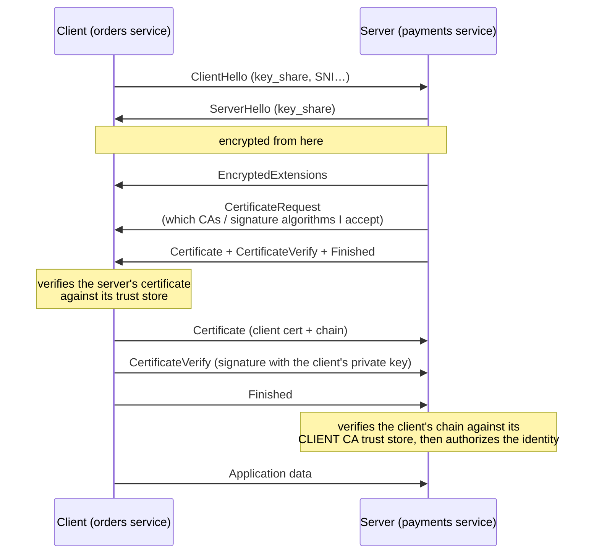
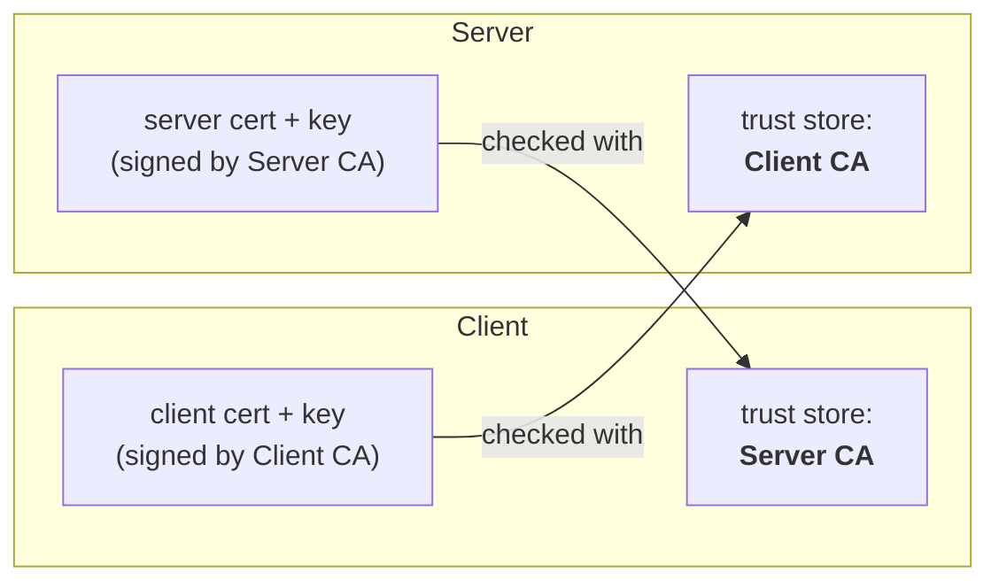

# mTLS

> [!abstract] In one sentence
> In normal [[TLS]], only the **server** proves who it is. In **mutual TLS (mTLS)**, the **client also presents a certificate**, so both sides know exactly who they're talking to before a single byte of application data is exchanged.

## Normal TLS vs mTLS

| | **TLS** (one-way) | **mTLS** (mutual) |
|---|---|---|
| Server proves identity with a certificate | ✅ | ✅ |
| Client proves identity with a certificate | ❌ (it logs in later: password, token, cookie) | ✅ during the handshake |
| Who can even open a connection | Anyone | Only clients holding a certificate the server trusts |
| Typical use | Websites, public APIs | Service-to-service, B2B APIs, IoT devices, Kubernetes internals, zero trust |

## The handshake (TLS 1.3)

The only differences from normal TLS are the **CertificateRequest** from the server and the client's **Certificate + CertificateVerify**:



- **CertificateVerify** is the important part: anyone can copy a certificate (it's public), but only the holder of the **private key** can sign the handshake. That's what proves possession
- In TLS 1.3 the client certificate is sent **encrypted**. In TLS 1.2 it went in clear (anyone watching saw the client's identity)
- If the client sends no certificate, or one the server doesn't trust, the handshake **fails**: the app never sees the request

## Two trust stores, one per direction



The two CAs can be the same (typical inside one company or a service mesh) or different (a bank trusting only its own client CA, while its server uses a public CA).

## Why a private CA?

Putting a CA in the server's client trust store means: "**anyone this CA signed may connect**". So the real question is *who decides who gets a certificate?* With a public CA, it's not me.

| | **Public CA** (Let's Encrypt, DigiCert…) | **Private CA** (my own, AWS Private CA, a mesh CA) |
|---|---|---|
| Who can get a certificate | Anyone who controls *some* domain | Only who I decide |
| What passing the handshake proves | "Someone on the internet" | "One of my services / devices / partners" |
| Identities it can put in a cert | Only domain names it validated | Anything: `orders-service`, a SPIFFE URI, a device serial, a partner ID |
| `clientAuth` certificates | Being phased out: browser root programs now require public TLS CAs to be `serverAuth`-only (Let's Encrypt dropped `clientAuth` in 2026) | ✅ |
| Lifetime | Days to months, with issuance rate limits | Whatever I want, even **minutes/hours**, thousands per second |
| Revocation | Their process | Mine: revoke instantly, or just stop reissuing |
| Visibility | Every cert is published in **Certificate Transparency** logs | Private: internal names and device IDs aren't leaked |

The core reasons:

1. **Authentication must mean membership.** If the server trusts a public CA, anyone can buy or get a free cert from it and complete the handshake. mTLS would then only prove "this client owns *a* domain", and all the security would fall on my authorization code
2. **Public CAs can't express my identities.** They validate domain control, nothing else. They won't issue a cert saying "this is the `payments` workload" or "device #A1-4432"
3. **Control over the lifecycle.** mTLS means one certificate per service/device, often short-lived and rotated automatically (see [[Certificate rotation]]). That needs an issuer I drive through an API, without rate limits or CT logging
4. **Nobody else needs to trust it.** The only reason to pay for a public CA is that browsers and OSes already trust it. In mTLS the verifier is **my own server**, so I just install my root CA there. I control both ends, so distributing the root is easy

> [!note] The server certificate is a separate choice
> Private CA for the server cert too when all clients are mine (service mesh, Kubernetes). **Public CA** for the server cert when outside clients (partners, browsers) connect and shouldn't have to install my root. The *client* CA stays private either way.

## Authentication ≠ authorization

mTLS answers "**who** is this?". It doesn't decide "**may** they do this?":

1. **Authentication** (the handshake): the certificate chains to a trusted CA, is valid, not revoked, and the client holds the key
2. **Authorization** (my code or config): read the identity from the certificate and check it against a policy:
   - Subject CN (`CN=orders-service`), old-fashioned
   - **SAN** entries: DNS name, email, or a **URI** like `spiffe://prod.example.com/ns/orders/sa/orders` (see [[Workload identity (SPIFFE)]])
   - Then: "`orders` may call `POST /charge` on `payments`, `reporting` may only `GET`"

> [!warning] Trusting a CA ≠ trusting everyone it signed
> If the server trusts a **public CA** for client certificates, anyone can buy a certificate from that CA and pass authentication. Client CAs should be **private** (or the server must check the exact identity). See [[#Why a private CA?]].

## Where mTLS is used

| Where | Why |
|---|---|
| **Service-to-service** (microservices, [[Service mesh\|service meshes]]) | Every call authenticated and encrypted, even inside the network (**zero trust**: being "inside" isn't proof of anything) |
| **Kubernetes internals** | API server ↔ kubelets ↔ etcd all use mTLS, with the cluster's own CA |
| **B2B / financial APIs** | Open banking (PSD2 in Europe), payment networks: the partner is identified by its certificate |
| **IoT** | Each device has its own certificate. **AWS IoT Core** requires X.509 client certificates |
| **Databases and brokers** | PostgreSQL (`clientcert=verify-full`), MySQL, Kafka, MQTT, Redis |
| **VPNs** | OpenVPN and [[IPsec and IKE\|IKE]] with certificates are mTLS in spirit: both peers show certificates |
| **Admin endpoints** | Protecting internal dashboards and management APIs |

## mTLS vs other ways for a client to authenticate

| | **mTLS** | **API key** | **OAuth / JWT bearer token** |
|---|---|---|---|
| Secret sent over the network? | ❌ Never (only a signature) | ✅ Every request | ✅ Every request |
| If intercepted | Useless without the private key | Reusable | Reusable until it expires |
| Checked at | Connection (handshake) | Each request | Each request |
| Per-user identity | Hard (one cert per user) | No | ✅ Yes |
| Operational cost | Certificates to issue and **rotate** | Keys to store and rotate | An identity provider |

They combine well: **mTLS for the workload** ("this is the orders service") + **a token for the user** ("acting for user 42"). OAuth even has **certificate-bound tokens** (RFC 8705): a stolen token is useless without the matching client certificate.

## In AWS

| Service | How mTLS works there |
|---|---|
| **ALB** — *verify mode* | I upload a **trust store** (CA bundle in S3, optional CRLs). The ALB validates client certificates and passes identity to the targets in `X-Amzn-Mtls-Clientcert-*` headers |
| **ALB** — *passthrough mode* | The ALB accepts any client cert and forwards it in the `X-Amzn-Mtls-Clientcert` header. My app validates it |
| **NLB** with a TCP listener | TLS passthrough: the targets do the whole mTLS handshake themselves |
| **API Gateway** (custom domain) | Truststore file in S3. Disable the default `execute-api` endpoint, or clients can bypass mTLS through it |
| **IoT Core** | Device certificates registered in IoT Core, mTLS on port 8883 (MQTT) or 443 |
| **ECS Service Connect / service meshes on EKS** | Automatic mTLS between services, certificates from **AWS Private CA** |
| **AWS Private CA** | The usual source of client certificates and client CAs |
| **IAM Roles Anywhere** | Servers **outside AWS** use an X.509 certificate to get temporary AWS credentials (see [[Workload identity (SPIFFE)]]) |

> [!warning] When the load balancer terminates mTLS
> The backend no longer sees the certificate, only the headers the ALB adds. The app must **only trust those headers from the ALB** (security group allowing traffic only from the ALB), or anyone could forge them.

## Lab: mTLS with openssl

```bash
# 1. a private CA
openssl req -x509 -new -nodes -newkey ec -pkeyopt ec_paramgen_curve:P-256 \
  -keyout ca.key -out ca.crt -days 365 -subj "/CN=Lab CA"

# 2. server certificate for localhost
openssl req -new -nodes -newkey ec -pkeyopt ec_paramgen_curve:P-256 \
  -keyout server.key -out server.csr -subj "/CN=localhost"
openssl x509 -req -in server.csr -CA ca.crt -CAkey ca.key -CAcreateserial -days 30 \
  -out server.crt -extfile <(printf "subjectAltName=DNS:localhost\nextendedKeyUsage=serverAuth")

# 3. client certificate
openssl req -new -nodes -newkey ec -pkeyopt ec_paramgen_curve:P-256 \
  -keyout client.key -out client.csr -subj "/CN=orders-service"
openssl x509 -req -in client.csr -CA ca.crt -CAkey ca.key -CAcreateserial -days 30 \
  -out client.crt -extfile <(printf "extendedKeyUsage=clientAuth")

# 4. a server that REQUIRES a client certificate (-Verify, capital V)
openssl s_server -accept 8443 -cert server.crt -key server.key -CAfile ca.crt -Verify 1 -www

# 5. in another terminal
curl --cacert ca.crt https://localhost:8443/                                          # fails: no client cert
curl --cacert ca.crt --cert client.crt --key client.key https://localhost:8443/       # works
```

The same in nginx:

```nginx
server {
    listen 443 ssl;
    ssl_certificate         /etc/nginx/server.crt;
    ssl_certificate_key     /etc/nginx/server.key;
    ssl_client_certificate  /etc/nginx/client-ca.crt;   # which CA signs my clients
    ssl_verify_client       on;                          # require a client cert
    location / {
        proxy_set_header X-Client-DN $ssl_client_s_dn;  # pass the identity to the app
        proxy_pass http://app:8080;
    }
}
```

## Operational pain points

- **Issuing and rotating** a certificate for every client/service → needs automation: a [[Service mesh|service mesh]], cert-manager, SPIRE, Private CA (see [[Certificate rotation]])
- **Revocation**: a compromised client must be blocked quickly → CRLs in the trust store (ALB supports them), or short-lived certificates
- **Load balancers and proxies in the middle** end the mTLS session: decide where it terminates and how identity is passed on
- **Debugging**: errors like `certificate required`, `unknown ca`, `bad certificate` show up as generic connection failures in the app. `openssl s_client -connect host:443 -cert client.crt -key client.key -CAfile ca.crt` shows exactly where it breaks
- **Clock skew**: a device with a wrong clock sees valid certificates as expired or not yet valid

## Easy to get wrong
- Trusting a **public CA** for client certificates
- Forgetting **Extended Key Usage**: a certificate with only `serverAuth` is rejected as a client certificate (and vice versa)
- Leaving another path open that **bypasses mTLS** (API Gateway's default endpoint, a direct instance IP, a second listener)
- Treating "has a valid certificate" as "is allowed to do everything" (no authorization step)
- Trusting mTLS identity **headers** that didn't come from the load balancer

## Related
- Depends on:: [[TLS]], [[Certificates and PKI]], [[Encryption basics]]
- Automated by:: [[Service mesh]], [[Workload identity (SPIFFE)]]
- Lifecycle:: [[Certificate rotation]]
- AWS:: [[Load balancers]], [[Certificate Manager (ACM)]]

## Flashcards
#flashcards

What does mTLS add to TLS? :: The client also presents a certificate and proves it holds the private key, so both sides are authenticated
Which TLS messages make it mutual? :: The server's CertificateRequest, then the client's Certificate + CertificateVerify
Why can't someone just copy a client certificate? :: They'd also need the private key to sign CertificateVerify
Is the client certificate encrypted in TLS 1.3? :: Yes (in TLS 1.2 it was sent in clear)
What trust store does the server use in mTLS? :: A client CA trust store: the CAs allowed to sign client certificates
mTLS authentication vs authorization? :: The handshake proves who the client is. A policy must still decide what that identity may do
Why not trust a public CA for client certificates? :: Anyone could get a certificate from it and pass authentication
What does adding a CA to the client trust store mean? :: Anyone that CA signed may connect, so I must control who it signs
Four reasons mTLS uses a private CA? :: Authentication = membership; custom identities (service names, SPIFFE, device IDs); control over lifetime/rotation/revocation; only my own server needs to trust it
Why can't a public CA issue a workload identity cert? :: It only validates domain control and puts domain names in certs, not "orders-service" or a device ID
What leaks if internal client certs come from a public CA? :: Every cert goes into public Certificate Transparency logs, exposing internal names
When can the server cert still be public in mTLS? :: When outside clients connect and shouldn't have to install my root. The client CA stays private
mTLS vs bearer token security? :: mTLS never sends the secret (only a signature). A stolen token can be replayed
ALB mTLS verify mode vs passthrough? :: Verify: ALB validates against a trust store. Passthrough: ALB forwards the cert in a header and the app validates
API Gateway mTLS trap? :: The default execute-api endpoint bypasses mTLS, so disable it
Which extended key usage does a client certificate need? :: clientAuth
Where does AWS IoT Core use mTLS? :: Every device connects with its own X.509 client certificate
Why combine mTLS with tokens? :: mTLS identifies the calling workload, the token identifies the user it acts for
