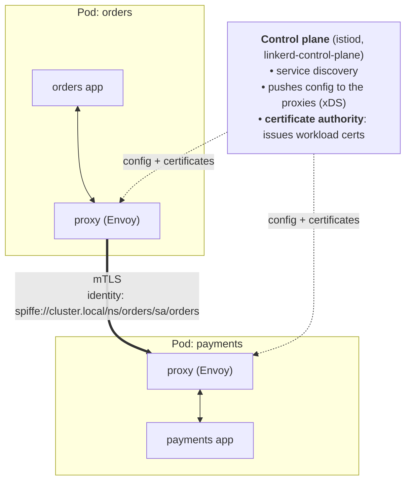
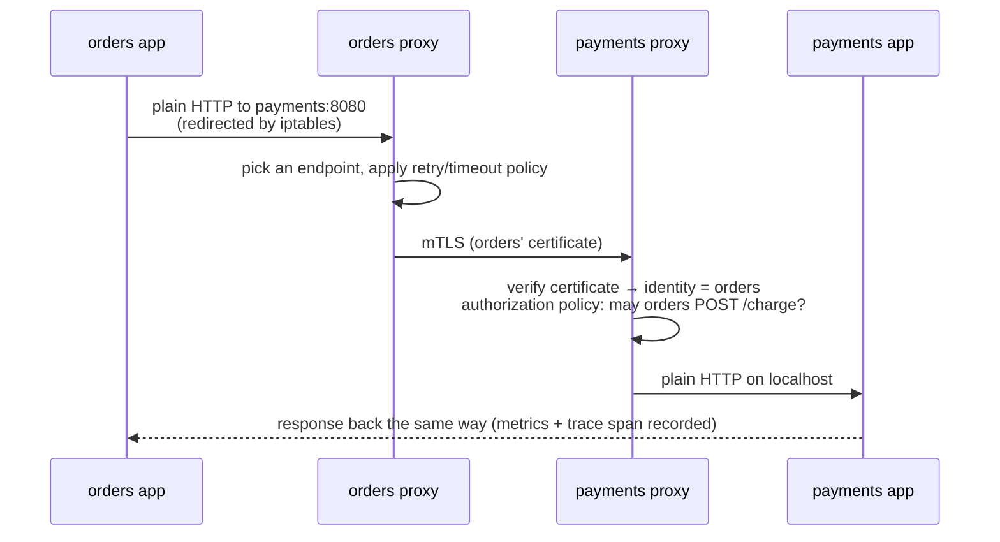

# Service mesh

> [!abstract] In one sentence
> A service mesh moves **service-to-service networking concerns** (automatic [[mTLS]] with identities, retries, timeouts, traffic splitting, metrics) **out of the application code** and into a layer of **proxies** managed by a central **control plane**.

## The problem it solves

With a few services, each app handles its own calls. With dozens or hundreds of microservices, **every** service needs the same things:

| Concern | Without a mesh |
|---|---|
| Encrypt + authenticate every call ([[mTLS]]) | Each team issues, installs and **rotates** certificates |
| "Who may call me?" | Custom auth code in every service |
| Retries, timeouts, circuit breakers | A library per language (Hystrix, Polly, resilience4j…), configured differently everywhere |
| Canary releases, traffic splitting | Custom load balancer config |
| Metrics, traces for every call | Instrumentation in every codebase |

The mesh does all of it **the same way for every service, in every language**, configured centrally.

## Architecture



- **Data plane**: the proxies that actually carry traffic. **Envoy** (Istio, Consul, most others) or **linkerd2-proxy** (Linkerd, written in Rust)
- **Control plane**: doesn't touch traffic. It tells proxies where services are, what policies apply, and hands them certificates
- The apps keep speaking **plain HTTP/gRPC to localhost**. The proxies upgrade it to mTLS between pods

### How traffic gets into the proxy (sidecar mode)

The app isn't aware of the proxy. The mesh **redirects traffic** inside the pod's [[Network interfaces|network namespace]]:

1. An init container (`istio-init`) or a CNI plugin installs **iptables rules** in the pod's namespace
2. All **outbound** traffic from the app is redirected to the proxy (Istio: port 15001), all **inbound** traffic too (port 15006)
3. The outbound proxy looks up the destination, opens **mTLS** to the destination pod's proxy, applies retries/timeouts
4. The inbound proxy terminates mTLS, checks **authorization policy**, and forwards to the app on localhost



## What a mesh gives

### Security: identity + mTLS everywhere

- Every workload gets an **identity** from its Kubernetes **service account**, in [[Workload identity (SPIFFE)|SPIFFE]] format: `spiffe://cluster.local/ns/orders/sa/orders`
- The control plane's CA issues each proxy a **short-lived certificate** (Istio: 24 h by default), delivered and **rotated automatically** through the proxy (no files, no restarts). The CA root can be plugged into cert-manager, Vault or **AWS Private CA** (see [[Certificate rotation]])
- **mTLS modes**: `PERMISSIVE` (accept both plain and mTLS, for migrating) → `STRICT` (mTLS only)
- **Authorization policies**: rules on identities, not IPs

```yaml
# Istio: mTLS required for the whole mesh
apiVersion: security.istio.io/v1
kind: PeerAuthentication
metadata:
  name: default
  namespace: istio-system
spec:
  mtls:
    mode: STRICT
---
# only the orders service may call POST /charge on payments
apiVersion: security.istio.io/v1
kind: AuthorizationPolicy
metadata:
  name: payments-allow-orders
  namespace: payments
spec:
  selector:
    matchLabels:
      app: payments
  action: ALLOW
  rules:
  - from:
    - source:
        principals: ["cluster.local/ns/orders/sa/orders"]
    to:
    - operation:
        methods: ["POST"]
        paths: ["/charge"]
```

This is **zero trust** inside the cluster: being on the same network gives nothing. Compare with [[Security groups]], which only see IPs and ports.

### Traffic management

| Feature | Example |
|---|---|
| **Traffic splitting** | 90% to `reviews v1`, 10% to `v2` (canary release) |
| **Header-based routing** | Requests with `x-user-group: beta` go to `v2` |
| **Retries and timeouts** | 3 retries on 503, 2 s timeout per try |
| **Circuit breaking / outlier detection** | Stop sending to an instance that keeps failing |
| **Fault injection** | Add 5 s delay to 10% of calls, to test resilience |
| **Mirroring** | Copy live traffic to a new version without using its responses |
| **Locality-aware load balancing** | Prefer endpoints in the same zone (saves cross-AZ costs) |

```yaml
apiVersion: networking.istio.io/v1
kind: VirtualService
metadata:
  name: reviews
spec:
  hosts: ["reviews"]
  http:
  - route:
    - destination: {host: reviews, subset: v1}
      weight: 90
    - destination: {host: reviews, subset: v2}
      weight: 10
    retries: {attempts: 3, perTryTimeout: 2s}
# (the v1/v2 subsets are defined in a DestinationRule by pod labels)
```

### Observability

- **Metrics** for every call, without touching code: request rate, errors, latency (the "golden signals"), per source/destination
- **Access logs** from every proxy
- **Distributed tracing**: proxies create spans, but the **app must forward the trace headers** (`traceparent`, `x-b3-*`) from incoming to outgoing requests, or traces break into pieces
- A **service graph** of who calls whom (Kiali for Istio, Linkerd viz)

### Edges of the mesh

- **Ingress gateway**: the entry point from outside (a standalone Envoy, often behind a cloud load balancer)
- **Egress gateway**: forces outbound traffic through one controlled exit (to log or restrict what leaves)
- **Multi-cluster**: one mesh spanning several clusters with a shared root CA

## Sidecar vs sidecarless

| | **Sidecar** | **Ambient (Istio)** | **eBPF (Cilium)** |
|---|---|---|---|
| Where the proxy runs | One per pod | **ztunnel** per node (L4: mTLS, identity) + optional **waypoint** proxies per namespace/service (L7: HTTP routing, policies) | In the kernel (eBPF) + a per-node Envoy for L7 |
| Resource cost | Highest (a proxy in every pod) | Much lower | Low |
| Adding to a pod | Restart the pod to inject the sidecar | No restart | No restart |
| Maturity | The classic, most features | GA since Istio 1.24 (late 2024) | Growing |

## The main meshes

| Mesh | Proxy | Strengths |
|---|---|---|
| **Istio** | Envoy (sidecar or ambient) | Most features, biggest ecosystem, complex |
| **Linkerd** | linkerd2-proxy (Rust) | Simple, light, secure by default (mTLS on install) |
| **Consul service mesh** | Envoy | Works across Kubernetes, VMs and multiple platforms |
| **Cilium service mesh** | eBPF + Envoy | Built into the Cilium CNI, sidecarless |
| **Kuma / Kong Mesh** | Envoy | Multi-zone, VMs + Kubernetes |

## In AWS

| Option | Status / what it is |
|---|---|
| **AWS App Mesh** | Envoy-based managed mesh. **Discontinued: end of support 30 September 2026**, closed to new customers since 2024. Don't start anything on it |
| **ECS Service Connect** | For ECS: AWS-managed Envoy sidecars with service discovery, retries, metrics, and **TLS with AWS Private CA** (App Mesh's successor for ECS) |
| **Amazon VPC Lattice** | Service-to-service networking **without sidecars**, across VPCs and accounts, for EC2, ECS, EKS and Lambda. Authentication with **IAM auth policies** (SigV4) instead of mTLS |
| **Istio / Linkerd on EKS** | Self-managed, the usual choice on Kubernetes. Private CA can back the mesh CA (`aws-privateca-issuer`, istio-csr) |

## Costs and when not to use one

- **Latency**: two extra proxy hops per call (usually around a millisecond)
- **Resources**: CPU/memory for every sidecar
- **Complexity**: a new control plane to upgrade, new failure modes, and debugging "is it my app or the proxy?"
- **Worth it** with many services, several teams/languages, a zero-trust or compliance requirement (encrypt everything internally), or a need for canaries and uniform observability
- **Probably not** for a handful of services: TLS in the app, a load balancer and a metrics library may be enough

## Easy to get wrong
- Leaving the mesh in **PERMISSIVE** mode forever: plain-text traffic is still accepted
- Expecting tracing to work without **propagating trace headers** in the app
- Retries at **several layers** (app + mesh + client library) multiply into retry storms
- Apps that start before their sidecar is ready fail their first calls (use the mesh's "hold app until proxy is ready" option, or native sidecar containers)
- Forgetting that traffic **leaving the mesh** (to a database, an external API) isn't covered by mesh mTLS
- Building on **App Mesh** in 2026

## Related
- Depends on:: [[mTLS]], [[Certificates and PKI]], [[Network interfaces]] (namespaces, iptables redirection)
- Identity:: [[Workload identity (SPIFFE)]]
- Certificates:: [[Certificate rotation]]
- Differs from:: [[Load balancers]] (one central hop) and [[Security groups]] (IP/port rules, no identity)

## Flashcards
#flashcards

What does a service mesh do? :: Moves service-to-service concerns (mTLS, auth, retries, traffic splitting, metrics) out of app code into proxies managed centrally
Data plane vs control plane in a mesh? :: Data plane: the proxies carrying traffic. Control plane: config, service discovery, certificate authority
Which proxy do Istio and most meshes use? :: Envoy (Linkerd uses its own Rust proxy)
How does a sidecar capture the app's traffic? :: iptables rules in the pod's network namespace redirect inbound and outbound traffic to the proxy
Where does a mesh workload's identity come from on Kubernetes? :: Its service account, as a SPIFFE ID (spiffe://cluster.local/ns/<ns>/sa/<sa>)
How long do Istio workload certificates live by default? :: 24 hours, rotated automatically
PERMISSIVE vs STRICT mTLS? :: Permissive accepts plain and mTLS (migration). Strict accepts only mTLS
What does an AuthorizationPolicy match on? :: Workload identities (principals), methods, paths, not IPs
What must the app still do for distributed tracing? :: Propagate trace headers from incoming to outgoing requests
Sidecar vs ambient mode? :: Sidecar: a proxy per pod. Ambient: per-node ztunnel for L4 mTLS + optional waypoint proxies for L7
What is happening to AWS App Mesh? :: End of support on 30 September 2026. Use ECS Service Connect, VPC Lattice or Istio/Linkerd on EKS
How does VPC Lattice authenticate services? :: IAM auth policies (SigV4 signed requests), not mTLS
Main costs of a service mesh? :: Extra latency per hop, CPU/memory per proxy, operational complexity
