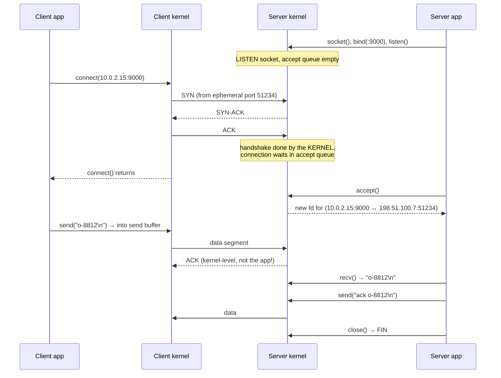
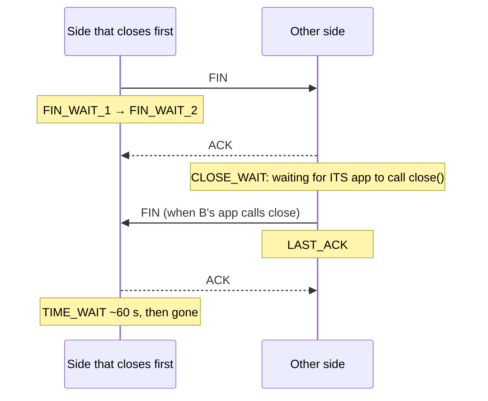

# Sockets

> [!abstract] In one sentence
> A socket is a **kernel object that is one end of a communication channel**. A process gets it as a [[Inter-process communication|file descriptor]] and reads and writes it like a file, while the kernel does the networking (TCP handshakes, retransmissions, buffering). A TCP connection is identified by **five things**: protocol, local IP, local port, remote IP, remote port.

## Common misconceptions

**Wrong mental model #1:** "A port is a connection. A server on port 443 can talk to one client at a time on it, and all clients share 'the socket'."

**What's actually true:** a server has **one listening socket** on `:443`, and every accepted client gets its **own connected socket**, all with local port 443. They don't collide because the kernel tells them apart by the **full 5-tuple**: `(TCP, 203.0.113.10:443, 198.51.100.7:51234)` and `(TCP, 203.0.113.10:443, 198.51.100.8:40001)` are different connections. A server can hold hundreds of thousands of connections on one port.

**Wrong mental model #2:** "When `send()` returns, the data has arrived."

**What's actually true:** `send()` returns when the data is **copied into the kernel's send buffer**. The kernel transmits it later, retransmits if needed, and the other side's kernel puts it in its **receive buffer** until the app calls `recv()`. If the connection dies a second later, data I "sent" may never have arrived. Only an **application-level acknowledgment** proves the other app got it.

| Wrong mental model | What's actually true |
|---|---|
| One `recv()` returns one message | TCP is a **byte stream**: one `send("hello")` can arrive as `"he"` + `"llo"`, and two sends can arrive glued together. The app must **frame** messages (length prefix, delimiter, `Content-Length`) |
| A client also needs a fixed port | The kernel picks a random **ephemeral port** for the client side (Linux: 32768–60999) |
| The 65,535 port limit caps a server at 65k connections | Ports limit connections **from one client IP to one server IP:port** (the other 4 parts of the tuple vary). A server is limited by memory and fds, not ports |
| `accept()` performs the TCP handshake | The **kernel** completes the handshake as soon as the SYN arrives. `accept()` just takes a finished connection from the queue |
| "Connection refused" and "connection timed out" are the same failure | Refused = a host answered with RST (**nothing listening** on that port). Timeout = **no answer** at all (a firewall dropped it, host down, routing) |
| Listening on `127.0.0.1` is the same as `0.0.0.0` | `127.0.0.1`: reachable only from the machine itself. `0.0.0.0`: on **every** interface. The classic "works with curl on the server, not from outside / not from Docker" bug |
| Closing a socket frees the port immediately | The side that closes first keeps the connection in **TIME_WAIT** for ~60 s |

## Socket types

`socket(family, type)` picks two things:

| Family | Address | | Type | Meaning |
|---|---|---|---|---|
| `AF_INET` | IPv4 + port | | `SOCK_STREAM` | Reliable byte stream: **TCP** |
| `AF_INET6` | IPv6 + port | | `SOCK_DGRAM` | Separate messages, no guarantee: **UDP** |
| `AF_UNIX` | A file path | | `SOCK_RAW` | Raw IP packets, build headers yourself (`ping`, needs privileges) |
| `AF_PACKET` | An interface | | | Whole Ethernet frames (`tcpdump`) |

`AF_UNIX` sockets are the local kind from [[Inter-process communication#Stage 4: Unix domain sockets, two-way local channels]]: same API, a path instead of IP:port.

## Build-up: an order-notification server

A tiny service on `10.0.2.15` that clients connect to and send order IDs, one per line. Python, because its socket module maps 1:1 to the system calls.

### Stage 1: the system calls

```python
# server.py
import socket

srv = socket.socket(socket.AF_INET, socket.SOCK_STREAM)   # 1. socket(): get an fd
srv.setsockopt(socket.SOL_SOCKET, socket.SO_REUSEADDR, 1)
srv.bind(("0.0.0.0", 9000))                                # 2. bind(): claim IP:port
srv.listen(128)                                            # 3. listen(): become a server, backlog 128

while True:
    conn, addr = srv.accept()                              # 4. accept(): a NEW socket per client
    print("client", addr)                                  #    e.g. ('198.51.100.7', 51234)
    data = conn.recv(4096)                                 # 5. recv(): bytes from the receive buffer
    conn.sendall(b"ack " + data)                           # 6. send(): bytes into the send buffer
    conn.close()                                           # 7. close(): FIN
```

```python
# client.py
import socket
c = socket.create_connection(("10.0.2.15", 9000))   # socket() + connect(): kernel picks the source port
c.sendall(b"o-8812\n")
print(c.recv(4096))
c.close()
```

Or with no code at all: `nc 10.0.2.15 9000` and type.

What each call does on the wire:



### Stage 2: seeing them with `ss`

```bash
ss -tlnp            # t=TCP l=listening n=numeric p=process
# State   Recv-Q Send-Q Local Address:Port  Peer Address:Port Process
# LISTEN  0      128    0.0.0.0:9000        0.0.0.0:*         users:(("python3",pid=2211,fd=3))

ss -tnp state established '( sport = :9000 )'
# ESTAB 0 0 10.0.2.15:9000 198.51.100.7:51234 users:(("python3",pid=2211,fd=4))
# ESTAB 0 0 10.0.2.15:9000 198.51.100.8:40001 users:(("python3",pid=2211,fd=5))
# ESTAB 0 0 10.0.2.15:9000 198.51.100.7:51240 users:(("python3",pid=2211,fd=6))
```

One listening socket (fd 3) and one socket **per connection** (fd 4, 5, 6), all on local port 9000. Even the same client IP `198.51.100.7` has two connections, distinguished by source port:

| Proto | Local | Remote | fd |
|---|---|---|---|
| TCP | `10.0.2.15:9000` | `*:*` (listening) | 3 |
| TCP | `10.0.2.15:9000` | `198.51.100.7:51234` | 4 |
| TCP | `10.0.2.15:9000` | `198.51.100.8:40001` | 5 |
| TCP | `10.0.2.15:9000` | `198.51.100.7:51240` | 6 |

For a **listening** socket, `Recv-Q` = connections waiting in the accept queue and `Send-Q` = the backlog size. For an **established** one, `Recv-Q` = bytes received but not yet read by the app, `Send-Q` = bytes sent but not yet acknowledged by the peer. A `Recv-Q` that keeps growing means **the app isn't reading fast enough**.

### Stage 3: it works locally but not from outside

Four failures, four different symptoms:

| Situation | What the client sees | Why |
|---|---|---|
| Server bound to `127.0.0.1:9000` | `Connection refused` from other machines | Nothing listens on `10.0.2.15:9000`, the kernel answers RST |
| Server not running | `Connection refused` | Same: RST |
| Firewall / security group drops port 9000 | `Connection timed out` (after ~2 min of SYN retries) | No answer at all |
| App in a Docker container bound to `127.0.0.1` | Refused through the published port | The container's loopback isn't the host's: bind `0.0.0.0` inside the container |

```bash
nc -vz 10.0.2.15 9000      # quick test: "succeeded" / "refused" / hangs (timeout)
```

### Stage 4: a thousand clients at once

The server above handles **one client at a time**: while it's blocked in `recv()` waiting for client A, client B waits in the accept queue. Options, in historical order:

| Model | How | Limit |
|---|---|---|
| **Process per connection** | `fork()` after `accept()` | Heavy: ~MBs per client. Old Apache, PostgreSQL (one backend per connection, hence connection poolers) |
| **Thread per connection** | A thread blocks on each socket | Thousands of threads = memory and context-switching cost |
| **Event loop** (non-blocking + `epoll`) | Sockets set non-blocking. One thread asks the kernel "which of my 10,000 sockets are ready?" and handles only those | One loop per CPU core handles tens of thousands of connections: **nginx, Node.js, Python asyncio, Go's runtime underneath** |

The event-loop version in Python asyncio:

```python
import asyncio

async def handle(reader, writer):
    async for line in reader:              # waits without blocking other clients
        writer.write(b"ack " + line)
        await writer.drain()               # respects the send buffer (backpressure)
    writer.close()

async def main():
    server = await asyncio.start_server(handle, "0.0.0.0", 9000)
    await server.serve_forever()

asyncio.run(main())
```

Each connection still uses **one file descriptor**: 10,000 clients need `ulimit -n` (systemd: `LimitNOFILE=`) above 10,000, or `accept()` fails with **"Too many open files"**.

### Stage 5: a byte stream, not messages

A client sends `o-8812\n` then `o-8813\n` quickly. The server's `recv(4096)` returns `o-8812\no-88` and the next one `13\n`. Nothing is wrong: TCP delivers **bytes in order**, not messages. The application protocol has to say where messages end:

| Framing | Example |
|---|---|
| Delimiter | One message per line (`\n`): Redis, SMTP, my server above (`async for line`) |
| Length prefix | 4 bytes of length, then the payload: Kafka, PostgreSQL, gRPC |
| Header with length | `Content-Length` or chunked: [[HTTP]] |
| Frames | [[HTTP2\|HTTP/2]] frames, [[WebSocket]] frames |

**UDP** sockets are the opposite: each `sendto()` is one datagram, and each `recvfrom()` returns exactly one whole datagram (or nothing, if it was lost). No connection, no ordering, no retransmission, no `accept()`: one UDP socket can talk to many peers (DNS servers do this).

**Buffers and backpressure:** if the receiver's app reads slowly, its receive buffer fills, TCP advertises a **zero window**, the sender's send buffer fills, and the sender's `send()` **blocks** (or returns `EAGAIN` when non-blocking). That's how a slow consumer slows down a fast producer without losing data.

### Stage 6: closing, TIME_WAIT and CLOSE_WAIT



- **TIME_WAIT** sits on the side that closed **first**, for 2×MSL (60 s on Linux). It protects against a late packet from the old connection being mistaken for a new one with the same 5-tuple. Normal, harmless in moderation
- **CLOSE_WAIT** means the peer closed, but **my application hasn't called `close()`**. Nothing in the kernel times it out. Hundreds of CLOSE_WAIT sockets = an **app bug** (a leaked connection, usually in an error path)
- **"Address already in use"** when restarting a server: old connections on that port are in TIME_WAIT. `SO_REUSEADDR` (set in my server above) allows binding anyway. Every real server sets it
- `SO_REUSEPORT` lets **several processes** bind the same port, and the kernel spreads new connections across them (nginx `reuseport`)

## Advanced problems

### 1. Ephemeral port exhaustion

An app opens a **new** TCP connection for each call to an internal API at `10.0.5.20:8080`, and closes it after. Each one leaves a TIME_WAIT for 60 s on the client side. Ports available for one destination: ~28,000 (32768–60999). Above ~470 new connections/second to the **same** destination, the client runs out: `connect()` fails with `EADDRNOTAVAIL` / "Cannot assign requested address".

Fixes: **reuse connections** (HTTP keep-alive, connection pools), spread over more destination IPs, widen `net.ipv4.ip_local_port_range`, `net.ipv4.tcp_tw_reuse=1` for outgoing connections. The same exhaustion happens **in a NAT gateway**, which is a shared client for a whole subnet (see [[NAT and PAT#4. Port exhaustion]]).

### 2. Accept queue overflow

Under a traffic spike, clients get timeouts while the server's CPU is low. `ss -tlnp` shows `Recv-Q` equal to `Send-Q` on the listening socket: the **accept queue is full** (the app doesn't call `accept()` fast enough, or the backlog is tiny), so the kernel **drops new SYNs**. `nstat -az TcpExtListenOverflows` counts them.

Fixes: a bigger backlog (`listen(4096)` **and** `net.core.somaxconn`, which caps it), more workers accepting, or find what's blocking the accept loop.

### 3. CLOSE_WAIT leak

`ss -tan state close-wait | wc -l` grows every hour, then the app hits its fd limit and stops accepting. The remote side (often a database or an upstream API timing out idle connections) closed, and the app never closed its end. It's always the **application**: find the code path that drops a connection without closing it (missing `finally` / `with`).

### 4. Half-open connections

A client's laptop loses Wi-Fi. No FIN, no RST is ever sent. The server's socket stays ESTABLISHED **forever**, holding memory and an fd, because TCP doesn't send anything on an idle connection. Fixes: application **heartbeats** with a timeout, or **TCP keepalive** (`SO_KEEPALIVE`, with `tcp_keepalive_time` lowered from the default 2 hours). Same reason long-lived [[WebSocket]] connections need pings.

## In AWS
- [[Security groups]] are **stateful**: they track each connection by its 5-tuple, so the return traffic of an allowed connection is allowed automatically
- **Network ACLs are stateless**: replies go to the client's **ephemeral port**, so an outbound NACL rule must allow **1024–65535** to clients (see [[ACL]]). Exam classic
- **NAT gateway**: ~55,000 simultaneous connections per unique destination (IP, port, protocol), metric `ErrorPortAllocation` when exhausted
- Load balancers have **idle timeouts** (ALB 60 s, NLB 350 s): they close idle sockets, so apps need keepalives or reconnect logic

## Practice

> [!example]- A server on port 443 has 5,000 connected clients. How many sockets, and how are they told apart?
> 5,001: one listening socket plus one per connection. They differ by the remote IP and port in the 5-tuple.

> [!example]- `recv()` returned only half of what the client sent. Bug in TCP?
> No. TCP is a byte stream. The app must loop and frame messages (delimiter, length prefix).

> [!example]- "Connection refused" vs "Connection timed out": where do I look for each?
> Refused: nothing listening on that IP:port (app down, bound to 127.0.0.1, wrong port). Timeout: something drops packets (firewall, security group, routing).

> [!example]- After restarting my server it fails with "Address already in use". Why, and the fix?
> Old connections on that port are in TIME_WAIT. Set `SO_REUSEADDR` before `bind()`.

> [!example]- Thousands of sockets in CLOSE_WAIT. Network problem?
> No, app bug: the peer closed, the application never called close(). Find the leaking code path.

> [!example]- A service calling one internal API gets "Cannot assign requested address" under load. Cause?
> Ephemeral port exhaustion from opening a new connection per call (TIME_WAIT). Reuse connections with a pool or keep-alive.

> [!example]- Why must a NACL allow outbound 1024–65535 for a web server?
> Responses go to the clients' ephemeral ports, and NACLs are stateless.

## Easy to get wrong
- Thinking one port = one connection
- Assuming `send()` means delivered
- Expecting message boundaries from TCP
- Binding to 127.0.0.1 in a container or for a public service
- Confusing refused (RST) with timed out (dropped)
- Opening a new connection per request (ephemeral ports, TIME_WAIT, handshake cost)
- Treating CLOSE_WAIT as a network issue: it's the app not closing
- Leaving the default fd limit on a busy server
- Raising the `listen()` backlog without raising `somaxconn`
- Forgetting idle connections can be dead (half-open) without heartbeats

## Related
- Comes from:: [[Inter-process communication]]
- Underneath:: *[[TCP and UDP]]*, [[Network layers]], [[Network interfaces]]
- Protocols on top:: [[HTTP]], [[HTTP2]], [[WebSocket]], [[TLS]]
- Ports and translation:: [[NAT and PAT]], [[Outbound-initiated connections]]
- Filtering:: [[ACL]], [[Security groups]]
- Load balancers holding sockets:: [[Load balancing]], [[Load balancers]]

## Flashcards
#flashcards

What is a socket? :: A kernel object representing one end of a communication channel, used by a process through a file descriptor
What five things identify a TCP connection? :: Protocol, local IP, local port, remote IP, remote port
Order of server socket calls? :: socket(), bind(), listen(), accept(), then recv()/send(), close()
What does accept() return? :: A new socket for one client connection. The listening socket keeps listening
Who performs the TCP handshake, accept() or the kernel? :: The kernel. accept() takes an already-established connection from the queue
What does send() returning mean? :: The data was copied to the kernel send buffer, not that the peer received it
Why can't you rely on one recv() = one message with TCP? :: TCP is a byte stream. Messages must be framed by the application
What is an ephemeral port? :: The source port the kernel picks for a client connection (Linux 32768–60999)
Connection refused vs timed out? :: Refused: RST, nothing listening. Timed out: no answer, packets dropped
127.0.0.1 vs 0.0.0.0 bind? :: 127.0.0.1: only local connections. 0.0.0.0: all interfaces
What is TIME_WAIT and who has it? :: ~60 s state on the side that closed first, protecting against late packets
What does CLOSE_WAIT mean? :: The peer closed but the local application hasn't called close(). Many = app leak
What does SO_REUSEADDR fix? :: "Address already in use" when restarting a server with connections in TIME_WAIT
What does SO_REUSEPORT allow? :: Several processes binding the same port, the kernel spreads connections between them
How does one thread handle 10,000 connections? :: Non-blocking sockets and an event loop using epoll
Recv-Q growing on an established socket means? :: The application isn't reading data fast enough
Recv-Q equal to backlog on a listening socket means? :: Accept queue full: new SYNs are dropped
What causes ephemeral port exhaustion? :: Many short-lived connections to the same destination, each leaving TIME_WAIT. Fix: reuse connections
UDP socket vs TCP socket? :: UDP: separate datagrams, no connection, no ordering or retransmission. TCP: reliable ordered byte stream
What is a half-open connection? :: One side vanished without FIN/RST, the other still thinks it's established. Detected by heartbeats/keepalive
Why do NACLs need outbound 1024–65535? :: Replies go to clients' ephemeral ports and NACLs are stateless
