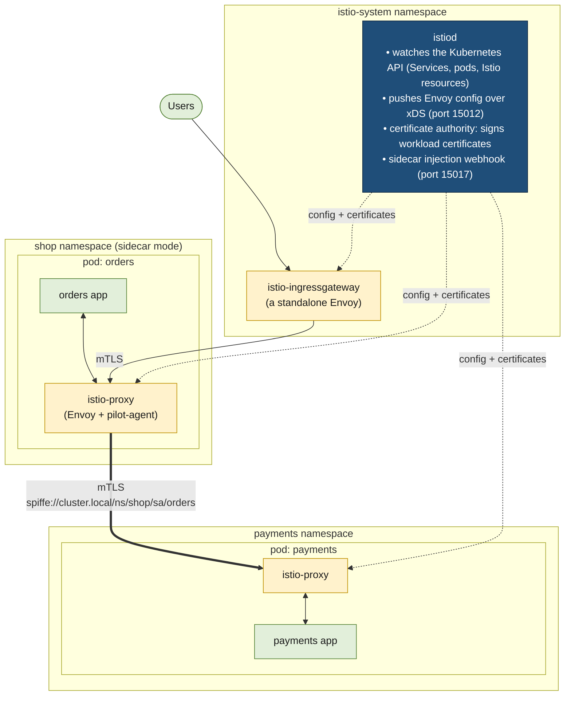
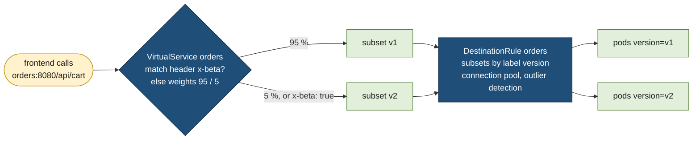
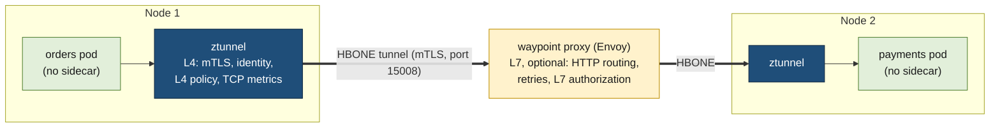

# Istio

> [!abstract] In one sentence
> Istio is the most widely used open-source [[Service mesh]] for Kubernetes: a control plane, **istiod**, turns a handful of Kubernetes custom resources (who may talk to whom, how traffic is routed, what is encrypted) into configuration for **Envoy** proxies running next to every workload (sidecar mode) or on every node (ambient mode), so mTLS (mutual TLS (Transport Layer Security)), authorization, routing, retries and metrics happen for every service without touching application code.

[[Service mesh]] explains *why* a mesh exists and the general architecture. [[Resilience in a service mesh]] covers timeouts, retries and outlier detection in depth. This note is about **Istio itself**: installing it, the objects I write, rolling it out on a real application, debugging it, upgrading it, and what goes wrong.

## Build-up: the shop on Kubernetes gets a mesh

The e-commerce shop from [[Kubernetes worked example]] has grown into five services on one cluster: `frontend`, `orders`, `inventory` and `catalog` in the `shop` namespace, and `payments` (owned by another team) in the `payments` namespace. They talk over plain HTTP (Hypertext Transfer Protocol) and gRPC (gRPC Remote Procedure Calls), through Kubernetes Services ([[Kubernetes Service]]).

Three requests arrive from security and the platform team:
1. **Encrypt and authenticate every call inside the cluster** (a compliance audit flagged plain-text traffic between pods)
2. **Only `orders` may call `payments`**, whatever IP (Internet Protocol) address the caller has today
3. **Release `orders` v2 to 5 % of users first**, and see per-version error rates

Doing that in every service, in three languages, is what a mesh replaces. The stages below add Istio one piece at a time.

### Stage 1: what gets installed



- **istiod** is the whole control plane in one binary. Older Istio versions had separate components (Pilot for config, Citadel for certificates, Galley for validation, Mixer for telemetry); they were merged into istiod in 1.5, and names like "Pilot" still show up in logs and environment variables
- **xDS** (the "x discovery service" family of Envoy APIs: listeners, routes, clusters, endpoints, secrets) is the protocol istiod uses to stream configuration to every proxy. When I change a resource, istiod recomputes and pushes; no proxy restarts
- **The data plane** is Envoy. In sidecar mode, every pod gets an `istio-proxy` container: Envoy plus `pilot-agent`, a small helper that starts Envoy, fetches its certificate from istiod over SDS (Secret Discovery Service) and handles health checks
- **Gateways** are Envoys without an application: an **ingress gateway** for traffic coming in, optionally an **egress gateway** for traffic going out

**Installing.** Two supported ways: `istioctl` (Istio's own CLI (command-line interface)) or Helm charts. Production installs usually go through Helm (or GitOps with Helm), because it fits the way the rest of the cluster is managed:

```bash
helm repo add istio https://istio-release.storage.googleapis.com/charts
helm repo update

# 1. the CRDs (CustomResourceDefinitions) and cluster-wide pieces
helm install istio-base istio/base -n istio-system --create-namespace --version 1.27.1

# 2. the control plane
helm install istiod istio/istiod -n istio-system --version 1.27.1 \
  --set meshConfig.accessLogFile=/dev/stdout \
  --set meshConfig.defaultConfig.holdApplicationUntilProxyStarts=true

# 3. an ingress gateway, in its own namespace
helm install istio-ingress istio/gateway -n istio-ingress --create-namespace --version 1.27.1
```

(Version numbers here are examples: Istio releases roughly every quarter and supports each release for about six months, so I pin a current supported one and plan upgrades, see Stage 9.)

The equivalent with `istioctl` is one line, `istioctl install --set profile=default -y`. **Profiles** are presets: `default` (istiod + ingress gateway, the production starting point), `minimal` (istiod only), `ambient` (Stage 8), and `demo` (everything turned up, 100 % trace sampling: for tutorials only).

```bash
$ kubectl get pods -n istio-system
NAME                      READY   STATUS    RESTARTS   AGE
istiod-7c9d8f6b5d-2kq4x   1/1     Running   0          2m
$ istioctl version
client version: 1.27.1
control plane version: 1.27.1
data plane version: none        # no workload in the mesh yet
```

### Stage 2: joining workloads to the mesh (sidecar injection)

Nothing changes for the apps until their pods get a proxy. Injection is per namespace, through a label that the istiod **mutating admission webhook** looks for when a pod is created:

```bash
kubectl label namespace shop istio-injection=enabled
kubectl rollout restart deployment -n shop      # existing pods only get a sidecar when recreated
```

```bash
$ kubectl get pods -n shop
NAME                         READY   STATUS    RESTARTS   AGE
orders-6f9c7d8b4-x8k2p       2/2     Running   0          40s     # app + istio-proxy
frontend-5d8b6c9f7-q4m1z     2/2     Running   0          41s
```

**How the proxy gets the traffic.** An init container (`istio-init`), or the **Istio CNI (Container Network Interface) plugin** in clusters that don't allow privileged init containers, writes iptables rules inside the pod's network namespace ([[Network interfaces]]): every outbound connection is redirected to Envoy on port **15001**, every inbound one to port **15006**. The app still connects to `payments.payments.svc.cluster.local:8080` in plain HTTP; Envoy intercepts it, picks a `payments` pod, and opens mTLS to that pod's proxy.

**Startup and shutdown order.** A sidecar is just another container, so two races appear:
- **At startup**, the app may send its first request before Envoy is ready, and it fails (connection refused). `holdApplicationUntilProxyStarts: true` (set globally in Stage 1, or per pod with an annotation) makes Kubernetes start the app only once the proxy is ready
- **At the end of a Job**, the app exits but `istio-proxy` keeps running, so the Job never completes. Kubernetes **native sidecar containers** (an init container with `restartPolicy: Always`, Kubernetes 1.29+) fix both races: Istio can inject the proxy that way (the default in recent releases on supported clusters), and Kubernetes then starts it before the app and stops it after

**Tell Istio the protocol.** Envoy treats a port as HTTP, gRPC or raw TCP (Transmission Control Protocol) depending on what it is told: a Service port **name** prefix (`http-web`, `grpc-api`, `tcp-db`) or the `appProtocol` field. Without either, Istio sniffs the first bytes, which mostly works but breaks with server-first protocols (MySQL, SMTP (Simple Mail Transfer Protocol)) where the client waits for the server to speak first. HTTP features (retries, routing by path, per-request metrics) only exist on ports Istio knows are HTTP.

```yaml
apiVersion: v1
kind: Service
metadata: { name: orders, namespace: shop }
spec:
  selector: { app: orders }
  ports:
    - name: http-api          # or: appProtocol: http
      port: 8080
      targetPort: 8080
```

### Stage 3: encrypt everything (mTLS, without breaking the cluster)

Once the sidecars are in, Istio already does **auto mTLS**: when both ends have a proxy, Envoy uses mTLS automatically. But the server side still **accepts plain text** (the default mode is `PERMISSIVE`), so a pod without a sidecar, or an attacker inside the network, can still call `payments` in clear.

Each workload's certificate carries its identity as a SPIFFE (Secure Production Identity Framework For Everyone) ID built from its Kubernetes service account: `spiffe://cluster.local/ns/shop/sa/orders` ([[Workload identity (SPIFFE)]]). The certificates live 24 hours and are rotated in memory by pilot-agent: no files, no restarts.

**Moving to STRICT, safely:**
1. Inject sidecars everywhere that needs to talk to meshed services (namespaces without them will be cut off)
2. Check who still sends plain text. In Kiali's graph, or in the metrics: `istio_requests_total{connection_security_policy="none"}` per destination
3. Turn on `STRICT` one namespace at a time, starting with the most sensitive:

```yaml
apiVersion: security.istio.io/v1
kind: PeerAuthentication
metadata:
  name: default
  namespace: payments          # this namespace only
spec:
  mtls:
    mode: STRICT
```

4. When everything is green, set it mesh-wide (the same object in `istio-system`, the root namespace)

What keeps working under STRICT: Kubernetes liveness and readiness probes, because Istio **rewrites HTTP probes** to go through pilot-agent (port 15020), which calls the app locally. What breaks: anything without a sidecar calling into the mesh (a monitoring agent scraping pods from outside the mesh, a legacy VM (virtual machine), a node-level health check aimed straight at a pod).

> [!warning] A DestinationRule can switch mTLS off
> A `DestinationRule` with `trafficPolicy.tls.mode: DISABLE` (or `SIMPLE`) for a meshed host tells the **client** not to use Istio mTLS. Against a STRICT server, every call then fails with a connection reset. Only set `tls` in a DestinationRule for hosts outside the mesh; inside it, leave it out or use `ISTIO_MUTUAL`.

### Stage 4: who may call whom (AuthorizationPolicy)

mTLS proves *who* is calling. `AuthorizationPolicy` decides *whether* they may. The rule from the security team, "only `orders` may call `payments`, and only `POST /charges`":

```yaml
# 1. deny everything in the payments namespace by default
apiVersion: security.istio.io/v1
kind: AuthorizationPolicy
metadata:
  name: deny-all
  namespace: payments
spec: {}                       # empty spec = matches nothing = nothing is allowed
---
# 2. then allow exactly what is needed
apiVersion: security.istio.io/v1
kind: AuthorizationPolicy
metadata:
  name: payments-from-orders
  namespace: payments
spec:
  selector:
    matchLabels: { app: payments }
  action: ALLOW
  rules:
    - from:
        - source:
            principals: ["cluster.local/ns/shop/sa/orders"]
      to:
        - operation:
            methods: ["POST"]
            paths: ["/charges", "/charges/*"]
```

How Istio evaluates them, per request, on the **receiving** proxy:
1. `CUSTOM` policies (delegating to an external authorizer such as OPA (Open Policy Agent)) run first
2. Any matching `DENY` policy → **403**
3. If **no** `ALLOW` policy applies to the workload → allowed
4. If at least one `ALLOW` policy applies → the request must match one of them, otherwise **403** (`RBAC: access denied`)

Point 3 is why the explicit deny-all matters: without it, removing the last ALLOW policy silently opens everything again. Rules on `principals` need mTLS (the identity comes from the client certificate), so they only work once Stage 3 is done. `ipBlocks` and `namespaces` also exist, but identities are the point: they survive pod restarts and IP changes, which IP-based rules ([[Kubernetes NetworkPolicy]], [[Security groups]]) don't.

**End-user identity (JWT).** For the `frontend`'s API, the users' JWTs (JSON (JavaScript Object Notation) Web Tokens) can be checked at the proxy:

```yaml
apiVersion: security.istio.io/v1
kind: RequestAuthentication
metadata: { name: shop-users, namespace: shop }
spec:
  selector: { matchLabels: { app: frontend } }
  jwtRules:
    - issuer: "https://login.example.com/"
      jwksUri: "https://login.example.com/.well-known/jwks.json"
---
apiVersion: security.istio.io/v1
kind: AuthorizationPolicy
metadata: { name: frontend-require-jwt, namespace: shop }
spec:
  selector: { matchLabels: { app: frontend } }
  action: ALLOW
  rules:
    - from:
        - source:
            requestPrincipals: ["*"]     # any valid token
```

> [!warning] RequestAuthentication alone doesn't require a token
> It **rejects invalid** tokens, but a request with **no** token passes. Only the AuthorizationPolicy with `requestPrincipals` makes a token mandatory. Token concepts are in [[JWT and bearer tokens]].

### Stage 5: getting traffic in (the ingress gateway)

The ingress gateway is an Envoy deployment behind a `LoadBalancer` Service. Two APIs can configure it:
- Istio's own `Gateway` + `VirtualService` (the classic way, most examples online)
- The **Kubernetes Gateway API** (`Gateway` + `HTTPRoute`, see [[Kubernetes Ingress]]), which Istio implements and recommends for new setups. Ambient mode uses it for waypoints

With the Gateway API, Istio **creates the gateway deployment itself** from a `Gateway` object:

```yaml
apiVersion: gateway.networking.k8s.io/v1
kind: Gateway
metadata: { name: shop-gateway, namespace: istio-ingress }
spec:
  gatewayClassName: istio
  listeners:
    - name: https
      hostname: "shop.example.com"
      port: 443
      protocol: HTTPS
      tls:
        mode: Terminate
        certificateRefs:
          - name: shop-example-com-tls      # a kubernetes.io/tls Secret, e.g. from cert-manager
      allowedRoutes:
        namespaces: { from: All }
---
apiVersion: gateway.networking.k8s.io/v1
kind: HTTPRoute
metadata: { name: frontend, namespace: shop }
spec:
  parentRefs:
    - name: shop-gateway
      namespace: istio-ingress
  hostnames: ["shop.example.com"]
  rules:
    - matches: [{ path: { type: PathPrefix, value: / } }]
      backendRefs: [{ name: frontend, port: 8080 }]
```

The same with Istio's API, which still appears in most existing clusters:

```yaml
apiVersion: networking.istio.io/v1
kind: Gateway
metadata: { name: shop-gateway, namespace: istio-ingress }
spec:
  selector: { istio: ingressgateway }    # which gateway pods apply this
  servers:
    - port: { number: 443, name: https, protocol: HTTPS }
      hosts: ["shop.example.com"]
      tls: { mode: SIMPLE, credentialName: shop-example-com-tls }
---
apiVersion: networking.istio.io/v1
kind: VirtualService
metadata: { name: frontend, namespace: shop }
spec:
  hosts: ["shop.example.com"]
  gateways: ["istio-ingress/shop-gateway"]
  http:
    - route:
        - destination: { host: frontend.shop.svc.cluster.local, port: { number: 8080 } }
```

The TLS termination, `X-Forwarded-For` and "real client IP" questions are the same as any [[Reverse proxy]]: behind a cloud load balancer in TCP mode, the gateway sees the load balancer's address unless the PROXY protocol is enabled or the Service uses `externalTrafficPolicy: Local`.

### Stage 6: routing inside the mesh (canary for orders v2)

Two objects split the job, and confusing them is the most common Istio mistake:

| Object | Question it answers | Applied where |
|---|---|---|
| `VirtualService` | **Where** does a request for this host go? (match on path, header; weights; timeouts; retries; fault injection; mirroring) | Routing, on the client side |
| `DestinationRule` | **How** do I talk to the chosen destination? (subsets by label, load balancing, connection pool, outlier detection, TLS) | After routing, per destination |



Both Deployments sit behind the **same** `orders` Service; they differ only by a `version` label:

```yaml
apiVersion: networking.istio.io/v1
kind: DestinationRule
metadata: { name: orders, namespace: shop }
spec:
  host: orders.shop.svc.cluster.local
  subsets:
    - name: v1
      labels: { version: v1 }
    - name: v2
      labels: { version: v2 }
  trafficPolicy:
    outlierDetection:            # eject a pod that keeps failing (details: Resilience in a service mesh)
      consecutive5xxErrors: 5
      interval: 10s
      baseEjectionTime: 30s
---
apiVersion: networking.istio.io/v1
kind: VirtualService
metadata: { name: orders, namespace: shop }
spec:
  hosts: ["orders.shop.svc.cluster.local"]
  http:
    - match:
        - headers:
            x-beta: { exact: "true" }      # testers always get v2
      route:
        - destination: { host: orders.shop.svc.cluster.local, subset: v2 }
    - route:
        - destination: { host: orders.shop.svc.cluster.local, subset: v1 }
          weight: 95
        - destination: { host: orders.shop.svc.cluster.local, subset: v2 }
          weight: 5
      timeout: 3s
      retries:
        attempts: 2
        perTryTimeout: 1s
        retryOn: connect-failure,refused-stream,unavailable
```

Then I watch v2's error rate and latency (Stage 7) and move the weights: 5 → 25 → 50 → 100. The routing applies **in the caller's proxy**, so it works for calls from `frontend` but not for something calling a pod IP directly, and it needs the subsets to exist first: a VirtualService pointing at a subset that no DestinationRule defines returns **503** with response flag `NR` (no route). The rollout ideas themselves (canary vs blue/green, shadow traffic) are in [[Deployment strategies]]; tools like Argo Rollouts or Flagger can move the weights automatically based on metrics.

Other VirtualService features worth knowing: `mirror` (copy traffic to v2 and throw the answers away), `fault` (inject delays or aborts to test callers' timeouts), `rewrite` and `redirect`. Timeouts and retries are covered properly in [[Resilience in a service mesh]], including Istio's **default retry policy** on 503s, a trap for non-idempotent writes.

### Stage 7: seeing what happens (observability)

Every proxy produces, without code changes:
- **Metrics** in Prometheus format: `istio_requests_total` (with `source_workload`, `destination_workload`, `destination_version`, `response_code`, `connection_security_policy` labels), `istio_request_duration_milliseconds`, TCP byte counters. Envoy exposes them on port 15090, merged with the app's own metrics on 15020
- **Access logs** (enabled in Stage 1 with `accessLogFile`), one line per request, with a **response flag** column that explains Istio-generated errors
- **Trace spans** for every hop, sent to Jaeger, Zipkin or an OpenTelemetry collector. The app still has to **forward the trace headers** (`traceparent`, `x-b3-*`) from each incoming request to its outgoing ones, or each hop is its own trace

The comparison that matters during the canary:

```promql
sum by (destination_version) (rate(istio_requests_total{destination_workload=~"orders-.*", response_code=~"5.."}[5m]))
/
sum by (destination_version) (rate(istio_requests_total{destination_workload=~"orders-.*"}[5m]))
```

The **Telemetry API** sets sampling and log settings per namespace or workload (the default trace sampling is 1 %):

```yaml
apiVersion: telemetry.istio.io/v1
kind: Telemetry
metadata: { name: shop-tracing, namespace: shop }
spec:
  tracing:
    - providers: [{ name: otel }]
      randomSamplingPercentage: 10
```

**Kiali** draws the service graph (who calls whom, with error rates and a padlock where mTLS is used) and validates Istio config. The Prometheus, Grafana, Kiali and Jaeger "addons" shipped in Istio's samples are for trying things out; in production they come from the cluster's own monitoring stack.

### Stage 8: the cost of sidecars, and ambient mode

With 400 pods, 400 Envoys each reserve CPU (central processing unit) and memory (often 50–100 MiB each, more in a big mesh, because by default **every proxy receives config for every service in the mesh**). Upgrading Istio means restarting every pod to get the new proxy.

**First fix, in sidecar mode: the `Sidecar` resource.** It limits what config a proxy receives to the services its workload actually calls:

```yaml
apiVersion: networking.istio.io/v1
kind: Sidecar
metadata: { name: default, namespace: shop }
spec:
  egress:
    - hosts:
        - "./*"                       # services in my own namespace
        - "payments/payments.payments.svc.cluster.local"
        - "istio-system/*"
```

In big meshes that cuts proxy memory and istiod push time by a large factor. The catch: a call to a host not listed goes out as unknown traffic (or is blocked, with `REGISTRY_ONLY`, see Advanced problem 6).

**Second fix: ambient mode** (generally available since Istio 1.24). It splits the proxy's job in two:



- **ztunnel** ("zero-trust tunnel"), one per node (a DaemonSet, [[Kubernetes DaemonSet]]), handles the L4 (layer 4, transport) part: mTLS with each pod's own identity, L4 authorization (identities, ports), TCP metrics. Traffic between nodes travels in **HBONE** (HTTP-Based Overlay Network Environment): mTLS-encrypted HTTP CONNECT tunnels on port 15008
- **Waypoint proxies** are ordinary Envoy deployments, created only for namespaces or services that need L7 (layer 7, application) features: HTTP routing, retries, path-based authorization. Many namespaces never need one
- A namespace joins with a label, and **pods don't restart**: `kubectl label namespace shop istio.io/dataplane-mode=ambient`
- A waypoint is a Gateway API object: `istioctl waypoint apply -n payments --enroll-namespace`, and L7 policies then attach to it (with `targetRefs`) instead of using a workload `selector`

| | Sidecar | Ambient |
|---|---|---|
| Proxies | One Envoy per pod | One ztunnel per node + waypoints only where L7 is needed |
| Resources | Highest | Much lower |
| Joining / upgrading | Pod restart | No pod restart for ztunnel; waypoints upgrade like any deployment |
| L7 features | Everywhere, always | Only through a waypoint |
| Maturity, ecosystem | The long-standing default, every feature, most docs | Newer; some features and integrations still catching up |
| Blast radius | A bad proxy hurts one pod | A bad ztunnel hurts every meshed pod on its node |

For a new mesh I'd evaluate ambient first; an existing sidecar mesh can move namespace by namespace, since both modes interoperate.

### Stage 9: running it for years (upgrades)

Upgrading the control plane in place and hoping every proxy version still works with it is how meshes break. Istio's answer is **revisions**: two control planes side by side, and namespaces moved from one to the other.

```bash
# 1. install the new control plane next to the old one
helm install istiod-1-28 istio/istiod -n istio-system --version 1.28.0 --set revision=1-28

# 2. revision tags: stable names that point to a revision
istioctl tag set prod-stable --revision 1-27 --overwrite
istioctl tag set prod-canary --revision 1-28

# 3. namespaces use a tag instead of istio-injection=enabled
kubectl label namespace shop istio-injection- istio.io/rev=prod-canary --overwrite
kubectl rollout restart deployment -n shop     # pods come back with the 1.28 proxy

# 4. when every namespace is happy, move the stable tag and remove the old revision
istioctl tag set prod-stable --revision 1-28 --overwrite
helm uninstall istiod-1-27 -n istio-system
```

```bash
$ istioctl proxy-status
NAME                                CLUSTER     CDS      LDS      EDS      RDS      ECDS    ISTIOD                    VERSION
frontend-5d8b6c9f7-q4m1z.shop       Kubernetes  SYNCED   SYNCED   SYNCED   SYNCED           istiod-1-28-6b7f-xk2p     1.28.0
payments-7f6d9c8b5-m2n4k.payments   Kubernetes  SYNCED   SYNCED   SYNCED   SYNCED           istiod-1-27-5c4d-9qw8     1.27.1
```

Rules that keep upgrades boring: one minor version at a time (Istio supports upgrading across at most two), read the release's upgrade notes for changed defaults, run `istioctl x precheck` before and `istioctl analyze` after, and upgrade the gateways (they're Helm releases too) like any other deployment.

**The root certificate** needs the same care. By default istiod generates a self-signed root CA (certificate authority), valid 10 years, stored in the `istio-ca-secret` Secret. For production I plug in an intermediate CA from the organization's PKI (public key infrastructure) through a `cacerts` Secret, or through cert-manager (istio-csr), so a multi-cluster mesh shares one root and rotating it is a planned, tested event ([[Certificates and PKI]], [[Certificate rotation]]).

### Stage 10: traffic leaving the mesh

By default (`outboundTrafficPolicy: ALLOW_ANY`) a meshed pod can call any external host; Envoy passes it through as plain TCP, with no metrics per host. To control egress ([[Ingress and egress]]):
- Set `meshConfig.outboundTrafficPolicy.mode: REGISTRY_ONLY`: only hosts known to the mesh are reachable
- Declare each allowed external host with a `ServiceEntry`. Then it has metrics, and can have timeouts, retries and TLS origination like an internal service
- Optionally send it through an **egress gateway**, so all outbound traffic leaves from known pods (useful when a firewall or a partner allowlists source IPs)

```yaml
apiVersion: networking.istio.io/v1
kind: ServiceEntry
metadata: { name: payment-provider, namespace: payments }
spec:
  hosts: ["api.payment-provider.example"]
  location: MESH_EXTERNAL
  ports:
    - { number: 443, name: tls, protocol: TLS }
  resolution: DNS
```

`REGISTRY_ONLY` is a guardrail, not a firewall: a compromised pod can bypass its own sidecar's iptables (the redirect is set up inside the pod) unless node-level controls or a [[Kubernetes NetworkPolicy]] also block direct egress.

## Debugging Istio

Most Istio problems are one of: the config isn't what I think, the proxy didn't receive it, or a policy rejected the request. The tools, in the order I'd use them:

```bash
istioctl analyze -n shop                     # static checks: unknown subsets, missing gateways, port names, conflicts
istioctl x describe pod orders-6f9c7d8b4-x8k2p -n shop   # which VirtualService/DestinationRule/policies apply to this pod
istioctl proxy-status                        # is every proxy SYNCED with istiod?
istioctl proxy-config routes   deploy/frontend -n shop   # what routes the frontend's Envoy really has
istioctl proxy-config clusters deploy/frontend -n shop --fqdn orders.shop.svc.cluster.local
istioctl proxy-config endpoints deploy/frontend -n shop --cluster "outbound|8080|v2|orders.shop.svc.cluster.local"
istioctl proxy-config secret   deploy/orders -n shop     # certificate, its SPIFFE ID and expiry
kubectl logs deploy/orders -n shop -c istio-proxy        # access log with response flags
```

The **response flags** in the access log say who produced an error:

| Flag | Meaning | Usual cause |
|---|---|---|
| `NR` | No route configured | VirtualService host or subset doesn't exist, missing DestinationRule subset, wrong port |
| `UH` | No healthy upstream | Every endpoint ejected by outlier detection, or no ready pods (selector/labels wrong) |
| `UF` | Upstream connection failure | mTLS mismatch (DestinationRule `DISABLE` vs STRICT), app not listening, crashed pod |
| `URX` | Retry limit exceeded | The destination kept failing through all retries |
| `UO` | Upstream overflow | Connection pool limits ("circuit breaker") reached |
| `UT` | Upstream request timeout | The route `timeout` fired |
| `UC` / `DC` | Upstream / downstream connection terminated | Idle timeouts, app closing keep-alive connections, client gave up |

A 403 with body `RBAC: access denied` comes from an AuthorizationPolicy; a 503 with a flag comes from Envoy; a 503 **without** a flag came from the app itself.

## Advanced problems

### 1. Everything returns 503 right after enabling STRICT
**Symptom:** calls from some services fail with `upstream connect error or disconnect/reset before headers`, flag `UF`. **Cause:** a client without a sidecar (a namespace without injection, a CronJob in an excluded namespace), or a DestinationRule with `tls.mode: DISABLE` for that host. **Fix:** find plain-text callers before switching (Stage 3), inject them, and remove `tls` from DestinationRules for meshed hosts. Roll STRICT out per namespace.

### 2. The first requests after a pod starts fail
**Symptom:** a burst of connection errors in the app's logs at every deploy, then fine. **Cause:** the app starts before Envoy is ready. **Fix:** `holdApplicationUntilProxyStarts: true`, or native sidecars.

### 3. Jobs never finish
**Symptom:** Job pods stay `Running` (1/2 ready) forever after the work is done. **Cause:** the sidecar doesn't exit with the app. **Fix:** native sidecars (Kubernetes 1.29+); on older setups the app calls `curl -X POST localhost:15020/quitquitquit` when done, or the namespace for batch jobs isn't injected.

### 4. A new route doesn't work
**Symptom:** traffic keeps going to v1 although the VirtualService says 50/50, or returns `NR`. **Cause:** the VirtualService `hosts` doesn't match how the client calls the service (short name `orders` resolved in the wrong namespace, or a different port), the subsets aren't defined, or a second VirtualService for the same host conflicts. **Fix:** `istioctl analyze`, then `istioctl proxy-config routes` on the **calling** pod: routing happens in the caller's proxy, not the destination's.

### 5. istiod and proxies use too much memory in a large mesh
**Symptom:** sidecars at hundreds of MiB, istiod CPU spikes, config pushes taking seconds, `proxy-status` showing STALE. **Cause:** every proxy gets every service's config, and every pod churn triggers pushes to all proxies. **Fix:** `Sidecar` resources per namespace (`./*` plus the real dependencies), `exportTo` on VirtualServices/ServiceEntries to limit their visibility, scale istiod horizontally, or move to ambient.

### 6. An external call breaks after locking down egress
**Symptom:** after `REGISTRY_ONLY`, calls to a payment provider fail with `502` and flag `BlackHoleCluster` in logs. **Cause:** no `ServiceEntry` for that host. **Fix:** add one per external dependency; inventory them first from the access logs (`PassthroughCluster` entries) while still in `ALLOW_ANY`.

### 7. Long-lived connections are cut
**Symptom:** WebSocket or gRPC streams drop every hour, or idle database connections fail on reuse. **Cause:** Envoy's idle and stream timeouts (the HTTP route `timeout` applies to a whole stream; TCP idle timeout defaults to 1 hour), combined with a load balancer's own idle timeout. **Fix:** set the route `timeout: 0s` for streaming routes, tune `connectionPool.tcp.idleTimeout`/`http.idleTimeout`, and keep the app's keep-alives shorter than the proxies' ([[WebSocket]], [[HTTP2]]).

### 8. The webhook blocks pod creation
**Symptom:** after a control plane problem, *no* pods can be created in injected namespaces: `failed calling webhook "namespace.sidecar-injector.istio.io"`. **Cause:** the injection webhook fails closed, and istiod is down, or the API server can't reach istiod on port 15017 (a firewall rule on a private cluster). **Fix:** run istiod with several replicas and a PodDisruptionBudget ([[Kubernetes PodDisruptionBudget]]), allow the control plane to reach 15017, and know the break-glass (temporarily removing the namespace label).

## In AWS

- **On EKS (Elastic Kubernetes Service)**, Istio is self-managed: install it with Helm like on any cluster. AWS's own managed mesh, App Mesh, reached end of support on **30 September 2026** ([[Service mesh]])
- **Ingress**: the gateway's `LoadBalancer` Service gets an NLB (Network Load Balancer) through the AWS Load Balancer Controller (annotations `service.beta.kubernetes.io/aws-load-balancer-type: external`, `aws-load-balancer-nlb-target-type: ip`, `aws-load-balancer-scheme: internet-facing`), with TLS terminated at the gateway. Alternatively an ALB (Application Load Balancer) terminates TLS with an ACM (AWS Certificate Manager) certificate and forwards to the gateway ([[Load balancers]])
- **Certificates**: AWS Private CA can be the mesh's root or intermediate CA through cert-manager and the `aws-privateca-issuer` plugin ([[Certificate rotation]])
- **Zone costs**: locality load balancing in a `DestinationRule` keeps calls in the same Availability Zone, which saves cross-zone data transfer charges ([[AWS Regions and Availability Zones]])
- **Alternatives** on AWS: ECS Service Connect for ECS (Elastic Container Service), and VPC Lattice for service-to-service networking across VPCs (virtual private clouds) and accounts with IAM (Identity and Access Management) authorization instead of mTLS

## Practice

> [!example]- I set `PeerAuthentication` to STRICT in `payments`. A CronJob in the `reports` namespace (no injection) now fails to call `payments`. Why, and what are the two ways out?
> STRICT makes `payments`' proxies refuse plain text, and the CronJob has no proxy to do mTLS. Inject the `reports` namespace (with native sidecars so the Job can finish), or, temporarily, a port-level `PERMISSIVE` exception for that one port while it's being fixed.

> [!example]- There's an ALLOW policy on `payments` for `orders`. Someone deletes it during a cleanup. What can call `payments` now?
> Everything: with no ALLOW policy applying to the workload, Istio allows all requests. That's why a namespace-wide empty `AuthorizationPolicy` (deny all) sits under the ALLOW rules.

> [!example]- Traffic to `orders` v2 returns 503 with flag `NR` right after I applied the VirtualService. First thing to check?
> That the `DestinationRule` defining subset `v2` exists and its labels match the v2 pods (`istioctl analyze` reports a missing subset). Routing to an undefined subset gives "no route".

> [!example]- The frontend validates JWTs with RequestAuthentication. A request with no `Authorization` header gets through. Bug?
> Expected behaviour: RequestAuthentication only rejects **invalid** tokens. Add an AuthorizationPolicy requiring `requestPrincipals: ["*"]`.

> [!example]- When would I choose ambient over sidecars for a new cluster?
> Many pods and mostly L4 needs (mTLS, identity-based policy), where per-pod Envoys cost too much and restarts for upgrades hurt. I'd add waypoints only to the namespaces that need HTTP routing or L7 policy. Sidecars stay the safer choice when I need every L7 feature everywhere or rely on integrations that assume sidecars.

## Easy to get wrong

- `VirtualService` decides **where** a request goes; `DestinationRule` decides **how** to talk to that destination (subsets, pools, outlier detection, TLS). A route to a subset needs both
- Routing rules apply in the **caller's** proxy. Debug routes on the client pod, policies on the server pod
- `PERMISSIVE` (the default) still accepts plain text: auto mTLS alone isn't "encrypted everywhere"
- An `AuthorizationPolicy` with action ALLOW turns everything else into a deny for that workload; with **no** ALLOW policy, everything is allowed
- `RequestAuthentication` doesn't make a token mandatory
- Namespace injection only affects **new** pods: restart Deployments after labelling
- Port names (`http-…`, `grpc-…`) or `appProtocol` decide whether Istio sees HTTP. Unnamed ports get guessed
- Istio retries 503s by default; a non-idempotent `POST` can run twice ([[Resilience in a service mesh]])
- The app must forward trace headers; the mesh can't stitch traces on its own
- The `demo` profile and the sample addons aren't production settings
- Upgrading in place across several versions instead of with revisions and tags
- `REGISTRY_ONLY` isn't a security boundary on its own

## Related
- Concept:: [[Service mesh]] (why meshes exist, sidecar vs sidecarless, other meshes)
- Resilience settings in depth:: [[Resilience in a service mesh]], [[Resilience patterns]]
- Identity and certificates:: [[Workload identity (SPIFFE)]], [[mTLS]], [[Certificates and PKI]], [[Certificate rotation]]
- Built on:: [[Reverse proxy]], [[Load balancing]], [[Service discovery]], [[Network interfaces]] (iptables redirection in the pod namespace)
- Kubernetes pieces:: [[Kubernetes]], [[Kubernetes Service]], [[Kubernetes Ingress]] (Gateway API), [[Kubernetes NetworkPolicy]], [[Kubernetes ServiceAccount]]
- Releases:: [[Deployment strategies]] (canary with weights)
- End-user tokens:: [[JWT and bearer tokens]]
- Area:: [[Networking]]

## Flashcards
#flashcards

What is istiod? :: Istio's control plane in one binary: watches Kubernetes, pushes Envoy config over xDS, acts as the certificate authority, runs the injection webhook
What is the istio-proxy container? :: The sidecar: Envoy plus pilot-agent (starts Envoy, fetches certificates over SDS, handles health probes)
How does a namespace get sidecars? :: Label it istio-injection=enabled (or istio.io/rev=<revision or tag>) and restart its pods; the webhook injects the proxy
How does the sidecar capture traffic? :: iptables rules in the pod namespace (istio-init or the Istio CNI plugin) redirect outbound to 15001 and inbound to 15006
What does holdApplicationUntilProxyStarts do? :: Starts the app container only after Envoy is ready, so the first requests don't fail
Why do Jobs hang with Istio sidecars, and the fix? :: The proxy keeps running after the app exits; native sidecar containers (Kubernetes 1.29+) stop it with the pod
How does Istio know a port is HTTP or gRPC? :: The Service port name prefix (http-, grpc-, tcp-) or appProtocol; otherwise it sniffs the protocol
Istio's default mTLS mode? :: PERMISSIVE: accepts mTLS and plain text; auto mTLS is used between meshed workloads
Which resource sets mTLS STRICT? :: PeerAuthentication (per workload, namespace, or mesh-wide in istio-system)
How can a DestinationRule break mTLS? :: trafficPolicy.tls.mode DISABLE or SIMPLE for a meshed host makes clients skip Istio mTLS, and STRICT servers reject them
Istio AuthorizationPolicy evaluation order? :: CUSTOM, then DENY, then ALLOW: if any ALLOW policy applies, requests must match one; if none applies, all are allowed
How do you deny everything in a namespace with Istio? :: An AuthorizationPolicy with an empty spec in that namespace
What does an Istio principal look like? :: cluster.local/ns/<namespace>/sa/<service account> (from the client's mTLS certificate)
Does RequestAuthentication require a JWT? :: No, it only rejects invalid tokens; an AuthorizationPolicy with requestPrincipals makes one mandatory
VirtualService vs DestinationRule? :: VirtualService: where requests go (matches, weights, timeouts, retries). DestinationRule: how to reach a destination (subsets, load balancing, pools, outlier detection, TLS)
Where are Istio routing rules applied? :: In the calling (client-side) proxy
What does response flag NR mean? :: No route: missing or mismatched VirtualService host/subset/port
What does response flag UH mean? :: No healthy upstream: no ready endpoints or all ejected
What does response flag UF usually mean in Istio? :: Upstream connection failure, often an mTLS mismatch or the app not listening
What does the Sidecar resource do? :: Limits which services' config a proxy receives, cutting memory and push time in large meshes
What is ambient mode? :: Sidecarless Istio: a per-node ztunnel for L4 (mTLS, identity, L4 policy) and optional waypoint Envoys for L7
What is HBONE? :: HTTP-Based Overlay Network Environment: mTLS HTTP CONNECT tunnels on port 15008 used by ambient mode
How does a namespace join ambient mode? :: Label istio.io/dataplane-mode=ambient; pods don't restart
How should Istio be upgraded? :: With revisions: a second istiod side by side, revision tags, namespaces moved and restarted, then the old revision removed
What does outboundTrafficPolicy REGISTRY_ONLY do? :: Blocks calls to hosts not known to the mesh; external hosts are allowed with ServiceEntry objects
What is a ServiceEntry? :: Adds an external host to the mesh registry so it can be reached under REGISTRY_ONLY and get metrics and policies
Default Istio workload certificate lifetime? :: 24 hours, rotated automatically in memory
What should replace Istio's self-signed root CA in production? :: An intermediate from the organization's PKI via the cacerts secret or cert-manager (istio-csr)
Key istioctl debugging commands? :: analyze, x describe pod, proxy-status, proxy-config routes/clusters/endpoints/secret
