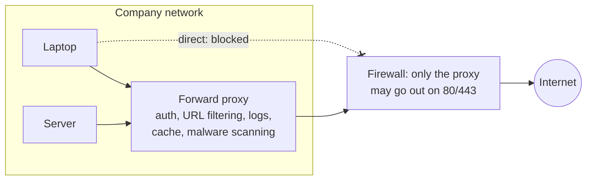

# Proxies

> [!abstract] In one sentence
> A proxy is a program that **ends my connection and opens a new one** on my behalf: the client talks to the proxy, the proxy talks to the server, and it can read, filter, cache, log or rewrite what passes because it understands the application protocol. A **forward proxy** acts for **clients** (usually going out to the internet), a **[[Reverse proxy|reverse proxy]]** acts for **servers** (receiving traffic for them).

## The misconception I had

**Wrong mental model:** "a proxy, NAT and a VPN are all ways of hiding my IP, so they're basically the same thing."

**What's actually true:** they work at different layers, and that changes everything they can do:

| | **NAT** | **VPN** | **Proxy** |
|---|---|---|---|
| Works on | Packets (L3/L4) | Packets, wrapped in a tunnel (L3) | **Connections and requests** (L4/L7) |
| TCP connections | **One**, with rewritten addresses | One, carried inside the tunnel | **Two**: client ↔ proxy, proxy ↔ server |
| Understands HTTP? | No | No | **Yes** (HTTP proxy) or partly (SOCKS) |
| App needs to know? | No | No (the OS routes into the tunnel) | Usually **yes** (explicit proxy), unless transparent |
| Can filter by URL, cache, authenticate users? | No | No | **Yes** |
| Scope | Everything routed through it | Everything routed into the tunnel | Only apps configured to use it |

→ NAT: [[NAT and PAT]]. VPN: [[VPN]].

The "two connections" part is the key: because the proxy **terminates** the connection, it sees the request as a whole (URL, headers, user) and can decide what to do with it. That's also why proxies add latency, need resources per connection, and break things that expect a direct end-to-end connection.

## Why companies put a forward proxy in front of their users

**The problem:** 2 000 employees and servers all reach the internet directly. The security team can't answer "who went where", can't block malware sites, can't stop someone uploading the customer database to a file-sharing site, and every machine needs direct internet access through the firewall.

**The fix:** all web traffic must go through a **forward proxy**, and the firewall blocks direct outbound 80/443 for everyone except the proxy.



What it gives:
- **Access control** by user or group ("contractors can't reach file-sharing sites"), with authentication (Kerberos/NTLM, SSO)
- **Logs** of every request: who, when, which URL, how many bytes
- **Filtering** by category, reputation, file type. Malware scanning of downloads
- **Caching** (less useful today, since most content is HTTPS and personalized, but still used for OS and package updates)
- **One controlled exit point** instead of every machine talking to the internet directly
- Servers in isolated networks can reach **only** the domains they need (package mirrors, an API), which is the main use on the server side

Examples: Squid, commercial secure web gateways (Zscaler, Netskope, Palo Alto…), which are the cloud versions of the same idea.

## How a client uses a forward proxy

### Explicit proxy: the client knows

The client is configured with the proxy's address and sends its requests **to the proxy**.

**Plain HTTP:** the client sends the full URL, and the proxy fetches it:
```
GET http://example.com/page HTTP/1.1      ← full URL, not just /page
Host: example.com
Proxy-Authorization: Basic …
```

**HTTPS: the CONNECT method.** The proxy can't read encrypted traffic, so the client asks it to open a **raw tunnel**:
```
CONNECT api.example.com:443 HTTP/1.1
Host: api.example.com:443

HTTP/1.1 200 Connection established
... from here, TLS flows end to end through the tunnel, the proxy only sees bytes
```

The proxy still sees the **host name and port** (and can allow or block them), but not the URL path or content. Same visibility as an eavesdropper with SNI (see [[Network layers#What an eavesdropper actually sees]]).

### How clients find the proxy

| Method | How | Gotchas |
|---|---|---|
| **Environment variables** | `HTTP_PROXY`, `HTTPS_PROXY`, `NO_PROXY` (and lowercase versions) | Every tool reads them differently: some only lowercase, some only uppercase, `NO_PROXY` formats vary (some accept CIDRs, some only domain suffixes). Classic source of "works in curl, fails in the app" |
| **System / browser settings** | OS proxy config, browser settings | Services and CLI tools usually ignore them |
| **PAC file** | A JavaScript function `FindProxyForURL(url, host)` returns which proxy to use per URL | Flexible (internal sites direct, rest via proxy), but a broken PAC file breaks all browsing |
| **WPAD** | The client auto-discovers the PAC file via DHCP or DNS (`wpad.corp.example.com`) | A known attack vector: whoever answers the WPAD lookup can proxy all traffic |
| **Per-application** | JVM flags, package manager config (`apt`, `pip`, `npm`, Docker daemon) | Each one separate. Docker has **three** places: the daemon, the build, and inside containers |

```bash
export HTTPS_PROXY=http://proxy.corp.example.com:3128
export NO_PROXY=localhost,127.0.0.1,.corp.example.com,10.0.0.0/8   # internal stuff goes direct
curl -v https://api.example.com   # "Uses proxy env variable…" + "CONNECT api.example.com:443"
```

### Transparent proxy: the client doesn't know

**The problem with explicit proxies:** every device and every tool must be configured, and some (IoT, appliances, badly written apps) can't be.

**The fix:** the network **intercepts** traffic and redirects it to the proxy without the client knowing. The router or firewall sends port 80/443 to the proxy (policy routing, WCCP, or `iptables … -j REDIRECT` / `TPROXY` on a Linux gateway, see [[Policy-based routing]]).

- For **HTTP**, the proxy reads the `Host` header to know where to go
- For **HTTPS**, it can only read the **SNI** in the TLS ClientHello, so it can filter by domain but not by URL, unless it does TLS inspection
- The client thinks it's talking to the server: nothing to configure, but also nothing to authenticate against (the proxy can't ask "who are you?" in a way the client understands)

### SOCKS: a generic proxy

SOCKS (v5) proxies **any TCP** (and UDP) connection, not just HTTP. The client says "connect me to host:port", the proxy does, then just relays bytes. No understanding of the application protocol, so no URL filtering or caching.
- Common through SSH: `ssh -D 1080 bastion` gives me a SOCKS proxy that exits from the bastion (see [[IPsec vs TLS vs WireGuard vs SSH]], [[Bastion host]])
- Apps must support SOCKS (browsers, `curl --socks5-hostname`), or be wrapped (`proxychains`)
- `socks5h` / `--socks5-hostname`: the **proxy** resolves DNS names. Otherwise the client resolves locally, which leaks DNS and fails for names only resolvable on the far side

## TLS inspection: reading HTTPS

**The problem:** with HTTPS everywhere, a proxy only sees host names. Malware downloads and data exfiltration hide inside TLS.

**The fix, and its cost:** the proxy acts as a **man in the middle on purpose**:
1. The company installs its own **root CA** on every managed device (see [[Certificates and PKI]])
2. When a client connects to `bank.com`, the proxy opens its own TLS connection to the real `bank.com`, and presents the client a certificate for `bank.com` **signed on the fly by the company CA**
3. The client trusts it (the company root is in its trust store), and the proxy decrypts, inspects, and re-encrypts

What it breaks, and what engineers have to handle:
- **Certificate pinning**: apps that expect a specific certificate or CA (mobile apps, some CLIs, update agents) refuse the forged one → they need **bypass rules**
- **[[mTLS]]**: the client's certificate can't be presented through the proxy (the proxy doesn't have the key) → bypass
- **Tools with their own trust stores** (Python `requests`/`certifi`, Java's `cacerts`, Node, containers built from public images) don't know the company CA → "certificate verify failed" everywhere until the CA is added to each one
- **Privacy and legal**: banking, health sites are usually excluded by policy
- The proxy becomes the most sensitive box in the company: it sees every password

## Proxy problems I'll actually debug

| Symptom | Usual cause |
|---|---|
| Works in the browser, fails in the terminal | CLI tools ignore system settings: set `HTTPS_PROXY` |
| Works in `curl`, fails in the app | The app reads a different variable (case), or ignores `NO_PROXY` formats |
| Internal service unreachable once the proxy is set | Missing from `NO_PROXY`: internal traffic is sent to the proxy, which can't reach it |
| `certificate verify failed` / `self-signed certificate in chain` | TLS inspection with a company CA the tool doesn't trust |
| `407 Proxy Authentication Required` | The proxy wants credentials the tool isn't sending |
| Docker pulls fail, but the host has internet | The Docker **daemon** needs its own proxy config (systemd drop-in), separate from the shell |
| Long-lived connections (WebSockets, streaming) drop after N minutes | Proxy idle or maximum-duration timeouts |

## Easy to get wrong
- Treating a proxy like NAT: it's two separate connections, and it only affects apps that use it (unless transparent)
- Forgetting `NO_PROXY` for internal ranges and names
- Assuming all tools read `HTTP_PROXY` the same way
- Using SOCKS without remote DNS resolution, and leaking or failing DNS
- Turning on TLS inspection without a plan for pinned apps, mTLS and every tool's own trust store
- Leaving WPAD enabled on networks where anyone can answer the lookup

## Related
- The other direction:: [[Reverse proxy]]
- Next:: [[Load balancing]], [[Service discovery]]
- Compared with:: [[NAT and PAT]], [[VPN]], [[IPsec vs TLS vs WireGuard vs SSH]]
- The protocol:: [[HTTP]]
- Egress control and agents dialing out:: [[Outbound-initiated connections]]
- Security:: [[TLS]], [[Certificates and PKI]], [[mTLS]], [[DNS security]]
- Applied:: [[Proxies, load balancing and discovery in AWS]]

## Flashcards
#flashcards

Proxy vs NAT in one line? :: NAT rewrites packets of one connection. A proxy terminates the connection and opens a second one, understanding the protocol
Forward vs reverse proxy? :: Forward acts for clients (going out). Reverse acts for servers (receiving traffic for them)
Why do companies use forward proxies? :: One controlled exit: user-based access control, URL filtering, logs, malware scanning, caching
How does an HTTPS request go through an explicit proxy? :: HTTP CONNECT host:443 opens a tunnel, TLS flows end to end, the proxy sees only host and port
What does a plain HTTP request to a proxy look like? :: The full URL in the request line (GET http://example.com/page)
What is NO_PROXY for? :: Destinations that must go direct (localhost, internal domains and ranges)
What is a PAC file? :: A JavaScript function telling browsers which proxy to use per URL
Why is WPAD risky? :: Whoever answers the WPAD discovery can proxy all the victim's traffic
Transparent vs explicit proxy? :: Transparent: the network intercepts traffic, clients aren't configured. Explicit: clients send requests to the proxy
What can a transparent proxy see of HTTPS without inspection? :: Only the SNI (domain name)
What is SOCKS? :: A generic proxy relaying any TCP/UDP connection, without understanding the app protocol
Why use socks5h / --socks5-hostname? :: The proxy resolves DNS, so no local DNS leak and far-side names work
How does TLS inspection work? :: The proxy forges certificates signed by a company root CA installed on clients, decrypts and re-encrypts
Three things TLS inspection breaks? :: Certificate pinning, mTLS, tools with their own trust stores (Python, Java, Node, containers)
Docker pulls fail but the host has internet through a proxy. Why? :: The Docker daemon has its own proxy config, separate from the shell
