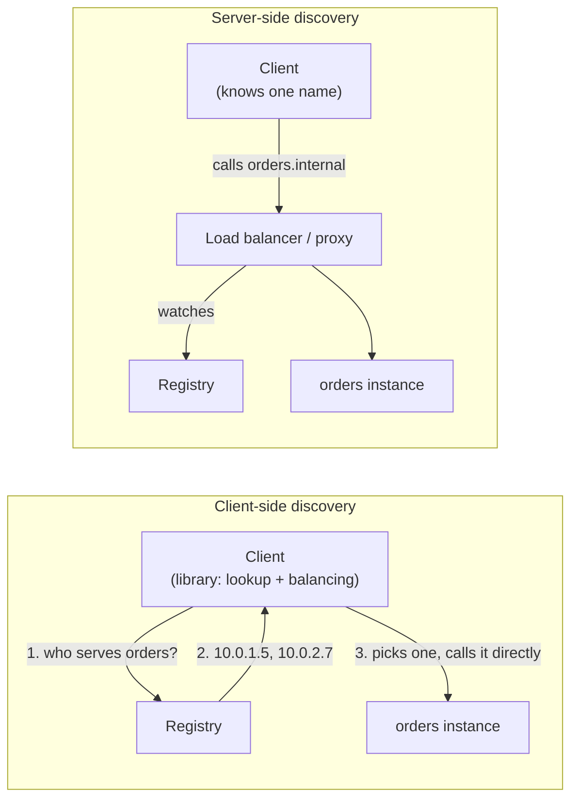

# Service discovery

> [!abstract] In one sentence
> Service discovery answers "**where are the healthy instances of service X right now?**" when instances come and go constantly (autoscaling, containers, deployments). A **registry** keeps the live list, instances get **registered** and **health-checked**, and clients find them either **themselves** (client-side discovery) or through a **load balancer / proxy that looks them up** (server-side discovery).

## The problem

With three servers that never change, I write their IPs in a config file (or in the load balancer's pool) and I'm done.

Then:
- **Autoscaling** adds and removes servers every hour, with new IPs each time
- **Containers** get a new IP every time they restart or move to another host
- **Deployments** replace every instance
- 50 services call each other, each with 3–30 instances

Hard-coded IPs are wrong within minutes. Something has to keep a **live list** and hand it out.

## The approaches, each fixing the previous one's limit

### 1. Config files and a static load balancer pool
Fine for a few stable servers. Every change is a manual edit and a reload: doesn't survive autoscaling.

### 2. DNS
Register each instance as an A record (or **SRV** record, which also carries the port) under the service's name, with a short TTL. Clients just resolve `orders.internal.example.com`.
- ✅ Every language and tool already speaks DNS
- ❌ **Caching**: clients and runtimes keep stale IPs (see [[DNS#Caching and TTL]]). A removed instance keeps getting traffic
- ❌ No health information unless the DNS server itself does health checks
- ❌ Most clients ignore SRV records, so ports must be fixed

### 3. A dedicated registry
A small, highly available database built for this: instances **register** themselves (or are registered by the platform), send **heartbeats**, and get removed when they stop. Clients **query** or **watch** it and get pushed updates immediately.

| Registry | Notes |
|---|---|
| **Consul** | Registry + health checks + a DNS interface (`orders.service.consul`) + KV store. Agents on every node |
| **etcd** | Strongly consistent key-value store. What Kubernetes stores everything in |
| **ZooKeeper** | The older one (Hadoop, Kafka's old coordination). Ephemeral nodes disappear when an instance's session dies |
| **Eureka** | Netflix's, for client-side discovery in Java/Spring |
| **Platform-provided** | Kubernetes, cloud registries (see [[Proxies, load balancing and discovery in AWS]]) |

### Client-side vs server-side discovery

| | **Client-side** | **Server-side** |
|---|---|---|
| Who talks to the registry | Every client (via a library) | The load balancer / proxy |
| Extra hop | ❌ None: client calls the instance directly | ✅ One (the LB) |
| Balancing | In the client: per request, even for gRPC | In the LB |
| Language support | A library per language, kept in sync | Nothing in the client, any language |
| Examples | Eureka + Ribbon, gRPC's built-in balancing | Cloud load balancers, Kubernetes Services, API gateways |

The **service mesh** is the best of both: a sidecar proxy next to each client does client-side discovery and balancing on the client's behalf, so apps stay simple and there's no central hop (see [[Service mesh]]).

## Registration: who adds instances to the registry?

- **Self-registration**: the app registers itself at startup and deregisters on shutdown. Simple, but every app must implement it, and a crashed app never deregisters (heartbeats with a TTL handle that)
- **Third-party registration**: the **platform** registers instances (Kubernetes, the cloud's autoscaling, a Consul agent watching Docker). Apps know nothing about it. This is what modern platforms do

## How Kubernetes does it (the one I'll meet most)

- A **Service** object selects pods by label (`app: orders`). Kubernetes keeps the list of ready pod IPs in **EndpointSlices**, updated as pods start, pass their **readiness probe**, or die
- The Service gets a stable **virtual IP** (ClusterIP) and a DNS name `orders.default.svc.cluster.local` served by CoreDNS
- **kube-proxy** on every node programs iptables/IPVS/nftables rules: traffic to the ClusterIP is DNAT'ed to one of the pod IPs (see [[NAT and PAT]]). So it's server-side discovery, done in the **kernel of every node** rather than a central box
- A **headless** Service (no ClusterIP) returns the pod IPs directly in DNS: client-side discovery, for databases and clients that balance themselves
- The pod's **readiness probe** is what adds or removes it from the Service: the health check and the registry are the same mechanism

## What goes wrong

| Problem | Why | Mitigation |
|---|---|---|
| Traffic to instances that are gone | Stale DNS caches, clients that resolved once at startup, slow deregistration | Short TTLs, clients that re-resolve, deregister **before** shutdown (drain, then stop) |
| Traffic to instances that aren't ready | Registered as soon as the process started, before it can serve | Register only after a **readiness** check passes |
| Registry down = nothing can find anything | It's a critical dependency for every call | Run it clustered (3 or 5 nodes for a quorum), and let clients **keep the last known list** if the registry is unreachable |
| Split brain in the registry | Network partition, two halves disagree | Consensus systems (etcd, Consul servers, ZooKeeper) require a majority: the minority side stops accepting writes |
| Discovery works, calls fail | Found the instance, but the firewall/security group blocks it, or mTLS identity doesn't match | Discovery is only "where". Reachability and authorization are separate (see [[mTLS]], [[Workload identity (SPIFFE)]]) |

## Easy to get wrong
- Treating DNS as a real-time registry: caches make it lag
- Registering instances before they're ready, or deregistering them after they're already gone
- Making the registry a single point of failure, and clients that crash when it's unreachable
- Forgetting that finding a service doesn't mean being allowed to reach it
- Client-side discovery libraries in five languages, each with different bugs

## Related
- What uses it:: [[Load balancing]], [[Reverse proxy]], [[Service mesh]]
- Based on:: [[DNS]], [[DNS in production]]
- Identity:: [[Workload identity (SPIFFE)]], [[mTLS]]
- Applied:: [[Proxies, load balancing and discovery in AWS]]
- In orchestrators:: [[Kubernetes architecture]] (EndpointSlices, kube-proxy, CoreDNS), [[Docker Swarm]] (VIPs on overlay networks)

## Flashcards
#flashcards

What question does service discovery answer? :: Where are the healthy instances of service X right now?
Why isn't DNS a great service registry? :: Caching keeps stale IPs, no health info by default, most clients ignore SRV ports
Client-side vs server-side discovery? :: Client-side: the client queries the registry and picks an instance. Server-side: a load balancer/proxy does it for the client
Main cost of client-side discovery? :: A library per language to maintain
How does a service mesh combine both? :: A sidecar does client-side discovery and balancing for the app
Self-registration vs third-party registration? :: The app registers itself vs the platform (Kubernetes, autoscaling, agents) registers it
How do Kubernetes Services find pods? :: Label selector → EndpointSlices of ready pods, a ClusterIP + DNS name, kube-proxy DNATs to a pod
What is a headless Service? :: No ClusterIP: DNS returns pod IPs directly (client-side discovery)
What adds or removes a pod from a Service? :: Its readiness probe
Why do registries run on 3 or 5 nodes? :: Consensus needs a majority quorum to survive failures and avoid split brain
What should clients do if the registry is unreachable? :: Keep using the last known list of instances
