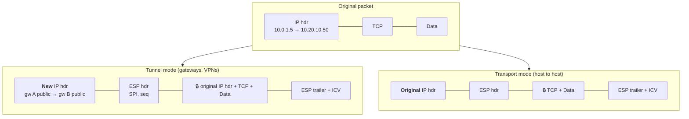
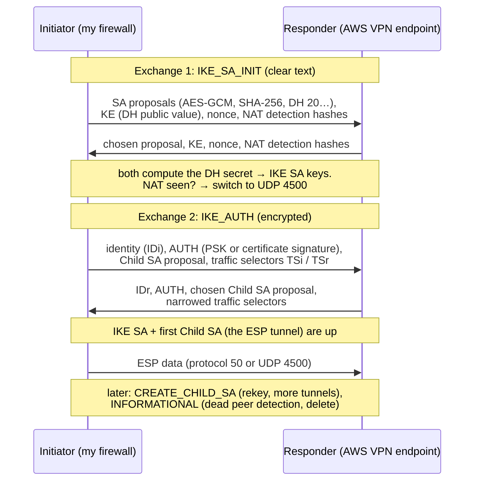
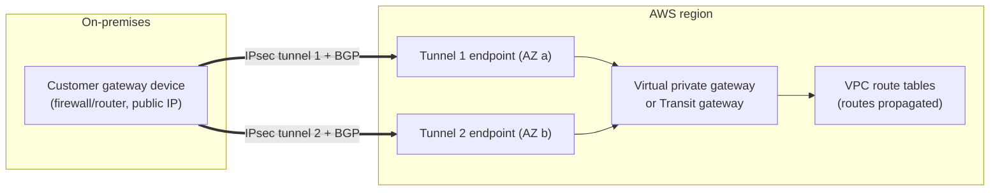

# IPsec and IKE

> [!abstract] In one sentence
> **IPsec** (Internet Protocol Security) encrypts and authenticates traffic **at the IP layer**, so every application is protected without knowing it. **IKE** is its companion protocol that authenticates the two peers and negotiates the keys and settings IPsec uses. Together they're the standard for **site-to-site VPNs** (office ↔ cloud, AWS Site-to-Site VPN, firewall ↔ firewall).

## The pieces

| Piece                                         | What it does                                                                                              | On the wire                                                      |
| --------------------------------------------- | --------------------------------------------------------------------------------------------------------- | ---------------------------------------------------------------- |
| **IKE** (Internet Key Exchange, v1 or **v2**) | Control plane: authenticate the peers, run Diffie-Hellman, negotiate algorithms, create and rekey the SAs | **UDP 500**, then **UDP 4500** if NAT is detected                |
| **ESP** (Encapsulating Security Payload)      | Data plane: encrypts + integrity-protects the packets                                                     | **IP protocol 50** (not TCP/UDP!), or inside UDP 4500 with NAT-T |
| **AH** (Authentication Header)                | Integrity only, no encryption. Also protects the outer IP header, so it **breaks through NAT**            | IP protocol 51. Almost never used now                            |
| **SA** (Security Association)                 | One agreed set of keys + algorithms, for **one direction**                                                | Identified by a 32-bit **SPI** in each ESP packet                |
| **SPD** (Security Policy Database)            | "Which traffic must be protected, bypassed or dropped"                                                    | Local config                                                     |
| **SAD** (Security Association Database)       | The live SAs and their keys                                                                               | Local state                                                      |

Firewalls between the peers must allow **UDP 500, UDP 4500 and IP protocol 50**. Forgetting protocol 50 is a classic: IKE comes up, but no data flows.

## Tunnel mode vs transport mode



| | **Tunnel mode** | **Transport mode** |
|---|---|---|
| What's encrypted | The **whole original packet**, including its IP header | Only the payload (TCP/UDP + data) |
| Outer IP header | New one, between the two **gateways** | The original one |
| Hides internal addresses? | ✅ Yes | ❌ No |
| Used for | Site-to-site and remote-access VPNs (AWS Site-to-Site, firewalls) | Host-to-host encryption, or under another tunnel (L2TP/IPsec, GRE over IPsec) |

## IKEv2: how a tunnel comes up

The first **4 messages** (2 exchanges) create both the control channel and the first data tunnel:



| Exchange | Purpose |
|---|---|
| **IKE_SA_INIT** | Agree on algorithms, do **Diffie-Hellman**, exchange nonces, detect NAT. Creates the **IKE SA** (encrypted control channel) |
| **IKE_AUTH** | Prove identities (PSK, certificates, or EAP for users), agree on **traffic selectors**, create the first **Child SA** (the pair of ESP SAs, one per direction) |
| **CREATE_CHILD_SA** | Rekey the IKE SA or a Child SA, or add more Child SAs. With **PFS**, a new DH is done here |
| **INFORMATIONAL** | Dead peer detection (DPD) keepalives, delete SAs, errors |

### IKEv1 and the "phase 1 / phase 2" vocabulary

IKEv1 (older, more messages, more ways to misconfigure) is still everywhere in firewall UIs, and its vocabulary is used for IKEv2 too:

| Term | IKEv1 | IKEv2 equivalent |
|---|---|---|
| **Phase 1** | Main mode (6 messages) or Aggressive mode (3, leaks the identity, weak with PSK) → IKE SA / ISAKMP SA | IKE_SA_INIT + IKE_AUTH → **IKE SA** |
| **Phase 2** | Quick mode (3 messages) → IPsec SAs | The **Child SA** (created in IKE_AUTH, then CREATE_CHILD_SA) |

→ "**Phase 1 is up but phase 2 isn't**" = the peers authenticated each other, but couldn't agree on the data tunnel (usually traffic selectors or PFS mismatch).

Prefer **IKEv2**: fewer messages, built-in NAT traversal, DPD, EAP, **MOBIKE** (the tunnel survives IP changes, like Wi-Fi → 4G), better at rekeying.

## What has to match on both sides

| Setting | Phase 1 (IKE SA) | Phase 2 (Child SA / ESP) |
|---|---|---|
| IKE version | v1 / v2 | |
| Encryption | AES-128/256 (CBC or GCM) | AES-128/256 (CBC or GCM) |
| Integrity / PRF | SHA-256/384/512 | SHA-256… (not needed with GCM) |
| DH group | 14, 19, 20, 21… | Only with **PFS**: must match too |
| Lifetime | e.g. 28 800 s (8 h) | e.g. 3 600 s (1 h) |
| Authentication | PSK or certificates, **+ IDs** (IP, FQDN) | |
| Traffic selectors | | Local/remote subnets (policy-based) or `0.0.0.0/0` (route-based) |

Lifetimes don't have to match exactly (the lower one usually wins), but everything else does.

## Policy-based vs route-based VPNs

The most important design choice, and the link to [[Routing tables]] and [[Policy-based routing]]:

| | **Policy-based** | **Route-based** |
|---|---|---|
| What decides "this goes into the tunnel" | The **SPD policy**: "traffic from `10.0.0.0/16` to `10.20.0.0/16` → encrypt with this SA" | A normal **route** to a **tunnel interface** (VTI, XFRM interface, `tunnel0`) |
| Traffic selectors | The real subnets, one SA pair **per subnet pair** | Usually `0.0.0.0/0 ↔ 0.0.0.0/0`, one SA pair |
| Adding a network | Change the policy on **both** sides | Add a route (or let **BGP** do it) |
| Dynamic routing (BGP), failover between tunnels | ❌ Hard | ✅ Natural: it's just an interface |
| Examples | Cisco ASA crypto maps, strongSwan default on Linux | Cisco VTI, Palo Alto, FortiGate, Juniper st0, **AWS Site-to-Site VPN** |

> [!info] How Linux does it (XFRM)
> In the kernel, IPsec is the **XFRM** framework. For **policy-based** IPsec there's **no tunnel interface**: after the normal route lookup, the kernel checks the SPD (`ip xfrm policy`). If a policy matches, the packet is encrypted with the SA (`ip xfrm state`), wrapped in a new IP header, and routed again towards the peer. That's why `tcpdump` on `eth0` shows only ESP, and why strongSwan puts its routes in a separate table (**table 220**, via [[Policy-based routing|policy rules]]).
> For **route-based**, create an XFRM interface (`ip link add ipsec0 type xfrm dev eth0 if_id 42`) and route into it like any other interface.

> [!warning] AWS and policy-based devices
> AWS tunnels accept **one pair of SAs per tunnel**. A policy-based device with several subnet pairs creates several SAs, and traffic randomly breaks. Fix: summarize into one selector pair (or `any ↔ any`), or use route-based.

## NAT traversal (NAT-T)

ESP has **no ports**, so a NAT device (home router, AWS NAT, carrier NAT) can't track it or share one public IP between several ESP flows. IKE fixes this automatically:

1. In IKE_SA_INIT, each side sends a **hash of the IP + port** it thinks it's using
2. If the received hash doesn't match what the other side sees → a NAT is in the path
3. Both sides move to **UDP 4500** and wrap ESP in UDP: `[IP][UDP 4500][ESP…]`
4. **Keepalives** (every ~20 s) keep the NAT mapping open

Cost: 8 more bytes per packet. The IDs may also need care, because the "local IP" behind NAT isn't the public one (in AWS: the customer gateway IP is the **public** one, and the device may identify itself with its private IP).

## Overhead and MTU

Tunnel mode ESP adds: new IP header (20) + ESP header (8) + IV (8–16) + padding (0–15) + trailer (2) + ICV (12–16), plus UDP (8) with NAT-T. **~50–80 bytes**.

A 1500-byte packet doesn't fit anymore → fragmentation, or dropped packets if "don't fragment" is set and ICMP "too big" is blocked (a **PMTUD black hole**: SSH works, but big web pages or file transfers hang).

Fixes:
- Lower the tunnel interface **MTU** (~1400–1436)
- **Clamp TCP MSS** so TCP never sends segments that are too big: `iptables -t mangle -A FORWARD -p tcp --tcp-flags SYN,RST SYN -j TCPMSS --clamp-mss-to-pmtu`, or `ip tcp adjust-mss 1379` on Cisco
- Allow [[ICMP]] "fragmentation needed" messages

## AWS Site-to-Site VPN



- **Customer gateway** (my side: its public IP, BGP ASN) + **virtual private gateway** (one VPC) or **transit gateway** (many VPCs, see [[Connecting VPCs]])
- Always **two tunnels**, to two AWS endpoints in different AZs. AWS maintenance takes one tunnel down at a time, so configure **both**
- **Route-based**: each tunnel has an **inside /30** from `169.254.0.0/16` for the BGP session
- Routing: **static** or **dynamic (BGP)**. BGP gives automatic failover between the tunnels (see [[AS and BGP]])
- IKEv1 or IKEv2, PSK (default) or certificates (from AWS Private CA)
- Defaults: phase 1 lifetime 8 h, phase 2 1 h, DPD with a 30 s timeout
- Bandwidth is limited per tunnel (about 1.25 Gbps). More → ECMP over several VPNs on a transit gateway, or **Direct Connect**
- AWS generates a **config file per device vendor** (Cisco, Palo Alto, Fortinet, strongSwan…) with every setting above

The full AWS side (propagation, CloudHub, limits, troubleshooting) → [[Site-to-Site VPN]]. Many VPCs → [[Transit gateway]]. Chaining tunnels through a gateway and why policy-based selectors break it → [[Nested VPNs]].

## Troubleshooting by symptom

| Symptom | Look at |
|---|---|
| Nothing happens, no IKE at all | UDP 500/4500 blocked, wrong peer IP, nothing triggers the tunnel (AWS: the **customer side must initiate** unless startup action is set to start) |
| `NO_PROPOSAL_CHOSEN` | Phase 1 or 2 algorithms/DH group don't match |
| `AUTHENTICATION_FAILED` | Wrong PSK, or IDs don't match (e.g. private IP vs public IP behind NAT) |
| `TS_UNACCEPTABLE` / phase 2 fails | Traffic selectors (subnets) don't match, PFS mismatch |
| Tunnel up, no traffic | Missing routes on either side, [[Security groups]] / NACLs, ESP (protocol 50) blocked, route propagation disabled in AWS |
| Small packets OK, big ones hang | MTU / MSS (above) |
| Drops every hour or 8 hours | Rekey problems, lifetime or PFS mismatch |
| Works one way only | Asymmetric routing, missing return route, overlapping subnets (see [[Overlapping address spaces]]) |

```bash
# strongSwan on Linux
swanctl --list-sas          # IKE SAs and Child SAs with byte counters
swanctl --log               # live negotiation log
ip xfrm state               # kernel SAs (SPIs, algorithms)
ip xfrm policy              # kernel SPD (traffic selectors)
tcpdump -ni eth0 'udp port 500 or udp port 4500 or esp'
```

## Related
- Depends on:: [[Encryption basics]] (DH, PFS, PSK vs certificates)
- Part of:: [[VPN]]
- Compared:: [[IPsec vs TLS vs WireGuard vs SSH]]
- Routing side:: [[Routing tables]], [[Policy-based routing]], [[AS and BGP]]
- Chaining:: [[Nested VPNs]]
- AWS:: [[Site-to-Site VPN]], [[Transit gateway]], [[Direct Connect]], [[Hybrid connectivity architectures]], [[Connecting VPCs]], [[VPC]]

## Flashcards
#flashcards

IKE vs ESP? :: IKE negotiates and authenticates (control plane, UDP 500/4500). ESP carries the encrypted data (data plane, IP protocol 50)
Which ports/protocols must a firewall allow for IPsec? :: UDP 500, UDP 4500 and IP protocol 50 (ESP)
Why is AH almost never used? :: No encryption, and it protects the outer IP header so it breaks through NAT
Tunnel mode vs transport mode? :: Tunnel encrypts the whole original packet under a new IP header (VPNs). Transport encrypts only the payload (host to host)
What is an SA and why are there two per tunnel? :: A set of keys/algorithms for one direction, so one per direction
What is an SPI? :: The 32-bit ID in each ESP packet saying which SA to use
The four IKEv2 exchanges? :: IKE_SA_INIT, IKE_AUTH, CREATE_CHILD_SA, INFORMATIONAL
What happens in IKE_SA_INIT? :: Algorithm negotiation, Diffie-Hellman, nonces, NAT detection
What happens in IKE_AUTH? :: Peers authenticate (PSK/certs/EAP), agree traffic selectors, create the first Child SA
"Phase 1 up, phase 2 down" usually means? :: Peers authenticated, but traffic selectors or PFS/phase 2 algorithms don't match
Policy-based vs route-based VPN? :: Policy-based: the SPD decides by subnet pairs. Route-based: routes to a tunnel interface, selectors any/any, works with BGP
Why is route-based preferred with AWS? :: AWS accepts one SA pair per tunnel, and BGP + failover need a tunnel interface
How does NAT-T work? :: IKE detects NAT with IP/port hashes, then both sides wrap ESP in UDP 4500 with keepalives
Why does ESP break through NAT without NAT-T? :: ESP has no ports, so NAT can't track or multiplex it
Typical IPsec overhead and the symptom it causes? :: ~50–80 bytes. Big packets hang (PMTUD black hole) → lower MTU, clamp MSS
How many tunnels does an AWS Site-to-Site VPN have and why? :: Two, to endpoints in different AZs, for redundancy during maintenance
What is the 169.254.x.x/30 in AWS VPN config? :: The tunnel inside addresses, used for the BGP session
Where does Linux policy-based IPsec get its routes? :: strongSwan installs them in table 220 with a policy rule
