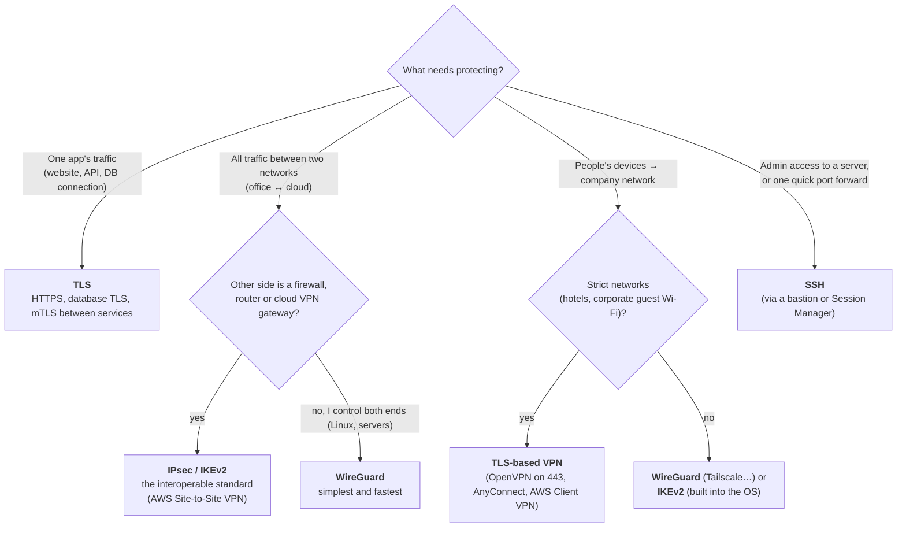
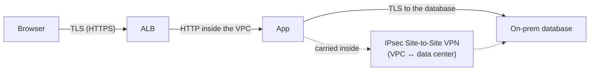

# IPsec vs TLS vs WireGuard vs SSH

> [!abstract] The short answer
> They all use the same crypto recipe (see [[Encryption basics]]). What differs is **what they protect**: **TLS** protects one application's connection. **IPsec** and **WireGuard** protect all IP traffic between hosts or networks. **SSH** is for logging into machines, and can forward a few ports. Pick by the scope: *one app* → TLS, *whole networks* → IPsec (interop) or WireGuard (simplicity), *admin access* → SSH.

## Side by side

| | [[IPsec and IKE\|IPsec / IKEv2]] | [[TLS]] | WireGuard | SSH |
|---|---|---|---|---|
| **Protects** | All IP traffic matching a policy/route | One connection of one app | All IP traffic routed to the interface | One session (shell, file copy, forwarded ports) |
| **Layer** | 3 (IP), in the kernel | Between TCP and the app, in a library | 3 (IP), in the kernel | Application |
| **Apps need changes?** | No | Yes (the app speaks TLS) | No | Only the SSH client/server |
| **Transport** | UDP 500/4500 + ESP (IP proto 50) | TCP (usually 443). DTLS over UDP, QUIC | UDP (51820 default) | TCP 22 |
| **Handshake** | IKE: IKE_SA_INIT + IKE_AUTH | ClientHello / ServerHello (1-RTT) | Noise IK (1-RTT) | Key exchange + host key + user auth |
| **Key exchange** | DH (negotiated group) | ECDHE (X25519, P-256, hybrid PQ) | Curve25519 | curve25519-sha256 (and PQ hybrids) |
| **Authentication** | PSK, certificates, EAP (users) | Certificates (server; client too with mTLS) | Static public keys, configured per peer | Host keys + user keys / passwords / certificates |
| **Crypto negotiation** | Yes, many options (and many mismatches) | Yes, small safe list in 1.3 | **None**: one fixed suite, versioned by protocol | Yes |
| **Through NAT / firewalls** | OK with NAT-T. Sometimes blocked | **Best**: TCP 443 is open almost everywhere | Good (UDP), but UDP may be blocked | Good, but port 22 often blocked outbound |
| **Config complexity** | High | Low for clients, certificates to manage | Very low | Low |
| **Performance** | High (kernel, hardware offload in firewalls) | High | Very high (kernel, lean) | Moderate for tunnels (TCP over TCP) |
| **Interoperability** | Every firewall, router, cloud (AWS/Azure/GCP VPN) | Universal | Linux, all OSes, but few hardware firewalls | Universal on servers |

## What they share

- **Same pattern**: an asymmetric handshake to authenticate and agree on keys with ephemeral Diffie-Hellman, then symmetric AEAD encryption (AES-GCM / ChaCha20-Poly1305) for the data, with regular rekeying
- **Forward secrecy** when configured properly (always in TLS 1.3 and WireGuard)
- **All four can build a VPN-like tunnel**: IPsec and WireGuard natively, TLS through OpenVPN/SSL VPNs, SSH through port forwarding (`-L`, `-R`), a SOCKS proxy (`-D`) or even a tun device (`-w`)

## Where they actually differ

### Scope: connection vs network

This is the real decision:

### They stack, and that's normal

These aren't competitors inside one design. A typical request uses several:

HTTPS inside an IPsec tunnel is "double encryption", and that's fine: **IPsec** protects the network path between sites (every protocol, including ones without their own encryption), **TLS** protects the app end to end, including against someone **inside** either network. **Zero trust** designs lean on TLS (mTLS) everywhere, because being "inside the VPN" shouldn't mean being trusted.

### Identity: who is authenticated?

| | Authenticates |
|---|---|
| IPsec | The **gateways** (or the device + user with EAP) |
| TLS | The **server name** (`bank.com`), and the client with mTLS |
| WireGuard | The **peer's key**. No users, no names: adding user identity is what Tailscale & co add on top |
| SSH | The **server** (host key) and the **user** (key, password, certificate) |

### Crypto agility vs simplicity

- IPsec and TLS **negotiate** algorithms: flexible, can move to new algorithms (post-quantum) without a new protocol, but negotiation is where mismatches, downgrades and weak configs creep in
- WireGuard has **no negotiation**: one fixed modern suite. If it's ever broken, the fix is a new protocol version. In exchange: ~4 000 lines of code, almost nothing to misconfigure

## If you have to choose
- If it's **web or API traffic**, or a **database/service connection** → **TLS** (always, even inside a VPN)
- If it's **site-to-site with a cloud provider or a hardware firewall** → **IPsec / IKEv2** (route-based, with BGP)
- If it's **servers or devices I control on both ends**, or a **mesh** of machines → **WireGuard** (or Tailscale/Netbird on top of it)
- If **remote users** must connect from **anywhere, including networks that only allow 443** → a **TLS-based VPN** (OpenVPN / SSL VPN / AWS Client VPN)
- If **remote users on managed laptops/phones** without installing anything → **IKEv2** (built into Windows, macOS, iOS, Android)
- If it's **admin access** to a server or reaching one port on a private host → **SSH** (through a [[Bastion host]]), or AWS Session Manager
- **Never**: PPTP, IKEv1 aggressive mode with PSK, TLS ≤ 1.1, "encrypted but unauthenticated" setups

## Related
- Part of:: [[VPN]]
- Stacking them:: [[Nested VPNs]]
- AWS:: [[Site-to-Site VPN]], [[Connecting AWS to a private network]]

## Flashcards
#flashcards

TLS vs IPsec in one line? :: TLS protects one application's connection. IPsec protects all IP traffic between hosts/networks
Which one for AWS Site-to-Site VPN or a hardware firewall? :: IPsec / IKEv2
Why do SSL/TLS VPNs work on almost any network? :: They run over TCP 443, which is almost never blocked
What makes WireGuard different from IPsec and TLS on crypto? :: No negotiation, one fixed modern suite
What does WireGuard authenticate? :: Peers' public keys, not users or names
Why use TLS even inside a VPN? :: It protects end to end, including against attackers inside either network (zero trust)
Which of the four runs in the kernel at Layer 3? :: IPsec and WireGuard
Three ways SSH can tunnel traffic? :: Local/remote port forwarding (-L/-R), SOCKS proxy (-D), tun device (-w)
Best choice for remote users on managed devices without extra software? :: IKEv2, built into all major OSes
What do all four have in common cryptographically? :: Asymmetric handshake with ephemeral DH + authentication, then symmetric AEAD for data
