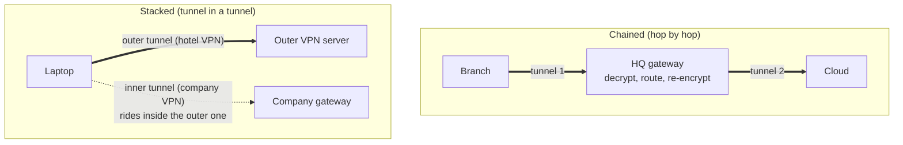

# Nested VPNs

> [!abstract] In one sentence
> "Nested VPNs" covers two different things: VPNs **chained** one after the other (a branch's tunnel ends at HQ, HQ's tunnel goes on to a cloud, each gateway decrypts and re-encrypts), which is a **routing** problem, and VPNs **stacked** inside each other (one tunnel carried inside another), which is an **MTU and overhead** problem. Knowing which one I have tells me where to look.

## Two shapes, two families of problems

| | **Chained** | **Stacked** |
|---|---|---|
| A packet is encrypted… | Once per hop, never twice at the same time | Twice (or more) at the same time |
| Typical case | Branch → HQ → cloud. Home user → company VPN → company's VPN to a partner | Laptop VPN inside a hotel/privacy VPN. IPsec over an SD-WAN or MPLS overlay. VPN over Direct Connect. WireGuard inside a container network |
| Main problems | **Who knows the route to whom** (transitivity), traffic selectors, NAT, asymmetric paths, HQ as a bottleneck | **MTU** (each layer adds headers), CPU, TCP over TCP, which tunnel the inner tunnel's packets use |
| Debug with | Routing tables on every gateway, `traceroute`, BGP tables | `ping -M do -s`, packet captures on each interface |

## Chained VPNs: build-up

**Setup.** A company:
- **HQ** `10.0.0.0/16`, firewall `203.0.113.10`
- **Branch** `10.1.0.0/16`, with a site-to-site VPN **to HQ only**
- **Remote employees**: remote-access VPN to HQ, client pool `10.99.0.0/24`
- **Cloud** VPC `10.20.0.0/16`, with a site-to-site VPN **to HQ only**

HQ is the middle of the chain for everyone. HQ ↔ cloud works on day one. Branch ↔ cloud and remote users ↔ cloud don't.

### Problem 1: nobody knows the routes beyond their neighbour

A packet `10.1.0.20 → 10.20.1.20` (branch → cloud) needs four things to be true:

| Where | Needs | Usually missing because |
|---|---|---|
| Branch gateway | `10.20.0.0/16 → tunnel to HQ` | The branch tunnel was built for `10.0.0.0/16` only |
| HQ gateway | `10.20.0.0/16 → tunnel to cloud` | ✅ Exists (HQ ↔ cloud works) |
| Cloud gateway | `10.1.0.0/16 → tunnel to HQ` (the **return path**) | The cloud only knows about HQ's `10.0.0.0/16` |
| HQ gateway | `10.1.0.0/16 → tunnel to branch` | ✅ Exists |

Same for remote users: the cloud must route `10.99.0.0/24` back to HQ, and the VPN client's **split tunnel list** must include `10.20.0.0/16`, or the laptop sends cloud traffic to its home internet (→ [[VPN#Split tunnel vs full tunnel]]).

**Fix:** announce routes end to end. With static routing that's a route on every gateway for every remote prefix, and it doesn't scale. With BGP on the tunnels, HQ re-announces what it learns: the cloud learns `10.1.0.0/16` and `10.99.0.0/24` from HQ, the branch learns `10.20.0.0/16`. Summaries help: if the company plans `10.0.0.0/12` for everything on-prem, the cloud needs one route.

### Problem 2: policy-based tunnels don't chain

A **policy-based** tunnel (see [[IPsec and IKE#Policy-based vs route-based VPNs]]) only encrypts traffic matching its selectors, e.g. `10.0.0.0/16 ↔ 10.20.0.0/16`. A branch packet with source `10.1.0.20` doesn't match, so HQ's firewall **doesn't send it into the cloud tunnel at all**: it goes to the default route, or is dropped. Adding a route isn't enough; the selector list has to grow too, on both ends, and some peers (AWS VPN for one) only accept **one selector pair per tunnel**.

**Fix:** **route-based** tunnels (a tunnel interface, selectors `0.0.0.0/0 ↔ 0.0.0.0/0`), so the routing table decides and new prefixes need no tunnel renegotiation.

### Problem 3: the firewall policy at the middle

HQ's firewall rules were written as "branch → HQ" and "HQ → cloud". A packet "branch → cloud" enters from the branch tunnel zone and leaves via the cloud tunnel zone: a **zone pair nobody wrote a rule for**. Also check that HQ isn't NATing it on the way (some setups NAT everything leaving to "untrusted" tunnels), which would make the cloud see HQ's IP and break the return path or logging.

### Problem 4: hairpinning and the HQ bottleneck

Everything to the cloud now goes branch → HQ → cloud: two encryptions, two internet trips, HQ's firewall throughput and uplink shared by every site. If HQ goes down, every site loses the cloud even though their own internet is fine.

**Fix (architectural):** stop chaining. Give each site its **own tunnel to the cloud hub** and let the hub route between them (a hub-and-spoke with the cloud's router as the hub), or move to an SD-WAN/DMVPN fabric where sites build direct shortcuts → [[Types of VPN#Stage 2: fifty offices, and the mesh explodes]]. Remote users can connect to the nearest entry point instead of backhauling through HQ (ZTNA, or a remote-access VPN endpoint in the cloud).

### Problem 5: overlapping ranges deeper in the chain

The branch uses `10.1.0.0/16`. The partner on the other end of HQ's partner VPN also uses `10.1.0.0/16`. HQ can't route both. At the edge where the clash meets, translate one side (1:1 NAT / NETMAP) → [[Overlapping address spaces]].

### Problem 6: DNS doesn't follow the chain

Each VPN pushes DNS for its own domain. The branch's resolver forwards `corp.example` to HQ, but `internal.cloud.example` goes nowhere. Conditional forwarding has to be chained too: branch → HQ resolver → cloud resolver → [[DNS in production#Hybrid DNS: joining internal DNS worlds]].

## Stacked VPNs: build-up

**Setup.** A remote engineer at a hotel. The hotel Wi-Fi only allows outbound 443, so the laptop runs a TLS-based VPN to a personal server, and inside it, the company's IPsec VPN.

### Problem 1: MTU shrinks at every layer

| Layer | Adds (roughly) | MTU left for the next layer |
|---|---|---|
| Hotel Ethernet | | 1500 |
| Outer VPN (TLS over TCP, + IP/TCP/TLS headers) | ~80–100 bytes | ~1400 |
| Inner IPsec (ESP tunnel mode + NAT-T UDP) | ~60–80 bytes | ~1330 |
| Inner TCP payload (MSS) | 40 bytes of IP+TCP | ~1290 |

If either VPN assumes 1500, big packets get fragmented or, with the DF bit, silently dropped when ICMP "fragmentation needed" is filtered somewhere: **small things work, big transfers hang** (see [[VPN#MTU]] and [[ICMP]]).

**Fix:** set each tunnel interface's MTU to what's actually left, and clamp TCP MSS on the innermost tunnel. Test with `ping -M do -s 1300 10.0.0.50` and lower the size until it passes.

### Problem 2: which tunnel carries the inner tunnel?

The inner VPN client opens its connection to the company gateway's **public** IP `203.0.113.10`. If the outer VPN is full tunnel, that traffic goes into the outer tunnel: what I want. But when the inner VPN comes up, it may install its own default route, and now the packets to `203.0.113.10` try to go **into the inner tunnel itself**: a routing loop, the inner tunnel dies a few seconds after connecting.

**Fix:** a host route for the outer and inner gateways' public IPs via the correct underlay (most clients add this automatically for their own server, not for the other VPN's), or [[Policy-based routing]] with marks, or one VPN per network namespace (→ [[VPN#Several VPNs at once]]).

### Problem 3: TCP inside TCP

If both tunnels use TCP (e.g. an SSL VPN inside an SSH tunnel), each layer retransmits on loss, and the retransmissions multiply: throughput collapses on any lossy link ("TCP meltdown", see [[VPN#TCP over TCP ("TCP meltdown")]]). Prefer UDP for at least the outer layer (WireGuard, IPsec with NAT-T, DTLS).

### Problem 4: double encryption, single point of trust

Stacking costs CPU twice but doesn't double the security of the inner traffic. It *does* add a party who sees metadata (the outer VPN provider). Stacking is justified by **reachability** (only 443 allowed, a NAT that breaks IPsec), not by "more encryption = safer".

### When stacking is the design

Some stacks are normal and intended:
- **IPsec over a private carrier link** (MPLS, Direct Connect): the carrier link gives the path, IPsec gives confidentiality
- **IPsec / GRE over an SD-WAN or VXLAN overlay**: the overlay gives reachability, the inner tunnel gives a separate routing domain
- A **mesh VPN** on a laptop that's also on the company VPN

Same rules: plan MTU per layer, make sure each tunnel's own underlay route doesn't go through itself.

## In the cloud

A cloud VPC almost always ends up at the **end** of a chain: it gets a site-to-site VPN to HQ first, then branches, users and partners all want it. The cloud gateway is a strict peer (route-based, BGP, one selector pair, two tunnels), so chained-VPN problems 1–3 surface immediately. The AWS designs that fix them (a transit gateway as the hub every site connects to directly, BGP everywhere, Client VPN in the cloud instead of backhauling users, SD-WAN via Connect attachments) are in [[Hybrid connectivity architectures#Problem 6: the client network is already a chain of VPNs]].

## Practice

> [!example]- HQ ↔ cloud works. Branch → cloud: the cloud server logs the SYN, the branch never gets the reply. Which link is missing?
> The cloud's return route for the branch prefix (`10.1.0.0/16 → tunnel to HQ`). The SYN arriving proves branch → HQ → cloud works.

> [!example]- Branch → cloud: the cloud server never sees anything, and HQ's firewall shows the packet leaving to the internet. Why?
> HQ's tunnel to the cloud is policy-based and its selectors don't include the branch's source range, so the packet doesn't match the tunnel and follows the default route.

> [!example]- Inside a hotel VPN, my company VPN connects, then drops after ~10 seconds. First thing to check?
> Whether the company VPN installed a default route that now captures the traffic to its own gateway's public IP (and the outer VPN's server). A host route via the right underlay fixes it.

## Easy to get wrong
- Calling everything "nested": chained = routing problem, stacked = MTU problem
- Adding routes but not the **return** route at the far end
- Forgetting policy-based selectors and the firewall zone pair at the middle gateway
- Assuming HQ forwards between its tunnels by default
- Forgetting remote users' **client pool** and their split-tunnel lists
- Setting 1500 MTU on an inner tunnel
- Stacking two TCP-based tunnels
- Thinking two layers of encryption mean twice the security

## Related
- Part of:: [[VPN]], [[Types of VPN]]
- Depends on:: [[Routing tables]], [[Policy-based routing]], [[IPsec and IKE]], [[AS and BGP]]
- Problems:: [[Overlapping address spaces]], [[NAT and PAT]], [[DNS in production]], [[ICMP]]
- Compared:: [[IPsec vs TLS vs WireGuard vs SSH]]
- AWS:: [[Hybrid connectivity architectures]], [[Site-to-Site VPN]], [[Transit gateway]], [[Connecting AWS to a private network]]

## Flashcards
#flashcards

Chained vs stacked VPNs? :: Chained: tunnels one after another, decrypted at each gateway (routing problem). Stacked: one tunnel inside another (MTU/overhead problem)
Branch → HQ → cloud: what four routes must exist? :: Branch: cloud via HQ. HQ: cloud via cloud tunnel. Cloud: branch via HQ (return). HQ: branch via branch tunnel
Why do policy-based tunnels break chaining? :: Traffic only enters the tunnel if it matches the selectors; a third site's source range doesn't match
Fix for selector problems when chaining? :: Route-based tunnels (any/any selectors, routing decides)
Why does HQ often drop branch → cloud traffic even with routes? :: No firewall rule for the tunnel-to-tunnel zone pair, or unwanted NAT
Architectural fix for an HQ hairpin? :: Each site connects directly to the hub (cloud router or SD-WAN), not through HQ
What must remote users' VPN config include to reach the cloud via HQ? :: The cloud CIDR in the split-tunnel routes, and the cloud must route the client pool back to HQ
Main problem of stacked VPNs? :: MTU: each layer's headers shrink what's left. Big packets hang
Why does an inner VPN sometimes die seconds after connecting? :: Its default route captures the packets to its own (or the outer VPN's) gateway public IP: routing loop
Why avoid TCP-in-TCP tunnels? :: Both layers retransmit on loss: TCP meltdown
When is stacking the intended design? :: IPsec over MPLS/Direct Connect, tunnels over an SD-WAN/VXLAN overlay
