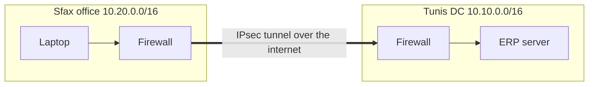
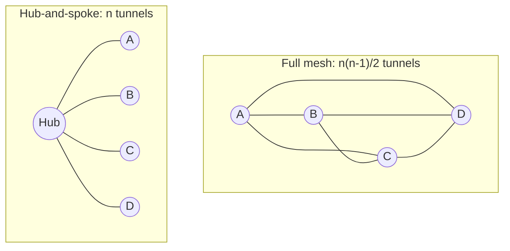
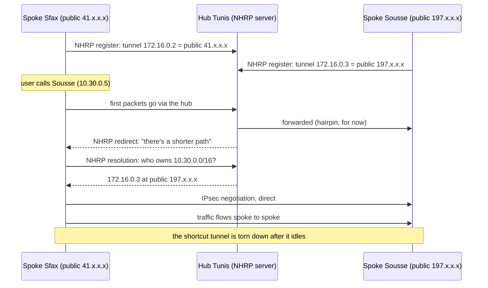
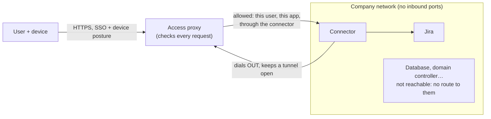
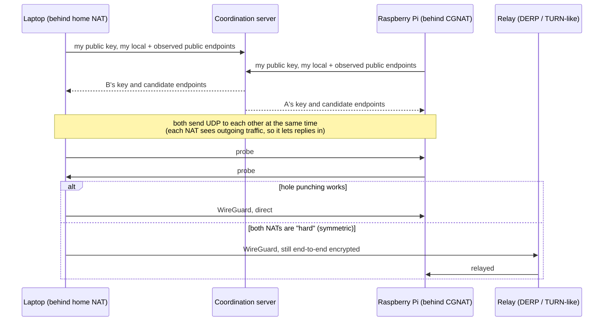
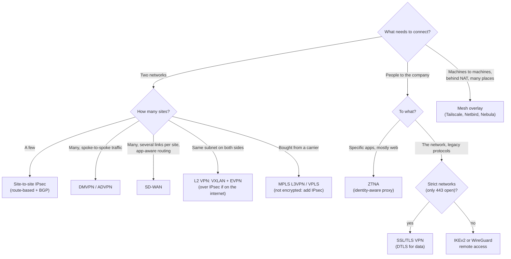

# Types of VPN

> [!abstract] In one sentence
> The kinds of VPN aren't a list to memorize. Each one exists because the previous one **broke at some scale or for some use case**: joining two sites, then fifty, then people at home, then people who shouldn't see the whole network, then machines stuck behind NAT, then workloads that need the same subnet in two places.

The basics (tun interfaces, routes, split tunnel, DNS) are in [[VPN]]. The protocols are in [[IPsec and IKE]] and [[IPsec vs TLS vs WireGuard vs SSH]]. This note is about **architecture**: who connects to what, and why.

## The four questions that classify any VPN

When someone says "we use a VPN", I can pin down what they mean with four questions:

| Question | Possible answers |
|---|---|
| **What connects?** | Two networks · a person's device · two machines · a person to *one app* |
| **At which layer?** | Layer 3 (IP packets, almost always) · Layer 2 (Ethernet frames, same subnet on both sides) |
| **What shape?** | Point-to-point · hub-and-spoke · full mesh · dynamic mesh |
| **Who builds it?** | Me, over the internet, encrypted (**overlay**) · my provider, inside their network, *not* encrypted (**provider-provisioned**, like MPLS) |

The rest of this note follows one fictional company as it grows, because each type of VPN is really the answer to a specific problem.

---

## Stage 1: two offices need to talk

**The problem.** The company has a data center in Tunis and opens an office in Sfax. People in Sfax need the file server and the ERP in Tunis.

**Obvious fix #1: put the servers on the internet.** Now every internal service needs to be hardened for the whole internet, including ones that were never meant to be (old SMB shares, printers, a database admin panel). No.

**Obvious fix #2: rent a private line.** Works, but a leased line between two cities costs a lot every month, and takes weeks to install.

**What people actually do: a site-to-site VPN.** Each site's firewall builds an [[IPsec and IKE|IPsec]] tunnel to the other over ordinary internet. The laptops in Sfax don't know it exists: they send packets for `10.10.0.0/16` to their default gateway, the firewall sees the route points into the tunnel, encrypts, and ships them.

(Why there's a gateway on *each* side, and why nobody "asks" the gateway where things are: [[VPN#Site-to-site vs remote access: where does the tunnel end?]].)

The key property: **the endpoints of the tunnel are gateways, not users.** That makes it invisible to users, but it also means it authenticates *the office*, not *the person*. Anyone plugged into the Sfax LAN is "in".

---

## Stage 2: fifty offices, and the mesh explodes

**The problem.** The company now has 50 branches. Branches need the DC, and more and more they need each other too (a VoIP call from Sfax to Sousse, a branch backing up to another).

**Obvious fix: a full mesh of tunnels.** Every site tunnels to every other site. The number of tunnels is `n(n-1)/2`, so 50 sites = **1 225 tunnels**, each with its own config on both ends. Adding site 51 means touching 50 firewalls. Nobody does this for long.

**Next fix: hub-and-spoke.** Every branch has one tunnel to the DC (the hub). 50 tunnels, and adding a branch touches only the new branch and the hub.

**Where hub-and-spoke breaks: hairpinning.** A call from Sfax to Sousse (60 km apart) now goes Sfax → Tunis → Sousse, through the hub's bandwidth, with the hub decrypting and re-encrypting every packet. Latency doubles, the hub becomes the bottleneck *and* the single point of failure. Video calls between branches suffer first.

What I actually want: **hub-and-spoke for configuration, mesh for traffic.** Spokes should only be *configured* with the hub, but should *discover* each other and build direct tunnels when they need to talk.

### The solution: DMVPN (Dynamic Multipoint VPN)

Cisco's answer (other vendors have equivalents: Fortinet ADVPN, Juniper AutoVPN/ADVPN). Three pieces, each fixing one part:

| Piece | Solves |
|---|---|
| **mGRE** (multipoint GRE) | One tunnel interface on each router that can send to *many* destinations, instead of one interface per peer |
| **NHRP** (Next Hop Resolution Protocol) | "What's the public IP of the spoke that owns `10.30.0.0/16`?" The hub keeps a registry of spokes' tunnel IP → public IP |
| **IPsec** | Encrypts the GRE packets. Tunnels are created *on demand*, so no pre-configured peers |

The first few packets hairpin through the hub, then traffic shifts to a direct tunnel. Configuration stays hub-and-spoke (each spoke only knows the hub's address), traffic becomes a mesh. The routing protocol (usually BGP or EIGRP over the tunnels) carries the prefixes.

**The catch:** both spokes need to be reachable from each other. If both are behind carrier-grade NAT (4G backup links), the direct tunnel may never come up, and traffic silently stays on the hub. Same NAT problem as stage 5.

### Then SD-WAN: the same idea, plus choosing the path

DMVPN solved the topology problem. Branches then got **several internet links** (fiber + 4G + maybe an old MPLS link), and a new problem showed up: the tunnel over fiber is "up", but the fiber is losing 5% of packets, and Teams calls are unusable. Routing protocols only know "up" or "down", not "bad".

**SD-WAN** keeps the overlay (IPsec tunnels over every available link, built automatically) and adds:
- A **central controller**: I define policy once ("voice prefers the lowest-jitter link, backups use the cheapest"), the controller pushes tunnels and config to every branch. Zero-touch: a new branch box is shipped, plugged in, and pulls its config
- **Constant measurement** of loss, latency and jitter on every tunnel (probes every second or so)
- **Per-application path selection**: voice moves to 4G the moment fiber degrades, bulk traffic stays on fiber

So SD-WAN isn't a new kind of tunnel. It's **site-to-site VPN with a brain**. In AWS, SD-WAN appliances plug into a transit gateway with **Transit Gateway Connect** (GRE + BGP, higher bandwidth than an IPsec VPN attachment). See [[Connecting VPCs]].

---

## Stage 3: people work from home

**The problem.** Employees work from home, hotels, client sites. They're not behind any company firewall, so site-to-site doesn't help.

**The solution: remote-access VPN.** A client on the laptop builds the tunnel itself, to a **VPN concentrator** (a firewall or a dedicated box) at the DC. Details of what the client does (tun interface, routes, DNS) are in [[VPN]].

What changes compared to site-to-site:
- The tunnel endpoint is **a device**, and authentication can finally be **the user**: SSO, MFA, a certificate on a managed laptop ([[mTLS]] in the case of TLS-based VPNs)
- The client gets an IP from a **pool** (`10.99.0.0/16`), and the DC needs a route back to that pool
- The server can check **posture** before letting the device in: disk encrypted? OS patched? EDR running?

### Advanced problem: the hotel only allows port 443

IKEv2 uses UDP 500/4500 and WireGuard uses UDP. Hotel Wi-Fi, airport networks and strict corporate guest networks often block everything except TCP 80/443. The VPN just never connects.

**Fix: an SSL/TLS VPN** (AnyConnect, GlobalProtect, OpenVPN on 443). The tunnel is TLS on TCP 443, which looks like HTTPS to the firewall. The good ones then **try DTLS over UDP** for the data and fall back to TCP only if UDP is blocked, because tunnelling TCP inside TCP collapses on lossy links (TCP meltdown, see [[VPN]]).

### Advanced problem: Monday morning, 3 000 people connect

The concentrator was sized for 200 remote users. In 2020, everyone went home in a week and VPNs everywhere fell over. The concentrator decrypts everything, and in **full tunnel** mode that includes YouTube, Windows updates and every Teams call.

**Fixes, in the order people usually try them:**
1. **Split tunnel**: only company prefixes go through the VPN. Removes most of the load, but now the company can't see or filter internet traffic from those laptops
2. **Split tunnel with exceptions**: full tunnel, *except* for known high-volume trusted SaaS (Microsoft 365, Zoom), which go direct. The "local breakout" idea
3. **Scale out**: several concentrators behind a load balancer, or a cloud-managed service (AWS Client VPN scales on its own)

But fixing capacity exposed the deeper problem.

---

## Stage 4: "once you're in, you're in"

**The problem.** A contractor needs access to one Jira server. They get the VPN. The VPN routes `10.0.0.0/8` to them. Their laptop, which the company doesn't manage, has malware, and now that malware can scan and reach **every** host in the company: domain controllers, databases, the finance share.

This is the flaw built into the idea of a network VPN: it answers "**may this device join my network?**" when the real question is "**may this person, on this device, right now, use this app?**" The network was being used as the security boundary (castle and moat), and the VPN is a drawbridge into the castle.

**Attempt 1: firewall rules per VPN group.** Contractors' pool `10.99.50.0/24` may only reach Jira's IP on 443. This works, but it's IP-based: rules drift, apps move IPs, and it still exposes the whole Jira server to a compromised laptop.

**The solution: ZTNA (Zero Trust Network Access).** Don't put the user on the network at all. Put an **identity-aware proxy** in front of each application:

- Access is **per application**, never per network. The user's laptop never gets an IP inside the company network, so there's nothing to scan
- Every request (not just the login) is checked against **who** (identity from SSO), **what device** (managed? patched?) and **context** (country, time)
- The apps have **no inbound ports** open: a connector inside the network dials out to the proxy, so the app isn't even visible from the internet
- Examples: Google BeyondCorp (where the idea comes from), Cloudflare Access, Zscaler Private Access, **AWS Verified Access**

**Where ZTNA struggles:** it's great for web apps. For things that aren't HTTP (SMB shares, RDP, legacy thick clients talking a custom protocol to a database), products fall back to forwarding TCP/UDP per app, which starts to look like a VPN again. In practice companies run **ZTNA for most apps + a restricted VPN for the few legacy ones**.

> [!tip] ZTNA vs VPN in one line
> VPN: "you're on the network, then firewall rules decide". ZTNA: "you're never on the network, and each app decides".

---

## Stage 5: machines behind NAT need to reach each other

**The problem.** Now it's the engineers. A CI runner in one cloud needs to reach a database in another cloud, a developer's laptop needs to SSH into a Raspberry Pi at a customer site, and a GPU box at home needs to join a cluster. **None of them has a public IP.** Every one sits behind NAT, often two layers of it (home router + carrier-grade NAT).

**Obvious fix: hub-and-spoke again.** Put a WireGuard or OpenVPN server in the cloud with a public IP, everyone connects to it. Works, but every byte hairpins through that server (same as stage 2), and it's another box to patch and scale.

**What I actually want:** direct, encrypted connections between any two machines, with no open inbound ports on either side. That means punching through NAT.

### The solution: a mesh overlay (Tailscale, Netbird, ZeroTier, Nebula)

Split the problem in two:
- **Control plane** (a coordination server): knows every node's public key, which IPs/ports it was last seen at, and the ACLs. It **never carries traffic**
- **Data plane**: [[IPsec vs TLS vs WireGuard vs SSH|WireGuard]] tunnels directly between nodes

How two machines behind NAT connect:

- Each node discovers its **public IP:port** as seen from outside (STUN-style), and shares it through the coordination server
- Both sides send packets to each other **at the same time**. Each NAT sees an outgoing packet first, so it creates a mapping that lets the other side's packet in. That's **hole punching**
- If both sides are behind **symmetric NAT** (a different public port for every destination, common with CGNAT and corporate firewalls), the port the other side learned is wrong, and punching fails. Then traffic goes through a **relay**. The relay only sees WireGuard ciphertext, so it's slower but not less secure
- The coordination server hands out **ACLs** by identity ("group:engineers may reach tag:db on 5432"), so it's closer to ZTNA than to an old network VPN

**The catch:** the coordination server is now critical. If it's down, existing tunnels keep working but new nodes and key changes don't propagate. For people who don't want a SaaS in that role, there's **Headscale** (self-hosted Tailscale control server) or Netbird self-hosted.

---

## Stage 6: the application needs the same subnet on both sides

**The problem.** The company adds a second data center. The virtualization team wants to **live-migrate** a VM from DC1 to DC2 without changing its IP. An old clustered app uses Layer 2 heartbeats and needs its nodes in the same broadcast domain. Everything so far was Layer 3: two different subnets connected by routing. That won't do.

**The solution: a Layer 2 VPN.** Carry **Ethernet frames**, not IP packets, so both sites share one subnet:

| Technology | How |
|---|---|
| **tap-based VPN** (OpenVPN in tap mode) | The old, simple way. Fine for a lab, doesn't scale |
| **L2TPv3**, **EoIP** | Ethernet frames inside IP, point-to-point |
| **VXLAN** | Ethernet frame inside UDP 4789, with a 24-bit **VNI** (16 million segments instead of VLANs' 4 094). ~50 bytes of overhead. Run it over IPsec when it crosses the internet |
| **EVPN** | Not a tunnel: a **BGP control plane** for VXLAN. Instead of flooding to learn where each MAC is, the switches advertise MAC/IP locations in BGP (see [[AS and BGP]]) |
| **VPLS** | The provider-built version (over MPLS, next stage) |

### Why network engineers get nervous about stretched L2

Joining two sites at Layer 2 means joining their **failure domains**:
- A **broadcast storm** or loop in DC1 floods DC2 across the WAN link
- If the link between DCs drops, both halves think they're the only one alive (**split brain**): two copies of a cluster both accepting writes
- **Traffic tromboning**: the VM moved to DC2, but its default gateway is still in DC1, so every packet crosses the WAN twice. Fix: an **anycast gateway** (same gateway IP and MAC in both DCs, EVPN does this)

So the modern answer is usually: **stretch L2 only for the few workloads that truly need it**, with EVPN to contain flooding, and push applications toward Layer 3 (DNS names, load balancers) so they don't care about their IP.

---

## Stage 7: the "VPN" that isn't encrypted at all

Carriers sold "VPNs" long before IPsec was common, and the term still means their product in many contracts.

**The problem from the carrier's side.** A carrier has thousands of business customers, and **all of them use `10.0.0.0/8`**. It needs to carry each customer's traffic between that customer's sites without mixing them up, over one shared backbone.

**The solution: MPLS L3VPN.**
- Each customer gets a **VRF** (a separate routing table) on the carrier's edge routers (PE). Customer A's `10.1.0.0/16` and customer B's `10.1.0.0/16` live in different tables, so they never collide. Same idea as VRFs in [[Policy-based routing]] and the problem in [[Overlapping address spaces]]
- Routes are exchanged between edge routers with **MP-BGP**. A **Route Distinguisher** (RD) is prepended to each prefix to make it unique (`65000:1:10.1.0.0/16` vs `65000:2:10.1.0.0/16`), and **Route Targets** (RT) decide which VRFs import which routes. That's how a carrier builds hub-and-spoke or extranets (two customers sharing one service) with just import/export rules
- Packets carry a **label stack**: an outer label to cross the backbone, an inner label to pick the right VRF at the far end

**What's "private" about it:** separation, not encryption. The traffic is in clear text inside the carrier's network. The customer is trusting the carrier the way they'd trust a leased line. That's why security-conscious companies run **IPsec over MPLS**, and why SD-WAN (stage 2) replaced a lot of MPLS: internet links are cheaper, and the encryption was needed anyway.

AWS **Direct Connect** has the same property: private, not encrypted by default (see [[VPN]]).

---

## And the one everyone knows: consumer "privacy" VPNs

NordVPN, Mullvad, Proton VPN and the like are technically **remote-access VPNs in full-tunnel mode** (stage 3), but the goal is reversed: not to reach a private network, but to **leave** from somewhere else. The threat model is different too:
- They hide my traffic from the **local network** (café Wi-Fi) and my **ISP**, and hide my IP from the **sites** I visit
- They **don't** hide it from the VPN provider: I've moved my trust from my ISP to them
- They don't make me anonymous: logins, cookies and browser fingerprinting identify me the same way

---

## The whole map

| Type | Connects | Layer | Shape | Encrypted | Main weakness |
|---|---|---|---|---|---|
| **Site-to-site** | Networks | 3 | Point-to-point / hub-spoke | ✅ | Doesn't scale to many sites, trusts whole LANs |
| **DMVPN / ADVPN** | Networks | 3 | Dynamic mesh | ✅ | Vendor-specific, NAT on both sides breaks shortcuts |
| **SD-WAN** | Networks | 3 | Dynamic mesh + controller | ✅ | Cost, vendor lock-in |
| **Remote access** | Device → network | 3 | Hub-spoke | ✅ | Gives network access, not app access |
| **ZTNA** | User → app | 7 (mostly) | Per-app proxy | ✅ (TLS) | Weak for non-HTTP legacy apps |
| **Mesh overlay** | Device ↔ device | 3 | Full mesh, on demand | ✅ | Depends on a coordination server, relays when NAT is hard |
| **L2 VPN** | Networks, one subnet | 2 | Point-to-point / multipoint | Only if over IPsec | Shared failure domain |
| **MPLS L3VPN** | Networks, via a carrier | 3 (2.5 labels) | Any, via RTs | ❌ | Trust in the carrier, cost |
| **Consumer VPN** | Device → internet | 3 | Hub-spoke | ✅ | Just moves trust to the provider |

## Easy to get wrong
- Thinking "site-to-site vs remote access" is the whole list. Most real designs today mix **SD-WAN between sites + ZTNA for users + a small VPN for legacy apps**
- Treating a VPN as an access control: it answers "may this device join the network?", not "may this user use this app?"
- Assuming MPLS or Direct Connect is encrypted because it's "private"
- Building a full mesh of static tunnels: `n(n-1)/2` grows too fast. Use hub-spoke with dynamic shortcuts, or a controller
- Stretching Layer 2 between data centers "because it's easier", and inheriting each other's broadcast storms
- Believing a mesh VPN's relay can read traffic: it only forwards WireGuard ciphertext
- Forgetting that a direct peer-to-peer tunnel needs NAT traversal, and that symmetric NAT on both sides forces a relay (slower, still encrypted)

## Related
- Part of:: [[VPN]]
- Protocols:: [[IPsec and IKE]], [[IPsec vs TLS vs WireGuard vs SSH]], [[TLS]], [[mTLS]]
- Routing:: [[AS and BGP]], [[Policy-based routing]], [[Overlapping address spaces]], [[Routing tables]]
- Interfaces:: [[Network interfaces]] (tun/tap, GRE, VXLAN, WireGuard)
- Zero trust inside the network:: [[Service mesh]], [[Workload identity (SPIFFE)]]
- Nesting:: [[Nested VPNs]]
- AWS:: [[Site-to-Site VPN]] (CloudHub = hub and spoke), [[Transit gateway]] (Connect attachments for SD-WAN), [[Direct Connect]] (a private carrier link, like MPLS), [[Hybrid connectivity architectures]], [[Connecting VPCs]]

## Flashcards
#flashcards

Four questions that classify any VPN? :: What connects (networks, device, machines, user to app), which layer (2 or 3), what shape (p2p, hub-spoke, mesh), who builds it (me encrypted overlay, or a carrier)
Why doesn't a full mesh of static tunnels scale? :: n(n-1)/2 tunnels: 50 sites = 1 225 tunnels, and every new site touches every other
What is hairpinning in hub-and-spoke? :: Spoke-to-spoke traffic goes through the hub, adding latency and making the hub a bottleneck
What does DMVPN combine and why? :: mGRE (one interface, many peers), NHRP (find a spoke's public IP), IPsec (encryption). Hub-spoke config, direct spoke-to-spoke traffic
What does NHRP do in DMVPN? :: Maps a spoke's tunnel IP to its public IP, so spokes can build direct tunnels on demand
What does SD-WAN add over site-to-site VPN? :: A central controller, zero-touch setup, and per-application path selection based on measured loss/latency/jitter
Why do SSL VPNs exist when IKEv2 and WireGuard are better? :: They run on TCP 443, which strict networks don't block. Good ones switch to DTLS over UDP when possible
Core flaw of a network VPN for access control? :: It grants access to the network, so a compromised device can reach everything routed to it
How does ZTNA differ from a VPN? :: Per-app access through an identity-aware proxy, checked on every request. The user never gets a network IP
How do ZTNA apps avoid open inbound ports? :: A connector inside the network dials out to the proxy
Where does ZTNA struggle? :: Non-HTTP legacy protocols (SMB, RDP, thick clients)
Control plane vs data plane in Tailscale-style meshes? :: Coordination server shares keys, endpoints and ACLs. Traffic goes directly between nodes over WireGuard
How does NAT hole punching work? :: Both sides send UDP to each other's public endpoint at the same time, so each NAT sees an outgoing packet and lets replies in
When does a mesh VPN fall back to a relay? :: When both sides are behind symmetric (hard) NAT. The relay only sees ciphertext
Why would anyone need a Layer 2 VPN? :: Same subnet on both sides: live VM migration keeping its IP, clusters using L2 heartbeats
VXLAN in one line? :: Ethernet frames in UDP 4789, 24-bit VNI, ~50 bytes overhead
What does EVPN add to VXLAN? :: A BGP control plane advertising MAC/IP locations instead of flood-and-learn
Three risks of stretching L2 between data centers? :: Shared broadcast storms, split brain if the link fails, traffic tromboning through the old gateway
How does MPLS L3VPN handle customers with overlapping IPs? :: A VRF per customer, and a Route Distinguisher that makes each prefix unique in MP-BGP
Route Distinguisher vs Route Target? :: RD makes prefixes unique. RT decides which VRFs import which routes
Is an MPLS VPN encrypted? :: No, it's private by separation. Add IPsec for encryption
What does a consumer privacy VPN protect against, and what not? :: Hides traffic from the local network/ISP and my IP from sites. Doesn't hide anything from the VPN provider, doesn't make me anonymous
