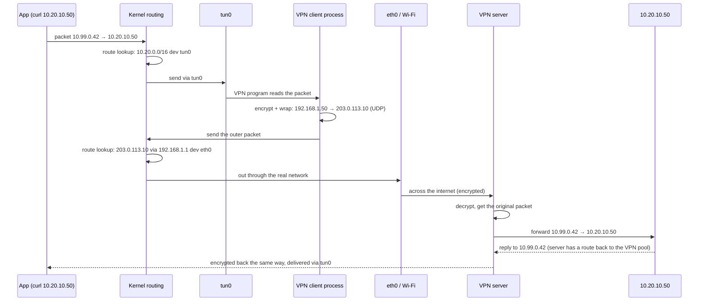

# VPN

> [!abstract] In one sentence
> A VPN (Virtual Private Network) makes a remote network feel **directly connected**: it wraps private traffic inside encrypted packets (a **tunnel**) sent over an untrusted network like the internet, and **routes** decide which traffic goes into that tunnel.

## The three ingredients

Every VPN, whatever the product, is:

| Ingredient | What it means | Where it's explained |
|---|---|---|
| **Encapsulation** | The original packet is put inside another packet addressed to the VPN server/gateway | Below |
| **Cryptography** | That inner packet is encrypted and authenticated, and both ends prove who they are | [[Encryption basics]], [[IPsec and IKE]], [[TLS]] |
| **Routing** | Rules decide **which** traffic enters the tunnel | [[Routing tables]], [[Policy-based routing]] |

People often think of a VPN as "the encryption". In practice, most VPN **problems** are routing, DNS and MTU problems.

## Types of VPN

| Type | Who connects | The users' devices know about the VPN? | Typical tech |
|---|---|---|---|
| **Site-to-site** | Two **networks** (office ↔ data center, office ↔ AWS VPC) through their gateways | ❌ No. Their router sends traffic to the gateway, which tunnels it | [[IPsec and IKE\|IPsec/IKEv2]], sometimes GRE/VXLAN over IPsec |
| **Remote access** | One **device** (laptop, phone) → a company network | ✅ Yes, a VPN client runs on it | IPsec/IKEv2, OpenVPN, SSL VPNs (AnyConnect, GlobalProtect, FortiClient), WireGuard |
| **Mesh / overlay** | Every device ↔ every device directly, managed centrally | ✅ Yes | Tailscale, Netbird, ZeroTier (WireGuard-based) |
| **Clientless SSL VPN** | A browser → a web portal that proxies internal web apps | ❌ Only a browser | [[TLS]] (HTTPS) |
| **Consumer "privacy" VPN** | My device → a provider's server → the internet | ✅ Yes | WireGuard, OpenVPN, IKEv2 |

Related but not quite VPNs: **SSH tunnels** (forward single ports or a SOCKS proxy), **zero-trust access (ZTNA)** proxies that give access **per application** instead of per network.

→ Why each type exists, and the harder ones (DMVPN, SD-WAN, ZTNA, NAT hole punching, Layer 2 VPNs, MPLS): [[Types of VPN]].

## How a remote-access VPN works on a laptop

### The virtual interface

(All the other kinds of virtual interfaces → [[Network interfaces]])


The VPN client creates a **virtual network interface**. To the kernel it looks like a real network card, but "sending" on it just hands the packet to the VPN program:

| | **tun** (Layer 3) | **tap** (Layer 2) |
|---|---|---|
| Carries | IP packets | Ethernet frames (MAC addresses, broadcasts, ARP) |
| Used by | Almost every VPN (OpenVPN default, AnyConnect, WireGuard's `wg0` is similar) | Bridging a whole LAN (old games, some legacy protocols). Rare |

### What happens when it connects

1. **Authenticates** to the server (certificate, password + MFA, SAML/SSO…) and sets up keys
2. Gets an **IP address** inside the VPN (e.g. `10.99.0.42`) and assigns it to `tun0`
3. **Installs routes** pointing at `tun0` (split or full tunnel, below)
4. Adds a **host route to the VPN server** via the real gateway, so the tunnel's own packets don't loop into the tunnel (or uses marks, like WireGuard)
5. Configures **DNS**: the company's DNS servers and search domains
6. Optionally: a **kill switch** (firewall rules blocking everything outside the tunnel), and enforces the device posture checks

When it disconnects, it should undo all of that. A client that crashes can leave **stale routes and DNS** behind.

### A packet's journey



Two route lookups happen: one for the **inner** packet (→ `tun0`) and one for the **outer** packet (→ the real network). Mixing them up is how routing loops happen.

## Split tunnel vs full tunnel

| | **Split tunnel** | **Full tunnel** |
|---|---|---|
| Routes pushed | Only company prefixes (`10.20.0.0/16`, `172.16.0.0/12`) | Everything: `0.0.0.0/1` + `128.0.0.0/1` (or a marked default route) |
| Internet traffic | Goes out directly from my connection | Goes through the company (and its firewall/proxy) |
| Pros | Faster, less load on the VPN, video calls work well | Company can inspect and filter everything. Safe on hotel/public Wi-Fi |
| Cons | Company can't see or protect my internet traffic | Slower, VPN bandwidth becomes a bottleneck |
| Local LAN (printer, NAS) | Still reachable | Often blocked ("allow local LAN access" option) |

The full-tunnel routing tricks (why `0.0.0.0/1`, how WireGuard uses `fwmark` instead) are in [[Routing tables]] and [[Policy-based routing]].

## DNS: the part everyone forgets

Routing says where packets go. **DNS** says which IP a name becomes. They're configured separately:

- **Split DNS**: only names under `corp.example.com` go to the company DNS server, everything else goes to my normal DNS. On Linux with systemd-resolved: `resolvectl dns tun0 10.20.0.2` and `resolvectl domain tun0 '~corp.example.com'`
- **DNS leak**: in a full tunnel, DNS queries still going to the ISP's resolver (outside the tunnel) reveal every site visited
- **Wrong answers**: an internal name resolved by public DNS returns nothing, or a public IP, even though the route through the VPN works
- Several VPNs connected at once fight over DNS settings as much as over routes

## Choosing a protocol

| Protocol | Transport | Strengths | Weaknesses |
|---|---|---|---|
| **IPsec / IKEv2** | UDP 500/4500 + ESP | Standard, every firewall and cloud supports it, native in Windows/macOS/iOS/Android | Complex config, many ways to mismatch. → [[IPsec and IKE]] |
| **WireGuard** | UDP (51820 default) | Tiny codebase, very fast (in the kernel), simple config, roams between networks seamlessly | No dynamic IP assignment or user auth built in (added by Tailscale & co), fixed crypto (no negotiation), UDP only |
| **OpenVPN** | UDP or TCP 1194 (or 443) | Mature, flexible, [[TLS]]-based, runs over TCP 443 to get through strict firewalls | Slower (user space), more overhead |
| **SSL VPNs** (AnyConnect/OpenConnect, GlobalProtect, FortiClient) | TLS over TCP 443 + DTLS over UDP for data | Get through almost any firewall, enterprise features (posture checks, SSO) | Proprietary, need the vendor's client (or OpenConnect) |
| **L2TP/IPsec** | UDP 1701 inside IPsec | Built into old OSes | Legacy, double encapsulation |
| **PPTP** | TCP 1723 + GRE | — | **Broken crypto, never use** |

→ Deeper comparison of the underlying security protocols: [[IPsec vs TLS vs WireGuard vs SSH]].

### WireGuard in more detail

The simplest modern VPN, and the basis of Tailscale/Netbird:

```ini
[Interface]
PrivateKey = <my private key>
Address    = 10.99.0.2/24
ListenPort = 51820

[Peer]
PublicKey  = <server public key>
Endpoint   = vpn.example.com:51820
AllowedIPs = 10.20.0.0/16        # split tunnel. 0.0.0.0/0 = full tunnel
PersistentKeepalive = 25         # keep NAT mappings open
```

**Cryptokey routing**: `AllowedIPs` does two jobs at once:
- **Outgoing**: "packets to `10.20.0.0/16` are encrypted to **this peer**" (it's a routing table between peers)
- **Incoming**: "packets decrypted from this peer are only accepted if their source is in `10.20.0.0/16`" (it's an [[ACL]])

Other traits: fixed modern crypto (Curve25519, ChaCha20-Poly1305, BLAKE2s), new handshake at least every 2 minutes (forward secrecy), and **silent**: it never answers packets that aren't correctly authenticated, so a port scan can't even see it.

## Encapsulation problems

### MTU

The tunnel adds headers (WireGuard: 60 bytes over IPv4, 80 over IPv6 → default MTU **1420**. IPsec: ~50–80. OpenVPN: ~50–70), so the inner packet must be smaller than 1500:
- Symptoms: ping and SSH work, but web pages load halfway, `git clone` or file copies hang
- Fixes: lower the tunnel MTU, **clamp TCP MSS** on the gateway, allow [[ICMP]] "fragmentation needed". Details in [[IPsec and IKE]]

### TCP over TCP ("TCP meltdown")

Running a TCP-based VPN (OpenVPN on TCP, SSH tunnels) and then TCP inside it: when a packet is lost, **both** TCP layers retransmit and back off, and throughput collapses on lossy links. That's why VPNs prefer **UDP** for the outer transport, and only use TCP 443 as a fallback to get through firewalls.

## Several VPNs at once

Each client installs its own routes and DNS, and none of them knows about the others:
- Different prefixes: works fine, each goes to its own `tun`
- The **same prefix** on two VPNs: only one wins → [[Overlapping address spaces]]
- One VPN in **full tunnel**: its default route can capture the other VPN's server traffic, unless the host routes / marks are right
- Clean separation: [[Policy-based routing]] (per-source/per-user tables) or one VPN per **network namespace**

## VPNs in AWS

| Service | Type | Details |
|---|---|---|
| **Site-to-Site VPN** | Site-to-site, IPsec | Two tunnels, BGP or static, attaches to a virtual private gateway or transit gateway → [[IPsec and IKE]], [[Connecting VPCs]] |
| **Client VPN** | Remote access, OpenVPN-based ([[TLS]]) | Managed endpoint associated with VPC subnets. Auth: mutual certificates, Active Directory, or SAML (SSO). **Authorization rules** say which users reach which CIDRs. Split tunnel optional. The **client CIDR must not overlap** the VPC |
| **VPN CloudHub** | Hub and spoke | Several sites connected through one virtual private gateway |
| **Direct Connect** | Not a VPN: a **private physical link** | Not encrypted by default: add IPsec on top, or MACsec on dedicated connections |
| Self-managed | WireGuard/OpenVPN/strongSwan on [[EC2]] | Needs **source/destination check disabled** on the instance, and routes pointing at its ENI |

## Easy to get wrong
- **"Connected" doesn't mean "working"**: the tunnel can be up while routes, DNS, security groups or MTU are wrong
- The **remote side needs a route back** to the VPN client pool (e.g. `10.99.0.0/24 → VPN server`), or replies get lost. Or the server NATs clients behind its own IP
- Home LAN range colliding with a company range (see [[Overlapping address spaces]])
- **A VPN doesn't make me anonymous or secure end to end**: the VPN server sees (or forwards) everything, and inside the company network traffic is plain unless it's also [[TLS]]
- Forgetting that a full tunnel sends **all** traffic (video calls, updates) through the company

## Related
- Depends on:: [[Routing tables]], [[Policy-based routing]], [[Encryption basics]]
- Protocols:: [[IPsec and IKE]], [[TLS]], WireGuard (above)
- Compared:: [[IPsec vs TLS vs WireGuard vs SSH]]
- Problems:: [[Overlapping address spaces]]
- AWS:: [[Connecting VPCs]], [[VPC]], [[Bastion host]] (an alternative for admin access)

## Flashcards
#flashcards

The three ingredients of a VPN? :: Encapsulation, cryptography, routing (which traffic enters the tunnel)
Site-to-site vs remote-access VPN? :: Site-to-site joins two networks via gateways (hosts unaware). Remote access connects one device running a client
tun vs tap? :: tun carries IP packets (Layer 3). tap carries Ethernet frames (Layer 2)
What does a VPN client do when it connects? :: Authenticates, gets an inner IP on tun0, installs routes, adds a host route to the server, configures DNS
Why are there two route lookups for a VPN packet? :: One for the inner packet (→ tun0), one for the encrypted outer packet (→ the real network)
Split vs full tunnel? :: Split: only company prefixes go through the VPN. Full: all traffic does
What is a DNS leak? :: DNS queries going outside the tunnel to the normal resolver, revealing visited sites
What is split DNS? :: Only certain domains (e.g. corp.example.com) are resolved by the VPN's DNS server
What does WireGuard's AllowedIPs do? :: Outgoing: which destinations are sent to that peer. Incoming: which source IPs are accepted from it
Why do VPNs prefer UDP as outer transport? :: TCP over TCP causes "meltdown": both layers retransmit and throughput collapses
Symptom of an MTU problem in a VPN? :: Small things work (ping, SSH) but big transfers and some web pages hang
What does the remote network need so VPN clients get replies? :: A route back to the VPN client pool (or the server NATs clients)
AWS Client VPN is based on which protocol? :: OpenVPN (TLS-based)
Is Direct Connect encrypted? :: No, not by default. Add IPsec on top or MACsec
What must be disabled on an EC2 instance acting as a VPN gateway? :: Source/destination check
Why is PPTP never OK? :: Its cryptography is broken
