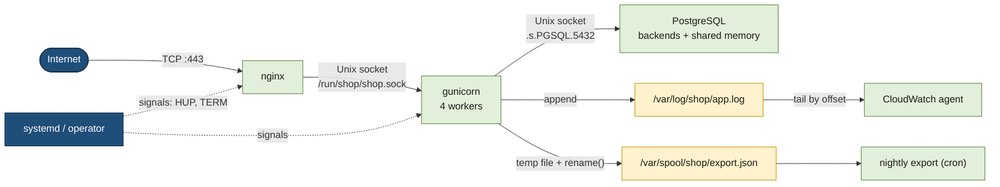

# Inter-process communication on a web server

> [!abstract] In one sentence
> One ordinary web server already uses almost every IPC (inter-process communication) mechanism at once: **files** to hand off work and ship logs, **pipes** when an operator debugs it, **signals** to reload and stop services, **Unix domain sockets** between the reverse proxy and the application, and **shared memory** inside the database; and when the application spreads over many machines, everything that crossed the local kernel turns into network traffic.

The mechanisms themselves (what the kernel does, system call by system call) are in [[Inter-process communication]]. This note puts them to work on one machine.

## Build-up: the processes on one shop web server

One EC2 (Elastic Compute Cloud) instance runs the shop:
- **nginx**, the reverse proxy, receiving HTTP (Hypertext Transfer Protocol) requests from the internet ([[Reverse proxy]])
- **gunicorn** with 4 Python worker processes running the shop application
- **PostgreSQL**, used as a local job queue
- the **CloudWatch agent**, shipping log files to AWS (Amazon Web Services)
- a nightly **export script**, started by cron



### Stage 1: talking through a file

The app needs to hand "orders to export" to the nightly script. Easiest idea: append them to `/var/spool/shop/export.json`, the script reads the file at 02:00.

**The problems:**
- The script reads while a worker is in the middle of writing: it sees **half a JSON (JavaScript Object Notation) object** and crashes
- Two workers write at the same time: lines get **interleaved** or one overwrites the other (unless they open with `O_APPEND` and each write is one small `write()` call)
- Nobody is **notified**: the reader has to poll ("has the file changed?")
- After reading, who deletes what? An order written between "read" and "truncate" is lost

Files still work for IPC when used carefully:
- **Write to a temp file, then `rename()`**: rename is **atomic** on the same filesystem, so readers see either the old or the new file, never half of one. That's how config files and package managers update safely
- **Locks**: `flock(fd, LOCK_EX)` so only one process writes at a time (advisory: everyone must play along)
- **Append-only logs**: the app appends lines, the CloudWatch agent **tails** the file and remembers its offset. This is the one place file IPC is everywhere, and works because nobody rewrites the middle
- **inotify**: the kernel notifies the reader when the file changes, no polling
- **PID (process ID) files** (`/run/nginx.pid`) and **lock files**: tiny files used as "who's running" markers

For the export, the fix is the temp-file-and-rename pattern: each worker writes `export.json.<pid>.tmp`, then renames it to a unique final name in the spool directory, and the script processes and deletes whole files only.

### Stage 2: pipes, a stream from one process to another

When something goes wrong, the operator counts recent errors:

```bash
journalctl -u shop-api --since "1 hour ago" | grep ERROR | wc -l
```

Three processes, connected by two **pipes**. A pipe is a kernel buffer (64 KB on Linux) with a write end and a read end:
- **One direction**: `journalctl` writes, `grep` reads
- **Flow control for free**: if `grep` is slow and the buffer is full, `journalctl`'s `write()` **blocks** until there's room. If the buffer is empty, `grep`'s `read()` waits
- When the writer exits, the reader gets end-of-file. If the reader exits, the writer gets `SIGPIPE` / `EPIPE` ("Broken pipe")
- **Anonymous** pipes only connect **related** processes (the shell creates the pipe, then forks the children that inherit the fds (file descriptors))

A **named pipe (FIFO, first in first out)** lives in the filesystem so unrelated processes can find it:

```bash
mkfifo /tmp/orders.fifo
cat /tmp/orders.fifo &                    # reader blocks until a writer opens it
echo '{"orderId":"o-8812"}' > /tmp/orders.fifo
```

Still one-way, still a byte stream, still one reader in practice. Fine for scripts, too limited for services. gunicorn uses pipes internally too: the master process and its workers keep pipes open to wake each other up and detect dead workers.

### Stage 3: signals, a tap on the shoulder

After changing nginx's config, I don't want to restart it (and drop connections). I **signal** it:

```bash
sudo kill -HUP $(cat /run/nginx.pid)     # or: nginx -s reload, systemctl reload nginx
```

nginx's master process re-reads the configuration, starts new workers with it, and tells the old workers to finish their current requests and exit. No connection is dropped.

| Signal | What it does on this server |
|---|---|
| `SIGHUP` to nginx | Reload config, new workers, old ones drain |
| `SIGHUP` to gunicorn | Reload config and replace workers gracefully |
| `SIGTERM` to gunicorn | Stop accepting, finish in-flight requests, exit (`systemctl stop`, a deploy) |
| `SIGKILL` | What systemd sends when the stop timeout (`TimeoutStopSec`, 90 s by default) runs out |
| `SIGUSR1` to nginx | Reopen log files (logrotate does this after moving the old log) |
| `SIGTTIN` / `SIGTTOU` to gunicorn | Add / remove one worker |

The app's **graceful shutdown** depends on handling `SIGTERM`: during a deploy, the old gunicorn gets `SIGTERM`, stops accepting, finishes in-flight requests, exits. An app that ignores it gets `SIGKILL`ed mid-request.

### Stage 4: Unix domain sockets, two-way local channels

nginx must pass every HTTP request to gunicorn and get the response back: **two-way**, many concurrent conversations, between **unrelated** processes. That's a socket. On the same machine, a **Unix domain socket**:

```text
# gunicorn listens on a path instead of a port
gunicorn --workers 4 --bind unix:/run/shop/shop.sock app:wsgi

# nginx
upstream shop { server unix:/run/shop/shop.sock; }
```

```bash
ss -xlp | grep shop
# u_str LISTEN 0 2048 /run/shop/shop.sock 48911 * 0 users:(("gunicorn",pid=1201,fd=5))
ls -l /run/shop/shop.sock
# srwxrwx--- 1 shop www-data 0 Oct  3 14:00 /run/shop/shop.sock     ← "s" = socket, size 0
```

Why it beats `127.0.0.1:8000` here:
- **Faster**: no TCP/IP (Transmission Control Protocol / Internet Protocol) processing, no ports, no checksums
- **Access control by file permissions**: only users in group `www-data` can connect. A TCP port on localhost is open to **every** local user
- **Peer credentials**: the server can ask the kernel who connected (`SO_PEERCRED`: PID, UID (user ID), GID (group ID)). PostgreSQL's `peer` authentication uses it: the OS (operating system) user `postgres` logs in as DB (database) user `postgres` without a password
- **Passing file descriptors** between processes (`SCM_RIGHTS`): systemd socket activation and zero-downtime reloads hand a listening socket to a new process

The application reaches PostgreSQL the same way: with no host configured, the client library connects to `/var/run/postgresql/.s.PGSQL.5432`.

### Stage 5: shared memory, no copying at all

PostgreSQL has one process **per client connection**, and all of them must see the same cached data pages and locks. Copying pages between processes through sockets would be far too slow. So at startup PostgreSQL creates a **shared memory** segment (`shared_buffers`, e.g. 4 GB) that every backend process **maps into its own address space**: the same physical memory, visible to all.

- Fastest IPC possible: no system call, no copy, just memory reads and writes
- **No synchronization included**: PostgreSQL uses its own locks (spinlocks, lightweight locks) inside the segment
- Visible with `ipcs -m` (System V) or as files in `/dev/shm` (POSIX `shm_open`)
- Containers: Docker's `/dev/shm` is 64 MB by default, a classic reason PostgreSQL or Chrome crash in containers (`--shm-size`)

gunicorn's workers, on the other hand, share **nothing** at run time: each is a separate process forked from the master, so an in-memory cache in one worker is invisible to the other three. That's why sessions and caches go to Redis or the database, not to a Python dictionary.

### Stage 6: processes on different machines

The app moves to 10 instances and the database to [[RDS]]. Processes are no longer on the same kernel, so pipes, Unix sockets, shared memory and signals are out:

| On one machine | Across machines |
|---|---|
| nginx → gunicorn over a Unix socket | A [[Load balancers\|load balancer]] → instances over TCP |
| App → PostgreSQL over `.s.PGSQL.5432` | App → RDS over TCP 5432, with TLS (Transport Layer Security) |
| Export handoff through a spool directory | A queue ([[SQS]]) or object storage |
| `kill -HUP` to reload | A deploy tool restarting instances, or config pulled from a service |
| Log files tailed locally | Still local files, shipped over the network by each instance's agent |

What's left is **network sockets** (TCP/UDP (User Datagram Protocol)), and everything built on them: [[HTTP]], database protocols, [[WebSocket]], message brokers ([[Messaging]]). Same API (application programming interface), the address becomes `IP:port`: that's the subject of [[Sockets]].

## Advanced problems

### 1. 502 Bad Gateway after a deploy: permission denied on the socket
**Symptom:** nginx returns 502, its error log says `connect() to unix:/run/shop/shop.sock failed (13: Permission denied)`. **Cause:** gunicorn was restarted under a different user or umask, and the socket file's owner, group or mode no longer lets nginx's user write to it (or the `/run/shop` directory isn't traversable). **Fix:** set the socket's group and mode explicitly (`--group www-data --umask 007` for gunicorn, or a systemd socket unit with `SocketGroup=` and `SocketMode=0660`), and check with `ls -l` and `namei -l /run/shop/shop.sock`.

### 2. gunicorn won't start after a crash: "Address already in use"
**Symptom:** the service fails at startup with `Connection in use: /run/shop/shop.sock`. **Cause:** the previous process died without removing its socket file, and `bind()` refuses an existing path. **Fix:** remove the stale file in the service's start-up (after making sure no other instance runs), or let systemd own the socket (socket activation), so it survives restarts and is never stale.

### 3. Requests cut off during every deploy
**Symptom:** a few `502`s or connection resets each time a new version starts. **Cause:** the deploy stops gunicorn with `SIGKILL` (or the stop timeout is shorter than the longest request), so in-flight requests die. **Fix:** stop with `SIGTERM`, configure gunicorn's `--graceful-timeout` below systemd's `TimeoutStopSec`, and let nginx retry idempotent requests on the next upstream only.

### 4. Half-processed exports
**Symptom:** the nightly script fails on malformed JSON, or some orders are exported twice. **Cause:** the script reads files the workers are still writing, or truncates after reading. **Fix:** the temp-file-and-rename handoff from Stage 1, processing and deleting whole files only, and an idempotent export (an order ID already exported is skipped).

### 5. "Too many open files" under load
**Symptom:** nginx logs `accept4() failed (24: Too many open files)`, gunicorn workers fail to open sockets to PostgreSQL. **Cause:** each client connection, each upstream connection and each log file is a file descriptor, and the service's limit is the default 1,024. **Fix:** raise `LimitNOFILE=` in the systemd unit (and `worker_rlimit_nofile` in nginx), then check for leaks with `ls /proc/<pid>/fd | wc -l` over time.

### 6. PostgreSQL crashes in its container
**Symptom:** `could not resize shared memory segment ... No space left on device` once the database gets busy in Docker. **Cause:** parallel queries use `/dev/shm`, limited to 64 MB in a container by default. **Fix:** `--shm-size=1g` (or `shm_size:` in Compose, an `emptyDir` with `medium: Memory` in Kubernetes).

## Practice

> [!example]- Why put gunicorn on a Unix socket instead of 127.0.0.1:8000 behind nginx?
> Faster (no TCP/IP stack), and only users with file permissions on the socket can connect, unlike a localhost port open to every local user.

> [!example]- A cron job sometimes reads a half-written JSON file produced by the app. Fix?
> The app writes to a temp file in the same directory, then `rename()`s it over the real name (atomic). Or replace the file with a queue or socket.

> [!example]- During deploys some requests fail with connection resets. The app is stopped with `docker stop`. What should the app do?
> Handle `SIGTERM`: stop accepting, finish in-flight requests, then exit before the grace period ends and `SIGKILL` arrives.

> [!example]- What's the risk of mounting `/var/run/docker.sock` into a container?
> Anything that can talk to it can start privileged containers and mount the host's filesystem: it's root on the host.

> [!example]- A developer caches product prices in a Python dictionary in the app. Prices look different from one request to the next. Why?
> Each gunicorn worker is a separate process with its own memory: four workers, four caches, filled at different times. Use a shared cache (Redis) or the database.

> [!example]- The app moves from one server to ten. Which of its IPC mechanisms survive?
> Only network sockets and things built on them. The Unix socket becomes a load balancer, the local database becomes a network database, the spool directory becomes a queue, signals become deploy tooling.

## Easy to get wrong
- Thinking `127.0.0.1:8000` is private: every local user can connect to it, while a Unix socket has file permissions
- Forgetting the socket file's owner and mode when changing a service's user: nginx gets "Permission denied" and serves 502s
- Leaving stale socket files after a crash, and services that can't restart because of them
- Stopping app servers with `SIGKILL`, or with a timeout shorter than the longest request
- In-memory caches in a multi-worker app: each worker is its own process
- Small `/dev/shm` in containers for databases and browsers
- The default file descriptor limit on a busy server

## Related
- Mechanisms:: [[Inter-process communication]]
- Next:: [[Sockets]]
- The front of the server:: [[Reverse proxy]], [[Load balancing]]
- Shutdown in containers:: [[Docker]], [[Kubernetes Pod]]
- Across machines:: [[HTTP]], [[Messaging]], [[SQS]], [[RDS]]

## Flashcards
#flashcards

Which IPC does nginx use to reach gunicorn on the same server, typically? :: A Unix domain socket (upstream server unix:/run/…/app.sock)
How do you reload nginx without dropping connections? :: Send SIGHUP to the master (nginx -s reload / systemctl reload): new workers start, old ones drain
How does a log shipper read an application's log file safely? :: The app only appends; the shipper tails the file and remembers its offset
How should an app hand a file to a cron job? :: Write a temp file in the same directory, then rename() it to its final name (atomic), and process whole files only
Why does PostgreSQL use shared memory? :: All its per-connection backend processes must see the same page cache and locks without copying
Why can't gunicorn workers share an in-memory cache? :: Each worker is a separate process with its own memory
nginx 502 with "Permission denied" on a Unix socket? :: nginx's user can't write to the socket file (owner/group/mode or directory permissions)
gunicorn fails to start with the socket "in use" after a crash? :: A stale socket file from the dead process; remove it or let systemd own the socket
Why does PostgreSQL crash with "No space left on device" in Docker? :: /dev/shm is 64 MB by default in containers; raise it with --shm-size
What replaces local IPC when the app runs on many machines? :: Network sockets: load balancers, network databases, queues, deploy tooling instead of signals
