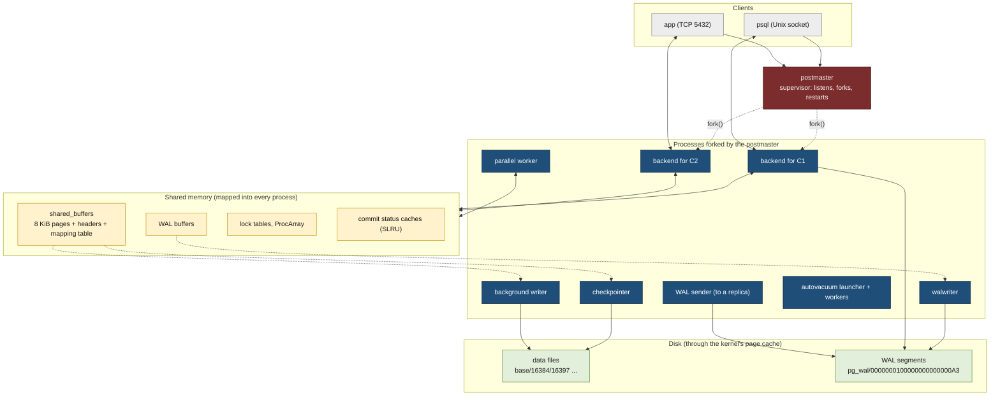
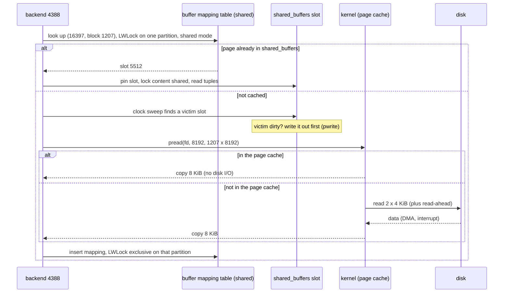
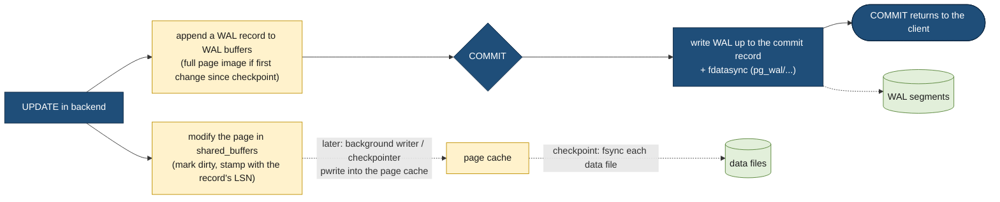
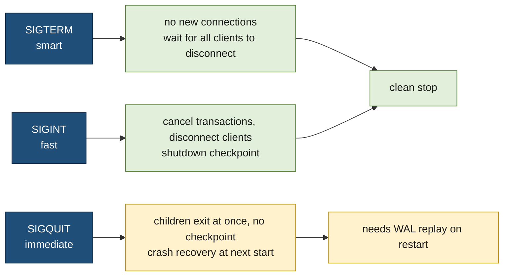
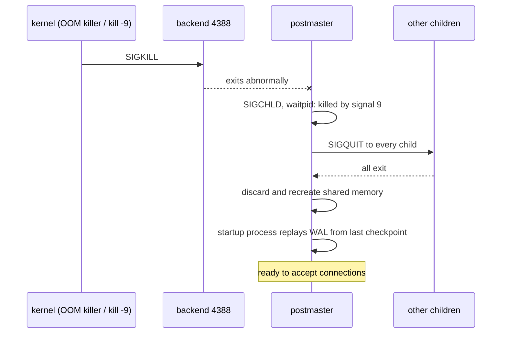

# PostgreSQL architecture

> [!abstract] In one sentence
> PostgreSQL is a family of **processes** forked from one supervisor, the **postmaster** (one backend per client connection plus a handful of helper processes), that share one big region of **shared memory** holding a cache of 8 KiB data **pages**, a write-ahead log buffer and lock tables, protected by three layers of **locks**, coordinated with **signals** and wake-ups, and kept durable by writing the **WAL** (write-ahead log) and calling `fsync` before a commit is acknowledged; nearly every Operating systems concept in this area shows up in it, and most PostgreSQL production problems are those concepts biting.

This note doesn't re-explain the concepts: each stage applies one and links the note that explains it. Reading order: [[Processes and threads]], [[Inter-process communication]], [[Signals]], [[Locks and synchronization]], [[Virtual memory]], [[Memory pages]], [[Journaling]] (for the WAL), then this.

## The whole picture first



| OS concept                                                                | Where it shows up in PostgreSQL                                                         | Stage   |
| ------------------------------------------------------------------------- | --------------------------------------------------------------------------------------- | ------- |
| [[Processes and threads]] (fork, process per connection)                  | One backend process per client, forked by the postmaster                                | 1       |
| [[Inter-process communication]] (shared memory, Unix sockets, pipes)      | The shared buffer pool, `/var/run/postgresql/.s.PGSQL.5432`, the logger pipe            | 2, 6    |
| [[Virtual memory]] (address spaces, RSS/PSS, OOM killer)                  | Every backend maps the same region; "huge" RSS per process; the OOM killer              | 2, 7, 8 |
| [[Memory pages]] (page cache, dirty pages, huge pages, torn pages)        | 8 KiB pages over 4 KiB kernel pages, double buffering, `huge_pages`, `full_page_writes` | 2, 3    |
| [[Journaling]] (write-ahead logging, fsync)                               | The WAL, commits, checkpoints, crash recovery                                           | 4       |
| [[Locks and synchronization]] (spinlocks, reader/writer locks, deadlocks) | Spinlocks, LWLocks, the lock manager and its deadlock detector                          | 5       |
| [[Signals]] (handlers, shutdown, PID 1 role)                              | Reload, three shutdown modes, cancel vs terminate, latches                              | 6       |
| [[Locks and synchronization]] (when a holder dies)                        | A crashed backend makes the postmaster restart everything                               | 7       |

## Build-up: start a server and look at it with OS tools

The lab: a Debian or Ubuntu machine (a virtual machine is fine) with PostgreSQL 17 from the PostgreSQL project's packages, and `pgbench` (the benchmark tool shipped with it) to create load. The same can be done with `docker run postgres:17`, with the OS (operating system) tools run on the host against the container's processes (`docker top pg`, `/proc/PID/...` with the host PID (process ID)). All command output below is illustrative: the shape is real, the numbers are made up.

```bash
sudo apt install postgresql-17 postgresql-contrib
sudo -u postgres createdb bench
sudo -u postgres pgbench -i -s 50 bench          # ~750 MiB of tables and indexes to play with
```

### Stage 1: a family of processes (the postmaster and its children)

**Applies:** [[Processes and threads]] (fork, the process tree, process-per-connection), [[Signals]] (a supervisor and its children).

Right after start, before any client connects:

```text
$ ps -ef --forest | grep [p]ostgres
postgres  2101     1  0 09:00 ?  00:00:00 /usr/lib/postgresql/17/bin/postgres -D /var/lib/postgresql/17/main -c config_file=/etc/postgresql/17/main/postgresql.conf
postgres  2102  2101  0 09:00 ?  00:00:00  \_ postgres: 17/main: checkpointer
postgres  2103  2101  0 09:00 ?  00:00:00  \_ postgres: 17/main: background writer
postgres  2105  2101  0 09:00 ?  00:00:00  \_ postgres: 17/main: walwriter
postgres  2106  2101  0 09:00 ?  00:00:00  \_ postgres: 17/main: autovacuum launcher
postgres  2107  2101  0 09:00 ?  00:00:00  \_ postgres: 17/main: logical replication launcher
```

PID 2101 is the **postmaster**. It does almost no database work itself. Its jobs are the ones a supervisor has:
- **Create shared memory** at startup (Stage 2), before forking anyone, so every child inherits the mapping
- **Listen** on the TCP (Transmission Control Protocol) port 5432 and the Unix socket, `accept()` each new connection and **`fork()`** a backend for it
- **Start and restart** the helper processes, and **reap** every child that exits (`SIGCHLD` and `waitpid()`, see [[Signals]])
- **React when a child dies abnormally** by resetting the whole server (Stage 7)

It's the same role PID 1 plays for a whole system, in miniature: if the postmaster dies, its children notice (they watch a pipe from the postmaster that closes when it exits) and shut down.

Now connect two clients, one through the Unix socket and one over TCP, and run a query in one of them:

```text
$ ps -ef --forest | grep [p]ostgres
postgres  2101     1  ...  /usr/lib/postgresql/17/bin/postgres -D ...
postgres  2102  2101  ...   \_ postgres: 17/main: checkpointer
...
postgres  4310  2101  ...   \_ postgres: 17/main: postgres bench [local] idle
postgres  4388  2101  ...   \_ postgres: 17/main: app bench 192.0.2.10(51234) SELECT
```

Each connection got its own process: a **backend**. The text after `postgres:` is a **process title** PostgreSQL rewrites as it works (user, database, client address, and the current command or `idle`, `idle in transaction`, `waiting`). `ps` and `top` show live what each connection is doing; the SQL (Structured Query Language) view with the same information is `pg_stat_activity`:

```sql
SELECT pid, usename, client_addr, state, wait_event_type, wait_event, left(query, 40)
FROM pg_stat_activity WHERE backend_type = 'client backend';
```

```text
 pid  | usename | client_addr |  state  | wait_event_type | wait_event |                 left
------+---------+-------------+---------+-----------------+------------+--------------------------------------
 4310 | postgres|             | idle    | Client          | ClientRead | select now();
 4388 | app     | 192.0.2.10  | active  | IO              | DataFileRead | SELECT sum(abalance) FROM pgbench_acc
```

**The helper processes**, each with one job:

| Process | Job | Concept it leans on |
|---|---|---|
| checkpointer | Periodically writes all dirty pages to the data files and records a checkpoint (Stage 4) | [[Memory pages]] (writeback, fsync) |
| background writer | Writes some dirty pages ahead of time so backends rarely have to | [[Memory pages]] |
| walwriter | Flushes the WAL buffers to disk regularly (for asynchronous commits) | [[Journaling]] |
| autovacuum launcher + workers | Remove dead row versions and update statistics, one worker per database at a time | |
| logger (only with `logging_collector = on`) | Collects log output from all processes through a **pipe** and writes log files | [[Inter-process communication]] |
| archiver (with `archive_mode`) | Copies finished WAL segments to an archive (backups) | |
| WAL sender / WAL receiver | Stream WAL to a replica over TCP / receive it on the replica | [[Sockets]] |
| startup process | Replays WAL during crash recovery, and continuously on a replica | [[Journaling]] |
| logical replication launcher | Starts workers for logical replication subscriptions | |
| parallel workers | Extra processes a backend borrows for one query (`postgres: parallel worker for PID 4388`) | [[Processes and threads]] |

**Why processes and not threads?** PostgreSQL's design dates from the 1980s and 1990s, when threads were neither portable nor reliable across Unix systems, and `fork()` was. The model has kept two real advantages: a backend that crashes or corrupts its **private** memory can't scribble over another backend's private memory ([[Virtual memory]]), and per-session state needs no locking. It also has real costs, which drive a lot of PostgreSQL operations:

| Cost | Where it comes from | Consequence |
|---|---|---|
| Memory per connection | Each backend has private caches (catalog, plans), a stack, and its own page tables for shared memory: a few MiB idle, much more when working | `max_connections` (default 100) stays in the hundreds, not tens of thousands |
| Connection setup | `fork()`, authentication, warming the catalog caches: milliseconds | Opening a connection per request is slow |
| Context switches | Hundreds of active processes competing for a few CPUs (central processing units) | Throughput falls when active connections greatly exceed cores |
| Snapshots | Every transaction scans the list of all backends to see which transactions are running | More connections = more work per transaction, even when idle |

Hence the standard production answer: put a **connection pooler** in front (PgBouncer, or one built into the application or the cloud provider). Thousands of client connections share a few dozen server backends; in "transaction" mode a backend is lent to a client only for the duration of one transaction. That's the event-loop-in-front-of-a-worker-pool shape from [[Processes and threads]].

### Stage 2: one shared region, mapped into every process

**Applies:** [[Inter-process communication]] (shared memory), [[Virtual memory]] (address spaces, RSS/PSS), [[Memory pages]] (shared pages, page tables, huge pages).

Every backend needs to see the same cached data pages, the same lock tables, and the list of running transactions. Copying those between processes would be hopeless, so they live in **shared memory**, created once by the postmaster:

| In shared memory | What it is | Size (typical) |
|---|---|---|
| `shared_buffers` | The buffer pool: an array of 8 KiB page slots, one header per slot (which page, pin count, usage count, dirty flag, locks), and a hash table mapping "relation, block number" to a slot | Set by the administrator, often 25 % of RAM (random access memory) |
| WAL buffers | Where WAL records are assembled before being written | `wal_buffers`, by default 1/32 of `shared_buffers`, up to 16 MiB |
| Lock tables | The heavyweight lock manager's hash tables (Stage 5) | Sized from `max_connections` × `max_locks_per_transaction` |
| ProcArray | One entry per backend: its running transaction ID and snapshot data | Small |
| SLRU (simple least-recently-used) caches | Cached pages of the commit log (CLOG (commit log), in `pg_xact/`: committed or aborted, per transaction ID), subtransactions, multixacts | Small |

**How it's allocated on Linux.** Since PostgreSQL 9.3 the main region is an **anonymous shared mapping** (`mmap(MAP_SHARED | MAP_ANONYMOUS)`) created by the postmaster; children get it by inheriting it at `fork()`. Only a tiny **System V** segment remains, used as an interlock (it tells a new postmaster whether old backends are still attached to the data directory):

```text
$ ipcs -m
------ Shared Memory Segments --------
key        shmid      owner      perms      bytes      nattch     status
0x0052e2c1 32769      postgres   600        56         7

$ pmap -x 4388 | sort -k2 -n | tail -3
00007f3a40000000 1105920  412032  412032 rw-s- zero (deleted)     <- the main shared region
...
```

Parallel query needs more shared memory **while a query runs**: the leader backend and its parallel workers exchange tuples through **dynamic shared memory** (DSM) segments, created on demand. On Linux these are POSIX (Portable Operating System Interface) shared memory objects, visible as files in `/dev/shm`:

```text
$ ls -l /dev/shm
-rw------- 1 postgres postgres    26976 Oct 10 09:00 PostgreSQL.1804289383   <- created at startup
-rw------- 1 postgres postgres  4194304 Oct 10 09:14 PostgreSQL.846930886    <- a parallel query in progress
```

That's why PostgreSQL in Docker fails with `could not resize shared memory segment "/PostgreSQL.846930886" to 4194304 bytes: No space left on device`: a container's `/dev/shm` is 64 MB by default (Advanced problem 3).

**The RSS (resident set size) illusion.** Each backend maps the whole shared region, and every shared page it has touched counts in **its** RSS ([[Virtual memory]]). After a busy hour:

```text
$ ps -o pid,rss,cmd -u postgres | sort -k2 -n | tail -4
 4388 1093412 postgres: 17/main: app bench 192.0.2.10(51234) idle
 4401 1088950 postgres: 17/main: app bench 192.0.2.10(51240) idle
 4402 1091020 postgres: 17/main: app bench 192.0.2.10(51241) idle
 2102 1101736 postgres: 17/main: checkpointer
```

Four processes at ~1 GiB each, on a machine where PostgreSQL uses ~1.2 GiB in total. `smaps_rollup` tells the truth:

```text
$ grep -E '^(Rss|Pss|Pss_Shmem|Private_Dirty|Shared_Clean|Shared_Dirty)' /proc/4388/smaps_rollup
Rss:             1093412 kB
Pss:               61280 kB      <- this process's fair share
Pss_Shmem:         54922 kB
Shared_Clean:      33620 kB
Shared_Dirty:    1052388 kB      <- the shared buffer pool, counted again in every backend
Private_Dirty:      7404 kB      <- what this backend really owns
```

Summing RSS across backends counts `shared_buffers` once per process. PSS (proportional set size) or "private + shared region once" is the right sum.

**Page tables, and why `huge_pages` exists.** The shared region is the same frames for everyone, but **each process has its own page table entries** pointing at them ([[Memory pages]]). With 8 GiB of `shared_buffers` and 4 KiB pages, a backend that touches all of it needs ~16 MiB of page tables; 400 such backends spend ~6 GiB of RAM on page tables, and a lot of TLB (translation lookaside buffer) misses. With 2 MiB huge pages the same mapping costs 32 KiB per backend. PostgreSQL's `huge_pages` setting (`try` by default, `on` to insist) asks for explicit huge pages for the main region:

```bash
# how many 2 MiB pages the main region needs (server can be stopped)
sudo -u postgres /usr/lib/postgresql/17/bin/postgres -D /var/lib/postgresql/17/main \
  -C shared_memory_size_in_huge_pages -c config_file=/etc/postgresql/17/main/postgresql.conf
4235
echo 'vm.nr_hugepages = 4300' | sudo tee /etc/sysctl.d/60-postgres-hugepages.conf && sudo sysctl --system
```

```text
$ grep -E 'HugePages_(Total|Free|Rsvd)|PageTables' /proc/meminfo     # after restart with huge_pages = on
HugePages_Total:    4300
HugePages_Free:     3012
HugePages_Rsvd:     2947
PageTables:        41820 kB
```

With `try`, PostgreSQL silently falls back to normal pages if not enough huge pages are reserved; `on` refuses to start instead, which is easier to notice. Transparent huge pages are a different mechanism and usually set to `madvise` or `never` on database hosts ([[Memory pages]]).

### Stage 3: PostgreSQL's pages, on top of the kernel's pages

**Applies:** [[Memory pages]] (application page vs kernel page, page cache, double buffering, dirty pages, torn pages).

Tables and indexes are files (`base/DB_OID/RELFILENODE` (OID: object identifier, the database's number; RELFILENODE: the table's file number)) divided into **8 KiB pages**. A page is the unit PostgreSQL reads, caches, locks, writes and logs; it's two kernel pages and two filesystem blocks underneath.

**Reading a page.** A query on `pgbench_accounts` needs block 1,207 of file `16397`:



Every step uses an OS idea: the mapping table is split into 128 partitions, each protected by its own reader/writer lock ([[Locks and synchronization]]); a miss becomes a `pread()` system call that may be satisfied from the kernel's page cache or may wait for the disk, during which the backend sits in state `D` and shows `wait_event = DataFileRead` ([[Processes and threads]], [[Interrupts]]).

**Eviction: the clock sweep.** Each buffer slot has a `usage_count` (0 to 5), incremented when the page is used. To find a victim, a "clock hand" walks the slots, decrementing counts, and takes the first unpinned slot that reaches 0. It's an approximation of least-recently-used that needs no global list lock. Large sequential scans, `VACUUM` and bulk loads use a small **ring** of buffers instead of the whole pool, so one big scan can't evict the hot working set (the same problem as a backup evicting the page cache in [[Memory pages]]).

```sql
CREATE EXTENSION pg_buffercache;
SELECT c.relname, count(*) AS buffers, round(count(*) * 8 / 1024.0) AS mib,
       sum(CASE WHEN b.isdirty THEN 1 ELSE 0 END) AS dirty
FROM pg_buffercache b JOIN pg_class c ON b.relfilenode = pg_relation_filenode(c.oid)
GROUP BY c.relname ORDER BY buffers DESC LIMIT 4;
```

```text
        relname        | buffers | mib | dirty
-----------------------+---------+-----+-------
 pgbench_accounts      |  101233 | 791 |  3920
 pgbench_accounts_pkey |   13711 | 107 |   402
 pgbench_history       |    1208 |   9 |  1208
 pgbench_branches      |       1 |   0 |     1
```

**Double buffering.** PostgreSQL reads and writes through the kernel's page cache by default (it doesn't open data files with `O_DIRECT`). So a hot page can sit in `shared_buffers` **and** in the page cache. That's a deliberate trade-off: `shared_buffers` is kept moderate (about 25 % of RAM is the usual starting point) and the kernel caches the rest, does read-ahead, and smooths writes. `effective_cache_size` is not an allocation at all: it tells the query planner roughly how much of the data is likely cached somewhere (both caches together), so it can cost index scans realistically. PostgreSQL 18 added asynchronous I/O (`io_method`, with worker processes or Linux io_uring) for reads; direct I/O exists only as a developer option so far, so on the versions covered here the page cache stays in the picture.

**Who writes dirty pages.** A modified page is marked dirty in its slot. It reaches the data file one of three ways:
1. The **checkpointer**, writing all dirty pages at each checkpoint (Stage 4)
2. The **background writer**, writing pages the clock sweep is about to reach, so they're clean when needed
3. A **backend** itself, when the victim it found is still dirty: this puts write latency into a query, and is the one to watch

```sql
SELECT backend_type, object, context, writes, fsyncs
FROM pg_stat_io WHERE writes > 0 ORDER BY writes DESC;
```

Those writes are `pwrite()`s into the page cache: the kernel's dirty pages and writeback rules ([[Memory pages]]) take over from there, until PostgreSQL calls `fsync`.

**Torn pages.** An 8 KiB page written as two 4 KiB kernel pages can be half-written if the power fails ([[Memory pages]]). PostgreSQL's answer is **`full_page_writes`** (on by default): the first time a page is modified after each checkpoint, the WAL record carries a **full image** of the page. Crash recovery restores that image first, then replays later changes on it, so a torn page on disk doesn't matter. **Data checksums** (enabled at `initdb` with `--data-checksums`, the default from PostgreSQL 18) detect pages corrupted by the storage stack when they're read back.

### Stage 4: durability, the WAL and checkpoints

**Applies:** [[Journaling]] (write-ahead logging, fsync, recovery), [[Memory pages]] (writeback, fsync semantics).

A commit can't wait for every modified data page to be written to its file: that would be many random writes to many files. PostgreSQL follows the write-ahead rule from [[Journaling]]: **describe the change in the WAL first, make the WAL durable, and write the data pages later, at leisure.**



- Every WAL record has an **LSN (log sequence number)**: its byte position in the never-ending log, written like `0/A31F2C8`. Each data page remembers the LSN of the last record that changed it, and a dirty page can't be written to its file before the WAL up to that LSN is on disk (the write-ahead rule, enforced per page)
- **A commit = the WAL flushed and `fsync`ed up to the commit record.** `wal_sync_method` (on Linux, `fdatasync` by default) chooses the system call. That one sequential flush is what a commit waits for, and why commit latency is the storage's flush latency
- `synchronous_commit = off` lets commits return before the flush (the walwriter flushes within a few hundred milliseconds). A crash can lose the last commits, but never corrupts anything: a deliberate trade for some workloads. With replicas, `remote_write`/`on`/`remote_apply` extend the wait to the standby
- WAL lives in 16 MiB **segment files** in `pg_wal/`, recycled after each checkpoint once they're no longer needed

```sql
SELECT pg_current_wal_lsn(), pg_walfile_name(pg_current_wal_lsn());
```

```text
 pg_current_wal_lsn |     pg_walfile_name
--------------------+--------------------------
 0/A31F2C8          | 0000000100000000000000A3
```

**Checkpoints** bound how much WAL a crash recovery must replay. At each checkpoint (every `checkpoint_timeout`, 5 minutes by default, or sooner when `max_wal_size` worth of WAL has been written), the checkpointer writes **every** dirty page, then calls `fsync` on each data file, then records the checkpoint's LSN. `checkpoint_completion_target` (0.9 by default) spreads those writes over 90 % of the interval, so the kernel's writeback sees a steady stream instead of a burst ([[Memory pages]], dirty_ratio stalls). Right after a checkpoint, full-page images make the WAL temporarily bigger.

**Crash recovery** is then simple: start from the last checkpoint's LSN and replay every WAL record after it. The **startup process** does that; a replica is a server doing the same thing for ever, with WAL streamed over TCP by a WAL sender.

**When `fsync` lies: "fsyncgate" (2018).** PostgreSQL had assumed that if `fsync` failed, retrying it later would either succeed with the data on disk or fail again. On Linux, when writeback of a dirty page failed (a disk or network storage error), the kernel reported the error once, then could mark the page **clean** and drop the failed data: a retry returned success, with data silently lost ([[Memory pages]]). Since late 2018 (PostgreSQL 12, and minor releases of older versions), PostgreSQL treats an `fsync` failure on a data file as fatal: it **PANICs**, and crash recovery rebuilds from the WAL, which was safely flushed. It's a clear example of a database depending on precise kernel semantics.

### Stage 5: three layers of locks

**Applies:** [[Locks and synchronization]] (spinlocks, reader/writer locks, deadlock detection, the layers of locks).

PostgreSQL uses exactly the layers described in [[Locks and synchronization]], each in shared memory so every backend sees it:

| Layer | Protects | Held for | Waiting |
|---|---|---|---|
| Atomics and **spinlocks** | A few fields: a buffer header's flags, a counter, a WAL insertion position | Tens of instructions | Spin with backoff; a spinlock stuck for about a minute makes the server PANIC ("stuck spinlock"), because it means a bug or a dead holder |
| **LWLocks** (lightweight locks) | Shared structures: a buffer's content, a partition of the buffer mapping table, the WAL write position, the ProcArray | Microseconds to milliseconds | Shared or exclusive; waiters queue and sleep on a per-process semaphore; no deadlock detection, so the code always takes them in a fixed order |
| **Heavyweight locks** (the lock manager) | What SQL sees: tables (8 lock modes, from `ACCESS SHARE` for `SELECT` to `ACCESS EXCLUSIVE` for `ALTER TABLE`), transaction IDs, advisory locks | Until the end of the transaction | Queued, visible in `pg_locks`, **deadlock detection** |

**Row locks** don't live in the lock manager (millions of locked rows would fill it): a locked or updated row has the locking transaction's ID written in its header (`xmax`). A second transaction that wants the row waits on the **first transaction's ID**, a heavyweight lock every transaction holds on itself until it ends. That's why row waits show up as `Lock: transactionid`.

**Deadlocks** are detected lazily: a backend waiting for a heavyweight lock longer than `deadlock_timeout` (1 s) builds the wait-for graph from the lock tables; if it finds a cycle, one transaction is cancelled with `ERROR: deadlock detected`.

**MVCC (multiversion concurrency control)** is why the top layer stays quiet for most workloads: an `UPDATE` writes a **new version** of the row and leaves the old one for transactions whose snapshot still needs it. Readers never block writers, and writers never block readers; only writers of the **same row** wait for each other. The old versions are what `VACUUM` (autovacuum) cleans up later.

**Seeing the waits.** `pg_stat_activity.wait_event_type` / `wait_event` say what a backend is waiting on at this instant, the most useful single diagnostic PostgreSQL has:

| Wait event | Meaning | OS concept underneath |
|---|---|---|
| `LWLock: BufferMapping` | Contention on the buffer mapping partitions: many backends missing the cache at once | Reader/writer lock contention ([[Locks and synchronization]]) |
| `LWLock: WALWrite` | Waiting for another backend to finish writing/flushing WAL | Lock + fsync latency |
| `Lock: transactionid` | Waiting for another transaction holding the row | Heavyweight lock, application design |
| `Lock: relation` | Waiting for a table lock (often behind an `ALTER TABLE`) | Heavyweight lock queue |
| `IO: DataFileRead` | Reading a page that isn't in `shared_buffers` | `pread()`, page cache or disk ([[Memory pages]]) |
| `IO: WALSync` | Flushing WAL at commit | `fdatasync` latency ([[Journaling]]) |
| `Client: ClientRead` | Idle, waiting for the client to send something | A socket read ([[Sockets]]) |

```sql
SELECT wait_event_type, wait_event, count(*)
FROM pg_stat_activity WHERE state = 'active' GROUP BY 1, 2 ORDER BY 3 DESC;
```

### Stage 6: signals, wake-ups and the other channels

**Applies:** [[Signals]] (handlers, reload, shutdown, cancel), [[Inter-process communication]] (pipes, Unix sockets, peer credentials).

**Configuration reload.** `pg_ctl reload`, `systemctl reload postgresql` or `SELECT pg_reload_conf()` all send **`SIGHUP`** to the postmaster, which re-reads `postgresql.conf` and `pg_hba.conf` (host-based authentication) and passes the signal to its children. Settings marked "requires restart" (like `shared_buffers`) can't change this way, because the shared region was sized at startup.

**Three shutdown modes, three signals to the postmaster:**



`pg_ctl stop` defaults to **fast**. `SIGTERM` (smart) can wait for ever if a client keeps its connection open, which is why the official Docker image sets `STOPSIGNAL SIGINT`: `docker stop` sends a fast shutdown, not a smart one that would hit the 10 s timeout and become a `SIGKILL` ([[Signals]]).

**Stopping one query or one session**, from SQL:
- `SELECT pg_cancel_backend(4388)` sends **`SIGINT`** to that backend: its handler sets a flag, the backend checks it at the next safe point and aborts the **current query**; the session stays connected
- `SELECT pg_terminate_backend(4388)` sends **`SIGTERM`**: the backend aborts its transaction and **exits** cleanly, releasing its locks
- Never `kill -9` a backend from the shell: see Stage 7

Both follow the async-signal-safety rule from [[Signals]]: the handler only sets a flag, and the real work happens in normal code at checkpoints in the query's loops ("CHECK_FOR_INTERRUPTS").

**Waking each other up (latches).** Processes often need to tell another one "something changed": a backend waiting for a lock is woken by the releaser, the walwriter is told there's WAL to flush, a WAL sender is told new WAL arrived. PostgreSQL's **latch** is a small flag in shared memory plus a way to wake a sleeping process. In recent versions on Linux the sleeping process waits in `epoll` on its sockets **and** on a `signalfd`, and the waker sets the flag and sends it a signal (`SIGURG`), which turns the signal into an ordinary readable event (the self-pipe and `signalfd` patterns from [[Signals]]). `strace -p` on an idle backend shows it:

```text
$ sudo strace -p 4310
epoll_wait(5, [{events=EPOLLIN, data={u32=0, u64=0}}], 1, -1) = 1     <- client sent a query
recvfrom(9, "Q\0\0\0\23select now();\0", 8192, 0, NULL, NULL) = 19
...
sendto(9, "T\0\0\0!\0\1now\0..."..., 76, 0, NULL, 0) = 76
epoll_wait(5,                                                            <- back to waiting
```

**The other channels**, all from [[Inter-process communication]]:
- **Unix socket** `/var/run/postgresql/.s.PGSQL.5432` for local clients (`psql` without `-h`), with **peer** authentication: the kernel tells the server the connecting user's UID (user ID) through `SO_PEERCRED`, so the OS user `postgres` is the database user `postgres` without a password
- **TCP 5432** for everything remote, and for replication (WAL sender to WAL receiver)
- **A pipe** from every process to the logger, when `logging_collector` is on: all processes write log lines to the same pipe, and writes up to `PIPE_BUF` are atomic, so lines don't interleave (longer messages are split into chunks with a header for that reason)
- **A "postmaster alive" pipe**: every child holds the read end of a pipe whose write end only the postmaster keeps; if the postmaster dies, the pipe reports end-of-file and the children exit

```text
$ ss -xlp | grep PGSQL ; ss -tlnp | grep 5432
u_str LISTEN 0 244 /var/run/postgresql/.s.PGSQL.5432 31207 * 0 users:(("postgres",pid=2101,fd=7))
LISTEN 0 244 127.0.0.1:5432 0.0.0.0:* users:(("postgres",pid=2101,fd=6))
```

### Stage 7: when one process dies, everyone restarts

**Applies:** [[Locks and synchronization]] (a lock holder dying in shared memory), [[Signals]] (SIGKILL, SIGSEGV, SIGCHLD), [[Virtual memory]] (the OOM killer).

Kill one backend the wrong way and watch the log:

```bash
sudo kill -9 4388
```

```text
LOG:  server process (PID 4388) was terminated by signal 9: Killed
DETAIL:  Failed process was running: UPDATE pgbench_accounts SET abalance = ...
LOG:  terminating any other active server processes
LOG:  all server processes terminated; reinitializing
LOG:  database system was interrupted; last known up at 2026-10-10 09:31:02 UTC
LOG:  database system was not properly shut down; automatic recovery in progress
LOG:  redo starts at 0/A2F10B8
LOG:  redo done at 0/A31F2C8
LOG:  database system is ready to accept connections
```

Every connection on the server was dropped, not only the killed one. The postmaster's reasoning is the one from [[Locks and synchronization]]: a process that dies **without exiting cleanly** may have been in the middle of a critical section, holding a spinlock or an LWLock, with a shared structure half-updated. There's no safe way to repair that, so the postmaster:
1. Sends `SIGQUIT` to every other child ("exit now, don't touch shared memory")
2. Waits for all of them, throws the shared memory away and creates it fresh
3. Runs crash recovery from the last checkpoint (Stage 4)
4. Accepts connections again (`restart_after_crash = on`, the default)

A clean exit (`pg_terminate_backend`, a client disconnect, even a backend `ERROR`) releases its locks properly and affects nobody else.



**The OOM (out of memory) killer is the usual culprit.** When the machine runs out of memory, the kernel kills the process with the highest OOM score ([[Virtual memory]]). If it picks a backend, the whole server restarts; if it picked the **postmaster**, the server would be gone. The recommended setup:
- **`vm.overcommit_memory = 2`** on dedicated database hosts, so allocations fail (and the query gets an error) instead of the OOM killer firing later. Size `vm.overcommit_ratio` so the commit limit covers what PostgreSQL really needs
- **Protect the postmaster, not the backends**: start it with `oom_score_adj = -1000` (the packaged systemd units do this with `OOMScoreAdjust=-1000`), and set the environment variables `PG_OOM_ADJUST_FILE=/proc/self/oom_score_adj` and `PG_OOM_ADJUST_VALUE=0` so each forked backend **resets** its score: if the kernel must kill something, it kills a backend, and the postmaster survives to recover

### Stage 8: memory per backend, and sizing a machine

**Applies:** [[Virtual memory]] (private memory, cgroup limits), [[Processes and threads]] (process-per-connection costs).

Besides its share of the shared region, each backend allocates private memory as it works, organized in **memory contexts** (a tree of arenas freed together at the end of a query or transaction, so leaks inside a query don't outlive it). The settings that control it are **per operation, per backend**:

| Setting | Default | Per | Used for |
|---|---|---|---|
| `work_mem` | 4 MiB | **Each sort or hash node** in a query plan, in each backend and parallel worker | Sorts, hash joins, hash aggregates (hash nodes may use `work_mem × hash_mem_multiplier`, ×2 by default) before spilling to temporary files |
| `maintenance_work_mem` | 64 MiB | Each `VACUUM`, `CREATE INDEX`, `ALTER TABLE ADD FOREIGN KEY` | Maintenance operations; autovacuum workers have `autovacuum_work_mem` |
| `temp_buffers` | 8 MiB | Each session using temporary tables | Local buffers for temporary tables |
| (catalog and plan caches) | | Each backend | Grows with the number of tables touched and prepared statements |

The worst case multiplies: 300 active backends × a plan with 4 hash nodes × 2 parallel workers each × 64 MiB `work_mem` × 2 = far more RAM than the machine has. In practice queries rarely all peak at once, which is why `work_mem` is kept small globally and raised per session (`SET work_mem = '256MB'`) for the reporting queries that need it.

A sizing sketch for a dedicated 64 GiB machine:

| Part | Size | Why |
|---|---|---|
| `shared_buffers` | 16 GiB (25 %) | The shared buffer pool, in huge pages |
| Page cache | ~30 GiB | Left to the kernel: the second cache level (`effective_cache_size = 46GB`) |
| Backends' private memory | ~12 GiB | 200 connections through a pooler × a few MiB idle, plus `work_mem` for the active ones |
| Maintenance and autovacuum | ~2 GiB | `maintenance_work_mem` × concurrent maintenance |
| OS, page tables, everything else | ~4 GiB | Small thanks to huge pages |

```sql
-- what one backend is using right now (PostgreSQL 14+), from inside it
SELECT name, total_bytes / 1024 AS kib FROM pg_backend_memory_contexts ORDER BY total_bytes DESC LIMIT 3;
-- or ask another backend to dump its contexts to the server log
SELECT pg_log_backend_memory_contexts(4388);
```

**In containers**, the whole server runs under one cgroup (control group) memory limit ([[Virtual memory]]): `shared_buffers`, every backend and the page cache pages it dirties all count. When the limit is hit, the cgroup's OOM killer kills a process (a backend, so the server restarts as in Stage 7) or the container is marked `OOMKilled` (exit code 137) ([[Kubernetes Pod]]). Keep `shared_buffers` well under the limit, cap connections with a pooler, and give `/dev/shm` enough room (`--shm-size`, or an `emptyDir` with `medium: Memory` mounted at `/dev/shm` in Kubernetes).

## Advanced problems

### 1. "Too many clients" and a slow, memory-hungry server
**Symptom:** `FATAL: sorry, too many clients already`, or after raising `max_connections` to 2,000: high memory use, slow commits, a CPU busy with context switches and snapshot building. **Cause:** process per connection ([[Processes and threads]]): every connection is a process with its own memory and page tables, and every transaction scans all of them. **Fix:** a pooler (PgBouncer in transaction mode, RDS Proxy), application pools sized to a few times the CPU count, and `max_connections` in the low hundreds.

### 2. The whole server restarted in the middle of the day
**Symptom:** every client disconnected at once; the log shows `server process (PID …) was terminated by signal 9: Killed` and `reinitializing`; `dmesg` shows `Out of memory: Killed process … (postgres)`. **Cause:** the OOM killer chose a backend (Stage 7), usually after a query used many times `work_mem`, or too many connections. **Fix:** find the query (`log_temp_files`, the log's `DETAIL` line), lower `work_mem` globally, `vm.overcommit_memory = 2`, postmaster protected with `oom_score_adj`, fewer connections.

### 3. Parallel queries fail in Docker or Kubernetes
**Symptom:** `could not resize shared memory segment "/PostgreSQL.…" to … bytes: No space left on device`. **Cause:** dynamic shared memory for parallel query lives in `/dev/shm`, 64 MB by default in a container (Stage 2). **Fix:** `--shm-size=1g` (or `shm_size:` in Compose, a memory-backed `emptyDir` on `/dev/shm` in Kubernetes).

### 4. Monitoring says PostgreSQL uses 200 GiB on a 64 GiB machine
**Symptom:** a dashboard sums RSS over all `postgres` processes and alerts. **Cause:** shared buffers counted once per backend (Stage 2). **Fix:** sum PSS, or private memory plus `shared_buffers` once; alert on the machine's available memory and on swap activity, not on summed RSS.

### 5. Gigabytes of page tables
**Symptom:** `PageTables` in `/proc/meminfo` at several GiB, less memory for caches, TLB-miss-heavy CPU profiles. **Cause:** large `shared_buffers` in 4 KiB pages, mapped by hundreds of backends (Stage 2, [[Memory pages]]). **Fix:** reserve huge pages (`shared_memory_size_in_huge_pages`), set `huge_pages = on`, and reduce connections.

### 6. Latency spikes every few minutes
**Symptom:** commit and query latency jump periodically, `IO: WALSync` and `IO: DataFileWrite`/`DataFileFlush` waits pile up, disk write throughput spikes. **Cause:** checkpoints writing a burst of dirty pages, and the kernel's dirty-page thresholds turning them into stalls ([[Memory pages]]), or checkpoints triggered by `max_wal_size` far more often than `checkpoint_timeout` (`checkpoints_req` high in `pg_stat_checkpointer`). **Fix:** raise `max_wal_size` so checkpoints are timed, keep `checkpoint_completion_target = 0.9`, lower `vm.dirty_background_bytes` so the kernel writes back steadily, and check the storage's sustained write capacity.

### 7. CPU busy, throughput flat: LWLock contention
**Symptom:** many active backends with `wait_event_type = LWLock` (`BufferMapping`, `WALWrite`, `LockManager`), CPU usage high, throughput not improving with more clients. **Cause:** too many backends contending for the same shared structures ([[Locks and synchronization]]): the working set doesn't fit in `shared_buffers` (constant buffer replacement), many tiny commits each flushing WAL, or each transaction touching many partitions/tables (lock manager). **Fix:** fewer active connections (pooler), more `shared_buffers` if the working set is just above it, grouping small commits, and fewer partitions per query.

### 8. One idle session blocks everything
**Symptom:** queries pile up waiting on `Lock: relation` or `Lock: transactionid`; the blocker in `pg_stat_activity` is `idle in transaction` for an hour. **Cause:** an application opened a transaction, took locks (or an `ALTER TABLE` is queued behind one, and everything queues behind the `ALTER`), and never committed. **Fix:** `idle_in_transaction_session_timeout`, `lock_timeout` on migrations, `pg_blocking_pids(pid)` to find the blocker, `pg_terminate_backend` (not `kill -9`) to remove it.

### 9. A backend that won't die
**Symptom:** `pg_terminate_backend` returns `true` but the process stays; `ps` shows it in state `D`. **Cause:** it's inside an uninterruptible I/O (input/output) system call on a stuck storage device or network filesystem ([[Processes and threads]]): signals are only acted on when the call returns. **Fix:** fix the storage; `kill -9` won't help either (the process can't run its handler, and the kernel can't kill it while in `D`), and if it eventually dies abnormally the whole server restarts.

### 10. Someone used `kill -9` on a "stuck" query
**Symptom:** everyone was disconnected and the server ran crash recovery. **Cause:** Stage 7: an abnormal backend death resets the server. **Fix:** `pg_cancel_backend` first, `pg_terminate_backend` second; `kill -9` only on a server that's being restarted anyway.

## In the cloud

On **Amazon RDS (Relational Database Service) for PostgreSQL** ([[RDS]]) the same processes, shared memory and WAL exist, but the OS is AWS's (Amazon Web Services):
- **No shell, no OS tools**: no `ps`, `kill`, `strace` or `/proc`. Enhanced Monitoring shows an OS process list and per-process memory/CPU; everything else goes through SQL (`pg_stat_activity`, `pg_stat_io`, `pg_cancel_backend`, `pg_terminate_backend`)
- **Settings come from a parameter group**: `shared_buffers` defaults to a formula (`{DBInstanceClassMemory/32768}` 8 KiB buffers, about 25 % of memory), static parameters need a reboot, and huge pages are on by default. `vm.*` kernel settings aren't adjustable
- **Wait events are the main diagnostic**: Performance Insights (now presented through CloudWatch Database Insights) charts database load by wait event, the same `LWLock:BufferMapping`, `IO:DataFileRead`, `Lock:transactionid` as Stage 5, summed over time
- **Connection pooling** is offered as RDS Proxy, for the reasons in Stage 1
- An out-of-memory restart looks like Stage 7 in the PostgreSQL log, plus an RDS event; the fix is the same (fewer connections, smaller `work_mem`, a bigger instance)

**Aurora PostgreSQL** keeps PostgreSQL's processes, buffer pool and locks, but replaces the storage layer: backends send WAL records to a distributed storage service that applies them to pages itself. Checkpoints and full-page writes to data files disappear from the instance, replicas read the same storage, and crash recovery is mostly done by storage. Memory, connection and locking behaviour (Stages 1, 2, 5, 7, 8) stays the same.

## Practice

> [!example]- A client connects over TCP and runs one query. Which processes and kernel mechanisms are involved before the first row comes back?
> The postmaster `accept()`s on its listening socket and `fork()`s a backend, which inherits the shared memory mapping. The backend authenticates, receives the query on its socket, looks up pages in the buffer mapping table (LWLocks in shared memory), reads missing pages with `pread()` (page cache or disk, DMA and an interrupt), pins and reads them, and sends rows back with `send()`.

> [!example]- Five backends each show 4 GiB RSS on a machine with 8 GiB of RAM and `shared_buffers = 4GB`. Is the machine out of memory?
> Probably not: the shared region is counted in each backend's RSS. PSS (or `Private_*` in `smaps_rollup`, plus the shared region once) gives the real total.

> [!example]- Why does PostgreSQL restart every connection when one backend is killed with `kill -9`, but not when it's ended with `pg_terminate_backend`?
> `SIGTERM` lets the backend leave its critical sections and release its locks. `SIGKILL` might have stopped it in the middle of updating shared memory while holding a spinlock or LWLock, so the postmaster can't trust shared memory: it kills all children, recreates it and replays the WAL.

> [!example]- Commits got 10× slower after moving the data directory to a network volume, though reads are fine. Which wait event and which system call?
> `IO: WALSync`: each commit waits for `fdatasync` on the WAL, and the network volume's flush latency is much higher than a local disk's. Options: faster storage for `pg_wal`, `synchronous_commit = off` where losing the last few commits on a crash is acceptable, or batching commits.

> [!example]- Why are 8 KiB pages a problem on a 4 KiB-page kernel, and what does PostgreSQL do about it?
> A crash can leave an 8 KiB page half old and half new (a torn page). With `full_page_writes`, the first change to a page after a checkpoint logs the whole page in the WAL; recovery restores the image before replaying later changes.

> [!example]- `docker stop` on a PostgreSQL container with idle connections. Which signal reaches the postmaster with the official image, and what would happen with the default `SIGTERM`?
> The image sets `STOPSIGNAL SIGINT`: a fast shutdown, clients disconnected, shutdown checkpoint, clean exit. `SIGTERM` is a smart shutdown that waits for clients to leave; with idle pooled connections it would wait past Docker's timeout and be `SIGKILL`ed, needing crash recovery.

> [!example]- A report query sorts 2 GiB. `work_mem` is 4 MiB. What happens, and how do you fix it without risking the OOM killer?
> The sort spills to temporary files (slow, visible with `log_temp_files` and `EXPLAIN ANALYZE`). Raise `work_mem` for that session or role only (`SET work_mem = '512MB'`), not globally, since the global value applies per sort node in every backend.

## Easy to get wrong

- Thinking a connection is cheap: in PostgreSQL it's a forked process with its own memory and page tables. Pool connections
- Summing RSS over backends: shared buffers are counted in each of them
- `kill -9` on a backend: the whole server resets. Use `pg_cancel_backend`, then `pg_terminate_backend`
- `effective_cache_size` allocates nothing: it's a hint to the planner
- `work_mem` is per sort/hash node, per backend (and per parallel worker), not per server
- `shared_buffers` bigger is not always better: the page cache is the second level, and the shared region costs page tables without huge pages
- `huge_pages = try` silently falls back to 4 KiB pages; check `HugePages_Rsvd` or use `on`
- A commit's durability comes from the WAL flush, not from writing the table's pages
- `synchronous_commit = off` can lose recent commits on a crash, but never corrupts data
- `SIGTERM` to the postmaster is a **smart** shutdown that waits for clients; `pg_ctl stop` defaults to fast (`SIGINT`)
- `/dev/shm` at 64 MB in containers breaks parallel queries
- An `idle in transaction` session can hold locks for hours and block an `ALTER TABLE`, which then blocks everyone
- Settings that size shared memory need a restart: a reload (`SIGHUP`) can't resize a region that already exists

## Related
- Processes:: [[Processes and threads]] (fork, process per connection, D state), [[Signals]] (reload, shutdown modes, cancel/terminate, SIGKILL)
- Shared memory and channels:: [[Inter-process communication]] (shared memory, Unix sockets, pipes, peer credentials)
- Memory:: [[Virtual memory]] (RSS vs PSS, OOM killer, overcommit, cgroups), [[Memory pages]] (8 KiB vs 4 KiB, page cache, dirty pages, huge pages, torn pages)
- Locks:: [[Locks and synchronization]] (spinlocks, LWLocks, lock manager, a holder dying)
- Durability:: [[Journaling]] (write-ahead logging, fsync), [[Storage devices]]
- I/O underneath:: [[Interrupts]] (disk and network completion, DMA)
- Network side:: [[Sockets]]
- Same ideas on a whole server:: [[Inter-process communication on a web server]]
- Containers:: [[Docker]], [[Kubernetes Pod]]
- In AWS:: [[RDS]]
- Area:: [[Operating systems]]

## Flashcards
#flashcards

What is the PostgreSQL postmaster? :: The supervisor process: creates shared memory, listens for connections, forks a backend per connection, starts helper processes, reaps children and resets the server if one dies abnormally
How does PostgreSQL serve each client connection? :: With its own backend process, forked by the postmaster (process per connection)
Why does PostgreSQL use processes rather than threads? :: Historical portability of fork() across Unix systems, plus crash isolation of private memory and no locking for per-session state
Why do PostgreSQL deployments use a connection pooler? :: Each connection is a process with its own memory, page tables and setup cost, and every transaction scans all backends; a pooler shares a few backends among many clients
Name four PostgreSQL helper processes and their jobs :: Checkpointer (writes dirty pages at checkpoints), background writer (cleans pages ahead of eviction), walwriter (flushes WAL), autovacuum (removes dead row versions)
How can you see what each PostgreSQL connection is doing from the OS? :: The process title in ps/top: user, database, client address and current command or state
What lives in PostgreSQL's shared memory? :: shared_buffers (8 KiB page cache + mapping table), WAL buffers, lock tables, ProcArray, commit status (SLRU) caches
How does a PostgreSQL backend get access to shared memory? :: The postmaster creates an anonymous shared mapping before forking, and each backend inherits it at fork()
What is PostgreSQL's dynamic shared memory used for, and where is it on Linux? :: Exchanging data with parallel workers during a query; POSIX shared memory files in /dev/shm
Why does PostgreSQL fail with "could not resize shared memory segment" in Docker? :: Dynamic shared memory lives in /dev/shm, which is only 64 MB in a container by default
Why do PostgreSQL backends show huge RSS? :: Every shared_buffers page a backend touched counts in its RSS; PSS or private memory gives the real per-process cost
Why use huge_pages with PostgreSQL? :: Each backend has its own page tables for the shared region; 2 MiB pages cut page table memory and TLB misses by ~512×
huge_pages = try vs on? :: try falls back silently to normal pages if not enough huge pages are reserved; on refuses to start
What is the size of a PostgreSQL page? :: 8 KiB, two 4 KiB kernel pages
How does PostgreSQL choose which buffer to evict? :: Clock sweep: a hand decrements usage counts and takes the first unpinned buffer at zero
Why don't big sequential scans flush PostgreSQL's buffer cache? :: They use a small ring of buffers instead of the whole pool
What is double buffering in PostgreSQL? :: Pages cached both in shared_buffers and the kernel's page cache, since PostgreSQL doesn't use O_DIRECT by default
What is effective_cache_size? :: A planner hint of how much data is cached (shared_buffers + page cache); it allocates nothing
Which processes write dirty pages to PostgreSQL's data files? :: The checkpointer, the background writer, and backends themselves when their victim buffer is dirty
How does PostgreSQL survive torn pages? :: full_page_writes: the first change to a page after a checkpoint logs the full page image in the WAL
What makes a PostgreSQL commit durable? :: Writing and fdatasync-ing the WAL up to the commit record
What is an LSN? :: Log sequence number: a byte position in the WAL; each page records the LSN of its last change
What does synchronous_commit = off risk? :: Losing the last few commits on a crash (never corruption)
What does a checkpoint do? :: Writes all dirty pages, fsyncs data files, records a point from which crash recovery replays WAL
What is checkpoint_completion_target for? :: Spreading checkpoint writes over most of the interval to avoid I/O bursts
What did "fsyncgate" change in PostgreSQL? :: An fsync failure on a data file now causes a PANIC and WAL recovery, because Linux may drop failed dirty pages and report success on retry
PostgreSQL's three layers of locks? :: Spinlocks (tiny critical sections), LWLocks (shared structures, no deadlock detection), heavyweight locks (tables, transactions; queued with deadlock detection)
Where are PostgreSQL row locks stored? :: In the row's header (xmax); waiters wait on the holder's transaction ID lock
When does PostgreSQL check for deadlocks? :: When a heavyweight lock wait exceeds deadlock_timeout (1 s)
What does MVCC give PostgreSQL? :: Updates write new row versions, so readers don't block writers and writers don't block readers
What does wait_event LWLock:BufferMapping mean? :: Contention on the buffer mapping table partitions, many cache misses at once
What does wait_event IO:WALSync mean? :: Waiting for the WAL flush (fdatasync) at commit
How do you reload PostgreSQL's configuration? :: SIGHUP to the postmaster (pg_reload_conf(), pg_ctl reload)
PostgreSQL shutdown modes and their signals? :: SIGTERM smart (wait for clients), SIGINT fast (disconnect, checkpoint), SIGQUIT immediate (no checkpoint, recovery at start)
pg_cancel_backend vs pg_terminate_backend? :: Cancel sends SIGINT and aborts the current query; terminate sends SIGTERM and ends the session cleanly
Why does the official PostgreSQL Docker image set STOPSIGNAL SIGINT? :: So docker stop triggers a fast shutdown instead of a smart one that could wait past the timeout and get SIGKILLed
What is a PostgreSQL latch? :: A shared-memory flag plus a wake-up (signal turned into an event via signalfd/self-pipe) to wake a sleeping process
What happens when a PostgreSQL backend is killed with SIGKILL? :: The postmaster kills all other children, recreates shared memory and runs crash recovery: every connection drops
Why does PostgreSQL reset everything when one backend dies abnormally? :: It may have died holding a spinlock or LWLock with shared memory half-updated
How do you protect the postmaster from the OOM killer? :: oom_score_adj -1000 for the postmaster, PG_OOM_ADJUST_FILE/VALUE so backends reset to 0, and vm.overcommit_memory = 2
Why is work_mem dangerous to raise globally? :: It applies per sort/hash node in every backend and parallel worker, so total use multiplies
Why can a PostgreSQL backend ignore pg_terminate_backend? :: It's in uninterruptible sleep (D state) on stuck I/O and only handles signals when the system call returns
What can't you do on RDS that you can on a self-managed PostgreSQL? :: Use OS tools (ps, kill, strace, /proc) or tune kernel settings; you use SQL, parameter groups and Performance Insights wait events
What does Aurora PostgreSQL change compared with PostgreSQL? :: The storage layer: WAL records go to distributed storage that builds pages, so the instance doesn't checkpoint data files
