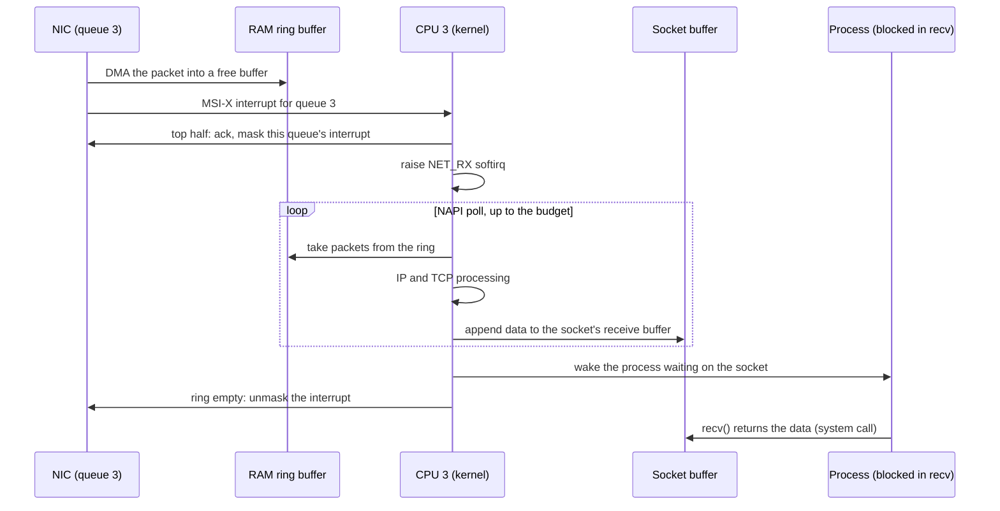

# Interrupts

> [!abstract] In one sentence
> An interrupt is the hardware's way of making a CPU (central processing unit) **stop what it's running, right after the current instruction, and jump into the kernel**: devices use it to say "something happened" (a key was pressed, a packet arrived, a disk read finished), the CPU uses it to report its own problems (a page fault, a division by zero), the timer uses it so the kernel gets control back from any program, and programs use a deliberate version of it to ask the kernel for something (a system call).

## Build-up: one CPU, one program, and the outside world

A CPU does one thing: fetch the next instruction, execute it, repeat. Say it's running a program stuck in a calculation loop:

```python
while True:
    total = total * 31 + 7
```

Meanwhile, the world outside the CPU keeps changing: a key is pressed, a network packet arrives on the NIC (network interface card), the SSD (solid-state drive) finishes reading a block, a clock ticks. None of that is in the instruction stream. How does the CPU ever find out?

### Stage 1: polling, asking again and again

The first way is for software to **poll**: check each device's status register in a loop. "Has a key been pressed? No. Has a packet arrived? No. Key? No…"

**The problems:**
- **Wasted work.** Almost every check answers "no". A CPU polling a keyboard spends billions of cycles a second to find a few key presses
- **Latency vs cost.** Polling less often saves CPU time but adds delay: check every 10 ms and an event waits up to 10 ms
- **The calculation loop never polls.** A program that doesn't check, doesn't notice. And the kernel can't check on the program's behalf, because while the program runs, the kernel isn't running at all

Polling isn't always wrong: under very heavy load, when there's *always* something waiting, it's the cheapest way (Stage 7 comes back to this). But as the general mechanism, something else is needed.

### Stage 2: the device taps the CPU (hardware interrupts)

The idea of an interrupt: let the **device** signal when it has something, and have the **CPU hardware** react to that signal between two instructions, whatever program is running.

```mermaid
flowchart LR
    DEV["Device<br/>(keyboard, NIC, NVMe disk)"] -- "interrupt request" --> CTRL["Interrupt controller<br/>(I/O APIC, or MSI message)"]
    CTRL -- "vector 0x41 to CPU 2" --> LAPIC["Local APIC<br/>of CPU 2"]
    LAPIC --> CPU["CPU 2<br/>finishes current instruction<br/>saves state, enters kernel mode"]
    CPU -- "looks up vector in the IDT" --> H["Kernel handler<br/>(ISR)"]
    H -- "iret: restore state" --> PROG["Interrupted program<br/>continues as if nothing happened"]
    classDef hw fill:#fff2cc,stroke:#bf9000,color:#1b1b1b
    classDef kern fill:#1f4e79,stroke:#0b2540,color:#ffffff
    classDef user fill:#e2efda,stroke:#548235,color:#1b1b1b
    class DEV,CTRL,LAPIC hw
    class CPU,H kern
    class PROG user
```



Step by step, on a modern x86 machine:
1. **The device raises an IRQ (interrupt request).** Older devices pull a dedicated line; an interrupt controller called the **I/O APIC** (input/output Advanced Programmable Interrupt Controller) turns that line into a message. PCIe (Peripheral Component Interconnect Express) devices skip the wire entirely and use **MSI (Message Signaled Interrupts)**: the device writes a small message to a special memory address, and that write *is* the interrupt. **MSI-X** lets one device have many separate interrupts (a NIC with one per queue, Stage 8)
2. **The interrupt is delivered to a CPU.** Each CPU core has a **local APIC** that receives interrupts and passes them to its core, along with a **vector**: a number from 0 to 255 saying which interrupt this is
3. **The CPU finishes the current instruction**, then checks for pending interrupts. If interrupts are enabled, it reacts. It never stops in the middle of an instruction
4. **It saves the minimum state** (the instruction pointer, flags, the stack pointer) and **switches to kernel mode** (next stage)
5. **It looks up the vector in the IDT (Interrupt Descriptor Table)**, a table the kernel filled at boot: entry 0x41 → "address of the NIC's handler". It jumps there
6. **The handler, or ISR (interrupt service routine), runs**: it talks to the device, acknowledges the interrupt so the device stops asserting it, and records what needs doing
7. **It returns with a special instruction (`iret`)** that restores the saved state. The program continues at the next instruction, unaware it was interrupted

The calculation loop never asked for any of this. Hardware forced the detour, which is exactly what polling couldn't do.

A CPU can **mask** (temporarily ignore) interrupts: the kernel does it for very short critical sections, and the interrupts wait until they're unmasked. One kind can't be masked, the **NMI (non-maskable interrupt)**, used for hardware errors and the watchdog (Stage 9).

### Stage 3: user mode and kernel mode

The handler runs code that touches devices and kernel memory. The interrupted program must never be allowed to do that itself, or any program could read every other program's memory or reprogram the disk. So the CPU has **privilege levels**: on x86 they're called **rings**, and two are used:

| | User mode (ring 3) | Kernel mode (ring 0) |
|---|---|---|
| Who runs there | Programs: shells, databases, browsers | The kernel: drivers, scheduler, memory management |
| Can touch device registers, page tables, the IDT | ❌ | ✅ |
| Can execute privileged instructions (masking interrupts, halting the CPU) | ❌, the attempt itself is an exception (Stage 5) | ✅ |
| How you get there | Started by the kernel, returned to after each interrupt | Only through an interrupt, an exception or a system call |

The important part is the last row: **the only doors into kernel mode are interrupts, exceptions and system calls**, and each one jumps to an address the kernel chose in advance (the IDT, or a register set at boot for system calls). A program can't jump into the middle of the kernel. That's what makes the separation between processes enforceable ([[Inter-process communication]] starts from that separation).

### Stage 4: the timer interrupt, how the kernel takes the CPU back

Back to the calculation loop. It never makes a system call and never waits for anything. If the kernel only ran when programs called it, this program would own the CPU for ever, and every other program on that core would freeze.

The fix is a device whose only job is to interrupt: the **timer**. Each CPU's local APIC has a timer the kernel programs to fire, for example every 4 ms (a kernel built with 250 ticks a second; 1000 is also common). On every tick:
- The timer handler runs in kernel mode
- It updates the time accounting of the running process ("this one has used its slice")
- If another process deserves the CPU, it sets a "need to reschedule" flag, and on the way back from the interrupt the kernel **switches to that other process** instead of returning to the loop

That's **preemption**: a program loses the CPU without its consent, because a hardware interrupt guaranteed the kernel a chance to decide. The choosing itself is the scheduler's job (*[[CPU scheduling]]*).

Modern kernels are **tickless** when they can: an idle CPU doesn't take timer interrupts it doesn't need (saving power, and avoiding waking the CPU up 250 times a second for nothing), and on specially configured cores running a single busy task, even the periodic tick can be turned off (`nohz_full`), for latency-sensitive workloads.

```bash
grep -E "LOC|CPU" /proc/interrupts | head -2
```

```text
            CPU0       CPU1       CPU2       CPU3
 LOC:   12873345   11928334   12002311   11873210   Local timer interrupts
```

### Stage 5: when the CPU itself has a problem (exceptions)

Interrupts from devices are **asynchronous**: they arrive at any moment, unrelated to the instruction being executed. The same mechanism (vector, IDT, kernel handler) is also used for **synchronous** events, caused **by** the current instruction. These are **exceptions**:

| Vector | Exception | Caused by | What the kernel usually does |
|---|---|---|---|
| 0 | Divide error | Integer division by zero | Sends `SIGFPE` to the process |
| 6 | Invalid opcode | Bytes that aren't a valid instruction, or a privileged one in user mode | Sends `SIGILL` |
| 13 | General protection | Breaking a protection rule (a privileged instruction, a malformed address) | Sends `SIGSEGV` |
| 14 | **Page fault** | Touching memory whose page isn't mapped right now, or not with that permission | **Usually fixes it silently**; otherwise `SIGSEGV` |
| 3 | Breakpoint | The `int3` instruction a debugger inserts | Stops the process for the debugger (`SIGTRAP`) |

The page fault is the most important one, and the one that happens all the time, harmlessly. With [[Virtual memory]], a program's addresses are translated to physical memory page by page, and many pages are deliberately **not there yet**: memory just allocated, a file not yet read in, a copy-on-write page after `fork()`, a page moved to swap. When the program touches one, the CPU raises a page fault; the kernel's handler finds the page is legitimate, loads or creates it, fixes the mapping, and **re-executes the same instruction**, which now succeeds. The program never notices, apart from the time it took.

Only when the address is genuinely invalid (a null pointer, memory already freed, writing to read-only code) does the kernel give up and convert the exception into a **signal**: `SIGSEGV`, "Segmentation fault", which kills the process unless it handles it ([[Signals]]). That's the path from a CPU exception to the message in a terminal:

```bash
$ ./crash
Segmentation fault (core dumped)
$ dmesg | tail -1
crash[5821]: segfault at 0 ip 0000561e2a8f1139 sp 00007ffc3d9a2e10 error 6 in crash[561e2a8f1000+1000]
```

`segfault at 0`: the address it touched (a null pointer). `error 6`: a write, from user mode, to a page that wasn't present.

### Stage 6: asking the kernel on purpose (system calls)

A program that wants to read a file, send a packet or create a process needs the kernel, and the only doors are the ones from Stage 3. So it opens one **deliberately**: a **system call** is a controlled trap into kernel mode, with a number saying which service is wanted (*[[System calls]]*).
- On old 32-bit Linux, programs used a software interrupt, `int 0x80`: literally an interrupt raised by an instruction, going through the IDT like a device's
- On x86-64, the dedicated **`syscall`** instruction does the same switch faster, jumping to an entry point the kernel registered at boot
- Some calls are so frequent and harmless that Linux avoids the trap altogether: the **vDSO** (virtual dynamic shared object) is a small piece of kernel code mapped into every process, so `clock_gettime()` reads the time in user mode without entering the kernel

```bash
strace -c -f curl -s https://example.com > /dev/null
```

```text
% time     seconds  usecs/call     calls    errors syscall
------ ----------- ----------- --------- --------- ----------------
 31.02    0.000412          13        31           mmap
 14.31    0.000190           9        21           read
 ...
```

Each line is a count of deliberate trips into kernel mode.

### Stage 7: the disk and the NIC don't copy data themselves into the program (DMA)

When a NIC receives a 1500-byte packet, who moves those bytes into memory? If the CPU had to copy every byte from the device (programmed I/O), a 10 Gb/s link would keep it busy just shovelling bytes.

Instead, devices use **DMA (direct memory access)**: the kernel gives the device addresses of free memory buffers in advance, and the device writes the data into RAM (random-access memory) **by itself**. The interrupt then doesn't carry data, it only says **"done, look in buffer 37"**. The same goes for disks: an NVMe (Non-Volatile Memory Express) drive DMAs the block into memory, then raises an interrupt on completion.

So the division of work is: **DMA moves the data, the interrupt announces it.**

### Stage 8: a busy network card (bottom halves, NAPI, many queues)

Now the server receives 500,000 packets a second. One interrupt per packet means 500,000 detours into the kernel a second, each with its saving and restoring of state, and while a hard interrupt handler runs, further interrupts on that CPU are held back. Three ideas make this work.

**1. Split the handler in two (top half, bottom half).** The hard interrupt handler (the **top half**) does the strict minimum: acknowledge the device and schedule the rest. The real work, the **bottom half**, runs a moment later with interrupts enabled:
- **Softirqs**: a fixed set of high-priority deferred jobs (`NET_RX`, `NET_TX`, `TIMER`, `BLOCK`, `RCU`…), run on the same CPU right after the hard interrupt returns
- **Tasklets**: smaller deferred jobs built on softirqs (older, being phased out)
- **Workqueues**: deferred work run by kernel threads, which can sleep (wait for something)
- **Threaded IRQs**: the handler itself runs as a kernel thread (`irq/27-eth0`), schedulable like any process; the default on real-time kernels

If softirq work keeps piling up, the kernel stops running it at every interrupt exit (that would starve programs) and hands it to a per-CPU kernel thread, **`ksoftirqd/N`**, scheduled like a normal process. Seeing `ksoftirqd/3` at the top of `top` means CPU 3 is drowning in deferred interrupt work.

**2. Switch to polling under load (NAPI).** Linux's network drivers use **NAPI** (the "New API" for network drivers, from the 2.6 era): the first packet raises an interrupt; the handler **disables further interrupts from that queue** and schedules a softirq that **polls** the ring buffer, taking up to a budget of packets at a time. While packets keep coming, it keeps polling without interrupts; when the queue is empty, it re-enables interrupts. That's Stage 1's polling coming back, exactly where it's cheapest: when there's always something waiting.

**3. Several queues, several CPUs (multi-queue, RSS).** A modern NIC has many receive queues, each with its own MSI-X interrupt. **RSS (Receive Side Scaling)** hashes each packet's addresses and ports so that one connection always lands on the same queue, and each queue's interrupt goes to a different CPU. Packet processing then scales across cores instead of piling onto one.

The full path of one packet:



From there, the data is in the socket's buffer and the program reads it through the socket API ([[Sockets]]).

**Interrupt coalescing** is the NIC-side version of the same trade-off: the card waits a few microseconds (or for a few packets) before interrupting, so one interrupt announces several packets. Less CPU spent per packet, a little more latency.

```bash
ethtool -c eth0 | grep -E "Adaptive|rx-usecs|rx-frames"
```

```text
Adaptive RX: on  TX: on
rx-usecs: 20
rx-frames: 0
```

Watching all of it:

```bash
grep -E "CPU|eth0" /proc/interrupts
```

```text
            CPU0       CPU1       CPU2       CPU3
  45:   18233412          0          0          0  IR-PCI-MSI 524289-edge      eth0-TxRx-0
  46:          0   17988021          0          0  IR-PCI-MSI 524290-edge      eth0-TxRx-1
  47:          0          0   18100554          0  IR-PCI-MSI 524291-edge      eth0-TxRx-2
  48:          0          0          0   17876330  IR-PCI-MSI 524292-edge      eth0-TxRx-3
```

Four queues, four interrupts (45 to 48), each landing on its own CPU: the healthy picture.

```bash
grep -E "CPU|NET_RX|NET_TX|TIMER" /proc/softirqs
```

```text
                    CPU0       CPU1       CPU2       CPU3
      TIMER:    3311208    3109823    3200117    3150022
     NET_TX:      22011      19870      21003      20554
     NET_RX:   91022331   89211004   90554210   88123977
```

**IRQ affinity**: which CPUs may receive a given interrupt is a per-IRQ setting (SMP (symmetric multiprocessing) affinity), and `irqbalance` is a daemon that spreads interrupts automatically:

```bash
cat /proc/irq/45/smp_affinity_list      # 0
echo 2 | sudo tee /proc/irq/45/smp_affinity_list    # move queue 0's interrupt to CPU 2
ethtool -l eth0                         # how many queues the NIC has, and how many are in use
```

```text
Channel parameters for eth0:
Pre-set maximums:
Combined:       8
Current hardware settings:
Combined:       4
```

### Stage 9: CPUs interrupting each other (IPIs and NMIs)

On a machine with many cores, the kernel on one CPU sometimes needs another CPU to do something **right now**. It sends an **IPI (inter-processor interrupt)** through the local APICs:
- **Rescheduling**: "a higher-priority task woke up for you, switch to it"
- **Function call**: "run this function on your core"
- **TLB shootdown**: when a process's memory mapping changes (memory freed, permissions changed), every CPU running that process may have the old translation cached in its **TLB (translation lookaside buffer)**, the CPU's cache of address translations ([[Virtual memory]]). The changing CPU sends IPIs so the others flush the stale entries. A program that maps and unmaps memory constantly across many threads generates storms of these

```bash
grep -E "RES|CAL|TLB|NMI" /proc/interrupts
```

```text
 NMI:         42         40         41         39   Non-maskable interrupts
 RES:     812331     790125     801224     799870   Rescheduling interrupts
 CAL:      55120      54988      56002      55431   Function call interrupts
 TLB:     110223     108877     109554     110010   TLB shootdowns
```

The **NMI** can't be masked, which makes it the tool for checking on a CPU that has masked everything else. The kernel's **hard lockup detector** uses a periodic NMI: if a CPU hasn't taken timer interrupts for several seconds (stuck in a loop with interrupts disabled), the NMI handler notices and reports it (`NMI watchdog: Watchdog detected hard LOCKUP on cpu 3`).

## Interrupts vs signals

The two are easy to blur because both "interrupt" something. They live at different levels:

| | Interrupt | Signal |
|---|---|---|
| From → to | Hardware (or the CPU, or another CPU) → **the kernel** | The kernel (on its own behalf or for another process) → **a process** |
| Handled by | A kernel handler found through the IDT | A handler function in the process, or the default action |
| Runs in | Kernel mode | User mode, inside the process |
| Delivered | Between two instructions, immediately | When the process next returns from the kernel to user mode |
| Examples | Packet arrived, timer tick, page fault, divide error | `SIGTERM`, `SIGKILL`, `SIGSEGV`, `SIGCHLD` |

They connect: a CPU exception (divide error) is an interrupt-level event that the kernel **turns into** a signal (`SIGFPE`) for the guilty process. The process-level side is in [[Signals]].

## Advanced problems

### 1. One CPU at 100 % softirq, the others idle
**Symptom:** a network-heavy server tops out far below its link speed; `mpstat -P ALL 1` shows one core saturated:

```text
CPU    %usr   %nice    %sys %iowait    %irq   %soft  %steal  %guest  %gnice   %idle
  0    2.01    0.00    3.02    0.00    1.51   93.46    0.00    0.00    0.00    0.00
  1    4.04    0.00    2.02    0.00    0.00    0.51    0.00    0.00    0.00   93.43
```

`top` shows the same in its summary line (`si` high) and `ksoftirqd/0` near the top. **Cause:** all receive processing happens on CPU 0: the NIC has a single queue (or only one is enabled), or every queue's interrupt is pinned to CPU 0 (no `irqbalance`, a bad manual affinity). **Fix:** enable more queues (`ethtool -L eth0 combined 8`), spread their interrupts across CPUs (`irqbalance`, or `smp_affinity_list` per IRQ). On a single-queue NIC, **RPS (Receive Packet Steering)** spreads the protocol processing across CPUs in software (`/sys/class/net/eth0/queues/rx-0/rps_cpus`).

### 2. Packets dropped before any program sees them
**Symptom:** clients see retransmissions; the application sees nothing wrong. `ethtool -S eth0 | grep -iE "drop|miss|no_buf"` shows growing counters (`rx_missed_errors`, `rx_no_buffer_count`), or the second column of `/proc/net/softnet_stat` grows. **Cause:** the NIC's ring buffer filled up because the kernel didn't drain it fast enough (one overloaded CPU, softirq budget exhausted, a burst). **Fix:** bigger rings (`ethtool -g eth0` to see, `ethtool -G eth0 rx 4096` to set), more queues and CPUs (problem 1), a larger NAPI budget (`net.core.netdev_budget`, `netdev_budget_usecs`) if the third column of `softnet_stat` (time squeezes) keeps rising.

### 3. Latency vs CPU: coalescing set wrong
**Symptom:** either high CPU usage in `%irq`/`%soft` with modest traffic, or request latencies with a floor of tens of microseconds that a low-latency service can't afford. **Cause:** interrupt coalescing too low (an interrupt for every packet) or too high (packets wait for the timer). **Fix:** adaptive coalescing (`ethtool -C eth0 adaptive-rx on`) for general servers; for latency-critical workloads, low `rx-usecs` plus dedicated cores, accepting the CPU cost.

### 4. Interrupt storm
**Symptom:** a CPU at 100 % in `%irq`, the system sluggish, and in `dmesg`: `irq 16: nobody cared (try booting with the "irqpoll" option)` followed by `Disabling IRQ #16`. **Cause:** a device (or a broken driver) keeps raising an interrupt that no handler acknowledges, so it fires again immediately, forever. Common with faulty hardware, a shared legacy interrupt line, or a driver bug. **Fix:** find the IRQ in `/proc/interrupts` (its counter grows by millions a second) and the device behind it; update or replace the driver, firmware or hardware. The kernel disabling the IRQ is a safety net, and the device behind it stops working.

### 5. Programs starved by deferred interrupt work
**Symptom:** under a packet flood, user processes on some CPUs barely run; `ksoftirqd/N` uses a whole core. **Cause:** softirq processing has taken over those CPUs. It's the kernel protecting itself (moving the work to `ksoftirqd` lets the scheduler balance it against programs), but the CPU is still spent. **Fix:** more queues and CPUs for network processing, filtering unwanted traffic earlier (on the NIC, or with XDP (eXpress Data Path), a hook that drops packets in the driver before the full network stack runs), and keeping latency-critical processes on CPUs that don't handle network interrupts.

### 6. Hard lockup reports
**Symptom:** `NMI watchdog: Watchdog detected hard LOCKUP on cpu N` in the logs, often followed by a panic. **Cause:** a CPU stopped taking interrupts for seconds: a kernel or driver bug spinning with interrupts disabled, or a hypervisor not scheduling the virtual CPU at all. **Fix:** the stack trace in the report points at the code; update the kernel or driver. On virtual machines, check the host first.

## In the cloud

- On AWS (Amazon Web Services) EC2 (Elastic Compute Cloud), network interfaces use **ENA (Elastic Network Adapter)**, a multi-queue NIC with MSI-X: each queue has its own interrupt, as in Stage 8. The **number of queues depends on the instance type** and grows with its vCPUs (virtual CPUs), so a 2-vCPU instance can't spread receive processing the way a 32-vCPU one can. `ethtool -l eth0` shows what the instance got
- ENA's `ethtool -S` counters include limits AWS enforces on the instance, not the NIC: `bw_in_allowance_exceeded`, `pps_allowance_exceeded` (packets per second), `conntrack_allowance_exceeded`. Drops counted there are the instance's network allowance, not an interrupt problem
- **Steal time** (`st` in `top`, `%steal` in `mpstat`) is not an interrupt: it's time the hypervisor gave the physical CPU to another virtual machine while this one wanted to run. High steal on a burstable instance usually means its CPU credits ran out
- Inside a virtual machine, devices are virtual (or passed through), timers are virtualized, and an interrupt may be delayed if the host hasn't scheduled the vCPU. The kernel side, `/proc/interrupts`, softirqs and affinity, works the same

## Practice

> [!example]- A program runs `while True: pass` and never makes a system call. How does the kernel ever run another process on that CPU?
> The local APIC timer raises an interrupt every few milliseconds whatever the program does. The handler updates its time accounting and, when its slice is used up, the kernel switches to another process on the way out of the interrupt (preemption).

> [!example]- A program reads a large file it just mapped into memory, and `perf` shows thousands of page faults, yet nothing crashes. Why?
> Page faults are normal: each first touch of a not-yet-loaded page faults, the kernel reads the page in, fixes the mapping and re-runs the instruction. Only a fault on an invalid address becomes `SIGSEGV`.

> [!example]- What's the difference between the interrupt that announces a received packet and the data of that packet?
> The data was already written into RAM by the NIC with DMA. The interrupt only says "new packets are in the ring buffer".

> [!example]- `top` shows `si` at 25 % overall on a 4-CPU server, and `ksoftirqd/0` is busy. What do I check next?
> `mpstat -P ALL 1` (probably CPU 0 at ~100 % soft, the others idle), then `/proc/interrupts` for the NIC's queues and `ethtool -l` for how many are enabled. Fix: more queues, interrupts spread across CPUs, or RPS on a single-queue NIC.

> [!example]- Why does NAPI turn interrupts off under load, if interrupts were invented to avoid polling?
> Under heavy load there's always a packet waiting, so polling never wastes a check, while one interrupt per packet would cost a detour each. NAPI polls while busy and goes back to interrupts when idle: each mechanism where it's cheapest.

> [!example]- `dmesg` says `irq 16: nobody cared` then `Disabling IRQ #16`. What happened, and what stopped working?
> Something kept raising IRQ 16 without any handler acknowledging it (an interrupt storm). The kernel disabled that line to protect itself, so whatever device uses IRQ 16 no longer gets interrupts.

## Easy to get wrong

- An interrupt goes from hardware **to the kernel**; a signal goes from the kernel **to a process**. `kill` doesn't send an interrupt
- Interrupts don't carry the data: DMA puts it in memory, the interrupt only announces it
- Page faults are mostly normal and silent; only invalid accesses become segmentation faults
- The CPU always finishes the current instruction before taking an interrupt
- System calls enter the kernel through a deliberate trap, the same kind of door as interrupts and exceptions; a program can't jump into kernel code any other way
- The hard interrupt handler does almost nothing: most network work happens later in softirqs, visible as `si`/`%soft`, not `hi`/`%irq`
- `ksoftirqd` using CPU is a symptom (too much deferred interrupt work), not a misbehaving program to kill
- More bandwidth needs more **queues spread over CPUs**, not just a faster NIC
- Steal time is the hypervisor taking the CPU away, not interrupt overhead

## Related
- Turns into, for processes:: [[Signals]] (exceptions become SIGSEGV, SIGFPE, SIGILL)
- Page faults and the TLB:: [[Virtual memory]]
- Why processes are isolated:: [[Inter-process communication]]
- What gets scheduled after the timer interrupt:: *[[CPU scheduling]]*
- The deliberate trap:: *[[System calls]]*
- The NIC side:: [[Network interfaces]], and where received data ends up:: [[Sockets]]
- Area:: [[Operating systems]]

## Flashcards
#flashcards

What is an interrupt? :: A hardware mechanism that makes a CPU stop after the current instruction, save its state, enter kernel mode and run a kernel handler
Polling vs interrupts? :: Polling: software checks devices repeatedly (wasteful when idle). Interrupts: the device signals when something happens
What is an IRQ? :: An interrupt request: a device's signal that it needs attention
What is MSI / MSI-X? :: Message Signaled Interrupts: a PCIe device raises an interrupt by writing a message to a special address; MSI-X allows many separate interrupts per device
What is the IDT? :: The Interrupt Descriptor Table: the kernel's table mapping each interrupt vector to its handler address
What does the CPU do when it takes an interrupt? :: Finishes the current instruction, saves the instruction pointer/flags/stack, switches to kernel mode, jumps to the handler via the IDT, later returns with iret
User mode vs kernel mode? :: User mode (ring 3) can't touch devices, page tables or privileged instructions; kernel mode (ring 0) can. Entry to kernel mode is only via interrupts, exceptions and system calls
How does the kernel regain the CPU from a program in an infinite loop? :: The timer interrupt fires periodically; the kernel can then preempt the program and run another
What does tickless mean? :: The kernel stops periodic timer interrupts on idle CPUs (and optionally on dedicated busy CPUs with nohz_full)
Interrupt vs exception? :: Interrupts are asynchronous (from devices/timers); exceptions are synchronous, caused by the current instruction (page fault, divide error)
Which signals do divide error, invalid opcode and invalid memory access become? :: SIGFPE, SIGILL, SIGSEGV
What happens on a normal page fault? :: The kernel loads or creates the missing page, fixes the mapping and re-executes the instruction; the program doesn't notice
How does a 64-bit Linux program make a system call? :: With the syscall instruction (older 32-bit code used the software interrupt int 0x80)
What is the vDSO? :: Kernel code mapped into every process so calls like clock_gettime run without entering the kernel
What is DMA? :: Direct memory access: a device writes data into RAM itself; the interrupt only announces completion
Top half vs bottom half? :: Top half: the short hard interrupt handler (ack, schedule work). Bottom half: deferred work with interrupts enabled (softirqs, tasklets, workqueues, threaded IRQs)
What is a softirq? :: A deferred, high-priority kernel job (NET_RX, NET_TX, TIMER, BLOCK...) run after hard interrupts on the same CPU
What does ksoftirqd do? :: Per-CPU kernel thread that runs softirq work when there's too much to do at interrupt exit
What is NAPI? :: Linux network drivers' hybrid: interrupt on the first packet, then poll the ring with interrupts off while busy, re-enable when empty
What is interrupt coalescing? :: The NIC delays interrupts to announce several packets at once: less CPU, more latency
What is RSS? :: Receive Side Scaling: the NIC hashes flows across several receive queues, each with its own interrupt and CPU
What is RPS? :: Receive Packet Steering: software spreading of packet processing across CPUs, for NICs with few queues
How do you see which CPU handles which interrupt? :: /proc/interrupts (counts per CPU), /proc/irq/N/smp_affinity_list (allowed CPUs), irqbalance spreads them
Where do you see interrupt CPU time in top and mpstat? :: hi / %irq for hard interrupts, si / %soft for softirqs
What is an IPI? :: An inter-processor interrupt: one CPU interrupting another (rescheduling, function calls, TLB shootdowns)
What is a TLB shootdown? :: IPIs telling other CPUs to flush stale address translations after a memory mapping changed
What is an NMI used for? :: Non-maskable interrupt: hardware errors and the hard-lockup watchdog
One CPU at 100 % si while others idle: likely cause? :: All NIC receive interrupts/queues on that CPU; enable more queues and spread their affinity
Where do packet drops before the kernel show up? :: ethtool -S counters (rx_missed_errors, no buffer) and /proc/net/softnet_stat
What does "irq N: nobody cared" mean? :: An interrupt storm: an IRQ fires repeatedly with no handler acknowledging it; the kernel disables it
What is steal time? :: Time the hypervisor ran another VM while this vCPU wanted the CPU; not interrupt time
