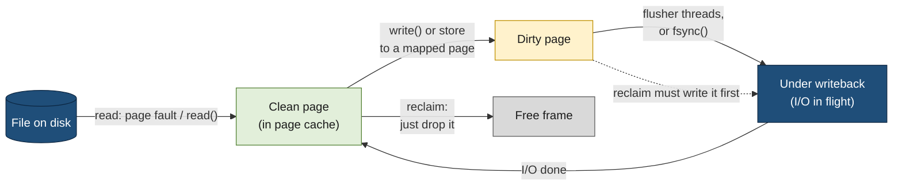

# Memory pages

> [!abstract] In one sentence
> The kernel manages memory in fixed-size **pages** (4 KiB on most machines): each one is either **anonymous** or **file-backed** , and either **clean** or **dirty**. Those two properties decide what the kernel can do with a page when it needs room: drop it, write it back, or swap it out. That's why a write is fast but not durable, why a backup can evict a database's hot data, and why databases care about page size and huge pages.
> 
> **anonymous** : a process's own data, which can only leave RAM through swap
> **file-backed**: a copy of part of a file in the page cache


[[Virtual memory]] explains *why* memory is split into pages: address spaces, page tables, the MMU (memory management unit) and TLB (translation lookaside buffer), page faults, overcommit and the OOM (out of memory) killer. This note follows **one page** through its life: what the hardware records about it, what kind of page it is, how it gets dirty, written back and reclaimed, and what changes when a program has its own idea of what a page is.

## Build-up: a small storage engine and its pages

A small program, `pagestore`, keeps key-value records in one data file, `store.dat`. Like real databases, it organizes the file in its own **8 KiB (kibibyte, 1,024 bytes) pages**: page 0 holds the header, page 1 onward hold records, and it reads, changes and writes whole pages. It runs on a Linux machine with 16 GiB (gibibytes) of RAM  and a local NVMe (Non-Volatile Memory Express) SSD. The questions it runs into are the subject of this note:
- How big is a page for the kernel, and is it the same as my 8 KiB page?
- When `write()` returns, where is my data?
- Why does my data disappear from memory after someone runs a backup?
- What if the machine crashes in the middle of writing one of my pages?

### Stage 1: how big is a page?

```bash
getconf PAGESIZE
```

```text
4096
```

On x86-64 and most ARM (Advanced RISC (reduced instruction set computer) Machines) servers it's **4 KiB**. Some ARM systems use **16 KiB** (Apple silicon running Linux) or **64 KiB** (some enterprise distributions on ARM servers). Software that hard-codes 4096 breaks there, so programs ask the system (`sysconf(_SC_PAGESIZE)` in C, `mmap.PAGESIZE` in Python).

The page is the **unit** for everything the memory system does:
- Mappings start and end on page boundaries: `mmap()` offsets must be multiples of the page size, and a 1-byte mapping still uses a whole page
- Permissions (read, write, execute) are per page, not per byte
- The kernel tracks, swaps, writes back and reclaims memory page by page
- Physical RAM is divided into **page frames** of the same size; a page of a process lives in one frame at a time

Larger pages exist too: on x86-64, **2 MiB** (mebibytes) and **1 GiB** "huge pages" (Stage 7).

### Stage 2: what the hardware records about each page

Each entry in a page table, the **PTE (page table entry)**, is 8 bytes on x86-64. Besides the frame number, it holds bits that the MMU checks on every access, and two that it **sets on its own**:

| Bit | Set by | Meaning | What the kernel uses it for |
|---|---|---|---|
| Present | Kernel | The page is in a frame right now | Not set → any access is a page fault |
| Read/Write | Kernel | Writes allowed | Read-only code, and copy-on-write: write-protect, then copy on the fault |
| User/Supervisor | Kernel | Reachable from user mode | Kernel pages are mapped in every process but unreachable from it |
| No-execute (NX) | Kernel | Instructions can't be run from it | Stacks and heaps aren't executable, which blocks a whole class of exploits |
| **Accessed** | **The CPU (central processing unit)**, on any access | The page was used since the kernel last cleared the bit | **Aging**: which pages are in use, which are cold (Stage 5) |
| **Dirty** | **The CPU**, on a write | The page was modified | Which pages of a mapped file must be written back before the frame is reused (Stage 4) |
| Page size | Kernel | This entry maps a huge page directly | 2 MiB / 1 GiB pages (Stage 7) |
| Frame number | Kernel | Which physical frame | The translation itself |

The kernel never asks the hardware "is this page still used?". It **clears** the accessed bit, waits, and looks again: if the bit came back, something touched the page.

**On the frame side**, the kernel keeps a small descriptor, a `struct page` (64 bytes), for every 4 KiB frame of RAM: who uses it, how many mappings point to it, which list it's on, whether it's dirty or under writeback. That's about 1.6 % of RAM spent on bookkeeping, 256 MiB on a 16 GiB machine. Frames are grouped:
- **Zones**, by physical address: `DMA` and `DMA32` for old devices that can only reach low addresses with DMA (direct memory access, a device writing into RAM by itself), `Normal` for the rest
- **NUMA (non-uniform memory access) nodes** on multi-socket servers: each CPU socket has its own RAM, and reaching the other socket's RAM is slower. The kernel prefers frames on the node where the process runs

```bash
numactl --hardware
```

```text
available: 2 nodes (0-1)
node 0 cpus: 0-15 32-47
node 0 size: 128797 MB
node 0 free: 3121 MB
node 1 cpus: 16-31 48-63
node 1 size: 129019 MB
node 1 free: 61770 MB
node distances:
node   0   1
  0:  10  21
  1:  21  10
```

(Node 0 is nearly full while node 1 is mostly free: a process pinned to node 0 may reclaim or swap even though the machine has 60 GB free. `numastat -p <pid>` shows where a process's pages are.)

Free frames are handed out by the **buddy allocator**, which keeps free blocks of 1, 2, 4, … 1024 contiguous frames and splits or merges them. `/proc/buddyinfo` shows how many blocks of each size are free; when the large ones run out, memory is **fragmented**, and getting a huge page means moving pages around first (compaction):

```text
Node 0, zone   Normal  41203  18842   6410   1022    213     41     6      1      0      0      0
```

(Columns: free blocks of 1, 2, 4 … 1024 frames. No free block of 512 frames, so no free 2 MiB page without compaction.)

### Stage 3: two kinds of pages, two states

Every page a process uses is one of two kinds:

| | **Anonymous** | **File-backed** |
|---|---|---|
| What | Memory with no file behind it: heap (`malloc`), stack, anonymous `mmap`, copy-on-write copies | A piece of a file, cached in RAM: the **page cache**. Read with `read()` or mapped with `mmap()`, including program code and libraries |
| Where its data "lives" | Only in RAM (or swap) | In the file on disk; RAM holds a copy |
| Clean means | Never written since it was zero-filled or swapped in | Same as on disk |
| Dirty means | Written (the usual case for heap data) | Modified in RAM, not yet written to the file |
| To free its frame | **Write it to swap** (no swap → impossible; it stays until the process frees it or is killed) | Clean: **just drop it**, re-read later. Dirty: **write it back** to the file first, then drop it |

That table is the whole logic of memory pressure. Clean file pages are the cheapest memory the kernel has: it can take them back instantly. Anonymous pages are the most expensive: without swap, they can't move at all.

`/proc/meminfo` counts pages by these categories:

```bash
grep -E '^(MemFree|Cached|Dirty|Writeback|AnonPages|Mapped|Shmem|Active|Inactive|Mlocked|PageTables|HugePages_Total|HugePages_Free)' /proc/meminfo
```

```text
MemFree:          402116 kB
Cached:          9804532 kB     ← file pages (page cache), includes Shmem
Dirty:             18240 kB     ← file pages modified, waiting to be written
Writeback:             0 kB     ← being written to disk right now
AnonPages:       4212908 kB     ← anonymous pages mapped by processes
Mapped:           982144 kB     ← file pages currently mapped into some process
Shmem:            262144 kB     ← shared memory and tmpfs (/dev/shm)
Active:          7124568 kB
Inactive:        6820108 kB
Active(anon):    2908112 kB
Inactive(anon):  1566940 kB
Active(file):    4216456 kB
Inactive(file):  5253168 kB
Mlocked:               0 kB
PageTables:        61224 kB     ← memory used by page tables themselves
HugePages_Total:       0
HugePages_Free:        0
```

### Stage 4: the life of a file page (read, dirty, writeback, fsync)

**Reading.** `pagestore` starts and reads page 3 of its file (bytes 24576 to 32767). The kernel looks in the page cache; on a miss it allocates two frames (8 KiB = two 4 KiB pages), asks the drive to fill them (DMA, then an interrupt when done, see [[Interrupts]]), keeps them in the page cache, and copies the bytes into the program's buffer. The next read of the same bytes, by any process, comes from RAM. The path through the block layer is in [[Storage devices]].

```bash
fincore store.dat                 # which part of a file is in the page cache (util-linux)
```

```text
  RES  PAGES  SIZE FILE
 1.2G 314572  4.0G store.dat
```

1.2 GiB of the 4 GiB file is cached (`vmtouch -v store.dat` shows the same, page by page).

**Writing.** `pagestore` changes a record and writes the 8 KiB page back with `pwrite()`. The kernel copies the bytes into the cached pages, marks them **dirty**, and returns. **Nothing has gone to disk yet.** This is why `write()` is fast, and why a power cut a second later loses the change.

A program writing 2 GiB shows the dirty pages piling up and draining:

```python
# dirty.py: write 2 GiB, watch Dirty and Writeback, then fsync
import os, time

def meminfo():
    vals = {}
    for line in open("/proc/meminfo"):
        k, v = line.split(":")
        if k in ("Dirty", "Writeback"):
            vals[k] = int(v.split()[0]) // 1024
    return f"Dirty={vals['Dirty']:>5} MiB  Writeback={vals['Writeback']:>4} MiB"

fd = os.open("/var/tmp/big.dat", os.O_WRONLY | os.O_CREAT | os.O_TRUNC, 0o644)
chunk = b"x" * (1 << 20)
start = time.time()
for _ in range(2048):
    os.write(fd, chunk)
print(f"write() returned after {time.time() - start:.1f}s  {meminfo()}")
time.sleep(5)
print(f"5 s later                    {meminfo()}")
start = time.time()
os.fsync(fd)
print(f"fsync() took {time.time() - start:.1f}s           {meminfo()}")
```

```text
write() returned after 1.3s  Dirty= 1544 MiB  Writeback=  96 MiB
5 s later                    Dirty=  402 MiB  Writeback= 118 MiB
fsync() took 0.6s           Dirty=    1 MiB  Writeback=   0 MiB
```

**Writeback.** Kernel **flusher threads** (shown as `kworker/u…:flush-259:0`) write dirty pages to disk in the background, driven by four settings:

| Setting | Default | Meaning |
|---|---|---|
| `vm.dirty_background_ratio` | 10 (% of available memory) | Above this, flusher threads start writing in the background |
| `vm.dirty_ratio` | 20 | Above this, **the writing process itself is throttled**: its `write()` calls block until enough is written |
| `vm.dirty_expire_centisecs` | 3000 (30 s) | A page dirty for longer than this gets written at the next pass |
| `vm.dirty_writeback_centisecs` | 500 (5 s) | How often the flusher threads wake up |

(`dirty_background_bytes` and `dirty_bytes` set the same thresholds in bytes, better on machines with lots of RAM, where 20 % can mean tens of GiB waiting to be written.)

**fsync.** `fsync(fd)` writes the file's dirty pages **now**, waits for them, and asks the drive to flush its own cache. Only then is the data durable. Databases call it on every commit for their log; how the filesystem keeps its own structures consistent around it is in [[Journaling]].



### Stage 5: getting frames back (reclaim)

RAM fills up: page cache grows into everything free (that's intended), processes allocate. When a new frame is needed and few are free, the kernel **reclaims** pages: it chooses some and frees their frames. Which ones?

**The LRU (least recently used) lists.** The kernel keeps file and anonymous pages on separate lists, each split into **active** (recently used) and **inactive** (candidates for eviction):
1. A newly read page starts on the **inactive** list
2. If it's accessed again (the accessed bit from Stage 2), it's **promoted** to the active list
3. When the inactive list gets short, pages at the tail of the active list are **demoted**, with their accessed bit cleared
4. Reclaim takes pages from the tail of the inactive lists: a clean file page is dropped, a dirty one is queued for writeback, an anonymous one goes to swap (if there is swap)

A page read **once** never leaves the inactive list, so a single big sequential read shouldn't push out the pages used all the time. Recent kernels can replace the two lists with **MGLRU (multi-generational LRU)**, which ages pages more precisely; the principle is the same.

**Who does the work.** Each zone has three watermarks of free frames: `min`, `low`, `high` (`/proc/zoneinfo`):
- Below `low`, the **kswapd** kernel thread wakes up and reclaims in the background until `high` is reached. Processes don't notice
- Below `min`, a process that needs a frame does **direct reclaim** itself: its allocation waits while it scans and frees pages. That's when latency appears in applications that never touched the disk

**Anonymous or file?** `vm.swappiness` (0–200, default 60) sets the balance: low values protect anonymous memory and evict page cache first; high values swap anonymous pages more readily. With no swap, only file pages can be reclaimed, however cold the anonymous ones are.

```bash
sar -B 1
```

```text
         pgpgin/s pgpgout/s   fault/s  majflt/s  pgfree/s pgscank/s pgscand/s pgsteal/s    %vmeff
10:02:11  48210.0   9120.0   21004.0     380.0  61340.0  52110.0   18806.0   41220.0     58.12
10:02:12  51022.0   8840.0   19870.0     412.0  63004.0  50980.0   21340.0   42870.0     59.28
```

`pgscank/s` is pages scanned by kswapd, `pgscand/s` pages scanned in **direct** reclaim (non-zero means processes are stalling for memory), `pgsteal/s` pages actually reclaimed, `%vmeff` the share of scanned pages that could be reclaimed. Low `%vmeff` and high direct scanning: the kernel is struggling to find anything to free.

### Stage 6: the program's page is not the kernel's page

`pagestore`'s 8 KiB page is **two** kernel pages. Below the kernel, the filesystem has its own **block** size (4 KiB on ext4 and XFS by default), and the drive its **sector** size (512 bytes or 4 KiB). Four sizes, four layers:

| Layer | Unit | Typical size |
|---|---|---|
| The application (`pagestore`, a database) | Its page | 8 KiB (PostgreSQL), 16 KiB (MySQL InnoDB) |
| The kernel's memory | Page | 4 KiB |
| The filesystem | Block | 4 KiB |
| The drive | Sector (the atomic write unit) | 512 B or 4 KiB |

**Torn pages.** `pagestore` writes its 8 KiB page with one `pwrite()`. The kernel writes it back as two 4 KiB pages, possibly at different times, and the drive guarantees only that each **sector** is written whole. If the power fails in between, the page on disk is half new, half old: a **torn page**. The record checksum doesn't match, and neither the old nor the new version can be recovered from the file alone.

Databases deal with it in one of two ways:
- **Log a full image of the page** the first time it's modified after a checkpoint, in the write-ahead log (WAL, [[Journaling]]). After a crash, recovery overwrites the torn page with the full image, then replays later changes on top. PostgreSQL does this (`full_page_writes`), see [[PostgreSQL architecture]]
- **Write every page twice**: first to a separate "doublewrite" area, fsync, then to its real place. If the real write tears, the copy is intact. MySQL InnoDB does this

Both cost extra writes. Filesystems or drives that guarantee atomic 8 KiB or 16 KiB writes let databases turn them off.

**Double buffering.** `pagestore` also keeps its own cache of hot pages in memory (a "buffer pool"): it knows better than the kernel which pages matter. But each page it reads also stays in the kernel's page cache, so hot data is in RAM **twice**. The options:
- **Bypass the page cache** with `O_DIRECT`: reads and writes go between the program's buffer and the drive with DMA, nothing cached by the kernel. The buffers, offsets and sizes must be aligned to the block size. The program then owns all caching and read-ahead (MySQL InnoDB's usual setting)
- **Keep a moderate buffer pool and lean on the page cache** for the rest (PostgreSQL's traditional design: `shared_buffers` around a quarter of RAM, the rest left to the kernel)

```python
# direct.py: read one 8 KiB page with O_DIRECT (buffer must be aligned)
import mmap, os
fd = os.open("store.dat", os.O_RDONLY | os.O_DIRECT)
buf = mmap.mmap(-1, 8192)            # anonymous mapping: page-aligned by construction
os.preadv(fd, [buf], 3 * 8192)       # page 3, straight from the drive
```

**Hints instead of bypassing.** A program can tell the kernel how it will use memory or a file, without taking over caching:

| Call | Effect |
|---|---|
| `posix_fadvise(fd, off, len, POSIX_FADV_SEQUENTIAL)` | Read ahead more aggressively |
| `posix_fadvise(..., POSIX_FADV_DONTNEED)` | Drop these file pages from the cache (once clean): what a backup should do after reading |
| `posix_fadvise(..., POSIX_FADV_WILLNEED)` | Start reading these pages into the cache now |
| `madvise(addr, len, MADV_DONTNEED)` | Give these anonymous pages back now (they read as zeros next time) |
| `madvise(..., MADV_SEQUENTIAL / MADV_RANDOM)` | Read-ahead behaviour for a mapped file |
| `madvise(..., MADV_HUGEPAGE)` | Use transparent huge pages for this area |

### Stage 7: many processes, one big shared region

Now `pagestore` grows into a server with one **process per client**, all sharing one 8 GiB buffer pool through shared memory ([[Inter-process communication]]), the way PostgreSQL does.

**Where the pages are counted.** Shared memory pages are file-backed in a memory-only filesystem (tmpfs, `/dev/shm`): they show up as `Shmem` in `/proc/meminfo` and **inside** `Cached` and `free`'s "buff/cache". But unlike real page cache they **can't be dropped**: they have no file on disk, so the only way out of RAM is swap. A dashboard that treats all of "cache" as reclaimable overestimates free memory by the size of the shared region.

**Page tables multiply.** Every process that touches the whole 8 GiB region needs its own page table entries for it: 8 GiB ÷ 4 KiB = 2,097,152 entries × 8 bytes = **16 MiB of page tables per process**. With 300 client processes, that's **4.7 GiB of RAM spent on page tables**, all pointing at the same frames:

```text
PageTables:      4912380 kB
```

**Huge pages fix it.** With 2 MiB pages, the same region needs 4,096 entries per process, 32 KiB instead of 16 MiB, and each TLB entry covers 512 times more memory. Two ways to get them:

| | Explicit huge pages (HugeTLB) | THP (transparent huge pages) |
|---|---|---|
| How | Reserved in advance: `vm.nr_hugepages = 4200`; the program asks for them (`MAP_HUGETLB`, `SHM_HUGETLB`, hugetlbfs) | The kernel uses 2 MiB pages automatically when an area is big and aligned; `khugepaged` merges small pages later |
| Guarantee | Reserved frames, can't be fragmented away, never swapped | Best effort; may need compaction (latency) |
| Cost | Reserved memory is unavailable to anything else, even when unused | Latency spikes from compaction, memory bloat |
| Typical users | Databases' shared buffers, virtual machines, DPDK (Data Plane Development Kit) | General workloads; often `madvise` mode so only programs that ask get them |

```text
HugePages_Total:    4200
HugePages_Free:      148
HugePages_Rsvd:       90
Hugepagesize:       2048 kB
```

(4,200 × 2 MiB = 8.2 GiB reserved; 148 free; 90 reserved by a mapping but not yet touched.)

**Locking pages in RAM.** `mlock()` / `mlockall()` pin pages so they're never swapped or reclaimed: for secret keys that must never reach a swap device (GPG (GNU Privacy Guard), password managers), and for real-time programs that can't afford a page fault. The amount is limited by `ulimit -l` (`RLIMIT_MEMLOCK`) and shows as `Mlocked` / `Unevictable`. Locked pages shrink what reclaim can work with, so a program locking too much pushes everyone else into reclaim.

**Two space savers worth knowing:**
- **The zero page.** Reading anonymous memory that was never written maps one shared, read-only page full of zeros. Only the first **write** allocates a real frame
- **KSM (kernel samepage merging).** A kernel thread scans memory areas marked `MADV_MERGEABLE` and merges identical pages into one copy-on-write page. Used by hypervisors running many similar virtual machines

### What `/proc/<pid>/smaps` says about each area

For one process, `smaps` breaks every mapping down by these categories. The buffer pool of one `pagestore` server process:

```text
7f3c00000000-7f3e00000000 rw-s 00000000 00:01 2056        /dev/shm/pagestore.buf (deleted)
Size:            8388608 kB
Rss:             1203200 kB
Pss:               40106 kB
Shared_Clean:      12288 kB
Shared_Dirty:    1190912 kB
Private_Clean:         0 kB
Private_Dirty:         0 kB
Referenced:       988160 kB
Anonymous:             0 kB
AnonHugePages:         0 kB
ShmemPmdMapped:        0 kB
Swap:                  0 kB
Locked:                0 kB
VmFlags: rd wr sh mr mw me ms sd
```

- `Size` 8 GiB of address space, `Rss` 1.2 GiB of it touched by this process
- `Shared_Dirty`: pages written by someone and mapped by several processes. Here "dirty" means modified since creation; for shared memory it doesn't mean "waiting for writeback", since there's no file
- `Pss` 40 MiB: this process's fair share, since about 30 processes map the same pages ([[Virtual memory]] covers VSZ, RSS, PSS and USS)
- `Referenced`: pages whose accessed bit is set, the working set right now
- `ShmemPmdMapped`: the part mapped with huge pages (0 here: a candidate for huge pages)

## Advanced problems

### 1. Write latency spikes every few seconds
**Symptom:** a service that writes logs or files has periodic multi-second stalls; `Dirty` in `/proc/meminfo` climbs to several GiB, then drops. **Cause:** dirty pages hit `vm.dirty_ratio` and the writing processes are throttled until writeback catches up; on large-RAM machines 20 % is a huge backlog for one disk. **Fix:** lower thresholds in bytes (`vm.dirty_background_bytes` 256 MiB, `vm.dirty_bytes` 1 GiB, for example) so writeback starts early and stays smooth; put heavy writers on their own volume.

### 2. fsync takes seconds and blocks unrelated work
**Symptom:** a database commit occasionally takes seconds; at the same moment the disk shows a burst of writes. **Cause:** a large amount of dirty data (a bulk load, a checkpoint) is flushed at once, and the commit's `fsync` waits behind it, sometimes through a filesystem journal commit that bundles everyone's metadata ([[Journaling]]). **Fix:** spread writes over time (database checkpoint settings that pace writes), lower dirty thresholds, separate the log onto its own device.

### 3. The application slows down after the nightly backup
**Symptom:** every morning, the first queries are slow and the disk is busy, then it recovers. **Cause:** the backup read a large file sequentially; its pages filled the page cache and pushed the application's hot file pages out (especially those touched only once since the last reclaim cycle). **Fix:** the backup tool drops its own pages with `posix_fadvise(POSIX_FADV_DONTNEED)` or uses `O_DIRECT` (many tools have a flag for it); run it in a cgroup with a memory limit, which caps its page cache too; warm the cache after.

### 4. Swapping while gigabytes of cache are "free"
**Symptom:** `si`/`so` in `vmstat` non-zero and latency up, although `free` shows lots of `buff/cache`. **Cause:** part of that "cache" is `Shmem` (unreclaimable without swap), or `swappiness` lets the kernel swap cold anonymous pages rather than drop hot file pages, or one NUMA node is full while the other is free. **Fix:** check `Shmem` and `numastat`; lower `vm.swappiness` for a database server; size shared memory so it fits; consider memory policy (`numactl --interleave`) for processes larger than one node.

### 5. Corrupted pages after a power failure
**Symptom:** after a crash, the storage engine reports checksum failures on a few pages. **Cause:** torn writes: an 8 KiB application page written as two 4 KiB pages, only one of which reached the drive, with no full page image or doublewrite to repair it (disabled "for performance"). **Fix:** keep full page writes or doublewrite on unless the stack guarantees atomic writes of the application's page size; enable page checksums so the damage is detected rather than silently read.

### 6. Gigabytes of RAM in page tables
**Symptom:** `PageTables` in `/proc/meminfo` is several GiB; the machine runs out of memory with fewer connections than expected. **Cause:** hundreds of processes each mapping a large shared region with 4 KiB pages: one set of page table entries per process. **Fix:** explicit huge pages for the shared region (`vm.nr_hugepages` sized to it, and the program configured to use them), fewer processes (a connection pooler in front of a process-per-connection server).

### 7. "Free memory is low", so someone schedules `drop_caches`
**Symptom:** a cron job runs `sync; echo 3 > /proc/sys/vm/drop_caches` every hour "to free memory", and every hour performance drops. **Cause:** the page cache was doing its job; dropping it forces every hot file page to be read from disk again, and the `sync` before it causes a write burst. **Fix:** remove the job. Watch `MemAvailable` (and swap activity, direct reclaim in `sar -B`), not `MemFree`. `drop_caches` is a tool for benchmarks ("measure with a cold cache"), not for production.

## In the cloud

- EC2 (Elastic Compute Cloud) instances have **no swap** by default: anonymous pages can't be evicted, so when they fill RAM, the OOM killer acts
- On network block storage (EBS (Elastic Block Store)), every page cache miss and every `fsync` crosses the network: page cache hit rates and the dirty page settings matter more than on a local NVMe drive, and IOPS (input/output operations per second) limits make write bursts (problem 1) hit a ceiling
- Managed databases (RDS (Relational Database Service)) set huge pages and shared memory for the instance size; on self-managed EC2 databases that's my job

## Practice

> [!example]- A machine has `Cached: 10 GiB`, of which `Shmem: 6 GiB`, `Dirty: 1 GiB`. Roughly how much can the kernel free instantly without writing anything?
> About 3 GiB: Shmem can't be dropped (only swapped), dirty pages must be written back first. Only clean, unlocked file pages are free to drop.

> [!example]- A program calls `write()` with 1 MiB and it returns. The machine loses power one second later. Is the data on disk?
> Probably not. `write()` only dirtied pages in the page cache; flusher threads write them within about 5 to 30 seconds, or immediately on `fsync()`.

> [!example]- 200 processes each map a 16 GiB shared region and touch all of it, with 4 KiB pages. How much RAM do their page tables take? And with 2 MiB pages?
> 16 GiB / 4 KiB = 4,194,304 entries × 8 B = 32 MiB per process, × 200 = 6.25 GiB. With 2 MiB pages: 8,192 entries × 8 B = 64 KiB per process, 12.5 MiB in total.

> [!example]- A storage engine uses 16 KiB pages on a filesystem with 4 KiB blocks. What can a crash leave behind, and what are two ways to recover?
> A torn page: some of its four 4 KiB parts new, some old. Recover with a full page image logged in the WAL before the first change after a checkpoint, or with a doublewrite copy written and fsynced before the in-place write.

> [!example]- Which of these can reclaim free without any I/O: a clean page of `/usr/lib/libc.so.6`, a heap page, a dirty page of a log file, a page of `/dev/shm`?
> Only the clean libc page (it can be re-read from the file). The heap page needs swap, the dirty log page needs writeback, the `/dev/shm` page needs swap.

> [!example]- `sar -B` shows `pgscand/s` in the thousands. What is happening to applications?
> They're doing direct reclaim: when they allocate, they wait while scanning and freeing pages themselves. Expect latency spikes; free memory dropped below the `min` watermark faster than kswapd could keep up.

## Easy to get wrong

- A page and a frame are not the same thing: a page is virtual (in an address space), a frame is physical RAM that holds it
- `write()` returning doesn't mean the data is on disk. Only `fsync()` (or `O_SYNC`/`O_DSYNC`) does
- "Dirty" for a file page means "must be written back"; for anonymous and shared memory it only means "modified", there's nowhere to write it except swap
- `Shmem` is counted inside "cache" but can't be dropped
- Without swap, anonymous memory can never be reclaimed, however cold it is
- A database page (8 KiB, 16 KiB) isn't atomic on disk: the drive only guarantees sectors
- `O_DIRECT` needs aligned buffers, offsets and sizes, and gives up the kernel's caching and read-ahead
- Explicit huge pages are reserved memory: unused, they're still unavailable to everyone else
- `drop_caches` doesn't free memory that was "used", it throws away a cache that made things fast
- `MemFree` low is normal; `MemAvailable` low, swap activity and direct reclaim are the signals

## Related
- Builds on:: [[Virtual memory]]
- Up to the application:: [[Program memory layout]] (how malloc and the stack sit on these pages)
- Page cache and the block layer:: [[Storage devices]], [[Partitions and filesystems]]
- Durability, fsync and WAL:: [[Journaling]]
- Shared memory between processes:: [[Inter-process communication]], [[Locks and synchronization]]
- One process per connection:: [[Processes and threads]]
- How the drive signals completion:: [[Interrupts]]
- Applied:: [[PostgreSQL architecture]] (8 KiB pages, shared buffers, full page writes, huge pages)
- Area:: [[Operating systems]]

## Flashcards
#flashcards

What is the usual memory page size on Linux, and how do you check it? :: 4 KiB on x86-64 and most ARM servers (16 or 64 KiB on some ARM systems); getconf PAGESIZE
Page vs page frame? :: A page is a unit of virtual memory in an address space; a frame is the physical RAM slot of the same size that holds it
Which PTE bits does the CPU set by itself? :: The accessed bit (on any access) and the dirty bit (on a write)
What does the kernel use the accessed bit for? :: Aging: it clears the bit and checks later whether the page was used, to choose pages to reclaim
What is struct page? :: The kernel's 64-byte descriptor for every physical frame (about 1.6 % of RAM)
What is a NUMA node? :: A CPU socket with its own local RAM; memory on another node is slower to reach
Anonymous vs file-backed page? :: Anonymous: no file behind it (heap, stack), can only leave RAM through swap. File-backed: a cached piece of a file, can be dropped if clean or written back if dirty
What happens to a dirty file page before its frame can be reused? :: It must be written back to the file first
When is data written with write() durable? :: After fsync() (or with O_SYNC/O_DSYNC); before that it's only dirty pages in the page cache
vm.dirty_background_ratio vs vm.dirty_ratio? :: Background: flusher threads start writing. dirty_ratio: the writing process itself is throttled until writeback catches up
What are the active and inactive LRU lists? :: Lists of recently used and candidate pages (separately for anon and file); reclaim takes from the inactive tail, pages accessed again are promoted
kswapd vs direct reclaim? :: kswapd reclaims in the background below the low watermark; below min, the allocating process reclaims itself and stalls
What does vm.swappiness control? :: The balance between swapping anonymous pages and dropping file pages during reclaim
What does pgscand/s in sar -B indicate? :: Pages scanned by direct reclaim: processes are stalling for memory
What is a torn page? :: An application page larger than the atomic write unit, half written at a crash: part new, part old
How do databases protect against torn pages? :: Full page images in the WAL after each checkpoint (PostgreSQL), or a doublewrite buffer (InnoDB)
What is double buffering? :: The same data cached twice: in the application's buffer pool and in the kernel's page cache
What does O_DIRECT do? :: Reads/writes bypass the page cache (DMA to aligned user buffers); the program does its own caching
What is posix_fadvise(POSIX_FADV_DONTNEED) used for? :: Telling the kernel to drop a file's (clean) pages from the cache, e.g. after a backup reads them
Why is Shmem not really reclaimable cache? :: Shared memory/tmpfs pages have no backing file: they can only be swapped, not dropped
Why do many processes mapping a big shared region waste RAM with 4 KiB pages? :: Each process needs its own page table entries for the whole region (8 bytes per 4 KiB page)
Explicit huge pages vs THP? :: Explicit: reserved in advance, guaranteed, never swapped, used on request. THP: automatic best effort, may cause compaction latency
What does mlock() do? :: Pins pages in RAM so they're never swapped or reclaimed (limited by RLIMIT_MEMLOCK)
What is the zero page? :: A shared read-only page of zeros mapped for anonymous memory that's read before being written
What is KSM? :: Kernel samepage merging: merges identical pages from areas marked mergeable into one copy-on-write page
Why is drop_caches harmful in production? :: It discards the page cache (and sync causes a write burst), forcing hot data to be re-read from disk
