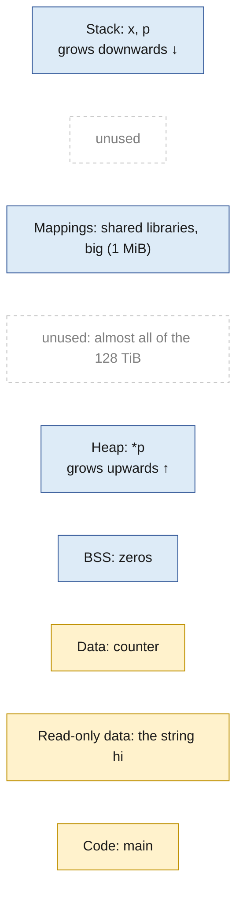
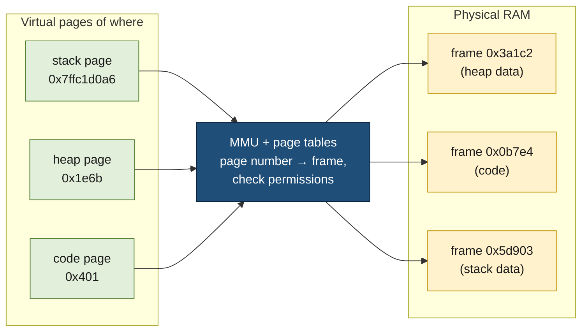
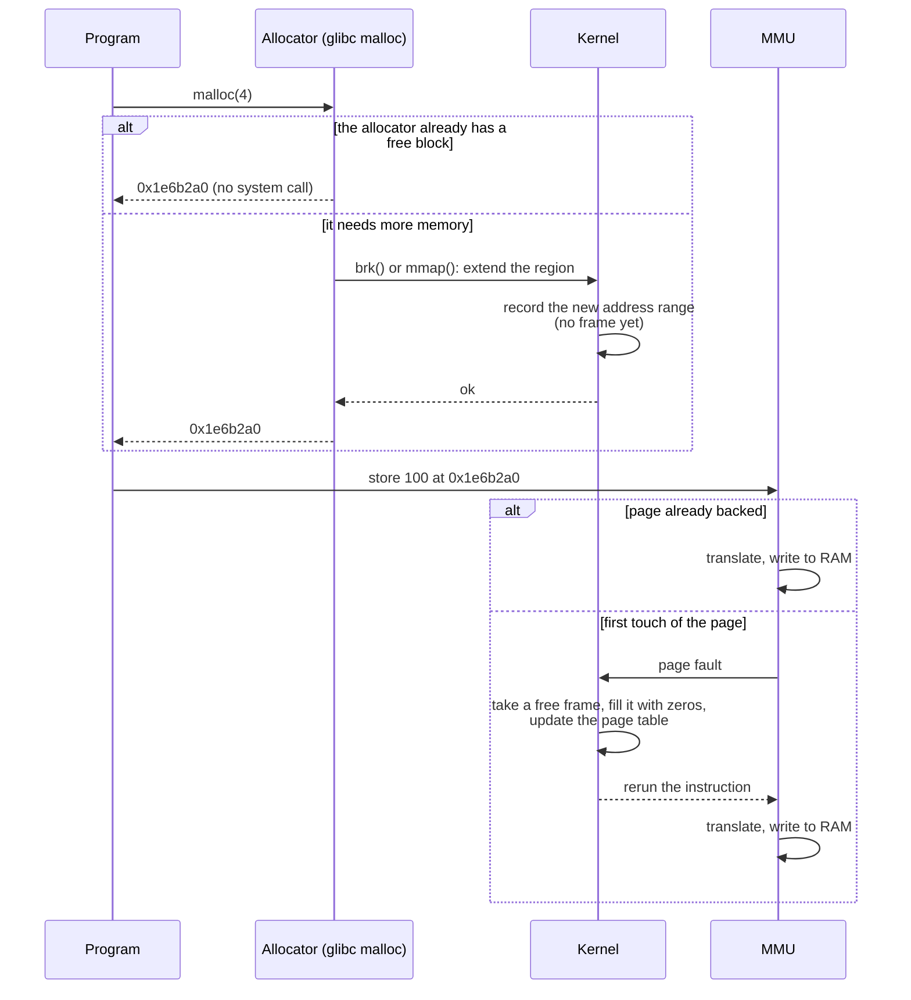
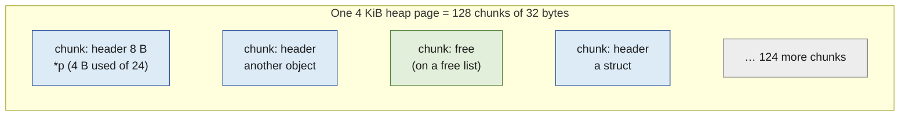

# Program memory layout

> [!abstract] In one sentence
> The code, globals, heap and stack a programmer thinks about are just regions of the process's virtual address space: the compiler decides which region a variable goes in, the allocator carves small objects out of pages it gets from the kernel, the kernel backs those pages with frames when they're first touched, and the MMU translates every access the same way whatever the region.
>
> *MMU: memory management unit*

## The plan of this note

[[Virtual memory]] explained the machinery from the bottom: pages, page tables, the MMU (memory management unit) and its TLB (translation lookaside buffer), page faults. A programmer works from the top: variables, functions, pointers, `malloc`. This note connects the two worlds with one small C program, and the key idea is that there are **layers**, each managing memory in its own unit:
1. **The program** manages variables and objects
2. **The allocator** (`malloc`/`free`) manages small blocks inside pages
3. **The kernel** manages regions of virtual addresses, and the frames of RAM (random-access memory) behind them
4. **The MMU and the TLB** translate every address and enforce each page's permissions

The steps:
1. **Where each variable of a program lands**, printed and checked against the kernel's map of the process
2. **Why the address space is cut into regions**, and what makes each one different
3. **What the hardware sees**: addresses and permissions, never "stack" or "heap"
4. **Following one `malloc` down to RAM**, through the allocator and the kernel
5. **A variable is not a page**: how small allocations share pages, and why `free` rarely gives memory back
6. **The stack at the kernel's level**: how it grows, and where it stops
7. **Three different "memory used" numbers**, and which layer each one comes from

The language-level side (stack frames, lifetimes, what goes where when you declare something) is in [[Stack and heap]].

## Step 1: where each variable of a program lands

A program with one variable of each kind:

```c
/* where.c */
#include <stdio.h>
#include <stdlib.h>

int counter = 10;          /* global, initialized         */
int zeros[1000];           /* global, no initializer: 0   */
const char *msg = "hi";    /* the text "hi" is a constant */

int main(void) {
    int x = 42;                       /* local variable          */
    int *p = malloc(sizeof(int));     /* 4 bytes, dynamic        */
    char *big = malloc(1 << 20);      /* 1 MiB, dynamic          */
    *p = 100;

    printf("main      %p\n", (void *)main);
    printf("\"hi\"      %p\n", (void *)msg);
    printf("counter   %p\n", (void *)&counter);
    printf("zeros     %p\n", (void *)zeros);
    printf("*p        %p\n", (void *)p);
    printf("big       %p\n", (void *)big);
    printf("x         %p\n", (void *)&x);
    printf("p itself  %p\n", (void *)&p);
    getchar();                        /* pause, to read /proc/<pid>/maps */
    free(big);
    free(p);
    return 0;
}
```

```bash
gcc -no-pie -o /tmp/where where.c     # fixed code address, as in Virtual memory's same.c
/tmp/where
```

```text
main      0x401176
"hi"      0x402004
counter   0x404028
zeros     0x404060
*p        0x1e6b2a0
big       0x7f3c8e5ff010
x         0x7ffc1d0a6b44
p itself  0x7ffc1d0a6b48
```

(The addresses are illustrative; the heap, the mappings and the stack move on every run because of ASLR (address space layout randomization).)

Now, from another terminal, the kernel's own list of the regions this process owns:

```bash
cat /proc/$(pgrep -n where)/maps
```

```text
00400000-00401000 r--p 00000000 103:02 4211   /tmp/where     file headers
00401000-00402000 r-xp 00001000 103:02 4211   /tmp/where     code: main
00402000-00403000 r--p 00002000 103:02 4211   /tmp/where     read-only data: "hi"
00404000-00405000 rw-p 00003000 103:02 4211   /tmp/where     globals: counter, zeros
01e6b000-01e8c000 rw-p 00000000 00:00 0       [heap]         *p
7f3c8e5ff000-7f3c8e700000 rw-p 00000000 00:00 0              big (its own mapping)
7f3c8e800000-7f3c8e828000 r--p 00000000 103:02 1838412  /usr/lib/libc.so.6
...
7ffc1d087000-7ffc1d0a8000 rw-p 00000000 00:00 0  [stack]     x, p
```

Every address the program printed falls inside one of these ranges:

| Variable | Address | Region | Why there |
|---|---|---|---|
| `main` (the function's machine code) | `0x401176` | code | Instructions, loaded from the executable |
| `"hi"` | `0x402004` | read-only data | A constant: the program must not change it |
| `counter` | `0x404028` | data | A global with an initial value stored in the executable |
| `zeros` | `0x404060` | BSS (block started by symbol, an old assembler term) | A global with no initializer, so all zeros |
| `*p`, the `int` from `malloc` | `0x1e6b2a0` | heap | A small dynamic allocation |
| `*big`, 1 MiB from `malloc` | `0x7f3c8e5ff010` | an anonymous mapping | A large dynamic allocation gets its own region |
| `x`, and the pointer `p` itself | `0x7ffc1d0a6b44` | stack | Local variables of `main` |

Two things already stand out:
- **`p` and `*p` live in different regions.** The pointer is a local variable (on the stack); the `int` it points to is on the heap. A pointer's own location and its target's location are independent ([[Stack and heap]] builds on this)
- **The program asked for 4 bytes and the heap region is `0x1e8c000 - 0x1e6b000` = `0x21000` = 135,168 bytes = 132 KiB (kibibytes, 1,024 bytes each).** The 1 MiB (mebibyte, 1,024 KiB) allocation's region is `0x101000` = 1 MiB + 4 KiB. Neither matches what the program asked for, because the program didn't talk to the kernel: the allocator did (Step 4)

## Step 2: why the address space is cut into regions

The kernel could hand out one big block of addresses and let the program do what it likes with it. It doesn't, because the contents differ in three ways that each need a different treatment.

**Permissions.** Each page carries its own permission bits ([[Virtual memory]], Step 6), so contents with different rules go in different pages:
- **code** must be executable, and must not be writable: otherwise a bug, or an attacker who found one, could overwrite the instructions
- **constants** must be neither writable nor executable
- **data, heap, stack** must be writable, and must not be executable: otherwise a buffer overflow could write machine code into a buffer and jump to it

That's what the `r-xp`, `r--p` and `rw-p` columns in the map show, and why the executable is split into several ranges even though it's one file.

**Where the contents come from.**
- **File-backed** regions (code, constants, initialized globals) are copies of parts of the executable file. The kernel doesn't read the file at start-up: it records "these pages come from that file", and each page is read on its first access (a page fault). Pages of code nobody runs are never read
- **Anonymous** regions (BSS, heap, stack, `big`) have no file: their pages start as zeros on first touch. That's why BSS exists as a separate region: `zeros` is 1,000 × 4 = 4,000 bytes of zeros, and storing those zeros in the executable would waste 4,000 bytes of disk for nothing. The executable only records "4,000 bytes of BSS"; a global array of 100 MiB of zeros costs nothing in the file

**How they grow.** Code and globals have a fixed size known when the program is built. The heap grows as the program allocates, the stack grows as calls nest. So they're placed far apart, the heap low and growing upwards, the stack at the top of user space and growing downwards, with tebibytes (TiB, 2⁴⁰ bytes each) of unused addresses between them ([[Virtual memory]], Step 5):



*High addresses at the top. Blue: anonymous (zeros on first touch). Yellow: copied from the executable file. Shared libraries are file-backed too; the box mixes them with `big` for space.*

The names "stack" and "heap" are therefore not kinds of RAM. They're **conventions for using two regions of virtual addresses**: one managed by function calls, the other by an allocator.

## Step 3: what the hardware sees

When the CPU (central processing unit) runs `*p = 100`, the instruction is "store 100 at address `0x1e6b2a0`". When it runs `x = 42`, it's "store 42 at address `0x7ffc1d0a6b44`". The MMU translates both the same way: page number through the TLB or the page tables, offset copied, permission bits checked. It has no idea that one address is "the heap" and the other "a local variable called `x`". Those meanings exist only in the compiler, the allocator and the kernel's list of regions.



*Frame numbers are made up. The frames can be anywhere in RAM, in any order: the stack being "above" the heap is only true of virtual addresses.*

The only difference the hardware enforces is the **permission bits** of each page: writing into the code page faults, and the kernel turns that into `SIGSEGV`, the segmentation fault signal ([[Signals]]).

## Step 4: following one malloc down to RAM

`malloc(4)` is a library function, not a system call. Between the program and the RAM there are three parties, and each does a different job:



1. **The allocator** (in glibc, the GNU C library, GNU standing for "GNU's Not Unix") keeps pools of free blocks. If one fits, it returns its address straight away: most `malloc` calls never enter the kernel
2. When its pools are empty, it asks the kernel for **more addresses**, in big pieces so that it rarely has to ask:
   - small requests come from the heap region, which the allocator extends with the `brk()` system call. Its first extension is 132 KiB, which is the `[heap]` range of Step 1
   - requests of **128 KiB or more** (glibc's default threshold) each get their own region from `mmap()`, which is where `big` came from. Its region is 1 MiB + 4 KiB because the allocator puts a 16-byte header in front of the block (`big` is at `…ff010`, 16 bytes after the start `…ff000`) and the kernel rounds up to whole pages
3. **The kernel** only records the new range. No frame is used yet
4. **The first write** to a page of the range hits a "not present" entry, the page fault handler takes a frame, zeroes it and maps it, and the store is rerun. That's demand paging ([[Virtual memory]], Part 2)

The system calls are visible with `strace`:

```bash
strace -e trace=brk,mmap,munmap /tmp/where 2>&1 | tail -4
```

```text
brk(NULL)                               = 0x1e6b000
brk(0x1e8c000)                          = 0x1e8c000
mmap(NULL, 1052672, PROT_READ|PROT_WRITE, MAP_PRIVATE|MAP_ANONYMOUS, -1, 0) = 0x7f3c8e5ff000
```

`brk(NULL)` asks where the heap ends, `brk(0x1e8c000)` moves the end up by `0x21000` (132 KiB), and the `mmap` asks for 1,052,672 bytes = 1,048,576 (1 MiB) + 4,096 (one page for the header).

So "allocating memory" means three different things depending on the layer: getting a block from the allocator, getting addresses from the kernel, getting a frame on first touch. Only the last one uses RAM.

## Step 5: a variable is not a page

`malloc(4)` asks for 4 bytes, the kernel works in 4,096-byte pages, and the MMU maps whole pages. So who keeps track of the 4 bytes? The allocator: it cuts pages into small **chunks** and keeps the bookkeeping in a small header in front of each chunk.

In glibc on a 64-bit machine, a chunk has an 8-byte header (its size and some flags) and chunks are aligned on 16 bytes, which gives a minimum chunk of **32 bytes**. A request of 4 bytes gets a 32-byte chunk with 24 usable bytes. So one 4 KiB page holds 4,096 / 32 = **128** of those small allocations:



Two consequences:
- **Small allocations cost more than they ask for.** A million `malloc(4)` calls ask for 4 MB (megabytes, millions of bytes) and use 32 MB: 8 times more. Programs with millions of tiny objects (tree nodes, linked list nodes) feel this, which is why allocators and runtimes have special pools for small sizes
- **`free` gives the chunk back to the allocator, not the page to the kernel.** After `free(p)`, the chunk goes on the allocator's free list for the next `malloc` to reuse, but the page still holds 127 other chunks, some of them alive. The kernel only gets memory back when a whole region is free: a block from `mmap` is unmapped as soon as it's freed (`free(big)` is a `munmap`), and the top of the heap is shrunk with `brk` only when a large free area sits at its very end (more than 128 KiB by default). This is why a process's memory often doesn't go down after a peak: freed chunks are scattered over pages that each still hold a few live ones

That gives the full stack of layers, each managing a different unit:

| Layer | Unit it manages | Example operation | Knows about |
|---|---|---|---|
| Program | Variables, objects | `*p = 100`, `free(p)` | Names, types, lifetimes |
| Allocator (`malloc`/`free`) | Chunks of 32 bytes and up | Find a free chunk, split, merge | Which chunks are free, inside which regions |
| Kernel | Address ranges and 4 KiB pages | `brk`, `mmap`, page faults | Which ranges exist, which pages have frames |
| MMU and TLB | One address at a time | Translate, check permissions | Page tables only |

## Step 6: the stack at the kernel's level

The stack is managed without any allocator: the compiler emits instructions that move the **stack pointer** (a CPU register) down when a function starts and back up when it returns ([[Stack and heap]] shows the frames). The kernel's part is only the region:
- At start-up, the main thread's `[stack]` region is small (132 KiB in Step 1's map: `0x7ffc1d0a8000 - 0x7ffc1d087000` = `0x21000`)
- When a call goes below it, the access faults, and the kernel **grows the region downwards**, as long as the stack stays within its limit: `ulimit -s`, **8 MiB** by default on Linux (8,192 KiB)
- Below the limit is a **guard gap** of unmapped pages. A runaway recursion that crosses it faults outside any region, and the process gets `SIGSEGV`: the "stack overflow" crash

Each additional thread gets its own stack, as a region allocated with `mmap` by the thread library, with a guard page below it. Its size is fixed when the thread starts: 8 MiB of addresses by default in glibc (taken from `ulimit -s`), but only **128 KiB** in musl, the C library of Alpine Linux images. So a program with 1,000 threads has 1,000 × 8 MiB = 8 GiB (gibibytes) of stack **addresses**, but only the pages each thread actually touched use RAM, typically a few dozen KiB each.

## Step 7: three different "memory used" numbers

Each layer counts memory its own way, so "how much memory does `where` use?" has three answers:

| Number | Layer | Where to read it | For `where` in Step 1 |
|---|---|---|---|
| **Allocated** | Allocator | the allocator's own statistics (`malloc_stats()` in glibc) | 4 bytes + 1 MiB asked, in a 32-byte chunk and a 1 MiB + 4 KiB block |
| **Virtual size** (VSZ (virtual set size)) | Kernel: address ranges | `ps -o vsz`, `VmSize` in `/proc/<pid>/status` | All the ranges of the map: 132 KiB of heap, the 1 MiB + 4 KiB of `big`, the libraries… whether touched or not |
| **Resident** (RSS (resident set size)) | Kernel: pages with a frame | `ps -o rss`, `VmRSS` | Only the pages touched: one heap page (the allocator wrote headers, the program wrote `*p`), **one** page of `big` (the allocator wrote its header, the program never touched the rest) |

So `big` adds about 1 MiB to the virtual size and **4 KiB** to the resident size. The allocated, virtual and resident numbers of a process can each differ from the others by a large factor, and in both directions: a fragmented heap has more resident pages than live objects; a reserved but untouched region has a large virtual size and a tiny resident size. [[Virtual memory]] explains the kernel numbers in detail, including PSS (proportional set size) for shared pages.

## Who needs which layer

| | Application programmer | Systems programmer |
|---|---|---|
| Works with | Variables, objects, pointers, the language's allocator | Address ranges, page faults, frames, allocators themselves |
| Asks | Is this pointer valid? Who owns this object and frees it? Can it outlive the function? Is memory leaking? | How are regions created and unmapped? Why is this process's RSS high? Why so many TLB misses? Is the allocator fragmenting? |
| Tools | The language's profiler, sanitizers, Valgrind | `/proc/<pid>/maps` and `smaps`, `strace`, `perf`, allocator statistics |

A database engineer investigating TLB misses on a large hash table, an operations engineer investigating why a service's RSS never drops, and an application developer fixing a leak are looking at different layers of the same mechanism.

## Advanced problems

### 1. Memory grows with the number of threads
**Symptom:** a multi-threaded service (often a Java or Python program with native libraries) has RSS growing well beyond its live data, and its VSZ is many GiB. **Cause:** to avoid lock contention, glibc gives threads separate allocator pools (**arenas**), up to 8 per CPU core on 64-bit, each reserving 64 MiB of addresses. Memory freed in one arena can't be reused by another, so fragmentation multiplies. **Fix:** limit the arenas with the environment variable `MALLOC_ARENA_MAX=2` (or 4), or switch to an allocator designed for threads (jemalloc, tcmalloc).

### 2. RSS stays high after a peak
**Symptom:** after a burst, the program frees most of its objects but RSS stays near the peak. **Cause:** the freed chunks are spread over pages that still hold a few live ones (Step 5), so no page is entirely free and nothing goes back to the kernel. **Fix:** check first whether it's a real leak (a leak keeps growing under steady load; fragmentation plateaus). For fragmentation: `malloc_trim(0)` returns free pages inside the heap, a different allocator, or restarting workers periodically ([[Virtual memory]] has the same failure seen from the kernel).

### 3. A program crashes only in an Alpine container
**Symptom:** a program that works on Debian or Ubuntu crashes with `SIGSEGV` on Alpine, in code with deep recursion or large local arrays, but only in threads other than the main one. **Cause:** musl gives new threads 128 KiB stacks, against 8 MiB in glibc (Step 6); the thread overflows its stack. **Fix:** set the thread stack size explicitly (`pthread_attr_setstacksize`, or the runtime's option, such as `threading.stack_size()` in Python), or move big local arrays to the heap.

### 4. A crash far away from the bug
**Symptom:** the program aborts inside `malloc` or `free` with messages like `malloc(): corrupted top size` or `free(): invalid pointer`, in code that looks innocent. **Cause:** an earlier bug wrote past the end of a heap block, or freed it twice, and overwrote the allocator's chunk headers (Step 5); the allocator only notices when it next reads them. **Fix:** rebuild with AddressSanitizer (`-fsanitize=address`) or run under Valgrind, which report the bad write at the moment it happens.

### 5. A segmentation fault on entering a function
**Symptom:** the program crashes as soon as one function is called, before its first line runs. **Cause:** the function declares a huge local array (`char buf[16 * 1024 * 1024]`, 16 MiB), bigger than the 8 MiB stack: moving the stack pointer by that much lands below the guard gap. **Fix:** allocate the buffer with `malloc`, or make it `static` ([[Stack and heap]]).

## Practice

> [!example]- A program prints `&x = 0x7ffd…` and `p = 0x55a1…` for `int x; int *p = malloc(4);`. Which regions are these, and where is `p` itself?
> `x` is on the stack (top of user space); `p`'s value points into the heap (just above the program's own image). `p` itself, the 8-byte pointer, is a local variable, so it's on the stack next to `x`.

> [!example]- The `[heap]` range is 132 KiB although the program allocated 4 bytes. Why?
> The allocator, not the program, talks to the kernel, and it extends the heap in big steps (`brk` by 132 KiB the first time) so that most later `malloc` calls need no system call.

> [!example]- How much RAM do one million `malloc(4)` use with glibc on a 64-bit machine, and why?
> About 32 MB: each request gets a minimum chunk of 32 bytes (8-byte header, 16-byte alignment), so 8 times the 4 MB asked for.

> [!example]- A program `malloc`s 1 MiB and writes only its first byte. How do VSZ and RSS change?
> VSZ grows by 1 MiB + 4 KiB (the `mmap` region, rounded to pages, with the allocator's header). RSS grows by one page, 4 KiB: only the touched page got a frame.

> [!example]- Why does `free(p)` on a 4-byte block usually not reduce RSS, while `free(big)` on a 1 MiB block does?
> The small chunk shares its page with other chunks, so the allocator keeps it for reuse and the page stays. A block of 128 KiB or more has its own `mmap` region, which `free` unmaps.

## Easy to get wrong

- Stack and heap are regions of virtual addresses, not different kinds of RAM; their frames are scattered anywhere
- The MMU knows nothing about variables, stack or heap: only addresses and page permissions
- `malloc` is a library function; most calls don't enter the kernel at all
- `malloc` returning doesn't mean RAM is used: the frame comes on the first write to each page
- `free` returns the block to the allocator, usually not to the kernel
- A pointer and the object it points to are in different places: `p` on the stack, `*p` on the heap
- BSS takes no space in the executable file, only in memory, and only once touched
- 8 MiB is the main thread's stack limit; other threads have their own stacks, of a size fixed at creation (128 KiB with musl)

## Related
- Builds on:: [[Virtual memory]] (pages, page faults, demand paging, VSZ and RSS), [[Memory pages]] (anonymous vs file-backed pages)
- Next:: [[Stack and heap]] (the same layers from the language's side: frames, lifetimes, declarations)
- Threads and their stacks:: [[Processes and threads]]
- Crashes:: [[Signals]] (`SIGSEGV`)
- Applied:: [[PostgreSQL architecture]] (memory contexts on top of malloc, shared memory as one more region)
- Area:: [[Operating systems]]

## Flashcards
#flashcards
What are a process's main memory regions, from low to high addresses? :: Code, read-only data, data, BSS, heap (grows up), mappings (libraries, big allocations, thread stacks), stack (grows down)
Why is the address space split into regions instead of one block? :: Different permissions (code r-x, data rw-), different sources (file-backed vs anonymous), different growth (fixed, heap up, stack down)
Why is BSS a separate region from data? :: Its contents are all zeros, so the executable only records its size; storing the zeros in the file would waste space
Does the MMU know what's stack and what's heap? :: No: it sees addresses and page permissions; "stack" and "heap" exist only for the compiler, allocator and kernel
Is malloc a system call? :: No, a library function; the allocator only calls brk or mmap when its pools run out
When does glibc's malloc use mmap instead of the heap? :: For requests of 128 KiB or more (the default threshold); each gets its own region, unmapped by free
Why is the [heap] region 132 KiB when a program allocated 4 bytes? :: The allocator extends the heap in large steps (brk by 132 KiB) to avoid a system call per malloc
When does a malloc'd block actually use RAM? :: On the first write to each of its pages, through a page fault (demand paging)
How big is the smallest glibc malloc chunk on 64-bit, and why? :: 32 bytes: an 8-byte header and 16-byte alignment; malloc(4) gets 24 usable bytes
Why doesn't free usually lower a process's RSS? :: The chunk goes back to the allocator's free list; its page still holds other chunks, so nothing returns to the kernel
What layers manage memory between a C program and RAM? :: Program (objects), allocator (chunks), kernel (ranges and pages, frames on fault), MMU/TLB (translation and permissions)
How does the main thread's stack grow? :: Faults just below it make the kernel extend the region downwards, up to ulimit -s (8 MiB by default)
What happens when the stack passes its limit? :: The access lands in the unmapped guard gap, faults outside any region, and the process gets SIGSEGV
Default thread stack size in glibc vs musl (Alpine)? :: 8 MiB vs 128 KiB
Allocated vs VSZ vs RSS? :: Allocator's blocks vs all address ranges vs pages that have a frame
Why can memory grow with thread count in glibc programs? :: Per-thread arenas (up to 8 per core) fragment separately; limit with MALLOC_ARENA_MAX or use jemalloc/tcmalloc
Why do heap corruption crashes appear far from the bug? :: The bad write damaged chunk headers; the allocator only notices when it next reads them in malloc/free
