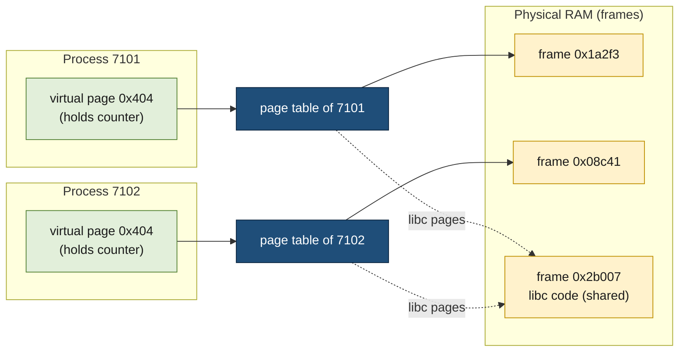
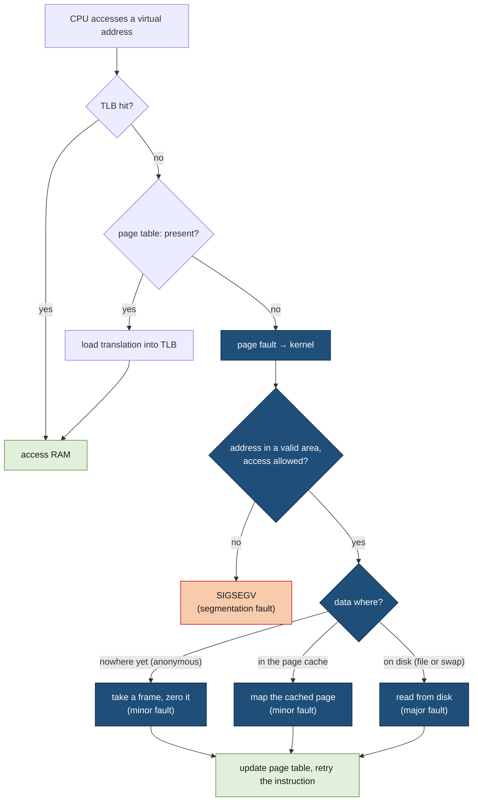

# Virtual memory

> [!abstract] In one sentence
> Every process sees its own private, contiguous range of memory addresses (its **virtual address space**), and the CPU's (central processing unit's) memory management unit translates each address, page by page, to wherever the kernel actually put that data in RAM (random-access memory), or to "not here yet": that one indirection gives isolation between processes, lazy allocation, sharing of libraries and files, copy-on-write after `fork()`, swap, and the OOM (out-of-memory) killer.

## Build-up: two programs, one address

A tiny C program stores a number in a global variable and prints where that variable lives:

```c
/* same.c */
#include <stdio.h>
#include <stdlib.h>
#include <unistd.h>

int counter = 0;

int main(int argc, char **argv) {
    counter = atoi(argv[1]);
    printf("pid %d: &counter = %p, counter = %d\n", getpid(), (void *)&counter, counter);
    sleep(30);                         /* stay alive so both run at the same time */
    printf("pid %d: counter is still %d\n", getpid(), counter);
    return 0;
}
```

```bash
gcc -no-pie -o same same.c        # -no-pie: load at a fixed address, to make the point visible
./same 1 & ./same 2 & wait
```

```text
pid 7101: &counter = 0x404034, counter = 1
pid 7102: &counter = 0x404034, counter = 2
pid 7101: counter is still 1
pid 7102: counter is still 2
```

Two processes running at the same time, the **same address** `0x404034`, two **different values**, and neither disturbs the other. The address a program uses can't be a place in RAM. The rest of this note is about how that works, and everything that follows from it.

### Stage 1: when programs used physical addresses directly

On early machines (and on small microcontrollers today), an address in a program **is** a location in the RAM chips. Run several programs that way and four problems appear:
- **Relocation.** The program above was compiled to put `counter` at `0x404034`. If another program already uses that spot, this one has to be loaded elsewhere and every address inside it patched
- **No isolation.** Nothing stops one program from writing into another's memory, or into the operating system's. A bug in one crashes everything; a malicious program reads everything
- **Fragmentation.** Programs need contiguous blocks. After programs of different sizes start and exit, free memory is split into holes, none big enough for the next program even though the total would be
- **Not enough RAM.** Every program has to fit entirely in memory, even the parts it never uses (error handling code, a big buffer it touches once)

### Stage 2: a private address space per process, translated in hardware

The fix is to put a translation between the program and the RAM:
- Each process gets its own **virtual address space**: on x86-64 Linux, addresses from `0` to `0x7fffffffffff` (128 TiB) for the process, the upper half reserved for the kernel
- Memory is cut into fixed-size **pages**, 4 KiB on most systems. Virtual memory is made of **pages**, physical RAM of **page frames** of the same size
- Each process has a **page table**, kept by the kernel, saying for each virtual page which physical frame holds it (or that it holds nothing)
- The **MMU (memory management unit)**, part of the CPU, translates **every** memory access: it splits the address into a page number and an offset inside the page, looks up the frame, and adds the offset back



The four problems disappear:
- **Relocation**: every process can use `0x404034`, because each page table sends it to a different frame
- **Isolation**: a process can only reach frames its own page table points to. An address with no mapping makes the MMU raise a fault, and the kernel kills the process with `SIGSEGV` (a segmentation fault, see [[Signals]])
- **Fragmentation**: contiguous virtual pages can live in scattered frames. Physical memory only needs free frames, not free holes of the right size
- **Not enough RAM**: a page doesn't have to be in RAM at all. The page table can say "not present", and the kernel fills it in when it's first touched (Stage 4), or moves it out to disk when RAM runs short (Stage 9)

Each page table entry also carries **permission bits**: present, writable, executable, user-accessible, plus "accessed" and "dirty" bits the hardware sets. That's how code pages are read-only and executable, and data pages writable but not executable.

### Stage 3: page tables are trees, and the TLB makes them fast

A flat table for 128 TiB of 4 KiB pages would need 32 billion entries per process. So page tables are **multi-level trees**: on x86-64, four levels (five on recent CPUs with very large memory), each a 4 KiB table of 512 entries. The 48-bit virtual address is cut into four 9-bit indexes and a 12-bit offset. Only the branches covering memory actually in use exist, so a small process needs a few dozen kilobytes of page tables.

Walking four levels for every memory access would multiply memory traffic by five. The CPU caches recent translations in the **TLB (translation lookaside buffer)**: a small, very fast cache of "virtual page → frame" pairs, typically a few thousand entries. Most accesses hit it.

The TLB is why some operations cost more than they look:
- **Context switches between processes**: the new process has a different page table, so cached translations belong to the wrong process. Modern CPUs tag TLB entries with an address-space ID (PCID (process-context identifier) on x86) to avoid flushing everything, but switching processes still costs more than switching threads of one process, which share one address space
- **TLB shootdowns**: when one thread of a multi-threaded process unmaps memory, every other CPU core running a thread of that process may have the old translation cached. The kernel sends them an interrupt ([[Interrupts]]) to flush it, and waits. Programs that map and unmap memory constantly across many threads pay for this
- **Huge pages** (Stage 10) exist mostly to cover more memory with each TLB entry

### Stage 4: memory is handed out lazily (page faults)

When a program asks for memory (`malloc`, `mmap`, a big array), the kernel mostly **writes down a promise**: "addresses X to Y are valid for this process". It doesn't give it frames yet. The first time the program touches a page, the MMU finds no mapping and raises a **page fault**; the kernel checks the address is part of a valid area, takes a free frame, fills it with zeros, maps it, and resumes the program as if nothing happened. That's **demand paging**.

```python
# lazy.py: ask for 10 GiB, then touch only 1 GiB of it
import mmap

def show(label):
    fields = {}
    for line in open("/proc/self/status"):
        key, _, value = line.partition(":")
        if key in ("VmSize", "VmRSS"):
            fields[key] = value.strip()
    print(f"{label:<24} VmSize={fields['VmSize']:>14}  VmRSS={fields['VmRSS']:>12}")

show("start")
m = mmap.mmap(-1, 10 * 2**30)                 # anonymous mapping: 10 GiB of address space
show("after mapping 10 GiB")
for offset in range(0, 2**30, 4096):          # write one byte in each of the first 262,144 pages
    m[offset] = 1
show("after touching 1 GiB")
```

```text
start                    VmSize=     17616 kB  VmRSS=     9984 kB
after mapping 10 GiB     VmSize=  10503376 kB  VmRSS=     9984 kB
after touching 1 GiB     VmSize=  10503376 kB  VmRSS=  1058560 kB
```

- **VmSize** (virtual size) jumped by 10 GiB the moment the mapping was made: that's the promise
- **VmRSS** (resident set size, the frames actually in RAM) only grew by the 1 GiB that was touched

Counting the faults:

```bash
perf stat -e page-faults,minor-faults,major-faults python3 lazy.py
```

```text
           263,412      page-faults
           263,410      minor-faults
                 2      major-faults
```

About 262,144 faults for 1 GiB of 4 KiB pages: one per page touched. The kinds of page fault:

| Kind | What happened | Cost |
|---|---|---|
| **Minor** | The page is valid and the data is already in RAM or needs no input: a fresh zero page, a page of a file already in the page cache, a shared library page another process loaded | Microseconds |
| **Major** | The data has to be read from disk: a file page not cached yet, or a page swapped out | Milliseconds (a disk read) |
| **Invalid** | The address isn't in any valid area, or the access breaks the permissions (writing to code, executing data) | The kernel sends `SIGSEGV`; usually the process dies |



### Stage 5: sharing without copying (fork, libraries, files)

Since the page table is just a list of pointers to frames, two processes can point at the **same** frame.

**Shared libraries.** Every process on the machine uses `libc`. Its code is loaded once into RAM, and every process's page table maps those same frames, read-only. A hundred processes using `libc` don't use a hundred copies.

**Copy-on-write after `fork()`.** `fork()` creates a child that starts as a copy of the parent ([[Inter-process communication]] shows the child changing a variable the parent never sees). Copying gigabytes at every `fork()` would be slow, so the kernel copies only the **page tables**, points both at the same frames, and marks the writable pages **read-only** in both. When either process writes to such a page, the fault handler copies that one page and gives the writer its private copy. A `fork()` followed immediately by `exec()` (how shells start programs) copies almost nothing.

**Memory-mapped files.** `mmap()` on a file maps its pages straight into the address space: reading memory reads the file, through page faults that pull the pages in. Program code itself is loaded that way (the executable and libraries are mapped files), and so do databases that work on large files.

**Shared memory between processes** is the same mechanism used on purpose: two processes map the same segment and see each other's writes immediately ([[Inter-process communication]]).

### Stage 6: the page cache, and why "free" memory is almost always low

Every file read on Linux goes through the **page cache**: file pages kept in otherwise unused RAM so the next read doesn't touch the disk. Memory-mapped files and normal `read()` calls share it. The kernel lets it grow into all spare RAM, because empty RAM does nothing, and gives it back the moment a process needs memory.

```bash
free -h
```

```text
               total        used        free      shared  buff/cache   available
Mem:            15Gi       4.1Gi       312Mi       245Mi        11Gi        10Gi
Swap:          4.0Gi          0B       4.0Gi
```

- `free` (312 MiB): RAM holding nothing at all. Always small on a healthy machine that has been up a while
- `buff/cache` (11 GiB): the page cache and kernel buffers, mostly reclaimable
- `available` (10 GiB): the kernel's estimate of how much a new program could get **without swapping**, counting reclaimable cache. **This is the number to watch**

The same data, more detailed, is in `/proc/meminfo`:

```text
MemTotal:       16219836 kB
MemFree:          319412 kB
MemAvailable:   10734228 kB
Buffers:          402116 kB
Cached:         10891020 kB
SwapCached:            0 kB
Active(file):    5123044 kB
Inactive(file):  5302868 kB
AnonPages:       3921544 kB
Shmem:            250932 kB
Dirty:              1240 kB
CommitLimit:    12304060 kB
Committed_AS:    9874412 kB
```

`AnonPages` is memory owned by processes (heaps, stacks), `Cached` is file data, `Dirty` is file data modified in memory but not yet written to disk. How files sit on disk is in [[Partitions and filesystems]].

### Stage 7: what's inside one process's address space

Every process's virtual address space has the same general layout, visible in `/proc/<pid>/maps`:

```bash
cat /proc/self/maps        # the cat process describing itself
```

```text
5603c8a4e000-5603c8a50000 r--p 00000000 103:02 1835123    /usr/bin/cat
5603c8a50000-5603c8a55000 r-xp 00002000 103:02 1835123    /usr/bin/cat        ← text (code)
5603c8a55000-5603c8a58000 r--p 00007000 103:02 1835123    /usr/bin/cat        ← read-only data
5603c8a58000-5603c8a59000 rw-p 00009000 103:02 1835123    /usr/bin/cat        ← data + BSS
5603c9b2f000-5603c9b50000 rw-p 00000000 00:00 0           [heap]
7f2a1c400000-7f2a1c5e8000 r--p 00000000 103:02 1840211    /usr/lib/locale/locale-archive
7f2a1c600000-7f2a1c628000 r--p 00000000 103:02 1838412    /usr/lib/libc.so.6
7f2a1c628000-7f2a1c7bd000 r-xp 00028000 103:02 1838412    /usr/lib/libc.so.6  ← shared library code
7f2a1c7bd000-7f2a1c815000 r--p 001bd000 103:02 1838412    /usr/lib/libc.so.6
7f2a1c815000-7f2a1c819000 rw-p 00214000 103:02 1838412    /usr/lib/libc.so.6
7f2a1c8a1000-7f2a1c8a3000 rw-p 00000000 00:00 0                               ← anonymous mmap
7ffd3b9e1000-7ffd3ba02000 rw-p 00000000 00:00 0           [stack]
7ffd3ba5e000-7ffd3ba62000 r--p 00000000 00:00 0           [vvar]
7ffd3ba62000-7ffd3ba64000 r-xp 00000000 00:00 0           [vdso]
```

Each line is one **area**: start-end addresses, permissions (`r`ead, `w`rite, e`x`ecute, `p`rivate or `s`hared), offset in the file, device, inode, and the file mapped (or a label). From low to high addresses:

| Area | Holds | Grows |
|---|---|---|
| **Text** | The program's machine code, mapped from the executable, read-only and executable | Fixed |
| **Data** | Initialized global variables (`int counter = 5;`) | Fixed |
| **BSS** (block started by symbol) | Global variables initialized to zero: takes no space in the file, zero pages on first touch | Fixed |
| **Heap** | Small `malloc` allocations, extended with the `brk()` system call | Upwards |
| **Memory-mapping area** | Shared libraries, mapped files, large `malloc` allocations (glibc uses `mmap` above 128 KiB), thread stacks | Anywhere free |
| **Stack** | The main thread's call frames and local variables | Downwards, up to `ulimit -s` (8 MiB by default) |
| **Kernel** | The upper half of the address range: mapped in every process but inaccessible from user mode | — |

`[vdso]` is a small piece of kernel code mapped into every process so calls like `gettimeofday()` don't need a full system call.

**ASLR (address space layout randomization).** The `same.c` example used `-no-pie` to get the same address twice. By default, programs are compiled as PIE (position-independent executables) and the kernel places the executable, heap, libraries and stack at **random** offsets on every run (`/proc/sys/kernel/randomize_va_space` = 2). An attacker who finds a memory bug can't rely on knowing where code or data is.

**Stack overflow and guard pages.** Below the stack the kernel leaves an unmapped **guard gap**. Infinite recursion grows the stack into it, the access faults on an invalid address, and the process gets `SIGSEGV` instead of silently overwriting the memory below.

### Stage 8: how much memory does a process use? (VSZ, RSS, PSS, USS)

Since memory can be promised but not used, and shared between processes, "how much memory does this process use" has four answers:

```bash
ps -o pid,vsz,rss,comm -C postgres
```

```text
    PID    VSZ   RSS COMMAND
   1840 4421180 31220 postgres
   1846 4422416 1105248 postgres
   1847 4421312 142812 postgres
   1902 4425840 418900 postgres
```

| Measure | Meaning | Use it for |
|---|---|---|
| **VSZ (virtual set size)** | Every page of the address space, used or not (`VmSize`) | Almost nothing. It includes promises never touched |
| **RSS (resident set size)** | Pages of this process currently in RAM, **including shared ones in full** (`VmRSS`) | A rough upper bound. Summing RSS over processes counts shared libraries and shared memory many times |
| **PSS (proportional set size)** | Private pages, plus each shared page **divided by the number of processes sharing it** | Summing over processes gives a meaningful total |
| **USS (unique set size)** | Only the pages private to this process | What would be freed if this process exited |

The PostgreSQL processes above all map the same 4 GiB shared buffer: their VSZ are all around 4.2 GiB and their RSS include whatever part of the shared buffer each has touched. PSS splits it fairly:

```bash
cat /proc/1902/smaps_rollup
```

```text
55d0c1e4a000-7fffd5f9a000 ---p 00000000 00:00 0                          [rollup]
Rss:              418900 kB
Pss:              104355 kB
Pss_Anon:          12020 kB
Pss_File:           3401 kB
Pss_Shmem:         88934 kB
Shared_Clean:       6120 kB
Shared_Dirty:     398840 kB
Private_Clean:        12 kB
Private_Dirty:     13928 kB
Swap:                  0 kB
```

`pmap -x 1902` gives the same per area, and tools like `smem` print PSS and USS for every process. Containers and cgroups count memory yet another way (Stage 11).

### Stage 9: promising more than exists (overcommit, OOM killer, swap)

Because allocations are promises, the kernel can promise more than RAM + swap: most programs never touch all they allocate. That's **overcommit**, controlled by `vm.overcommit_memory`:

| Value | Behaviour |
|---|---|
| `0` (default) | Heuristic: refuse only allocations that obviously can't fit; otherwise promise |
| `1` | Always promise (some scientific and Redis setups use it) |
| `2` | Strict: total promises (`Committed_AS`) may not exceed `CommitLimit` = swap + RAM × `vm.overcommit_ratio` (50 % by default). `malloc` fails instead of the system running out later |

When promises come due and there's truly no frame left (no free RAM, no reclaimable cache, no swap space), the kernel can't fail the page fault politely: the program is in the middle of an instruction. It runs the **OOM killer**, which picks a process and kills it with `SIGKILL` to free its memory:

```bash
dmesg -T | grep -i -A2 "out of memory"
```

```text
[Sat Oct 10 03:12:44 2026] Out of memory: Killed process 1846 (postgres) total-vm:4422416kB, anon-rss:1102920kB, file-rss:0kB, shmem-rss:2328kB, UID:113 pgtables:2516kB oom_score_adj:0
[Sat Oct 10 03:12:44 2026] oom_reaper: reaped process 1846 (postgres), now anon-rss:0kB, file-rss:0kB, shmem-rss:2328kB
```

The victim is the process with the highest **`oom_score`** (`/proc/<pid>/oom_score`, 0 to 1000), roughly its share of memory, adjusted by **`oom_score_adj`** (-1000 to 1000): -1000 means never kill this one, 1000 means kill this one first. systemd sets it with `OOMScoreAdjust=` in a unit.

**Swap** is disk space where the kernel can move **anonymous** pages (heap, stack: there's no file to re-read them from) that haven't been used for a while, freeing their frames. File pages don't need swap: clean ones are simply dropped and re-read from their file later. Swap turns a sudden OOM kill into gradual slowness, which is good for a short spike and terrible when the working set (the pages actually in use) no longer fits in RAM: processes keep faulting pages in from disk, pushing others out, and the machine spends its time on disk input/output instead of work. That's **thrashing**:

```bash
vmstat 1
```

```text
procs -----------memory---------- ---swap-- -----io---- -system-- ------cpu-----
 r  b   swpd   free   buff  cache   si   so    bi    bo   in   cs us sy id wa st
 2  9 3912044 101240   2140  98312 18420 22104 19980 22410 9120 14022  6 11  4 79  0
 1 11 3940112  98012   2096  96204 21304 19876 22800 19920 9877 15110  5 12  3 80  0
```

`si`/`so` (swap in/out per second) constantly high, `wa` (CPU time waiting for input/output) at 80 %, many processes blocked (`b`): the machine is thrashing. `vm.swappiness` (default 60) sets how willing the kernel is to swap anonymous pages rather than drop page cache. **zram** is a middle ground used on laptops and some servers: a compressed swap device in RAM, much faster than disk.

### Stage 10: huge pages

A 4 KiB page means a 64 GiB database needs 16 million page table entries and thrashes the TLB. x86-64 also supports **2 MiB** and **1 GiB** pages: one TLB entry then covers 512 or 262,144 times more memory.
- **Explicit huge pages** (`vm.nr_hugepages`, `hugetlbfs`) are reserved at boot or startup and used by programs that ask for them: databases (PostgreSQL's `huge_pages = on`), DPDK (Data Plane Development Kit) network stacks, virtual machines
- **THP (transparent huge pages)** do it automatically: the kernel backs large anonymous areas with 2 MiB pages, and a background thread (`khugepaged`) merges small pages into huge ones

```bash
cat /sys/kernel/mm/transparent_hugepage/enabled
# always [madvise] never
```

THP helps big sequential workloads but can hurt latency-sensitive ones: assembling a 2 MiB page may require **compacting** memory (moving pages around) inside a page fault, causing pauses of tens of milliseconds, and copy-on-write of a 2 MiB page after `fork()` copies 2 MiB instead of 4 KiB. Redis, MongoDB and several databases recommend `madvise` or `never`. Redis logs a warning at startup when THP is `always`.

### Stage 11: limits in containers (cgroups)

A container is a group of processes the kernel accounts for together, through a **cgroup (control group)** ([[Docker]]). With cgroup v2, `memory.max` caps the group's memory (anonymous memory plus page cache it uses), and the group has its own OOM handling:

```bash
docker run --memory=512m ...
cat /sys/fs/cgroup/system.slice/docker-<id>.scope/memory.max       # 536870912
cat /sys/fs/cgroup/system.slice/docker-<id>.scope/memory.events
# low 0
# high 0
# max 1523
# oom 4
# oom_kill 4
```

When the group reaches `memory.max`, the kernel first reclaims the group's page cache, and if that's not enough, kills a process **inside the group**, even if the host has plenty of free RAM. The container's main process dies with `SIGKILL`, so its exit code is **137** (128 + 9). Kubernetes shows `Last State: Terminated, Reason: OOMKilled` and restarts the container ([[Kubernetes Pod]]): the pod's memory **limit** becomes `memory.max`.

Runtimes have to know about the limit. A JVM (Java Virtual Machine) sizes its heap from the memory it detects; modern JVMs read the cgroup limit (container support has been on by default since Java 10 and 8u191), and `-XX:MaxRAMPercentage` (25 % by default) sets the heap as a share of it. The heap isn't everything (thread stacks, metaspace, direct buffers, the garbage collector's own structures), so a heap set to the full limit gets the container OOM-killed.

## Advanced problems

### 1. The OOM killer kills the database
**Symptom:** PostgreSQL restarts in the middle of the night; `dmesg` shows `Out of memory: Killed process … (postgres)`. **Cause:** another process (a runaway batch job, a leaking service) used up memory, and the database, being the largest process, had the highest `oom_score`. **Fix:** find the real consumer (the OOM report lists every process's RSS before the kill line), cap it (a cgroup limit, `MemoryMax=` in its systemd unit), give the database `OOMScoreAdjust=-900`, and size the database's memory settings to leave room for everything else.

### 2. Container OOMKilled while the host has free memory
**Symptom:** exit code 137, `OOMKilled` in Kubernetes, and `free -h` on the node shows gigabytes available. **Cause:** the limit is the **cgroup's** `memory.max`, not the host's RAM. Often the runtime doesn't respect it (a JVM heap sized for the host, a Node.js process with a large default heap) or the limit is simply too low for the peak. **Fix:** check `memory.events` and the container's memory metrics at the time of the kill, size the runtime from the limit (`MaxRAMPercentage`, `--max-old-space-size`), and set the limit from the measured peak plus margin.

### 3. Alarm on "low free memory" that isn't a problem
**Symptom:** monitoring shows 95 % of memory used and `free` at a few hundred MiB on a server that runs fine. **Cause:** the page cache filled the spare RAM, as designed. **Fix:** alert on `MemAvailable` (or `available` in `free`), on swap activity and on OOM kills, never on `MemFree`. `echo 3 > /proc/sys/vm/drop_caches` "fixes" the graph and makes the next file reads slower.

### 4. The server is up but unusable (thrashing)
**Symptom:** SSH (Secure Shell) takes a minute, load average is huge, CPU mostly in `wa`, `vmstat` shows constant `si`/`so`. **Cause:** the working set no longer fits in RAM, and the kernel is swapping pages in and out continuously. **Fix:** in the moment, kill or stop the biggest consumer. Long term: more RAM, lower memory settings, limits per service, and for latency-sensitive servers little or no swap, so the failure is a fast OOM kill and a restart instead of a slow death. Pressure stall information (`/proc/pressure/memory`) shows the problem earlier than load average does.

### 5. VSZ of 30 GiB on a 16 GiB machine
**Symptom:** `ps` or `top` shows a process with a virtual size larger than RAM, someone files a ticket. **Cause:** VSZ counts address space reserved (thread stacks, memory-mapped files, a JVM's reserved heap, address sanitizers), not memory used. **Fix:** nothing; look at RSS, PSS or the cgroup's usage instead.

### 6. Latency spikes from transparent huge pages
**Symptom:** a Redis or database server shows periodic latency spikes of tens of milliseconds, with high `sys` CPU time; `/proc/vmstat` shows compaction counters (`compact_stall`) rising. **Cause:** page faults stall while the kernel compacts memory to build 2 MiB pages, or `khugepaged` merges pages under the process. **Fix:** set THP to `madvise` or `never` (a kernel boot parameter or a systemd unit at boot), and use explicit huge pages where the software supports them.

### 7. RSS never goes down
**Symptom:** a service's RSS grows to 3 GiB during a traffic peak and stays there for days, although the load is gone. Is it a leak? **Cause:** either a real leak (memory still referenced, growing with every request), or **fragmentation**: freed memory sits in the allocator's free lists, in pages that also hold a few live objects, so the allocator can't return them to the kernel. **Fix:** a leak grows without bound under steady load; fragmentation plateaus. For fragmentation: an allocator that returns memory better (jemalloc, `MALLOC_ARENA_MAX` for many-threaded glibc programs), or periodic restarts of workers. For leaks: heap profiling.

### 8. `fork()` fails with "Cannot allocate memory" while RAM is free
**Symptom:** a large process (a 20 GiB Redis doing a background save, a big Java service starting a subprocess) gets `ENOMEM` from `fork()` on a machine with free memory. **Cause:** strict overcommit (`vm.overcommit_memory = 2`) counts the child's copy-on-write pages as a promise of another 20 GiB, which exceeds `CommitLimit`. **Fix:** heuristic overcommit (Redis recommends `vm.overcommit_memory = 1`), or start subprocesses with `posix_spawn`/`vfork` (which don't duplicate the address space), or raise the commit limit.

## In the cloud

- **EC2 (Elastic Compute Cloud) instances have no swap by default** on the standard AMIs (Amazon Machine Images): running out of memory means the OOM killer, not slowness. A swap file can be added on the instance store or an EBS (Elastic Block Store) volume, with the thrashing trade-off above
- **Memory isn't a default CloudWatch metric**: the hypervisor sees CPU, network and disk, but not what the guest OS (operating system) does with its RAM. Memory and swap usage need the CloudWatch agent inside the instance ([[CloudWatch agent]]), reporting `mem_used_percent` (based on available memory) and swap metrics
- **Lambda's memory setting also sets CPU**: from 128 MB to 10,240 MB, with CPU allocated in proportion (about one vCPU (virtual CPU) at 1,769 MB). A function that exceeds its memory is stopped with a "Runtime exited… signal: killed" error, the same OOM kill as a container
- **ECS (Elastic Container Service) and EKS (Elastic Kubernetes Service)** containers hit the cgroup limits of Stage 11: task or pod memory limits, exit code 137, `OutOfMemoryError: Container killed due to memory usage` in ECS

## Practice

> [!example]- Two processes print the same address for a variable but different values. How?
> Each process has its own page table. The same virtual page maps to a different physical frame in each one, so the addresses are equal but refer to different RAM.

> [!example]- A program `malloc`s 8 GiB on a 4 GiB machine and the call succeeds. Then it crashes later. What happened?
> With heuristic overcommit, the allocation is only a promise. Frames are given on first touch (page faults). When the program actually wrote to more pages than RAM + swap could hold, the OOM killer killed it.

> [!example]- `free -h` shows 200 MiB free and 9 GiB available on a 16 GiB server. Is it short of memory?
> No. Most RAM holds page cache, reclaimable on demand. `available` (9 GiB) is the number that matters.

> [!example]- Ten worker processes each show 600 MiB RSS, but the machine only has 4 GiB and isn't swapping. How?
> RSS counts shared pages (libraries, shared memory, copy-on-write pages from the parent) in full for each process. PSS divides shared pages among the sharers and gives a total that adds up.

> [!example]- A container exits with code 137 and the node has free RAM. Where do I look?
> The container's cgroup limit (`memory.max`, the Kubernetes limit) and `memory.events` / `OOMKilled`. 137 = 128 + 9, killed by `SIGKILL`, almost always the cgroup OOM killer. Then check that the runtime sizes itself from the limit.

> [!example]- Why does `fork()` of a 10 GiB process not take seconds?
> Copy-on-write: only the page tables are copied, and the pages are shared read-only until one side writes to one.

> [!example]- What's the difference between a minor and a major page fault?
> A minor fault is resolved without disk input/output (zero page, page already in the page cache). A major fault has to read from disk (a file page not cached, or a swapped-out page).

## Easy to get wrong

- An address in a program is virtual: the same address in two processes points to different RAM
- Allocating memory doesn't use RAM; touching it does (demand paging). VSZ can exceed RAM harmlessly
- "Free" memory is supposed to be low: watch **available**, not free
- Summing RSS across processes over-counts shared memory; use PSS for totals
- A segmentation fault is the MMU and kernel refusing an access outside the process's valid areas, delivered as the `SIGSEGV` signal
- Swap isn't only for "out of memory": the kernel moves cold anonymous pages there before RAM is full, and file pages never go to swap
- The OOM killer kills the process with the highest score, not necessarily the one causing the problem
- Exit code 137 means `SIGKILL`, usually the (cgroup) OOM killer
- A container's limit applies to the container's processes **and** the page cache they use
- Transparent huge pages can hurt latency-sensitive services
- RSS that doesn't shrink after a peak isn't automatically a leak (fragmentation)
- Memory isn't in default EC2 CloudWatch metrics

## Related
- Uses:: [[Interrupts]] (page faults are CPU exceptions, TLB shootdowns are inter-processor interrupts), [[Signals]] (SIGSEGV, SIGKILL from the OOM killer)
- Copy-on-write and shared memory between processes:: [[Inter-process communication]]
- Processes:: *[[Processes and threads]]*
- Files behind the page cache:: [[Partitions and filesystems]]
- Containers and limits:: [[Docker]], [[Kubernetes Pod]]
- In AWS:: [[CloudWatch agent]] (memory metrics)
- Area:: [[Operating systems]]

## Flashcards
#flashcards

What is a virtual address space? :: The private range of addresses each process sees; the MMU translates each address to a physical frame through the process's page table
Why can two processes use the same address for different data? :: Each has its own page table, mapping the same virtual page to different physical frames
Page vs page frame? :: A page is a fixed-size block of virtual memory (usually 4 KiB); a frame is a block of physical RAM of the same size
What is a page table? :: A per-process structure (a multi-level tree on x86-64) mapping virtual pages to physical frames, with permission bits
What does the MMU do? :: The memory management unit translates every virtual address to a physical one and raises a fault when there's no valid mapping
What is the TLB? :: The translation lookaside buffer: a CPU cache of recent virtual-to-physical page translations
What is a TLB shootdown? :: Interrupting other CPU cores to flush a translation when memory is unmapped in a multi-threaded process
What is demand paging? :: Frames are only given to a process when it first touches a page, through a page fault
Minor vs major page fault? :: Minor: resolved without disk (zero page, page cache). Major: data has to be read from disk (file or swap)
What happens on an invalid memory access? :: The MMU faults, the kernel finds no valid area or permission, and sends SIGSEGV
Why does malloc of 10 GiB succeed on a machine with less RAM? :: Overcommit: the kernel only records a promise; RAM is used when pages are touched
How does copy-on-write make fork() fast? :: Only page tables are copied; pages are shared read-only and copied one at a time when written
Why don't 100 processes use 100 copies of libc? :: Its code pages are mapped read-only into every process from the same frames
What is the page cache? :: File data kept in spare RAM so reads don't hit the disk; reclaimed when processes need memory
free vs available in free -h? :: free: RAM holding nothing. available: what new programs can get without swapping, including reclaimable cache
Main areas of a process address space? :: Text (code), data, BSS, heap, memory-mapping area (libraries, mmaps, thread stacks), stack, and the kernel half
Where do you see a process's memory areas on Linux? :: /proc/<pid>/maps (and pmap, /proc/<pid>/smaps_rollup)
VSZ vs RSS? :: VSZ: all virtual address space, used or not. RSS: pages currently in RAM, shared ones counted in full
PSS vs USS? :: PSS: private pages plus shared pages divided among sharers (sums correctly). USS: only private pages (freed on exit)
What is vm.overcommit_memory? :: 0 heuristic (default), 1 always overcommit, 2 strict commit limit (swap + RAM × overcommit_ratio)
What does the OOM killer do? :: When no memory can be found, kills the process with the highest oom_score (SIGKILL) to free memory
How do you protect a process from the OOM killer? :: Lower its oom_score_adj (down to -1000), e.g. OOMScoreAdjust= in systemd
What goes to swap? :: Cold anonymous pages (heap, stack); file pages are dropped and re-read from their files instead
What is thrashing? :: The working set doesn't fit in RAM, so the system constantly swaps pages in and out and does little work
What does vm.swappiness control? :: How readily the kernel swaps anonymous pages rather than dropping page cache (default 60)
Why use huge pages? :: Each TLB entry covers 2 MiB or 1 GiB instead of 4 KiB, reducing TLB misses and page table size
Why do databases often disable transparent huge pages? :: Compaction and huge-page copy-on-write cause latency spikes
What is ASLR? :: Address space layout randomization: executable, heap, libraries and stack are placed at random addresses each run
What protects against stack overflow corrupting memory? :: A guard gap below the stack: overflowing into it faults and the process gets SIGSEGV
What does memory.max do in a cgroup? :: Caps the group's memory (anonymous + page cache); exceeding it triggers OOM kills inside the group
Exit code 137? :: 128 + 9: killed by SIGKILL, typically the (cgroup) OOM killer
Why can a container be OOMKilled while the host has free RAM? :: The limit is the container's cgroup memory.max, not host RAM
How does a JVM size its heap in a container? :: From the cgroup limit (container support), as MaxRAMPercentage of it (25 % default)
Is memory a default EC2 CloudWatch metric? :: No, it needs the CloudWatch agent inside the instance
Do EC2 instances have swap by default? :: No, standard AMIs have none
