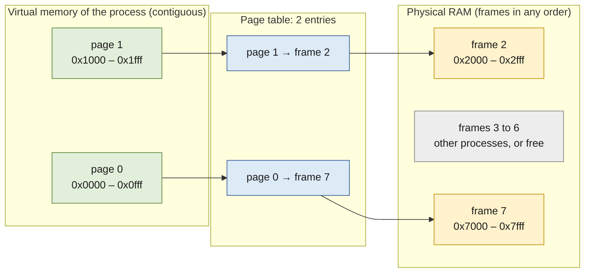
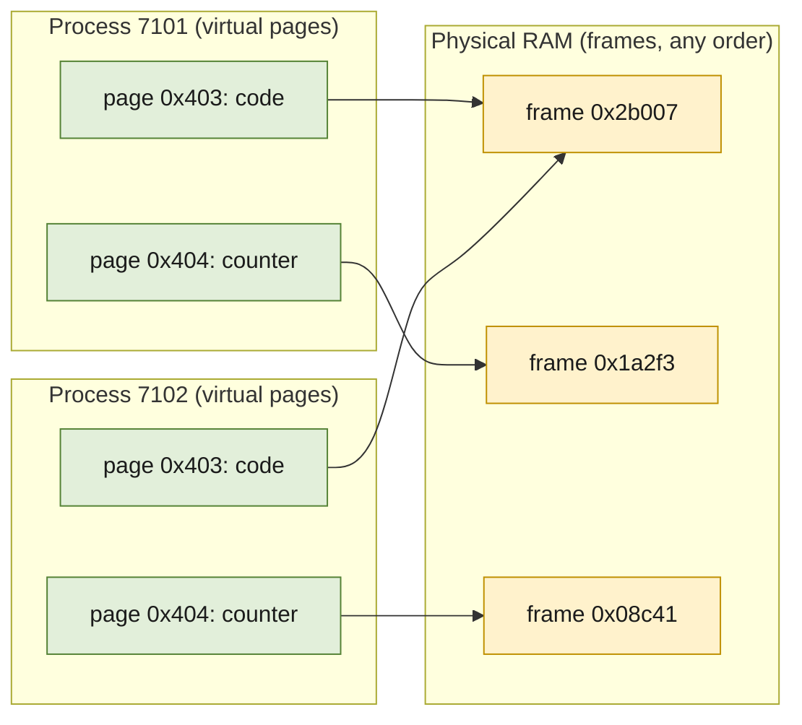
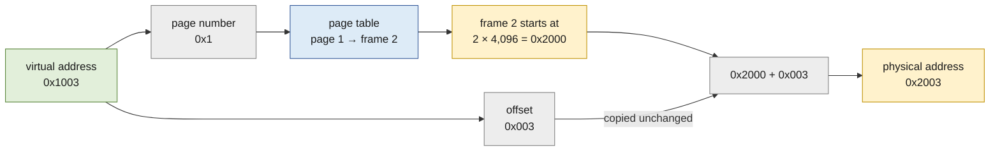
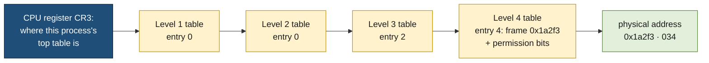
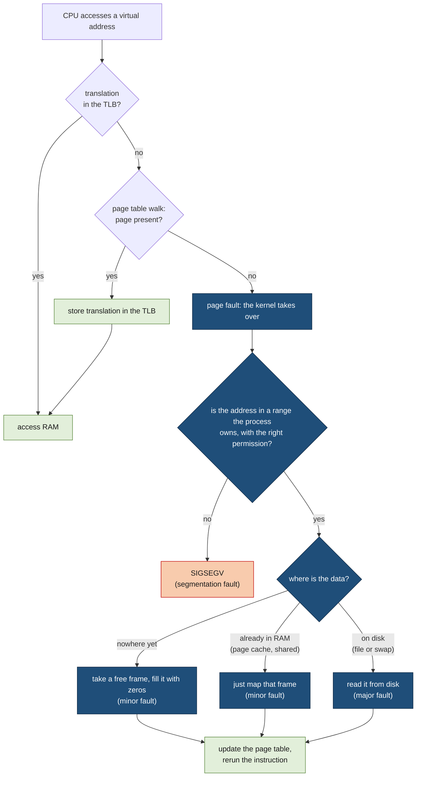

# Virtual memory

> [!abstract] In one sentence
> The addresses a program uses are not places in RAM: each process gets its own private range of addresses, and the CPU translates every address, in fixed-size chunks called pages, to wherever the kernel really put the data, or to "not here", which hands control to the kernel. That one translation step is what keeps processes apart and what lets the kernel allocate lazily, share memory, swap, and promise more memory than it has.
>
> *RAM: random-access memory · CPU: central processing unit*

## The plan of this note

Virtual memory is a chain of ideas, where each one exists because of a problem the previous one left behind. The note follows that chain:

1. **The surprise**: two processes use the same address and see different values. So addresses can't be places in RAM
2. **Why translate at all**: what goes wrong when programs use RAM addresses directly
3. **Why in fixed-size pages**: translating byte by byte is impossible, translating whole programs fragments memory
4. **How an address is split** into a page number and a position inside the page, and why pages are 4 KiB
5. **How big the address space is**, and where numbers like 128 TiB come from
6. **Why the page table is a tree**: a flat table would be bigger than RAM
7. **Why the TLB exists, and why it's so small**: translation must not slow every memory access down
8. **Page faults**: what happens when the translation says "not here"

Then what that mechanism makes possible (lazy allocation, sharing, swap, overcommit and the OOM killer), and finally how to read all of it on a real Linux machine.

> [!info] Units used in this note
> Memory sizes are powers of two, so they use binary prefixes: **KiB** (kibibyte) = 2¹⁰ = 1,024 bytes, **MiB** (mebibyte) = 2²⁰ ≈ 1 million bytes, **GiB** (gibibyte) = 2³⁰ ≈ 1 billion bytes, **TiB** (tebibyte) = 2⁴⁰ ≈ 1 trillion bytes. Addresses are written in **hexadecimal** (prefix `0x`): each hex digit is exactly 4 bits, which makes it easy to see where an address splits, as Step 4 shows.

## Part 1: the mechanism

### Step 1: the same address, two different values

A tiny C program stores a number in a global variable and prints the variable's address:

```c
/* same.c */
#include <stdio.h>
#include <stdlib.h>
#include <unistd.h>

int counter = 0;

int main(int argc, char **argv) {
    counter = atoi(argv[1]);
    printf("pid %d: &counter = %p, counter = %d\n", getpid(), (void *)&counter, counter);
    sleep(30);    /* stay alive so both run at the same time */
    printf("pid %d: counter is still %d\n", getpid(), counter);
    return 0;
}
```

```bash
gcc -no-pie -o same same.c        # -no-pie: load at a fixed address, so the point is visible
./same 1 & ./same 2 & wait
```

```text
pid 7101: &counter = 0x404034, counter = 1
pid 7102: &counter = 0x404034, counter = 2
pid 7101: counter is still 1
pid 7102: counter is still 2
```

Two processes run at the same time, both store `counter` at address `0x404034`, and each keeps its own value. If `0x404034` were a location in the RAM chips, the second program would have overwritten the first one's value. So the address a program sees is not a RAM location: it's a **virtual address**, and something translates it to a **physical address** (a real location in RAM) differently for each process.

### Step 2: why translate at all

Early computers, and small microcontrollers today, have no translation: an address in the program **is** a location in RAM. Running several programs that way causes four problems:

- **Relocation.** `same.c` was compiled to put `counter` at `0x404034`. If another program already uses that spot, this one has to be loaded elsewhere and every address inside it patched before it runs
- **No isolation.** Nothing stops one program from writing into another's memory, or into the kernel's. One bug crashes everything; one malicious program reads everything
- **Fragmentation.** Each program needs one contiguous block of RAM. After programs of different sizes start and exit, the free memory is a set of holes, and a new program may not fit in any hole even though the holes add up to enough
- **Not enough RAM.** Every program must be entirely in RAM, including code and buffers it rarely or never uses

All four have the same cause: the program's addresses are tied to physical locations. Put a translation in between, owned by the kernel, and each process can have its own private set of addresses (its **virtual address space**) that the kernel maps onto RAM however it likes. The translation has to happen on **every** memory access the program makes, so it's done in hardware, by a part of the CPU called the **MMU (memory management unit)**.

The open question is the **granularity**: what unit of memory does the translation work on?

### Step 3: why fixed-size pages

There are three obvious choices, and the first two fail:

**Translate every byte separately.** The kernel would keep a table with one entry per byte, saying where that byte really is. Say a process's virtual bytes from `0x1000` onwards are stored at physical address `0x2000` onwards:

| Virtual address | Physical address |
|---|---|
| `0x1000` | `0x2000` |
| `0x1001` | `0x2001` |
| `0x1002` | `0x2002` |
| `0x1003` | `0x2003` |
| … | … |

An entry holding a physical address takes 8 bytes (a 64-bit number). So describing 4,096 bytes of memory takes 4,096 × 8 = 32,768 bytes of table: the table would be **eight times bigger than the memory it describes**. Impossible.

Look at the table again, though: it's almost entirely redundant. Consecutive virtual bytes sit at consecutive physical bytes, so every row is just "the first row, plus 1, plus 2, plus 3…". Only the first row carries information. That observation is the whole idea of pages, below.

**Translate a whole program as one block.** Give each process a single **base** (where its block starts in RAM) and a **limit** (how long it is). The CPU adds the base to every address and checks it against the limit. That's cheap and it solves relocation and isolation, and early machines did exactly this. But the block must still be contiguous in RAM, so fragmentation stays, and the whole block must be in RAM, so "not enough RAM" stays too. Growing a process (more heap) means finding a bigger hole and copying everything.

**Translate fixed-size chunks.** Cut every virtual address space into chunks of one fixed size, called **pages**, and cut physical RAM into slots of the same size, called **page frames**. For each process the kernel keeps a **page table**: for each virtual page, which frame holds it, if any.

The trick is that the bytes **inside** a page stay together and in order: the 4,096 bytes of a virtual page are the 4,096 bytes of one frame, in the same order. So only the **start** of each page needs translating, never the individual bytes. A toy example with 4 KiB pages, numbered from address 0 (a real process leaves page 0 unmapped, so that a null pointer crashes instead of reading something):

| Virtual page | Its bytes (virtual) | Stored in frame | Its bytes (physical) |
|---|---|---|---|
| page 0 | `0x0000`–`0x0fff` (0–4,095) | frame 7 | `0x7000`–`0x7fff` (28,672–32,767) |
| page 1 | `0x1000`–`0x1fff` (4,096–8,191) | frame 2 | `0x2000`–`0x2fff` (8,192–12,287) |



Three things to see here:
- **Two entries describe 8,192 bytes**, where the byte-by-byte table needed 8,192 entries
- **The frames are not next to each other, nor in order**: page 0 is in frame 7 and page 1 in frame 2. The process still sees one contiguous range `0x0000`–`0x1fff`. Contiguity only has to hold inside a page, never between pages
- **The frame's start address is just its number × 4,096**: frame 2 starts at 2 × 4,096 = 8,192 = `0x2000`. So an entry only needs to store the frame number

How much smaller the table gets:

| | Entries for 4 KiB of memory | Table size for 4 KiB | Table size for 1 GiB |
|---|---|---|---|
| Byte by byte | 4,096 | 4,096 × 8 = 32 KiB | 8 GiB |
| Page by page | 1 | 1 × 8 = 8 bytes | 2¹⁸ pages × 8 = 2 MiB |

One entry instead of 4,096: the table is **4,096 times smaller**, about 0.2% of the memory it describes.

Pages fix everything the other two choices couldn't:
- **Any free frame fits any page**, because they're all the same size. Physical memory never has "holes too small": a process whose pages are scattered across RAM still sees one contiguous range of addresses
- **The table is per page, not per byte**, so it's thousands of times smaller than the memory it describes
- **Each page can be somewhere different**: in RAM, on disk, not allocated yet, or shared with another process. That's what makes laziness, swap and sharing possible later
- **Each page has its own permissions**: code pages read-only and executable, data pages writable but not executable



Both processes' code pages point at **one** frame (the same program code, loaded once, read-only), while each `counter` page points at its own frame. That's the answer to Step 1.

### Step 4: how an address is split, and why pages are 4 KiB

With pages, the MMU doesn't translate a whole address. It splits it in two:
- the **page number**: which page the address is in. This part is translated through the page table
- the **offset**: the position of the byte inside its page. This part is copied unchanged, since a page is moved as a whole

Pages are a power of two in size, so the split is just a cut between bits. With 4 KiB pages, 4,096 = 2¹² bytes per page, so the offset needs 12 bits (positions 0 to 4,095): the **lowest 12 bits** of an address are the offset and everything above is the page number. In hexadecimal, 12 bits are exactly the last 3 digits.

**The toy example from Step 3.** The process reads virtual address `0x1003`:
1. **Split**: `0x1 | 003`, so page 1, offset 3 (the fourth byte of the page)
2. **Look up the page**: the page table says page 1 is in frame 2
3. **Find the frame's start**: frame 2 starts at 2 × 4,096 = 8,192 = `0x2000`
4. **Add the offset back**: `0x2000 + 0x003` = **`0x2003`**



Only the page number went through the table. Offset 3 has no entry of its own: it's carried across as is, which is exactly why the byte-by-byte table of Step 3 isn't needed. The same holds for every byte of the page: `0x1000` → `0x2000`, `0x1fff` → `0x2fff`.

Since the frame's start is its number × 4,096, "number × 4,096 + offset" is the same as writing the frame number and then the 3 offset digits next to it: frame `0x2` and offset `003` give `0x2003`. No addition is really needed, only gluing bits together, which is why the hardware can do it instantly.

**The real address from Step 1** works the same way:

```text
virtual address   0x404034
                  0x404 | 034
                  page    offset (0x034 = byte 52 inside the page)

page table of 7101:  page 0x404 → frame 0x1a2f3
physical address  0x1a2f3 | 034  =  0x1a2f3034
```

**Why 4 KiB and not something else?** Page size is a trade-off between two costs:
- **Smaller pages** mean more pages for the same memory: bigger page tables, and more translations for the CPU to keep track of (Step 7)
- **Bigger pages** waste memory, because the unit of allocation is a whole page: a process that needs 100 bytes in a new area gets a full page, and on average half a page is wasted at the end of every area. Copying or reading a page also gets more expensive (Part 2 copies pages one at a time on writes, and reads them from disk one at a time)

4 KiB was the balance chosen when paging arrived on mainstream processors (Intel's 80386 in 1985 used it), and it stayed because operating systems, file formats and software assumed it. Some ARM systems use 16 KiB or 64 KiB pages, and every modern CPU can also use much larger **huge pages** (2 MiB or 1 GiB) for specific areas; Step 7 shows why that's worth it. A program can ask the size with `getconf PAGESIZE`; [[Memory pages]] follows a single page through its life.

### Step 5: how big a virtual address space is

A 64-bit CPU has 64-bit registers, so in theory an address could reach 2⁶⁴ bytes (16 billion GiB). No machine needs that much, and every extra address bit makes translation more expensive (Step 6), so x86-64 CPUs use **48 bits** of virtual address:
- 2⁴⁸ bytes = **256 TiB** of virtual addresses in total
- Linux gives the **lower half, 128 TiB**, to the process (addresses `0x0` to `0x7fffffffffff`), and keeps the **upper half for the kernel**, mapped in every process but only usable in kernel mode ([[Interrupts]] explains user mode and kernel mode)

So each process has 128 TiB of addresses, on a machine that may have 16 GiB of RAM. That's not a contradiction: the address space is a **range of possible addresses**, almost all of it unused, and only pages actually in use need RAM. Recent CPUs can use 57 bits (a fifth table level, Step 6) for machines with enormous memory.

### Step 6: why the page table is a tree

A process has 128 TiB / 4 KiB = 2⁴⁷ / 2¹² = 2³⁵ ≈ **34 billion** possible pages. A flat page table, one 8-byte entry per possible page, would take 2³⁵ × 8 bytes = **256 GiB per process**. Impossible again, and absurd, since a typical process uses a few thousand pages scattered in a few regions (code near the bottom, heap above it, libraries and stack near the top).

The fix is to describe only the parts that exist, with a **tree**:
- A page table is made of small tables, each exactly **one page** (4 KiB) holding **512 entries** of 8 bytes. 512 = 2⁹, so each table is indexed by **9 bits** of the address
- x86-64 uses **4 levels**: 4 × 9 bits for the page number + 12 bits of offset = 48 bits. That's where the 48 comes from
- The top table's entries point to second-level tables, which point to third-level tables, which point to the last level, whose entries finally hold the **frame number**
- A region of the address space nobody uses is just an **empty entry** high in the tree: no table is created below it

The address of `counter`, cut into the four indexes:

```text
0x404034 in binary, 48 bits, grouped as 9 | 9 | 9 | 9 | 12:

level 1 index   level 2 index   level 3 index   level 4 index   offset
000000000       000000000       000000010       000000100       000000110100
    0               0               2               4             0x034
```



A small process needs only a handful of these tables, a few dozen KiB in total. Switching to another process means pointing one CPU register (`CR3` on x86) at the other process's top table: that's the moment the whole address space changes.

Each last-level entry also holds the page's **permission bits** (present, writable, user-accessible, executable) and two bits the CPU sets by itself: **accessed** (the page was read) and **dirty** (the page was written). The kernel uses those two to decide which pages to evict and which must be saved first ([[Memory pages]]).

### Step 7: why the TLB exists, and why it's so small

The tree solves the size problem and creates a speed problem. To translate one address, the MMU has to read **four table entries from memory**, one per level, before it can do the access the program asked for: **five memory accesses instead of one**. A read from RAM takes around 100 nanoseconds, while the CPU's own first-level cache answers in about 1 nanosecond. Doing a full walk on every access would make every program several times slower.

Programs, though, touch the same pages over and over (a loop's variables, the current stack frame, the code being run). So the CPU keeps the translations it used recently in a small cache inside each core: the **TLB (translation lookaside buffer)**, a table of "virtual page → frame + permissions" pairs. On a **TLB hit**, the translation is free. On a **TLB miss**, the MMU walks the tree (helped by the normal data caches, which often hold the upper tables) and stores the result in the TLB.

**Why it's small.** The TLB is consulted on **every** memory access, of every instruction, and must answer in about one CPU cycle, in parallel with the first-level cache lookup. To be that fast, it compares the page number against all its entries at once, in hardware. Each extra entry costs chip area and power and makes the lookup slower, so the first-level TLB holds only around **64 to 100 entries**, backed by a second-level TLB of about **1,500 to 3,000 entries** that's a few cycles slower (typical figures for recent x86 server cores).

**What that means for a program.** The TLB's **reach** is how much memory its entries cover:

| | Entries (approx.) | × page size | = memory covered |
|---|---|---|---|
| First-level TLB, 4 KiB pages | 64 | 4 KiB | 256 KiB |
| Second-level TLB, 4 KiB pages | 2,048 | 4 KiB | 8 MiB |
| Second-level TLB, 2 MiB huge pages | 2,048 | 2 MiB | 4 GiB |

A program that jumps around a few GiB of data (a database's cache, a big hash table) touches far more than 8 MiB, so with 4 KiB pages it misses the TLB constantly and pays a table walk each time. With 2 MiB **huge pages**, one entry covers 512 times more memory, the same TLB reaches 4 GiB, and the tree is one level shorter. That's the main reason huge pages exist ([[Memory pages]] covers how to use them, and the transparent huge pages trap).

The TLB also explains two costs that look strange otherwise:
- **Switching processes costs more than switching threads.** A new process means a new page table, so the TLB's entries belong to the wrong address space. CPUs tag entries with an address-space number (PCID (process-context identifier) on x86) to avoid flushing everything, but the new process still starts with few useful entries. Threads of one process share one page table, so their entries stay valid ([[Processes and threads]])
- **TLB shootdowns.** When a multi-threaded process unmaps memory, other cores running its threads may still hold the old translation. The kernel interrupts them to flush it and waits for them ([[Interrupts]]). Programs that map and unmap memory constantly across many threads pay for it
21
### Step 8: when the translation says "not here" (page faults)

An entry in the tree can say **not present**. When the MMU meets one, it can't finish the access, so it stops the instruction and raises a **page fault**: a CPU exception that runs the kernel's fault handler ([[Interrupts]] explains how exceptions enter the kernel). The kernel then decides, based on its own records of which address ranges the process is allowed to use:



| Kind of fault | What happened | Cost |
|---|---|---|
| **Minor** | The page is valid and needs no disk read: a brand-new page (filled with zeros), or data already in RAM (a file page in the page cache, a library another process loaded) | Microseconds |
| **Major** | The data must be read from disk: a file page not cached yet, or a page that was swapped out | Milliseconds (a disk read) |
| **Invalid** | The address isn't in any range the process owns, or the access breaks the page's permissions (writing to code) | The kernel sends `SIGSEGV`, and the process usually dies ([[Signals]]) |

After a minor or major fault, the program resumes **at the same instruction** and never notices anything except the time it took. That invisibility is what Part 2 builds on: since the kernel gets control whenever a page isn't there, it can decide **when** pages get RAM, **which** frame they use, and **where** they are kept.

## Part 2: what the translation makes possible

### Lazy allocation (demand paging)

When a program asks for memory (`malloc`, `mmap`, a large array), the kernel only **records a promise**: "this range of addresses is valid for this process". It gives no frames yet. Each page gets a frame at its **first touch**, through a minor fault. That's **demand paging**:

```python
# lazy.py: ask for 10 GiB, then touch only 1 GiB of it
import mmap

def show(label):
    fields = {}
    for line in open("/proc/self/status"):
        key, _, value = line.partition(":")
        if key in ("VmSize", "VmRSS"):
            fields[key] = value.strip()
    print(f"{label:<24} VmSize={fields['VmSize']:>14}  VmRSS={fields['VmRSS']:>12}")

show("start")
m = mmap.mmap(-1, 10 * 2**30)                 # anonymous mapping: 10 GiB of address space
show("after mapping 10 GiB")
for offset in range(0, 2**30, 4096):          # write one byte in each of the first 262,144 pages
    m[offset] = 1
show("after touching 1 GiB")
```

```text
start                    VmSize=     17616 kB  VmRSS=     9984 kB
after mapping 10 GiB     VmSize=  10503376 kB  VmRSS=     9984 kB
after touching 1 GiB     VmSize=  10503376 kB  VmRSS=  1058560 kB
```

- **VmSize** (virtual size, the promised address ranges) grew by 10 GiB instantly
- **VmRSS** (resident set size, the frames actually in RAM) grew only by the 1 GiB that was touched

Counting the faults confirms it: 1 GiB of 4 KiB pages is 262,144 pages, and that's how many faults happened.

```bash
perf stat -e page-faults,minor-faults,major-faults python3 lazy.py
```

```text
           263,412      page-faults
           263,410      minor-faults
                 2      major-faults
```

### Sharing without copying

A page table entry is only a pointer to a frame, so two processes can point at the **same** frame:
- **Program code and shared libraries.** Every process uses `libc`; its code is loaded once into RAM and mapped read-only into all of them. A hundred processes don't hold a hundred copies
- **Copy-on-write after `fork()`.** `fork()` creates a child that starts as a copy of the parent ([[Inter-process communication]] shows it with a variable). Copying gigabytes at each `fork()` would be slow, so the kernel copies only the **page tables**, points both processes at the same frames, and marks those pages **read-only** in both. The first write to such a page faults; the kernel copies just that page and gives the writer its own copy. A `fork()` followed by `exec()` (how a shell starts a program) copies almost nothing
- **Memory-mapped files.** `mmap()` of a file maps its pages into the address space: reading memory reads the file, through faults that load the pages. The executable and libraries themselves are loaded this way
- **Shared memory** between processes is the same mechanism used on purpose: two processes map the same pages and see each other's writes immediately ([[Inter-process communication]])

### The page cache

Files are read and written through RAM: the kernel keeps file pages in otherwise unused frames, so the next read of the same data doesn't touch the disk. That's the **page cache**, and memory-mapped files and normal `read()`/`write()` calls share it. The kernel lets it grow into all spare RAM, because empty RAM is wasted RAM, and takes it back when processes need frames. Dirty file pages, writeback and how the kernel picks what to evict are in [[Memory pages]]; how the cache sits between programs and the disk is in [[Storage devices]].

### Swap: moving pages out of RAM

When RAM runs short, the kernel can free frames by evicting pages, and the page table entry becomes "not present" again:
- A **file page** that's clean can simply be dropped: its data is still in the file, and a later access re-reads it (a major fault)
- An **anonymous page** (heap, stack: memory with no file behind it) has nowhere to be re-read from. To evict it, the kernel writes it to **swap**, a disk area set aside for that, and reads it back on the next access

Swap turns a sudden memory shortage into gradual slowness. That's fine for a brief spike and terrible when the pages actually in use (the **working set**) no longer fit in RAM: processes keep faulting pages in from disk, which pushes other needed pages out, and the machine spends its time on disk input/output instead of work. That's **thrashing**:

```bash
vmstat 1
```

```text
procs -----------memory---------- ---swap-- -----io---- -system-- ------cpu-----
 r  b   swpd   free   buff  cache   si   so    bi    bo   in   cs us sy id wa st
 2  9 3912044 101240   2140  98312 18420 22104 19980 22410 9120 14022  6 11  4 79  0
 1 11 3940112  98012   2096  96204 21304 19876 22800 19920 9877 15110  5 12  3 80  0
```

`si`/`so` (pages swapped in and out per second) stay high, `wa` (CPU time waiting for input/output) is at 80 %, and many processes are blocked (`b`). `vm.swappiness` (default 60) sets how readily the kernel swaps anonymous pages rather than dropping page cache.

### Promising more than exists: overcommit and the OOM killer

Since allocations are promises and most programs never touch everything they allocate, the kernel can promise more than RAM + swap. That's **overcommit**, set by `vm.overcommit_memory`:

| Value | Behaviour |
|---|---|
| `0` (default) | Heuristic: refuse only allocations that obviously can't fit; promise the rest |
| `1` | Always promise |
| `2` | Strict: the total promised (`Committed_AS` in `/proc/meminfo`) may not exceed `CommitLimit` = swap + RAM × `vm.overcommit_ratio` (50 % by default). Allocations fail up front instead |

When promises come due and there's truly no frame left (no free RAM, nothing to drop from the cache, no swap), the kernel can't fail the page fault: the program is in the middle of an instruction and was told the memory was fine. So it runs the **OOM (out-of-memory) killer**, which picks a process and kills it with `SIGKILL` to recover its frames:

```bash
dmesg -T | grep -i -A1 "out of memory"
```

```text
[Sat Oct 10 03:12:44 2026] Out of memory: Killed process 1846 (postgres) total-vm:4422416kB, anon-rss:1102920kB, file-rss:0kB, shmem-rss:2328kB, UID:113 pgtables:2516kB oom_score_adj:0
[Sat Oct 10 03:12:44 2026] oom_reaper: reaped process 1846 (postgres), now anon-rss:0kB, file-rss:0kB, shmem-rss:2328kB
```

The victim is the process with the highest **`oom_score`** (`/proc/<pid>/oom_score`, 0 to 1000), roughly its share of memory, shifted by **`oom_score_adj`** (-1000 means never kill this one, 1000 means kill it first; `OOMScoreAdjust=` in a systemd unit).

## Part 3: reading it on a real machine

### What's inside one address space

Every process's address space has the same layout, visible in `/proc/<pid>/maps`, one line per range the process owns:

```bash
cat /proc/self/maps        # the cat process describing itself
```

```text
5603c8a50000-5603c8a55000 r-xp 00002000 103:02 1835123    /usr/bin/cat        ← code
5603c8a58000-5603c8a59000 rw-p 00009000 103:02 1835123    /usr/bin/cat        ← global variables
5603c9b2f000-5603c9b50000 rw-p 00000000 00:00 0           [heap]
7f2a1c628000-7f2a1c7bd000 r-xp 00028000 103:02 1838412    /usr/lib/libc.so.6  ← shared library code
7f2a1c815000-7f2a1c819000 rw-p 00214000 103:02 1838412    /usr/lib/libc.so.6
7f2a1c8a1000-7f2a1c8a3000 rw-p 00000000 00:00 0                               ← anonymous mmap
7ffd3b9e1000-7ffd3ba02000 rw-p 00000000 00:00 0           [stack]
7ffd3ba62000-7ffd3ba64000 r-xp 00000000 00:00 0           [vdso]
```

Each line gives the address range, permissions (`r`ead, `w`rite, e`x`ecute, `p`rivate or `s`hared), the offset in the file and the file mapped, if any. These ranges are the kernel's "records" from Step 8: a fault inside one of them is served, a fault outside all of them is a `SIGSEGV`.

| Range | Holds | Grows |
|---|---|---|
| **Code (text)** | The program's machine code, mapped from the executable, read-only | Fixed |
| **Data and BSS** | Global variables: initialized ones from the file, zero-initialized ones (BSS (block started by symbol)) as zero pages on first touch | Fixed |
| **Heap** | Small `malloc` allocations, extended with the `brk()` system call | Upwards |
| **Mapping area** | Shared libraries, mapped files, large `malloc` allocations (glibc uses `mmap` above 128 KiB), thread stacks | Anywhere free |
| **Stack** | The main thread's call frames and local variables | Downwards, up to `ulimit -s` (8 MiB by default) |
| **Kernel half** | Above 128 TiB: mapped in every process, unusable from user mode | — |

- **ASLR (address space layout randomization).** `same.c` was built with `-no-pie` to get a fixed address. Normally programs are built as PIE (position-independent executables) and the kernel places code, heap, libraries and stack at random addresses on every run, so an attacker exploiting a memory bug can't predict where anything is
- **Guard gap.** The kernel leaves unmapped pages below the stack. Infinite recursion runs into them, faults outside any range, and the process gets `SIGSEGV` instead of silently overwriting what's below
- `[vdso]` is a small piece of kernel code mapped into every process so calls like `gettimeofday()` don't need a full system call

### How much memory does a process use? (VSZ, RSS, PSS, USS)

Since memory can be promised without being used, and shared between processes, that question has four answers:

```bash
ps -o pid,vsz,rss,comm -C postgres
```

```text
    PID    VSZ   RSS COMMAND
   1840 4421180 31220 postgres
   1846 4422416 1105248 postgres
   1902 4425840 418900 postgres
```

| Measure | Counts | Use it for |
|---|---|---|
| **VSZ (virtual set size)** | Every promised page, used or not (`VmSize`) | Almost nothing: it includes promises never touched |
| **RSS (resident set size)** | Pages of this process now in RAM, **shared ones counted in full** (`VmRSS`) | A rough upper bound. Summing RSS over processes counts shared pages many times |
| **PSS (proportional set size)** | Private pages, plus each shared page **divided by the number of processes sharing it** | Totals: summing PSS over processes gives the real usage |
| **USS (unique set size)** | Only the pages private to this process | What would be freed if it exited |

Those PostgreSQL processes all map the same 4 GiB shared buffer, so their VSZ are all about 4.2 GiB and their RSS include whatever part of it each has touched. PSS shares it out fairly:

```bash
cat /proc/1902/smaps_rollup
```

```text
Rss:              418900 kB
Pss:              104355 kB
Pss_Anon:          12020 kB
Pss_Shmem:         88934 kB
Shared_Dirty:     398840 kB
Private_Dirty:     13928 kB
Swap:                  0 kB
```

`pmap -x <pid>` shows the same per range, and `smem` prints PSS and USS for every process. [[PostgreSQL architecture]] uses exactly this to explain why its processes look huge.

### How much memory does the machine have left? (free vs available)

```bash
free -h
```

```text
               total        used        free      shared  buff/cache   available
Mem:            15Gi       4.1Gi       312Mi       245Mi        11Gi        10Gi
Swap:          4.0Gi          0B       4.0Gi
```

- `free` (312 MiB): frames holding nothing at all. On a healthy machine that has been up a while, it's always small, because the page cache fills spare RAM on purpose
- `buff/cache` (11 GiB): the page cache, mostly reclaimable
- `available` (10 GiB): the kernel's estimate of what a new program could get **without swapping**, counting reclaimable cache. **This is the number to watch**

### Memory limits in containers

A container is a group of processes the kernel accounts for together, a **cgroup (control group)** ([[Docker]]). With cgroup v2, `memory.max` caps the group's memory, counting both its anonymous pages and the page cache it uses:

```bash
docker run --memory=512m ...
cat /sys/fs/cgroup/system.slice/docker-<id>.scope/memory.max       # 536870912
cat /sys/fs/cgroup/system.slice/docker-<id>.scope/memory.events
# max 1523
# oom 4
# oom_kill 4
```

When the group reaches its limit, the kernel first reclaims the group's page cache, then runs the OOM killer **inside the group**, even if the host has plenty of free RAM. The container's main process dies with `SIGKILL`, so its exit code is **137** (128 + 9). Kubernetes shows `Reason: OOMKilled` and restarts it; the pod's memory **limit** is what becomes `memory.max` ([[Kubernetes Pod]]). Runtimes must size themselves from that limit: a JVM (Java Virtual Machine) reads it and takes `-XX:MaxRAMPercentage` (25 % by default) of it for its heap, leaving room for everything else it allocates.

## Advanced problems

### 1. The OOM killer kills the database
**Symptom:** the database restarts in the middle of the night; `dmesg` shows `Out of memory: Killed process … (postgres)`. **Cause:** another process (a runaway batch job, a leaking service) used up memory, and the database, as the largest process, had the highest `oom_score`. **Fix:** find the real consumer (the OOM report lists every process's memory just before the kill), cap it (`MemoryMax=` in its systemd unit, a cgroup limit), give the database `OOMScoreAdjust=-900`, and size the database's memory settings to leave room for the rest.

### 2. Container OOMKilled while the host has free memory
**Symptom:** exit code 137, `OOMKilled`, while `free -h` on the node shows gigabytes available. **Cause:** the limit is the cgroup's `memory.max`, not the host's RAM; often the runtime sized itself for the host (a JVM heap, a Node.js heap) or the limit is below the real peak. **Fix:** check `memory.events` and the memory graph at the time, size the runtime from the limit, set the limit from the measured peak plus margin.

### 3. An alarm on "low free memory" that isn't a problem
**Symptom:** monitoring shows 95 % used and `free` at a few hundred MiB on a server that runs fine. **Cause:** the page cache filled spare RAM, as designed. **Fix:** alert on `MemAvailable`, swap activity and OOM kills, never on `MemFree`. Dropping caches "fixes" the graph and makes the next reads slower.

### 4. The server is up but unusable (thrashing)
**Symptom:** SSH (Secure Shell) takes a minute to log in, load average is huge, CPU mostly in `wa`, `vmstat` shows constant `si`/`so`. **Cause:** the working set no longer fits in RAM; pages are swapped in and out continuously. **Fix:** now, stop the biggest consumer. Long term: more RAM, smaller memory settings, per-service limits, and for latency-sensitive servers little or no swap, so the failure is a quick OOM kill and restart instead of a slow death. `/proc/pressure/memory` (pressure stall information) shows the problem earlier than load average.

### 5. VSZ of 30 GiB on a 16 GiB machine
**Symptom:** a process's virtual size is larger than RAM, and someone files a ticket. **Cause:** VSZ counts promised address ranges (thread stacks, mapped files, a JVM's reserved heap), not RAM. **Fix:** nothing; look at RSS, PSS or the cgroup's usage.

### 6. Slow under random access to a big data set
**Symptom:** a service working on a large in-memory data set (tens of GiB) is slower than expected, and `perf stat -e dTLB-load-misses` shows a very high miss count. **Cause:** with 4 KiB pages the TLB covers only a few MiB, so almost every access to the data set pays a page table walk (Step 7). **Fix:** huge pages for that memory (explicit huge pages for software that supports them, such as databases, or `madvise` for transparent huge pages), keeping in mind the latency trade-offs in [[Memory pages]].

### 7. RSS never goes down after a peak
**Symptom:** a service's RSS grows to 3 GiB during a traffic peak and stays there for days. **Cause:** a real leak (memory still referenced, growing with every request), or **fragmentation**: freed objects sit in pages that still hold a few live ones, so the allocator can't hand those pages back to the kernel. **Fix:** a leak keeps growing under steady load, fragmentation plateaus. For fragmentation, an allocator that returns memory better (jemalloc, `MALLOC_ARENA_MAX` for many-threaded glibc programs) or periodic worker restarts; for a leak, heap profiling.

### 8. `fork()` fails with "Cannot allocate memory" while RAM is free
**Symptom:** a large process (a 20 GiB Redis saving in the background, a big Java service starting a subprocess) gets `ENOMEM` from `fork()`. **Cause:** strict overcommit (`vm.overcommit_memory = 2`) counts the child's copy-on-write pages as a new promise of 20 GiB, over `CommitLimit`. **Fix:** heuristic overcommit, or `posix_spawn`/`vfork` for subprocesses (they don't duplicate the address space), or a higher commit limit.

## In the cloud

- **EC2 (Elastic Compute Cloud) instances have no swap by default** on the standard AMIs (Amazon Machine Images): running out of memory means the OOM killer, not slowness
- **Memory isn't a default CloudWatch metric**: the hypervisor sees CPU, network and disk, but not what the guest OS (operating system) does with its RAM. Memory needs the CloudWatch agent inside the instance ([[CloudWatch agent]]), which reports `mem_used_percent` based on available memory
- **Lambda's memory setting also sets CPU**: 128 MB to 10,240 MB, with CPU in proportion. A function that exceeds its memory is killed like an OOM-killed container
- **ECS (Elastic Container Service) and EKS (Elastic Kubernetes Service)** containers hit the cgroup limits above: exit code 137, `OutOfMemoryError: Container killed due to memory usage` in ECS

## Practice

> [!example]- Two processes print the same address for a variable but different values. How?
> Addresses are virtual. Each process has its own page table, which maps the same virtual page to a different physical frame.

> [!example]- Why can't the translation work byte by byte, or on the whole program as one block?
> Byte by byte, the table would need an 8-byte entry per byte: eight times bigger than the memory. One block per program needs a contiguous hole in RAM (fragmentation) and the whole program in RAM. Fixed-size pages fit any free frame, keep the table small, and let each page live anywhere.

> [!example]- With 4 KiB pages, page 1 is in frame 2 and page 3 in frame 9. What are the physical addresses of `0x1abc` and `0x3010`?
> Split off the last 3 hex digits (the offset) and replace the page number with the frame number. `0x1 | abc` → frame 2 → `0x2abc`. `0x3 | 010` → frame 9 → `0x9010`.

> [!example]- With 4 KiB pages, what are the page number and offset of address `0x7f3a2c1b5e`?
> 4 KiB = 2¹², so the lowest 12 bits (the last 3 hex digits) are the offset: `0xb5e`. The page number is `0x7f3a2c1`.

> [!example]- Why is a flat page table impossible on x86-64, and how does the tree fix it?
> 128 TiB / 4 KiB = 2³⁵ pages × 8 bytes = 256 GiB per process. The tree only creates tables for regions in use; an unused region is one empty entry near the top.

> [!example]- Why does a 4-level page table give 48-bit addresses?
> Each table is one 4 KiB page of 512 = 2⁹ entries, so each level uses 9 bits: 4 × 9 = 36 bits of page number, plus 12 bits of offset = 48.

> [!example]- Why can't the CPU simply have a TLB with a million entries?
> It's checked on every memory access and must answer in about one cycle, comparing all entries at once in hardware. More entries cost area and power and make the lookup slower, so it stays at tens to a few thousand entries.

> [!example]- A program `malloc`s 8 GiB on a 4 GiB machine, the call succeeds, and the program is killed later. What happened?
> Overcommit: the allocation was only a promise. Frames came on first touch, and when the touched pages exceeded RAM + swap the OOM killer killed it.

> [!example]- Ten workers each show 600 MiB RSS on a 4 GiB machine that isn't swapping. How?
> RSS counts shared pages (libraries, shared memory, copy-on-write pages from the parent) in full for each process. PSS divides shared pages among the sharers.

## Easy to get wrong

- An address in a program is virtual: the same address in two processes can point to different RAM
- The offset inside a page is never translated; only the page number is
- 128 TiB of address space per process isn't 128 TiB of memory: almost all of it is unused and costs nothing
- A TLB miss isn't a page fault: a miss is a table walk done by hardware; a fault is "not present" and needs the kernel
- Allocating memory doesn't use RAM; touching it does. VSZ can exceed RAM harmlessly
- "Free" memory is supposed to be low: watch **available**
- Summing RSS across processes over-counts shared memory; use PSS
- Only anonymous pages go to swap; clean file pages are dropped and re-read
- The OOM killer kills the process with the highest score, not necessarily the one causing the shortage
- Exit code 137 means `SIGKILL`, usually the (cgroup) OOM killer
- A container's limit counts its page cache too
- Memory isn't in default EC2 CloudWatch metrics

## Related
- Next:: [[Memory pages]] (one page's life: dirty, writeback, reclaim, huge pages)
- Uses:: [[Interrupts]] (page faults are CPU exceptions, TLB shootdowns are inter-processor interrupts), [[Signals]] (SIGSEGV, SIGKILL from the OOM killer)
- Copy-on-write and shared memory between processes:: [[Inter-process communication]], [[Processes and threads]]
- Applied:: [[PostgreSQL architecture]] (shared memory, RSS vs PSS, huge pages, the OOM killer)
- Files behind the page cache:: [[Storage devices]], [[Partitions and filesystems]]
- Containers and limits:: [[Docker]], [[Kubernetes Pod]]
- In AWS:: [[CloudWatch agent]] (memory metrics)
- Area:: [[Operating systems]]

## Flashcards
#flashcards

Why can two processes use the same address for different data? :: Addresses are virtual; each process's page table maps the same virtual page to a different physical frame
What four problems does address translation solve? :: Relocation, isolation between processes, fragmentation of RAM, and needing the whole program in RAM
Why not translate memory byte by byte? :: The table would need an 8-byte entry per byte, eight times bigger than the memory itself
Why does a page need only one table entry, not one per byte? :: Its bytes stay contiguous and in order inside one frame, so only the page's start is translated; the offset is carried over unchanged
How much smaller is a per-page table than a per-byte one, with 4 KiB pages? :: 4,096 times: one 8-byte entry per 4,096 bytes instead of 4,096 entries (32 KiB)
Do the frames of consecutive virtual pages have to be next to each other in RAM? :: No: page 0 can be in frame 7 and page 1 in frame 2; contiguity only holds inside a page
Translate 0x1003 if page 1 is in frame 2 (4 KiB pages) :: Page 1, offset 0x003; frame 2 starts at 2 × 4,096 = 0x2000; 0x2000 + 0x003 = 0x2003
Why not translate each program as one block (base + limit)? :: It still needs a contiguous hole in RAM (fragmentation) and the whole program in RAM
Why translate in fixed-size pages? :: Any free frame fits any page, the table is per page (small), and each page can be in RAM, on disk, shared or not allocated, with its own permissions
Page vs page frame? :: A page is a fixed-size block of virtual memory; a frame is a block of physical RAM of the same size
How does the MMU split an address with 4 KiB pages? :: Lowest 12 bits = offset inside the page (copied unchanged), the rest = page number (translated)
Why are pages 4 KiB? :: A trade-off: smaller pages mean bigger tables and more TLB misses, bigger pages waste memory and make copies and reads costlier; 4 KiB became the standard with the 80386
How big is a process's virtual address space on x86-64 Linux? :: 48-bit addresses = 256 TiB; the process gets the lower 128 TiB, the kernel the upper half
How big would a flat page table be on x86-64? :: 2^35 pages × 8 bytes = 256 GiB per process
Why is the page table a tree? :: Only regions in use get tables; an unused region is one empty entry near the top
Why does each page table level use 9 bits? :: Each table is one 4 KiB page of 512 = 2^9 entries of 8 bytes
Where do 48-bit addresses come from on x86-64? :: 4 levels × 9 bits + 12 bits of offset = 48
What points the MMU at a process's page table on x86? :: The CR3 register, changed on every switch to another process
What is the TLB? :: The translation lookaside buffer: a small cache in each CPU core of recent page-to-frame translations
Why is the TLB needed? :: Without it every access would need 4 extra memory reads (a table walk), making programs several times slower
Why is the TLB small? :: It's checked on every access within about one cycle, comparing all entries at once; more entries cost area, power and speed
What is TLB reach? :: Entries × page size: about 8 MiB with 2,048 entries of 4 KiB, 4 GiB with 2 MiB pages
Why do huge pages help big workloads? :: Each TLB entry covers 2 MiB or 1 GiB instead of 4 KiB, so far fewer TLB misses (and shorter table walks)
TLB miss vs page fault? :: A TLB miss is a hardware table walk; a page fault is a "not present" entry that needs the kernel
Why does switching processes cost more than switching threads? :: A new process has a different page table, so TLB entries don't apply; threads share one
What is a TLB shootdown? :: Interrupting other cores to flush a stale translation after memory is unmapped in a multi-threaded process
Minor vs major vs invalid page fault? :: Minor: no disk needed (new zero page, data already in RAM). Major: read from disk (file or swap). Invalid: outside the process's ranges or permissions → SIGSEGV
What is demand paging? :: Frames are given to a process only when it first touches a page, through a page fault
How does copy-on-write make fork() fast? :: Only page tables are copied; pages are shared read-only and copied one at a time when written
What goes to swap? :: Anonymous pages (heap, stack); clean file pages are dropped and re-read from their files
What is thrashing? :: The working set doesn't fit in RAM, so pages are constantly swapped in and out and little work gets done
What is overcommit? :: Promising more memory than RAM + swap, since most programs never touch everything they allocate (vm.overcommit_memory)
What does the OOM killer do? :: When no frame can be found, kills the process with the highest oom_score with SIGKILL
How do you protect a process from the OOM killer? :: Lower its oom_score_adj (down to -1000), e.g. OOMScoreAdjust= in systemd
Where do you see a process's address ranges? :: /proc/<pid>/maps (and pmap, /proc/<pid>/smaps_rollup)
VSZ vs RSS vs PSS vs USS? :: VSZ: all promised addresses. RSS: pages in RAM, shared counted fully. PSS: shared pages divided among sharers. USS: private pages only
free vs available in free -h? :: free: frames holding nothing. available: what new programs can get without swapping, including reclaimable cache
What is ASLR? :: Address space layout randomization: code, heap, libraries and stack placed at random addresses each run
Exit code 137? :: 128 + 9: killed by SIGKILL, typically the (cgroup) OOM killer
Why can a container be OOMKilled while the host has free RAM? :: Its limit is the cgroup's memory.max, not host RAM
Is memory a default EC2 CloudWatch metric? :: No, it needs the CloudWatch agent inside the instance
