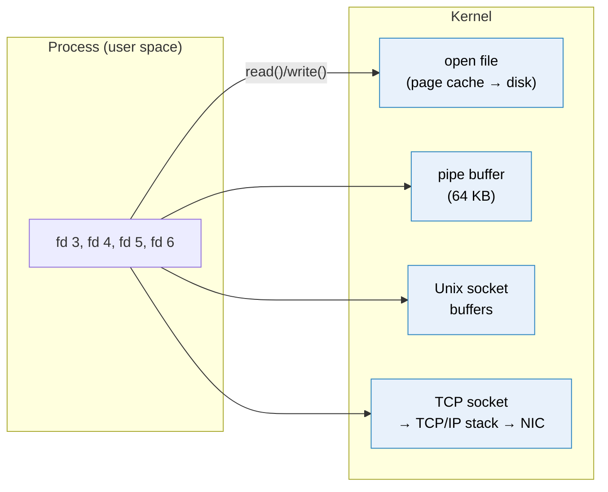
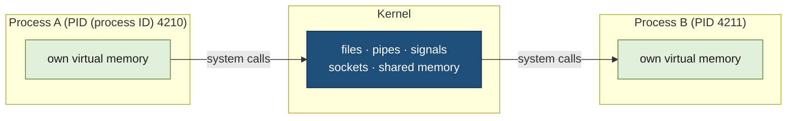

# Inter-process communication

> [!abstract] In one sentence
> Every process has its **own private memory**, so two processes can never just read each other's variables: to exchange anything they must go **through the kernel**, using one of a few mechanisms (**files**, **pipes**, **signals**, **shared memory**, **sockets**), and all of them except signals and shared memory show up in the process as a **file descriptor**.

## Common misconceptions

**Wrong mental model #1:** "Processes on the same machine share memory, so passing data between them is free."

**What's actually true:** the kernel gives each process its own **virtual address space**. Address `0x7ffd1234` in nginx and the same address in gunicorn are **different physical memory**. A process that touches memory it doesn't own gets killed (`Segmentation fault`). Exchanging data is always an explicit act: write it somewhere the kernel lets the other process read it.

**Wrong mental model #2:** "Sockets are for networking. Processes on the same machine talk through files."

**What's actually true:** sockets are the **most common** way local processes talk. **Unix domain sockets** (`/run/app.sock`, `/var/run/docker.sock`, PostgreSQL's `/var/run/postgresql/.s.PGSQL.5432`) are sockets that never touch the network, and a TCP connection to `127.0.0.1` is a network socket that never leaves the machine. Plain files are the **least** suited: no notification, no message boundaries, and races between writer and reader.

| Wrong mental model | What's actually true |
|---|---|
| "Everything is a file" means everything is stored on disk | It means everything is reached through a **file descriptor** (an integer handle) and the same `read()`/`write()` calls: files, pipes, sockets, terminals, devices |
| A socket file like `/run/app.sock` contains the data | It's only an **address** in the filesystem. The data passes through kernel buffers, the file stays 0 bytes |
| Two processes writing to the same file is fine | Without locking or append-only writes, they overwrite each other, and a reader can see a **half-written** file |
| `localhost` TCP is as cheap as a Unix socket | It goes through the whole TCP/IP stack (checksums, congestion control, loopback interface). Unix sockets skip it: roughly 2× faster for small messages |
| Shared memory is the easy way to go fast | It's the fastest, but the processes must **synchronize** themselves (locks, semaphores), and bugs there corrupt data silently |
| `kill` kills a process | `kill` **sends a signal**. Only `SIGKILL` (9) can't be caught. `SIGTERM` (the default) asks politely |

## File descriptors: the common handle

When a process opens something, the kernel returns a small integer, the **file descriptor** (fd), that points to an entry in the kernel's tables. The process then uses it with the same calls whatever is behind it:

```bash
# Every process starts with 0 (stdin), 1 (stdout), 2 (stderr)
ls -l /proc/$(pgrep -o nginx)/fd
# 0 -> /dev/null
# 1 -> /dev/null
# 2 -> /var/log/nginx/error.log
# 6 -> socket:[48213]            ← listening socket on :443
# 7 -> /var/log/nginx/access.log
# 9 -> pipe:[48220]
# 12 -> socket:[51877]           ← a client connection

lsof -p $(pgrep -o nginx)      # same, with more detail
```



The fd count is limited per process (`ulimit -n`, often 1,024 by default for shells, raised for servers). A busy server with 10,000 client connections needs 10,000+ fds: "**Too many open files**" is a socket problem as often as a file problem.

## Build-up: two processes that need to talk

Everything below happens on one Linux machine, between plain processes. The examples are small Python programs (Python's `os`, `signal` and `socket` modules are thin wrappers around the same system calls C uses), so each mechanism can be tried in a terminal and watched with `strace`, `ls -l /proc/PID/fd` and `ss`.

### Stage 0: separate memory, even for a parent and its child

The closest two processes can be is a parent and the child it creates with `fork()`. The child starts as a **copy** of the parent: same code, same variables, same open file descriptors. But it's a copy, not a share:

```python
import os

balance = 100
pid = os.fork()                 # from here on, two processes run this code
if pid == 0:                    # fork() returns 0 in the child
    balance = 0
    print("child sees", balance)
    os._exit(0)

os.waitpid(pid, 0)              # parent: wait for the child to finish
print("parent sees", balance)
```

```text
child sees 0
parent sees 100
```

After `fork()`, the child has its own PID (process ID) and the kernel gives it its own virtual address space. To make forking cheap it doesn't copy memory right away: both processes point at the same physical pages, marked read-only, and a page is copied only when one of them **writes** to it (**copy-on-write**). The child's write to `balance` got it a private copy of that page. The parent never saw it. (Pages, page tables and copy-on-write in detail: [[Virtual memory]].)



So every way of exchanging data is a way of going **through the kernel**: one process makes a system call that puts data (or a notification) somewhere, the other makes a system call that picks it up. The stages below are those ways, from the crudest to the most capable.

### Stage 1: a file both processes know

The simplest shared place is a file. A **writer** process produces records, a **reader** process consumes them:

```python
# writer: appends one record per line
import json, time
with open("/tmp/handoff.jsonl", "a") as f:
    for i in range(1000):
        f.write(json.dumps({"id": i, "payload": "x" * 200}) + "\n")
```

```python
# reader: run from time to time
with open("/tmp/handoff.jsonl") as f:
    for line in f:
        record = json.loads(line)       # sometimes: json.decoder.JSONDecodeError
```

**The problems:**
- **Half-written data.** The reader can open the file while the writer is in the middle of a line, and read half a record
- **Concurrent writers.** Two writers writing at the same time can interleave their bytes or overwrite each other (unless both open with `O_APPEND` and write each record with **one** small `write()` call: the kernel then appends each write as one block)
- **No notification.** The reader doesn't know when there's something new, so it has to **poll** ("has the file changed?")
- **No consumption.** Reading doesn't remove anything. Truncating after reading loses whatever was written in between

Files still work for IPC when used with the right tools:
- **Write to a temporary file, then `rename()` it.** On the same filesystem, `rename()` is **atomic**: a reader opening the name sees either the complete old file or the complete new one, never half of one

```python
import json, os
tmp = "/tmp/handoff.json.tmp"
with open(tmp, "w") as f:
    json.dump(batch, f)
    f.flush()
    os.fsync(f.fileno())  # on disk before it becomes visible under the real name
os.rename(tmp, "/tmp/handoff.json")
```

- **Locks.** `fcntl.flock(f, fcntl.LOCK_EX)` makes other `flock` callers wait until the lock is released. It's **advisory**: a process that doesn't call `flock` ignores it
- **Notification with inotify.** The kernel tells the reader when a file is written or renamed, so it doesn't poll: `inotifywait -m -e close_write,moved_to /tmp`
- **Append-only logs.** A writer only appends; a reader remembers how far it has read (its offset) and continues from there. That's how log shippers tail log files
- **PID files and lock files**: tiny files used as "this process is running, here's its PID" markers (`/run/nginx.pid`)

Files remain the right choice when the data must **survive** both processes. For a live conversation between running processes, the kernel offers better.

### Stage 2: a pipe, a one-way stream

A **pipe** is a buffer inside the kernel with a **write end** and a **read end**, each a file descriptor. The `pipe()` system call creates both; after `fork()` the child inherits them, and parent and child each keep the end they need:

```python
import os

r, w = os.pipe()     # two fds: r (read end), w (write end)
pid = os.fork()

if pid == 0:         # child: reader
    os.close(w)      # IMPORTANT: close the end I don't use
    with os.fdopen(r) as src:
        for line in src: # blocks until data arrives, ends at eof
            print("child got:", line.strip())
    os._exit(0)

os.close(r)           # parent: writer
with os.fdopen(w, "w") as dst:
    for i in range(3):
        dst.write(f"message {i}\n")
# leaving the with block closes w: the child sees end-of-file
os.waitpid(pid, 0)
```

What the kernel guarantees:
- **One direction.** Data goes from the write end to the read end. Two-way needs two pipes
- **Flow control for free.** The buffer holds 64 KiB by default on Linux. When it's full, the writer's `write()` **blocks** until the reader catches up. When it's empty, the reader's `read()` waits
- **End-of-file** when **every** write end is closed. That's why the child closes its copy of `w`: if it didn't, the pipe would still have an open write end (its own), and the `for` loop would wait for ever. Forgetting to close unused ends is the classic pipe bug
- **Broken pipe.** If every read end is closed, the writer gets the `SIGPIPE` signal (or the `EPIPE` error): nobody will ever read what it writes
- **Small writes are atomic.** A single `write()` of up to `PIPE_BUF` bytes (4096 on Linux) is never interleaved with another writer's. Bigger writes can be

A shell pipeline is exactly this. For `ls /etc | wc -l` the shell calls `pipe()`, forks two children, and in each one uses `dup2()` to put the pipe's end on standard output (for `ls`) or standard input (for `wc`) before running the program. Neither program knows it's talking to a pipe:

```bash
strace -f -e trace=pipe2,dup2,execve sh -c '/bin/ls /etc | /usr/bin/wc -l'
```

```text
pipe2([3, 4], 0)                         = 0
[pid 5121] dup2(4, 1)                    = 1      # ls: stdout → write end
[pid 5121] execve("/bin/ls", ["/bin/ls", "/etc"], ...) = 0
[pid 5122] dup2(3, 0)                    = 0      # wc: stdin ← read end
[pid 5122] execve("/usr/bin/wc", ["/usr/bin/wc", "-l"], ...) = 0
```

**Unrelated processes** can't inherit an anonymous pipe. A **named pipe (FIFO, first in first out)** gives the same kind of pipe a name in the filesystem, so any process with permission can open it:

```bash
mkfifo /tmp/jobs.fifo
cat /tmp/jobs.fifo &                     # the reader blocks until a writer opens it
echo '{"job": 42}' > /tmp/jobs.fifo      # the reader prints it
```

Still one-way, still a plain byte stream (no message boundaries: the reader has to split it), and in practice one reader. Good for scripts and parent/child plumbing; too limited for a process that serves many others.

### Stage 3: signals, a tap on the shoulder

Sometimes no data is needed, only an event: "stop", "reload your configuration", "your child has exited". That's a **signal**: a small number the kernel delivers to a process, which interrupts what it's doing and runs a **handler** (or the default action, often "terminate").

```python
import os, signal, time

stop = False

def on_term(signum, frame):
    global stop
    stop = True                         # just set a flag: handlers should do as little as possibleial for Netflix's Java library (2012, maintenance since 2018): commands, thread vs semaphore isolation, properties, Spring Cloud annotations, the dashboard, 

def on_hup(signum, frame):
    print("reloading configuration")

signal.signal(signal.SIGTERM, on_term)
signal.signal(signal.SIGHUP, on_hup)

print("running as PID", os.getpid())
while not stop:
    time.sleep(1)                       # the real work would go here
print("finished current work, cleaning up, exiting")
```

```bash
kill -HUP 5230      # → "reloading configuration", keeps running
kill 5230           # SIGTERM (the default) → finishes cleanly
kill -9 5230        # SIGKILL: gone immediately, the handler never runs
```

| Signal | Usual meaning | Can be caught? |
|---|---|---|
| `SIGTERM` (15) | "Please stop": finish current work, close connections, exit. What `systemctl stop`, Docker and Kubernetes send first | ✅ |
| `SIGINT` (2) | Ctrl-C | ✅ |
| `SIGHUP` (1) | By convention for daemons: **reload config**, reopen log files | ✅ |
| `SIGKILL` (9) | Die **now**. No cleanup, no flushing. What comes after the grace period (Kubernetes: 30 s) | ❌ |
| `SIGCHLD` (17) | A child process exited | ✅ |
| `SIGPIPE` (13) | Wrote to a pipe/socket nobody reads anymore | ✅ |
| `SIGUSR1/2` | App-defined (e.g. dump stats, rotate logs) | ✅ |

Things that bite:
- A signal carries **no data**, and ordinary signals **don't queue**: two `SIGHUP`s sent before the process handles the first can arrive as one
- Sending needs permission: the same user, or root
- **Zombies.** When a child exits, the kernel keeps its exit status until the parent collects it with `wait()`/`waitpid()`. A parent that never does leaves **zombie** entries (`Z` in `ps`). `SIGCHLD` is the kernel telling the parent it's time to collect
- Graceful shutdown depends on handling `SIGTERM`: a process that ignores it is `SIGKILL`ed when the grace period runs out, in the middle of whatever it was doing

Signals have much more to them (masks, process groups and the terminal, PID 1 in containers, async-signal safety): see [[Signals]].

### Stage 4: Unix domain sockets, two-way channels between any processes

What's still missing: **two-way** conversations, between **unrelated** processes, with **many** clients at once, each with its own channel. That's a socket, and between processes on the same machine, a **Unix domain socket**: the socket API ([[Sockets]]) with a filesystem path as the address instead of an IP (Internet Protocol) address and port.

A server process:

```python
import os, socket

path = "/tmp/demo.sock"
if os.path.exists(path):
    os.unlink(path)                     # a socket file left by a previous run blocks bind()

srv = socket.socket(socket.AF_UNIX, socket.SOCK_STREAM)
srv.bind(path)
os.chmod(path, 0o660)                   # who may connect = who may write to this file
srv.listen()

while True:
    conn, _ = srv.accept()              # one new socket per client
    data = conn.recv(1024)
    conn.sendall(b"echo: " + data)
    conn.close()
```

A client process (any program run by a user allowed to write to the path):

```python
import socket
c = socket.socket(socket.AF_UNIX, socket.SOCK_STREAM)
c.connect("/tmp/demo.sock")
c.sendall(b"hello")
print(c.recv(1024))                     # b'echo: hello'
```

```bash
ss -xlp | grep demo.sock
# u_str LISTEN 0 128 /tmp/demo.sock 73112 * 0 users:(("python3",pid=5301,fd=3))
ls -l /tmp/demo.sock
# srw-rw---- 1 me me 0 Oct 10 14:00 /tmp/demo.sock     ← "s" = socket, size 0
socat - UNIX-CONNECT:/tmp/demo.sock                    # talk to it from the shell
```

The file is only a **name**: the data travels through kernel buffers and the file stays 0 bytes. What a Unix socket gives over a pipe, and over TCP (Transmission Control Protocol) on `127.0.0.1`:
- **Both directions**, one connection per client, the same `accept()`/`connect()` model as network servers
- **Faster than localhost TCP**: no TCP/IP processing, no checksums, no ports
- **Access control by file permissions**: only users who can write to the path can connect, while a TCP port on localhost is open to every local user
- **Peer credentials**: the server can ask the kernel who is on the other end (`SO_PEERCRED`: PID, UID (user ID), GID (group ID)), and trust that answer because the kernel supplied it
- **Passing file descriptors** (`SCM_RIGHTS`): a process can send an open fd (a file, a listening socket) to another process, which is how zero-downtime restarts hand a listening socket to the new process

Variants:
- `SOCK_STREAM`: a byte stream, like TCP. `SOCK_DGRAM`: separate messages, like UDP (User Datagram Protocol) but reliable and in order locally. `SOCK_SEQPACKET`: a connection that keeps message boundaries
- `socketpair()`: an already-connected pair of sockets for a parent and child, a two-way pipe
- **Abstract namespace** (Linux only): a name starting with a null byte, with no file at all. Nothing to clean up after a crash, but no file permissions either

Real services on a Linux machine listen on Unix sockets:

| Socket | Who listens | Note |
|---|---|---|
| `/var/run/docker.sock` | Docker daemon | Whoever can write to it controls Docker, which means **root on the host**. Never mount it into a container casually |
| `/var/run/postgresql/.s.PGSQL.5432` | PostgreSQL | `psql` with no `-h` uses it |
| `/run/systemd/journal/socket` | journald | Where services' logs go |
| `/run/dbus/system_bus_socket` | D-Bus | Desktop and system services messaging |
| `/run/containerd/containerd.sock` | containerd | Kubernetes' kubelet talks to the runtime through it |

### Stage 5: shared memory, no copying at all

Every mechanism so far **copies**: the sender's `write()` copies bytes into the kernel, the receiver's `read()` copies them out. For large data exchanged constantly (video frames, a database's page cache), that's too slow. **Shared memory** maps the **same physical pages** into the address spaces of several processes: a write by one is immediately visible to the others, with no system call at all.

The price: the kernel no longer orders anything. Four processes incrementing a counter in shared memory:

```python
from multiprocessing import Process, Value

def work(counter, n):
    for _ in range(n):
        counter.value += 1                       # read, add, write back: three steps, not one

if __name__ == "__main__":
    counter = Value("i", 0, lock=False)          # an int in shared memory, no lock
    procs = [Process(target=work, args=(counter, 100_000)) for _ in range(4)]
    for p in procs: p.start()
    for p in procs: p.join()
    print(counter.value)                         # expected 400000
```

```text
157263
```

Two processes read the same old value, both add one, both write back: one increment is lost, thousands of times. The fix is **synchronization**, here a lock that lives in shared memory too:

```python
counter = Value("i", 0)                          # with a lock (the default)

def work(counter, n):
    for _ in range(n):
        with counter.get_lock():                 # one process at a time
            counter.value += 1
```

Now it prints 400000, and runs much slower, because the processes take turns. Real users of shared memory (databases, browsers, audio servers) design their data so they lock as little as possible.

Where it shows up on Linux:
- **POSIX shared memory** (`shm_open`) appears as files in `/dev/shm`, a memory-backed filesystem: `ls -l /dev/shm`
- **System V shared memory**, the older API, is listed with `ipcs -m`
- `mmap()` of the same file with `MAP_SHARED`, or a shared anonymous mapping inherited across `fork()`
- In containers, Docker gives `/dev/shm` only 64 MB by default: a classic reason PostgreSQL or Chrome crash in a container (`--shm-size`)

### Stage 6: processes on different machines

Everything above relies on the processes sharing **one kernel**. Put the reader on another machine and pipes, FIFOs, signals, Unix sockets and shared memory are all gone. What's left is **network sockets**: the same socket API, with `AF_INET` and an `IP:port` instead of `AF_UNIX` and a path, carried by TCP or UDP. Everything that connects processes across machines, [[HTTP]], database protocols, [[WebSocket]], message brokers ([[Messaging]]), is built on them, and [[Sockets]] is where that continues.

How all these mechanisms fit together on a real server (a reverse proxy, application workers, a database, log shippers and cron jobs on one machine, then many) is in [[Inter-process communication on a web server]].

## Choosing

| Mechanism | Direction | Unrelated processes? | Across machines? | Data | Typical use |
|---|---|---|---|---|---|
| **File** | Any (with care) | ✅ | Via shared FS (NFS, EFS) | Bytes, persistent | Config, logs, handoff with rename |
| **Pipe** | One way | ❌ (parent/child) | ❌ | Byte stream | Shell pipelines, child process output |
| **FIFO** | One way | ✅ | ❌ | Byte stream | Simple script plumbing |
| **Signal** | One way | ✅ (permission) | ❌ | A number | Stop, reload, notify |
| **Kernel message queue** (POSIX `mq_open`) | One way per queue | ✅ | ❌ | Separate messages, priorities | Rare: small messages between local daemons |
| **Shared memory** | Both | ✅ | ❌ | Raw memory | Databases, high-speed data |
| **Unix socket** | **Both** | ✅ | ❌ | Stream or datagrams | Local services: proxy → app, Docker, DB |
| **TCP/UDP socket** | **Both** | ✅ | ✅ | Stream / datagrams | Anything across a network |
| **Message queue / broker** | Both (via broker) | ✅ | ✅ | Messages, persistent | Decoupled services (see [[Messaging]]) |

## In containers and the cloud
- Containers in the same **Kubernetes pod** share a network namespace, so they talk over `localhost`, and can share a Unix socket through a shared volume (sidecars do this)
- Separate containers don't share `/dev/shm` or signals unless configured (`shareProcessNamespace`)
- Between machines on AWS (Amazon Web Services), "IPC" becomes networked services: HTTP behind [[Load balancers]], queues like [[SQS]], shared files on EFS (Elastic File System). Lambda functions can't talk to each other directly at all: they go through an API (application programming interface), a queue or a store

## Practice

> [!example]- After `fork()`, the child sets a variable. Why doesn't the parent see it?
> The child has its own virtual address space. Pages are shared copy-on-write only until one side writes; the write gives the child a private copy. Sharing needs an explicit mechanism (a pipe, a socket, shared memory…).

> [!example]- A parent writes into a pipe and closes its write end, but the child reading the pipe never finishes its loop. Why?
> The child still holds its own copy of the write end (inherited at fork). End-of-file only comes when every write end is closed. The child must close the end it doesn't use.

> [!example]- A reader process sometimes gets half a JSON document from a file another process writes. Fix?
> The writer writes a temporary file in the same directory, then `rename()`s it over the real name (atomic). Or replace the file with a pipe or a socket.

> [!example]- A Unix socket server crashed and now fails to restart with "Address already in use". Why?
> The socket file from the previous run is still there, and `bind()` won't reuse an existing path. Unlink it before binding (after checking no other instance is running), or use the abstract namespace.

> [!example]- Four processes add to a shared counter and the total comes out too low. Why, and fix?
> `+= 1` is read, add, write: two processes can read the same value and one increment is lost. Protect the update with a lock (or use an atomic operation).

> [!example]- A process is stopped with `kill` and loses the work it was doing. What should it do?
> Handle `SIGTERM`: stop taking new work, finish or save the current work, then exit before the sender gives up and sends `SIGKILL`.

> [!example]- What does "everything is a file" really mean?
> Files, pipes, sockets, devices are all reached through file descriptors and the same read/write calls, not that they're stored on disk.

## Easy to get wrong
- Thinking processes can share variables without an explicit mechanism, even parent and child after `fork()`
- Reading a file another process is still writing (use rename, locks, or don't use files)
- Forgetting to close unused pipe ends: the reader never sees end-of-file
- Thinking a socket file holds the data (it's an address, always 0 bytes), and forgetting to remove a stale one before `bind()`
- Assuming `kill` means SIGKILL, and not handling SIGTERM for graceful shutdown
- Not `wait()`ing for children: zombies pile up
- Using shared memory without synchronization: lost updates, silently
- Using localhost TCP for a local service that only one user should reach: Unix sockets + permissions
- Mounting the Docker socket into containers
- Forgetting signals and Unix sockets don't cross machines or containers by default
- "Too many open files": usually sockets, fix `ulimit -n` / `LimitNOFILE` and look for leaks

## Related
- Next:: [[Sockets]], [[WebSocket]]
- Same area:: [[Signals]], [[Virtual memory]] (separate address spaces, copy-on-write), [[Interrupts]]
- Applied:: [[Inter-process communication on a web server]] (nginx, gunicorn, PostgreSQL, cron and log shippers on one machine)
- Across machines:: [[HTTP]], [[Messaging]], [[SQS]]
- Where the machine meets the network:: [[Network interfaces]] (namespaces, loopback)
- Proxies talking to apps:: [[Reverse proxy]]

## Flashcards
#flashcards

Why can't two processes read each other's variables? :: Each process has its own virtual address space. Sharing must go through the kernel
What does a child process share with its parent after fork()? :: A copy of its memory (copy-on-write, so writes stay private) and its open file descriptors
What is copy-on-write after fork()? :: Parent and child share physical pages read-only until one writes; then that page is copied for the writer
What is a file descriptor? :: An integer handle a process uses to read/write any kernel object: file, pipe, socket, terminal, device
What does "everything is a file" mean in Unix? :: Everything is accessed through file descriptors with the same read/write calls
How do you safely replace a file another process reads? :: Write a temp file in the same directory, then rename() it over the old one (atomic)
Is flock() enforced by the kernel on every process? :: No, it's advisory: only processes that also call flock() wait for the lock
What is a pipe? :: A one-way kernel buffer (64 KiB on Linux) between a writer and a reader, usually parent/child processes
When does a pipe reader get end-of-file? :: When every write end is closed, including copies inherited by other processes
How does the shell connect two commands with a pipe? :: pipe(), then fork() each command and dup2() the pipe ends onto stdout/stdin before exec
Which pipe writes are atomic? :: A single write() of at most PIPE_BUF bytes (4096 on Linux)
Anonymous pipe vs named pipe (FIFO)? :: Anonymous: only related processes. FIFO: a filesystem name so unrelated processes can use it
What happens when a pipe's buffer is full? :: The writer's write() blocks until the reader consumes data (built-in flow control)
What is a signal? :: A numbered notification the kernel delivers to a process, carrying no data
SIGTERM vs SIGKILL? :: SIGTERM asks to stop and can be handled (graceful shutdown). SIGKILL kills immediately, can't be caught
What does SIGHUP usually do for daemons? :: Reload configuration / reopen log files
What is a zombie process? :: A child that exited but whose parent hasn't collected its exit status with wait()
What is a Unix domain socket? :: A socket addressed by a filesystem path for local, two-way communication without the TCP/IP stack
Two advantages of a Unix socket over localhost TCP? :: Faster (no TCP/IP), and access controlled by file permissions (plus peer credentials)
What is SO_PEERCRED? :: A socket option that gives a Unix socket server the PID, UID and GID of the connected peer, from the kernel
What is SCM_RIGHTS? :: Passing open file descriptors to another process over a Unix socket
Why can a Unix socket server fail with "Address already in use" after a crash? :: The old socket file still exists; bind() needs it removed first
What is socketpair()? :: A pre-connected pair of Unix sockets, a two-way pipe between related processes
Why is access to /var/run/docker.sock dangerous? :: Controlling Docker means being able to start privileged containers: root on the host
What is shared memory IPC? :: One memory segment mapped into several processes. Fastest, but they must synchronize themselves
Why do concurrent increments in shared memory lose updates? :: += is read, add, write; two processes can read the same value. A lock or atomic operation fixes it
Where does POSIX shared memory appear on Linux? :: As files in /dev/shm (System V segments are listed with ipcs -m)
Which IPC mechanisms work across machines? :: Network sockets (and what's built on them: HTTP, brokers), and shared filesystems
What does "Too many open files" usually mean on a server? :: The process hit its file descriptor limit, often because of many (or leaked) sockets
