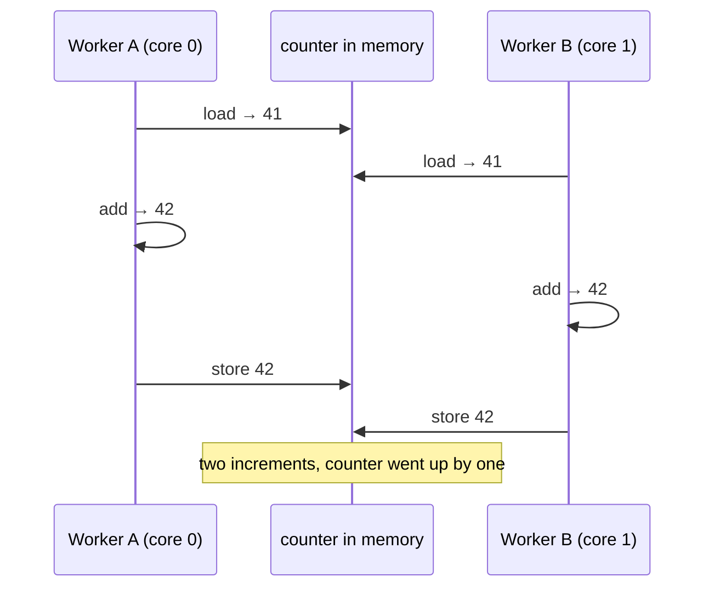
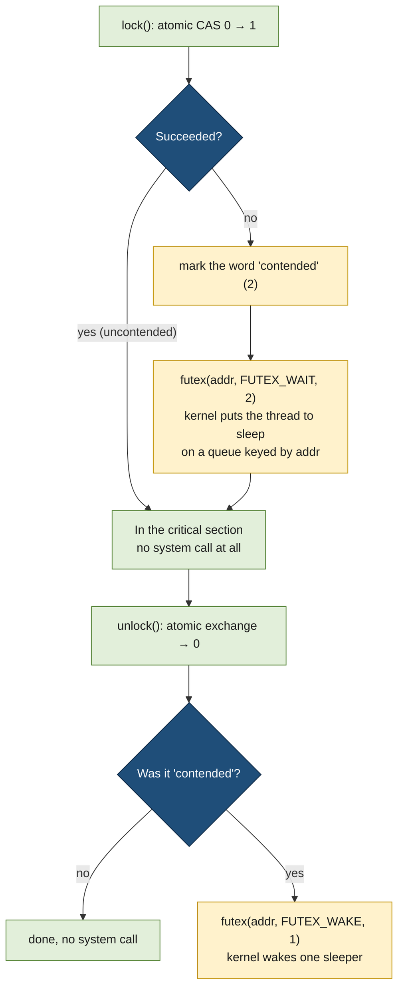
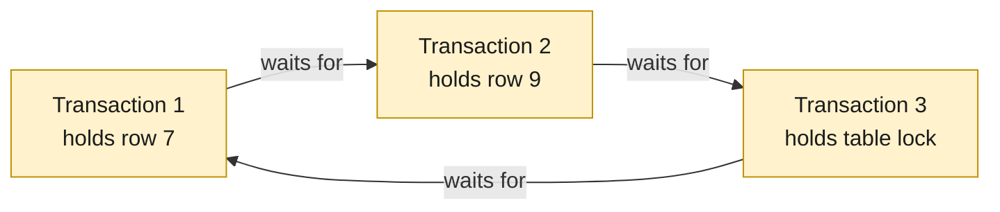

# Locks and synchronization

> [!abstract] In one sentence
> When several threads or processes update the **same memory**, their steps interleave and updates get lost, so the code that touches shared data (the **critical section**) must run one at a time: the CPU (central processing unit) provides **atomic instructions** to build that on, **spinlocks** wait by looping, **mutexes** built on the kernel's **futex** put waiters to sleep, and everything above that (reader-writer locks, semaphores, condition variables, lock managers) is a policy on top, with **deadlocks** and **contention** as the price.

## Build-up: four workers, one counter

[[Inter-process communication]] ends its shared-memory stage with four processes incrementing one counter in shared memory: 400 000 increments, and the total comes out around 157 000. Its fix was "use a lock". This note opens that lock up: what it's made of, what it costs, and what goes wrong with it.

The setting stays the same throughout: a few workers (threads of one process, or separate processes mapping one shared memory segment) updating shared data: a counter, a table of slots, a queue.

### Stage 0: why updates get lost

`counter += 1` looks like one step. On the CPU it's three: **load** the value into a register, **add** one, **store** it back. Two workers on two cores can interleave those steps:



That's a **race condition**: the result depends on the timing of steps between workers. The stretch of code that reads and writes shared data and must not interleave with another worker doing the same is the **critical section**. The goal is **mutual exclusion**: at most one worker inside the critical section at a time.

The same thing happens with threads of one process (they share all memory by definition, see [[Processes and threads]]) and with processes sharing a mapped segment. In Python, threads are partly protected by the GIL (global interpreter lock), which runs one thread's bytecode at a time, but `counter += 1` is still several bytecodes, and a thread switch between them loses updates exactly as above.

### Stage 1: "stop everything else while I update" doesn't work

On a single-core machine, an early kernel could protect its own data by **disabling interrupts** for a few instructions: no timer interrupt means no switch to another task ([[Interrupts]]). Two reasons that can't be the general answer:
- **User programs can't.** Disabling interrupts is a privileged instruction; a process that could do it could freeze the machine
- **Multicore.** Disabling interrupts on core 0 doesn't stop core 1, which is running the other worker at the same instant

What's needed is a primitive that works **across cores**: the hardware itself has to guarantee that a read-modify-write on one memory location can't be split.

### Stage 2: atomic instructions

CPUs provide instructions that read, modify and write a memory location as **one indivisible operation**. The core holds the cache line exclusively for the duration (on x86 the `lock` prefix), so no other core can slip a load or store in between:

| Primitive | What it does atomically | x86 instruction |
|---|---|---|
| **Fetch-and-add** | Add to the value, return the old value | `lock xadd` |
| **Test-and-set** (exchange) | Write a new value, return the old one | `xchg` |
| **CAS (compare-and-swap)** | "If the value is still X, replace it with Y", and say whether it succeeded | `lock cmpxchg` |

ARM CPUs offer the same through load-linked/store-conditional pairs or newer atomic instructions; languages hide the difference. In C11 (the 2011 C standard) they're in `<stdatomic.h>`:

```c
// counter.c — gcc -O0 -pthread counter.c -o counter
// (-O0 so the compiler doesn't merge the plain increments into one add)
#include <pthread.h>
#include <stdatomic.h>
#include <stdio.h>

#define N 1000000
long plain = 0;
atomic_long atomic_count = 0;

void *work(void *arg) {
    for (int i = 0; i < N; i++) {
        plain++;                              // load, add, store: can interleave
        atomic_fetch_add(&atomic_count, 1);   // one indivisible instruction
    }
    return NULL;
}

int main(void) {
    pthread_t t[4];
    for (int i = 0; i < 4; i++) pthread_create(&t[i], NULL, work, NULL);
    for (int i = 0; i < 4; i++) pthread_join(t[i], NULL);
    printf("plain:  %ld\natomic: %ld\n", plain, atomic_count);
}
```

```text
plain:  1874203
atomic: 4000000
```

For a single counter, an atomic add is the whole solution: no lock at all. **CAS** is the general tool for anything more than adding: read the value, compute the new one, and swap it in only if nobody changed it meanwhile; if somebody did, retry:

```c
long old = atomic_load(&value);
while (!atomic_compare_exchange_weak(&value, &old, old * 2))
    ;   // failed: 'old' now holds the current value, compute again and retry
```

But a critical section usually touches **several** fields (move an item from one list to another, update a balance and a history entry). One atomic instruction can't cover that. It can, however, build a **lock**.

### Stage 3: a spinlock, the simplest lock

A lock is one word in memory: 0 = free, 1 = held. To take it, atomically write 1 and look at what was there before: if it was 0, I own the lock; if it was 1, someone else does, so try again:

```c
#include <stdatomic.h>

typedef struct { atomic_flag held; } spinlock_t;    // initialise with { ATOMIC_FLAG_INIT }

static inline void spin_lock(spinlock_t *l) {
    while (atomic_flag_test_and_set_explicit(&l->held, memory_order_acquire))
        __builtin_ia32_pause();     // x86 "pause": I'm spinning, ease off the pipeline
}

static inline void spin_unlock(spinlock_t *l) {
    atomic_flag_clear_explicit(&l->held, memory_order_release);
}
```

```c
spin_lock(&slots_lock);
slots[i].owner = me;          // several fields, updated together
slots[i].since = now;
free_slots--;
spin_unlock(&slots_lock);
```

A waiting worker **spins**: it loops on the CPU until the lock is free. That's ideal when the critical section is a handful of instructions: waiting a few hundred nanoseconds by spinning is cheaper than anything involving the kernel. It's bad when:
- **The holder is descheduled.** If the worker holding the lock is preempted by the scheduler (its time slice ended, *[[CPU scheduling]]*), every waiter spins for its whole time slice doing nothing useful
- **Many waiters** hammer the same cache line with atomic writes, each one stealing the line from the others (Stage 9)
- **The critical section is long** or can block (I/O (input/output), a page fault): the waiters burn CPU the whole time

Practical spinlocks reduce the damage: spin on a plain read until the lock *looks* free and only then try the atomic (test-and-test-and-set), back off with increasing delays, and after a while give up and **sleep** instead. Inside the Linux kernel, spinlocks protect short sections and disable preemption while held; in user space, plain spinlocks are only for very short sections.

### Stage 4: memory ordering, the subtle part

The `memory_order_acquire` and `memory_order_release` above aren't decoration. Both the **compiler** and the **CPU** reorder memory accesses when it doesn't change the result *for a single thread*: the compiler keeps values in registers and moves loads earlier; the CPU buffers stores and lets later loads go ahead of them. Another core can then see the writes in a different order than the program wrote them.

```c
int data;
atomic_int ready = 0;

// writer
data = 42;
atomic_store_explicit(&ready, 1, memory_order_release);   // everything before is visible first

// reader
while (!atomic_load_explicit(&ready, memory_order_acquire))
    ;
printf("%d\n", data);     // guaranteed 42
```

- A **release** store guarantees every write before it is visible to whoever sees the store
- An **acquire** load guarantees nothing after it is done before it
- Taking a lock is an acquire, releasing it is a release: that's why data written inside a critical section is visible to the next owner of the lock. Locks from a library (`pthread_mutex_lock`) include these **memory barriers**; hand-made flags don't unless written this way

`volatile` in C only stops the compiler from caching a variable in a register. It doesn't make operations atomic and doesn't stop the CPU from reordering, so it isn't a synchronization tool.

### Stage 5: sleeping instead of spinning (futex and mutexes)

For anything longer than a few instructions, a waiter should **sleep** and be woken when the lock is released. Sleeping needs the kernel (only the kernel can take a thread off the CPU and wake it later), but a system call on every lock and unlock would be slow, and most of the time the lock is free.

Linux's answer is the **futex** ("fast user-space mutex"): the lock is still a word in the process's memory, and the kernel is only involved when there's **contention**.



The `FUTEX_WAIT` call checks atomically, inside the kernel, that the word still holds the expected value before sleeping, so a wake-up that happens between "I saw it held" and "I go to sleep" isn't lost.

glibc's `pthread_mutex_t` is built this way. Running the counter program with a mutex under `strace`:

```bash
strace -f -e trace=futex ./mutex_counter
```

```text
[pid  7012] futex(0x5612a4c0e040, FUTEX_WAIT_PRIVATE, 2, NULL <unfinished ...>
[pid  7011] futex(0x5612a4c0e040, FUTEX_WAKE_PRIVATE, 1) = 1
[pid  7012] <... futex resumed>)        = 0
...
```

Run it with **one** thread and there are no `futex` calls at all: the uncontended path is a single atomic instruction. `strace -c -f` counts them, which makes contention measurable: thousands of `futex` calls per second mean workers are queueing on a lock.

`_PRIVATE` means the futex is private to one process (the kernel can key it by virtual address). A lock shared between processes uses the non-private form, keyed by the underlying physical page ([[Virtual memory]]).

### Stage 6: locks between processes

Threads share a heap, so a mutex is just a variable. Separate processes need the lock to live somewhere both can reach:

**A mutex in shared memory.** The same `pthread_mutex_t`, placed in a shared mapping and marked process-shared:

```c
// shared_mutex.c — gcc -O2 -pthread shared_mutex.c -o shared_mutex
#include <pthread.h>
#include <stdio.h>
#include <sys/mman.h>
#include <sys/wait.h>
#include <unistd.h>

struct shared { pthread_mutex_t lock; long counter; };

int main(void) {
    struct shared *s = mmap(NULL, sizeof *s, PROT_READ | PROT_WRITE,
                            MAP_SHARED | MAP_ANONYMOUS, -1, 0);   // survives fork, shared
    pthread_mutexattr_t a;
    pthread_mutexattr_init(&a);
    pthread_mutexattr_setpshared(&a, PTHREAD_PROCESS_SHARED);
    pthread_mutex_init(&s->lock, &a);

    for (int p = 0; p < 4; p++) {
        if (fork() == 0) {
            for (int i = 0; i < 1000000; i++) {
                pthread_mutex_lock(&s->lock);
                s->counter++;
                pthread_mutex_unlock(&s->lock);
            }
            _exit(0);
        }
    }
    while (wait(NULL) > 0)
        ;
    printf("%ld\n", s->counter);     // 4000000, every time
}
```

**Semaphores.** A semaphore is a counter with two operations: *wait* (decrement, sleep if it would go below zero) and *post* (increment, wake a sleeper). Initialised to 1 it's a lock; initialised to N it limits concurrency to N ("at most 3 workers in the export step"). POSIX (Portable Operating System Interface) named semaphores (`sem_open("/exports", O_CREAT, 0600, 3)`) appear as files in `/dev/shm` (`/dev/shm/sem.exports`); the older System V semaphores (`semget`) are listed with `ipcs -s`. Python's `multiprocessing.Lock` is a POSIX semaphore underneath, which is why the counter fix in [[Inter-process communication]] works across processes.

**File locks.** The kernel can lock a file on behalf of a process:
- `flock(fd, LOCK_EX)` locks the whole file; `fcntl(F_SETLK)` locks byte ranges
- Both are **advisory**: they only stop processes that also ask for the lock; a plain `write()` ignores them
- The kernel **releases them automatically** when the process closes the file or dies, a property the other mechanisms lack (Stage 10)

A common use is making sure a cron job never runs twice at once:

```bash
flock -n /var/lock/report.lock -c '/usr/local/bin/build-report' || echo "previous run still going"
```

```bash
$ lslocks
COMMAND          PID  TYPE SIZE MODE  M START END PATH
flock           8120 FLOCK   0B WRITE 0     0   0 /var/lock/report.lock
$ cat /proc/locks
1: FLOCK  ADVISORY  WRITE 8120 00:1a:1311 0 EOF
```

### Stage 7: more shapes than "one at a time"

**Reader-writer locks.** Many workers only *read* the slot table; one occasionally writes. A plain mutex makes readers wait for each other for no reason. A reader-writer lock (`pthread_rwlock_t`) allows **many readers or one writer**. The trade-off is fairness: with a steady stream of readers, a writer can wait for ever unless the lock gives writers priority (which then makes readers wait).

**Condition variables.** A worker waiting for the queue to have an item shouldn't spin on "is it empty?". A condition variable lets it sleep until another worker signals that something changed:

```c
pthread_mutex_lock(&q->lock);
while (q->count == 0)                        // 'while', not 'if'
    pthread_cond_wait(&q->not_empty, &q->lock);   // atomically: release lock + sleep; relock on wake
item = q->items[--q->count];
pthread_mutex_unlock(&q->lock);

// producer
pthread_mutex_lock(&q->lock);
q->items[q->count++] = item;
pthread_cond_signal(&q->not_empty);
pthread_mutex_unlock(&q->lock);
```

- The condition is checked **under the mutex**, and `pthread_cond_wait` releases the mutex and sleeps **in one step**. Checking without the lock and then sleeping gives a **lost wake-up**: the producer signals in the gap, nobody is waiting yet, and the consumer sleeps for ever
- The `while` handles **spurious wake-ups** and the case where another consumer took the item first

**Semaphores as counters**, from Stage 6, are the third shape: "N of these at a time" (connection slots, buffers).

### Stage 8: layers of locks in a larger program

A program with lots of shared state (a database is the classic example) doesn't pick one kind of lock. It layers them by **how long they're held** and **what they protect**:

| Layer | Protects | Held for | Built from | If a worker must wait |
|---|---|---|---|---|
| Atomic operations | One counter or flag | One instruction | CPU atomics | Never waits |
| Spinlocks | A few fields in one structure | Tens of instructions | Test-and-set + backoff | Spins briefly |
| Lightweight reader/writer locks | A shared structure (a buffer's header, a hash partition, the log buffer) | Microseconds | Atomics + futex or semaphores | Sleeps; no deadlock detection, so code takes them in a fixed order |
| Heavyweight lock manager | Objects users see (a table, a row) | Up to a whole transaction | A shared hash table of locks, protected by the layers below | Queues; **deadlock detection**, lock timeouts, visible in monitoring views |

The lower layers are fast and dumb: the code that uses them is written so they can't deadlock. The top layer serves arbitrary user requests in arbitrary orders, so it **will** see deadlocks, and has to detect and break them. How PostgreSQL implements exactly these layers (spinlocks, LWLocks (lightweight locks), the lock manager) is in [[PostgreSQL architecture]].

### Stage 9: when locks go wrong

**Deadlock.** Worker 1 holds lock A and wants B; worker 2 holds B and wants A. Neither can move:

```python
import threading, time

a, b = threading.Lock(), threading.Lock()

def one():
    with a:
        time.sleep(0.1)
        with b:
            print("one done")

def two():
    with b:
        time.sleep(0.1)
        with a:
            print("two done")

threading.Thread(target=one).start()
threading.Thread(target=two).start()       # hangs for ever, 0 % CPU
```

Four conditions together make a deadlock possible: **mutual exclusion** (a lock has one owner), **hold and wait** (a worker holds one lock while waiting for another), **no preemption** (a lock can't be taken away), **circular wait** (a cycle of workers each waiting for the next). Breaking any one prevents it:
- **Lock ordering**: every worker takes locks in the same global order (always A before B). This breaks circular wait, and is the standard rule for the lower layers above
- **Try-lock and timeouts**: `pthread_mutex_trylock` / `pthread_mutex_timedlock`, then release everything and retry. Breaks hold-and-wait, at the cost of retries
- **Detection**: keep a **wait-for graph** (who waits for whom), look for a cycle when a wait lasts too long, and abort one worker (the "victim")



A cycle in the wait-for graph is a deadlock; aborting any one transaction in the cycle frees the others.

**Livelock**: workers keep reacting to each other (both back off, both retry, both collide again) and nobody progresses, though everyone is busy. Random backoff fixes it.

**Starvation**: a worker never gets the lock because others always win (a writer behind endless readers). Fair (queued) locks fix it at some throughput cost.

**Priority inversion**: a low-priority worker holds a lock, a high-priority worker waits for it, and a medium-priority worker keeps the low one from running, so the high-priority one effectively runs last. Mars Pathfinder's resets in 1997 were this. The fix is **priority inheritance** (the holder temporarily gets the waiter's priority, `PTHREAD_PRIO_INHERIT`).

### Stage 10: contention, the cost of a correct lock

A correct lock can still make the program slow. Memory moves between cores in **cache lines** of 64 bytes, and cores keep their caches coherent with a protocol (MESI (Modified, Exclusive, Shared, Invalid) and its variants): before a core writes a line, every other core's copy is invalidated.

- **Cache-line bouncing**: every lock and unlock is a write to the lock word, so the line holding it shuttles between cores. With 32 cores on one lock, most time goes to moving that line around, and adding cores makes it slower
- **False sharing**: two **unrelated** variables in the same 64-byte line, each written by a different core, bounce the line just as badly although no data is shared. The fix is padding or alignment:

```c
struct per_worker {
    long hits;
    char pad[64 - sizeof(long)];   // each worker's counter on its own cache line
} counters[4];                     // or: _Alignas(64) long hits;
```

- **Granularity**: one big lock is simple but serializes everything. Finer locks (one per hash bucket, one per slot) let workers proceed in parallel, at the cost of more locks to order correctly. **Partitioned locks**, a fixed number of locks chosen by hashing the key, are the usual middle ground
- **Lock-free structures** use CAS loops instead of locks (a stack whose push is "CAS the head pointer"). No worker ever blocks another, but they're hard to get right: the **ABA problem** (the value changed from A to B and back to A, and the CAS can't tell) and safe memory reclamation need careful design. Most code should use a well-tested library or a lock

`perf` shows contention: `perf top` with most samples in `native_queued_spin_lock_slowpath` (kernel) or a user-space spin loop, or `perf stat -e cache-misses` climbing with core count; `perf c2c` finds false sharing directly.

### Stage 11: when the lock holder dies

A thread can't die on its own: if it crashes, the whole process goes. But a **process** can die (`SIGKILL`, the OOM (out of memory) killer, a segmentation fault, see [[Signals]]) while holding a lock in **shared memory**, and the lock word stays "held" for ever. Every other process eventually blocks on it.

The options:
- **File locks** don't have this problem: the kernel drops them when the process exits
- **Robust mutexes** (`pthread_mutexattr_setrobust(&a, PTHREAD_MUTEX_ROBUST)`): the kernel tracks which process holds the futex; when it dies, the next `pthread_mutex_lock` returns **`EOWNERDEAD`**. The new owner must repair the shared data and call `pthread_mutex_consistent()`, or mark the lock unusable
- **But the data may be half-updated.** The dead process was in the middle of a critical section: two of three fields written. Freeing the lock doesn't fix the data. That's why some systems choose the blunt option: when any worker dies abnormally, **stop all workers, throw away the shared memory, and start again** from durable state on disk (a log replayed after a crash, as in [[Journaling]]). PostgreSQL does exactly that (see [[PostgreSQL architecture]])

**Lock files** made with `open(O_CREAT | O_EXCL)` ("if the file exists, someone is running") don't clean up either: a crashed process leaves the file, and nothing runs again until someone deletes it. Store the PID (process ID) in it and check whether that process still exists, or use `flock` on the file instead.

## Advanced problems

### 1. Lost updates that only show up under load
**Symptom:** counters slightly off, a slot handed to two workers, an inventory going negative, never reproducible on a laptop. **Cause:** an unprotected read-modify-write; on one core or with little load the interleaving is rare. **Fix:** an atomic operation for single values, a lock (or a database transaction with the right isolation) for multi-field updates. Thread sanitizers (`gcc -fsanitize=thread`) find data races in tests.

### 2. A service hangs with 0 % CPU
**Symptom:** requests stop being answered, the process is alive, CPU idle, threads all sleeping. **Cause:** a deadlock: two code paths taking the same locks in different orders. **Fix:** dump every thread's stack (`gdb -p <pid>` then `thread apply all bt`, `py-spy dump --pid <pid>` for Python, `jstack` for Java) and look for threads waiting on locks held by each other. Then impose a lock order, or narrow the critical sections so one path doesn't need both locks.

### 3. CPU at 100 %, throughput falling
**Symptom:** adding cores or workers makes the program slower; `top` shows high user or system time; `perf` shows most samples in a spin loop or in the kernel's futex/spinlock code. **Cause:** heavy contention on one lock (or spinning while the holder is descheduled). **Fix:** shorter critical sections, finer or partitioned locks, per-worker data merged occasionally (per-CPU counters), sleeping locks instead of spinning for long sections.

### 4. Two "independent" counters slow each other down
**Symptom:** per-worker counters that share nothing logically still scale badly; `perf c2c` reports hot cache lines with several writers. **Cause:** false sharing: the counters sit in the same 64-byte cache line. **Fix:** pad or align each worker's data to its own cache line.

### 5. Everything blocks after one worker was killed
**Symptom:** after the OOM killer (or `kill -9`) removed one worker, the others hang on a lock in shared memory. **Cause:** the dead process held a non-robust lock; nobody will ever release it. **Fix:** robust mutexes with repair logic, or a supervisor that restarts all workers and rebuilds shared state when any one dies abnormally; prefer file locks where the kernel's automatic release is enough.

### 6. A job never runs again: "already running"
**Symptom:** a cron job logs "lock file exists, exiting" every night since a crash a week ago. **Cause:** a lock file created with `O_EXCL` survived the crash. **Fix:** use `flock` (released automatically on exit), or write the PID into the lock file and treat it as stale when that process no longer exists.

## Practice

> [!example]- A single shared counter is incremented by 8 threads. Lock or atomic?
> An atomic fetch-and-add: one instruction, no lock, no sleeping. Locks are for critical sections that touch several fields.

> [!example]- Why can't a user-space program protect a critical section by disabling interrupts?
> It's a privileged instruction (it would let any program freeze the machine), and on a multicore CPU it only affects one core, while the other worker runs on another core.

> [!example]- A program locks and unlocks a mutex a million times. `strace -c` shows zero futex calls. How?
> The mutex was never contended: the futex fast path takes and releases the lock with an atomic instruction in user space. The kernel is only called when a thread has to sleep or be woken.

> [!example]- A consumer does `if (count == 0) pthread_cond_wait(...)`, and sometimes takes an item from an empty queue. Why?
> Spurious wake-ups, or another consumer took the item between the signal and this consumer re-acquiring the mutex. The condition must be re-checked in a `while` loop.

> [!example]- Thread 1 transfers money from account A to B (locks A then B), thread 2 from B to A (locks B then A). What happens, and the fix?
> They can deadlock (circular wait). Lock accounts in a global order, for example by account ID, whatever the direction of the transfer.

> [!example]- Why would a database restart all its worker processes when one of them crashes, instead of just freeing that worker's locks?
> The dead worker may have been halfway through updating shared memory. Freeing its locks would let others read corrupted structures. Restarting from the on-disk state (and replaying the log) is the only safe way back to consistent shared memory.

## Easy to get wrong

- `x += 1` (or `x++`) is three steps, not one; with the GIL too
- `volatile` isn't a lock and isn't atomic; it doesn't order memory between cores
- A hand-made flag without acquire/release ordering can publish a pointer before the data it points to
- Spinlocks are for tiny critical sections; spinning while the holder is descheduled wastes whole time slices
- An uncontended mutex is cheap (no system call); a contended one is where the cost is
- File locks (`flock`, `fcntl`) are advisory: a process that doesn't ask for the lock isn't stopped
- Checking a condition outside the mutex, then sleeping: the wake-up can be lost. Always `while` + `pthread_cond_wait` under the lock
- Taking locks in different orders on different code paths is how deadlocks are born
- A lock in shared memory isn't released when its holder process dies (unless it's robust), and even then the data may be half-written
- Lock files made with `O_EXCL` outlive crashes; `flock` doesn't
- More threads on one hot lock make a program slower, not faster

## Related
- Builds on:: [[Inter-process communication]] (shared memory and the lost-update demo), [[Processes and threads]]
- Hardware side:: [[Interrupts]] (why disabling them isn't enough), [[Virtual memory]], [[Memory pages]] (shared mappings, process-shared futexes)
- When a holder dies:: [[Signals]] (SIGKILL, crashes), [[Journaling]] (recovering from the log)
- Applied:: [[PostgreSQL architecture]] (spinlocks, LWLocks, the lock manager, restart on backend crash)
- Next:: *[[CPU scheduling]]* (why a preempted lock holder hurts)
- Area:: [[Operating systems]]

## Flashcards
#flashcards

What is a race condition? :: A result that depends on the timing of interleaved steps between concurrent workers, like two read-add-write increments losing one update
What is a critical section? :: Code that reads and writes shared data and must not run concurrently with another worker doing the same
Why is counter++ not safe across threads? :: It's load, add, store; two workers can load the same value and one increment is lost
Why can't disabling interrupts provide mutual exclusion today? :: It's privileged, and on multicore it only stops one core while others keep running
What is compare-and-swap (CAS)? :: An atomic instruction: replace a value with a new one only if it still equals an expected value, and report success
What is fetch-and-add? :: An atomic instruction that adds to a memory value and returns the old value (lock xadd on x86)
How is a spinlock built? :: An atomic test-and-set on a lock word in a loop: set to 1, if the old value was 0 you own it, otherwise spin
When are spinlocks a bad choice? :: Long critical sections, many waiters, or when the holder can be descheduled: waiters burn CPU
What do acquire and release ordering guarantee? :: Release: earlier writes are visible before the store. Acquire: later accesses aren't done before the load. Locks use them
Is volatile enough for synchronization in C? :: No: it's not atomic and doesn't prevent CPU reordering; use atomics or locks
What is a futex? :: A lock word in user memory; locking/unlocking is an atomic in user space, and the kernel (futex wait/wake) is only called on contention
Why does an uncontended mutex cost no system call? :: The futex fast path takes it with one atomic instruction; the kernel is only needed to sleep or wake
How do two processes share a pthread mutex? :: Put it in shared memory (MAP_SHARED) and initialise it with PTHREAD_PROCESS_SHARED
What is a semaphore? :: A counter with wait (decrement, sleep if below zero) and post (increment, wake); 1 = lock, N = at most N concurrent
Where do POSIX named semaphores appear on Linux? :: As files in /dev/shm (sem.<name>); System V semaphores with ipcs -s
flock/fcntl locks: advisory or mandatory? :: Advisory: only processes that also request the lock are blocked
What happens to flock locks when the process dies? :: The kernel releases them automatically
What does a reader-writer lock allow? :: Many readers at once or a single writer
What is a lost wake-up with condition variables? :: The signal happens between checking the condition and going to sleep, so the waiter sleeps for ever; avoided by checking under the mutex with pthread_cond_wait
Why wait on a condition variable in a while loop? :: Spurious wake-ups, and another waiter may have consumed the change first
The four conditions for deadlock? :: Mutual exclusion, hold and wait, no preemption, circular wait
Most common way to prevent deadlocks? :: A global lock order: every code path takes locks in the same order
How do databases deal with deadlocks between transactions? :: A wait-for graph; a cycle means deadlock, and one transaction (the victim) is aborted
What is livelock? :: Workers keep reacting to each other (back off, retry, collide) without progress
What is priority inversion and its fix? :: A high-priority task waits on a lock held by a low-priority one that a medium task keeps from running; fixed with priority inheritance
What is cache-line bouncing? :: A frequently written lock word moving between cores' caches on every lock/unlock, making contention expensive
What is false sharing? :: Unrelated variables in one 64-byte cache line written by different cores, causing the same bouncing; fixed with padding
What is a partitioned lock? :: A fixed set of locks chosen by hashing the key, between one global lock and one lock per object
What is the ABA problem? :: A CAS succeeds because the value went A → B → A, though the structure changed in between
What does EOWNERDEAD mean? :: A robust mutex's previous owner died holding it; the new owner must repair the data and call pthread_mutex_consistent
Why do some systems restart all workers when one crashes? :: It may have died mid-update in shared memory; only restarting from durable state guarantees consistency
Why are O_EXCL lock files risky? :: A crashed process leaves the file behind and blocks future runs; flock is released automatically
How do you find a deadlock in a hung process? :: Dump all thread stacks (gdb thread apply all bt, py-spy dump, jstack) and look for threads waiting on each other's locks
