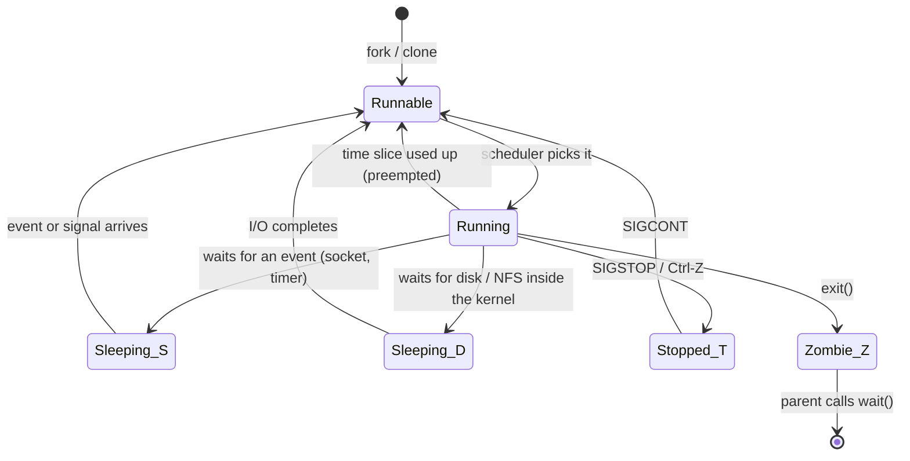
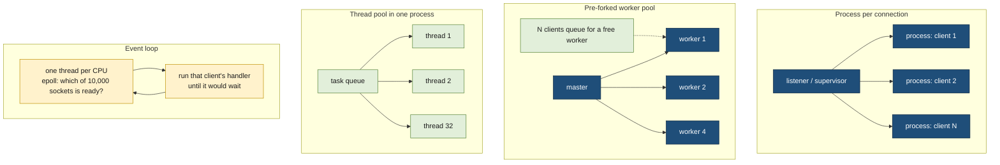

# Processes and threads

> [!abstract] In one sentence
> A **process** is a running program as the kernel tracks it: its own address space, open files, user identity and PID (process ID). A **thread** is one line of execution inside a process: several threads share the process's memory and files but each has its own stack and CPU (central processing unit) registers. How a server spreads its work over processes and threads decides its memory use, its crash blast radius and how many clients it can serve.

## Build-up: one program, run many times

`/usr/bin/sleep` is a **program**: a file on disk, some machine code and data, doing nothing. Run it three times in three terminals and there are three **processes**, each executing that same code, each with its own state:

```bash
sleep 300 & sleep 300 & sleep 300 &
ps -o pid,ppid,stat,rss,cmd -C sleep
```

```text
    PID    PPID STAT   RSS CMD
  41210   40988 S     1024 sleep 300
  41211   40988 S     1024 sleep 300
  41212   40988 S     1024 sleep 300
```

Three PIDs, one PPID (parent process ID: the shell that started them), state `S` (sleeping). The stages below follow what the kernel keeps for each one, how they're created, and what changes when work is split into threads instead.

### Stage 1: what the kernel keeps per process

For every process (and every thread, see Stage 6) the Linux kernel keeps a structure called `task_struct`. The parts that matter to an operator:

| Part | What it holds | Where to look |
|---|---|---|
| Identity | PID, PPID, process group and session (see [[Signals]]) | `/proc/PID/status` (`Pid`, `PPid`) |
| Address space | Page tables mapping its private virtual memory ([[Virtual memory]]) | `/proc/PID/maps` |
| Open files | The file descriptor table: files, pipes, sockets ([[Inter-process communication]]) | `/proc/PID/fd/` |
| Credentials | UID (user ID), GID (group ID), capabilities | `/proc/PID/status` (`Uid`, `Gid`, `Cap*`) |
| Working directory and root | Where relative paths start | `/proc/PID/cwd`, `/proc/PID/root` |
| Signal state | Handlers, blocked and pending signals | `/proc/PID/status` (`Sig*`) |
| Scheduling state | Run state, priority, CPU it last ran on, time used | `/proc/PID/stat`, `/proc/PID/sched` |
| Limits | Max open files, max processes… | `/proc/PID/limits` |
| Saved CPU registers | Where to resume when it gets the CPU back | (inside the kernel) |

```bash
grep -E '^(Name|State|Pid|PPid|Uid|Threads|VmRSS|voluntary|nonvoluntary)' /proc/41210/status
```

```text
Name:   sleep
State:  S (sleeping)
Pid:    41210
PPid:   40988
Uid:    1000    1000    1000    1000
VmRSS:      1024 kB
Threads:        1
voluntary_ctxt_switches:        2
nonvoluntary_ctxt_switches:     0
```

So a process is a **container of resources** (memory, files, identity) plus **at least one thread of execution** running inside it.

### Stage 2: the process tree

Every process except the first is created by another process. PID 1 (`systemd` on most distributions, or the entrypoint in a container) is started by the kernel at boot, and everything descends from it:

```bash
pstree -p -a 40988 | head
```

```text
bash,40988
  ├─sleep,41210 300
  ├─sleep,41211 300
  └─sleep,41212 300
```

```bash
pstree -p 1 | head -6
```

```text
systemd(1)─┬─sshd(812)───sshd(40980)───sshd(40987)───bash(40988)─┬─sleep(41210)
           │                                                       ├─sleep(41211)
           │                                                       └─sleep(41212)
           ├─nginx(1102)─┬─nginx(1103)
           │             └─nginx(1104)
           └─postgres(1350)─┬─postgres(1352)
```

The tree matters for three things: who gets told when a child exits (its parent, through `SIGCHLD`), who adopts orphans (PID 1 or a subreaper), and which processes a signal to a process group reaches. All three are in [[Signals]].

### Stage 3: creating a process is two steps (fork, then exec)

On Unix-like systems a process isn't created "running program X" in one call. It's two:
1. **`fork()`**: the calling process is duplicated. The child is a copy of the parent: same code, same memory (copy-on-write, see [[Virtual memory]]), same open file descriptors, same working directory. The only difference is the return value: 0 in the child, the child's PID in the parent
2. **`exec()`** (`execve()`): the child **replaces** its program with another one. Its memory is thrown away and loaded from the new program file; its PID, open file descriptors (except those marked close-on-exec), working directory and credentials stay

```python
import os

pid = os.fork()
if pid == 0:
    # child: still running this Python program
    fd = os.open("/tmp/ls-output.txt", os.O_WRONLY | os.O_CREAT | os.O_TRUNC, 0o644)
    os.dup2(fd, 1)                      # stdout (fd 1) now points to the file
    os.execvp("ls", ["ls", "-l", "/etc"])   # becomes ls; ls writes to "stdout", i.e. the file
    # never reached: exec doesn't return on success

_, status = os.waitpid(pid, 0)          # parent: wait for the child, collect its exit status
print("ls exited with", os.waitstatus_to_exitcode(status))
```

**Why two steps?** Because the gap between them is where the child is set up **before** the new program starts, using ordinary calls: redirecting standard output (`dup2`, as above), changing directory, dropping privileges, joining a new process group, closing file descriptors. That's exactly what a shell does for `ls -l /etc > /tmp/ls-output.txt`, and what a service manager does before starting a daemon. The new program doesn't need to know about any of it.

Watching a shell do it:

```bash
strace -f -e trace=clone,clone3,execve,dup2,wait4 bash -c 'ls /etc > /dev/null'
```

```text
execve("/usr/bin/bash", ["bash", "-c", "ls /etc > /dev/null"], ...) = 0
clone(child_stack=NULL, flags=CLONE_CHILD_CLEARTID|CLONE_CHILD_SETTID|SIGCHLD, ...) = 41377
[pid 41377] dup2(3, 1)                  = 1
[pid 41377] execve("/usr/bin/ls", ["ls", "/etc"], ...) = 0
[pid 41376] wait4(-1, [{WIFEXITED(s) && WEXITSTATUS(s) == 0}], 0, NULL) = 41377
```

On Linux, `fork()` is implemented with the more general `clone()` system call (Stage 6). Variants exist for speed: `vfork()` and `posix_spawn()` skip copying the page tables when the child is going to `exec()` right away, which matters when a 20 GiB process starts a small helper.

**Ending.** A process ends by calling `exit()` (or returning from `main`), or by being killed by a signal. Its memory and file descriptors are released immediately, but a small entry with its **exit status** stays until the parent collects it with `wait()`/`waitpid()`. Until then it's a **zombie** (`Z`); if the parent dies first, the child is adopted by PID 1 or a subreaper. Zombies, orphans and `SIGCHLD` are covered in [[Signals]].

### Stage 4: process states, and what load average really counts

A process isn't always running. With 2 CPUs and 300 processes, at most 2 are executing at any instant; the rest are waiting for something. `ps` shows the state in the `STAT` column:

| State | Meaning | Typical cause |
|---|---|---|
| `R` | Running, or runnable and waiting for a CPU | Busy computing |
| `S` | Interruptible sleep: waiting for an event, can be woken by a signal | Waiting for a socket, a timer, a child, input |
| `D` | **Uninterruptible** sleep: waiting inside the kernel, signals (even `SIGKILL`) wait | Disk I/O (input/output), an NFS (Network File System) server that doesn't answer, some driver operations |
| `T` | Stopped | `SIGSTOP`/Ctrl-Z, or a debugger |
| `Z` | Zombie: exited, waiting for its parent to collect the status | Parent not calling `wait()` |
| `I` | Idle kernel thread | Normal, ignore |

Extra letters after the state: `s` session leader, `l` multithreaded, `+` foreground process group, `<` high priority, `N` low priority.



**Load average** (`uptime`, `top`) is the average number of tasks that are **running or runnable (`R`) plus those in uninterruptible sleep (`D`)**, over 1, 5 and 15 minutes. On Linux it counts `D` deliberately, so it measures demand for the whole system, not just for CPUs. A load of 40 on a 4-CPU machine with the CPUs 95 % idle is not a CPU problem: it's 40 tasks stuck in `D`, usually waiting on a slow disk or a dead NFS mount (Advanced problem 2).

### Stage 5: sharing the CPU (context switches)

The kernel's scheduler decides which runnable task runs on each CPU, and for how long (*[[CPU scheduling]]*). Each time it changes the task running on a CPU, it does a **context switch**: save the old task's registers, load the new task's, and, if the new task belongs to a different process, switch to that process's page tables.

There are two kinds, both counted per process:
- **Voluntary**: the task gave up the CPU because it had to wait (a `read()` on an empty socket, a lock held by someone else, `sleep()`)
- **Involuntary** (non-voluntary): the scheduler took the CPU away because the time slice ran out or a higher-priority task woke up. The timer interrupt is what gives the kernel the chance to do this ([[Interrupts]])

```bash
grep ctxt /proc/41210/status        # per process
pidstat -w 1                        # per task, per second: cswch/s (voluntary), nvcswch/s (involuntary)
vmstat 1                            # whole machine: the "cs" column
```

A context switch costs a few microseconds directly, and more indirectly: the new task finds the CPU caches full of someone else's data, and switching to another process's address space can flush TLB (translation lookaside buffer) entries ([[Virtual memory]]). Switching between two threads of the **same** process is cheaper, because the address space stays. A few thousand switches per second per CPU are normal; hundreds of thousands usually mean too many threads fighting over a lock, or work cut into tiny pieces. Many involuntary switches mean CPU-bound tasks competing for too few CPUs.

### Stage 6: threads, several executions inside one process

A program that computes over a big in-memory dataset with 4 CPUs wants 4 executions running at once, **on the same data**. Four processes would each need a copy (or shared memory and careful setup). Threads give it directly: several executions in **one** address space.

On Linux a thread is a task like any other (it has its own `task_struct`), created with `clone()` and flags saying what to share with the creator:

```text
clone(..., flags=CLONE_VM|CLONE_FS|CLONE_FILES|CLONE_SIGHAND|CLONE_THREAD|CLONE_SYSVSEM|..., ...)
```

`CLONE_VM` (same memory), `CLONE_FILES` (same file descriptor table), `CLONE_SIGHAND` (same signal handlers), `CLONE_THREAD` (same thread group, so the same PID to the outside world). `fork()` is the same call with none of these. That's why on Linux the difference between a process and a thread is a matter of **what is shared**, not two different kinds of object.

```python
import threading, time, os

def work(n):
    time.sleep(60)          # stays alive long enough to look at it

threads = [threading.Thread(target=work, args=(i,)) for i in range(3)]
for t in threads: t.start()
print("PID", os.getpid())
for t in threads: t.join()
```

```bash
ps -eLf | grep -E 'PID|thread_demo'
```

```text
UID          PID    PPID     LWP  C NLWP STIME TTY          TIME CMD
me         42001   40988   42001  0    4 10:12 pts/1    00:00:00 python3 thread_demo.py
me         42001   40988   42002  0    4 10:12 pts/1    00:00:00 python3 thread_demo.py
me         42001   40988   42003  0    4 10:12 pts/1    00:00:00 python3 thread_demo.py
me         42001   40988   42004  0    4 10:12 pts/1    00:00:00 python3 thread_demo.py
```

One PID (42001), four LWPs (light-weight processes, Linux's word for threads), `NLWP` = 4: the main thread plus three. Each thread's ID is its TID (thread ID); the main thread's TID equals the PID. The same view through `/proc`:

```bash
ls /proc/42001/task/            # 42001  42002  42003  42004
top -H -p 42001                 # one line per thread, with its own CPU usage
```

**What threads share and what each one owns:**

| Shared by all threads of a process | Private to each thread |
|---|---|
| Address space: code, heap, global variables, memory mappings | Its **stack** (local variables, call chain), placed in the shared address space |
| File descriptors (one table) | CPU registers, including the instruction pointer |
| Signal **handlers** | Signal **mask** (which signals it blocks) and its own pending signals |
| PID, PPID, credentials, working directory | TID, scheduling state, CPU time |
| Limits | Thread-local storage |

Because everything on the heap is shared, two threads updating the same variable at the same time can lose updates, exactly like two processes writing to shared memory ([[Inter-process communication]]). Threads are **shared memory by default**, so they need synchronization (mutexes, atomic operations, condition variables) from the start: [[Locks and synchronization]].

**Python's GIL.** CPython (the standard Python interpreter) has a GIL (global interpreter lock): only one thread executes Python bytecode at a time. Threads still help when they spend their time **waiting** (network calls, disk), because the GIL is released while waiting, but CPU-heavy Python code doesn't get faster with threads; it uses processes (`multiprocessing`, a worker pool) instead. Recent CPython versions offer an optional free-threaded build without the GIL. Java, Go, C, C++ and Rust threads run truly in parallel.

**Threads and the OS (operating system) interfaces.** On Linux, programs create threads through the POSIX (Portable Operating System Interface) threads library, pthreads (`pthread_create`), which calls `clone()`. Signals sent to a process go to one thread that doesn't block them; `fork()` in a threaded program copies only the calling thread (Advanced problem 4).

### Stage 7: processes or threads?

| | Several processes | Several threads in one process |
|---|---|---|
| Memory | Each has its own; shared data needs shared memory or messages | One address space; sharing is free |
| A crash (segfault, memory corruption) | Kills one process; the others survive | Kills **every** thread: the whole process |
| A memory leak | Fixed by restarting that process (worker recycling) | Grows the whole process |
| Communication | Through the kernel: pipes, sockets, shared memory | Plain variables, protected by locks |
| Creation cost | Higher (new page tables, copy-on-write setup) | Lower |
| Context switch | Includes an address space switch | Same address space, cheaper |
| Memory per unit | Several MiB of private memory each, often more | A stack (often 8 MiB reserved, a few KiB to MiB used) |
| Security boundary | Can run as different users, sandboxed separately | None: all threads can read all memory |

Processes buy **isolation**; threads buy **cheap sharing**. Big systems often mix both: a few processes, each with many threads.

### Stage 8: serving many clients (concurrency models)

A server with 2,000 connected clients has to decide what runs each client's work. The main designs:



| Model | How it works | Examples | Memory per client | A crash takes down | Limit |
|---|---|---|---|---|---|
| **Process per connection** | A new (forked) process for each client, for the life of the connection | PostgreSQL ([[PostgreSQL architecture]]), classic Apache `prefork`, `sshd`, `inetd` | High (MiB per process) | One client's session | Hundreds to a few thousand connections |
| **Pre-forked worker pool** | A fixed number of processes, each handling one request at a time; clients wait for a free one | gunicorn sync workers, PHP-FPM ([[Inter-process communication on a web server]]) | Per worker, not per client | One worker (restarted by the master) | Concurrency = number of workers |
| **Thread per connection** | A new thread for each client | Older Java servlet containers, MySQL's default model | A stack per client | The whole server | Thousands of threads: memory, context switches |
| **Thread pool** | A fixed set of threads takes requests from a queue | Java application servers, Tomcat, most RPC (remote procedure call) servers | Per thread | The whole server | Pool size; slow calls tie up threads |
| **Event loop** | One thread (or one per CPU) watches all sockets with `epoll` and runs whichever is ready, never blocking | nginx, Node.js, Redis, HAProxy, Python asyncio | A few KiB of state per connection | The whole loop (all its clients) | Any blocking call stalls everyone on that loop |
| **Hybrids** | Several event loops, or lightweight tasks multiplexed onto a thread pool | Go goroutines, Java virtual threads, Rust tokio, nginx (one event-loop worker process per CPU) | Small | Depends | The runtime's scheduler |

**The C10k problem** (handling 10,000 concurrent connections, a challenge named around 1999) is why event loops spread: with a thread or process per connection, 10,000 clients mean 10,000 stacks and constant context switches, mostly for connections that are idle. An event loop keeps one small structure per connection and lets the kernel say which sockets are ready (`epoll` on Linux, see [[Sockets]]). The usual production shape combines them: an event-loop [[Reverse proxy]] holds thousands of slow client connections cheaply, and passes only active requests to a small pool of application workers, or to a database through a connection pool.

### Stage 9: how many processes and threads can a machine have?

Every task (process or thread) uses a PID number and kernel memory, so several limits apply:

```bash
cat /proc/sys/kernel/pid_max          # 4194304 on 64-bit systems: highest PID/TID number
cat /proc/sys/kernel/threads-max      # system-wide task limit, derived from RAM (random access memory)
ulimit -u                             # max processes + threads for this user (RLIMIT_NPROC)
cat /sys/fs/cgroup/<group>/pids.max   # per cgroup (control group): per container / per systemd service
systemctl show -p TasksMax nginx      # systemd's per-service task limit
```

When a limit is hit, `fork()`/`clone()` fail with `EAGAIN` ("Resource temporarily unavailable"): programs report "can't start new thread" or "fork: retry: Resource temporarily unavailable". Threads count too: a Java process with 3,000 threads uses 3,000 of the user's `ulimit -u`.

## Advanced problems

### 1. A fork bomb, or a service that can't start threads
**Symptom:** nothing new can start: `bash: fork: retry: Resource temporarily unavailable`, or a Java service logs `OutOfMemoryError: unable to create native thread` with plenty of free RAM. **Cause:** a process (a bug, a runaway script, the classic `:(){ :|:& };:`) creating tasks without limit, or a service legitimately hitting `ulimit -u`, `TasksMax` or a container's `pids.max`. **Fix:** set per-service and per-container limits (`TasksMax=`, `--pids-limit`, Kubernetes pod PID limits) so one service can't exhaust the machine; for a legitimate service, raise its limit and find out why it needs so many threads (often a thread per connection that never closes).

### 2. Load average 40, CPUs idle
**Symptom:** `uptime` shows a load of 40 on 4 CPUs, but `top` shows 95 % idle, and commands like `ls` on one directory hang. **Cause:** many tasks in state `D`, waiting inside the kernel for I/O that doesn't complete: a dead NFS server, a failing disk, a saturated EBS (Elastic Block Store) volume. `D` tasks count in the load average and can't be killed, not even with `SIGKILL`. **Fix:** find them with `ps -eo pid,stat,wchan:32,cmd | awk '$2 ~ /D/'` (the `wchan` column shows the kernel function they wait in), then fix the storage side (the NFS server, the disk, the volume's throughput); mount NFS with options that let operations time out where that's acceptable.

### 3. Thousands of threads, slow and memory-hungry
**Symptom:** a service with a thread per connection slows down sharply at a few thousand clients; `pidstat -w` shows hundreds of thousands of context switches per second; memory grows with connection count. **Cause:** each thread has a stack and kernel structures, and the scheduler spends its time switching between threads that each do a little work. **Fix:** a bounded thread pool with a queue, an event loop, or lightweight tasks (virtual threads, goroutines); put an event-loop proxy in front to absorb idle client connections.

### 4. A child process hangs right after `fork()` in a multithreaded program
**Symptom:** a program that uses threads forks a helper (without `exec()`), and the child sometimes freezes forever, for example inside `malloc()` or a logging call. **Cause:** `fork()` copies only the **calling** thread. If another thread held a lock at that instant (the memory allocator's lock, a logging lock), the child gets the lock in its "held" state with no thread left to release it. **Fix:** in a multithreaded program, call `exec()` (or `posix_spawn()`) right after `fork()` and do nothing else in between beyond async-signal-safe calls; in Python, prefer the `spawn` or `forkserver` start methods of `multiprocessing` over `fork` in programs that already run threads.

### 5. Defunct processes accumulate
**Symptom:** `ps` shows many `Z`/`[defunct]` entries with the same parent, and eventually the PID or task limit is reached. **Cause:** the parent never calls `wait()` for its children. **Fix:** fix the parent to reap children (a `SIGCHLD` handler or `waitpid(-1, WNOHANG)` in its loop); in containers, run a minimal init (tini) as PID 1 so orphans get reaped. Details in [[Signals]].

### 6. Too many processes in a process-per-connection server
**Symptom:** a database using a process per connection is at high CPU and memory with 2,000 mostly idle connections from many application instances; new connections are refused at `max_connections`. **Cause:** every connection is a full process: its own memory, its own scheduling, its own entries in shared structures that every other process scans. Idle connections still cost. **Fix:** a connection pooler in front (PgBouncer for PostgreSQL) so a few dozen server processes serve thousands of client connections, and smaller pools in each application instance. Covered in [[PostgreSQL architecture]].

## Practice

> [!example]- Why does a shell use `fork()` then `exec()` instead of one "start this program" call?
> The gap between them lets the child arrange its environment with ordinary calls before the new program starts: redirect file descriptors with `dup2`, change directory, change process group, drop privileges. The new program inherits that setup without knowing about it.

> [!example]- After `exec()`, which of these survive: PID, heap, open file descriptors, signal handlers, working directory?
> PID, open file descriptors (unless close-on-exec), working directory survive. The heap and all memory are replaced by the new program. Caught signal handlers are reset to default (the handler code no longer exists); ignored signals stay ignored.

> [!example]- `uptime` shows load 12 on a 4-CPU machine and `top` shows 80 % idle. What do I check?
> Tasks in `D` state: `ps -eo pid,stat,wchan:32,cmd` filtered on `D`. Load counts uninterruptible sleep, usually storage or NFS waits, not CPU demand.

> [!example]- `ps -eLf` shows one PID with 200 LWPs. What is that?
> One process with 200 threads. Each LWP is a thread (task) with its own TID; they share the process's memory and file descriptors.

> [!example]- One thread of a multithreaded server dereferences a null pointer. What happens to the other threads? And in a pre-forked worker server?
> `SIGSEGV` kills the whole process, so every thread dies with it. In a pre-forked server, only that worker process dies; the master starts a replacement and the other workers keep serving.

> [!example]- A CPU-heavy Python job runs no faster with 8 threads on 8 CPUs. Why, and what do I use instead?
> The GIL lets only one thread run Python bytecode at a time. Use processes (`multiprocessing`, `concurrent.futures.ProcessPoolExecutor`), or do the heavy work in a library that releases the GIL.

> [!example]- Which concurrency model fits 20,000 mostly idle WebSocket connections, and why?
> An event loop (or lightweight tasks): one small structure per connection and `epoll` to find the active ones. A thread or process per connection would hold 20,000 stacks or address spaces for connections doing nothing.

## Easy to get wrong
- A program is a file; a process is a running instance of it with its own memory, files and PID. Many processes can run the same program
- `fork()` doesn't start a new program: it copies the current one. `exec()` replaces the program and keeps the PID
- A child's memory is a copy (copy-on-write), not shared with the parent
- Load average on Linux includes tasks in `D` state: a high load with idle CPUs points at I/O, not CPU
- A process in `D` state can't be killed, not even with `SIGKILL`, until its I/O completes
- On Linux a thread is a task with its own TID; `ps` shows one line per process unless asked for threads (`-L`, `top -H`)
- One crashing thread kills the whole process
- Threads share the heap by default: shared data needs locks from day one
- Python threads don't run Python code in parallel (the GIL), but do help with waiting
- Thread counts count against process limits (`ulimit -u`, `pids.max`)
- `fork()` in a threaded program copies only one thread, with any locks other threads were holding
- An event loop doesn't make blocking calls safe: one slow synchronous call stalls every client on that loop

## Related
- Talking between processes:: [[Inter-process communication]], [[Inter-process communication on a web server]]
- Lifecycle events:: [[Signals]] (SIGCHLD, zombies, orphans, process groups)
- Memory behind each process:: [[Virtual memory]], [[Memory pages]] (copy-on-write after fork), [[Program memory layout]] (one stack per thread, glibc arenas)
- Shared data between threads:: [[Locks and synchronization]]
- How the kernel takes the CPU back:: [[Interrupts]] (the timer interrupt), *[[CPU scheduling]]*
- Event loops and sockets:: [[Sockets]], [[Reverse proxy]]
- Process per connection in practice:: [[PostgreSQL architecture]]
- Deeper:: *[[System calls]]*
- Area:: [[Operating systems]]

## Flashcards
#flashcards

Program vs process? :: A program is code on disk; a process is a running instance with its own address space, file descriptors, credentials and PID
What does the kernel keep per process? :: A task_struct: PID/PPID, address space (page tables), file descriptor table, credentials, signal state, scheduling state, limits, saved registers
What is PID 1? :: The first process (systemd, or a container's entrypoint), started by the kernel; every other process descends from it and it adopts orphans
What does fork() do? :: Creates a child that is a copy of the caller (copy-on-write memory, same fds); returns 0 in the child and the child's PID in the parent
What does exec() do? :: Replaces the calling process's program with a new one, keeping its PID, open fds (unless close-on-exec) and working directory
Why are fork and exec separate steps? :: So the child can set itself up (redirect fds, chdir, drop privileges, change process group) before the new program starts
What survives exec()? :: PID, PPID, open file descriptors without close-on-exec, working directory, credentials, ignored signals; memory and caught handlers don't
What do vfork() and posix_spawn() avoid? :: Copying the parent's page tables when the child will exec immediately (faster for big parents)
Process state R? :: Running or runnable (waiting for a CPU)
Process state S vs D? :: S: interruptible sleep, wakes on events or signals. D: uninterruptible sleep inside the kernel (usually I/O), even SIGKILL waits
What does Linux load average count? :: Tasks running or runnable plus tasks in uninterruptible sleep (D), averaged over 1, 5 and 15 minutes
High load average with idle CPUs means? :: Many tasks in D state, usually waiting on disk or NFS
What is a context switch? :: The kernel saving one task's CPU state and loading another's on a CPU, switching page tables if the process changes
Voluntary vs involuntary context switch? :: Voluntary: the task blocked and gave up the CPU. Involuntary: the scheduler preempted it (time slice over, higher priority task)
Where do you see a process's context switch counts? :: `/proc/PID/status` (voluntary_ctxt_switches, nonvoluntary_ctxt_switches), `pidstat -w`
What is a thread on Linux? :: A task created with clone() sharing its creator's address space, file descriptors and signal handlers (CLONE_VM, CLONE_FILES, CLONE_SIGHAND, CLONE_THREAD)
What do threads of one process share? :: Address space (heap, globals, code), file descriptors, signal handlers, PID, credentials, working directory
What does each thread own? :: Its stack, CPU registers, TID, signal mask, scheduling state, thread-local storage
How do you list a process's threads? :: `ps -eLf` (LWP column), `ls /proc/PID/task`, `top -H -p PID`
What happens to other threads when one thread segfaults? :: The whole process is killed, so all threads die
What is the GIL? :: CPython's global interpreter lock: one thread runs Python bytecode at a time; threads help for I/O waits, processes for CPU work
Processes vs threads in one line? :: Processes buy isolation (crash, memory, security); threads buy cheap sharing and cheaper switches
Process-per-connection: examples and cost? :: PostgreSQL, Apache prefork, sshd; isolation per client but MiB of memory and a schedulable process per connection
Pre-forked worker pool? :: A fixed set of worker processes forked at startup, each serving one request at a time (gunicorn sync, PHP-FPM)
Event loop model? :: One thread (or one per CPU) waits on many sockets with epoll and runs whichever is ready; cheap per connection, but a blocking call stalls everyone
What is the C10k problem? :: Serving 10,000 concurrent connections, impractical with a thread or process per connection, which led to event loops
What error does fork/clone return when a task limit is hit? :: EAGAIN: "Resource temporarily unavailable" / "can't start new thread"
Which limits cap the number of processes and threads? :: kernel.pid_max, kernel.threads-max, ulimit -u (RLIMIT_NPROC), cgroup pids.max (TasksMax, container PID limits)
Why is fork() dangerous in a multithreaded program? :: Only the calling thread is copied; locks held by other threads stay locked forever in the child
How do you serve thousands of clients with a process-per-connection database? :: Put a connection pooler (PgBouncer) in front so a few server processes serve many client connections
