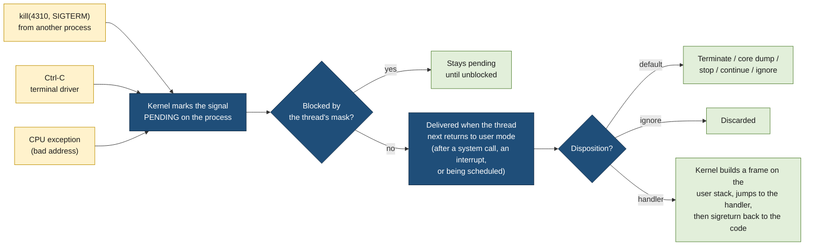
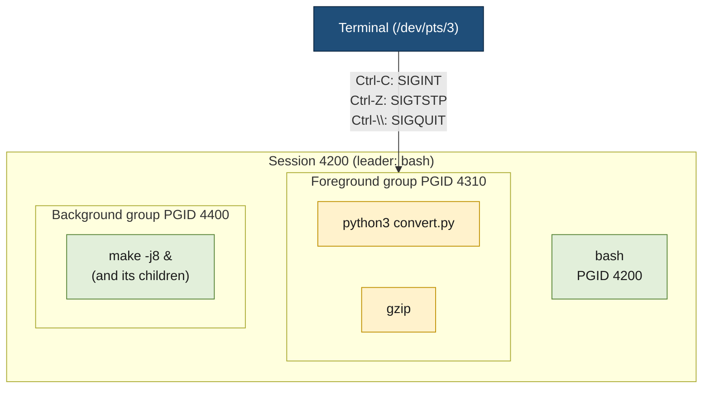
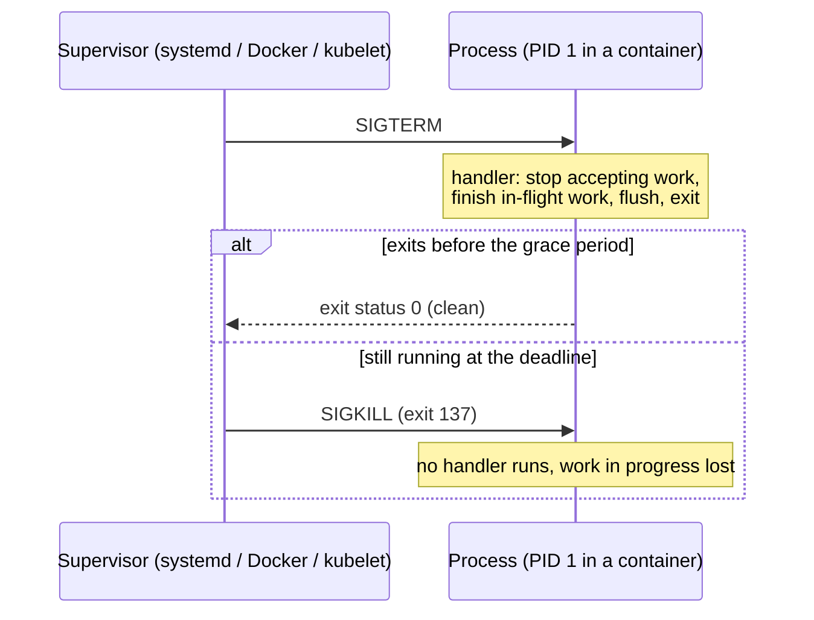

# Signals

> [!abstract] In one sentence
> A signal is a small numbered notification the kernel delivers to a process (or a thread): it can come from another process (`kill`), from the terminal (Ctrl-C), from the kernel itself (a child exited, a pipe broke, the CPU (central processing unit) hit an invalid memory access), and the process either lets the **default action** happen (die, dump core, stop, ignore) or runs a **handler** it installed, at almost any point in its code, which is what makes signals both useful and treacherous.

## Build-up: stopping a process that is in the middle of something

A plain Python program processes a large input file and writes results to an output file:

```python
# convert.py
import time
with open("out.csv", "w") as out:
    for i in range(1_000_000):
        out.write(f"{i},{i * i}\n")
        time.sleep(0.001)          # stands in for real work
print("done")
```

It runs in a terminal. I want to stop it. Every way of stopping it is a signal, and they behave very differently.

### Stage 1: a signal is a number with a default action

```bash
python3 convert.py &
[1] 4310
kill 4310                # sends SIGTERM (15), the default for kill
[1]+  Terminated              python3 convert.py
tail -c 50 out.csv       # the last line is cut in the middle: 81273,66053...
```

The process was terminated wherever it happened to be: mid-write, with Python's output buffer never flushed. Nothing in `convert.py` handled the signal, so the **default action** for `SIGTERM` applied: terminate.

Every signal has a number, a name and a default action. The ones that matter on Linux (numbers are for x86 and ARM; a few differ on other architectures, so scripts should use names):

| Signal | No. | Default action | Sent by / meaning |
|---|---|---|---|
| `SIGHUP` | 1 | Terminate | Terminal hung up; by convention for daemons: reload config |
| `SIGINT` | 2 | Terminate | Ctrl-C in the terminal |
| `SIGQUIT` | 3 | Core dump | Ctrl-\ in the terminal |
| `SIGILL` | 4 | Core dump | CPU executed an illegal instruction |
| `SIGABRT` | 6 | Core dump | `abort()`, a failed `assert` in C |
| `SIGBUS` | 7 | Core dump | Bad memory access of another kind (truncated memory-mapped file) |
| `SIGFPE` | 8 | Core dump | Arithmetic error (integer division by zero) |
| `SIGKILL` | 9 | Terminate | Can't be caught, blocked or ignored |
| `SIGUSR1`, `SIGUSR2` | 10, 12 | Terminate | Free for applications (dump stats, reopen logs) |
| `SIGSEGV` | 11 | Core dump | Invalid memory access (segmentation fault) |
| `SIGPIPE` | 13 | Terminate | Wrote to a pipe or socket nobody reads |
| `SIGALRM` | 14 | Terminate | A timer set with `alarm()` expired |
| `SIGTERM` | 15 | Terminate | "Please stop": `kill`, `systemctl stop`, `docker stop` |
| `SIGCHLD` | 17 | **Ignore** | A child process stopped or exited |
| `SIGCONT` | 18 | Continue | Resume a stopped process (`fg`, `bg`) |
| `SIGSTOP` | 19 | Stop | Can't be caught, blocked or ignored |
| `SIGTSTP` | 20 | Stop | Ctrl-Z in the terminal |
| `SIGTTIN`, `SIGTTOU` | 21, 22 | Stop | Background process tried to read from / write to its terminal |
| `SIGWINCH` | 28 | Ignore | Terminal window resized |
| `SIGRTMIN`…`SIGRTMAX` | 34–64 | Terminate | Real-time signals (Stage 7) |

The five default actions: **terminate**, **terminate and dump core** (write the process's memory to a file for debugging, Stage 10), **ignore**, **stop** (freeze the process, it stays in memory) and **continue** (unfreeze it).

`kill -l` lists them all; `kill -s TERM 4310`, `kill -TERM 4310` and `kill -15 4310` are the same thing.

### Stage 2: what happens inside the kernel

Sending a signal doesn't run anything immediately. The kernel keeps, for every thread (and for the process as a whole):
- a **pending** set: signals that arrived and haven't been delivered yet (one bit per standard signal)
- a **blocked** set (the signal mask): signals the thread doesn't want delivered right now
- per process, a **disposition** for each signal: default, ignore, or "run this handler"



The important consequence is **when** delivery happens: the next time the thread goes from kernel mode back to user mode (after a system call, after an interrupt such as the timer tick ([[Interrupts]]), or when the scheduler gives it the CPU). A process sleeping in a system call is woken up so the signal can be delivered. So a handler can run **between any two instructions** of the program, which is the root of every difficulty in Stages 4 and 5.

These sets are visible for any process:

```bash
grep -E '^Sig' /proc/4310/status
# SigQ:   0/63213                  queued signals / limit
# SigPnd: 0000000000000000         pending for this thread
# ShdPnd: 0000000000000000         pending for the whole process
# SigBlk: 0000000000000000         blocked (the mask)
# SigIgn: 0000000001001000         ignored
# SigCgt: 0000000180004002         caught (a handler is installed)
```

Each value is a bit mask: bit *n−1* is signal *n*. In `SigCgt: ...4002`, bit 1 (signal 2, `SIGINT`) is set because Python installs its own `SIGINT` handler (that's what turns Ctrl-C into a `KeyboardInterrupt` exception), and bit 14 (signal 15) would be set once the program handles `SIGTERM`. Decoding by hand is tedious; `ps -o pid,blocked,ignored,caught -p 4310` shows the same masks.

### Stage 3: who can send what to whom

```bash
kill -TERM 4310        # one process
kill -TERM -4300       # negative number: every process in process group 4300 (Stage 8)
kill -0 4310           # sends nothing: only checks the process exists and I'm allowed to signal it
pkill -HUP nginx       # by name
killall -USR1 myapp
```

From a program, `kill(pid, sig)` sends to another process (identified by its PID, process ID), `raise(sig)` (or `kill(getpid(), sig)`) to itself, `pthread_kill()` / `tgkill()` to one thread.

**Permissions**: a process may signal another one if it runs as the same user, more precisely if its real or effective UID (user ID) matches the target's real or saved UID, or if it has the `CAP_KILL` capability (root has it). One exception: `SIGCONT` can be sent to any process in the same session. Otherwise `kill` fails with `EPERM` ("Operation not permitted").

### Stage 4: catching a signal (handlers)

Back to `convert.py`: on `SIGTERM` it should finish the current line, flush the file and exit cleanly. That's a **handler**:

```python
# convert.py, graceful version
import signal, sys, time

stop = False

def on_term(signum, frame):
    global stop
    stop = True                          # only set a flag; the main loop does the real work

signal.signal(signal.SIGTERM, on_term)
signal.signal(signal.SIGINT, on_term)    # Ctrl-C too

with open("out.csv", "w") as out:
    for i in range(1_000_000):
        if stop:
            print(f"stopping cleanly after {i} rows", file=sys.stderr)
            break
        out.write(f"{i},{i * i}\n")
        time.sleep(0.001)
# leaving the with block flushes and closes the file
```

```bash
python3 convert.py & sleep 2; kill 4322
stopping cleanly after 1764 rows
tail -n 1 out.csv          # a complete line
```

In C, the modern call is `sigaction()` (the older `signal()` has behaviour that differs between systems):

```c
#include <signal.h>
#include <stdio.h>
#include <string.h>
#include <unistd.h>

static volatile sig_atomic_t stop = 0;

static void on_term(int sig) { stop = 1; }

int main(void) {
    struct sigaction sa;
    memset(&sa, 0, sizeof sa);
    sa.sa_handler = on_term;
    sigemptyset(&sa.sa_mask);        /* extra signals to block while the handler runs */
    sa.sa_flags = SA_RESTART;        /* restart interrupted system calls (Stage 6) */
    sigaction(SIGTERM, &sa, NULL);
    sigaction(SIGINT, &sa, NULL);

    while (!stop) {
        /* work */
        sleep(1);
    }
    printf("clean exit\n");
    return 0;
}
```

`volatile sig_atomic_t` is the one type C guarantees can be written in a handler and read in the main code safely: `volatile` stops the compiler from caching it in a register, `sig_atomic_t` guarantees the write isn't torn in half.

While a handler runs, the signal it handles is **blocked** automatically (so it doesn't interrupt itself), plus anything in `sa_mask`. `SIGKILL` and `SIGSTOP` can never be caught, blocked or ignored: they're the kernel's guarantee that any process can always be stopped.

**In Python**, the C-level handler only sets a flag inside the interpreter; the Python function runs later, **in the main thread**, between two bytecode instructions. So a Python handler can't interrupt a long C call (a big regex, a blocking library call without timeout) until it returns, and handlers can only be installed from the main thread.

### Stage 5: why a handler must do almost nothing (async-signal-safety)

A tempting handler:

```c
static void on_usr1(int sig) {
    printf("stats: %ld rows\n", rows);        /* DON'T */
    char *s = malloc(100);                     /* DON'T */
}
```

Suppose the main code is inside `malloc()` when `SIGUSR1` arrives. `malloc` holds a lock on the heap and its data structures are half-updated. The handler calls `malloc` again: it waits for the lock the same thread already holds, and the process **deadlocks** forever (or, without a lock, corrupts the heap). `printf` has the same problem with its buffer lock.

POSIX (Portable Operating System Interface, the standard Unix interfaces) lists the functions that are **async-signal-safe**, meaning safe to call from a handler: `write()`, `read()`, `_exit()`, `kill()`, `sigaction()`, `waitpid()` and a few dozen others. `printf`, `malloc`, `free`, most of the C library, and anything that takes a lock are not. A handler also must save and restore `errno` if it calls anything that can change it.

The safe patterns, from simplest:
1. **Set a flag** (`volatile sig_atomic_t`) and let the main loop act on it, as in Stage 4
2. **Self-pipe trick**: the handler `write()`s one byte into a pipe; the main loop waits on that pipe with `poll()`/`select()` along with its sockets, so the signal becomes an ordinary event. Python's `signal.set_wakeup_fd()` and event loops (asyncio's `loop.add_signal_handler`) do exactly this
3. **`signalfd()`** (Linux): block the signals, then read them as structures from a file descriptor. No handler at all, signals become data in the event loop

```c
sigset_t mask;
sigemptyset(&mask);
sigaddset(&mask, SIGTERM);
sigaddset(&mask, SIGINT);
sigprocmask(SIG_BLOCK, &mask, NULL);           /* no asynchronous delivery any more */
int sfd = signalfd(-1, &mask, 0);
struct signalfd_siginfo info;
read(sfd, &info, sizeof info);                  /* blocks until SIGTERM or SIGINT */
printf("got signal %d from PID %d\n", info.ssi_signo, info.ssi_pid);
```

### Stage 6: blocking signals, threads, and interrupted system calls

**Blocking (masking).** Some code must not be interrupted halfway, for example updating two variables a handler also reads. `sigprocmask()` (or `pthread_sigmask()` in threaded programs) blocks signals for a while; any that arrive stay pending and are delivered the moment they're unblocked:

```c
sigset_t block, old;
sigemptyset(&block);
sigaddset(&block, SIGUSR1);
sigprocmask(SIG_BLOCK, &block, &old);     /* critical section starts */
total += n; count += 1;
sigprocmask(SIG_SETMASK, &old, NULL);     /* pending SIGUSR1 delivered here */
```

The mask is inherited by children across `fork()` and kept across `execve()`: a program started with signals blocked by its parent never sees them, a classic surprise when a launcher forgets to restore its mask.

**Threads.** The disposition (handler or default) is shared by the whole process, but the mask is per thread. A signal sent to the **process** (`kill`) is delivered to **any one thread** that doesn't block it; a signal caused by a thread (`SIGSEGV`, `SIGPIPE`, `pthread_kill`) goes to that thread. The common design in multi-threaded programs: block every signal in all threads at startup, and dedicate one thread to `sigwait()` (or a `signalfd`) to receive them synchronously.

**EINTR.** If a signal with a handler arrives while a thread is blocked in a slow system call (`read()` on a pipe or socket, `accept()`, `wait()`, `sleep`), the call is interrupted: after the handler runs, it returns −1 with `errno = EINTR` ("Interrupted system call"), and the program must retry. With `SA_RESTART` the kernel restarts most of these calls automatically (not all: `poll`, `select`, `epoll_wait`, `nanosleep` and calls with timeouts still return `EINTR`). Python retries interrupted system calls itself since Python 3.5 (PEP 475), unless the handler raises an exception.

### Stage 7: standard signals don't queue

```bash
python3 -c 'import signal,time,os
n = 0
def h(s, f):
    global n; n += 1
signal.signal(signal.SIGUSR1, h)
print(os.getpid()); time.sleep(5); print("received", n)' &
for i in $(seq 100); do kill -USR1 $!; done
# received 3   (not 100)
```

The pending set is **one bit per signal**: a second `SIGUSR1` arriving while the first is still pending is merged into it. Standard signals say "this happened at least once", never "how many times". That matters for `SIGCHLD` (Stage 8): one delivery can stand for several dead children.

**Real-time signals** (`SIGRTMIN` to `SIGRTMAX`, 34 to 64 on Linux) do queue: each one sent is delivered, in order, and `sigqueue()` can attach an integer or pointer to it. They're rarely used directly, but some runtimes and libraries use them internally (glibc reserves the first two for its threads implementation).

### Stage 8: children, zombies and orphans

When a child process exits, the kernel can't throw it away completely: its parent may want its **exit status**. So the child becomes a **zombie** (state `Z`, shown as `<defunct>`): no memory, no open files, just a process table entry with the status, until the parent collects it with `wait()` / `waitpid()`. The kernel sends the parent `SIGCHLD` to say "a child changed state".

```python
# zombies.py: a parent that never waits
import os, time
for _ in range(3):
    if os.fork() == 0:
        os._exit(0)          # child exits immediately
time.sleep(60)
```

```bash
ps -o pid,ppid,stat,cmd --ppid $(pgrep -f zombies.py)
#   PID  PPID STAT CMD
#  5512  5511 Z+   [python3] <defunct>
#  5513  5511 Z+   [python3] <defunct>
#  5514  5511 Z+   [python3] <defunct>
```

A zombie can't be killed (it's already dead): `kill -9 5512` does nothing. The fix is in the **parent**: collect children. Because `SIGCHLD` doesn't queue, the handler or loop must reap **every** finished child, not one:

```python
def reap(signum, frame):
    while True:
        try:
            pid, status = os.waitpid(-1, os.WNOHANG)   # any child, don't block
        except ChildProcessError:
            return                                     # no children left
        if pid == 0:
            return                                     # children exist, none finished
        print(f"child {pid} exited with {os.waitstatus_to_exitcode(status)}")

signal.signal(signal.SIGCHLD, reap)
```

Setting `SIGCHLD` to `SIG_IGN` explicitly is the other way out: on Linux the kernel then reaps children automatically (and `wait()` returns nothing useful).

If the **parent** dies first, its children become **orphans** and are **re-parented** to PID 1 (`init`/systemd), or to the nearest ancestor that declared itself a **subreaper** (`prctl(PR_SET_CHILD_SUBREAPER)`, which systemd's user manager and container init processes use). PID 1 is expected to reap them. A container whose PID 1 is an ordinary application that never calls `wait()` accumulates zombies from every helper process it runs (Advanced problem 3).

### Stage 9: the terminal, process groups and sessions (job control)

Ctrl-C stops `convert.py`, but in `python3 convert.py | gzip > out.gz` it stops **both** processes. The terminal doesn't signal one process, it signals a **group**.

- A **process group** is a set of processes treated as one job, identified by a PGID (process group ID). The shell puts each pipeline in its own group
- A **session** is a set of process groups attached to one controlling terminal (TTY, from teletypewriter); the shell is the session leader
- Exactly one group per session is the **foreground** group; the others are background jobs



```bash
ps -o pid,ppid,pgid,sid,tty,stat,cmd -t pts/3
#   PID  PPID  PGID   SID TT       STAT CMD
#  4200  4190  4200  4200 pts/3    Ss   -bash
#  4310  4200  4310  4200 pts/3    S+   python3 convert.py      "+" = foreground group
#  4311  4200  4310  4200 pts/3    S+   gzip
#  4400  4200  4400  4200 pts/3    S    make -j8
```

**Job control** is the shell using these signals:
- **Ctrl-Z** → the terminal sends `SIGTSTP` to the foreground group: it stops (`T` in `ps`), the shell prints `[1]+ Stopped`
- **`bg`** → `SIGCONT` to the group, which continues in the background; **`fg`** → makes it the foreground group again and sends `SIGCONT`
- A background job that tries to **read** from the terminal gets `SIGTTIN` and stops (only the foreground may read). Writing gets `SIGTTOU` only if `stty tostop` is set
- When the terminal goes away (SSH (Secure Shell) connection dropped, window closed), the kernel sends **`SIGHUP`** to the session's controlling process, and the shell forwards it to its jobs: by default they all die. That's what the name means: "hang up", from modem lines

Keeping a process alive after logout:
- `nohup cmd &`: ignores `SIGHUP` and redirects output to `nohup.out`
- `setsid cmd`: starts it in a **new session** with no controlling terminal, so no hangup reaches it
- `disown` (bash): removes a job from the shell's list, so the shell doesn't forward `SIGHUP` to it
- Better for anything lasting: a **systemd service** or `tmux`/`screen`, which keep their own terminal alive

**Daemons** reuse `SIGHUP` with a different meaning: they have no terminal, so the signal would never come naturally, and by convention it means "reload your configuration" (see [[Inter-process communication on a web server]] for nginx and gunicorn).

### Stage 10: signals from the CPU itself

Some signals aren't sent by anyone: the CPU raises an **exception** while executing the process's instruction, the kernel's exception handler runs ([[Interrupts]]), decides the fault is the program's, and sends a signal to the **thread that caused it**, synchronously:

| CPU event | Signal | Example |
|---|---|---|
| Page fault on an address that isn't mapped, or a write to read-only memory | `SIGSEGV` | Dereferencing a null or freed pointer ([[Virtual memory]]) |
| Access to a mapped file page beyond the end of the file, misaligned access on some CPUs | `SIGBUS` | A memory-mapped file truncated by another process |
| Integer division by zero | `SIGFPE` | `int x = 1 / zero;` in C |
| Invalid or privileged instruction | `SIGILL` | A binary built for a newer CPU (AVX-512 instructions on an older machine) |
| Breakpoint / single-step trap | `SIGTRAP` | Debuggers |

```c
/* segv.c */
int main(void) { int *p = 0; return *p; }
```

```bash
gcc segv.c -o segv && ./segv
Segmentation fault (core dumped)
echo $?
139                      # 128 + 11: the shell's way of saying "killed by signal 11"
```

Handling these and continuing is almost never correct: returning from a `SIGSEGV` handler re-executes the same faulting instruction. They're caught only to log a stack trace before dying (language runtimes do this), or by special software like the JVM (Java Virtual Machine), which uses deliberate faults for null checks and garbage collection safepoints.

**Exit status.** A process killed by signal *n* has no exit code of its own; shells report **128 + n**: 130 for Ctrl-C (`SIGINT`), 137 for `SIGKILL` (the classic "exit 137" of a container killed for exceeding its memory limit, see [[Docker]]), 143 for `SIGTERM`, 139 for `SIGSEGV`.

**Timers.** `alarm(5)` asks the kernel to send `SIGALRM` in 5 seconds; `setitimer()` and POSIX timers (`timer_create`) can send any signal periodically. Python's `signal.alarm()` is an easy way to put a deadline on blocking code, as long as it runs in the main thread.

### Stage 11: core dumps

For the "core dump" default action, the kernel writes the process's memory and registers to a file, so a debugger can show exactly where it died.

```bash
ulimit -c                       # 0 = core dumps disabled in this shell (a common default)
ulimit -c unlimited
cat /proc/sys/kernel/core_pattern
# |/usr/lib/systemd/systemd-coredump %P %u %g %s %t %c %h     ← piped to systemd-coredump

./segv
coredumpctl list
# TIME                         PID  UID  GID SIG     COREFILE EXE
# Sat 2026-10-10 11:02:13 CEST 6120 1000 1000 SIGSEGV present  /home/me/segv
coredumpctl gdb 6120            # opens gdb on it: bt shows the faulting line
```

Core dumps contain everything in memory, **including secrets** (keys, passwords, tokens), so production systems limit who can read them and how long they're kept.

### Stage 12: how service managers stop processes

Every supervisor follows the same polite-then-forceful sequence, and the program's `SIGTERM` handling decides whether shutdowns are clean:

| Supervisor | Sequence | Settings |
|---|---|---|
| **systemd** | `SIGTERM` (by default to **every process in the service's control group**), wait, then `SIGKILL` | `KillSignal=`, `TimeoutStopSec=` (default 90 s), `KillMode=` (`control-group` default, `mixed`: `SIGTERM` to the main process only, `SIGKILL` to all) |
| **Docker** | `docker stop`: `SIGTERM` to the container's PID 1, wait, then `SIGKILL` | `--time` / `-t` (default 10 s), `STOPSIGNAL` in the Dockerfile |
| **Kubernetes** | Pod removed from Service endpoints, `preStop` hook runs, `SIGTERM` to every container's PID 1, wait, then `SIGKILL` | `terminationGracePeriodSeconds` (default 30 s, includes the `preStop` time), see [[Kubernetes Pod]] |



**PID 1 is special.** The kernel doesn't apply **default** actions to PID 1 of a PID namespace for signals sent from inside that namespace, and for signals from outside (Docker sending `SIGTERM`) only if a handler is installed: a `SIGTERM` to a PID 1 that never installed a handler is simply **ignored** (`SIGKILL` from the parent namespace still works). So an application that relies on the default "terminate" action works on a laptop and ignores `docker stop` in a container: Docker waits the full 10 seconds, then kills it.

Two more traps around PID 1:
- **Shell form `CMD`**: `CMD python3 app.py` runs `/bin/sh -c "python3 app.py"`. The shell is PID 1, receives `SIGTERM`, has no handler and doesn't forward it to Python. The **exec form** `CMD ["python3", "app.py"]` makes Python PID 1. In entrypoint scripts, end with `exec "$@"` so the script is replaced by the program
- **Zombie reaping**: PID 1 must `wait()` for orphans (Stage 8). A minimal init (`tini`, or `docker run --init`, or Kubernetes' `shareProcessNamespace` with the pause container) handles both: it forwards signals to the child and reaps zombies

## Advanced problems

### 1. Ctrl-C does nothing
**Symptom:** a program ignores Ctrl-C (or only reacts after a long delay); a second Ctrl-C doesn't help either. **Cause:** in Python, the handler runs between bytecode instructions in the main thread, so a long C-level call (a huge regex, `time.sleep` inside a C extension, a blocking `join()` on a thread) delays it; or the program installed its own handler or ignores `SIGINT`; or the work is in another process group that isn't the terminal's foreground group. **Fix:** check `SigIgn`/`SigCgt` in `/proc/<pid>/status`; in Python, use timeouts on blocking calls so the main thread returns to the interpreter; Ctrl-\ (`SIGQUIT`) or `kill -9` from another terminal as a last resort.

### 2. Children keep running after the parent is killed
**Symptom:** `kill` on a script stops the script, but the workers it started keep running (or keep holding a port, making the restart fail). **Cause:** a signal goes to one process; children aren't signalled when their parent dies, they're re-parented to PID 1. **Fix:** signal the **process group** (`kill -TERM -<pgid>`), make the parent forward `SIGTERM` to its children and wait for them, use `prctl(PR_SET_PDEATHSIG, SIGTERM)` in children on Linux, or run it under systemd, which signals the whole control group.

### 3. Zombies pile up
**Symptom:** `ps` shows hundreds of `<defunct>` processes; eventually `fork()` fails with "Resource temporarily unavailable" because the PID limit is reached. **Cause:** a parent that never calls `wait()`, or reaps only one child per `SIGCHLD` although several exited (signals don't queue), or a container whose PID 1 isn't an init. **Fix:** reap in a loop with `WNOHANG` until nothing is left; in containers, `--init`/`tini`. Killing the zombies does nothing; killing the **parent** makes PID 1 adopt and reap them.

### 4. The process freezes after a signal
**Symptom:** a process hangs, 0 % CPU, after receiving `SIGUSR1` or `SIGHUP`; `gdb` or `py-spy` shows the handler waiting on a lock inside `malloc`, `printf` or a logging call. **Cause:** a handler calling functions that aren't async-signal-safe while the main code held the same lock. **Fix:** handlers only set a flag or write to a self-pipe; move the work (logging, reloading) into the main loop or a `signalfd` reader.

### 5. A server dies silently when a client disconnects
**Symptom:** a server process exits with no error message when a client disconnects mid-response; the shell shows exit status 141 (128 + 13). **Cause:** writing to a socket or pipe whose other end is closed raises `SIGPIPE`, whose default action is terminate. **Fix:** ignore it (`signal(SIGPIPE, SIG_IGN)`) and handle the `EPIPE` error from `write()`, or send with the `MSG_NOSIGNAL` flag ([[Sockets]]). Python already ignores `SIGPIPE` and raises `BrokenPipeError` instead.

### 6. Random "Interrupted system call" errors
**Symptom:** rare failures like `read: Interrupted system call` or `accept() failed: EINTR`, more frequent when a timer or a child process is involved. **Cause:** a signal with a handler interrupted a blocking call, which returned `EINTR`. **Fix:** install handlers with `SA_RESTART`, and retry on `EINTR` in calls it doesn't cover (`poll`, `select`, `epoll_wait`). Languages with their own runtimes (Python, Go) mostly retry for you.

### 7. `docker stop` always takes 10 seconds
**Symptom:** every deploy waits the full grace period, logs show no shutdown message, the exit code is 137. **Cause:** `SIGTERM` never reaches the application: shell-form `CMD`, an entrypoint script without `exec`, or the app is PID 1 with no `SIGTERM` handler (the kernel ignores default actions for PID 1). **Fix:** exec form, `exec "$@"` in entrypoints, a real `SIGTERM` handler, or `--init`/`tini`. Check with `docker exec <c> cat /proc/1/status | grep SigCgt`.

## Practice

> [!example]- I send `kill -USR1` to a process 50 times in a loop and its handler counts only 4. Bug in the handler?
> No: standard signals don't queue. While one `SIGUSR1` is pending, more are merged into it. Use real-time signals, or a real channel (pipe, socket) when counts matter.

> [!example]- `/proc/<pid>/status` shows `SigIgn: 0000000000001000`. Which signal is ignored?
> Bit 12 is set, so signal 13: `SIGPIPE`.

> [!example]- A container's process exits with status 143. And with 137?
> 143 = 128 + 15: it was terminated by `SIGTERM` (it didn't handle it, or re-raised it). 137 = 128 + 9: `SIGKILL`, either after the grace period or by the out-of-memory killer.

> [!example]- I run `long-job &` over SSH and close the laptop. The job is gone the next morning. Why, and what are three ways to avoid it?
> The connection drop made the kernel send `SIGHUP` to the session, and the shell forwarded it to its jobs, whose default action is terminate. `nohup long-job &`, `setsid long-job`, running it in `tmux`/`screen`, or (best) as a systemd service.

> [!example]- Why can't `kill -9` remove a zombie process?
> It's already dead: only its exit status remains in the process table. Its parent must `wait()` for it, or the parent must die so PID 1 adopts and reaps it.

> [!example]- A C program's `SIGTERM` handler calls `fprintf(stderr, ...)` and `free()`. It works in tests and hangs once a week in production. Why?
> Neither function is async-signal-safe. When the signal lands while the main code is inside `malloc`/`free` or `fprintf` (holding their locks), the handler waits for a lock its own thread holds: deadlock. Set a flag instead.

## Easy to get wrong

- `kill` sends `SIGTERM` by default, not `SIGKILL`: it **asks**. Only `SIGKILL` and `SIGSTOP` can't be caught
- A handler can run between any two instructions: only async-signal-safe calls in it, or just a flag
- Standard signals don't count: several deliveries can merge into one. Reap every child per `SIGCHLD`
- A signal is delivered to one thread of a multi-threaded process, any one not blocking it
- The signal mask is inherited across `fork()` and `exec()`
- Ctrl-C signals the whole **foreground process group**, not one process. `kill` signals one process unless given a negative PGID
- Zombies are dead already; fix their parent, don't `kill -9` them
- PID 1 in a container ignores signals it has no handler for: default actions don't apply to it
- Shell-form `CMD` and entrypoint scripts without `exec` swallow `SIGTERM`
- Exit status 128 + *n* means "killed by signal *n*": 130 Ctrl-C, 137 `SIGKILL`, 139 `SIGSEGV`, 143 `SIGTERM`
- Returning from a `SIGSEGV` handler re-runs the faulting instruction
- Signal numbers differ between architectures for some signals: use names in scripts
- Core dumps can contain secrets

## Related
- Part of:: *[[Processes and threads]]*
- Communication between processes:: [[Inter-process communication]] (signals as the simplest mechanism), [[Inter-process communication on a web server]] (reloads and graceful deploys)
- Where synchronous signals come from:: [[Interrupts]] (CPU exceptions, timer ticks, returning to user mode), [[Virtual memory]] (page faults → `SIGSEGV`, `SIGBUS`)
- In containers:: [[Docker]] (PID 1, exec form, exit 137), [[Kubernetes Pod]] (preStop, grace period)
- Sockets and `SIGPIPE`:: [[Sockets]]
- Area:: [[Operating systems]]

## Flashcards
#flashcards

What is a signal? :: A small numbered notification the kernel delivers to a process or thread, which runs a handler or a default action
The five default signal actions? :: Terminate, terminate with core dump, ignore, stop, continue
Which two signals can't be caught, blocked or ignored? :: SIGKILL and SIGSTOP
What signal does kill send by default? :: SIGTERM (15)
When is a pending signal actually delivered? :: When the thread next returns from kernel mode to user mode (after a system call, an interrupt or being scheduled), if it isn't blocked
Pending vs blocked signal sets? :: Pending: arrived but not delivered yet. Blocked (mask): signals the thread doesn't want delivered now; they stay pending
Where can you see a process's blocked, ignored and caught signals? :: /proc/<pid>/status: SigBlk, SigIgn, SigCgt (bit n-1 = signal n)
Who may send a signal to a process? :: A process with the same real/effective UID as the target's real/saved UID, or with CAP_KILL (root)
What does kill -0 <pid> do? :: Sends nothing; checks the process exists and that you may signal it
What does kill with a negative PID do? :: Signals every process in that process group
sigaction vs signal()? :: sigaction is the portable modern API (mask during the handler, flags like SA_RESTART); signal() behaves differently across systems
What is async-signal-safety? :: Whether a function may be called from a signal handler; printf, malloc and anything taking locks are not, write and _exit are
Why can printf or malloc in a handler deadlock? :: The handler may interrupt the same function holding its lock; calling it again waits on a lock the thread already holds
Three safe ways to react to a signal? :: Set a volatile sig_atomic_t flag, the self-pipe trick, or signalfd
What does sigprocmask do? :: Blocks or unblocks signals for the thread; blocked signals stay pending until unblocked
Which thread receives a signal sent to a multi-threaded process? :: Any one thread that doesn't block it (thread-caused signals go to that thread)
Where do Python signal handlers run? :: In the main thread, between bytecode instructions
What is EINTR? :: The error a blocking system call returns when a signal handler interrupted it
What does SA_RESTART do? :: Makes the kernel restart most system calls interrupted by that signal's handler instead of returning EINTR
Do standard signals queue? :: No: one pending bit per signal, so several sends can merge into one delivery
Real-time signals vs standard signals? :: Real-time signals (SIGRTMIN..SIGRTMAX) queue, are delivered in order and can carry a value
What is a zombie process? :: A child that exited but whose exit status hasn't been collected by its parent with wait()
How should a SIGCHLD handler reap children? :: Loop waitpid(-1, WNOHANG) until no finished child remains
What happens to orphaned processes? :: They're re-parented to PID 1 (or the nearest subreaper), which should reap them
What is a process group? :: A set of processes handled as one job (e.g. a pipeline), identified by a PGID; terminal signals go to the whole group
What is a session? :: A set of process groups sharing one controlling terminal, led by the shell
What does Ctrl-Z send? :: SIGTSTP to the foreground process group (stops it); bg/fg resume it with SIGCONT
Why does a background job stop when it reads from the terminal? :: It gets SIGTTIN: only the foreground group may read the terminal
Why do jobs die when an SSH session drops? :: SIGHUP is sent to the session and forwarded by the shell; default action is terminate
nohup vs setsid? :: nohup ignores SIGHUP; setsid starts the process in a new session with no controlling terminal
Which signals come from CPU exceptions? :: SIGSEGV, SIGBUS, SIGFPE, SIGILL, SIGTRAP, sent synchronously to the faulting thread
What does exit status 128 + n mean? :: The process was killed by signal n (130 SIGINT, 137 SIGKILL, 139 SIGSEGV, 143 SIGTERM)
How does SIGPIPE kill servers, and the fix? :: Writing to a closed socket/pipe sends SIGPIPE (default: terminate); ignore it and handle EPIPE, or use MSG_NOSIGNAL
How do you get core dumps on a systemd machine? :: ulimit -c, kernel.core_pattern piping to systemd-coredump, then coredumpctl list / gdb
systemd stop sequence? :: SIGTERM to the service's control group, wait TimeoutStopSec (90 s default), then SIGKILL; KillMode changes who gets what
Docker stop sequence? :: SIGTERM to PID 1, wait 10 s (--time), then SIGKILL
Kubernetes pod termination sequence? :: Endpoints removed, preStop hook, SIGTERM to each container, wait terminationGracePeriodSeconds (30 s), SIGKILL
Why does PID 1 in a container ignore SIGTERM? :: The kernel doesn't apply default actions to a namespace's PID 1; without a handler the signal is dropped
Why does shell-form CMD break graceful shutdown? :: /bin/sh becomes PID 1 and doesn't forward SIGTERM to the app
What do tini or docker run --init do? :: A minimal init as PID 1 that forwards signals to the app and reaps zombies
