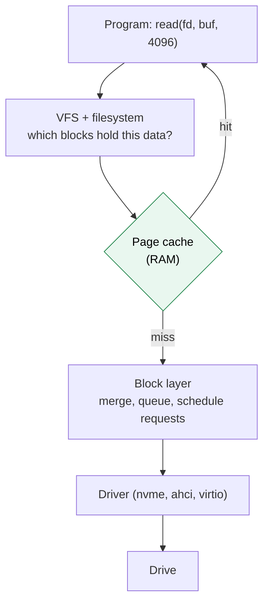

# Storage devices

> [!abstract] In one sentence
> A drive (hard disk, SSD, NVMe, a cloud volume) is, from the computer's point of view, **a long numbered row of equal-sized blocks**: "read block 2048", "write block 9000" is all it understands. It knows **nothing about files**. The operating system shows it as a **block device** (`/dev/nvme0n1`), and everything else (partitions, filesystems, files) is a data structure the OS writes into those blocks.

## Build-up: from a physical drive to `/dev/nvme0n1`

### Stage 1: what's physically inside

Two technologies store the bits.

**Hard disk drive (HDD).** Spinning magnetic platters, a head on an arm that moves across them. The surface is divided into circular **tracks**, each split into **sectors** (historically 512 bytes, now 4,096 bytes physically). Reading a sector means: move the arm to the right track (**seek**, a few ms), wait for the sector to spin under the head (**rotational latency**, ~4 ms at 7,200 rpm), then read. That's why random access on an HDD is slow (~100–200 operations per second) and sequential reading is fast (the data just flows under the head).

**Solid state drive (SSD).** No moving parts: **NAND flash** chips. Their rules are strange:
- Data is written in **pages** (~4–16 KB), but flash can only be **erased** in much bigger **erase blocks** (hundreds of pages), and a page can't be overwritten in place: it must be erased first
- Each erase wears the cells a little (limited write cycles)

So the SSD contains a small computer running the **Flash Translation Layer (FTL)**: when the OS "overwrites block 500", the FTL writes the new data to a **fresh page somewhere else**, updates its internal map (logical block 500 → new physical page), and marks the old page as garbage to erase later (**garbage collection**). It also spreads writes evenly (**wear leveling**). The OS never sees any of this.

**The connection to the computer** is a separate question from the storage technology:

| Interface | Typical drives | Notes |
|---|---|---|
| **SATA** (AHCI) | HDDs, older SSDs | One command queue of 32 commands. Fine for HDDs, a bottleneck for SSDs |
| **SAS** | Enterprise HDDs/SSDs | Servers, dual ports |
| **NVMe** over PCIe | Modern SSDs | Up to 64K queues × 64K commands, talks directly over PCIe: microsecond latency |
| **USB** | External drives | A bridge translating USB to SATA/NVMe |
| **virtio / network** | VM disks, cloud volumes | The "drive" is software or a server elsewhere (Stage 5) |

### Stage 2: what the drive offers: numbered blocks (LBA)

Whatever is inside, every drive presents the same simple interface: **Logical Block Addressing (LBA)**. A drive of 500 GB with 512-byte logical blocks is blocks **0 to 976,773,167**. The commands are essentially:

```
READ  (start LBA, number of blocks)  → bytes
WRITE (start LBA, number of blocks, bytes)
FLUSH (make sure what I wrote is on stable storage)
TRIM / DISCARD (these blocks are no longer used)
```

No names, no folders, no "file". If I write the bytes of a photo into blocks 2048 to 2303, the drive has no idea it's a photo, or that those blocks belong together. Remembering that is the **filesystem's** job (see [[Partitions and filesystems]]).


Two sizes to know:
- **Logical sector size**: the unit the drive accepts in commands (often still **512** for compatibility)
- **Physical sector size**: what it really writes internally (often **4096**). A drive that accepts 512 but writes 4096 is "**512e**" (emulated)

### Stage 3: how Linux shows a drive (block devices)

When the kernel's driver finds a drive, it creates a **block device file** in `/dev`. It's not a real file: reading it reads raw blocks from the drive.

| Name | What |
|---|---|
| `/dev/sda`, `/dev/sdb` | SATA/SAS/USB drives (SCSI disk driver), in detection order |
| `/dev/nvme0n1` | NVMe controller 0, namespace 1. Partitions: `nvme0n1p1` |
| `/dev/vda` | A virtio disk in a VM |
| `/dev/xvda` | Xen virtual disk (older cloud instances) |
| `/dev/loop0` | A **loop device**: a file used as a disk (Stage 5) |
| `/dev/dm-0`, `/dev/mapper/…` | Device mapper: LVM volumes, encrypted volumes (virtual block devices) |
| `/dev/md0` | Software RAID |

```bash
lsblk -o NAME,SIZE,TYPE,ROTA,LOG-SEC,PHY-SEC,TRAN,MODEL
# NAME          SIZE TYPE ROTA LOG-SEC PHY-SEC TRAN MODEL
# nvme0n1     476.9G disk    0     512     512 nvme Samsung SSD 980 PRO 512GB
# ├─nvme0n1p1     1G part    0     512     512
# └─nvme0n1p2 475.9G part    0     512     512
# sda           1.8T disk    1     512    4096 sata ST2000DM008-2UB102
```

`ROTA 1` = rotational (HDD), `0` = SSD. `sda` is a 512e drive.

The kernel also exposes facts about each device in `/sys`:

```bash
cat /sys/block/nvme0n1/size                 # size in 512-byte units
cat /sys/block/nvme0n1/queue/rotational
sudo blockdev --getsize64 /dev/nvme0n1      # size in bytes
```

Reading the very first block of a drive, raw:

```bash
sudo dd if=/dev/nvme0n1 bs=512 count=1 status=none | xxd | tail -2
# 000001f0: 0000 0000 0000 0000 0000 0000 0000 55aa   ← boot signature at bytes 510–511
```

Just bytes. Whether they mean "partition table" depends on who reads them.

> [!warning] Raw block devices are dangerous
> `dd of=/dev/sda` writes over whatever is there: partition tables, filesystems, data. No undo, no "are you sure". Always double-check the device name with `lsblk` first. The practice below uses a **file** as a disk precisely so nothing real can be damaged.

### Stage 4: between the program and the drive (the block layer and the page cache)

When a program reads a file, the request doesn't go straight to the drive:



- **Page cache**: Linux keeps recently used file data in RAM. The second `cat` of a big file is instant: it never touches the drive. That's why `free -h` shows most "used" memory as `buff/cache`; it's given back when programs need it
- **Writes are delayed**: `write()` copies into the page cache (the page becomes **dirty**) and returns. A kernel thread writes dirty pages to the drive a few seconds later. If power fails before that, the data is lost
- **`fsync(fd)`** forces a file's dirty data (and metadata) to the drive **and** asks the drive to **flush** its own volatile write cache. Databases call it on every commit; `sync` does it for everything
- **I/O schedulers** (`mq-deadline`, `bfq`, `none`) order and merge requests. HDDs benefit (fewer seeks), NVMe usually uses `none`

### Stage 5: drives that aren't physical

The "numbered blocks" interface is so simple that anything can pretend to be a drive:

| Fake drive | What's really behind it |
|---|---|
| **Loop device** `/dev/loop0` | A regular **file** on another filesystem |
| VM disk (`/dev/vda`) | A file on the host (`.qcow2`, `.raw`) or a host volume, served by the hypervisor |
| **Cloud volume** (AWS EBS) | Storage servers in the data center, reached **over the network**, presented to the instance as an NVMe device |
| **iSCSI LUN** | Blocks on a storage server, over TCP (see *[[iSCSI and SAN]]*) |
| LVM / RAID / LUKS volume | Other block devices combined or encrypted by the kernel (device mapper) |

Programs and filesystems can't tell the difference: they read and write numbered blocks.

## Practice: a fake drive on my machine

Safe to run on any Linux machine:

```bash
# 1. A 1 GiB file full of zeros (sparse: takes no real space yet)
truncate -s 1G ~/disk.img

# 2. Attach it as a block device
sudo losetup -fP --show ~/disk.img
# /dev/loop0

lsblk /dev/loop0
# NAME  MAJ:MIN RM SIZE RO TYPE MOUNTPOINTS
# loop0   7:0    0   1G  0 loop

# 3. Write bytes at block 100 (blocks of 512 bytes), like a program that "knows" where it put them
echo -n "invoice o-8812" | sudo dd of=/dev/loop0 bs=512 seek=100 conv=notrunc status=none

# 4. Read block 100 back
sudo dd if=/dev/loop0 bs=512 skip=100 count=1 status=none | head -c 20; echo
# invoice o-8812

# 5. Nothing anywhere knows block 100 holds an "invoice": no name, no size, no owner.
#    That's the problem filesystems solve.

# 6. Clean up when done (or keep it for the next note)
sudo losetup -d /dev/loop0
```

The next steps (partitioning this fake drive, putting a filesystem on it, mounting it) continue in [[Partitions and filesystems]] and [[Mounting]].

## Advanced problems

### 1. Device names change between boots

`/dev/sdb` is "the second disk detected", and detection order can change (a USB stick plugged in, a controller initializing faster). On cloud instances, NVMe numbering (`nvme1n1`, `nvme2n1`) depends on attach order. Scripts or `/etc/fstab` entries using `/dev/sdb` can then point at the **wrong disk**. Use stable names: filesystem **UUIDs** (`blkid`), or `/dev/disk/by-id/…`, `/dev/disk/by-uuid/…`.

### 2. SSDs slow down when full

When almost every page holds data, the FTL has little free space to write into and must garbage-collect (copy valid pages out of an erase block, erase it) **during** writes: **write amplification**, latency spikes. Telling the drive which blocks are free helps: **TRIM/discard** (`fstrim -av`, usually a weekly `fstrim.timer`). And leave free space.

### 3. Misaligned partitions

On a 4 KiB physical-sector drive, a partition starting at a sector that isn't a multiple of 8 (512-byte units) makes every 4 KiB write straddle two physical sectors: read-modify-write, much slower. Modern tools align partitions to **1 MiB** by default; old ones (starting at sector 63) didn't.

### 4. "Written" data lost at power failure

The app wrote, `write()` returned success, power failed, the data is gone: it was only in the page cache, or in the drive's volatile cache. Anything that must survive (a database commit, a payment record) needs `fsync`, and drives/controllers that honor flushes (enterprise SSDs have **power-loss protection**).

## In AWS
- **EBS volumes** are network block devices that show up as NVMe devices on Nitro instances, even if the console calls them `/dev/sdf`. The volume ID is in the device's serial: `ls -l /dev/disk/by-id/ | grep Elastic_Block_Store`
- **Instance store** volumes are physical NVMe drives on the host: very fast, **lost** when the instance stops
- *[[EBS]]* covers volume types (gp3, io2), IOPS and throughput

## Easy to get wrong
- Thinking a drive knows about files (it only knows numbered blocks)
- Using `/dev/sdX` names in fstab or scripts (they can change)
- `dd` to the wrong device
- Assuming `write()` means the data is on disk (page cache, drive cache: `fsync`)
- Confusing the interface (SATA, NVMe) with the medium (HDD, SSD)
- Reading `buff/cache` as memory that's "used up"
- Filling SSDs to 100% and never trimming

## Related
- Next:: [[Partitions and filesystems]], [[Mounting]]
- Over the network:: *[[iSCSI and SAN]]*, [[NFS and SMB]], [[How network file sharing works]]
- Performance:: *[[Storage performance]]*
- Big picture:: *[[Block, file and object storage]]*, [[Storage]]
- In AWS:: *[[EBS]]*

## Flashcards
#flashcards

What does a drive offer the operating system? :: A numbered row of equal-sized blocks to read and write. Nothing about files
What is LBA? :: Logical Block Addressing: blocks are addressed by number from 0 to N-1
Why is random I/O slow on an HDD? :: Each access needs a seek (move the head) and rotational latency (wait for the sector)
What is the Flash Translation Layer? :: SSD firmware mapping logical blocks to physical flash pages, since flash can't be overwritten in place
What is TRIM? :: Telling an SSD which blocks are no longer used, so garbage collection works better
SATA vs NVMe? :: SATA (AHCI): one queue of 32 commands. NVMe over PCIe: up to 64K queues, much lower latency
What is a block device? :: A /dev file representing a drive (or virtual drive) that reads and writes raw blocks
What is a loop device? :: A block device backed by a regular file
What is a 512e drive? :: Accepts 512-byte logical sectors but writes 4096-byte physical sectors
What is the page cache? :: RAM where Linux keeps file data, so repeated reads skip the drive and writes are delayed
What does fsync do? :: Forces a file's dirty data and metadata to stable storage, including the drive's cache flush
Why use UUIDs instead of /dev/sdX? :: Device names depend on detection order and can change between boots
How does an EBS volume appear on a Nitro instance? :: As an NVMe block device (e.g. /dev/nvme1n1)
