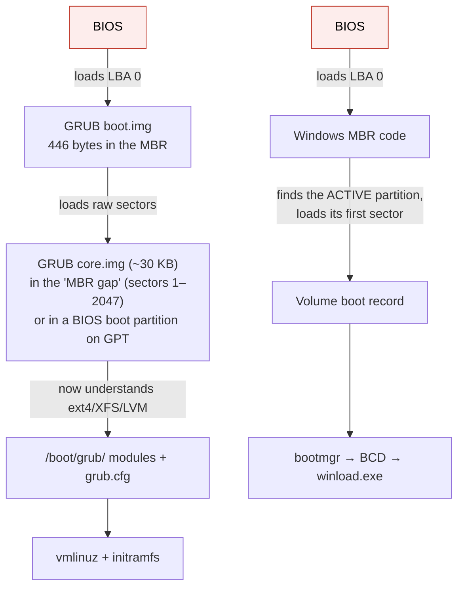
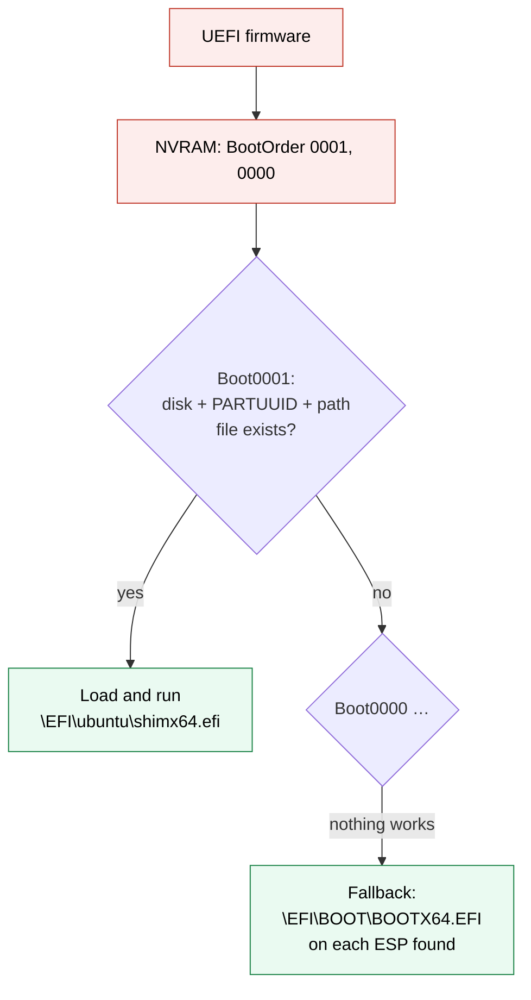
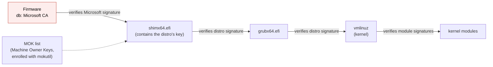
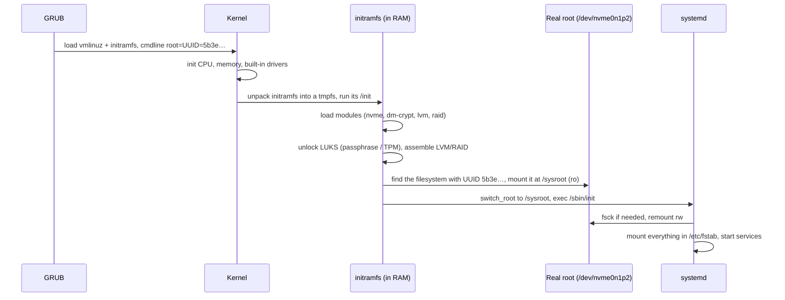
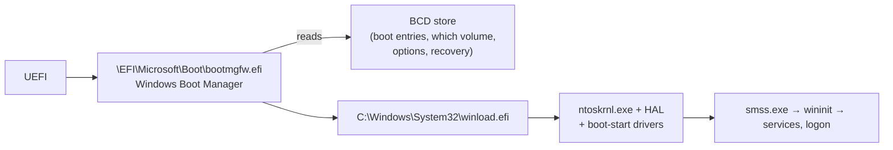

# Booting from disk

> [!abstract] In one sentence
> At power-on the firmware has to find and run the first piece of the OS from a disk it knows nothing about: **legacy BIOS** blindly runs the 446 bytes of code in the drive's first sector, while **UEFI** understands GPT and FAT, so it opens the **EFI system partition (ESP)**, a small FAT32 partition holding bootloaders as ordinary **`.efi` executable files** ("EFI images"), and runs the one named in its boot entries; from there a chain (bootloader → kernel + initramfs → root filesystem mounted → init) hands control step by step to the full OS.

## Build-up: the machine is on, now what?

The scenario: a server `app-01` with one NVMe drive, Ubuntu installed, plus a second machine that dual-boots Windows and Linux. I press the power button.

### Stage 1: the chicken-and-egg problem

The kernel knows how to read GPT, ext4, NVMe, LVM, encryption. But the kernel is **itself a file on that disk**. Something must load it, and that something must be simpler than the kernel and live somewhere the machine can find without any of that knowledge.

That something is the **firmware**: code in a flash chip on the motherboard (or provided by the hypervisor in a VM). It starts the CPU, tests and initialises RAM and devices (the POST), then must pick a disk and start *something* on it. How it does that is the difference between BIOS and UEFI.


Each step is a bit smarter than the one before and loads the next one.

### Stage 2: legacy BIOS, "run whatever is in sector 0"

The BIOS (1981 design) knows almost nothing about disks: no partitions, no filesystems. Its rule:

1. Walk the configured boot order (USB, disk 1, network…)
2. Read **LBA 0** (the MBR, see [[Partition tables (GPT and MBR)#Stage 2: MBR, the 1983 answer (one sector does it all)]]) into memory at address `0x7C00`
3. If the last two bytes are `55 AA`, **jump** to it and let those 446 bytes of code take over, in 16-bit real mode

446 bytes can't read a filesystem, so the boot is a relay race of ever-bigger pieces of code:



Why that design aged badly:
- Boot code lives in **one shared sector**: installing Windows after Linux overwrites GRUB's MBR code (and the reverse). Dual-boot "repair" was a whole genre of forum posts
- GRUB's core image hides in **unpartitioned sectors** (the gap before partition 1), where any tool may scribble
- 16-bit real mode, 2 TiB disks (MBR), slow, no security: anything in sector 0 runs, including boot-sector viruses
- Every bootloader must reimplement disk access, because the firmware offers almost nothing

### Stage 3: UEFI, the firmware reads files

UEFI firmware is a small OS of its own: it understands **GPT** and the **FAT** filesystem, has drivers for disks and network, and runs programs in **PE/COFF format** (the same executable format as Windows `.exe` files). Its rule:

1. Read its **boot entries** from NVRAM (non-volatile memory on the motherboard)
2. Each entry says: "disk X, partition with PARTUUID Y, file `\EFI\ubuntu\shimx64.efi`"
3. Find that partition, which must be an **EFI system partition**: GPT type `C12A7328-F81F-11D2-BA4B-00A0C93EC93B`, formatted FAT32
4. Load that **file** into memory and execute it

That's what "having an EFI image on the disk" means: the disk holds an ESP, and in it, **bootloaders as ordinary files** that the firmware can run directly. No magic code in sector 0, no hidden sectors. An "EFI image" (the UEFI spec's term is *UEFI image*) is just an executable built for the firmware's environment: GRUB compiled as `grubx64.efi`, Windows Boot Manager as `bootmgfw.efi`, a memory tester, a firmware updater, even the Linux kernel itself (Stage 6).

What's inside the ESP of my dual-boot machine:

```text
ESP (FAT32, 512 MiB, mounted at /boot/efi on Linux)
└── EFI/
    ├── BOOT/
    │   └── BOOTX64.EFI          ← fallback: run when no NVRAM entry matches (USB sticks, new disks)
    ├── ubuntu/
    │   ├── shimx64.efi          ← first stage, signed by Microsoft (Secure Boot, Stage 4)
    │   ├── grubx64.efi          ← GRUB, signed by Canonical
    │   └── grub.cfg             ← tiny: "load the real config from the root/boot partition"
    └── Microsoft/
        └── Boot/
            ├── bootmgfw.efi     ← Windows Boot Manager
            └── BCD              ← Windows boot configuration database
```

Each OS gets **its own folder**: installing Windows adds `EFI\Microsoft` without touching `EFI\ubuntu`. Dual boot stops being a fight over one sector.

The NVRAM entries, seen from Linux:

```bash
efibootmgr -v
# BootCurrent: 0001
# BootOrder: 0001,0000,0002
# Boot0000* Windows Boot Manager  HD(1,GPT,4b8e…,0x800,0x100000)/File(\EFI\Microsoft\Boot\bootmgfw.efi)
# Boot0001* ubuntu                HD(1,GPT,4b8e…,0x800,0x100000)/File(\EFI\ubuntu\shimx64.efi)
# Boot0002* UEFI: PXE IPv4        PciRoot(0x0)/…/MAC(…)/IPv4(…)
```

`HD(1,GPT,<PARTUUID>,start,size)` = partition 1 of a GPT disk, identified by its **PARTUUID**. Change boot order with `efibootmgr -o 0000,0001`, add an entry with `efibootmgr -c -d /dev/nvme0n1 -p 1 -L "ubuntu" -l '\EFI\ubuntu\shimx64.efi'`. On Windows: `bcdedit /enum firmware`.



BIOS vs UEFI side by side:

| | Legacy BIOS | UEFI |
|---|---|---|
| Finds the boot code by | Reading sector 0 | Boot entries in NVRAM → a **file** on the ESP |
| Understands partitions/filesystems | No | GPT (and MBR) + FAT |
| Boot code lives in | MBR sector + hidden gaps | Files in `\EFI\<vendor>\` |
| Several OSes | Fight over the MBR | One folder each, one NVRAM entry each |
| Disk size | 2 TiB (with MBR) | Any (GPT) |
| CPU mode at handoff | 16-bit real mode | 32/64-bit |
| Security | None | **Secure Boot** (signatures), measured boot with the TPM |
| Fallback for removable media | Sector 0 | `\EFI\BOOT\BOOTX64.EFI` (`BOOTAA64.EFI` on ARM) |

Many PCs offered a **CSM** (Compatibility Support Module) to boot old BIOS-style disks; modern machines and Windows 11 require UEFI.

### Stage 4: Secure Boot, only signed images run

With UEFI, anything in the ESP is runnable, so malware could replace `grubx64.efi` with a bootkit that loads before the OS and hides from it. **Secure Boot** makes the firmware check a **signature** on every EFI image before running it, against keys stored in the firmware:

| Firmware variable | Holds |
|---|---|
| **PK** (platform key) | The machine owner's (vendor's) key, which signs the KEK |
| **KEK** | Keys allowed to update db/dbx (Microsoft's, usually) |
| **db** | Certificates of allowed signers (Microsoft's Windows and "third-party UEFI" CAs) |
| **dbx** | Revoked hashes and certificates (known-vulnerable bootloaders) |

PCs ship trusting **Microsoft's keys**. Windows' boot manager is signed by Microsoft. For Linux, distributions use **shim**:



Shim is a tiny loader Microsoft signs once; it carries the distribution's own key and verifies everything after. Out-of-tree kernel modules (NVIDIA, VirtualBox, ZFS DKMS builds) must be signed by a key I enroll as a **MOK**, or they won't load with Secure Boot on (`mokutil --sb-state` shows the state).

**Measured boot** is the TPM side: each stage records a hash of the next one into TPM registers (PCRs). It doesn't block anything, but secrets can be **sealed** to those values: BitLocker (and LUKS with `systemd-cryptenroll --tpm2-device`) only gets its disk key if the boot chain is unchanged. That's why changing firmware settings or the boot order can trigger a **BitLocker recovery key** prompt.

### Stage 5: from the bootloader to a running system (Linux)

GRUB (or systemd-boot) reads its config, shows the menu, and loads **two files** into RAM: the **kernel** (`vmlinuz`) and the **initramfs**, plus a command line.

```bash
cat /proc/cmdline
# BOOT_IMAGE=/vmlinuz-6.8.0-45-generic root=UUID=5b3e8c1a-… ro quiet splash
```

Then the hard part: the kernel has to mount the root filesystem, but the drivers for it (NVMe, RAID, LVM, LUKS decryption, a network disk) may be modules **stored on that root filesystem**. The **initramfs** breaks that loop: a small compressed archive with just enough tools and drivers to find and open the real root.



The root filesystem is the **first real mount** of the system, done by the initramfs; every other mount hangs off it (see [[Mounting]] and [[How mounting works]]). `/boot/efi` itself is just a normal fstab mount of the ESP so the OS can update bootloader files.

```bash
lsinitramfs /boot/initrd.img-$(uname -r) | grep -E 'nvme|dm-crypt' | head   # Debian/Ubuntu
lsinitrd | head                                                            # RHEL/Fedora
sudo update-initramfs -u         # rebuild (Debian/Ubuntu) after driver/crypttab changes
sudo dracut -f                   # rebuild (RHEL/Fedora)
```

### Stage 6: skipping GRUB (EFI stub, systemd-boot, UKI)

Since UEFI can run any EFI image, the **Linux kernel itself can be one**: with the **EFI stub**, `vmlinuz` is a valid `.efi` file the firmware runs directly, no GRUB at all. Building on that:
- **systemd-boot**: a minimal menu that lists kernels found on the ESP (no filesystem drivers, no scripting, unlike GRUB)
- **Unified Kernel Image (UKI)**: kernel + initramfs + command line + splash **in one signed `.efi` file**. Secure Boot then covers the initramfs and command line too, which GRUB setups don't. The ESP needs to be bigger (1 GiB is a common recommendation now)

### Stage 7: the Windows chain

Same firmware, different files:



- The **BCD** store (Boot Configuration Data) plays the role of `grub.cfg`, edited with `bcdedit` (`bcdedit /enum` lists entries), not by hand
- **winload.efi** loads the kernel and the **boot-start drivers** (storage, filesystem): Windows' equivalent of what the initramfs provides
- The ESP is hidden in Windows; to look inside: `mountvol S: /s` (as admin) then `dir S:\EFI`
- Repairing: from the recovery environment, `bcdboot C:\Windows /s S: /f UEFI` recreates the boot files and BCD on the ESP

## Advanced problems

### 1. "No bootable device" after moving a disk or image

A disk cloned from a BIOS machine (MBR, no ESP) is put in a machine set to **UEFI only**: the firmware finds no ESP and no entry. Or the reverse: a UEFI install on a machine in legacy mode. Fix: match the firmware mode to the disk (enable CSM, or convert: create an ESP, install the EFI bootloader, `mbr2gpt` on Windows). In VMs and clouds, the image's **boot mode** must match what the hypervisor offers.

### 2. The NVRAM entry vanished

A firmware update, a CMOS reset, or moving the disk to another machine: NVRAM entries live on the **motherboard**, not the disk. If `\EFI\BOOT\BOOTX64.EFI` exists, the firmware falls back to it; otherwise nothing boots. Fix from a live USB: `efibootmgr -c …` (Stage 3), or `grub-install` which recreates the entry, or copy the loader to the fallback path. Ubuntu installs a fallback (`fbx64.efi`) that recreates missing entries automatically.

### 3. Windows took over the boot

After a Windows update the machine boots straight into Windows: it moved its entry first in `BootOrder` (or rewrote `\EFI\BOOT\BOOTX64.EFI`). Linux is still there: change the order in firmware setup or with `efibootmgr -o`.

### 4. `grub rescue>` prompt

GRUB's core loaded but can't find its modules or config: the `/boot` partition was moved, resized, renumbered, or its UUID changed. From the rescue prompt, `ls` to find the right partition, `set prefix=(hd0,gpt2)/boot/grub`, `insmod normal`, `normal`; then from the booted system, `grub-install` + `update-grub` to make it permanent.

### 5. Kernel panic: "VFS: Unable to mount root fs" / dropped to an initramfs shell

The kernel and initramfs loaded, but the root filesystem wasn't found: `root=UUID=` points to a UUID that changed (reformat, restore), or the **driver isn't in the initramfs**. Classic cloud case: an old image moved to a newer instance type whose disks are **NVMe**, and the initramfs has no NVMe driver. Fix: from the initramfs shell, `blkid` to see what exists; then correct the cmdline/fstab, or rebuild the initramfs with the driver (`dracut --add-drivers nvme -f`).

### 6. The ESP is full

Kernel updates fail ("No space left on device" under `/boot/efi`), typical with a 100 MB ESP plus UKIs or several kernels. Remove old kernels (`apt autoremove --purge`) or grow the ESP (hard after the fact: partitions behind it must move).

### 7. Secure Boot blocks a driver

After installing a third-party kernel module, it fails to load: `Key was rejected by service` in `dmesg`. Sign the module with a key and enroll it as a MOK (`mokutil --import`, confirm at next boot), or disable Secure Boot (weaker).

## In AWS
- AMIs have a **boot mode**: `legacy-bios`, `uefi`, or `uefi-preferred`. Graviton (ARM) instances are **UEFI only**. UEFI is needed for **NitroTPM** and UEFI Secure Boot on EC2
- Ubuntu and Amazon Linux images carry both a BIOS boot partition and an ESP to boot either way (see [[Partition tables (GPT and MBR)#Stage 5: partition types and real layouts]])
- No screen to watch a boot: the **EC2 serial console** (and "Get system log" / instance screenshot) shows GRUB, kernel and initramfs messages
- Unbootable instance: stop it, attach its root volume to a rescue instance, mount it, fix fstab/grub/initramfs, attach it back (see [[EC2]])

## Practice

> [!example]- What does "an EFI image on the disk" mean?
> The disk has an EFI system partition (FAT32, a specific GPT type), containing bootloaders as `.efi` executable files. UEFI firmware opens the partition and runs the file named in its NVRAM boot entry.

> [!example]- How does legacy BIOS start an OS?
> It reads sector 0 (the MBR), checks the 55 AA signature and runs its 446 bytes of code, which load the next, bigger stage of the bootloader.

> [!example]- Why is dual boot easier with UEFI?
> Each OS installs its own loader in its own folder on the ESP and gets its own NVRAM entry, instead of overwriting the single MBR boot code.

> [!example]- What is the initramfs for?
> A small RAM filesystem with the drivers and tools (NVMe, LVM, LUKS, RAID) needed to find and mount the real root filesystem, which may itself need those drivers.

> [!example]- Why does Linux boot with Secure Boot on PCs that only trust Microsoft's keys?
> shim is signed by Microsoft and contains the distribution's key, which it uses to verify GRUB and the kernel.

> [!example]- A disk moved to a new motherboard doesn't boot, though the ESP is intact. Why?
> Boot entries are in the old motherboard's NVRAM. Without `\EFI\BOOT\BOOTX64.EFI` the firmware has nothing to run; recreate the entry with efibootmgr or grub-install.

## Easy to get wrong
- Thinking UEFI still runs code from sector 0 (it runs files from the ESP)
- Thinking boot entries are on the disk (they're in the motherboard's NVRAM, pointing at the disk)
- Formatting the ESP as anything other than FAT
- Confusing the ESP (`/boot/efi`) with `/boot` (kernels, initramfs, GRUB config on many distros)
- Forgetting the initramfs must contain the storage drivers for the root disk
- Moving or reformatting the root partition without updating `root=UUID=` and fstab
- Expecting changes to the boot chain not to trigger BitLocker recovery
- Mismatched boot modes (BIOS disk on UEFI-only firmware, or AMI boot mode vs instance type)

## Related
- Before:: [[Partition tables (GPT and MBR)]] (MBR, GPT, ESP type GUID, BIOS boot partition), [[Storage devices]]
- Next:: [[Mounting]], [[How mounting works]] (the root mount and everything after)
- Filesystems on the way:: [[Partitions and filesystems]] (FAT32 for the ESP, ext4/XFS for root)
- Other OS:: [[Windows vs Linux storage]]
- Encryption sealed to the boot chain:: *[[Encryption at rest]]*
- Area:: [[Storage]]

## Flashcards
#flashcards

What is the firmware's job at boot? :: Initialise hardware, then find and run the bootloader on a disk
How does legacy BIOS boot? :: Reads LBA 0 (MBR), checks 55 AA, runs its 446 bytes of boot code
Where does GRUB's core image live on a BIOS/MBR disk? :: In the gap between the MBR and the first partition (sectors 1–2047)
Where does GRUB's core image live on a BIOS/GPT disk? :: In a small BIOS boot partition (EF02)
How does UEFI boot? :: Reads NVRAM boot entries (disk + PARTUUID + file path), opens the ESP, runs that .efi file
What is the EFI system partition? :: A FAT32 partition with the ESP type GUID holding bootloaders as .efi files under \EFI\<vendor>\
What is an EFI image? :: An executable (PE/COFF) the UEFI firmware can run: bootloader, kernel with EFI stub, tool
What is the UEFI fallback boot path on x86-64? :: \EFI\BOOT\BOOTX64.EFI
Where are UEFI boot entries stored? :: In NVRAM on the motherboard, not on the disk
Command to list UEFI boot entries on Linux? :: efibootmgr -v
What does Secure Boot do? :: The firmware verifies the signature of each EFI image against keys in db (and revocations in dbx) before running it
What is shim? :: A small Microsoft-signed loader containing the distro's key, which verifies GRUB and the kernel under Secure Boot
What is a MOK? :: A Machine Owner Key enrolled via shim/mokutil to trust my own signed modules or kernels
What is measured boot? :: Each boot stage's hash is recorded in TPM PCRs; secrets like BitLocker keys can be sealed to them
What is the initramfs? :: A RAM filesystem loaded with the kernel, containing drivers and tools to find, unlock and mount the real root
What does switch_root do? :: Moves from the initramfs to the real root filesystem and runs its init
What is a Unified Kernel Image? :: Kernel + initramfs + cmdline in one signed .efi file
What is the BCD? :: Windows' Boot Configuration Data store (on the ESP), edited with bcdedit
Windows UEFI boot chain? :: bootmgfw.efi → BCD → winload.efi → ntoskrnl.exe
How to see the ESP on Windows? :: mountvol S: /s, then browse S:\EFI
"Unable to mount root fs" after moving an image to NVMe instances. Likely cause? :: The initramfs lacks the NVMe driver (or root=UUID is wrong)
AWS AMI boot modes? :: legacy-bios, uefi, uefi-preferred (Graviton is UEFI only)
