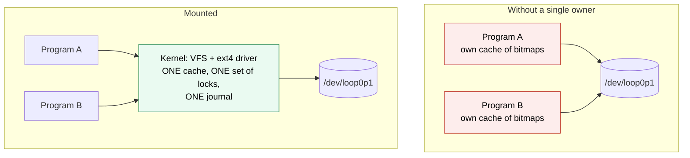
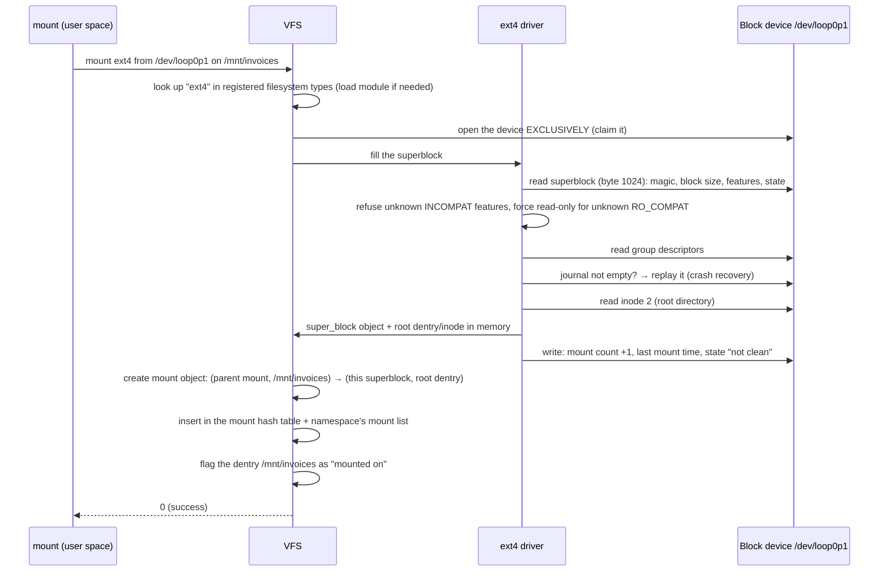
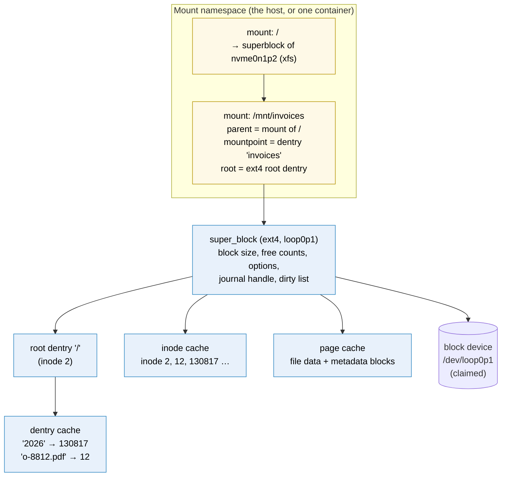
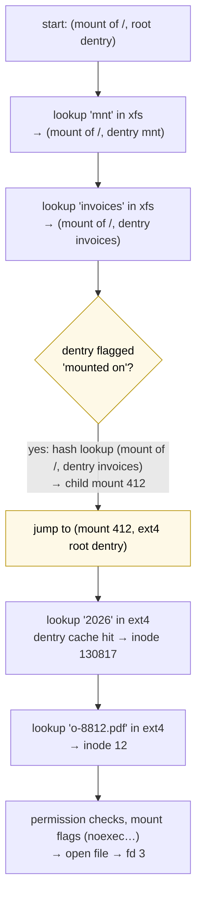
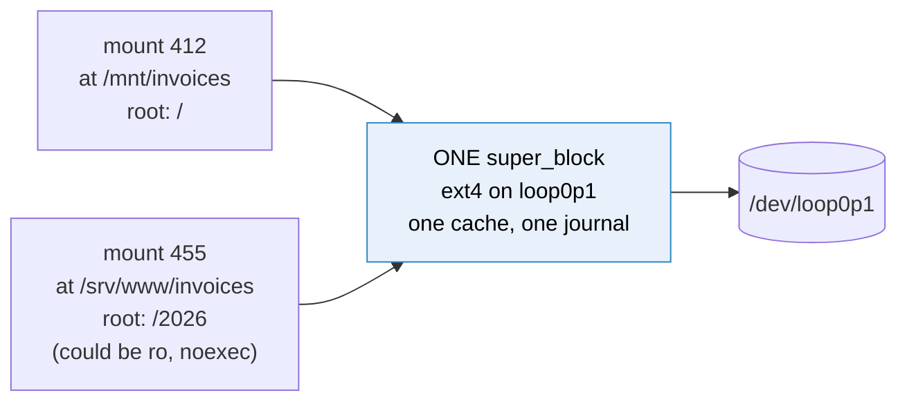
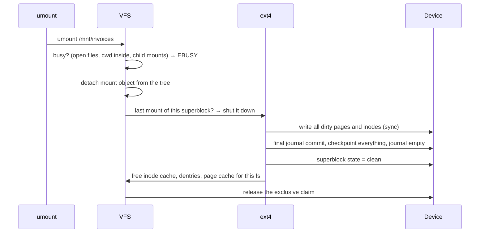

# How mounting works

> [!abstract] In one sentence
> Mounting is the kernel **taking ownership of a device as a filesystem**: `mount` identifies the filesystem type, the kernel claims the device exclusively, the filesystem driver reads and checks the superblock (replaying the journal if needed) and loads the root directory into memory, and a small **mount object** is added to the mount tree saying "path X now continues into the root of filesystem Y"; from then on, every path walk that reaches X jumps into Y, and the kernel's caches for Y stay coherent because it is the **only** one reading and writing that device.

[[Mounting]] covered what mounting looks like from the outside (one tree, `mount`, options, fstab, bind mounts). This note opens the kernel: what happens step by step, which objects exist in memory while something is mounted, how a path walk crosses a mount point, what unmounting has to do, and **why** all of it is necessary.

## Build-up: from a device to a path

Same lab as before: `/dev/loop0p1` holds an ext4 filesystem labeled `invoices` (see [[Partitions and filesystems]]).

```bash
truncate -s 1G ~/disk.img
sudo losetup -fP --show ~/disk.img                                 # → /dev/loop0
sudo parted -s /dev/loop0 mklabel gpt mkpart invoices ext4 1MiB 100%
sudo mkfs.ext4 -q -L invoices /dev/loop0p1
sudo mkdir -p /mnt/invoices
```

### Stage 1: why not just read the device directly?

`/dev/loop0p1` is already a file I can open:

```bash
sudo head -c 2048 /dev/loop0p1 | xxd | sed -n '65p'
# 00000400: 80ff 0000 00fe 0300 …           ← superblock at byte 1024: 65,408 inodes, 261,632 blocks
```

So why can't a program open `o-8812.pdf` *inside* it without mounting? Because the device only gives **bytes at offsets**. To turn `invoices/2026/o-8812.pdf` into bytes, someone must:
1. Understand ext4's on-disk format (superblock, group descriptors, inodes, extents, directories, see [[Inodes]])
2. **Cache** it in RAM, since reading 4 structures from disk for every path component would be unbearably slow
3. **Coordinate** every process that touches it: two programs creating files at the same moment must not both grab the same free inode
4. Keep the on-disk structure consistent across crashes ([[Journaling]])

If every program did this itself, each would have **its own cache**, and they'd overwrite each other's changes: program A allocates inode 13 in its private copy of the bitmap, program B does the same in its copy, both write back, the filesystem is corrupt. There must be **exactly one** interpreter of that device, holding the only authoritative in-memory state. That interpreter is the kernel's ext4 driver, and **mounting is how it's appointed**:



So mounting does three jobs at once:
- **Ownership**: the kernel claims the device and becomes the only one interpreting it (consistency)
- **Naming**: the filesystem's root is attached to a path, so programs reach files with ordinary paths (one namespace, see [[Mounting#Stage 1: one tree vs drive letters]])
- **Policy**: options decided once for everything under that path (read-only, `noexec`, `nosuid`…), and isolation through mount namespaces

### Stage 2: what the `mount` command does in user space

```bash
sudo strace -f -e trace=openat,mount,fsopen,fsconfig,fsmount,move_mount \
  mount /dev/loop0p1 /mnt/invoices 2>&1 | grep -v ENOENT | tail -8
```

1. **Find out the filesystem type**, unless `-t` was given. `mount` uses **libblkid**, which reads known **magic numbers** at known offsets. ext2/3/4 have `0xEF53` at byte 1080 (offset 56 inside the superblock, which starts at 1024):

   ```bash
   sudo dd if=/dev/loop0p1 bs=1 skip=1080 count=2 2>/dev/null | xxd
   # 00000000: 53ef                ← 0xEF53, little-endian
   sudo blkid -p /dev/loop0p1
   # /dev/loop0p1: LABEL="invoices" UUID="5b3e…" VERSION="1.0" TYPE="ext4" USAGE="filesystem"
   ```
   XFS starts with `XFSB`, NTFS has `NTFS    ` at byte 3, btrfs `_BHRfS_M` at 64 KiB + 64
2. **Resolve** `LABEL=`/`UUID=` from fstab to a device path (same libblkid), and parse options
3. **Ask the kernel**. Recent util-linux uses the newer, step-by-step mount API:

   ```text
   fsopen("ext4", FSOPEN_CLOEXEC)                              = 3   ← a filesystem context
   fsconfig(3, FSCONFIG_SET_STRING, "source", "/dev/loop0p1", 0) = 0
   fsconfig(3, FSCONFIG_CMD_CREATE, NULL, NULL, 0)             = 0   ← driver reads the superblock HERE
   fsmount(3, FSMOUNT_CLOEXEC, 0)                              = 4   ← a detached mount object
   move_mount(4, "", AT_FDCWD, "/mnt/invoices", MOVE_MOUNT_F_EMPTY_PATH) = 0   ← attach it to the tree
   ```
   Older versions do it in one call: `mount("/dev/loop0p1", "/mnt/invoices", "ext4", 0, NULL)`. Same kernel work underneath. The new API makes the two halves visible: **create the filesystem instance**, then **attach it somewhere**.

### Stage 3: what the kernel does



Each step explains an error I can get:

| Step | When it fails | Error |
|---|---|---|
| Filesystem type lookup | Driver not built or module missing | `unknown filesystem type 'ntfs3'` (`cat /proc/filesystems` lists what's registered) |
| Exclusive claim | Device already mounted elsewhere, or used by LVM, mdadm, another kernel subsystem | `already mounted or mount point busy` / `Device or resource busy` |
| Superblock read and checks | Wrong type, damaged superblock, partition offset wrong | `wrong fs type, bad option, bad superblock on /dev/loop0p1` (details in `dmesg`) |
| Feature checks | Filesystem made by a newer `mkfs` with features this kernel doesn't know | `couldn't mount RDWR because of unsupported optional features` |
| Journal replay | Device read-only (snapshot, forensic copy) | `cannot mount … read-only` → `-o ro,noload` |

The **feature flags** are a nice piece of design: each filesystem lists features in three classes. **COMPAT**: an old driver can ignore them. **RO_COMPAT**: an old driver may read but not write (it might break them). **INCOMPAT**: an old driver must refuse to mount at all. It's how ext4 evolves without old kernels corrupting new filesystems.

```bash
sudo dumpe2fs -h /dev/loop0p1 2>/dev/null | grep -E 'features|state|Mount count|Last mounted'
# Filesystem features:      has_journal ext_attr resize_inode dir_index filetype extent 64bit flex_bg …
# Filesystem state:         clean
# Mount count:              3
# Last mounted on:          /mnt/invoices
```

### Stage 4: what exists in memory while it's mounted



- **Superblock object**: one per mounted filesystem **instance**. The in-memory twin of the on-disk superblock plus live state (lists of dirty inodes, the journal, mount options of the filesystem itself)
- **Mount object** (`struct mount` / `vfsmount`): small. It only says *where* in the tree, and which superblock and which directory of it appear there. Several mount objects can point to the **same superblock** (Stage 6)
- **Dentry cache**: name → inode lookups already done, including **negative** entries ("`foo` doesn't exist here") so repeated failed lookups don't hit the disk
- **Inode cache** and **page cache**: inodes and blocks read or modified, written back later (see [[Storage devices#Stage 4: between the program and the drive (the block layer and the page cache)]])

Everything in those caches that's **dirty** (modified but not yet on disk) exists **only in this kernel's memory**. That's the deep reason a device may be mounted read-write by only one kernel at a time, and why unmounting matters (Stage 7).

The mount table is visible in `/proc/self/mountinfo`:

```bash
grep invoices /proc/self/mountinfo
# 412 29 7:1 / /mnt/invoices rw,relatime shared:220 - ext4 /dev/loop0p1 rw
#  │   │  │  │       │            │          │         │       │         └ superblock options
#  │   │  │  │       │            │          │         │       └ source
#  │   │  │  │       │            │          │         └ filesystem type
#  │   │  │  │       │            │          └ propagation (Stage 8)
#  │   │  │  │       │            └ per-mount options
#  │   │  │  │       └ mount point
#  │   │  │  └ root: which directory of the filesystem is shown here ("/" = its root)
#  │   │  └ device major:minor
#  │   └ parent mount ID
#  └ mount ID
```

Two kinds of options show up: **per-mount** (`ro`, `noexec`, `nosuid`, `nodev`, `relatime`: they belong to this attachment point) and **per-superblock** (`data=ordered`, `commit=`, `errors=`: they belong to the filesystem instance and are shared by all its mounts).

### Stage 5: crossing a mount point during a path walk

`open("/mnt/invoices/2026/o-8812.pdf")`. The VFS walks component by component, carrying a **(mount, dentry)** pair: "where I am" is always *which filesystem* plus *which directory in it*.



- The xfs directory `invoices` **still exists** with its own content. The walk simply never reads it, because the mount check comes first: that's the "hiding" seen in [[Mounting#Stage 2: mounting, and what it hides]]
- `..` from the ext4 root goes **back up** across the mount: the VFS sees "I'm at the root of mount 412", steps to its mount point in the parent, then takes that directory's `..`
- Mounts can be **stacked**: mounting something else on `/mnt/invoices` again hides the first one; unmounting reveals it

### Stage 6: one filesystem, several places (bind mounts)

```bash
sudo mkdir -p /srv/www/invoices
sudo mount --bind /mnt/invoices/2026 /srv/www/invoices
grep -E 'invoices' /proc/self/mountinfo
# 412 29 7:1 /     /mnt/invoices     rw,relatime shared:220 - ext4 /dev/loop0p1 rw
# 455 30 7:1 /2026 /srv/www/invoices rw,relatime shared:220 - ext4 /dev/loop0p1 rw
```



Two mount objects, same superblock: no copy, no second cache, writes through either path are immediately visible through the other. The `root` field (`/2026`) is how a bind mount shows only a **subdirectory**. Mounting the same device **again** with `mount /dev/loop0p1 /elsewhere` also reuses the existing superblock. Per-mount flags can differ: `mount -o remount,bind,ro /srv/www/invoices` makes only that view read-only.

This is exactly how `docker run -v /srv/uploads:/app/uploads` works: a bind mount into the container's namespace.

### Stage 7: unmounting, giving the device back



That's why:
- **"target is busy"**: something still references an object of that superblock (an open file, a process's current directory, another mount on top). Find it with `lsof +f -- /mnt/invoices` or `fuser -vm`
- **Pulling a USB stick without unmounting** loses data: the dirty pages and the last journal transactions only existed in RAM
- **"clean" vs "not clean"**: at the next mount, a filesystem still marked "not clean" (the machine crashed while mounted) triggers journal replay, and on non-journaled filesystems a full `fsck`
- **Lazy unmount** (`umount -l`) only does the "detach" step now. The superblock stays alive until the last user goes away, invisible from the tree

### Stage 8: mount propagation (why a mount appears, or not, elsewhere)

Mount namespaces give processes separate mount tables (containers, systemd services with `PrivateTmp=`). But sometimes a mount made on the host **should** appear inside a container (a USB disk plugged in later), and sometimes it must not leak out. Each mount has a **propagation type**:

| Type | Mount events under it… | Used by |
|---|---|---|
| **shared** | Propagate **both ways** within its peer group | systemd makes `/` shared by default |
| **slave** | Received from the master, never sent back | Containers that should see new host mounts but not leak theirs |
| **private** | Neither received nor sent | Docker's default for the container root (`rprivate`) |
| **unbindable** | Private, and can't be bind-mounted | Rare |

```bash
findmnt -o TARGET,PROPAGATION /mnt/invoices        # shared
sudo mount --make-private /mnt/invoices
docker run -v /mnt:/mnt:rslave …                  # new mounts under host /mnt appear in the container
```

The `shared:220` tag in mountinfo is the peer group number. This is the usual answer to "I mounted a volume on the host and the running container doesn't see it" (or the opposite in Kubernetes, where CSI drivers need `Bidirectional` propagation).

## Why it matters, in one table

| Without mounting | With mounting |
|---|---|
| Every program parses the on-disk format itself | One driver in the kernel |
| N caches, N sets of locks, corruption | One cache, one lock set, one journal |
| Files reachable only by device + format knowledge | Ordinary paths, same `open()` for disk, NFS, `/proc` ([[Mounting#Stage 3: what the kernel does (the VFS)]]) |
| No place to say "read-only" or "no programs from here" | Per-mount options enforced by the kernel |
| Every process sees every disk | Mount namespaces: containers see only what they're given |
| No moment to flush and mark clean | Unmount writes everything and marks the filesystem clean |

**The single-owner rule beyond one machine:** two machines mounting the same ext4/XFS device read-write (a shared iSCSI LUN, EBS Multi-Attach, a VM disk attached to two VMs, a disk image mounted on the host while the VM runs) means **two kernels, two caches**: guaranteed corruption. Sharing needs either a **network filesystem** (one server owns the disk, clients talk to it, see [[How network file sharing works]]) or a **cluster filesystem** (GFS2, OCFS2) that coordinates caches between machines with a distributed lock manager (see *[[iSCSI and SAN]]*).

## On Windows

Windows splits the same jobs differently (details in [[Windows vs Linux storage]]):
- The **Mount Manager** gives each volume a name: a volume GUID path `\\?\Volume{…}\`, plus a drive letter or a folder mount point. Assignments persist in the registry (`HKLM\SYSTEM\MountedDevices`), the Windows counterpart of fstab
- The filesystem is actually **mounted lazily**: the first time something opens a file on the volume, the I/O manager asks each filesystem driver (ntfs.sys, refs.sys, fastfat.sys…) "is this yours?" by reading its boot sector; the one that recognises it mounts the volume and is linked to it through a **VPB** (volume parameter block)
- Windows also has a single tree internally: `C:` is a symbolic link in the kernel's object namespace (`\??\C:` → `\Device\HarddiskVolume3`). Drive letters are a presentation layer over it

## Advanced problems

### 1. `wrong fs type, bad option, bad superblock`

The generic message. Look at `dmesg | tail` for the real reason. Common ones: mounting the **whole disk** instead of the partition (`/dev/sdb` vs `/dev/sdb1`), a missing helper (`mount.nfs`, `mount.cifs` packages), or a damaged primary superblock. ext4 keeps **backup superblocks** (listed by `mkfs` and `dumpe2fs`):

```bash
sudo mount -o sb=131072 /dev/loop0p1 /mnt/invoices   # backup at block 32768, sb= counts 1 KiB units: 32768 × 4
sudo e2fsck -b 32768 /dev/loop0p1                     # repair using that backup (unmounted!)
```

### 2. Writing to the raw device while it's mounted

`dd` or a backup tool writing to `/dev/loop0p1` while it's mounted bypasses the ext4 driver: the kernel's caches don't know, and will later write back stale metadata over the new bytes. Same with "repairing" a mounted filesystem with `fsck`. Unmount first (or `fsfreeze` for a consistent **read** of the device).

### 3. Duplicate UUIDs after cloning

A disk or snapshot clone attached to the same machine: both filesystems have the same UUID. fstab `UUID=` picks one unpredictably, and **XFS refuses** to mount the second (`Filesystem has duplicate UUID … can't mount`). `mount -o nouuid` for a one-off, or give the clone a new one (`xfs_admin -U generate`, `tune2fs -U random`).

### 4. Filesystem turned read-only by itself

`dmesg` shows `EXT4-fs error … Remounting filesystem read-only`. The driver found an inconsistency and, with `errors=remount-ro` (the usual default for root), stopped writing to avoid making it worse. Writes fail with `Read-only file system`. Fix the cause (disk errors in `dmesg`, `smartctl`), then unmount and `fsck`.

### 5. A mount visible on the host but not in the container (or the reverse)

Propagation (Stage 8): the container's mounts are `private` by default and were copied at container start. Mount the host path with `rslave` propagation, or restart the container after the host mount.

### 6. A disk image with several partitions

`mount disk.img /mnt` fails: the image starts with a partition table, not a filesystem. Expose its partitions first: `losetup -fP --show disk.img` creates `/dev/loopNp1`, `p2`… (or `mount -o loop,offset=$((2048*512))` for one partition).

## Practice

> [!example]- Why does a device have to be mounted before programs can use its files?
> Someone has to interpret the on-disk format, cache it and coordinate all writers. Mounting appoints the kernel's filesystem driver as the single owner and attaches its root to a path.

> [!example]- How does `mount` know a device is ext4 when no type is given?
> libblkid reads magic numbers at known offsets: ext4 has 0xEF53 at byte 1080 of the partition.

> [!example]- What objects does the kernel create when mounting, and which is shared by bind mounts?
> A superblock object (with its caches, journal, state) and a mount object (where it's attached). Bind mounts create new mount objects sharing the same superblock.

> [!example]- During a path walk, how does the VFS notice a mount point?
> The dentry is flagged as mounted on; the VFS looks up (current mount, dentry) in the mount hash table and continues from the child mount's root.

> [!example]- What does unmounting do before releasing the device?
> Writes dirty data and inodes, commits and checkpoints the journal, marks the superblock clean, frees caches.

> [!example]- Why must two servers never mount the same ext4 volume read-write?
> Each kernel has its own cache and allocator state; they overwrite each other's metadata. Use a network or cluster filesystem.

> [!example]- I mounted a disk on the host under /mnt, the container with -v /mnt:/mnt doesn't see it. Why?
> The container's mounts are private copies taken at start; mount propagation must be rslave (or shared) for new host mounts to appear.

## Easy to get wrong
- Thinking mounting copies or loads the filesystem's data into memory (it loads the superblock and root; the rest is read on demand)
- Mounting the whole disk instead of the partition
- Writing to the raw device or running fsck while mounted
- Two machines mounting the same block filesystem read-write
- Confusing per-mount options (ro, noexec) with superblock options (data=, commit=)
- Expecting new host mounts to show up in running containers
- Forgetting `dmesg` after a generic mount error

## Related
- The outside view first:: [[Mounting]]
- What's being mounted:: [[Partitions and filesystems]], [[Inodes]], [[Journaling]] (replay at mount)
- The very first mount (root, from the initramfs):: [[Booting from disk]]
- Underneath:: [[Storage devices]] (block devices, page cache)
- Over the network:: [[NFS and SMB]], [[How network file sharing works]]
- Containers:: [[Docker]]
- Other OS:: [[Windows vs Linux storage]]
- Area:: [[Storage]]

## Flashcards
#flashcards

What three jobs does mounting do? :: Gives the kernel exclusive ownership of the device, attaches the filesystem's root to a path, and applies per-mount policy
Why can't programs share a filesystem by reading the raw device? :: Each would have its own cache and allocator state and they'd corrupt each other; one owner is needed
How does mount detect the filesystem type? :: libblkid reads magic numbers (ext4: 0xEF53 at byte 1080)
New mount API calls in order? :: fsopen, fsconfig (source, then CMD_CREATE), fsmount, move_mount
What does the filesystem driver do at mount time? :: Reads and checks the superblock and features, replays the journal, reads the root inode, marks the fs not clean
COMPAT vs RO_COMPAT vs INCOMPAT features? :: Ignorable / old driver may only mount read-only / old driver must refuse to mount
What is the superblock object? :: The in-memory instance of a mounted filesystem: on-disk superblock data plus caches, dirty lists, journal
What is a mount object? :: A record attaching a superblock's directory to a mount point in the tree
How do bind mounts relate to superblocks? :: Several mount objects point to one superblock: same cache, same data
Where to see the mount table with IDs and propagation? :: /proc/self/mountinfo
Per-mount vs superblock options? :: Per-mount: ro, noexec, nosuid, nodev, atime. Superblock: data=, commit=, errors=
How does a path walk cross a mount point? :: The dentry is flagged mounted; lookup of (mount, dentry) in the mount hash gives the child mount; continue at its root
Why do files under a mount point seem to vanish? :: The walk jumps to the mounted filesystem before reading the underlying directory
What does unmount do? :: Refuses if busy, detaches, syncs dirty data, commits/checkpoints journal, marks clean, frees caches, releases the device
What makes umount say busy? :: Open files, a process cwd inside, or mounts on top
Mount propagation types? :: shared (both ways), slave (receive only), private (none), unbindable
Docker's default propagation for container mounts? :: rprivate
What is a dirty filesystem at mount time? :: State not clean (crash while mounted): journal replay or fsck needed
How to mount using a backup ext4 superblock? :: mount -o sb=<block × blocksize/1024>, e.g. sb=131072 for block 32768 with 4 KiB blocks
Why does XFS refuse to mount a cloned volume on the same machine? :: Duplicate UUID; use -o nouuid or regenerate the UUID
What does errors=remount-ro do? :: On a detected inconsistency the filesystem stops writing and becomes read-only
How does Windows mount a volume? :: Mount Manager names it (GUID path, letter); on first access a filesystem driver recognises it and mounts it (VPB)
How can several machines share one block device safely? :: A cluster filesystem (GFS2, OCFS2) with distributed locking, or a network filesystem served by one owner
