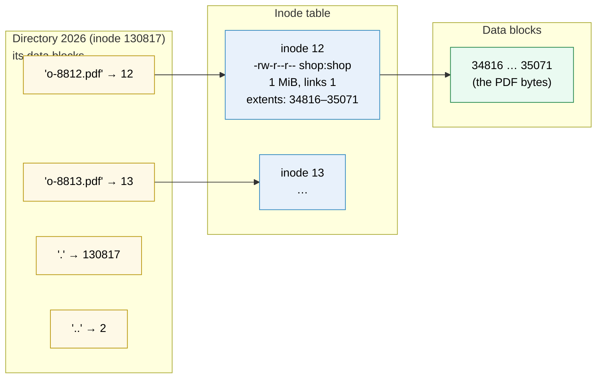
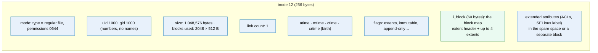
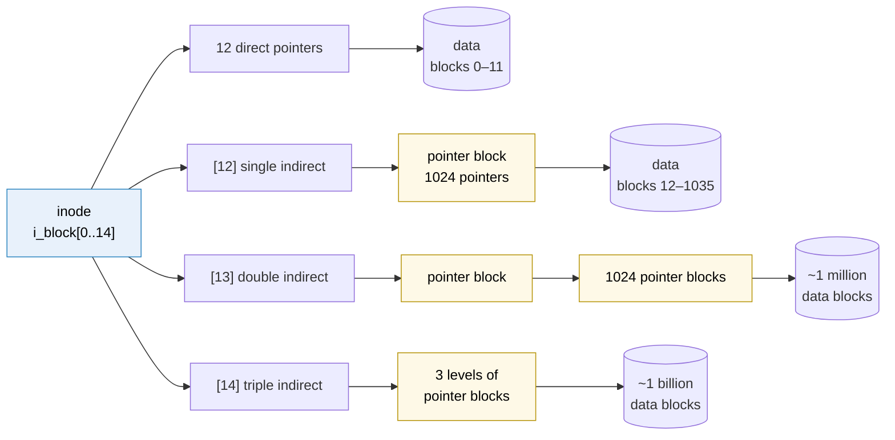
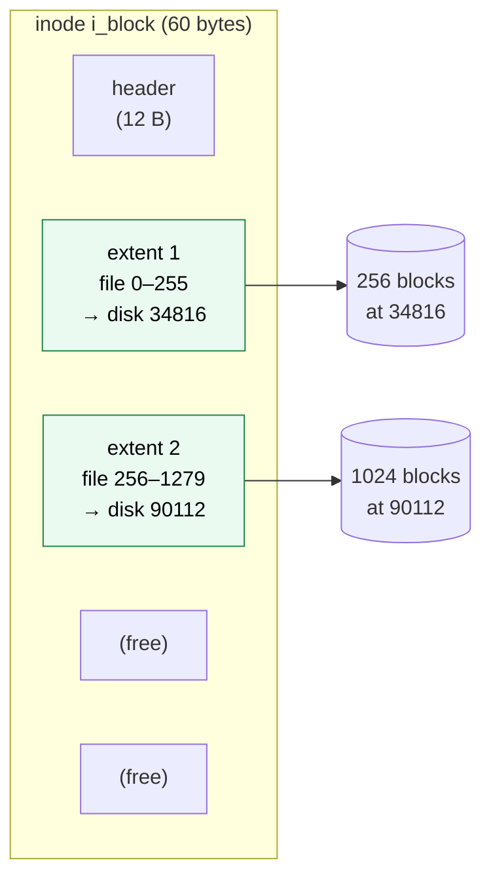
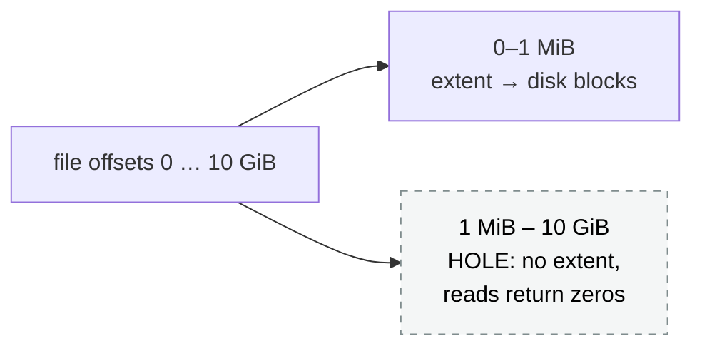
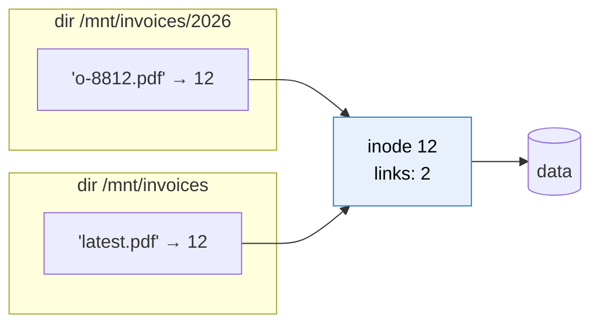
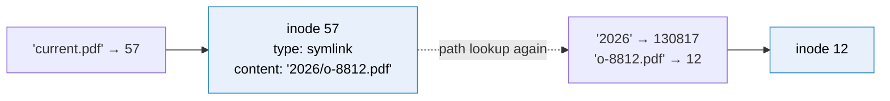
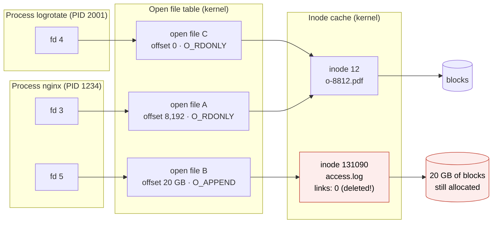
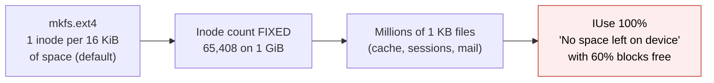

# Inodes

> [!abstract] In one sentence
> An **inode** is the fixed-size record a Unix filesystem keeps for **each file**: who owns it, its permissions, size, timestamps, how many names point to it, and the **map of which disk blocks hold its content**; the file's **name is not in it** (names live in directories as `name → inode number`), and a running program reaches it through a chain **file descriptor → open file → in-memory inode → blocks**.

[[Partitions and filesystems#Stage 4: what a file really is (the inode)]] introduced inodes in one stage. This note takes them apart, mostly with pictures: what's inside, how the block map grows with file size, links, what a process actually holds, and how other filesystems (XFS, btrfs, FAT, NTFS) do the same job.

## The three layers: name, inode, data

Every file access crosses three separate things stored in three separate places:



| Layer | Answers | Lives in |
|---|---|---|
| **Directory entry** | "Which inode is called `o-8812.pdf` here?" | The parent directory's data blocks |
| **Inode** | "Who owns it, how big, which blocks?" | The inode table (fixed place, made by `mkfs`) |
| **Data blocks** | The content | Anywhere free on the partition |

Most of what's surprising about Unix files follows from this split: rename is instant, a file can have two names, a deleted file can still be in use, permissions belong to the file not the name.

## What's inside an inode

An ext4 inode is 256 bytes. Mapping `stat` output to the fields:

```bash
stat /mnt/invoices/2026/o-8812.pdf
#   File: /mnt/invoices/2026/o-8812.pdf          ← NOT from the inode (from the path I typed)
#   Size: 1048576     Blocks: 2048     IO Block: 4096   regular file
# Device: 7,1         Inode: 12        Links: 1
# Access: (0644/-rw-r--r--)  Uid: ( 1000/ shop)   Gid: ( 1000/ shop)
# Access: 2026-10-04 09:12:44.000000000 +0100
# Modify: 2026-10-03 14:32:07.000000000 +0100
# Change: 2026-10-03 14:35:10.000000000 +0100
#  Birth: 2026-10-03 14:32:07.000000000 +0100
```



The four timestamps are a classic trap:

| Stamp | Changes when | Example |
|---|---|---|
| **mtime** (modify) | The **content** changes | Writing to the file |
| **ctime** (change) | The **inode** changes: content, permissions, owner, link count, rename | `chmod`, `chown`, `ln`, writing |
| **atime** (access) | The content is read (only occasionally with the default `relatime`) | `cat` |
| **crtime / birth** | The inode is created | `touch` of a new file |

**ctime is not "creation time"**. Unix had no creation time for decades; ext4 and XFS now record a birth time.

The type in `mode` is why "everything is a file": the same structure describes a regular file, a directory, a symlink, a device (`/dev/nvme0n1`: an inode whose type is "block device" with major/minor numbers instead of blocks), a named pipe or a socket.

## How the block map grows with file size

The inode has only 60 bytes for the map. A 1 TB file has 268 million blocks of 4 KiB. How does 60 bytes describe that?

### The classic way: block pointers (ext2, ext3)

Fifteen 4-byte pointers. The first 12 point **directly** at data blocks. The 13th points at a block **full of pointers** (single indirect), the 14th at a block of pointers to blocks of pointers (double), the 15th one level deeper (triple):



With 4 KiB blocks, one pointer block holds 4096 / 4 = 1024 pointers:

| Pointers | Blocks reachable | Data reachable |
|---|---|---|
| 12 direct | 12 | 48 KiB |
| Single indirect | 1,024 | 4 MiB |
| Double indirect | 1,024² | 4 GiB |
| Triple indirect | 1,024³ | 4 TiB |

Small files (most files) need no extra reads. But a 1 GiB file needs one pointer **per block**: 262,144 pointers, 1 MiB of pointer blocks, and reading a random offset may cost 3 extra reads. Deleting it means visiting every pointer block (slow `rm` of big files on ext3).

### The modern way: extents (ext4, XFS, btrfs, NTFS)

Files are usually stored in **long contiguous runs**. Instead of one pointer per block, store one entry per run: "file blocks 0–255 are at disk blocks 34816–35071". That's an **extent**: 12 bytes in ext4, describing up to 32,768 blocks (128 MiB).



Four extents fit in the inode. A fragmented file with more extents gets an **extent tree**: the inode's slots point to index blocks, which point to blocks of extents (like a B-tree, usually only 1–2 levels deep).

```bash
sudo debugfs -R "stat <12>" /dev/loop0p1 | sed -n '/EXTENTS/,$p'
# EXTENTS:
# (0-255):34816-35071
filefrag -v /mnt/invoices/2026/o-8812.pdf      # extents of any file, any filesystem
```

| | Block pointers | Extents |
|---|---|---|
| A 1 GiB contiguous file | 262,144 pointers (~1 MiB of metadata) | **1 to 8 extents** (each ≤ 128 MiB in ext4) |
| Random access | Up to 3 extra reads | Usually inside the inode |
| Deleting | Walk every pointer block | Free a few ranges |
| Badly fragmented file | Same cost | Many extents → extent tree |

### Tiny files and sparse files

- **Fast symlinks**: a symlink whose target path is under 60 bytes stores it **in `i_block` itself**, no data block at all
- **Inline data** (optional ext4 feature): files of a few dozen bytes stored in the inode
- **Sparse files**: blocks never written aren't allocated. The extent map simply has a **hole**, and reads there return zeros. VM disk images and database files use this:

```bash
truncate -s 10G /mnt/invoices/sparse.img
ls -lh /mnt/invoices/sparse.img     # 10G   ← size field in the inode
du -h  /mnt/invoices/sparse.img     # 0     ← blocks actually allocated
```



That's why `ls -l` (size) and `du` (blocks) can disagree wildly, and why copying a sparse file with a naive tool can turn 0 bytes on disk into 10 GiB (`cp --sparse=always`, `rsync -S` keep the holes).

## Names and links, drawn

**Hard link**: a second directory entry for the same inode. The inode counts its names.



Neither name is the "original". `rm 2026/o-8812.pdf` removes one entry, links drop to 1, the data stays. Hard links can't cross filesystems (an inode number only means something inside its own filesystem) and normally can't point at directories (it would create loops in the tree).

**Symbolic link**: its own inode, whose content is a **path**, resolved again at every access:



Move or delete the target and the symlink **dangles**. But it can point anywhere, including another filesystem or a directory.

**Directory link counts**: a directory's link count is **2 + number of subdirectories**: its entry in the parent, its own `.`, and the `..` of each child. `ls -ld /mnt/invoices` showing `3` means one subdirectory.

## What a process actually holds

When a program opens a file, it doesn't keep the name. It gets a **file descriptor** (a small integer), pointing through two kernel tables to the **in-memory copy of the inode**:



- The **file descriptor** is per process. The **open file** holds the **offset** and the open flags; two processes opening the same file get two open files (independent offsets), while `fork()` shares one (parent and child move the same offset)
- The **in-memory inode** (VFS inode) has a reference count of open files
- An inode's blocks are freed only when **links = 0 and open references = 0**. That's the "deleted log still fills the disk" problem, drawn: `access.log` has no name anymore, but nginx's fd 5 still reaches it (see [[Partitions and filesystems#2. Deleted a 20 GB log, the space didn't come back]])

```bash
ls -l /proc/1234/fd
# 5 -> /var/log/nginx/access.log (deleted)
sudo truncate -s 0 /proc/1234/fd/5     # free the space without restarting nginx
```

This is also how Linux **updates a running program**: the package manager writes the new binary under a temporary name and renames it over the old one. The running process keeps the old inode; new launches get the new one. No "file in use" error (Windows works differently, see [[Windows vs Linux storage]]).

## Finding things by inode

```bash
ls -i /mnt/invoices/2026                    # inode numbers
find /mnt/invoices -inum 12                 # all names of inode 12 (its hard links)
find /mnt/invoices -samefile 2026/o-8812.pdf
df -i /mnt/invoices                         # inodes used/free
sudo debugfs -R "ncheck 12" /dev/loop0p1    # inode → path(s), straight from the filesystem
sudo debugfs -R "icheck 34816" /dev/loop0p1 # disk block → which inode owns it
```

Where inode N lives (ext4): inodes are split evenly across block groups, so inode N is in group `(N − 1) / inodes_per_group`, slot `(N − 1) % inodes_per_group` of that group's inode table. Finding an inode is arithmetic, no search.

Reserved inodes in ext4: 1 bad blocks, **2 root directory**, 7 reserved for growth, 8 **journal**, 11 usually `lost+found` (where `fsck` puts orphaned inodes it finds without a name).

## Inode limits



- ext4 decides the inode count at `mkfs` time (`-i bytes-per-inode` or `-N count`) and can't change it later
- XFS and btrfs allocate inodes **dynamically** as needed (XFS up to a percentage of the space, `imaxpct`)
- The other limit is per file: the size of the block map. ext4 caps a file at 16 TiB with 4 KiB blocks

## Other filesystems, same job

| Filesystem | Per-file record | Where names live | Notes |
|---|---|---|---|
| ext4 | Inode in a fixed table per block group | Directory entries (hashed tree for big dirs) | Count fixed at mkfs |
| XFS | Inodes allocated in chunks of 64, anywhere | Directory B+trees | 64-bit inode numbers, dynamic |
| btrfs | Inode items in a copy-on-write B-tree | Directory items in the same tree | Each subvolume has its own inode number space |
| **FAT32 / exFAT** | **No inodes**: the directory entry holds size, times, first cluster | In the record itself | Hence **no hard links, no Unix permissions**; the cluster chain is in the FAT table |
| **NTFS** | **MFT file record** (1 KiB) | Directory index **and** a copy in the record (`$FILE_NAME`) | Small files stored inside the record; see [[Windows vs Linux storage]] |
| NFS | Server's inode, reached by a **file handle** | Server's directories | The handle embeds the inode number + generation: reuse makes it "stale" (see [[How network file sharing works]]) |

Inode numbers are only unique **within one filesystem**. The real identity of a file on a machine is the pair **(device, inode)**, which is what `find -samefile`, `rsync -H` and backup tools compare. In containers, overlay filesystems can show different inode numbers for the same file after a copy-up (see [[Mounting#Stage 6: not everything mounted is a disk]]).

## Practice

> [!example]- A file has two hard links. Which one is the original?
> Neither. Both are directory entries pointing to the same inode; the inode's link count is 2.

> [!example]- With 4 KiB blocks and classic block pointers, how much data do the 12 direct pointers cover, and the single indirect one?
> 12 × 4 KiB = 48 KiB direct. Single indirect: 1024 pointers × 4 KiB = 4 MiB.

> [!example]- Why do extents need far less metadata for a big file?
> One extent describes a whole contiguous run (up to 128 MiB in ext4) instead of one pointer per block.

> [!example]- `ls -l` says 10G, `du` says 0. How?
> A sparse file: the size field is 10 GiB but no blocks are allocated; holes read as zeros.

> [!example]- I `chmod` a file. Which timestamp changes?
> ctime (inode change), not mtime.

> [!example]- Two processes open the same file and read. Do they share the read position? And after fork?
> Separate opens: separate open-file entries, separate offsets. After fork, the child shares the parent's open file, so the offset is shared.

> [!example]- Why can't FAT32 have hard links?
> There are no inodes: a file's metadata lives in its single directory entry, so a second name would be a second, independent record.

## Easy to get wrong
- Believing the name is in the inode
- Reading ctime as creation time
- Expecting `ls -l` and `du` to agree on sparse files
- Hard links across filesystems or to directories
- Thinking a deleted file's space is free while a process holds it open
- Comparing files by inode number alone across filesystems (use device + inode)
- Forgetting ext4's inode count is fixed at mkfs
- Copying sparse images without sparse-aware flags

## Related
- Before:: [[Partitions and filesystems]] (the filesystem layout that holds the inode table)
- Crash safety of inode updates:: [[Journaling]]
- How a path reaches an inode across mounts:: [[Mounting]], [[How mounting works]]
- Over the network:: [[How network file sharing works]] (file handles)
- Other OS:: [[Windows vs Linux storage]] (NTFS MFT)
- Processes and file descriptors:: [[Inter-process communication]]
- Area:: [[Storage]]

## Flashcards
#flashcards

What is an inode? :: A per-file record: type, permissions, owner, size, timestamps, link count, and the map of data blocks (no name)
The three layers of a file access? :: Directory entry (name → inode), inode (metadata + block map), data blocks
mtime vs ctime? :: mtime: content changed. ctime: inode changed (content, permissions, owner, links, rename)
Is ctime the creation time? :: No. Creation is birth/crtime; ctime is inode change time
Classic ext2 block map? :: 12 direct pointers, then single, double and triple indirect pointer blocks
Data covered by 12 direct pointers with 4 KiB blocks? :: 48 KiB
How many pointers fit in a 4 KiB pointer block? :: 1024 (4-byte pointers)
What is an extent? :: One record for a contiguous run: file blocks X–Y stored at disk blocks A–B
How many extents fit in an ext4 inode? :: 4; more need an extent tree
Max length of one ext4 extent (4 KiB blocks)? :: 32,768 blocks = 128 MiB
What is a fast symlink? :: A symlink whose short target path is stored in the inode itself
What is a sparse file? :: A file with holes: unallocated ranges that read as zeros, so size > blocks used
Link count of a directory? :: 2 + number of subdirectories
fd → ? → ? :: File descriptor → open file (offset, flags) → in-memory inode → blocks
Do two separate opens of a file share the offset? :: No. After fork, parent and child do share it
When are an inode's blocks freed? :: Link count 0 and no open references
How to free space of a deleted-but-open file without restart? :: truncate -s 0 /proc/<pid>/fd/<n>
How to find all names of an inode? :: find <mount> -inum N (or debugfs ncheck)
What uniquely identifies a file on a machine? :: The pair (device, inode number)
ext4 root directory inode? Journal inode? :: 2. 8
Why does FAT have no hard links or Unix permissions? :: No inodes: metadata lives in the directory entry
XFS vs ext4 inode allocation? :: XFS allocates dynamically; ext4's count is fixed at mkfs
