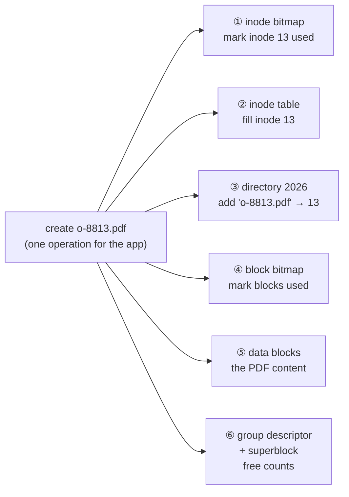
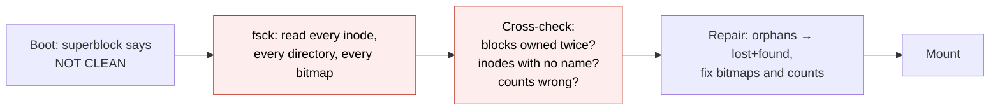
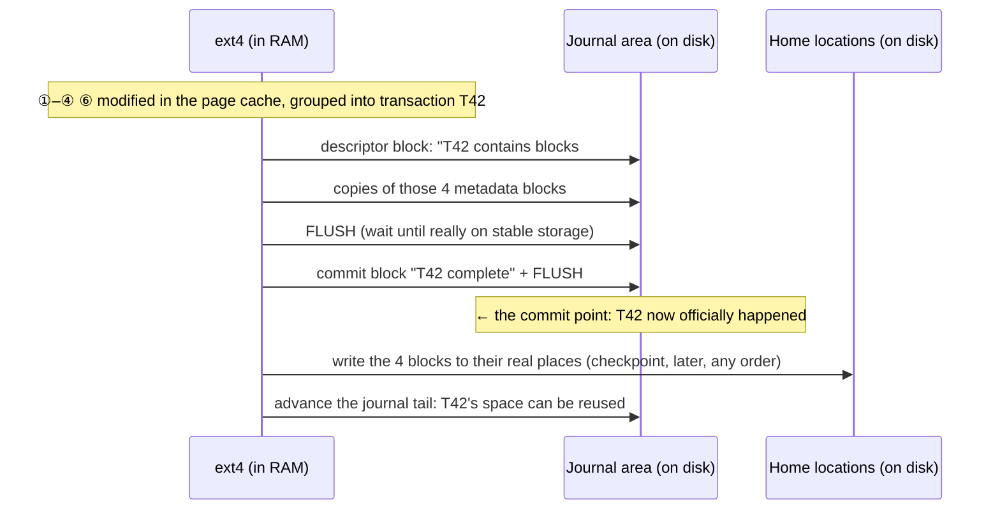
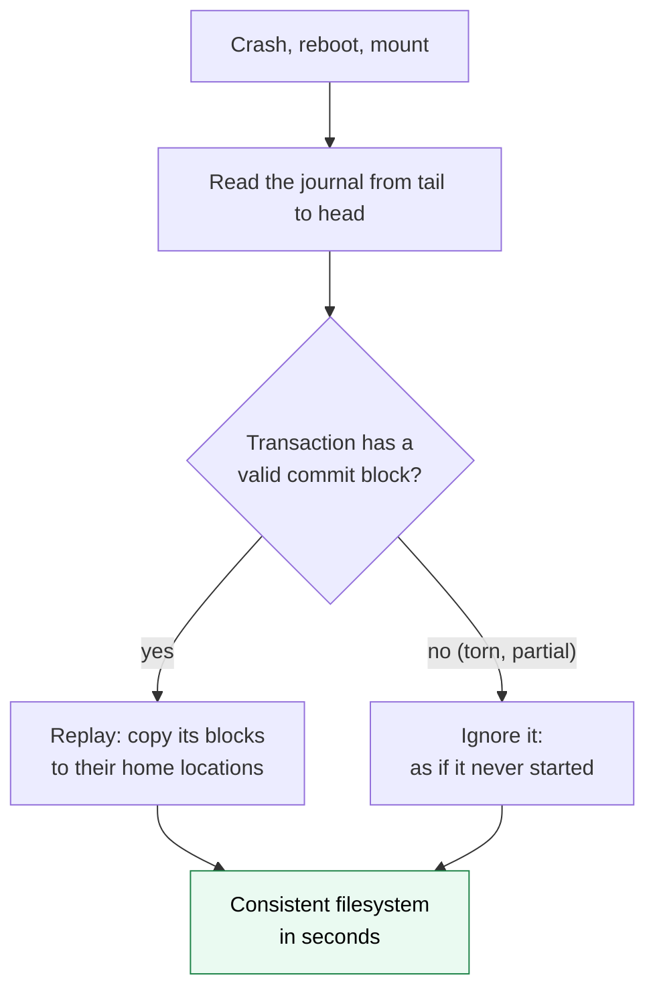
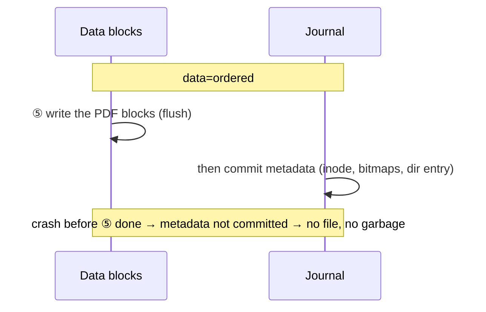
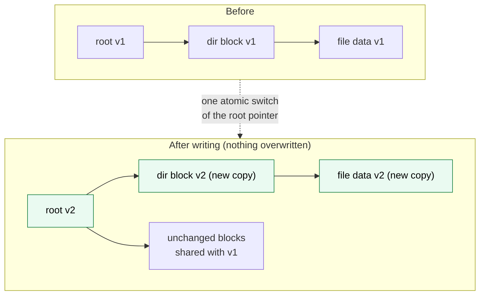
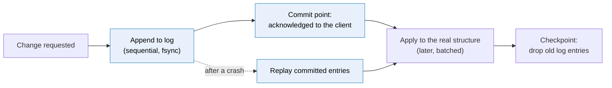

# Journaling

> [!abstract] In one sentence
> When one logical change needs **several separate writes** and a crash can stop it halfway, **journaling** first appends a description of the whole change to a sequential **log** and seals it with a **commit record**, and only then applies it in place; after a crash, committed entries are **replayed** and uncommitted ones ignored, so the change happens **entirely or not at all**, and this "write-ahead log" idea is the same one behind databases, Kafka, consensus systems, RAID and event sourcing.

[[Partitions and filesystems#Stage 7: the power cut (journaling)]] introduced the journal in one stage. Here: why the problem is harder than it looks, how a journal works step by step, the trade-offs between modes, the alternatives (copy-on-write, log-structured), and where else the same pattern shows up.

## Build-up: saving an invoice must survive a power cut

The shop's server writes a new invoice `o-8813.pdf` into `/mnt/invoices/2026` on an ext4 filesystem. Power fails at a random moment.

### Stage 1: one "save" is many writes in many places

Creating one small file changes at least these blocks (see [[Inodes]] for each structure):



Six writes, in six different places on the disk. And the drive gives only one atomicity guarantee: **one sector** (512 B or 4 KiB) is written entirely or not at all. Worse, the OS and the drive **reorder** writes for speed (the drive's own cache, the I/O scheduler), so the order the filesystem issued them isn't the order they land.

### Stage 2: what a crash leaves behind

Depending on which writes made it to the platter or flash before the power died:

| Landed on disk | Didn't | Result after reboot |
|---|---|---|
| ① inode bitmap | ② ③ | An inode marked used that nobody points to: **leaked** |
| ③ directory entry | ① ② | A name pointing to a garbage or **free** inode. Later another file gets inode 13: two names, one inode, **mixed data** |
| ② inode with block list | ④ block bitmap | Blocks used by this file still marked free: the next file gets the same blocks, **two files overwrite each other** |
| ② ③ ④ (metadata) | ⑤ data | A file of the right size full of **old garbage** from whatever was in those blocks (maybe someone else's deleted data) |
| Half of a 4 KiB block (torn write on hardware without atomic sectors) | | A corrupt directory block: **many** files lost |

The structure itself is now lying, and the filesystem has no idea which of its thousands of structures are wrong.

### Stage 3: the first fix, check everything at boot (fsck)

Before journals, the filesystem marked itself "clean" at unmount. If it wasn't clean at boot, **`fsck`** walked the **entire** structure: every inode, every directory, every bitmap, cross-checking that each block is owned once, each inode is referenced, each count matches.



It works, but the time grows with the **size of the filesystem**, not with the size of the damage: one interrupted file creation means reading tens of millions of inodes. On a multi-terabyte server: **hours** offline. And `fsck` can only guess what was intended.

### Stage 4: write the intention first (the journal)

The idea, borrowed from databases: before touching the real structures, **write down the complete change in one place**, sequentially, and mark it as complete. Only then apply it.

The journal is a reserved area (128 MiB on a typical ext4, inode 8, written in a **circular** fashion). One **transaction**:



Recovery after a crash becomes trivial:



Why this is safe in every crash case:
- Crash **before** the commit block is durable: the home locations were never touched (the journal is written first), so the old state is intact. The partial transaction is ignored
- Crash **after** the commit, during or before checkpointing: the journal holds a complete copy of the new blocks. Replay writes them all
- Crash **during replay**: replay again. Copying the same block images twice gives the same result (**idempotent**), which is why ext4 journals whole blocks (**physical journaling**)

Recovery time now depends on the **journal size** (tens of MB), not the filesystem size. A 50 TB filesystem mounts in seconds after a power cut.

### Stage 5: the ordering only works if the disk obeys

The whole scheme depends on one ordering: **journal blocks durable before the commit block, commit block durable before home locations are overwritten**. Drives have volatile write caches and reorder. The filesystem enforces the order with:
- **Cache flush** commands ("write everything in your cache to stable media now")
- **FUA** (Force Unit Access) on the commit block ("this write goes straight to media")
- Journal **checksums** (ext4 `journal_checksum`): a commit block whose checksum doesn't match the transaction is treated as missing, which detects torn transactions

A drive or RAID controller that **lies** (acknowledges flushes but keeps data in a volatile cache without battery or capacitor protection) breaks every guarantee: journaled filesystems and databases get corrupted on power loss anyway. That's why storage arrays have battery- or flash-backed caches, and why `nobarrier`-style options that skip flushes are dangerous (see [[Storage devices#4. "Written" data lost at power failure]]).

### Stage 6: what about the file's data? (journal modes)

Journaling every data block would mean writing all data **twice** (journal, then home). So filesystems usually journal only **metadata**. ext4 offers three modes (`data=` mount option):

| Mode | Journaled | Guarantee after a crash | Cost |
|---|---|---|---|
| `data=journal` | Metadata **and** data | Data and metadata consistent together | All data written twice: slowest |
| `data=ordered` (**default**) | Metadata only, but **data blocks are forced to disk before the metadata transaction that points to them commits** | A file never points to blocks containing garbage. New writes may be lost, but no stale data shows up | Small |
| `data=writeback` | Metadata only, no ordering | Structure consistent, but a file can contain **old garbage** from previously deleted data | Fastest |



**What journaling never promises:** that data the app "wrote" is on disk. `write()` only reaches the page cache. Until the app calls **`fsync()`** (which forces the data and a journal commit) or ext4's periodic commit (every 5 s by default, `commit=` option) runs, a crash loses it. Journaling protects the **structure**, `fsync` protects **content**. An app that writes a config file safely does: write `config.tmp` → `fsync` → `rename` over `config` (an atomic metadata operation) → `fsync` the directory.

### Stage 7: other designs for the same problem

**Logical journaling.** Instead of whole block images, log the operation ("in inode 13 set size = 131072"). Smaller journal entries, but replay must be careful to be idempotent. **XFS** and **NTFS** (`$LogFile`) do this. NTFS logs both **redo** (how to re-apply) and **undo** (how to roll back) information, like a database.

**Copy-on-write (CoW).** Never overwrite a live block. Write every changed block to a **new** location, all the way up the tree to the root, then switch the single root pointer in one atomic write:



A crash before the switch leaves v1 complete; after, v2 complete. No journal needed, no fsck, and keeping the old root around **is a snapshot** for free. **ZFS** and **btrfs** work this way (ZFS adds a small intent log, the ZIL, so `fsync` doesn't have to wait for a whole tree update: journaling is back for latency). The cost: fragmentation and write amplification for files rewritten in place (databases, VM images).

**Log-structured.** Go all the way: the **whole filesystem is a log**. Every write is an append, a garbage collector reclaims old versions. Perfect for flash, which hates in-place overwrites: **F2FS** on phones, and inside every SSD the **FTL** does exactly this (see [[Storage devices]]).

**Soft updates** (BSD's UFS): carefully order metadata writes so any crash leaves only harmless inconsistencies (leaked blocks), cleaned up in the background. Clever, hard to implement, rarely copied.

| Approach | Crash recovery | Extra writes | Examples |
|---|---|---|---|
| None + fsck | Scan everything (hours) | None | ext2, FAT |
| Metadata journal | Replay journal (seconds) | Metadata twice | ext4 (ordered), XFS, NTFS |
| Full journal | Replay | Everything twice | ext4 `data=journal` |
| Copy-on-write | Nothing to do: last root is valid | Tree path rewritten | ZFS, btrfs, APFS |
| Log-structured | Find the last valid checkpoint | Garbage collection | F2FS, SSD firmware |

## The same idea everywhere else

The pattern underneath: **append the intent to a sequential log, mark it committed, apply it later, replay after a crash, truncate the log at checkpoints**. It wins wherever a change touches several places and a crash in between must not leave a half-state. It also wins on **speed**: appending sequentially is the fastest write any device can do, while the "real" updates can be batched and reordered.



| Where | The log | What it protects / enables |
|---|---|---|
| **Relational databases** | **WAL**: PostgreSQL `pg_wal`, MySQL InnoDB **redo log** (+ undo log for rollback), Oracle redo logs | A `COMMIT` returns once the WAL record is fsynced; table and index pages are written later. After a crash, redo replays committed transactions, undo rolls back uncommitted ones. That's the **D** (durability) and much of the **A** (atomicity) in ACID |
| **Database replication** | The same WAL **shipped** to replicas | PostgreSQL streaming replication and point-in-time recovery replay the WAL on another machine or up to a timestamp (see [[RDS]], whose backups + PITR are WAL-based) |
| **Change data capture** | Reading the database's WAL/binlog | Tools like Debezium turn each committed change into an event for [[Kafka]], without touching the app |
| **SQLite** | Rollback journal (old pages saved, undo) or **WAL mode** (new pages appended, redo) | The same trade-off as above in one file next to the database |
| **Kafka** | The **topic partition is the log**, and it is the data | No separate "apply" step: consumers read the log at their own offset, replay from any point (see [[Kafka#Stage 2: a topic is a log]]) |
| **Consensus (Raft, etcd, ZooKeeper)** | Each node's **replicated log** + local WAL | A change is committed when a majority have it in their log; each node applies entries to its state machine in order. A restarted node replays its WAL. Kubernetes' etcd is exactly this |
| **Redis** | **AOF** (append-only file) | Every write command appended; replayed on restart. `appendfsync` = how often it's fsynced, the same durability vs speed knob as ext4's `commit=` |
| **Event sourcing** | The **event store**: `OrderPlaced`, `OrderPaid`… | Current state is a projection rebuilt by replaying events; history and audit for free (see [[Saga pattern]] for coordinating across services) |
| **RAID** | md **write-intent bitmap** and **RAID 5 journal** | A crash mid-stripe leaves data and parity disagreeing (the **RAID 5 write hole**). The bitmap records which regions were being written so only those resync; a journal device closes the hole entirely (see *[[RAID]]*) |
| **NTFS** | `$LogFile` (structure) and the **USN change journal** | The USN journal is a different use: a log of *which files changed*, read by backup software, search indexing and DFS replication instead of scanning the disk (see [[Windows vs Linux storage]]) |
| **Message brokers** | Durable queues persisted to an append-only store | A message acknowledged to the producer survives a broker crash (see [[AMQP]]) |
| **Accounting** | The **ledger** | Entries are never erased; a mistake is fixed by a new correcting entry. The ledger is the truth, balances are derived from it |

What carries over from filesystems to all of these:
- **The commit point** is one small atomic write after the data it covers is durable (commit block, WAL record with checksum, Raft majority ack)
- **Replay must be idempotent**, or tolerate being run twice (log sequence numbers: "already applied up to LSN 4521, skip")
- **The log must be truncated**: checkpoints (filesystem, database), retention (Kafka), compaction (Kafka, Redis AOF rewrite, Raft snapshots)
- **fsync frequency is the durability knob**: per commit (safe, slower) or batched (group commit, `commit=5`, `appendfsync everysec`), losing at most the last batch
- **A lying disk breaks all of them**

Not to confuse: **systemd-journald** ("the journal" in `journalctl`) is a structured **log store** for system messages, not a write-ahead log. Same word, different idea.

## Looking at a real journal

```bash
sudo dumpe2fs -h /dev/loop0p1 | grep -i journal
# Journal inode:            8
# Journal backup:           inode blocks
# Journal features:         journal_incompat_revoke journal_64bit journal_checksum_v3
# Total journal size:       16M
# Journal sequence:         0x00000017
# Journal start:            0          ← 0 = clean, nothing to replay

sudo debugfs -R "logdump" /dev/loop0p1 | head      # transactions currently in the journal
findmnt -o TARGET,OPTIONS /mnt/invoices            # data=ordered appears only if changed from default
cat /proc/fs/jbd2/loop0p1-8/info                   # live stats: transactions, average commit time
```

After an unclean shutdown, the kernel log shows the replay:

```text
EXT4-fs (nvme0n1p2): recovery complete
EXT4-fs (nvme0n1p2): mounted filesystem with ordered data mode.
```

ext4 can also put the journal on a **separate, faster device** (`mkfs.ext4 -J device=/dev/nvme1n1p1`), and XFS has the same with an external log (`-l logdev=`). Useful when metadata-heavy workloads saturate a slow disk.

## Advanced problems

### 1. Corruption after power loss despite journaling

The disk (or a RAID card, or a hypervisor's cache mode) acknowledged writes it only held in volatile cache. The journal's ordering assumptions were violated. Symptoms: `fsck` needed after every outage, database checksum errors. Fix: disable volatile write caching or use protected caches (`hdparm -W 0` on a plain SATA disk, BBU on the controller, `cache=none`/`writethrough` for VM disks), never mount with barriers disabled.

### 2. Data lost though the app "saved" it

The app called `write()` and exited; the crash came before the next commit. The journal did its job (structure intact) but the content was never on disk. Fix in the app: `fsync` at the moments that matter (databases do this per commit). Zero-length files after a crash were a classic symptom of the write-then-rename pattern without `fsync`; ext4 added a heuristic for it, but the correct fix is the app's.

### 3. fsync is slow, everything stalls

On ext4, one `fsync` forces a commit of the **whole** running transaction, including other apps' metadata. One app fsyncing constantly (or a slow device) makes everyone wait on journal commits: `jbd2/sda1-8` high in `iotop`. Mitigations: an external journal on fast storage, a dedicated filesystem for the noisy app, or databases with their own WAL placed on a fast volume.

### 4. Database on a journaling filesystem: double journaling

PostgreSQL already has a WAL. With ext4 `data=journal`, every byte is logged twice by two layers. `data=ordered` (default) is fine; `data=journal` is wasteful. On CoW filesystems (btrfs), database files rewritten in place fragment badly: databases there often disable CoW for their directory (`chattr +C`).

### 5. "Recovery required" but the device is read-only

Mounting a filesystem with a dirty journal from a read-only device (a snapshot attached read-only, forensic image) fails, because replay needs to write. `mount -o ro,noload` (ext4) or `-o ro,norecovery` (XFS) mounts without replaying, showing the state **before** the uncommitted/unapplied transactions.

## In AWS
- EBS volumes honour flushes, so journaled filesystems and databases on them are crash-consistent; an **EBS snapshot** of a running volume is like a power cut at that instant: the filesystem replays its journal when a volume restored from it is mounted ("crash-consistent")
- For application consistency (database files coherent at a transaction boundary), freeze the filesystem (`fsfreeze`) or use the database's own backup, see *[[Snapshots]]*
- [[RDS]] backups and point-in-time restore are the database WAL idea run as a service; [[Kafka vs AWS messaging services]] and Kinesis are logs as a product

## Practice

> [!example]- Why can't the filesystem just write the six blocks in the right order?
> The OS and the drive reorder writes, a crash can stop between any two, and only a single sector is atomic. Without a commit record there's no way to know afterwards which changes were part of a complete operation.

> [!example]- What exactly is the commit point of an ext4 transaction?
> The commit block written (with a flush) after all the transaction's journal blocks are durable. Before it: ignored at recovery. After it: replayed.

> [!example]- Why is replaying a physical journal twice harmless?
> It copies the same full block images to the same locations: the result is identical (idempotent).

> [!example]- What does data=ordered guarantee that data=writeback doesn't?
> Data blocks are written before the metadata pointing to them commits, so after a crash a file never contains stale garbage from other files.

> [!example]- Journaling is on. Why can a saved file still be empty after a crash?
> Journaling protects structure, not content: data not yet fsynced (or committed by the periodic commit) was only in RAM.

> [!example]- How is a PostgreSQL COMMIT like an ext4 journal commit?
> Both append a record describing the change to a sequential log and fsync it before acknowledging; the real pages/blocks are written later and the log is replayed after a crash.

> [!example]- How do copy-on-write filesystems avoid a journal?
> They never overwrite live blocks: new versions go elsewhere and a single root pointer switch makes the whole change visible atomically.

## Easy to get wrong
- Thinking journaling protects file contents that weren't fsynced
- Thinking the journal makes writes slower in general (metadata only by default; often faster thanks to sequential batching)
- Disabling barriers/flushes "for performance"
- Trusting volatile write caches (disk, controller, hypervisor)
- Confusing systemd's journal with a write-ahead log
- `data=journal` under a database that has its own WAL
- Forgetting that the RAID 5 write hole is the same problem one layer down
- Mounting a dirty filesystem from a read-only snapshot without `noload`/`norecovery`

## Related
- Before:: [[Partitions and filesystems]], [[Inodes]] (the structures being protected)
- Underneath:: [[Storage devices]] (sector atomicity, write caches, fsync)
- Same pattern:: [[Kafka]] (the log as the data), [[Saga pattern]], [[AMQP]] (durable queues), [[RDS]] (WAL, PITR), *[[RAID]]* (write hole), *[[Snapshots]]* (crash-consistent copies)
- Other OS:: [[Windows vs Linux storage]] (NTFS $LogFile, USN journal)
- Area:: [[Storage]]

## Flashcards
#flashcards

What problem does journaling solve? :: An operation needing several separate writes can be interrupted by a crash, leaving inconsistent metadata
What is the only write atomicity a drive guarantees? :: A single sector (512 B or 4 KiB)
Why was fsck-at-boot slow? :: It scans the whole filesystem, so time grows with filesystem size, not damage size
What is a journal transaction? :: A group of changed blocks written to the journal, followed by a commit block
What is the commit point? :: The commit block made durable after the transaction's blocks; before it the transaction is ignored, after it replayed
What is checkpointing? :: Writing committed journal blocks to their home locations, then freeing that journal space
Why must replay be idempotent? :: A crash during replay means replaying again; the result must be the same
Physical vs logical journaling? :: Physical: full block images (ext4). Logical: descriptions of operations (XFS, NTFS)
What do cache flushes and FUA do for a journal? :: Enforce that journal blocks reach stable media before the commit, and the commit before checkpointing
ext4 data=journal / ordered / writeback? :: Data+metadata journaled / metadata journaled, data written first / metadata only, no ordering
ext4's default journal mode? :: data=ordered
Does journaling save data that wasn't fsynced? :: No, it protects structure, not unsynced content
Safe way to replace a config file? :: Write temp file, fsync, rename over the original, fsync the directory
What is copy-on-write in filesystems? :: New versions written elsewhere, then one atomic root pointer switch; old roots act as snapshots
What is a log-structured filesystem? :: The whole filesystem is an append-only log with garbage collection (F2FS, SSD FTLs)
What is a database WAL? :: A write-ahead log: changes are appended and fsynced before commit returns, pages written later, replayed after a crash
Redo vs undo log? :: Redo re-applies committed changes; undo rolls back uncommitted ones
How does Raft use a log? :: Entries are committed when a majority store them, then applied in order to each node's state machine
What is the RAID 5 write hole? :: A crash between writing data and parity leaves a stripe inconsistent; fixed by a journal or bitmap
What is NTFS's USN journal? :: A log of which files changed, used by backup, indexing and replication instead of scanning
What is Redis AOF? :: An append-only file of write commands, replayed at restart; appendfsync sets durability
Is systemd-journald a write-ahead log? :: No, it's a log store for system messages
How to mount a dirty ext4 read-only without replaying? :: mount -o ro,noload
Why is an EBS snapshot of a running volume "crash-consistent"? :: It's like a power cut at that instant; the filesystem replays its journal when restored
