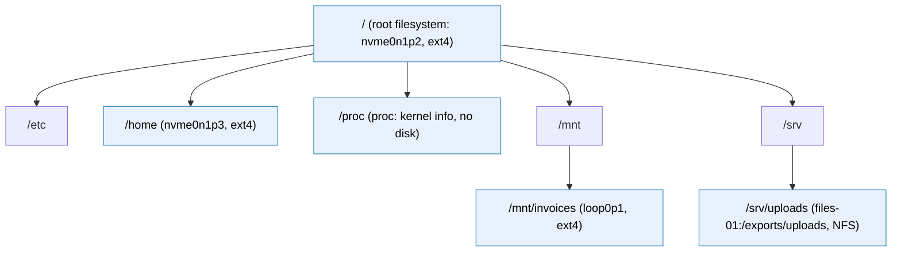
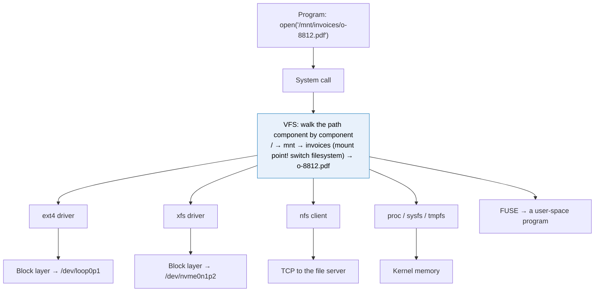

# Mounting

> [!abstract] In one sentence
> Linux has **one single directory tree** starting at `/`, and **mounting** attaches a filesystem (on a local disk, on a server across the network, or purely virtual) to a directory of that tree, the **mount point**: from then on the kernel's **VFS** sends every operation on paths under that directory to that filesystem's driver, so programs use the same `open()`/`read()` whatever is really behind it.

## Build-up: making the invoices filesystem usable

Starting point from [[Partitions and filesystems]]: a fake drive `/dev/loop0` with a partition `/dev/loop0p1` holding an empty ext4 filesystem labeled `invoices`. It exists on the device, but no program can reach a file on it yet: programs open **paths**, and nothing connects a path to that device.

```bash
truncate -s 1G ~/disk.img
sudo losetup -fP --show ~/disk.img                                 # → /dev/loop0
sudo parted -s /dev/loop0 mklabel gpt mkpart invoices ext4 1MiB 100%
sudo mkfs.ext4 -q -L invoices /dev/loop0p1
```

### Stage 1: one tree vs drive letters

Two ways an OS can let programs reach several filesystems:

| | Windows | Linux / Unix |
|---|---|---|
| Model | Each filesystem gets its own root: a **drive letter** | **One tree**. Each filesystem is grafted onto a directory |
| Example | `C:\Windows`, `D:\photos`, `Z:\` (a network share) | `/` (root fs), `/home` (another disk), `/srv/uploads` (NFS) |
| Program sees | Which drive a file is on | Just a path. Which disk or server is behind it is invisible |

(Windows can also mount a volume into an empty NTFS folder, but drive letters are the norm.)

The Linux model means the root filesystem holds `/`, and everything else hangs from directories inside it:



Blue boxes are **mount points**: crossing into them means crossing into another filesystem.

### Stage 2: mounting, and what it hides

```bash
sudo mkdir -p /mnt/invoices
echo "I'm on the root filesystem" | sudo tee /mnt/invoices/note.txt
ls /mnt/invoices
# note.txt

sudo mount /dev/loop0p1 /mnt/invoices
ls /mnt/invoices
# lost+found                       ← the ext4 filesystem's root directory

findmnt /mnt/invoices
# TARGET        SOURCE       FSTYPE OPTIONS
# /mnt/invoices /dev/loop0p1 ext4   rw,relatime

sudo cp ~/some-invoice.pdf /mnt/invoices/
sudo umount /mnt/invoices
ls /mnt/invoices
# note.txt                         ← back: it was hidden, not deleted
```

What happened:
- `mount /dev/loop0p1 /mnt/invoices` made the **root directory of the ext4 filesystem** appear at `/mnt/invoices`
- The directory's **own** content (`note.txt`, which lives on the root filesystem) is **hidden** while something is mounted on top, and comes back after `umount`
- The PDF was written **to the loop device**, not to the root filesystem. After `umount` it's still on `/dev/loop0p1`, just not reachable until mounted again (anywhere: the same filesystem can be mounted at `/mnt/other` next time)

`mount` with no arguments, `findmnt`, or `cat /proc/self/mounts` list **everything** currently mounted. `df -h` shows mounted filesystems and their free space.

### Stage 3: what the kernel does (the VFS)

When I run `mount`, the kernel:
1. Asks the requested filesystem **driver** (ext4) to read the device's **superblock** and check it's really ext4 and in a sane state (replaying the journal if needed)
2. Creates a **mount** object: "filesystem X (device `/dev/loop0p1`, type ext4, options rw) is attached at the directory `/mnt/invoices`"
3. Marks the directory entry `/mnt/invoices` as a **mount point** in its cache

From then on, every file operation goes through the **Virtual File System (VFS)**, the layer that sits between system calls and the actual filesystems:



Walking `/mnt/invoices/o-8812.pdf`:
1. Start at the root directory of the **root filesystem**, look up `mnt` (root fs driver), then `invoices`
2. `invoices` is a **mount point**: the VFS **switches** to the mounted filesystem and continues from **its** root directory (ext4 inode 2)
3. Look up `o-8812.pdf` there (ext4 driver reads its directory entries, see [[Partitions and filesystems#Stage 5: what a directory really is]])
4. Return a file descriptor. Later `read()` calls on it go straight to the ext4 driver's read function

Each filesystem driver plugs into the VFS by providing the same set of operations (look up a name, read, write, create, rename, get attributes…). The VFS doesn't care whether "read" means reading disk blocks, sending a network request, or generating text from kernel data. **That's why a network file system works with unchanged programs**: the NFS client is just another driver behind the VFS (see [[How network file sharing works]]).

### Stage 4: mount options

Options change how the filesystem behaves at this mount:

| Option | Effect | Typical use |
|---|---|---|
| `ro` / `rw` | Read-only / read-write | Mount backups or evidence read-only |
| `noexec` | Can't execute programs from here | `/tmp`, upload directories (an uploaded script can't be run) |
| `nosuid` | setuid bits ignored | Anything users can write to |
| `nodev` | Device files ignored | Same |
| `noatime` / `relatime` | Don't (or rarely) update access times on read | Less write load (relatime is the default) |
| `uid=`, `gid=`, `umask=` | Owner for filesystems without Unix permissions | FAT/exFAT USB sticks |
| `_netdev`, `nofail` | Network-dependent / don't fail boot if missing | NFS, iSCSI, EBS data volumes |

Change options without unmounting: `sudo mount -o remount,ro /mnt/invoices`.

### Stage 5: surviving a reboot (`/etc/fstab`)

Mounts disappear at reboot. `/etc/fstab` lists what to mount at boot, one line per filesystem:

```
# <what>                                   <where>          <type> <options>                 <dump> <fsck order>
UUID=5b3e8c1a-…                            /                xfs    defaults                  0 1
UUID=9d1f2a77-…                            /mnt/invoices    ext4   defaults,nofail,noexec    0 2
files-01:/exports/uploads                  /srv/uploads     nfs4   nfsvers=4.1,hard,_netdev  0 0
tmpfs                                      /tmp             tmpfs  size=2G,noexec,nosuid     0 0
```

- **Identify the device by UUID** (or `LABEL=`), never `/dev/sdb`: device names can change between boots (see [[Storage devices#1. Device names change between boots]]). `blkid` or `lsblk -f` shows UUIDs
- **fsck order**: `1` for root, `2` for others, `0` = never check (network filesystems)
- **Test before rebooting**: `sudo mount -a` mounts everything listed. A typo in fstab can drop the machine into **emergency mode** at the next boot, and on a cloud instance with no console that's painful. `nofail` on non-essential mounts limits the damage

On systemd systems, fstab lines are turned into **`.mount` units** at boot (`systemctl list-units -t mount`). `x-systemd.automount` mounts on **first access** instead of at boot (handy for network shares that may be slow to come up).

### Stage 6: not everything mounted is a disk

```bash
findmnt -t proc,sysfs,tmpfs,cgroup2,overlay,fuse.sshfs
```

| Type | What's behind it |
|---|---|
| `proc` (`/proc`) | Generated by the kernel on read: processes, `/proc/self/mounts`, `/proc/meminfo` |
| `sysfs` (`/sys`) | Kernel objects: devices, drivers (`/sys/block/…`) |
| `tmpfs` (`/tmp`, `/run`, `/dev/shm`) | **RAM**. Fast, lost at reboot |
| `devtmpfs` (`/dev`) | Device files created by the kernel |
| `cgroup2` | Control groups (resource limits, used by containers) |
| `overlay` | Several directories stacked into one view: how **Docker** builds a container's root from image layers (see [[Docker]]) |
| `fuse.*` | **FUSE**: a normal program implements the filesystem (`sshfs` over SSH, `s3fs`/`rclone mount` over an S3 bucket, `gocryptfs`) |
| `nfs4`, `cifs` | A server across the network (see [[NFS and SMB]]) |

All of them answer `open()`/`read()` through the VFS.

### Stage 7: bind mounts and mount namespaces

A **bind mount** makes an existing directory **also** appear somewhere else:

```bash
sudo mount --bind /srv/uploads /var/www/shop/public/uploads
```

Same files, two paths. Nothing is copied.

**Mount namespaces** give a process its **own** mount table. That's how containers see their own `/`:
- `docker run` creates a new mount namespace, mounts an `overlay` of the image layers as the container's root, mounts its own `/proc`, `/dev`, `/sys`
- `docker run -v /srv/uploads:/app/uploads` is a **bind mount** from the host into that namespace
- The host's other mounts are simply not in the container's table

```bash
sudo ls -l /proc/$(pgrep -o nginx)/ns/mnt     # which mount namespace a process is in
sudo nsenter -t <container-pid> -m findmnt    # the mount table as the container sees it
```

### Stage 8: unmounting

```bash
sudo umount /mnt/invoices
# umount: /mnt/invoices: target is busy.
```

Something still uses the filesystem: a process with an open file, or a shell whose **current directory** is inside it.

```bash
sudo lsof +f -- /mnt/invoices          # who has files open there
sudo fuser -vm /mnt/invoices           # processes using the mount
```

Close them (or `cd` out), then unmount. `umount -l` (lazy) detaches the path immediately and finishes when the last user is gone: useful for a dead NFS server, risky for data in flight. Unmounting **flushes** the filesystem's dirty data to the device; pulling a USB stick without unmounting can lose writes still in the page cache.

## Advanced problems

### 1. The mount that didn't happen

At boot, the data volume's fstab entry fails (UUID changed after a restore, `nofail` set). The machine boots fine, and the app starts writing uploads into `/srv/uploads`, which is now just an **empty directory on the root filesystem**. Days later: the root disk is full, and when someone fixes the mount, the uploads written meanwhile **disappear** (hidden under the mount). Defenses:
- Make services depend on the mount (systemd `RequiresMountsFor=/srv/uploads`)
- Make the mount point itself unwritable when unmounted (`chattr +i /srv/uploads` on the empty directory)
- Alarm on unexpected root disk growth (see [[CloudWatch agent]])

### 2. A dead network mount freezes everything

The NFS server is down. `df`, `ls /srv`, even shell tab-completion hang: they touch the mount, and a `hard` NFS mount waits forever (see [[NFS and SMB#2. Hard vs soft mounts]]). `umount -f -l /srv/uploads` to detach it; `findmnt` (which reads `/proc` without touching the mount) still works.

### 3. Files "missing" after mounting over a directory

Someone mounts a new volume at `/var/lib/app`, which already contained data. The old data isn't gone, it's **hidden** under the mount. Unmount (or bind-mount `/` elsewhere: `mount --bind / /mnt/rootview`) to see and move it.

### 4. Permissions differ on the mount

Files on a FAT/exFAT stick all belong to root and ignore `chmod`: the filesystem has no Unix permissions, so the mount options (`uid=`, `gid=`, `umask=`) decide. On NFS, ownership comes from the **server** and numeric UIDs must match across machines.

## In AWS
- A new **EBS** volume: attach → `mkfs` once → mount → add to fstab **by UUID with `nofail`** (an instance that can't find a data volume must still boot)
- **EFS** is mounted with `mount -t efs` or `-t nfs4` and `_netdev` in fstab (see [[EFS]])
- **Instance store** volumes come back empty after stop/start: the fstab entry must tolerate it (`nofail`), and the filesystem must be re-created at boot

## Practice

> [!example]- What does `mount /dev/loop0p1 /mnt/invoices` actually do?
> Attaches the filesystem on that device to the directory, so paths under `/mnt/invoices` are handled by its driver (ext4) starting from its root directory.

> [!example]- I mounted a disk on a non-empty directory. Are the old files deleted?
> No, hidden. They reappear after `umount`.

> [!example]- How can the same `cat` command read a local disk, a network share and `/proc`?
> The VFS gives every filesystem driver the same interface. `cat` calls open/read, the VFS dispatches to ext4, the NFS client or procfs.

> [!example]- Why use `UUID=` in fstab?
> Device names like `/dev/sdb` can change between boots. The UUID belongs to the filesystem.

> [!example]- `umount` says "target is busy". What next?
> Find users with `lsof +f -- <mount>` or `fuser -vm <mount>` (including shells whose current directory is inside), stop them, retry.

> [!example]- How do Docker containers get their own filesystem view?
> A mount namespace with an overlay root built from image layers, plus bind mounts for volumes.

## Easy to get wrong
- Thinking mounting copies data (it attaches a view)
- Thinking files under a mount point are deleted (they're hidden)
- `/dev/sdX` in fstab instead of UUIDs
- Editing fstab and rebooting without `mount -a`
- Missing `nofail` / `_netdev` on data and network mounts
- Apps writing into an unmounted mount point (root disk fills, data hidden later)
- `umount -l` on a filesystem with writes in progress
- Pulling removable media without unmounting
- Forgetting a container's mounts are a separate namespace

## Related
- Before:: [[Storage devices]], [[Partitions and filesystems]]
- Network filesystems:: [[NFS and SMB]], [[How network file sharing works]], [[EFS]]
- Containers:: [[Docker]] (overlay, bind mounts)
- Processes and files:: [[Inter-process communication]]
- Area:: [[Storage]]

## Flashcards
#flashcards

What is mounting? :: Attaching a filesystem to a directory (mount point) in the single directory tree
What happens to existing files in a mount point directory? :: They're hidden while something is mounted there, not deleted
What is the VFS? :: The kernel layer between system calls and filesystem drivers, giving them all the same interface
Why do programs work unchanged on NFS? :: The NFS client is a filesystem driver behind the VFS, like ext4
Linux single tree vs Windows drive letters? :: Linux grafts every filesystem onto a directory under /. Windows gives each its own root letter
How to list current mounts? :: findmnt, mount, or /proc/self/mounts
What is /etc/fstab? :: The list of filesystems to mount at boot: device, mount point, type, options, dump, fsck order
Why identify devices by UUID in fstab? :: Device names can change between boots
How to test fstab before rebooting? :: sudo mount -a
What do _netdev and nofail do? :: _netdev: wait for the network. nofail: don't fail the boot if the mount fails
What does noexec do? :: Prevents executing programs from that mount
What is a bind mount? :: Making an existing directory also appear at another path
What is a mount namespace? :: A separate mount table for a group of processes (how containers get their own /)
What is FUSE? :: Filesystem in Userspace: a normal program implements the filesystem (sshfs, s3fs)
What is tmpfs? :: A filesystem stored in RAM
umount says target is busy. Tools? :: lsof +f -- <dir> and fuser -vm <dir>
What does umount -l do? :: Lazy unmount: detaches the path now, cleans up when no longer used
What does unmounting do to pending writes? :: Flushes them to the device
