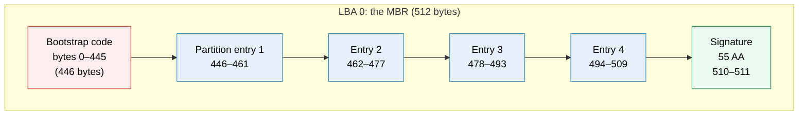
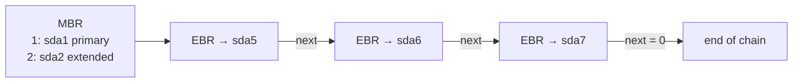
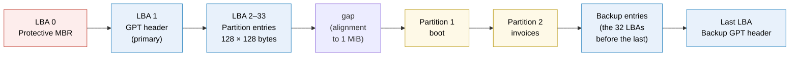
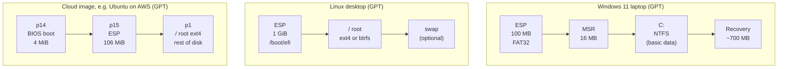

# Partition tables (GPT and MBR)

> [!abstract] In one sentence
> A **partition table** is a small, standard data structure at the start of a drive that says "blocks A to B are partition 1, of type X", so every OS and firmware agrees on how the drive is cut up: **MBR** (1983) packs four 16-byte entries into the drive's very first 512-byte sector, with 32-bit block numbers that cap disks at **2 TiB**, while **GPT** (part of the UEFI standard) uses 64-bit block numbers, 128 entries identified by **GUIDs**, **checksums**, and a **backup copy at the end of the drive**.

[[Partitions and filesystems]] showed *why* a drive is split into partitions. This note is about the table itself: what is physically written in those first sectors, byte by byte, and why GPT replaced MBR.

## Build-up: how do I tell every OS where my partitions are?

I have a blank 1 GiB drive `/dev/loop0` (a loop device, see [[Storage devices#Practice: a fake drive on my machine]]): 2,097,152 sectors of 512 bytes, numbered 0 to 2,097,151 (LBA). I want two partitions: a small one for boot files and a big one for invoices.

```bash
truncate -s 1G ~/disk.img
sudo losetup -fP --show ~/disk.img      # → /dev/loop0
```

### Stage 1: the problem, a notebook nobody else can read

The drive itself knows nothing about partitions: it only stores numbered blocks. If I keep "partition 1 = sectors 2048 to 206847" in a text file on my laptop, then the firmware at boot, the Linux installer, Windows, a recovery USB stick all have no idea. The split must be written **on the drive**, at a **fixed place**, in a **format everyone agrees on**. The obvious fixed place: the very first sector, LBA 0.

### Stage 2: MBR, the 1983 answer (one sector does it all)

The **Master Boot Record** is sector 0 of the drive, exactly 512 bytes:



- **Bootstrap code** (446 bytes): a tiny program the old BIOS runs at power-on (the boot process is in [[Booting from disk]]). It doesn't belong to the partition table at all: MBR mixes **boot code** and **partition layout** in one sector
- **Four entries** of 16 bytes each
- **`55 AA`**: the "this sector is valid" signature

One entry, 16 bytes:

| Bytes | Field | Example |
|---|---|---|
| 1 | Status: `0x80` = active (bootable), `0x00` = not | `80` |
| 3 | Start address in old CHS form (cylinder/head/sector), ignored today | |
| 1 | **Type**: one byte saying what's inside | `83` |
| 3 | End address in CHS | |
| 4 | **Start LBA** (32-bit) | `00 08 00 00` = 2048 |
| 4 | **Number of sectors** (32-bit) | |

Common type bytes: `83` Linux filesystem, `82` Linux swap, `8E` Linux LVM, `07` NTFS/exFAT, `0C` FAT32, `EF` EFI system partition, `05`/`0F` extended, `EE` "GPT protective" (Stage 4).

Let me make one and read it raw:

```bash
sudo parted -s /dev/loop0 mklabel msdos mkpart primary ext4 1MiB 100%
sudo dd if=/dev/loop0 bs=512 count=1 2>/dev/null | xxd | tail -6
# 000001b0: 0000 0000 0000 0000 d1a2 6f3c 0000 0020  ..........o<...
# 000001c0: 2100 83aa 2882 0008 0000 00f8 1f00 0000  !...(...........
# 000001d0: 0000 0000 0000 0000 0000 0000 0000 0000  ................
# 000001e0: 0000 0000 0000 0000 0000 0000 0000 0000  ................
# 000001f0: 0000 0000 0000 0000 0000 0000 0000 55aa  ..............U.
```

Reading it: the first entry starts at offset `0x1BE` (446). Type byte `83` (Linux). Start LBA `00 08 00 00` read little-endian = `0x00000800` = **2048**. Size `00 f8 1f 00` = `0x001ff800` = 2,095,104 sectors. The last two bytes are `55 aa`. Entries 2–4 are all zeros: unused. (`d1a2 6f3c` at offset 440 is the **disk signature**, which Windows uses to recognise the disk.)

**The limits that killed MBR:**

| Limit | Cause | Consequence |
|---|---|---|
| **2 TiB** max | Start and size are 32-bit sector counts: 2³² × 512 B = 2 TiB | A 4 TB disk: half of it is unreachable |
| **4 partitions** | Only 4 entries fit in 64 bytes | Workaround below |
| **No redundancy** | One copy, in sector 0 | One bad sector, or a tool writing boot code carelessly, and the whole layout is gone |
| **No checksum** | | Corruption goes unnoticed |
| **One-byte types** | 256 possible values, assigned informally | Collisions between vendors |
| **Boot code shares the sector** | | Every OS installer overwrites the other one's boot code (dual-boot fights) |

**The 4-partition workaround: extended and logical partitions.** One of the four entries can be an **extended** partition (type `05`/`0F`), a container. Inside it, a **chain** of Extended Boot Records (EBRs): each one describes one **logical** partition and points to the next EBR. Linux numbers logical partitions from 5 (`sda5`, `sda6`…), whatever the primary ones are.



A linked list scattered across the disk, where one broken link loses every partition after it.

### Stage 3: GPT, designed with the failures in mind

**GPT** (GUID Partition Table) was defined as part of the **UEFI** firmware standard (the replacement for BIOS). Same job, but every limit above is fixed:

```bash
sudo parted -s /dev/loop0 mklabel gpt \
  mkpart boot fat32 1MiB 257MiB \
  mkpart invoices ext4 257MiB 100%
sudo parted -s /dev/loop0 set 1 esp on
```

Where everything lands:



**The GPT header (LBA 1)**, the most important fields:

| Field | Size | Value here | Why it exists |
|---|---|---|---|
| Signature | 8 | `EFI PART` | "This is a GPT disk" |
| Header CRC32 | 4 | checksum | Detects a corrupted header |
| Current LBA / Backup LBA | 8 + 8 | 1 / 2,097,151 | Each copy knows where the other one is |
| First / last usable LBA | 8 + 8 | 34 / 2,097,118 | Where partitions may go |
| **Disk GUID** | 16 | random | Identifies the disk |
| Partition entries start | 8 | 2 | Where the table is |
| Number of entries × entry size | 4 + 4 | 128 × 128 | 16 KiB of entries = 32 sectors |
| Entries CRC32 | 4 | checksum | Detects a corrupted table |

```bash
sudo dd if=/dev/loop0 bs=512 skip=1 count=1 2>/dev/null | xxd | head -2
# 00000000: 4546 4920 5041 5254 0000 0100 5c00 0000  EFI PART....\...
# 00000010: 8f3a 21c4 0000 0000 0100 0000 0000 0000  .:!.............
```

`45 46 49 20 50 41 52 54` is ASCII for `EFI PART`. `5c` = 92, the header size. Next comes the CRC, then `01` = current LBA 1.

**One partition entry (128 bytes):**

| Bytes | Field | Meaning |
|---|---|---|
| 16 | **Partition type GUID** | *What* the partition is for (ESP, Linux filesystem, Windows data…) |
| 16 | **Unique partition GUID** | *Which* partition this is: the **PARTUUID** |
| 8 | First LBA | 64-bit |
| 8 | Last LBA | 64-bit |
| 8 | Attributes | Flags: required by the platform, hidden, no automount, "legacy BIOS bootable" |
| 72 | **Name** | Up to 36 characters (UTF-16): the **PARTLABEL**, e.g. `invoices` |

```bash
sudo sgdisk -p /dev/loop0
# Number  Start (sector)    End (sector)  Size       Code  Name
#    1            2048          526335   256.0 MiB   EF00  boot
#    2          526336         2095103   766.0 MiB   8300  invoices

sudo sgdisk -i 1 /dev/loop0
# Partition GUID code: C12A7328-F81F-11D2-BA4B-00A0C93EC93B (EFI system partition)
# Partition unique GUID: 4B8E…
# First sector: 2048 (at 1024.0 KiB)
# Partition name: 'boot'

lsblk -o NAME,SIZE,PARTTYPENAME,PARTLABEL,PARTUUID /dev/loop0
```

(`EF00`/`8300` are `gdisk`'s short codes for the GUIDs.)

What each fix buys:

| MBR problem | GPT fix |
|---|---|
| 2 TiB | 64-bit LBAs: 8 ZiB with 512-byte sectors. Not a limit in practice |
| 4 partitions + logical chain | 128 entries by default, all equal, no extended/logical |
| One copy | **Primary at the start, backup at the end.** If one is damaged, tools rebuild it from the other |
| No checksum | CRC32 on the header and on the entry array: corruption is **detected** |
| 1-byte types | 128-bit **type GUIDs**: anyone can define a new type without collisions |
| Boot code in the table's sector | GPT holds **no boot code**. UEFI boots from files in a partition (the ESP, see [[Booting from disk]]) |

### Stage 4: the protective MBR (LBA 0 on a GPT disk)

GPT starts at LBA **1**. LBA 0 still holds an MBR, on purpose: an old tool that only understands MBR would see an "empty" disk and happily create a partition over my data. So GPT writes a **protective MBR**: a single entry of type **`EE`** covering the whole disk (or 2 TiB, whichever is smaller). An MBR-only tool sees "one partition of unknown type fills the disk" and leaves it alone.

```bash
sudo fdisk -l -t dos /dev/loop0    # force reading it as MBR
# Device       Boot Start     End Sectors Size Id Type
# /dev/loop0p1          1 2097151 2097151   1G ee GPT
```

(A **hybrid MBR**, where the protective MBR also lists some real GPT partitions so old Macs could boot Windows via BIOS, is a fragile hack: two tables that can disagree. Avoid it.)

### Stage 5: partition types and real layouts

Type GUIDs worth recognising:

| Type | GUID | gdisk code | Used by |
|---|---|---|---|
| **EFI system partition** | `C12A7328-F81F-11D2-BA4B-00A0C93EC93B` | `EF00` | UEFI firmware (FAT32, bootloaders) |
| **BIOS boot** | `21686148-6449-6E6F-744E-656564454649` | `EF02` | GRUB booting a GPT disk via legacy BIOS |
| Linux filesystem | `0FC63DAF-8483-4772-8E79-3D69D8477DE4` | `8300` | ext4, XFS, btrfs… |
| Linux swap | `0657FD6D-A4AB-43C4-84E5-0933C84B4F4F` | `8200` | Swap |
| Linux LVM | `E6D6D379-F507-44C2-A23C-238F2A3DF928` | `8E00` | LVM physical volume |
| Microsoft basic data | `EBD0A0A2-B9E5-4433-87C0-68B6B72699C7` | `0700` | NTFS, exFAT, FAT (Windows data, `C:`) |
| Microsoft reserved (MSR) | `E3C9E316-0B5C-4DB8-817D-F92DF00215AE` | `0C01` | 16 MB Windows keeps for itself, no filesystem |
| Windows recovery | `DE94BBA4-06D1-4D40-A16A-BFD50179D6AC` | `2700` | Windows RE |

The **type** is a hint, not enforcement: a "Linux filesystem" partition can contain NTFS. But software relies on it: the firmware finds the ESP **by its type GUID**, Windows hides partitions it doesn't recognise, systemd can auto-mount partitions by type ("Discoverable Partitions").

Real layouts:



The cloud image has **both** a BIOS boot partition and an ESP so the same image boots on machines with legacy BIOS and with UEFI. The root partition is numbered 1 but placed **last** on the disk: numbers are just entry slots, not positions, and putting root last lets `growpart` extend it when the volume grows.

### Stage 6: two different UUIDs (PARTUUID vs UUID)

```bash
sudo mkfs.ext4 -q /dev/loop0p2
lsblk -o NAME,PARTUUID,UUID /dev/loop0
# NAME       PARTUUID                              UUID
# loop0p1    4b8e…                                  
# loop0p2    9a71c2e0-…                            5b3e8c1a-…
```

| | **PARTUUID** | **UUID** |
|---|---|---|
| Stored in | The **GPT entry** (partition table) | The **filesystem superblock** |
| Created by | Partitioning (`parted`, `sgdisk`) | `mkfs` |
| Changes when | The partition is re-created | The partition is **reformatted** |
| Exists without a filesystem | Yes | No |
| Used in | Kernel command line `root=PARTUUID=…`, UEFI boot entries | `/etc/fstab` `UUID=…` (see [[Mounting#Stage 5: surviving a reboot (`/etc/fstab`)]]) |

Reformatting keeps the PARTUUID and changes the UUID. Cloning a disk copies **both**, and two disks with identical IDs in one machine confuse everything that looks them up (Advanced problems).

## Advanced problems

### 1. The disk was enlarged and tools complain about GPT

A 20 GiB cloud volume is resized to 50 GiB. The **backup GPT is still at the 20 GiB mark**, not at the end, so `gdisk`/`parted` warn: "The backup GPT table is not at the end of the disk" / "GPT PMBR size mismatch". Partitions can't use the new space until the backup header is moved:

```bash
sudo sgdisk -e /dev/nvme1n1      # move backup structures to the end of the disk
sudo growpart /dev/nvme1n1 1     # growpart does this itself before growing partition 1
```

### 2. "Invalid primary GPT header" or a wiped first sectors

Something overwrote the start of the disk (a `dd` to the wrong device, an MBR-only tool). The **backup** at the end is intact:

```bash
sudo gdisk /dev/sdb
# Caution: invalid main GPT header, but valid backup; regenerating main header from backup!
# → r (recovery menu) → b (use backup header) → c (load backup partition table) → w
```

The filesystems inside the partitions weren't touched, only the map pointing at them. Rewriting the same partition boundaries brings everything back. With MBR, there's no backup: `testdisk` scans the disk for filesystem signatures to guess the old layout.

### 3. MBR disk bigger than 2 TiB

A new 4 TB data disk was partitioned with `msdos` (MBR): the partition stops at 2 TiB, and the rest is unusable. Data disks: recreate with GPT (`parted mklabel gpt` erases the table). A **boot** disk on old BIOS firmware can still use GPT (BIOS boot partition for GRUB). Windows needs UEFI to boot from GPT.

### 4. Leftover signatures

A disk reused from another machine still has an old filesystem or RAID signature, and tools (or the installer) detect "existing" things: `blkid` lists a stale `TYPE=`, `mdadm` assembles an old array. `wipefs` lists and removes signatures (partition tables, filesystems, LVM, RAID), including GPT's backup at the end that a quick `dd` of the first MiB misses:

```bash
sudo wipefs /dev/sdb            # list
sudo wipefs -a /dev/sdb         # erase all (destructive)
```

### 5. Converting MBR to GPT

- Linux: `gdisk /dev/sdb` reads an MBR disk and writes GPT **without moving data**, as long as there's room for the GPT structures at the start (partitions starting at 1 MiB leave plenty) and at the end
- Windows: `mbr2gpt /convert /disk:0 /allowFullOS` converts the system disk in place, creates the ESP, and then the firmware must be switched from Legacy/CSM to **UEFI** or the machine won't boot (see [[Booting from disk]])

## On Windows

Same tables, different tools (the full comparison is in [[Windows vs Linux storage]]):

```powershell
Get-Disk                                   # PartitionStyle column: GPT, MBR or RAW
Get-Partition -DiskNumber 0                # type shown as System (ESP), Reserved (MSR), Basic, Recovery
```

```text
diskpart
DISKPART> list disk          ← a "*" in the Gpt column means GPT
DISKPART> select disk 1
DISKPART> convert gpt        ← only on an EMPTY disk (it erases), unlike mbr2gpt
```

Windows doesn't assign a drive letter to the ESP, MSR or recovery partitions, which is why they're invisible in Explorer. Disk Management shows them.

## In AWS
- EBS volumes are raw block devices: a data volume can carry GPT, or no partition table at all (filesystem directly on `/dev/nvme1n1`)
- AMIs come in boot modes **legacy-bios** and **uefi**; images built to support both carry a BIOS boot partition **and** an ESP (Stage 5)
- After growing a volume: `growpart` (which also moves the backup GPT) then grow the filesystem (see [[Partitions and filesystems#4. Growing a filesystem after enlarging the volume]])

## Practice

> [!example]- Why can't an MBR disk use more than 2 TiB?
> Start and length are 32-bit sector counts: 2³² × 512 bytes = 2 TiB.

> [!example]- In the MBR hex dump, how do I find the first partition's start sector?
> Entry 1 begins at offset 446 (0x1BE). Its start LBA is the 4 bytes at offset 454 (0x1C6), little-endian.

> [!example]- What is the protective MBR for?
> To make MBR-only tools see one partition of type EE filling the disk, so they don't treat a GPT disk as empty and overwrite it.

> [!example]- The primary GPT header is corrupted. Are the partitions lost?
> No. GPT keeps a backup header and entry array at the end of the disk, protected by CRC32; gdisk can rebuild the primary from it.

> [!example]- I reformatted a partition. Which ID changed: PARTUUID or UUID?
> The UUID (filesystem). The PARTUUID belongs to the GPT entry and stays.

> [!example]- A grown cloud disk: `parted` warns that the backup GPT isn't at the end. Why, and fix?
> The backup was written at the old end of the disk. `sgdisk -e` (or `growpart`, which does it) moves it.

## Easy to get wrong
- Thinking partition numbers are positions on the disk (they're entry slots)
- Confusing PARTUUID (partition table) with UUID (filesystem)
- Expecting MBR to handle disks over 2 TiB
- Erasing only the start of a disk and leaving the backup GPT at the end
- Believing the type GUID is enforced (it's a label tools trust)
- `diskpart convert gpt` on a disk with data (it requires an empty disk; `mbr2gpt` converts in place)
- Converting the Windows system disk to GPT without switching the firmware to UEFI
- Hybrid MBRs

## Related
- Before:: [[Storage devices]] (sectors, LBA, alignment)
- Next:: [[Partitions and filesystems]] (what goes inside a partition), [[Booting from disk]] (how firmware uses the table and the ESP)
- Other OS:: [[Windows vs Linux storage]]
- Area:: [[Storage]]

## Flashcards
#flashcards

What is a partition table? :: A standard structure at the start of a drive listing each partition's start, end and type, so firmware and every OS agree on the layout
Where is the MBR? :: LBA 0, the first 512-byte sector of the drive
MBR layout? :: 446 bytes boot code, 4 partition entries of 16 bytes, signature 55 AA
MBR limits? :: 4 primary partitions, 2 TiB (32-bit LBAs), one copy, no checksum, 1-byte types
How does MBR get more than 4 partitions? :: One extended partition containing a chain of EBRs, each describing a logical partition (sda5+)
Where is the GPT header? :: LBA 1, with the partition entries from LBA 2 to 33 and a backup at the end of the disk
What does the GPT header start with? :: The signature "EFI PART"
How many partitions does GPT allow by default? :: 128
How does GPT detect corruption? :: CRC32 checksums on the header and the entry array
What's in a GPT partition entry? :: Type GUID, unique GUID (PARTUUID), first LBA, last LBA, attributes, name (PARTLABEL)
What is the protective MBR? :: An MBR at LBA 0 with one type EE entry covering the disk, so MBR-only tools don't overwrite a GPT disk
Type GUID of the EFI system partition? :: C12A7328-F81F-11D2-BA4B-00A0C93EC93B (gdisk code EF00)
What is the BIOS boot partition? :: A small partition (EF02) where GRUB stores its core image when booting a GPT disk with legacy BIOS
What is the MSR partition? :: Microsoft Reserved, 16 MB on Windows GPT disks, no filesystem
PARTUUID vs UUID? :: PARTUUID: GPT entry, set when partitioning. UUID: filesystem superblock, set by mkfs
Why does a grown disk need sgdisk -e? :: The backup GPT is still at the old end of the disk and must move to the new end
How to repair a damaged primary GPT? :: gdisk recovery menu: rebuild from the backup header and table
What does wipefs do? :: Lists and erases signatures (partition tables, filesystems, RAID, LVM), including the backup GPT
mbr2gpt vs diskpart convert gpt? :: mbr2gpt converts the Windows system disk in place; diskpart convert gpt needs an empty disk
