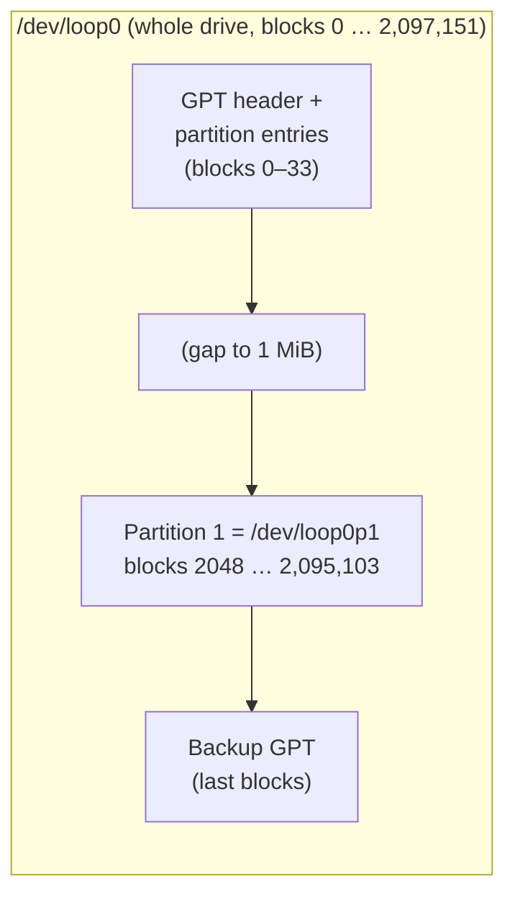
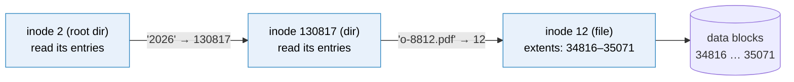
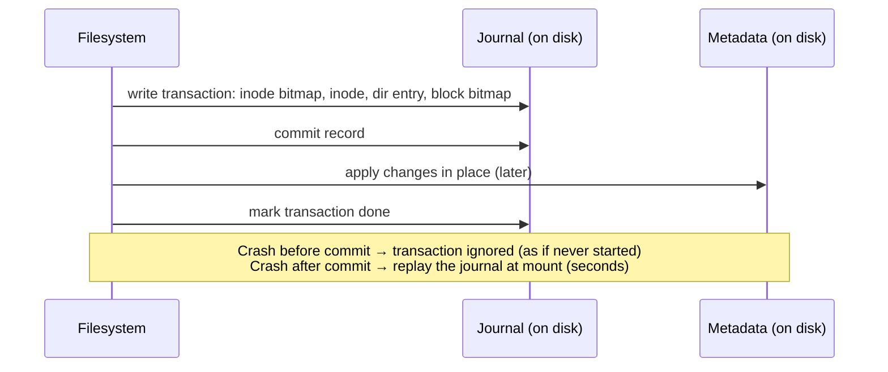

# Partitions and filesystems

> [!abstract] In one sentence
> A **partition** cuts one drive into independent ranges of blocks, and a **filesystem** is a data structure written into such a range that turns "numbered blocks" into **named files in directories**: it records, for every file, its metadata (owner, size, times) in an **inode**, which blocks hold its content, and in directories, which **name** points to which inode.

## Build-up: storing invoices on a raw drive

I start from where [[Storage devices]] ended: a fake 1 GiB drive `/dev/loop0` (a loop device over `~/disk.img`), and the shop wants to store invoice PDFs on it.

```bash
truncate -s 1G ~/disk.img
sudo losetup -fP --show ~/disk.img      # → /dev/loop0
```

### Stage 1: why raw blocks aren't enough

I could write each PDF into blocks myself and keep a notebook: "o-8812.pdf = blocks 2048–2303, 131,072 bytes". Very quickly I'd need:

| Need | Why |
|---|---|
| **Names** | Programs ask for `invoices/o-8812.pdf`, not block numbers |
| **Which blocks belong to which file** | Files are bigger than one block and rarely contiguous |
| **Exact size** | The last block is partly used |
| **Free space tracking** | Where can the next file go without overwriting another? |
| **Directories** | Grouping, nesting |
| **Metadata** | Owner, permissions, timestamps |
| **Crash safety** | Power cut halfway through an update must not corrupt everything |
| **Concurrency** | Two programs writing at once |

That notebook, stored **on the drive itself** in a standard format so any computer can read it, is a filesystem.

### Stage 2: partitions, splitting the drive first

Before the filesystem, I can split the drive into **partitions**: independent ranges of blocks, each of which can hold its own filesystem. A **partition table** at the start of the drive lists them. The modern format is **GPT** (GUID Partition Table): up to 128 partitions, a backup copy at the **end** of the drive, each entry with a start block, an end block, a type, and a unique ID. (The old **MBR** format: 4 primary partitions, 2 TiB maximum.) What these tables look like byte by byte, and why GPT replaced MBR: [[Partition tables (GPT and MBR)]].

```bash
sudo parted -s /dev/loop0 mklabel gpt mkpart invoices ext4 1MiB 100%
lsblk /dev/loop0
# NAME      SIZE TYPE
# loop0       1G loop
# └─loop0p1 1022M part

sudo parted /dev/loop0 unit s print
# Number  Start  End       Size      File system  Name      Flags
#  1      2048s  2095103s  2093056s               invoices
```

- The partition starts at sector **2048** (1 MiB): aligned for 4 KiB physical sectors and SSD pages
- The kernel creates `/dev/loop0p1`, a block device covering **only** that range. Block 0 of `loop0p1` is block 2048 of `loop0`



Why partition at all: a computer's boot drive needs an **EFI system partition** (FAT32, holding the bootloaders the firmware runs, see [[Booting from disk]]) besides the OS's own filesystem; separating `/` from data means one filling up doesn't kill the other; different partitions can use different filesystems. Cloud **data** volumes often skip partitioning and put the filesystem directly on `/dev/nvme1n1`, which makes growing them simpler.

### Stage 3: creating a filesystem (`mkfs`)

```bash
sudo mkfs.ext4 -L invoices /dev/loop0p1
# Creating filesystem with 261632 4k blocks and 65408 inodes
# Filesystem UUID: 5b3e…
# Superblock backups stored on blocks:
#         32768, 98304, 163840, 229376
# Allocating group tables: done
# Writing inode tables: done
# Creating journal (4096 blocks): done
```

`mkfs` ("make filesystem") writes the **empty structure** of an ext4 filesystem into the partition. What it laid out:

| Structure | What it records |
|---|---|
| **Superblock** | The filesystem's identity card: type, block size (4 KiB), total and free counts, UUID, label, state. Copied in several places, since losing it means losing everything |
| **Block groups** | The partition is divided into groups of 32,768 blocks (128 MiB), each with its own bookkeeping, so related data stays close |
| **Block bitmap** | One bit per block: used or free |
| **Inode bitmap** | One bit per inode: used or free |
| **Inode table** | A fixed number of **inodes** (65,408 here), decided **at mkfs time** |
| **Journal** | A log of pending metadata changes, for crash safety (Stage 7) |
| **Data blocks** | Everything else: file contents and directory contents |


To look inside, I mount it (what mounting does is the subject of [[Mounting]]):

```bash
sudo mkdir -p /mnt/invoices
sudo mount /dev/loop0p1 /mnt/invoices
sudo chown $USER /mnt/invoices
```

### Stage 4: what a file really is (the inode)

```bash
head -c 1M /dev/urandom > /mnt/invoices/o-8812.pdf
stat /mnt/invoices/o-8812.pdf
#   File: /mnt/invoices/o-8812.pdf
#   Size: 1048576     Blocks: 2048       IO Block: 4096   regular file
# Device: 259,1       Inode: 12          Links: 1
# Access: (0644/-rw-r--r--)  Uid: ( 1000/ shop)   Gid: ( 1000/ shop)
# Modify: 2026-10-03 14:32:07.000000000 +0100
```

The file is **inode 12**. An inode is a fixed-size record (256 bytes in ext4) holding:
- **Type** (regular file, directory, symlink, device…) and **permissions**
- **Owner** UID and GID (numbers, not names)
- **Size** in bytes, **timestamps** (access, modify, change, birth)
- **Link count**: how many names point to it (Stage 5)
- **Where the data is**: in ext4, a list of **extents** = "logical blocks 0–255 of this file are physical blocks 34816–35071"

What's **not** in the inode: the **file name**. Names live in directories. (The inode drawn field by field, block pointers vs extents, sparse files, and what a process holds: [[Inodes]].)

```bash
sudo debugfs -R "stat /o-8812.pdf" /dev/loop0p1 | grep -A1 EXTENTS
# EXTENTS:
# (0-255):34816-35071
```

1 MiB = 256 blocks of 4 KiB, stored contiguously starting at block 34816 of the partition. Reading the file = reading those blocks.

### Stage 5: what a directory really is

A directory is **also a file** (with its own inode), whose content is a **list of entries: name → inode number**. That's all.

```bash
mkdir /mnt/invoices/2026
mv /mnt/invoices/o-8812.pdf /mnt/invoices/2026/
ls -ia /mnt/invoices /mnt/invoices/2026
# /mnt/invoices:
#      2 .       11 lost+found      2 ..   130817 2026
# /mnt/invoices/2026:
# 130817 .         2 ..        12 o-8812.pdf
```

- The filesystem's root directory is always **inode 2** in ext4
- `.` is an entry pointing at the directory itself, `..` at its parent
- The `mv` didn't touch the PDF's data **at all**: it removed the entry `o-8812.pdf → 12` from directory 2 and added it to directory 130817. That's why a rename inside one filesystem is **instant** for a 50 GB file, and **atomic** (the trick behind safe config file updates in [[Inter-process communication#Stage 1: talking through a file]]). A move to **another** filesystem has to **copy** the data and delete the original

**Resolving a path, step by step.** `open("/mnt/invoices/2026/o-8812.pdf")`, once inside this filesystem:



Each step reads an inode and a directory's data blocks. The kernel caches the results (the **dentry cache**), so the next lookup of the same path doesn't touch the disk.

**Hard links**: two names, one inode.

```bash
ln /mnt/invoices/2026/o-8812.pdf /mnt/invoices/latest.pdf
stat -c '%i %h %n' /mnt/invoices/latest.pdf
# 12 2 /mnt/invoices/latest.pdf        ← same inode 12, link count 2
```

Deleting a name (`rm`) only removes an entry and decrements the link count. The inode and its blocks are freed when the count reaches **0 and no process has the file open**.

**Symbolic links** are different: a small file whose content is a **path** (`ln -s 2026/o-8812.pdf current.pdf`). It can cross filesystems, and it breaks if the target moves.

### Stage 6: writing a new file, step by step

`cp invoice.pdf /mnt/invoices/2026/o-8813.pdf` makes the filesystem:
1. Find a free inode in the **inode bitmap**, mark it used, fill in the inode (owner, mode, times)
2. Add the entry `o-8813.pdf → <new inode>` to the data of directory 130817
3. For the content: find free blocks in the **block bitmap**, mark them used, record the **extents** in the inode
4. Copy the data into those blocks, update the **size** and **mtime**

With the page cache in between (see [[Storage devices#Stage 4: between the program and the drive (the block layer and the page cache)]]), all of this first happens **in RAM**, and reaches the drive seconds later.

### Stage 7: the power cut (journaling)

Steps 1–4 touch **several** places on disk. If power fails after step 1 but before step 2, the inode is marked used but no directory points to it (leaked space). Worse orders can make a directory entry point to an inode that's marked free, and a later file gets the same inode: two names, mixed data.

The old fix was **`fsck`** at boot: walk **every** inode and directory to find and repair inconsistencies. On a multi-terabyte filesystem: hours.

**Journaling**: before changing metadata in place, the filesystem writes a **description of the whole change** to the **journal** (a reserved area), and marks it **committed**. Only then does it apply the changes to their real locations.



After a crash, mounting just **replays** committed transactions: seconds instead of hours, and metadata is always consistent. ext4's default (`data=ordered`) journals **metadata** and makes sure file **data** blocks are written before the metadata pointing at them, so a crash doesn't expose old garbage in a new file. Data that wasn't `fsync`ed can still be lost: journaling protects the **structure**, not unsaved content.

The full mechanism (crash cases, commit points, flushes, journal modes) and the same idea in databases, Kafka, Raft and RAID: [[Journaling]].

**Copy-on-write** filesystems (btrfs, ZFS) take another route: never overwrite in place, write new versions elsewhere and switch a pointer atomically. That also gives cheap **snapshots** and **checksums** of all data.

### Stage 8: choosing a filesystem

| Filesystem | Where | Strengths | Watch out |
|---|---|---|---|
| **ext4** | Debian/Ubuntu default | Mature, fast fsck, can grow and shrink | Inode count fixed at creation |
| **XFS** | RHEL, Amazon Linux default | Big files, parallel I/O, dynamic inodes | **Can't shrink** |
| **btrfs** | Fedora, openSUSE | Snapshots, checksums, compression, subvolumes | Some RAID modes still discouraged |
| **ZFS** | FreeBSD, TrueNAS, Ubuntu (module) | Checksums, snapshots, pooled storage, very robust | Out-of-tree on Linux, RAM hungry |
| **NTFS** | Windows | ACLs, journaling, MFT (see [[Windows vs Linux storage]]) | Linux support via ntfs3 |
| **FAT32 / exFAT** | USB sticks, SD cards, EFI partition | Readable everywhere | FAT32: **4 GiB max file size**, no permissions |
| **APFS** | macOS | Snapshots, encryption, copy-on-write | Apple only |

## Advanced problems

### 1. "No space left on device" with free space

`df -h` says 40% free, yet creating files fails. Check **inodes**:

```bash
df -i /mnt/invoices
# Filesystem    Inodes IUsed IFree IUse% Mounted on
# /dev/loop0p1   65408 65408     0  100% /mnt/invoices
```

Millions of tiny files (cache entries, session files) used every inode ext4 created at `mkfs` time. Fix: delete the small files, or re-create the filesystem with more inodes (`mkfs.ext4 -i 4096`), or use XFS (allocates inodes dynamically).

### 2. Deleted a 20 GB log, the space didn't come back

The file's name is gone, but a process still has it **open** (link count 0, open count 1): the inode and blocks stay allocated until it's closed.

```bash
sudo lsof +L1            # open files with link count 0
# nginx 1234 www-data 5w REG 259,1 21474836480 0 131090 /var/log/nginx/access.log (deleted)
```

Fix: restart/reload the process (or truncate through `/proc/1234/fd/5`). For log rotation, use `copytruncate` or signal the app to reopen its log (see [[Inter-process communication#Stage 3: signals, a tap on the shoulder]]).

### 3. ext4 is "full" at 95%

ext4 reserves **5%** of blocks for root by default, so system services can still write when users fill the disk. On a 2 TB data disk that's 100 GB unused. `sudo tune2fs -m 1 /dev/…` lowers it on data-only filesystems.

### 4. Growing a filesystem after enlarging the volume

A cloud volume or VM disk was enlarged from 100 to 200 GB, but `df` still shows 100. Three layers each need growing:

```bash
lsblk                                   # the disk shows 200G, the partition still 100G
sudo growpart /dev/nvme1n1 1            # 1. grow partition 1 to fill the disk (if there's a partition)
sudo resize2fs /dev/nvme1n1p1           # 2a. grow ext4 (works while mounted)
sudo xfs_growfs /srv/data               # 2b. or grow XFS (takes the mount point)
```

Shrinking is the hard direction: ext4 only offline, XFS never.

### 5. Corruption and `fsck`

A filesystem with real damage (bad sectors, a crash on hardware that lied about flushes) needs `fsck` (`e2fsck`, `xfs_repair`), and **only while unmounted**: repairing a mounted filesystem corrupts it further.

## In AWS
- An EBS volume arrives as a raw block device: **`mkfs` once** (a volume restored from a snapshot already has its filesystem, and running `mkfs` on it **erases** it)
- Growing: `modify-volume`, then `growpart` + `resize2fs`/`xfs_growfs` as above
- Amazon Linux uses **XFS** for the root volume

## Practice

> [!example]- Where is a file's name stored?
> In its directory's entries (name → inode number). The inode has everything else but no name.

> [!example]- Why is `mv` of a 50 GB file instant inside one filesystem but slow to another one?
> Inside: only directory entries change. Across: the data must be copied to the other filesystem's blocks.

> [!example]- `df -h` shows free space but files can't be created. What do I check?
> `df -i`: the inodes may be exhausted.

> [!example]- I deleted a huge log and no space was freed. Why?
> A process still has it open. `lsof +L1`, then restart or reopen logs.

> [!example]- What does a journal guarantee after a crash, and what not?
> Metadata stays consistent (replay committed transactions). Data that wasn't fsynced can still be lost.

> [!example]- A 200 GB EBS volume still shows 100 GB in `df`. Steps?
> `growpart` the partition (if any), then `resize2fs` (ext4) or `xfs_growfs` (XFS).

## Easy to get wrong
- Thinking the inode stores the file name
- Running `mkfs` on a volume that already has data (it erases the structure)
- Using `/dev/sdX` instead of UUIDs to refer to filesystems
- Forgetting ext4's inode count is fixed at creation
- Expecting space back after deleting a file that's still open
- Expecting XFS to shrink
- Running `fsck` on a mounted filesystem
- Believing journaling protects unsaved data (only structure)
- FAT32 for files over 4 GiB

## Related
- Before:: [[Storage devices]], [[Partition tables (GPT and MBR)]]
- Deep dives:: [[Inodes]], [[Journaling]], [[Booting from disk]] (ESP, firmware)
- Next:: [[Mounting]], [[How mounting works]]
- Other OS:: [[Windows vs Linux storage]]
- Sharing over the network:: [[NFS and SMB]], [[How network file sharing works]]
- Combining disks:: *[[LVM]]*, *[[RAID]]*
- Protecting data:: *[[Snapshots]]*, *[[Backups]]*
- Big picture:: *[[Block, file and object storage]]*, [[Storage]]

## Flashcards
#flashcards

What is a partition? :: An independent range of blocks on a drive, listed in a partition table, that can hold its own filesystem
GPT vs MBR? :: GPT: up to 128 partitions, huge disks, backup table at the end. MBR: 4 primary partitions, 2 TiB max
Why do partitions start at 1 MiB? :: Alignment with physical sectors and SSD pages
What is a filesystem? :: A data structure on a block device that maps named files and directories to blocks, with metadata
What does mkfs do? :: Writes an empty filesystem structure (superblock, bitmaps, inode table, journal) onto a device
What is a superblock? :: The filesystem's header: type, sizes, counts, UUID, state. Stored in several copies
What is an inode? :: A record with a file's type, permissions, owner, size, timestamps, link count and data block locations (no name)
Where is a file name stored? :: In a directory entry (name → inode number)
What is a directory? :: A file whose content is a list of name → inode entries
Root directory inode number in ext4? :: 2
Why is rename instant within one filesystem? :: Only directory entries change, the data isn't touched
What is a hard link? :: Another directory entry pointing to the same inode (link count increases)
Hard link vs symbolic link? :: Hard link: another name for the same inode, same filesystem. Symlink: a file containing a path, can cross filesystems
When are an inode's blocks freed? :: When its link count is 0 and no process has it open
What is an extent? :: A contiguous range: file blocks X–Y are stored in disk blocks A–B
What problem does journaling solve? :: Inconsistent metadata after a crash: committed changes are replayed, uncommitted ignored
What does ext4 data=ordered mean? :: Metadata is journaled, and data blocks are written before the metadata that points to them
"No space left" with free blocks? :: Inodes exhausted (check df -i)
How to find deleted files still holding space? :: lsof +L1
Can XFS be shrunk? :: No (ext4 can, offline)
Commands to grow a partition and ext4 filesystem? :: growpart <disk> <partition number>, then resize2fs
Why never fsck a mounted filesystem? :: Repairing while the kernel is using it causes more corruption
