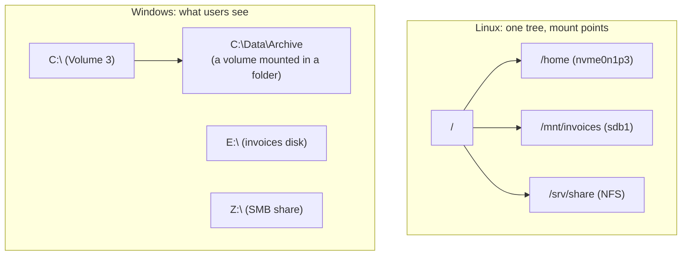
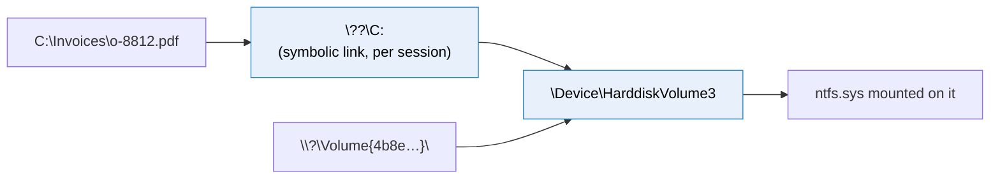
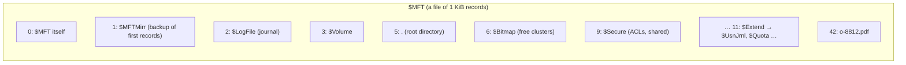
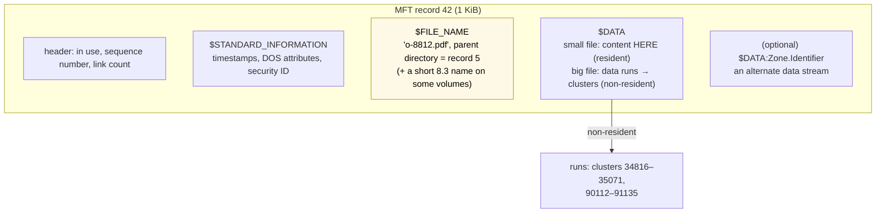
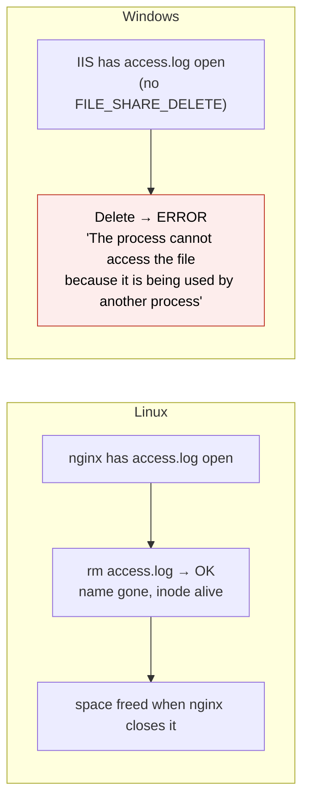
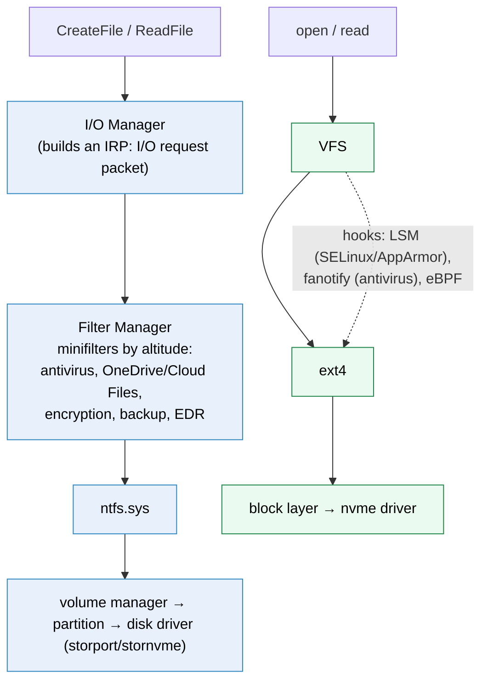

# Windows vs Linux storage

> [!abstract] The short answer
> Both sit on the same disks, the same GPT partition tables and the same UEFI boot, and both filesystems do the same jobs (per-file records, block maps, a journal). The differences are in **how things are named and exposed**: Windows gives each volume a **drive letter** (over an internal single namespace), keeps a file's metadata **and its name** in an **MFT record** in NTFS, protects files with **ACLs** tied to SIDs, **locks open files** against deletion, and mounts volumes **automatically and lazily**, while Linux grafts everything into **one tree** with explicit mounts, keeps names only in directories (inodes), uses mode bits (plus optional ACLs), lets you delete open files, and leaves policy to `fstab` and mount options.

The Linux side of each topic has its own note ([[Partition tables (GPT and MBR)]], [[Booting from disk]], [[Partitions and filesystems]], [[Inodes]], [[Journaling]], [[Mounting]], [[How mounting works]]). This note walks the same path on Windows and points out where the two differ, and why it matters when I run both (dual boot, mixed fleets, shared disks, file shares).

## Side by side

| | **Linux** | **Windows** |
|---|---|---|
| Partition table | GPT (MBR on old disks) | Same GPT/MBR. Windows-specific types: MSR, basic data, recovery |
| Disk naming | `/dev/nvme0n1`, `/dev/sda`, partitions `p1`/`1` | Disk **numbers** (`Disk 0`), `\\.\PhysicalDrive0`, `\Device\Harddisk0\Partition1` |
| Volume naming | Device path, UUID, LABEL | **Drive letter** `C:`, **volume GUID path** `\\?\Volume{…}\`, folder mount point |
| Namespace for users | **One tree** from `/` | One root **per letter** (internally one object namespace) |
| Main filesystems | ext4, XFS, btrfs, ZFS | **NTFS**, **ReFS** (servers), FAT32/exFAT (removable) |
| Per-file record | Inode (no name) | **MFT file record** (includes the name) |
| Small files | Inline data (optional) | **Resident data** inside the MFT record |
| Block map | Extents | **Data runs** (same idea) |
| Journal | ext4 JBD2 (physical), XFS log (logical) | `$LogFile` (logical, redo + undo) + **USN change journal** |
| Permissions | Owner/group/other mode bits, optional POSIX ACLs, numeric UID/GID | **ACLs** (DACL of ACEs) with inheritance, **SIDs** |
| Names | Case-**sensitive**, any byte except `/` and NUL | Case-**insensitive** (case-preserving), forbidden `\ / : * ? " < > \|`, reserved names (`CON`, `NUL`, `COM1`…) |
| Separator | `/` | `\` (most APIs accept `/` too) |
| Open file deletion | Allowed: name goes, inode lives until closed | Usually **refused** ("file is in use") unless opened with delete sharing |
| Links | Hard links, symlinks | Hard links, symlinks (privilege or Developer Mode), **junctions**, all via **reparse points** except hard links |
| Mounting | Explicit `mount`, `/etc/fstab` | **Mount Manager**, automatic; letters stored in the registry |
| Filesystem plug-in model | VFS + drivers, FUSE | I/O Manager + filesystem drivers + **filter drivers** (antivirus, OneDrive) |
| Repair | `fsck` / `e2fsck` / `xfs_repair` (unmounted) | `chkdsk` (online scan, fixes at reboot for the system volume), NTFS self-healing |
| Volume management | LVM, mdadm, ZFS/btrfs pools | Dynamic disks (legacy), **Storage Spaces** |
| Snapshots | LVM, btrfs, ZFS snapshots | **VSS** (Volume Shadow Copy) |
| Disk encryption | LUKS (dm-crypt) | **BitLocker** |
| Boot | GRUB/systemd-boot from the ESP, initramfs | `bootmgfw.efi` from the ESP, BCD, winload |

## What they share

- The **hardware view**: drives as numbered blocks, the same NVMe/SATA devices, the same 1 MiB alignment (see [[Storage devices]])
- **GPT** and the **EFI system partition** (a Windows ESP and a Linux ESP are the same thing, and dual-boot machines share one, see [[Booting from disk]])
- The core filesystem ideas: a record per file, extents/runs, directories as indexes, a journal for metadata, a free-space bitmap, a page cache with lazy writeback (Windows calls it the **cache manager**), and `fsync` equivalents (`FlushFileBuffers`)

## Where they actually differ

### 1. Disks, partitions, volumes

On Windows, a **disk** becomes a **volume** that gets a **letter**. The tools:

```powershell
Get-Disk                                     # disk numbers, size, PartitionStyle (GPT/MBR/RAW)
Get-Partition -DiskNumber 1                  # partitions, types, drive letters
Get-Volume                                   # filesystems, labels, free space (≈ df + lsblk -f)

# Prepare a new data disk (≈ parted + mkfs + mount)
Initialize-Disk -Number 1 -PartitionStyle GPT
New-Partition -DiskNumber 1 -UseMaximumSize -DriveLetter E
Format-Volume -DriveLetter E -FileSystem NTFS -NewFileSystemLabel invoices
```

Or `diskpart` (`list disk`, `select disk 1`, `create partition primary`, `format fs=ntfs quick`, `assign letter=E`) and the **Disk Management** console (`diskmgmt.msc`).

Volume management:

| Need | Linux | Windows |
|---|---|---|
| Combine disks, resize volumes | LVM | **Storage Spaces** (pools of disks → virtual disks with simple/mirror/parity), or legacy **dynamic disks** (deprecated) |
| Software RAID | mdadm, LVM RAID | Storage Spaces mirror/parity |
| Pooled filesystem | ZFS, btrfs | ReFS on Storage Spaces |

### 2. Naming and the "one tree" question

What a program sees:



Underneath, Windows **also** has one namespace, the kernel's **object manager**. `C:` is just a symbolic link in it:



- A **volume GUID path** `\\?\Volume{GUID}\` names a volume whatever its letter. It's what Windows uses internally and what to use in scripts that must survive letter changes (the Windows counterpart of `UUID=` in fstab)
- A volume can be mounted in an **empty NTFS folder** instead of (or as well as) a letter: `mountvol C:\Data\Archive \\?\Volume{…}\` or `Add-PartitionAccessPath`. That's the Linux model, available but rarely used
- `mountvol` with no argument lists volumes and their mount points

### 3. Mounting: automatic and lazy

| Step | Linux | Windows |
|---|---|---|
| A new disk appears | Device node `/dev/sdb` created (udev). **Nothing mounted** on servers (desktops auto-mount via udisks) | Mount Manager assigns a GUID path and, by default, the **next free letter** (if the partition type is recognised) |
| Persistence | `/etc/fstab` lines | Registry `HKLM\SYSTEM\MountedDevices`: letter ↔ volume identity |
| When the filesystem is read | At `mount` time (superblock, journal replay) | At **first access**: the I/O manager asks each filesystem driver "is this yours?" (they read the boot sector), and the first one to recognise it mounts it, linked by a **VPB** (volume parameter block) |
| Unmount | `umount`, refuses if busy | "Safely remove", `mountvol E: /p`, or dismount via `fsutil volume dismount E:` |
| Policy per mount | Options (`ro`, `noexec`…) | Mostly per volume/ACL; group policy can block executables or removable drives |

On servers and in the cloud, a disk that comes **offline** or without a letter (SAN policy "offline shared" or a disk that collides with another's signature) is the Windows version of "the mount that didn't happen": `Get-Disk | Where IsOffline` and `Set-Disk -IsOffline $false`. Under the hood: [[How mounting works#On Windows]].

### 4. NTFS inside: the MFT

NTFS's central structure is the **Master File Table**: a table of **1 KiB file records**, one per file and directory. Unlike ext4's fixed inode table, the MFT is **itself a file** (`$MFT`, record 0) and grows as needed.



The first records are **metafiles**: NTFS stores its own bookkeeping as ordinary files with reserved names, so the same code reads and grows them.

Inside one file record, everything is an **attribute**:



Compared with ext4 ([[Inodes]]):

| | ext4 inode | NTFS MFT record |
|---|---|---|
| Size | 256 B | 1 KiB (4 KiB on 4Kn disks) |
| Name inside | **No** (only in the directory) | **Yes**, in `$FILE_NAME` (one per hard link), **plus** in the parent directory's index |
| Small files | Inline data (optional feature) | **Resident `$DATA`**: files of a few hundred bytes live entirely in the record |
| Block map | Extents | Data runs (cluster ranges) |
| Directory | List or hashed tree of entries | **B+ tree index** (`$I30`) of names, sorted |
| Count | Fixed at mkfs | Grows (the MFT is a file), reserved **MFT zone** to limit fragmentation |
| Extra streams | Extended attributes (small) | **Alternate data streams**: a file can have several named `$DATA` attributes |

Because the name is in the record too, NTFS tools can rebuild paths from the MFT alone (forensics, `chkdsk`), and directory listings can show size and dates from the index without opening each record.

**Alternate data streams** are a Windows-only surprise: `o-8812.pdf:Zone.Identifier` is a hidden second stream where browsers record "downloaded from the internet" (the source of the "this file came from another computer" warning). `dir /r` or `Get-Item -Stream *` shows them. They vanish when the file is copied to FAT or a Linux filesystem, and malware has used them to hide content.

### 5. Journaling: $LogFile and the USN journal

NTFS has **two** journals with different jobs (the general idea is in [[Journaling]]):

| | `$LogFile` | USN change journal (`$Extend\$UsnJrnl`) |
|---|---|---|
| Purpose | Crash consistency of metadata | A record of **which files changed and how** |
| Like | ext4's JBD2, but **logical** with **redo and undo** records (database-style) | A change feed |
| Read by | NTFS itself at mount after a crash | Backup software (incremental without scanning), Windows Search indexer, DFS Replication, antivirus |
| Linux counterpart | ext4/XFS journal | No direct one: `inotify`/`fanotify` are live events, not a persistent log |

```powershell
fsutil usn queryjournal C:
fsutil usn readjournal C: csv | Select-Object -First 5
```

The USN journal shows the same pattern seen in databases' change data capture: a durable log of changes lets other systems follow along without rescanning everything.

### 6. Permissions: ACLs vs mode bits

```text
Linux:   -rw-r----- 1 shop finance   o-8812.pdf
         owner rw, group r, others nothing. 9 bits + owner UID + group GID.

Windows: icacls C:\Invoices\o-8812.pdf
         C:\Invoices\o-8812.pdf  SHOP\Finance:(I)(R)
                                 SHOP\alice:(I)(M)
                                 NT AUTHORITY\SYSTEM:(I)(F)
                                 BUILTIN\Administrators:(I)(F)
         (I) = inherited from the folder, R = read, M = modify, F = full control
```

| | Linux | Windows |
|---|---|---|
| Model | Mode bits (owner/group/other × rwx), optional POSIX ACLs (`setfacl`) | **DACL**: an ordered list of allow/deny **ACEs**, ~14 fine-grained rights |
| Identity | Numeric **UID/GID**, meaning depends on the machine (`/etc/passwd`, LDAP) | **SID**: globally unique (`S-1-5-21-…-1104`), domain-wide |
| Inheritance | None for mode bits (default ACLs exist) | Built in: folders pass ACEs down to new children |
| Auditing | auditd rules | **SACL** entries on the object itself |
| Tools | `chmod`, `chown`, `setfacl`, `getfacl` | `icacls`, `Get-Acl`/`Set-Acl`, Security tab |

This is the root of most cross-OS trouble: Linux mounting NTFS has to **invent** owners and modes (mount options `uid=`, `gid=`, `umask=` with ntfs3, or a user mapping), Windows reading a Linux NFS export sees numeric UIDs, and Samba spends a lot of effort translating between the two (see [[NFS and SMB]]).

### 7. Open files: why Windows says "file in use"

On Linux, deleting or replacing an open file always works: the name goes away, the inode stays until closed (see [[Inodes#What a process actually holds]]). On Windows, opening a file specifies a **share mode** (`FILE_SHARE_READ`, `FILE_SHARE_WRITE`, `FILE_SHARE_DELETE`), and most programs don't grant delete sharing:



Consequences:
- **Updates need reboots** on Windows more often: in-use DLLs and EXEs can't be replaced, so they're scheduled for replacement at the next boot (`PendingFileRenameOperations`). Linux replaces the file by rename and old processes keep running the old inode
- Log rotation on Windows must close and reopen, or use tools aware of share modes
- Finding the culprit: **Resource Monitor** (CPU tab → Associated Handles) or Sysinternals `handle.exe`, the counterparts of `lsof` / `fuser`
- Backups can't simply read files that are open with exclusive access: that's what **VSS** solves (section 9)

### 8. Names and paths

| | Linux | Windows |
|---|---|---|
| `Invoice.pdf` vs `invoice.pdf` | Two different files | **Same** file (NTFS can be made case-sensitive per directory: `fsutil file setCaseSensitiveInfo`, used by WSL) |
| Forbidden | `/`, NUL | `\ / : * ? " < > \|`, trailing dot or space |
| Reserved names | None | `CON`, `PRN`, `AUX`, `NUL`, `COM1`…`COM9`, `LPT1`…, even with an extension (`nul.txt`) |
| Max path | 4096 bytes (PATH_MAX), 255 per name | 260 chars (`MAX_PATH`) for many APIs, unless long paths are enabled or `\\?\` prefixes are used; 255 per name |
| Encoding | Bytes (usually UTF-8) | UTF-16 |

Real problems this causes: a Git repo with `README` and `readme` breaks on Windows; a Linux file named `aux.c` or `report:v2.txt` can't be checked out on Windows; deep `node_modules` hit the 260 limit.

### 9. Links, snapshots, encryption, repair

| | Linux | Windows |
|---|---|---|
| Hard link | `ln a b` | `mklink /H b a` (files only, same volume) |
| Symlink | `ln -s target link` | `mklink link target` (`/D` for directories): needs admin or Developer Mode |
| Directory redirect | bind mount | **Junction** (`mklink /J`): local directories only, no privilege needed |
| Mechanism | Separate inode types | **Reparse points**: a tag on a file/dir that a filter or the filesystem interprets (symlinks, junctions, mount points, OneDrive placeholders, dedup) |
| Snapshots | LVM/btrfs/ZFS snapshots | **VSS**: copy-on-write shadow copies, with **writers** (SQL Server, Exchange, AD) that flush and freeze for application consistency. Powers "Previous Versions", Windows Backup, most backup agents |
| Disk encryption | LUKS (passphrase, keyfile, TPM via systemd-cryptenroll) | **BitLocker** (TPM sealed to measured boot, recovery key) |
| Per-file encryption | fscrypt | EFS |
| Repair | `fsck` while **unmounted** | `chkdsk C: /scan` **online**, `/f` fixes (the system volume is scheduled for next boot). NTFS also **self-heals** some corruption in the background |

VSS is the Windows answer to the question asked in the *[[Snapshots]]* roadmap item: crash-consistent vs application-consistent. A VSS writer is the application saying "I've flushed my state, freeze now".

### 10. The filesystem driver model

Both kernels route file operations through a generic layer to a filesystem driver (Linux: the VFS, see [[Mounting#Stage 3: what the kernel does (the VFS)]]). Windows adds a formal, stackable layer of **filter drivers** between the I/O Manager and the filesystem:



`fltmc filters` lists the minifilters on a Windows machine. They explain a lot of "Windows file I/O is slow" reports: every open of every small file passes through antivirus and other filters (the classic case: `git status` or `npm install` on a big tree), something Linux setups rarely have.

### 11. Moving data between the two

| Need | Works | Watch out |
|---|---|---|
| USB stick / SD card for both | **exFAT** (no 4 GiB limit), FAT32 for old devices | No permissions, no journal (exFAT) |
| Linux reads/writes NTFS | `ntfs3` kernel driver (since 5.15), or `ntfs-3g` (FUSE) | Windows **Fast Startup** / hibernation leaves NTFS "in use": Linux mounts it **read-only** or refuses. Disable Fast Startup on dual boot |
| Windows reads ext4 | Not natively. `wsl --mount \\.\PhysicalDrive1 --partition 1` mounts it inside WSL 2 | |
| Shared folders over the network | **SMB** (both, Samba on Linux), NFS (Windows client is v3 only) | Permission translation, see [[NFS and SMB]] |
| One disk for two OSes simultaneously | **Never** (two kernels, two caches, see [[How mounting works#Why it matters, in one table]]) | |

## Command translation

| Task | Linux | Windows |
|---|---|---|
| List disks/partitions | `lsblk`, `fdisk -l` | `Get-Disk`, `Get-Partition`, `diskpart list disk` |
| Filesystems, labels, UUIDs | `lsblk -f`, `blkid` | `Get-Volume`, `mountvol` |
| Free space | `df -h` | `Get-Volume`, `Get-PSDrive` |
| Partition | `parted`, `gdisk`, `sgdisk` | `New-Partition`, `diskpart` |
| Format | `mkfs.ext4`, `mkfs.xfs` | `Format-Volume`, `format E: /fs:ntfs` |
| Mount | `mount`, `/etc/fstab` | Automatic, `mountvol`, `Add-PartitionAccessPath`, `Set-Partition -NewDriveLetter` |
| Unmount | `umount` | `mountvol E: /p`, "Safely remove" |
| Grow | `growpart` + `resize2fs`/`xfs_growfs` | `Resize-Partition -Size (Get-PartitionSupportedSize …).SizeMax` (grows NTFS too) |
| Check/repair | `fsck`, `e2fsck`, `xfs_repair` | `chkdsk`, `Repair-Volume` |
| Who has a file open | `lsof`, `fuser` | Resource Monitor, `handle.exe` |
| Permissions | `chmod`, `chown`, `setfacl` | `icacls`, `Set-Acl`, `takeown` |
| Links | `ln`, `ln -s` | `mklink` (`/H`, `/D`, `/J`) |
| Boot entries | `efibootmgr` | `bcdedit` |
| Disk encryption | `cryptsetup` | `manage-bde`, BitLocker panel |
| Filesystem info | `dumpe2fs -h`, `xfs_info` | `fsutil fsinfo ntfsinfo C:` |

## If you have to choose

- Removable media for both → **exFAT**
- Windows system and data volumes → **NTFS**; large Hyper-V / Storage Spaces Direct deployments → ReFS
- Linux servers → ext4 or XFS (see [[Partitions and filesystems#Stage 8: choosing a filesystem]])
- Files shared by Windows and Linux users → an **SMB** share on one server (Windows or Samba), never a block disk mounted on both
- Dual boot → share the ESP, keep separate OS partitions, disable Windows Fast Startup, exchange data through an NTFS or exFAT partition

## In AWS
- A new EBS volume on a Windows instance shows up **offline** or uninitialised in Disk Management: bring it online, initialise GPT, format NTFS (the Windows counterpart of `mkfs` + mount + fstab on Linux)
- Windows AMIs use the ESP + NTFS layout; **FSx for Windows File Server** is managed SMB with NTFS ACLs and Active Directory, while [[EFS]] is NFS for Linux only
- EBS snapshots of Windows instances are crash-consistent unless taken with **VSS** (AWS offers VSS-enabled snapshots through Systems Manager), the same distinction as in [[Journaling#In AWS]]

## Practice

> [!example]- Where is a file's name stored in NTFS, and how does that differ from ext4?
> In the MFT record's `$FILE_NAME` attribute and in the parent directory's index. ext4 keeps it only in the directory entry; the inode has no name.

> [!example]- Why can't I delete a log file a Windows service has open, when Linux lets me?
> Windows opens files with share modes and most programs don't allow delete sharing. Linux separates names from inodes, so removing a name doesn't affect an open file.

> [!example]- What's the Windows equivalent of `UUID=` in fstab?
> The volume GUID path `\\?\Volume{GUID}\`; letters are mapped to volumes in the registry's MountedDevices.

> [!example]- What is the USN journal for, given NTFS already has $LogFile?
> $LogFile keeps metadata consistent across crashes. The USN journal records which files changed, so backup, indexing and replication can process changes without scanning the volume.

> [!example]- Linux mounts the dual-boot NTFS partition read-only. Likely cause?
> Windows Fast Startup or hibernation left the volume marked in use. Disable Fast Startup and shut Windows down fully.

> [!example]- What does a VSS writer add to a snapshot?
> Application consistency: the application (SQL Server, Exchange) flushes and freezes its data at the snapshot instant, instead of a crash-consistent state.

## Easy to get wrong
- Thinking Windows has no single namespace (drive letters are links in the object manager)
- Assuming NTFS stores names like ext4 (it stores them in the record too)
- Copying files with alternate data streams to non-NTFS media and losing them
- Expecting chmod-style permissions to survive the trip to Windows (or ACLs to Linux)
- Case-only renames and case-conflicting files in cross-platform repos
- Reserved names (`con`, `aux`, `nul`) from Linux breaking Windows checkouts
- Windows Fast Startup on dual boot
- Mounting the same disk from Windows and Linux at once (a VM and its host, for example)
- Forgetting that antivirus filter drivers make small-file I/O slow on Windows

## Related
- The Linux side, topic by topic:: [[Partition tables (GPT and MBR)]], [[Booting from disk]], [[Partitions and filesystems]], [[Inodes]], [[Journaling]], [[Mounting]], [[How mounting works]]
- Sharing between them:: [[NFS and SMB]], [[How network file sharing works]]
- Data protection:: *[[Snapshots]]*, *[[Encryption at rest]]*, *[[Backups]]*
- Area:: [[Storage]]

## Flashcards
#flashcards

How does Windows name volumes for users? :: Drive letters (C:), or folder mount points; internally volume GUID paths
What is a volume GUID path? :: \\?\Volume{GUID}\, a stable name for a volume regardless of its letter
What is C: really in the Windows kernel? :: A symbolic link in the object manager to \Device\HarddiskVolumeN
Where does Windows persist drive letter assignments? :: Registry HKLM\SYSTEM\MountedDevices
When does Windows actually mount a filesystem? :: Lazily, at first access: filesystem drivers are asked to recognise the volume, linked via a VPB
What is the MFT? :: NTFS's Master File Table: 1 KiB records, one per file/directory, itself stored as the file $MFT
Is the file name stored in an NTFS MFT record? :: Yes, in $FILE_NAME (and also in the parent directory's index)
What is resident data in NTFS? :: Small file content stored inside the MFT record itself
What are NTFS data runs? :: Cluster ranges holding a non-resident file's data, the equivalent of extents
What is an alternate data stream? :: An extra named $DATA attribute on an NTFS file (e.g. :Zone.Identifier)
What is NTFS $LogFile? :: Its metadata journal, logical with redo and undo records
What is the NTFS USN journal? :: A persistent log of file changes used by backup, indexing and replication
Windows ACL vs Linux mode bits? :: DACL of allow/deny ACEs with SIDs and inheritance vs owner/group/other rwx with numeric UID/GID
Why does Windows refuse to delete open files? :: Files are opened with share modes and most programs don't grant FILE_SHARE_DELETE
Why do Windows updates need reboots more often? :: In-use executables and DLLs can't be replaced; replacement is scheduled at boot
Linux lsof equivalent on Windows? :: Resource Monitor handles, or Sysinternals handle.exe
What is a reparse point? :: An NTFS tag interpreted by a filter/filesystem: symlinks, junctions, mount points, cloud placeholders
Junction vs symlink on Windows? :: Junction: local directory redirect, no privilege. Symlink: files or dirs, any target, needs privilege or Developer Mode
What is VSS? :: Volume Shadow Copy: copy-on-write snapshots with writers for application-consistent backups
Windows equivalent of LVM/mdadm? :: Storage Spaces (dynamic disks are legacy)
chkdsk vs fsck? :: chkdsk can scan online and fixes the system volume at reboot; fsck runs on unmounted filesystems
Filesystem for a USB stick used by Windows and Linux? :: exFAT
Why does Linux mount a dual-boot NTFS read-only? :: Windows Fast Startup/hibernation left it marked in use
How to mount ext4 from Windows? :: wsl --mount (WSL 2), no native driver
What are Windows minifilters? :: Stackable filter drivers (antivirus, OneDrive, encryption) between the I/O manager and the filesystem; list with fltmc filters
