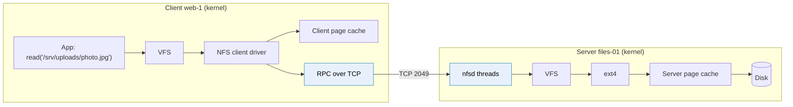
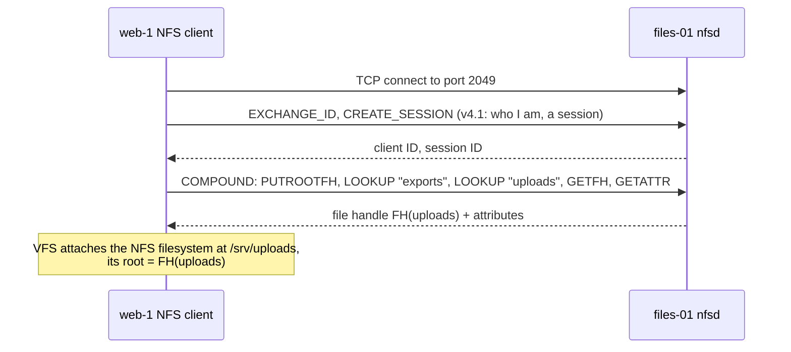
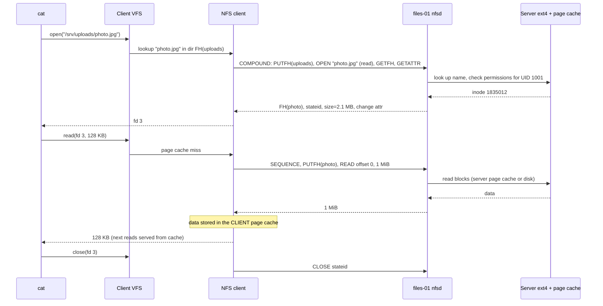
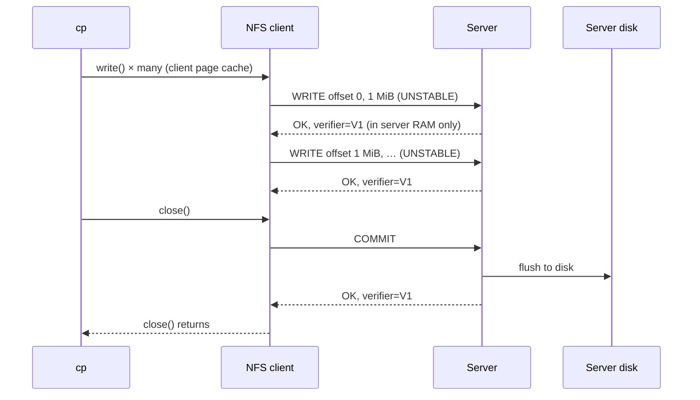

# How network file sharing works

> [!abstract] In one sentence
> A network file system is a **filesystem driver on the client** that, instead of reading blocks from a local disk, turns every file operation (look up a name, open, read, write, close, lock) into a **request to a server**, which performs it on **its own local filesystem** and sends back the result; **file handles** identify files between them, and client **caching**, server **leases** and **locks** keep it fast and mostly consistent across many clients.

## Build-up: following one file across the network

The setup, from [[NFS and SMB]]:
- **Server** `files-01` (`10.0.5.10`): an ext4 filesystem on its own disk, mounted at `/exports`, with `/exports/uploads` exported over NFSv4.1
- **Client** `web-1` (`10.0.2.15`): `mount -t nfs4 files-01:/exports/uploads /srv/uploads`

The prerequisites, in order: a drive is numbered blocks ([[Storage devices]]), a filesystem turns blocks into inodes and directories ([[Partitions and filesystems]]), and mounting plugs a filesystem driver into the VFS ([[Mounting]]). Here the driver plugged into the VFS on `web-1` is the **NFS client**. It has no disk: its "disk" is a TCP connection.



### Stage 1: the language: RPC calls

NFS is built on **RPC** (Remote Procedure Call, the ONC RPC standard): the client sends a message meaning "call procedure X with these arguments", the server runs it and sends back the result. Arguments are encoded in a portable binary format (**XDR**) so machines with different CPUs agree on the bytes. Each call also carries **credentials**: with the default `AUTH_SYS`, simply the client user's **UID and GID numbers** (this is where NFS's "the server trusts the client's numbers" comes from, see [[NFS and SMB#Stage 2: who is allowed to write? (NFS permissions)]]), or a Kerberos ticket with `sec=krb5`.

NFSv4 groups several operations into one **COMPOUND** request, so a path lookup plus attribute fetch costs one round trip instead of several. Typical operations:

| Operation | Meaning |
|---|---|
| `PUTROOTFH`, `PUTFH` | "The following operations apply to the server's root / to this file handle" |
| `LOOKUP name` | Find `name` in the current directory, the current handle becomes that object's |
| `GETFH` | Return the current file handle |
| `GETATTR` | Size, owner, mode, times, **change attribute** |
| `ACCESS` | "Could this user read/write/execute this?" |
| `OPEN` / `CLOSE` | Stateful open (v4), returns a **stateid** |
| `READ` / `WRITE` | Offset + length, up to `rsize`/`wsize` (often 1 MiB) |
| `COMMIT` | "Make my earlier writes durable on your disk" |
| `READDIR` | Directory entries (with attributes in one go) |
| `LOCK` / `LOCKU` | Byte-range locks |
| `SEQUENCE` | (v4.1) First op of every request in a session: ordering, exactly-once replies, lease renewal |

### Stage 2: mounting: getting the first file handle

`mount -t nfs4 files-01:/exports/uploads /srv/uploads` does, on the wire:



The client now holds the **file handle** of the exported directory. Everything else starts from it.

### Stage 3: file handles: how a file is named between client and server

A **file handle** is an opaque blob of bytes (up to 128 in v4) the server gives the client to identify a file or directory. The client never interprets it, just sends it back. Internally, a Linux server builds it from:
- which exported **filesystem** (an fsid)
- the file's **inode number** on that filesystem
- the inode's **generation number** (incremented when an inode number is reused for a new file)

This is the big difference from a local filesystem: after the lookup, the client **doesn't send paths** for operations, it sends handles. Consequences:
- Renaming a file on the server doesn't break a client that has it open (same inode, same handle)
- If the file is **deleted and the inode reused** (new generation), or the server's filesystem is **replaced/restored** (different fsid or inodes), the old handle is meaningless: the server answers **`NFS4ERR_STALE`**, and the app sees **"Stale file handle"** (see [[NFS and SMB#1. Stale file handle]])

### Stage 4: reading a photo, step by step

`cat /srv/uploads/photo.jpg` on `web-1`:



Points worth noticing:
- The **name lookup** happens on the **server**, in its own filesystem (ext4 directory entries, exactly like [[Partitions and filesystems#Stage 5: what a directory really is]])
- **Permission checks** happen on the server, using the UID/GID sent in the RPC
- The client reads **big chunks** (`rsize`, 1 MiB) and keeps them in its **own page cache**: the next `cat` of the same file may not touch the network at all
- There are **two** page caches: the server's (avoids disk reads) and the client's (avoids network round trips)

### Stage 5: writing, and when the data is really safe

`cp new.jpg /srv/uploads/` on `web-1`:
1. `OPEN` with create → the server creates the inode and directory entry on ext4
2. The app's `write()` calls fill the **client's page cache** (dirty pages) and return immediately
3. The client sends `WRITE` requests in `wsize` chunks, usually **UNSTABLE**: the server puts the data in **its** page cache and replies without waiting for its disk
4. On `close()` (or `fsync()`), the client flushes remaining dirty pages, then sends **`COMMIT`**: the server writes everything to its disk and confirms
5. `CLOSE`



The **write verifier** is a value that changes when the server **reboots**. If the client's COMMIT comes back with a different verifier, the server crashed and lost the unstable data, so the client **resends** everything not yet committed. That's how NFS keeps writes safe across a server crash without making every write synchronous.

So: data is **durable on the server** after `close()` or `fsync()` returns, not after `write()`.

### Stage 6: two clients, one file (caching and consistency)

`web-1` saves `photo.jpg`. `web-2` serves it a moment later. Does `web-2` see the new version?

Each client caches **attributes** (size, mtime, change attribute) for a few seconds (`acregmin` 3 s up to `acregmax` 60 s for files, 30–60 s for directories) and **data** pages for as long as the attributes say the file hasn't changed. Without care, `web-2` could serve a stale cached copy.

NFS's rule is **close-to-open consistency**:
- When a client **closes** a file, it flushes and commits its changes (Stage 5)
- When a client **opens** a file, it **revalidates** with the server (`GETATTR`); if the change attribute moved, it drops its cached data

So if `web-1` writes and **closes**, and **then** `web-2` **opens**, `web-2` sees the new content. What's **not** guaranteed:
- A file **kept open** on `web-2` while `web-1` changes it: `web-2` may read stale cached data for a while
- **Directory listings**: a new file may not appear in `ls` on `web-2` for up to the directory attribute cache time
- Two clients **writing the same file** at the same time without locks: interleaved or lost writes

`actimeo=0` / `noac` disable attribute caching (more correct, much slower: every operation becomes a network call).

### Stage 7: state on the server: leases, delegations, locks

NFSv3 servers were **stateless**: every request stood alone, locks were handled by separate side protocols. NFSv4 servers keep **state** (who has which file open, which locks), and need to know when a client has **died** so they can release its state. That's the **lease**:
- Each client must contact the server at least every **lease period** (90 s on Linux by default). Any request counts (v4.1's `SEQUENCE` renews it); idle clients send a keepalive
- A client silent for longer than the lease is considered **dead**: its opens and **locks are released**, so a crashed `web-1` can't hold a lock forever

**Locks** (`LOCK`/`LOCKU`) are byte-range, held by the server, tied to the lease. After a **server reboot**, the server enters a **grace period** (about one lease time) during which clients **reclaim** their previous locks, and new locks/opens wait: applications see a pause of a minute or so after a server restart.

**Delegations**: when only one client uses a file, the server can **delegate** it: "you're the only one, cache reads (and writes) locally without checking with me". If another client wants the file, the server **recalls** the delegation with a **callback**. In NFSv4.0 that callback is a **new connection from the server to the client**, which NAT and firewalls block (the [[Outbound-initiated connections]] problem); the server then just doesn't grant delegations. NFSv4.1 fixed it with a **backchannel** on the client's own connection.

### Stage 8: when the network breaks

The switch between `web-1` and `files-01` reboots for 40 seconds.
- With a **hard** mount, the NFS client keeps **retransmitting** (every `timeo` tenths of a second, `retrans` times, then logs "server not responding, still trying" and keeps going). Programs touching the mount block in uninterruptible sleep (`D` state)
- When the network returns, the client reconnects, replays what wasn't acknowledged (with **exactly-once** semantics in v4.1 sessions, so a retried non-idempotent operation like `CREATE` isn't executed twice), and programs continue as if nothing happened
- With a **soft** mount, after the retries the operation fails with `EIO`, which apps rarely handle well

`noresvport` makes the client reconnect from a **new** source port, which avoids reconnection getting stuck on the old connection's state in middleboxes; managed services like EFS recommend it.

### Stage 9: the same shape in SMB

SMB (Windows file sharing, see [[NFS and SMB#Stage 3: the accounting team on Windows (SMB)]]) follows the same pattern with different words. The client driver is the **redirector** (`mrxsmb` on Windows, `cifs.ko` on Linux):

| Step | NFSv4.1 | SMB 2/3 |
|---|---|---|
| Connect | TCP 2049, `EXCHANGE_ID` + `CREATE_SESSION` | TCP 445, `NEGOTIATE` (pick dialect, e.g. 3.1.1) |
| Authenticate | Per RPC: UID/GID or Kerberos | `SESSION_SETUP`: the **user** logs in (Kerberos/NTLM) |
| Pick the share | Mount gives the export's root handle | `TREE_CONNECT \\server\share` |
| Open a file | `OPEN` → file handle + stateid | `CREATE` → **FileId** |
| Read/write | `READ`/`WRITE`, `COMMIT` | `READ`/`WRITE`, `FLUSH` |
| Client caching | Close-to-open, delegations | **Oplocks / leases** (server tells the client when to stop caching) |
| Batching | `COMPOUND` | Compounded requests, **credits** for flow control |
| Integrity/encryption | Kerberos `krb5i`/`krb5p` | **Signing**, SMB 3 **encryption** |

## Looking at it for real

```bash
# client statistics: how many READ, WRITE, GETATTR, COMMIT…
nfsstat -c
mountstats /srv/uploads          # per-mount: ops, retransmissions, average RTT per operation

# capture the conversation and open it in Wireshark (it decodes NFS and SMB)
sudo tcpdump -i any -s 0 -w nfs.pcap port 2049
ls -l /srv/uploads > /dev/null   # generate some traffic, then Ctrl-C tcpdump

# on the server: threads and exports
cat /proc/fs/nfsd/threads
sudo exportfs -v
```

Watching a single `ls -l` in Wireshark is the fastest way to make all of this concrete: one `READDIR`, then `GETATTR`s, each with handles and attributes.

## Advanced problems

### 1. `ls -l` on a big directory takes 30 seconds

`ls -l` needs attributes for every entry. Over NFS that's `READDIR` plus attribute data (v4 can return attributes with the listing, v3 has `READDIRPLUS`), but very large directories still mean many round trips, and an attribute cache that expires every few seconds means doing it again. Fixes: don't put 500,000 files in one directory (hash into subdirectories), use plain `ls` (no attributes) in scripts, raise attribute cache times where staleness is acceptable.

### 2. A file another server just wrote isn't visible

Directory attribute caching: the listing on the reader is up to ~30–60 s old. Opening the file **by name** usually works (the lookup revalidates), listing may not. Apps that poll a shared directory for new files should expect delay, or use a queue to announce files instead (see [[SQS]]).

### 3. Locks lost after a network partition

`web-1` holds a lock, gets cut off longer than the lease (90 s), the server releases the lock and `web-2` takes it. When `web-1` comes back it believes it still holds the lock. NFSv4 reports the lost state to the client (operations fail with an error), but apps that don't check can corrupt data. Use locks over NFS only for coordination that tolerates this, or a real coordination service.

### 4. Lots of small files are slow

Creating one small file costs several round trips (OPEN/create, WRITE, COMMIT, CLOSE, plus GETATTRs). At 1 ms RTT, 50,000 files is close to a minute of pure waiting, whatever the bandwidth. Bundle small files (tar), or keep that workload on local disks.

## Practice

> [!example]- On an NFS client, which component turns `read()` into network traffic?
> The NFS client filesystem driver behind the VFS, which sends RPC `READ` requests over TCP to the server.

> [!example]- What is a file handle, and why does "stale file handle" happen?
> An opaque server-issued identifier (fsid + inode + generation) the client uses instead of paths. It goes stale when the inode is deleted/reused or the exported filesystem is replaced.

> [!example]- When is data written on an NFS client durable on the server?
> After `close()` or `fsync()` returns: the client flushes and the server COMMITs to disk. `write()` alone only fills caches.

> [!example]- web-1 writes and closes a file. web-2 then opens it. Does web-2 see the new data? What if web-2 had it open all along?
> Yes after open (close-to-open consistency revalidates). If it was already open, web-2 may read stale cached data for a while.

> [!example]- What happens to a crashed client's NFSv4 locks?
> The server releases them when the client's lease expires (about 90 s without contact).

> [!example]- Why might NFSv4.0 delegations not work behind NAT, and how did 4.1 fix it?
> Recalls are callbacks from the server to the client on a new connection, blocked by NAT. NFSv4.1 sends callbacks on a backchannel over the client's own connection.

> [!example]- In SMB, which steps correspond to NFS's mount and OPEN?
> TREE_CONNECT to the share (after NEGOTIATE and SESSION_SETUP), then CREATE to open a file (returns a FileId).

## Easy to get wrong
- Thinking the client reads the server's disk blocks (it sends file operations; the server's filesystem does the block I/O)
- Thinking clients send paths for every operation (they send file handles)
- Assuming `write()` means the server has the data on disk (COMMIT on close/fsync)
- Expecting instant visibility of other clients' changes (attribute caching, close-to-open)
- Forgetting that permission checks happen on the server with the UID the client sends
- Assuming NFSv4 is stateless like v3 (leases, opens, locks, grace periods)
- Expecting server callbacks to cross NAT (v4.0)
- Treating NFS locks as bulletproof across network partitions

## Related
- Before:: [[Storage devices]], [[Partitions and filesystems]], [[Mounting]]
- Configuring it:: [[NFS and SMB]]
- Network concepts:: [[Sockets]], [[Outbound-initiated connections]] (callbacks and NAT), [[Network layers]]
- In AWS:: [[EFS]]
- Area:: [[Storage]]

## Flashcards
#flashcards

What is a network file system, mechanically? :: A client filesystem driver that sends file operations to a server, which runs them on its own local filesystem
What does NFS use to call operations on the server? :: ONC RPC with XDR-encoded arguments, over TCP 2049
What is an NFSv4 COMPOUND? :: Several operations (PUTFH, LOOKUP, GETATTR…) in one request, one round trip
What credentials does an NFS RPC carry with AUTH_SYS? :: The client user's numeric UID and GIDs
What is an NFS file handle? :: An opaque server-issued identifier for a file, typically fsid + inode number + generation
Does an NFS client send paths for READ/WRITE? :: No, file handles (paths are only resolved with LOOKUP)
Where are permission checks done in NFS? :: On the server, using the credentials in the RPC
What is the client page cache's role in NFS? :: Caching file data read from the server so repeated reads skip the network
What is an UNSTABLE write? :: A WRITE the server acknowledges from memory, made durable later by COMMIT
What does COMMIT do? :: Tells the server to flush previously written data to its disk
What is the NFS write verifier for? :: Detecting a server reboot so the client resends uncommitted writes
What is close-to-open consistency? :: Changes are flushed on close and revalidated on open, so a later open sees an earlier close's data
What is an NFSv4 lease? :: The period (90 s default) a client must renew; if it lapses, its state and locks are released
What is the NFS grace period? :: After a server restart, a window where clients reclaim locks and new locks wait
What is an NFSv4 delegation? :: The server lets one client cache a file locally until it recalls it with a callback
Why can't NFSv4.0 callbacks cross NAT? :: The server opens a new connection to the client. v4.1 uses a backchannel on the client's connection
SMB equivalent of mounting an export? :: TREE_CONNECT to \\server\share (after NEGOTIATE and SESSION_SETUP)
SMB equivalent of NFS OPEN? :: CREATE, returning a FileId
How do you see NFS operations per mount? :: mountstats <mountpoint> (or nfsstat -c)
Why are many small files slow over NFS? :: Each file costs several round trips (open/create, write, commit, close, getattr)
