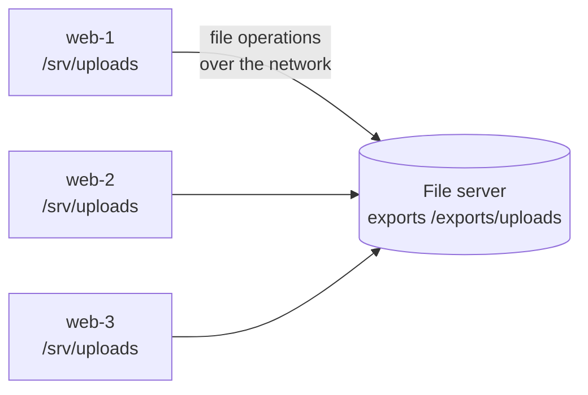

# NFS and SMB

> [!abstract] In one sentence
> NFS and SMB are the two protocols for **sharing a filesystem over the network**: a server exports a directory, many clients **mount** it and see ordinary files and folders. **NFS** comes from the Unix world (Linux mounts it natively), **SMB** from Windows (Windows mounts it natively, as a "network drive"); each OS can speak the other's protocol only partially, which is why "which clients will mount this?" decides the protocol before anything else.

## Build-up: a shared folder for the shop

The shop's web servers store customer uploads (product photos, invoices) on their local disks. With three servers behind a load balancer, a photo uploaded through server 1 doesn't exist on servers 2 and 3: a customer sees the photo, refreshes, lands on another server, and it's gone.

Options:
- **Object storage** (upload to a bucket, serve by URL): the best answer for new apps, but this app reads and writes **files** with normal file calls (`open()`, `rename()`, directories), and rewriting it isn't on the table this month
- **A shared filesystem**: one directory that every server mounts at `/srv/uploads`. The app doesn't change at all

That's what NFS and SMB provide. The storage side is a **file server** (or a NAS appliance, or a cloud service); the clients send file operations (open, read, write, lock, list directory) over the network instead of to a local disk.



Compared with the other ways to hand out storage: **block** storage (a disk over the network, iSCSI, see *[[iSCSI and SAN]]*) gives one machine a raw disk it formats itself, and two machines can't safely mount a normal filesystem on it at once. **File** storage like NFS/SMB is built for **many clients at the same time**: the server owns the filesystem and arbitrates.

### Stage 1: NFS between Linux machines

The file server `files-01` (`10.0.5.10`) exports a directory in `/etc/exports`:

```
/exports/uploads   10.0.2.0/24(rw,sync,root_squash)
```

```bash
sudo exportfs -ra            # apply
showmount -e files-01        # what's exported (NFSv3)
```

Each web server installs the NFS client (`nfs-utils` on RHEL/Amazon Linux, `nfs-common` on Debian/Ubuntu) and mounts it:

```bash
sudo mount -t nfs4 -o nfsvers=4.1,hard,timeo=600,retrans=2 files-01:/exports/uploads /srv/uploads
```

and makes it permanent in `/etc/fstab`:

```
files-01:/exports/uploads  /srv/uploads  nfs4  nfsvers=4.1,hard,_netdev,nofail  0 0
```

`_netdev` tells the boot process to wait for the network; `nofail` lets the machine boot even if the server is down.

**NFS versions** matter, because clients and servers must agree:

| Version | Transport | Notable |
|---|---|---|
| NFSv3 | TCP or UDP, port 2049 **plus** helper services (portmapper 111, mountd, lockd) on other ports | Stateless server, simple, still everywhere. Painful through firewalls (many ports) |
| **NFSv4.0 / 4.1** | TCP, **one port: 2049** | Stateful (opens, locks, leases built in), firewall-friendly, Kerberos security, 4.1 adds sessions and parallel NFS |

### Stage 2: who is allowed to write? (NFS permissions)

A file written by web-1 shows up on web-2 owned by `1001`, a user that doesn't exist there, and the app on web-2 gets "Permission denied".

Classic NFS (with `AUTH_SYS`, the default) **trusts the client's numbers**: the client says "I'm UID 1001, GID 1001", and the server applies normal Unix permissions to those numbers. No password, no user names. So:
- The **same user must have the same UID/GID on every client** (the `shop` user is UID 1001 everywhere, via config management or a directory like LDAP)
- Anyone who is **root on a client** could claim any UID. That's why exports default to **`root_squash`**: requests from root are mapped to the unprivileged `nobody` user. `no_root_squash` is a classic security hole
- Access is also restricted by **client IP/network** in the export, which is weak: it's only as strong as the network

For real authentication, NFSv4 supports **Kerberos** (`sec=krb5`, `krb5i` for integrity, `krb5p` for encryption), where users prove who they are.

### Stage 3: the accounting team on Windows (SMB)

The finance team needs the invoices folder as a drive on their Windows laptops. Windows' native file sharing protocol is **SMB** (Server Message Block; "CIFS" is the old SMB1 dialect's name):

```powershell
net use Z: \\files-01\invoices /persistent:yes
# or in Explorer: "Map network drive" → \\files-01\invoices
```

On the Linux server, **Samba** serves SMB:

```ini
# /etc/samba/smb.conf
[invoices]
   path = /exports/invoices
   read only = no
   valid users = @finance
```

SMB differs from NFS in what matters to administrators:

| | NFS | SMB |
|---|---|---|
| Native on | Linux/Unix | **Windows** (also macOS, Linux via `cifs-utils`) |
| Port | 2049 (v4) | **445** |
| Who's who | Client-asserted UID/GID (`AUTH_SYS`) or Kerberos | **User logs in**: Active Directory (Kerberos) or NTLM, a session per user |
| Permissions | Unix mode bits (+ NFSv4 ACLs) | **Windows ACLs** (NTFS-style, per user and group) |
| Encryption on the wire | Kerberos `krb5p`, or a TLS tunnel | **SMB 3** encryption |
| Typical use | Linux servers, containers, HPC | Windows desktops and servers, home directories, departmental shares |

Linux mounting the SMB share (for a reporting script):

```bash
sudo mount -t cifs //files-01/invoices /mnt/invoices -o username=reporter,vers=3.1.1
```

### Stage 4: can Windows mount NFS, and Linux mount SMB?

Both can, **partly**, and the gaps are exactly where cross-platform designs break:

| Client | Mounts SMB? | Mounts NFS? |
|---|---|---|
| **Linux** | Yes (`cifs-utils`), works well | Yes, native, all versions |
| **Windows** | Yes, native | Only with the optional **Client for NFS** feature, which supports **NFSv2/v3 only**, not NFSv4, with awkward UID mapping |
| **macOS** | Yes, native | Yes |

So a service that **only speaks NFSv4** (like some cloud file services) **can't be mounted from Windows at all**: Windows' NFS client stops at v3, and the service doesn't speak SMB. Windows clients need an **SMB** share, or a server that speaks **both** protocols on the same data (NetApp-style multi-protocol storage, Samba + NFS on one Linux server).

## Advanced problems

### 1. "Stale file handle"

`ls /srv/uploads` → `Stale file handle`. The client holds a reference (a handle) to a file or directory that **no longer exists on the server** in the same form: it was deleted and recreated, the export was moved, or the server's filesystem was replaced/restored. Fix: unmount and remount (`umount -l` if busy), and avoid replacing exported directories underneath clients.

### 2. Hard vs soft mounts

- **`hard`** (default, recommended): if the server disappears, programs touching the mount **hang** and retry forever until it comes back. No silent data loss, but processes stuck in `D` state
- **`soft`**: operations **fail with an error** after retries. Processes don't hang, but a write that "failed" may have been partially applied, and apps rarely handle I/O errors well: **data corruption risk**

Use `hard` for anything written, with sensible `timeo`/`retrans` so a failover is waited out.

### 3. Locking and caching across clients

Two servers append to the same log file on NFS and lines get mixed or lost. Clients **cache** attributes and data for a few seconds (`actimeo`), and locks are **advisory** (only programs that ask for locks respect them). Shared files written by several clients at once need proper locking (`flock`/`fcntl`, which NFSv4 implements via the server) or, better, a design where each client writes its own files. SMB uses **oplocks/leases** to tell clients when to drop their caches, which makes it more consistent for office-style sharing but chattier.

### 4. Slow with many small files

A shared filesystem pays a **network round trip** for metadata operations (open, stat, list) that a local disk does in microseconds. `npm install` or unzipping 50,000 small files onto NFS can be 10–100× slower than on a local disk. Keep build directories, caches and databases on **local or block storage**; use the share for content that's really shared.

### 5. Databases on network file shares

Running PostgreSQL or MySQL data directories on NFS/SMB: latency on every fsync, locking semantics the database doesn't expect, corruption risk after network blips. Databases want **block** storage.

## In the cloud

| Need | AWS service |
|---|---|
| NFS for Linux clients, fully managed, elastic size | **EFS** (NFSv4.0/4.1 only, Linux only: see [[EFS]]) |
| SMB for Windows clients, Active Directory, Windows ACLs | **FSx for Windows File Server** |
| NFS **and** SMB (and iSCSI) on the same data, Windows and Linux together | **FSx for NetApp ONTAP** |
| High-performance NFS (ZFS features) | FSx for OpenZFS |
| HPC parallel filesystem | FSx for Lustre |

## Practice

> [!example]- Three web servers behind a load balancer each store uploads on their own disk. What's the quickest fix that needs no code change?
> Mount one shared filesystem (NFS for Linux) at the same path on all servers.

> [!example]- Can a Windows machine mount an NFSv4-only file share?
> No. Windows' built-in Client for NFS supports only NFSv2/v3. It needs SMB, or a server that speaks NFSv3 or SMB.

> [!example]- Files written on web-1 appear as owned by 1001 on web-2 and the app can't read them. Why?
> NFS (AUTH_SYS) uses numeric UIDs/GIDs. The user must have the same UID/GID on every client.

> [!example]- What does `root_squash` do?
> Maps requests from a client's root user to `nobody`, so root on a client isn't root on the share.

> [!example]- NFSv3 vs NFSv4 through a firewall?
> v4 uses only TCP 2049. v3 also needs portmapper (111) and dynamic helper ports.

> [!example]- hard or soft mount for an upload directory?
> hard: programs wait for the server instead of getting errors that can leave partial writes.

## Easy to get wrong
- Expecting Windows to mount NFSv4 natively (its NFS client is v3 only)
- Different UIDs for the same user on different NFS clients
- `no_root_squash` on exports
- Trusting client-IP restrictions as real authentication
- `soft` mounts for data that's written
- Missing `_netdev` / `nofail` in fstab: boot hangs or fails when the server is down
- Putting databases, build caches or millions of tiny files on a network share
- Forgetting NFSv3's extra ports in firewall rules
- Replacing an exported directory under mounted clients (stale handles)
- Calling SMB "CIFS" and enabling SMB1 (old, insecure)

## Related
- Alternatives:: *[[Block, file and object storage]]*, *[[iSCSI and SAN]]*, *[[Object storage]]*, [[S3]]
- Underneath:: *[[Partitions and filesystems]]*, [[Sockets]] (ports 2049, 445)
- Security:: [[Security groups]], *[[Encryption at rest]]*
- In AWS:: [[EFS]]
- Area:: [[Storage]]

## Flashcards
#flashcards

What do NFS and SMB do? :: Share a filesystem over the network so many clients mount the same files
Which OS is NFS native to, and SMB? :: NFS: Linux/Unix. SMB: Windows
Port used by NFSv4? :: TCP 2049 only
Port used by SMB? :: TCP 445
Why is NFSv3 harder through firewalls? :: It needs portmapper (111) and dynamic helper ports in addition to 2049
How does classic NFS identify users? :: The client sends numeric UID/GID (AUTH_SYS), the server trusts them
What does root_squash do? :: Maps root on a client to the nobody user on the server
How does SMB authenticate users? :: Each user logs in (Active Directory Kerberos or NTLM)
Which NFS versions does Windows' built-in Client for NFS support? :: NFSv2 and NFSv3 only, not NFSv4
Can Windows mount an NFSv4-only share? :: No: it needs SMB or NFSv3
What Linux package mounts SMB shares? :: cifs-utils (mount -t cifs)
What Linux package mounts NFS on RHEL/Amazon Linux? :: nfs-utils (nfs-common on Debian/Ubuntu)
What serves SMB from Linux? :: Samba
What causes "Stale file handle"? :: The client references a file/directory the server no longer has in that form. Remount
hard vs soft NFS mount? :: hard: hangs and retries until the server returns (safe). soft: returns errors after retries (risk of corruption)
Why are network file shares slow for many small files? :: Every metadata operation is a network round trip
fstab options for network mounts? :: _netdev (wait for network) and nofail (boot even if unavailable)
