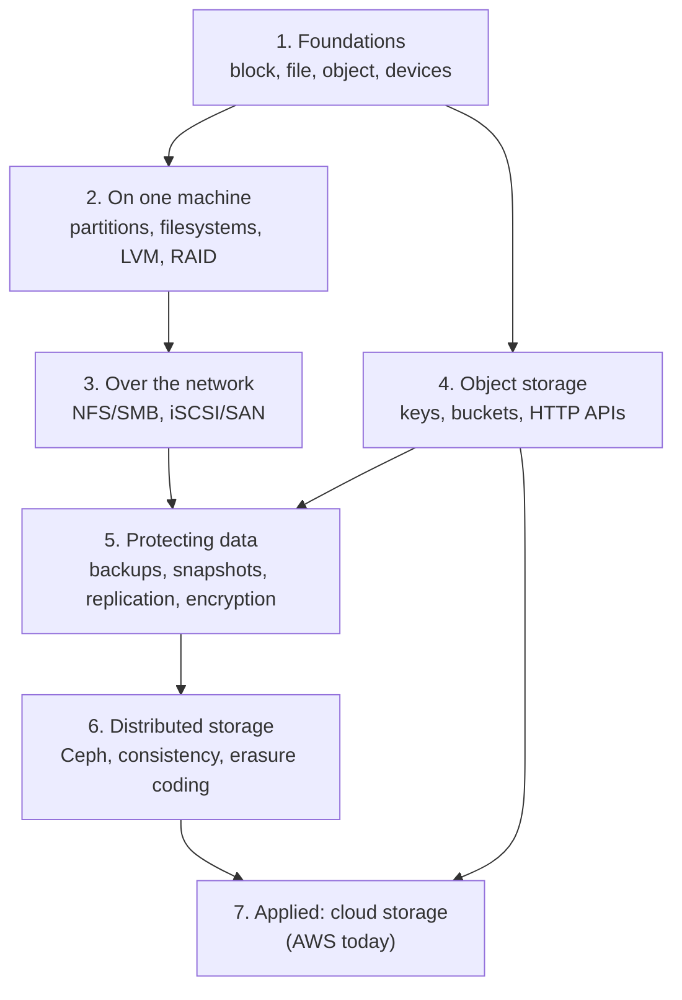

# Storage

> What this covers: storage as a **systems engineer** needs it: where bytes actually live, how a machine turns a disk into files, how storage is shared over the network, how data is kept safe when disks, servers, whole sites or people fail, and how to reason about performance when "the disk is slow". Vendor-neutral first. Clouds (AWS today) are one place it's applied, not the frame.

## How to use this

Read the sections **top to bottom**: each one assumes the ones above it. Links in *italics* are notes I haven't written yet (the roadmap). For now the only real note is the AWS one at the end, so this page is mostly my plan.



## 1. Foundations
- *[[Block, file and object storage]]*: the three ways to hand out storage, what each one gives the client (raw blocks, a filesystem, whole objects over HTTP), and when I'd pick which. **The map everything else hangs on**
- *[[Storage devices]]*: HDD vs SSD vs NVMe, what a "block" and a "sector" are, why random I/O hurts spinning disks
- *[[Storage performance]]*: IOPS vs throughput vs latency, queue depth, block size, why "500 MB/s" and "3 000 IOPS" are different promises, measuring with `fio` and `iostat`

## 2. On one machine
- *[[Partitions and filesystems]]*: partition tables (GPT), ext4/XFS/btrfs, inodes, mounting, `/etc/fstab`, "disk full" with free space (inodes, deleted-but-open files)
- *[[LVM]]*: volume groups and logical volumes, growing a volume without downtime
- *[[RAID]]*: RAID 0/1/5/6/10, what each one survives, rebuild times and why RAID isn't a backup

## 3. Over the network
- *[[NFS and SMB]]*: sharing a filesystem with many machines, locking, permissions, the "stale file handle" kind of problems
- *[[iSCSI and SAN]]*: sharing raw block devices over the network, why only one machine may mount a normal filesystem on one

## 4. Object storage
- *[[Object storage]]*: flat key → object namespaces, metadata, HTTP APIs, consistency, why "folders" are fake, the S3 API as the de facto standard (MinIO, Ceph RGW, other clouds speak it)

## 5. Protecting data
- *[[Backups]]*: 3-2-1, RPO and RTO, full/incremental/differential, **testing restores**, immutable backups against ransomware
- *[[Snapshots]]*: copy-on-write, crash-consistent vs application-consistent, why a snapshot on the same storage isn't a backup
- *[[Storage replication]]*: synchronous vs asynchronous, what it protects against (hardware, sites) and what it copies faithfully (deletes, corruption)
- *[[Encryption at rest]]*: disk-level (LUKS), filesystem-level, application-level, who holds the keys

## 6. Distributed storage
- *[[Distributed storage]]*: spreading data across many servers, replicas vs erasure coding, consistency trade-offs, Ceph as the example

## 7. Applied: cloud storage (AWS today)
Every concept above shows up here under a product name. The general idea is in the sections above, the notes below are about how one provider packages it.
- [[S3]]: object storage. Buckets, keys, storage classes and lifecycle, versioning and Object Lock, replication, who can access what (IAM, bucket policies, Block Public Access, KMS), presigned URLs, CloudFront, gateway endpoints, and the 403s I'll debug
- Not written yet: *[[EBS]]* (block volumes for EC2, volume types, snapshots) · *[[EFS]]* (managed NFS) · *[[AWS Backup]]*

## Related areas
- [[Networking]]: everything in section 3 runs over it, and S3 traffic goes through NAT gateways or VPC endpoints
- [[AWS]]: the applied notes live there

## Weakest first
```dataview
TABLE WITHOUT ID file.link AS Note, type AS Type, confidence AS Conf
FROM ""
WHERE topic = this.file.name AND confidence
SORT confidence ASC
```

## Open questions
- Where do databases fit? Probably their own area later (RDS, DynamoDB, how a database uses the disk), with only the disk side here. For now [[RDS]] lives in the AWS area
- How do EBS snapshots end up "in S3" (my [[EC2]] note says so) when I can't see them in any bucket?
